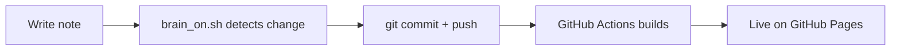
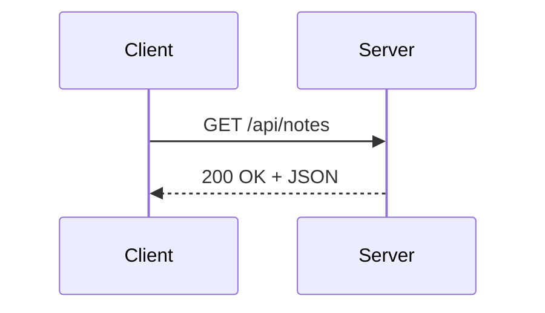

# Cheatsheet

Each section shows the syntax followed by a live preview.

---

## Alerts

````markdown
> [!NOTE]
> General info the reader should not miss.
````

> [!NOTE]
> General info the reader should not miss.

````markdown
> [!TIP]
> Helpful suggestion.
````

> [!TIP]
> Helpful suggestion.

````markdown
> [!IMPORTANT]
> Must-know info.
````

> [!IMPORTANT]
> Must-know info.

````markdown
> [!WARNING]
> Could cause problems.
````

> [!WARNING]
> Could cause problems.

````markdown
> [!CAUTION]
> Risk of harm or data loss.
````

> [!CAUTION]
> Risk of harm or data loss.

---

## Details

````markdown

Hidden content revealed on click.

````


Hidden content revealed on click.


````markdown

Visible immediately.

````


Visible immediately.


---

## Tabs

````markdown


```go
fmt.Println("hello")
```


```python
print("hello")
```


```rust
println!("hello");
```


````



```go
fmt.Println("hello")
```


```python
print("hello")
```


```rust
println!("hello");
```



---

## Steps

````markdown


1. **Install Hugo**

   Download the extended binary from gohugo.io.

2. **Clone the repo**

   `git clone git@github.com:tamnd/brain.git`

3. **Run locally**

   `hugo server`


````



1. **Install Hugo**

   Download the extended binary from gohugo.io.

2. **Clone the repo**

   `git clone git@github.com:tamnd/brain.git`

3. **Run locally**

   `hugo server`



---

## Badge

````markdown




````






---

## Mermaid diagrams

````markdown

````


````markdown

````


---

## KaTeX math

Inline:

```markdown
$E = mc^2$
```

$E = mc^2$

Block (centered):

```markdown
$$
\int_0^\infty e^{-x^2}\,dx = \frac{\sqrt{\pi}}{2}
$$
```

$$
\int_0^\infty e^{-x^2}\,dx = \frac{\sqrt{\pi}}{2}
$$

---

## Code blocks

````markdown
```go
package main

import "fmt"

func main() {
    fmt.Println("hello, brain")
}
```
````

```go
package main

import "fmt"

func main() {
    fmt.Println("hello, brain")
}
```

```python
def greet(name: str) -> str:
    return f"hello, {name}"
```

```sql
SELECT title, date
FROM notes
WHERE tags @> ARRAY['go']
ORDER BY date DESC;
```

```bash
hugo server --buildDrafts --buildFuture
```

---

## Markdown quick reference

### Text

| Syntax | Result |
|--------|--------|
| `**bold**` | **bold** |
| `*italic*` | *italic* |
| `` `code` `` | `code` |
| `~~strike~~` | ~~strike~~ |

### Links

```markdown
[external](https://gohugo.io)
[internal]()
```

[external](https://gohugo.io)

### Task list

```markdown
- [x] Published cheatsheet
- [x] Added dark mode toggle
- [ ] Write more notes
```

- [x] Published cheatsheet
- [x] Added dark mode toggle
- [ ] Write more notes

### Table

```markdown
| Left | Center | Right |
|:-----|:------:|------:|
| a    |   b    |     c |
| 1    |   2    |     3 |
```

| Left | Center | Right |
|:-----|:------:|------:|
| a    |   b    |     c |
| 1    |   2    |     3 |

### Footnote

```markdown
This is a claim.[^source]

[^source]: The source for this claim.
```

This is a claim.[^source]

[^source]: The source for this claim.

---

## Front matter reference

```yaml
---
title: "Note title"
date: 2026-05-02
weight: 1                    # sidebar order, lower = higher
tags: ["go", "db"]
draft: false

math: true                   # enable KaTeX on this page
---
```
