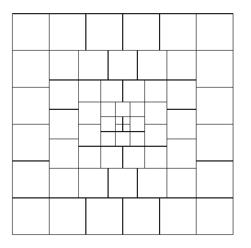

[Section 1.2.1: Mathematical Induction](../)

**Exercise 8.** &#9654; [*25*] (a) Prove the following theorem of Nicomachus (A.D. c. 100) by induction: $1^3 = 1$, $2^3 = 3 + 5$, $3^3 = 7 + 9 + 11$, $4^3 = 13 + 15 + 17 + 19$, etc. (b) Use this result to prove the remarkable formula $1^3 + 2^3 + \cdots + n^3 = (1 + 2 + \cdots + n)^2$.

[*Note:* An attractive geometric interpretation of this formula, suggested by Warren Lushbaugh, is shown in Fig. 5; see *Math. Gazette* **49** (1965), 200. The idea is related to Nicomachus’s theorem and Fig. 3. Other “look-see” proofs can be found in books by Martin Gardner, *Knotted Doughnuts* (New York: Freeman, 1986), Chapter 16; J. H. Conway and R. K. Guy, *The Book of Numbers* (New York: Copernicus, 1996), Chapter 2.]

$$
\begin{aligned}
\text{Side} &= 5 + 5 + 5 + 5 + 5 + 5 = 5 \cdot (5 + 1) \\
\text{Side} &= 5 + 4 + 3 + 2 + 1 + 1 + 2 + 3 + 4 + 5 \\
&= 2 \cdot (1 + 2 + \cdots + 5) \\
\text{Area} &= 4 \cdot 1^2 + 4 \cdot 2 \cdot 2^2 + 4 \cdot 3 \cdot 3^2 + 4 \cdot 4 \cdot 4^2 + 4 \cdot 5 \cdot 5^2 \\
&= 4 \cdot (1^3 + 2^3 + \cdots + 5^3)
\end{aligned}
$$

  
  

**Fig. 5.** Geometric version of exercise 8(b).

**Verified:** yes  
**Solve time:** 4m50s  

---

## Solution

### (a)

For each positive integer \(n\), let
\[
B_n=\sum_{j=1}^{n}\bigl(n(n-1)+2j-1\bigr).
\]
Thus \(B_n\) is the sum of the \(n\) consecutive odd numbers beginning with \(n(n-1)+1\). We prove by induction that
\[
B_n=n^3.
\]

For \(n=1\),
\[
B_1=1=1^3.
\]

Now suppose that \(B_n=n^3\) for some positive integer \(n\). The first \(n\) terms of \(B_{n+1}\) exceed the corresponding terms of \(B_n\) by \(2n\), since
\[
\bigl(n(n+1)+2j-1\bigr)-\bigl(n(n-1)+2j-1\bigr)=2n.
\]
The remaining term of \(B_{n+1}\) is
\[
n(n+1)+2(n+1)-1=n^2+3n+1.
\]
Consequently,
\[
\begin{aligned}
B_{n+1}
&=B_n+n(2n)+(n^2+3n+1)\\
&=n^3+2n^2+n^2+3n+1\\
&=(n+1)^3.
\end{aligned}
\]
Therefore, by mathematical induction,
\[
\boxed{n^3=\bigl(n(n-1)+1\bigr)+\bigl(n(n-1)+3\bigr)+\cdots+\bigl(n(n+1)-1\bigr)}
\]
for every positive integer \(n\). The successive cases are
\[
1^3=1,\qquad 2^3=3+5,\qquad 3^3=7+9+11,\qquad 4^3=13+15+17+19.
\]

### (b)

We first prove by induction that the sum of the first \(m\) odd positive integers is
\[
1+3+\cdots+(2m-1)=m^2.
\]
The assertion holds for \(m=1\). If it holds for \(m\), then
\[
1+3+\cdots+(2m-1)+(2m+1)
=m^2+2m+1
=(m+1)^2.
\]
Hence it holds for every positive integer \(m\).

The odd numbers occurring in the identity for \(k^3\) begin with
\[
k(k-1)+1
\]
and end with
\[
k(k+1)-1.
\]
For \(k=1,2,\ldots,n\), these blocks are consecutive and disjoint. Indeed, the last odd number in the \(k\)-th block is \(k(k+1)-1\), while the first odd number in the \((k+1)\)-st block is
\[
(k+1)k+1=k(k+1)+1.
\]
Thus the blocks for \(1^3,2^3,\ldots,n^3\) together contain precisely the first
\[
1+2+\cdots+n=\frac{n(n+1)}2
\]
odd positive integers. Therefore,
\[
\begin{aligned}
1^3+2^3+\cdots+n^3
&=1+3+\cdots+\left(2\cdot\frac{n(n+1)}2-1\right)\\
&=\left(\frac{n(n+1)}2\right)^2\\
&=(1+2+\cdots+n)^2.
\end{aligned}
\]
Hence
\[
\boxed{1^3+2^3+\cdots+n^3=(1+2+\cdots+n)^2}.
\]

This completes the proof. ∎
