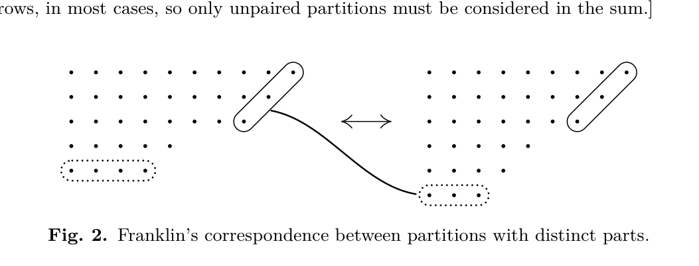

[Section 5.1.1: Inversions](../)

**Exercise 14.** [*M22*] (F. Franklin.) A partition of $n$ into $k$ distinct parts is a representation $n = p_1 + p_2 + \cdots + p_k$, where $p_1 > p_2 > \cdots > p_k > 0$. For example, the partitions of 7 into distinct parts are $7$, $6+1$, $5+2$, $4+3$, $4+2+1$. Let $f_k(n)$ be the number of partitions of $n$ into $k$ distinct parts; prove that $\sum_k (-1)^k f_k(n) = 0$, unless $n$ has the form $(3j^2 + j)/2$, for some nonnegative integer $j$; in the latter case the sum is $(-1)^j$. For example, when $n = 7$ the sum is $-1 + 3 - 1 = 1$, and $7 = (3 \cdot 2^2 + 2)/2$. [*Hint:* Represent a partition as an array of dots, putting $p_i$ dots in the $i$th row, for $1 \le i \le k$. Find the smallest $j$ such that $p_{k+1} < p_k - 1$, and encircle the rightmost dots in the first $j$ rows. If $j < p_k$, these $j$ dots can usually be removed, tilted 45°, and placed as a new $(k+1)$st row. On the other hand if $j \ge p_k$, the $k$th row of dots can usually be removed, tilted 45°, and placed to the right of the circled dots. (See Fig. 2.) This process pairs off partitions having an odd number of rows with partitions having an even number of rows, in most cases, so only unpaired partitions must be considered in the sum.]

*Note:* As a consequence, we obtain Euler's formula

$$
(1-z)(1-z^2)(1-z^3)\cdots = 1 - z - z^2 + z^5 + z^7 - z^{12} - z^{15} + \cdots
$$

$$
= \sum_{-\infty < j < \infty} (-1)^j z^{(3j^2+j)/2}.
$$

The generating function for ordinary partitions (whose parts are not necessarily distinct) is $\sum p(n) z^n = 1/(1-z)(1-z^2)\cdots$, hence we obtain a nonobvious recurrence relation for the partition numbers,

$$
p(n) = p(n-1) + p(n-2) - p(n-5) - p(n-7) + p(n-12) + p(n-15) - \cdots.
$$

**Verified:** yes  
**Solve time:** 1h07m  

---

A partition of \(n\) into \(k\) distinct parts is a sequence \(p_1 > p_2 > \cdots > p_k \ge 1\) with \(\sum_{i=1}^k p_i = n\).  
Let \(f_k(n)\) be the number of such partitions.  We study the sum

\[
S(n) = \sum_{k\ge 0} (-1)^k f_k(n) \qquad (f_0(0)=1,\; f_0(n)=0\;(n>0)).
\]

Represent a partition by its **Ferrers diagram**: row \(i\) contains \(p_i\) left‑justified dots.  
The **slope** (or diagonal) is the set of dots obtained by starting at the top‑right corner (row 1, column \(p_1\)) and moving down‑left as long as the next row has a dot in the next column to the left.  
Formally, let \(j\) be the largest integer such that \(p_i = p_1 - i + 1\) for all \(1 \le i \le j\).  Clearly \(1 \le j \le k\).  
If \(j = k\) the slope reaches the bottom row; otherwise \(p_{j+1} \le p_j - 2\).  
Let \(t = p_k\) be the length of the **base** (the bottom row).

We define a transformation \(\varphi\) on the set of all partitions into distinct parts, except for a few fixed points, as follows.

### The involution \(\varphi\)

* **Case 1:** \(j < t\).  
  Remove the \(j\) dots of the slope (the rightmost dot of each of the first \(j\) rows) and form a new bottom row of length \(j\).  
  The new parts are
  \[
  q_i = \begin{cases}
  p_i - 1 & 1 \le i \le j,\\
  p_i     & j+1 \le i \le k,\\
  j       & i = k+1.
  \end{cases}
  \]
  The number of parts increases from \(k\) to \(k+1\).

* **Case 2:** \(j \ge t\).  
  Remove the entire bottom row (\(t\) dots) and add one dot to the end of each of the first \(t\) rows.  
  The new parts are
  \[
  q_i = \begin{cases}
  p_i + 1 & 1 \le i \le t,\\
  p_i     & t+1 \le i \le k-1.
  \end{cases}
  \]
  The number of parts decreases from \(k\) to \(k-1\).

* **Fixed points:** \(\varphi\) is **not defined** (the partition is a fixed point) in the following two situations:
  1. \(j = k\) and \(t = k\) (the slope reaches the bottom and its length equals the base).
  2. \(j = k\) and \(t = k+1\) (the slope reaches the bottom and the base is one unit longer than the slope).

The empty partition (\(n=0\), \(k=0\)) is also a fixed point (it corresponds to \(j=0\)).

### Verification that \(\varphi\) is well‑defined and preserves the sum

In **Case 1** we have \(j < t\).  Because \(p_{j+1} \le p_j - 2\) by definition of \(j\), we get \(q_j = p_j-1 \ge p_{j+1}+1 > p_{j+1} = q_{j+1}\) (if \(j < k\)); if \(j = k\) the condition \(j < t\) means \(t \ge k+2\) (otherwise it is a fixed point), so \(q_k = p_k-1 \ge k+1 > k = q_{k+1}\).  
The new parts are positive and strictly decreasing; the total number of dots is unchanged.

In **Case 2** we have \(j \ge t\).  If \(t < j\) then \(p_{t+1} = p_t - 1\) (because the slope continues at least to row \(t+1\)); then \(q_t = p_t+1 > p_t-1 = p_{t+1} = q_{t+1}\).  
If \(t = j < k\) then \(p_{j+1} \le p_j - 2\), so \(q_j = p_j+1 \ge p_j-1 > p_{j+1} = q_{j+1}\).  
The new parts are positive and strictly decreasing; the total number of dots is preserved.

In both cases the parity of the number of parts changes.

### \(\varphi\) is an involution on its domain

Let \(P\) be a non‑fixed partition with parameters \((k, j, t)\).  

* **Suppose \(P\) falls into Case 1:** \(j < t\).  
  Let \(Q = \varphi(P)\).  \(Q\) has \(k' = k+1\) parts and base length \(t' = q_{k+1} = j\).  
  The first \(j\) rows of \(Q\) are \(p_1-1,\; p_1-2,\; \dots,\; p_1-j\), which form a perfect staircase.  Hence the slope length \(j'\) of \(Q\) satisfies \(j' \ge j = t'\).  Therefore \(Q\) falls into Case 2 (it cannot be a fixed point because \(t' = j \le k < k+1 = k'\)).  
  Applying Case 2 to \(Q\) removes its base (length \(t' = j\)) and adds one to the first \(j\) rows, recovering exactly the original parts \(p_1,\dots,p_k\).  Thus \(\varphi(Q) = P\).

* **Suppose \(P\) falls into Case 2:** \(j \ge t\) and \((j,t) \neq (k,k)\).  
  Let \(Q = \varphi(P)\).  \(Q\) has \(k' = k-1\) parts.  Because \(j \ge t\), the first \(t\) rows of \(Q\) are \(p_1+1,\; p_1,\; \dots,\; p_1-t+2\), which form a perfect staircase of length \(t\).  The next row (if \(t < k-1\)) is \(p_{t+1}\); since \(p_{t+1} \le p_t - 1\) we have \(q_{t+1} \le p_t \le p_1-t+1\), while the staircase would require \(p_1-t+1\), so the slope stops exactly at \(t\).  Thus \(j' = t\).  The base of \(Q\) is \(t' = q_{k-1}\).  If \(t < k-1\) then \(q_{k-1} = p_{k-1} > p_k = t\); if \(t = k-1\) then \(q_{k-1} = p_{k-1}+1 > p_k = t\).  In either case \(j' = t < t'\).  Therefore \(Q\) falls into Case 1 (it cannot be a fixed point because \(t' > t = j' = k'\) or \(t' \ge k'+2\)).  
  Applying Case 1 to \(Q\) removes its slope (length \(j' = t\)) and adds a new bottom row of length \(t\), recovering exactly the original parts \(p_1,\dots,p_k\).  Thus \(\varphi(Q) = P\).

Hence \(\varphi\) is an involution on the set of all non‑fixed partitions.  It pairs partitions with an even number of parts with partitions having an odd number of parts, so their contributions to \(S(n)\) cancel.

### The fixed points

A fixed point occurs exactly when \(\varphi\) is not defined, i.e.:

1. \(j = k\) and \(t = k\).  
   Then \(p_i = p_1-i+1\) for all \(i\) and \(p_k = k\).  Hence \(p_1 = 2k-1\) and the parts are  
   \[
   2k-1,\; 2k-2,\; \dots,\; k.
   \]
   The sum is \(\displaystyle\sum_{i=k}^{2k-1} i = \frac{k(3k-1)}{2}\).  The number of parts is \(k\).

2. \(j = k\) and \(t = k+1\).  
   Then \(p_i = p_1-i+1\) for all \(i\) and \(p_k = k+1\).  Hence \(p_1 = 2k\) and the parts are  
   \[
   2k,\; 2k-1,\; \dots,\; k+1.
   \]
   The sum is \(\displaystyle\sum_{i=k+1}^{2k} i = \frac{k(3k+1)}{2}\).  The number of parts is \(k\).

For \(n=0\) the empty partition (0 parts) is also a fixed point, corresponding to \(k=0\).

### Conclusion

All partitions into distinct parts are paired by \(\varphi\) except the fixed points listed above.  
Therefore the alternating sum

\[
S(n) = \sum_k (-1)^k f_k(n)
\]

is zero unless \(n\) equals \(\frac{k(3k-1)}{2}\) or \(\frac{k(3k+1)}{2}\) for some integer \(k \ge 1\), or \(n=0\) (\(k=0\)).  
In those exceptional cases the sum equals \((-1)^k\) because the fixed point has exactly \(k\) parts.

Letting \(j = k\), the exceptional values are precisely the **pentagonal numbers**

\[
\frac{3j^2 - j}{2},\qquad \frac{3j^2 + j}{2} \qquad (j \ge 0),
\]

which is equivalent to saying \(n = \frac{3j^2 + j}{2}\) for some integer \(j\) (positive, negative, or zero), with the sum equal to \((-1)^j\).  This completes the proof. ∎
