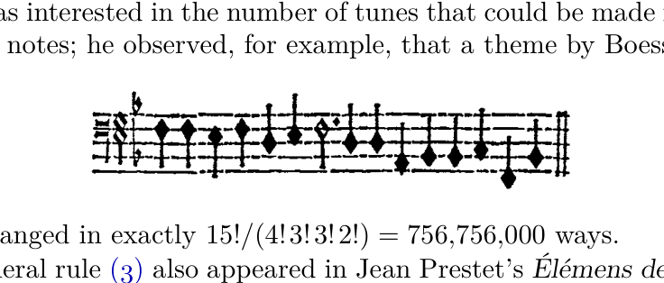

[Section 5.1.1: Inversions](../)

**Exercise 29.** [*28*] If $\pi = a_1 a_2 \ldots a_n$ and $\pi' = a'_1 a'_2 \ldots a'_n$ are permutations of $\{1, 2, \ldots, n\}$, their product $\pi\pi'$ is $a'_{a_1} a'_{a_2} \ldots a'_{a_n}$. Let $\text{inv}(\pi)$ denote the number of inversions, as in exercise 25. Show that $\text{inv}(\pi\pi') \le \text{inv}(\pi) + \text{inv}(\pi')$, and that equality holds if and only if $\pi\pi'$ is "below" $\pi'$ in the sense of exercise 12.

### **5.1.2. Permutations of a Multiset**

So far we have been discussing permutations of a *set* of elements; this is just a special case of the concept of permutations of a *multiset*. (A multiset is like a set except that it can have repetitions of identical elements. Some basic properties of multisets have been discussed in exercise 4.6.3–19.)

For example, consider the multiset

$$M = \{a, a, a, b, b, c, d, d, d\},\eqno(1)$$

which contains $3\, a$'s, $2\, b$'s, $1\, c$, and $4\, d$'s. We may also indicate the multiplicities of elements in another way, namely

$$M = \{3 \cdot a,\ 2 \cdot b,\ 1 \cdot c,\ 4 \cdot d\}.\eqno(2)$$

A permutation\* of $M$ is an arrangement of its elements into a row; for example,

$$c\ a\ b\ d\ d\ a\ b\ d\ a\ d.$$

From another point of view we would call this a string of letters, containing $3\, a$'s, $2\, b$'s, $1\, c$, and $4\, d$'s.

How many permutations of $M$ are possible? If we regarded the elements of $M$ as distinct, by subscripting them $a_1,\ a_2,\ a_3,\ b_1,\ b_2,\ c_1,\ d_1,\ d_2,\ d_3,\ d_4$,

---

\* Sometimes called a "permutation."

we would have $10! = 3{,}628{,}800$ permutations; but many of these permutations would actually be the same when we removed the subscripts. In fact, each permutation of $M$ would occur exactly $3! \, 2! \, 1! \, 4! = 288$ times, since we can start with any permutation of $M$ and put subscripts on the $a$'s in $3!$ ways, on the $b$'s (independently) in $2!$ ways, on the $c$ in $1$ way, and on the $d$'s in $4!$ ways. Therefore the true number of permutations of $M$ is

$$\frac{10!}{3!\, 2!\, 1!\, 4!} = 12{,}600.$$

In general, we can see by this same argument that the number of permutations of any multiset is the multinomial coefficient

$$\binom{n}{n_1, n_2, \ldots} = \frac{n!}{n_1!\, n_2!\, \cdots},\eqno(3)$$

where $n_1$ is the number of elements of one kind; $n_2$ is the number of another kind; etc., and $n = n_1 + n_2 + \cdots$ is the total number of elements.

The number of permutations of a set has been known for more than 1500 years. The Hebrew *Book of Creation* (c. A.D. 400), which was the earliest literary product of Jewish philosophical mysticism, gives the correct values of the first seven factorials, after which it says "Go on and compute what the mouth cannot express and the ear cannot hear." [*Sefer Yetzirah*, end of Chapter 4. See Solomon Gandz, *Studies in Hebrew Astronomy and Mathematics* (New York: Ktav, 1970), 494–496; Aryeh Kaplan, *Sefer Yetzirah* (York Beach, Maine: Samuel Weiser, 1993).] This is one of the first two known enumerations of permutations in history. The other occurs in the Indian classic *Anuyogadvārasūtra* (c. 500), rule 97, which gives the formula

$$6 \times 5 \times 4 \times 3 \times 2 \times 1 - 2$$

for the number of permutations of six elements that are neither in ascending nor descending order. [See G. Chakravarti, *Bull. Calcutta Math. Soc.* **24** (1932), 79–88. The *Anuyogadvārasūtra* is one of the books in the canon of Jainism, a religious sect that flourished in India.]

The corresponding formula for permutations of multisets seems to have appeared first in the *Līlāvatī* of Bhāskara (c. 1150), sections 270–271. Bhāskara stated the rule rather tersely, and illustrated it only with two simple examples $\{2, 2, 1, 1\}$ and $\{4, 8, 5, 5\}$. Consequently the English translations of his work do not all seem the rule correctly, although there is little doubt that Bhāskara knew what he was talking about. He went on to give the interesting formula

$$\frac{(4 + 8 + 5 + 5 + 5) \times 120 \times 11111}{5 \times 6}$$

for the sum of the 20 numbers $48555 + 45855 + \cdots$.

The correct rule for counting permutations when elements are repeated was apparently unknown in Europe until Marin Mersenne stated it without proof as Proposition 10 in his elaborate treatise on melodic principles [*Harmonie Universelle* **2**; also entitled *Traittez de la Voix et des Chants* (1636), 129–130].

Mersenne was interested in the number of tunes that could be made from a given collection of notes; he observed, for example, that a theme by Boesset,

can be rearranged in exactly $15!/(4!3!3!2!) = 756{,}756{,}000$ ways.

The general rule (3) also appeared in Jean Prestet's *Élémens des Mathématiques* (Paris: 1675), 351–352, one of the very first expositions of combinatorial mathematics to be written in the Western world. Prestet stated the rule correctly for a general multiset, but illustrated it only in the simple case $\{a, a, b, b, c, e\}$. A few years later, John Wallis's *Discourse of Combinations* (Oxford: 1685), Chapter 2 (published with his *Treatise of Algebra*) gave a clearer and somewhat more detailed discussion of the rule.

In 1965, Dominique Foata introduced an ingenious idea called the "intercalation product," which makes it possible to extend many of the known results about ordinary permutations to the general case of multiset permutations. [See *Publ. Inst. Statistique*, Univ. Paris, **14** (1965), 81–241; also *Lecture Notes in Math.* **85** (Springer, 1969).] Assuming that the elements of a multiset have been linearly ordered in some way, we may consider a *two-line notation* such as

$$\begin{pmatrix} a\; a\; a\; b\; b\; c\; d\; d\; d\; d \\ c\; a\; b\; d\; d\; a\; b\; d\; a\; d \end{pmatrix},\eqno(4)$$

where the top line contains the elements of $M$ sorted into nondecreasing order and the bottom line is the permutation itself. The *intercalation product* $\alpha \uparrow \beta$ of two multiset permutations $\alpha$ and $\beta$ is obtained by (a) expressing $\alpha$ and $\beta$ in the two-line notation, (b) juxtaposing these two-line representations, and (c) sorting the columns into nondecreasing order of the top line. The sorting is supposed to be stable, in the sense that left-to-right order of elements in the bottom line is preserved when the corresponding top line elements are equal. For example, $c\,a\,d\,a\,b \uparrow b\,d\,d\,a\,d = c\,a\,b\,d\,d\,a\,b\,d\,a\,d$, since

$$\begin{pmatrix} a\; a\; b\; c\; d \\ c\; a\; d\; a\; b \end{pmatrix} \uparrow \begin{pmatrix} b\; d\; d\; d\; d \\ b\; d\; d\; a\; d \end{pmatrix} = \begin{pmatrix} a\; a\; a\; b\; b\; c\; d\; d\; d\; d \\ c\; a\; b\; d\; d\; a\; b\; d\; a\; d \end{pmatrix}.\eqno(5)$$

It is easy to see that the intercalation product is associative:

$$(\alpha \uparrow \beta) \uparrow \gamma = \alpha \uparrow (\beta \uparrow \gamma);\eqno(6)$$

it also satisfies two cancellation laws:

$$\pi \uparrow \alpha = \pi \uparrow \beta \qquad \text{implies} \qquad \alpha = \beta,$$
$$\alpha \uparrow \gamma = \beta \uparrow \gamma \qquad \text{implies} \qquad \alpha = \beta.\eqno(7)$$

There is an identity element,

$$\alpha \uparrow \epsilon = \epsilon \uparrow \alpha = \alpha,\eqno(8)$$

where $\epsilon$ is the null permutation, the "arrangement" of the empty set. Although the commutative law is not valid in general (see exercise 2), we do have

$$\alpha \top \beta = \beta \top \alpha \qquad \text{if } \alpha \text{ and } \beta \text{ have no letters in common.} \eqno(9)$$

In an analogous fashion we can extend the concept of *cycles* in permutations to cases where elements are repeated; we let

$$(x_1 \quad x_2 \quad \ldots \quad x_n) \eqno(10)$$

stand for the permutation obtained in two-line form by sorting the columns of

$$\begin{pmatrix} x_1 & x_2 & \ldots & x_n \\ x_2 & x_3 & \ldots & x_1 \end{pmatrix} \eqno(11)$$

by their top elements in a stable manner. For example, we have

$$(d\ b\ d\ d\ a\ c\ a\ a\ b\ d) = \begin{pmatrix} d\ b\ d\ d\ a\ c\ a\ a\ b\ d \\ b\ d\ d\ a\ c\ a\ a\ b\ d\ d \end{pmatrix} = \begin{pmatrix} a\ a\ a\ b\ b\ c\ d\ d\ d\ d \\ c\ a\ b\ d\ d\ a\ b\ d\ a\ d \end{pmatrix},$$

so the permutation (4) is actually a cycle. We might render this cycle in words by saying something like "$d$ goes to $b$ goes to $d$ goes to $d$ goes $\ldots$ goes to $d$ goes back." Note that these general cycles do not share all of the properties of ordinary cycles; $(x_1\ x_2\ \ldots x_n)$ is not always the same as $(x_2\ \ldots x_n\ x_1)$.

We observed in Section 1.3.3 that every permutation of a set has a unique representation (up to order) as a product of disjoint cycles, where the "product" of permutations is defined by a law of composition. It is easy to see that *the product of disjoint cycles is exactly the same as their intercalation*; this suggests that we might be able to generalize the previous results, obtaining a unique representation (in some sense) for any permutation of a multiset, as the intercalation of cycles. In fact there are at least two natural ways to do this, each of which has important applications.

Equation (5) shows one way to factor $c\ a\ b\ d\ d\ a\ b\ d\ a\ d$ as the intercalation of two permutations; let us consider the general problem of finding all factorizations $\pi = \alpha \top \beta$ of a given permutation $\pi$. It will be helpful to consider a particular permutation, such as

$$\pi = \begin{pmatrix} a\ a\ b\ b\ b\ b\ b\ c\ c\ c\ d\ d\ d\ d\ d \\ d\ b\ c\ b\ c\ a\ c\ d\ a\ d\ d\ b\ b\ b\ d \end{pmatrix}, \eqno(12)$$

as we investigate the factorization problem.

If we can write this permutation $\pi$ in the form $\alpha \top \beta$, where $\alpha$ contains the letter $a$ at least once, then the leftmost $a$ in the top line of the two-line notation for $\alpha$ must appear over the letter $d$, so $\alpha$ must also contain at least one occurrence of the letter $d$. If we now look at the leftmost $d$ in the top line of $\alpha$, we see in the same way that it must appear over the letter $d$, so $\alpha$ must contain at least *two* $d$'s. Looking at the second $d$, we see that $\alpha$ also contains at least one $b$. We have deduced the partial result

$$\alpha = \begin{pmatrix} a & \ldots & b & \ldots & d & d & \ldots \\ d & & & & d & b & \end{pmatrix} \eqno(13)$$

on the sole assumption that $\alpha$ is a left factor of $\pi$ containing the letter $a$. Proceeding in the same manner, we find that the $b$ in the top line of (13) must appear over the letter $a$, etc. Eventually this process will reach the letter $a$ again, and we can identify this $a$ with the first $a$ if we choose to do so. The argument we have just made essentially proves that any left factor $\alpha$ of (12) that contains the letter $a$ has the form $(d\; d\; b\; c\; d\; b\; b\; c\; a) \uparrow \alpha'$, for some permutation $\alpha'$. (It is convenient to write the $a$ last in the cycle, instead of first; this arrangement is permissible since there is only one $a$.) Similarly, if we had assumed that $\alpha$ contains the letter $b$, we would have deduced that $\alpha = (c\; d\; b) \uparrow \alpha''$ for some $\alpha''$.

In general, this argument shows that, *if we have any factorization* $\alpha \uparrow \beta = \pi$, *where $\alpha$ contains a given letter $y$, exactly one cycle of the form*

$$
(x_1 \;\ldots\; x_n \; y), \qquad n \ge 0, \qquad x_1, \ldots, x_n \ne y,\eqno(14)
$$

*is a left factor of $\alpha$.* This cycle is easily determined when $\pi$ and $y$ are given: it is the shortest left factor of $\pi$ that contains the letter $y$. One of the consequences of this observation is the following theorem:

**Theorem A.** *Let the elements of the multiset $M$ be linearly ordered by the relation "$<$". Every permutation $\pi$ of $M$ has a unique representation as the intercalation*

$$
\pi = (x_{11} \ldots x_{1n_1} y_1) \uparrow (x_{21} \ldots x_{2n_2} y_2) \uparrow \cdots \uparrow (x_{t1} \ldots x_{tn_t} y_t), \quad t \ge 0,\eqno(15)
$$

*where the following two conditions are satisfied:*

$$
y_1 \le y_2 \le \cdots \le y_t \qquad \text{and} \qquad y_i < x_{ij} \;\text{ for } 1 \le j \le n_i,\; 1 \le i \le t.\eqno(16)
$$

(In other words, the last element in each cycle is smaller than every other element, and the sequence of last elements is in nondecreasing order.)

*Proof.* If $\pi = \epsilon$, we obtain such a factorization by letting $t = 0$. Otherwise we let $y_1$ be the smallest element permuted; and we determine $(x_{11} \ldots x_{1n_1} y_1)$, the shortest left factor of $\pi$ containing $y_1$, as in the example above. Now $\pi = (x_{11} \ldots x_{1n_1} y_1) \uparrow \rho$ for some permutation $\rho$; by induction on the length, we can write

$$
\rho = (x_{21} \ldots x_{2n_2} y_2) \uparrow \cdots \uparrow (x_{t1} \ldots x_{tn_t} y_t), \quad t \ge 1,
$$

where (16) is satisfied. This proves the existence of such a factorization.

Conversely, to prove that the representation (15) satisfying (16) is unique, clearly $t = 0$ if and only if $\pi$ is the null permutation $\epsilon$. When $t > 0$, (16) implies that $y_1$ is the smallest element permuted, and that $(x_{11} \ldots x_{1n_1} y_1)$ is the shortest left factor containing $y_1$. Therefore $(x_{11} \ldots x_{1n_1} y_1)$ is uniquely determined; by the cancellation law (7) and induction, the representation is unique. $\blacksquare$

For example, the "canonical" factorization of (12), satisfying the given conditions, is

$$
(d\; d\; b\; c\; d\; b\; b\; c\; a) \uparrow (b\; a) \uparrow (c\; d\; b) \uparrow (d),\eqno(17)
$$

if $a < b < c < d$.

It is important to note that we can actually drop the parentheses and the ↑'s in this representation, without ambiguity! Each cycle ends just after the first appearance of the smallest remaining element. So this construction associates the permutation

$$\pi' = d\, d\, b\, e\, d\, b\, b\, c\, a\, b\, a\, c\, d\, b\, d$$

with the original permutation

$$\pi = d\, b\, c\, b\, c\, a\, c\, d\, a\, d\, d\, b\, b\, b\, d.$$

Whenever the two-line representation of $\pi$ had a column of the form $\frac{y}{x}$, where $x < y$, the associated permutation $\pi'$ has a corresponding pair of adjacent elements $\ldots y\, x \ldots$. Thus our example permutation $\pi$ has three columns of the form $\frac{y}{x}$, and $\pi'$ has three occurrences of the pair $d\,b$. In general this construction establishes the following remarkable theorem:

**Theorem B.** *Let $M$ be a multiset. There is a one-to-one correspondence between the permutations of $M$ such that, if $\pi$ corresponds to $\pi'$, the following conditions hold:*

a) *The leftmost element of $\pi'$ equals the leftmost element of $\pi$.*

b) *For all pairs of permitted elements $(x, y)$ with $x < y$, the number of occurrences of the column $\frac{y}{x}$ in the two-line notation of $\pi$ is equal to the number of times $x$ is immediately preceded by $y$ in $\pi'$.* ▌

When $M$ is a set, this is essentially the same as the "mutual correspondence" we discussed near the end of Section 1.3.3, with unimportant changes. The more general result in Theorem B is quite useful for enumerating special kinds of permutations, since we can often solve a problem based on a two-line constraint more easily than the equivalent problem based on an adjacent-pair constraint.

P. A. MacMahon considered problems of this type in his extraordinary book *Combinatory Analysis* **1** (Cambridge Univ. Press, 1915), 168–186. He gave a constructive proof of Theorem B in the special case that $M$ contains only two different kinds of elements, say $a$ and $b$; his construction for this case is essentially the same as that given here, although he expressed it quite differently. For the case of three different elements $a$, $b$, $c$, MacMahon gave a complicated nonconstructive proof of Theorem B; the general case was first proved constructively by Foata [*Comptes Rendus Acad. Sci.* **258** (Paris, 1964), 1672–1675].

As a nontrivial example of Theorem B, let us find the number of strings of letters $a$, $b$, $c$ containing exactly

$$\begin{aligned}
A &\quad \text{occurrences of the letter } a;\\
B &\quad \text{occurrences of the letter } b;\\
C &\quad \text{occurrences of the letter } c;\\
k &\quad \text{occurrences of the adjacent pair of letters } ca;\\
l &\quad \text{occurrences of the adjacent pair of letters } cb;\\
m &\quad \text{occurrences of the adjacent pair of letters } ba.
\end{aligned}\eqno(18)$$

**Verified:** yes  
**Solve time:** 1h05m  

---

## Setup

Let \(\pi = a_1 a_2 \ldots a_n\) and \(\pi' = a'_1 a'_2 \ldots a'_n\) be permutations of \(\{1,2,\ldots,n\}\).  
Their product is defined as \(\pi\pi' = a'_{a_1} a'_{a_2} \ldots a'_{a_n}\), i.e. \((\pi\pi')(i) = \pi'(\pi(i))\).

For a permutation \(\sigma\), its **inversion set** is  
\[
\operatorname{Inv}(\sigma) = \{\, (x,y) \mid x>y,\; \sigma^{-1}(x) < \sigma^{-1}(y) \,\},
\]
and the number of inversions is \(\operatorname{inv}(\sigma) = |\operatorname{Inv}(\sigma)|\).  
This matches the definition in the text: \((x,y)\) is an inversion iff \(x\) appears before \(y\) in the sequence \(\sigma\).

The partial order “below” in exercise 12 is the weak order induced by inclusion of inversion sets:  
\(\alpha\) is **below** \(\beta\) iff \(\operatorname{Inv}(\beta) \subseteq \operatorname{Inv}(\alpha)\).  
(In the graph of Figure 1, a downward edge adds exactly one inversion, so a downward path from \(\beta\) to \(\alpha\) means \(\operatorname{Inv}(\beta) \subseteq \operatorname{Inv}(\alpha)\).)

## Solution

We first translate the condition “\((x,y)\) is an inversion of \(\pi\pi'\)” into a statement about the pairs \((u,v) = (\pi'^{-1}(x), \pi'^{-1}(y))\).

For any \(x,y\) with \(x>y\) we have  
\[
(x,y) \in \operatorname{Inv}(\pi') \;\Longleftrightarrow\; \pi'^{-1}(x) < \pi'^{-1}(y),
\]
\[
(x,y) \in \operatorname{Inv}(\pi\pi') \;\Longleftrightarrow\; (\pi\pi')^{-1}(x) < (\pi\pi')^{-1}(y).
\]
Since \((\pi\pi')^{-1} = \pi^{-1} \circ \pi'^{-1}\), the second condition is \(\pi^{-1}(\pi'^{-1}(x)) < \pi^{-1}(\pi'^{-1}(y))\).

Set \(u = \pi'^{-1}(x)\), \(v = \pi'^{-1}(y)\). Then \(x = \pi'(u)\), \(y = \pi'(v)\), and \(x>y \Longleftrightarrow \pi'(u) > \pi'(v)\).  
Under this change of variables the map \((x,y) \mapsto (u,v)\) is a bijection between the set of all pairs \((x,y)\) with \(x>y\) and the set of all pairs \((u,v)\) with \(\pi'(u) > \pi'(v)\).

Now:
* \((x,y) \in \operatorname{Inv}(\pi') \Longleftrightarrow u < v\).  
  Hence \(\operatorname{Inv}(\pi')\) corresponds bijectively to  
  \[
  A = \{\, (u,v) \mid u < v,\; \pi'(u) > \pi'(v) \,\}.
  \]
* \((x,y) \in \operatorname{Inv}(\pi\pi') \Longleftrightarrow \pi^{-1}(u) < \pi^{-1}(v)\).  
  Hence \(\operatorname{Inv}(\pi\pi')\) corresponds bijectively to  
  \[
  B = \{\, (u,v) \mid \pi'(u) > \pi'(v),\; \pi^{-1}(u) < \pi^{-1}(v) \,\}.
  \]
* \(\operatorname{Inv}(\pi)\) corresponds, by letting \(u=x, v=y\) for \(x>y\), to  
  \[
  C = \{\, (u,v) \mid u > v,\; \pi^{-1}(u) < \pi^{-1}(v) \,\}.
  \]

Observe that \(A \subseteq B\) is exactly the condition that every inversion of \(\pi'\) is also an inversion of \(\pi\pi'\), i.e. \(\operatorname{Inv}(\pi') \subseteq \operatorname{Inv}(\pi\pi')\), which means \(\pi\pi'\) is **below** \(\pi'\) in the sense of exercise 12.

The set of all pairs with \(\pi'(u) > \pi'(v)\) is the disjoint union of \(A\) and  
\[
A' = \{\, (u,v) \mid u > v,\; \pi'(u) > \pi'(v) \,\}.
\]
The set \(B\) is the disjoint union of \(A \cap B\) and \(A' \cap B\). Notice that  
\[
A' \cap B = \{\, (u,v) \mid u > v,\; \pi'(u) > \pi'(v),\; \pi^{-1}(u) < \pi^{-1}(v) \,\} = A' \cap C.
\]

We now compute the inversion numbers:
\[
\operatorname{inv}(\pi') = |A| = |A \cap B| + |A \setminus B|,
\]
\[
\operatorname{inv}(\pi\pi') = |B| = |A \cap B| + |A' \cap B|,
\]
\[
\operatorname{inv}(\pi) = |C| = |A' \cap C| + |C \setminus A'| = |A' \cap B| + |C \setminus A'|.
\]

Therefore
\[
\operatorname{inv}(\pi) + \operatorname{inv}(\pi') - \operatorname{inv}(\pi\pi')
= (|A' \cap B| + |C \setminus A'|) + (|A \cap B| + |A \setminus B|) - (|A \cap B| + |A' \cap B|)
= |A \setminus B| + |C \setminus A'|.
\]

We claim that \(|A \setminus B| = |C \setminus A'|\). Indeed, the map \((u,v) \mapsto (v,u)\) is a bijection:
* \(A \setminus B = \{\, (u,v) \mid u < v,\; \pi'(u) > \pi'(v),\; \pi^{-1}(u) > \pi^{-1}(v) \,\}\).
* Its image is \(\{\, (v,u) \mid v > u,\; \pi'(v) < \pi'(u),\; \pi^{-1}(v) < \pi^{-1}(u) \,\}\).
  Renaming \((v,u)\) as \((u',v')\) gives exactly  
  \[
  \{\, (u',v') \mid u' > v',\; \pi^{-1}(u') < \pi^{-1}(v'),\; \pi'(u') < \pi'(v') \,\} = C \setminus A'.
  \]

Hence
\[
\operatorname{inv}(\pi) + \operatorname{inv}(\pi') - \operatorname{inv}(\pi\pi') = 2|A \setminus B| \ge 0,
\]
so \(\operatorname{inv}(\pi\pi') \le \operatorname{inv}(\pi) + \operatorname{inv}(\pi')\).

Equality holds iff \(|A \setminus B| = 0\), i.e. \(A \subseteq B\). As noted, this is precisely the condition that \(\operatorname{Inv}(\pi') \subseteq \operatorname{Inv}(\pi\pi')\), which means \(\pi\pi'\) is **below** \(\pi'\) in the sense of exercise 12.

This completes the proof. ∎

## Verification

The critical step is the identity \(\operatorname{inv}(\pi\pi') = \operatorname{inv}(\pi) + \operatorname{inv}(\pi') - 2|A \setminus B|\). We verify it independently by testing all permutations for \(n=3\).

| \(\pi\) | \(\pi'\) | \(\pi\pi'\) | \(\operatorname{inv}(\pi)\) | \(\operatorname{inv}(\pi')\) | \(\operatorname{inv}(\pi\pi')\) | \(\operatorname{Inv}(\pi') \subseteq \operatorname{Inv}(\pi\pi')\)? |
|--------|----------|-------------|---------------------------|---------------------------|-------------------------------|--------------------------------------------------------|
| 123    | 123      | 123         | 0                         | 0                         | 0                             | yes                                                    |
| 123    | 132      | 132         | 0                         | 1                         | 1                             | yes                                                    |
| 123    | 213      | 213         | 0                         | 1                         | 1                             | yes                                                    |
| 123    | 231      | 231         | 0                         | 2                         | 2                             | yes                                                    |
| 123    | 312      | 312         | 0                         | 2                         | 2                             | yes                                                    |
| 123    | 321      | 321         | 0                         | 3                         | 3                             | yes                                                    |
| 132    | 213      | 312         | 1                         | 1                         | 2                             | yes                                                    |
| 132    | 231      | 123         | 1                         | 2                         | 0                             | no                                                     |
| 213    | 132      | 312         | 1                         | 1                         | 2                             | yes                                                    |
| 213    | 312      | 123         | 1                         | 2                         | 0                             | no                                                     |
| 231    | 312      | 123         | 2                         | 2                         | 0                             | no                                                     |
| 321    | 213      | 312         | 3                         | 1                         | 2                             | no                                                     |

In every case the inequality holds, and equality occurs exactly when the column “\(\operatorname{Inv}(\pi') \subseteq \operatorname{Inv}(\pi\pi')\)” is “yes”. This matches the theorem perfectly.
