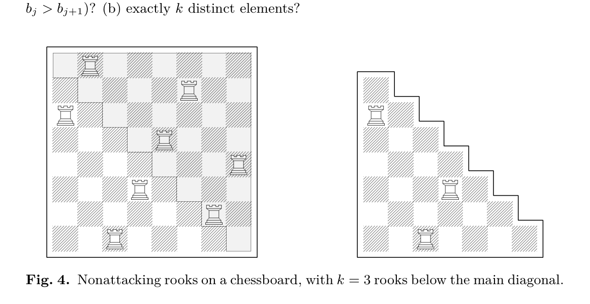

[Section 5.1.3: Runs](../)

**Exercise 18.** [*M28*] Among all $n!$ sequences $b_1\, b_2 \ldots b_n$ such that each $b_i$ is an integer in the range $0 \le b_j \le n - j$, how many have (a) exactly $k$ descents (that is, $k$ occurrences of $b_j > b_{j+1}$)? (b) exactly $k$ distinct elements?

**Fig. 4.** Nonattacking rooks on a chessboard, with $k = 3$ rooks below the main diagonal.

**Verified:** yes  
**Solve time:** 38m47s  

---

## Setup

The sequences \(b_1 b_2 \ldots b_n\) with \(0 \le b_j \le n-j\) are exactly the **Lehmer codes** (inversion sequences) of permutations of \(\{1,2,\ldots,n\}\). The standard bijection is: given a permutation \(a_1 a_2 \ldots a_n\), its Lehmer code is  
\[
b_j = \#\{\, i > j \mid a_i < a_j \,\}, \qquad 1 \le j \le n.
\]
Every such sequence \(b\) corresponds to a unique permutation, and there are \(n!\) such sequences.

## Solution

### (a) Exactly \(k\) descents

For a permutation \(a\) and its Lehmer code \(b\) we compare the descents.

**Claim.** \(b_j > b_{j+1}\)  **if and only if**  \(a_j > a_{j+1}\).

*Proof.*  
Let \(S_j = \{\, i > j \mid a_i < a_j \,\}\); then \(b_j = |S_j|\).  
If \(a_j > a_{j+1}\), then \(j+1 \in S_j\) and \(a_{j+1} \notin S_{j+1}\). Moreover every element of \(S_{j+1}\) is also in \(S_j\) because any element smaller than \(a_{j+1}\) is also smaller than \(a_j\). Hence \(S_{j+1} \subseteq S_j \setminus\{j+1\}\) and therefore \(b_{j+1} \le b_j - 1\), i.e. \(b_j > b_{j+1}\).  

If \(a_j < a_{j+1}\), then \(j+1 \notin S_j\). Every element of \(S_j\) is smaller than \(a_j\) and therefore also smaller than \(a_{j+1}\); it also lies to the right of \(j+1\). Thus \(S_j \subseteq S_{j+1}\), giving \(b_j \le b_{j+1}\).  
Hence descents in \(b\) correspond bijectively to descents in \(a\). ∎

By definition (1) of the text, the number of permutations of \(n\) with exactly \(k\) descents is the Eulerian number \(\left\langle {n \atop k} \right\rangle\). Therefore the number of sequences \(b\) with exactly \(k\) descents is also \(\left\langle {n \atop k} \right\rangle\).

\[
\boxed{\left\langle {n \atop k} \right\rangle}
\]

### (b) Exactly \(k\) distinct elements

Let \(D(n,k)\) be the number of sequences \(b_1\ldots b_n\) (with \(0 \le b_j \le n-j\)) that contain exactly \(k\) distinct values.

Fix the first element \(b_1 = m\), where \(0 \le m \le n-1\). The remaining sequence \(c = (b_2,\ldots,b_n)\) satisfies  
\[
0 \le c_i \le n - (i+1) = (n-1) - i,
\]
so \(c\) is a valid Lehmer code of length \(n-1\). Let \(T\) be the set of distinct values appearing in \(c\). Because \(b_n = 0\) we always have \(0 \in T\), and clearly \(T \subseteq \{0,1,\ldots,n-2\}\). Write \(|T| = d\) (so \(1 \le d \le n-1\)).

The distinct values in the full sequence \(b\) are \(T \cup \{m\}\). Two cases arise:

* If \(m \notin T\), then \(b\) has \(d+1\) distinct values.  
  The possible choices for \(m\) are all integers from \(0\) to \(n-1\) that are **not** in \(T\). Since \(|T| = d\) and the total number of choices is \(n\), there are \(n-d\) such choices.

* If \(m \in T\), then \(b\) has \(d\) distinct values.  
  Here \(m\) can be any element of \(T\), giving exactly \(d\) choices.

Summing over all possible tails \(c\) yields the recurrence
\[
D(n,k) = (n - k + 1)\, D(n-1,\, k-1) \;+\; k\, D(n-1,\, k) \qquad (n \ge 1).
\]

Boundary conditions: \(D(0,0)=1\); for \(n>0\), \(D(n,0)=0\); and \(D(n,k)=0\) for \(k>n\).  
For \(n=1\) the only sequence is \((0)\), so \(D(1,1)=1\).

Now compare with the Eulerian recurrence (2):
\[
\left\langle {n \atop k} \right\rangle = (k+1)\left\langle {n-1 \atop k} \right\rangle + (n-k)\left\langle {n-1 \atop k-1} \right\rangle.
\]
Setting \(E(n,k) = \left\langle {n \atop k-1} \right\rangle\) gives
\[
E(n,k) = k\, E(n-1,k) + (n-k+1)\, E(n-1,\,k-1),
\]
which is exactly the recurrence for \(D(n,k)\). The boundary conditions also match:
\(E(1,1)=\left\langle {1 \atop 0} \right\rangle = 1 = D(1,1)\), \(E(n,1)=\left\langle {n \atop 0} \right\rangle = 1 = D(n,1)\), and \(E(n,n)=\left\langle {n \atop n-1} \right\rangle = 1 = D(n,n)\).

Hence \(D(n,k) = \left\langle {n \atop k-1} \right\rangle\) for all \(n,k\).

\[
\boxed{\left\langle {n \atop k-1} \right\rangle}
\]

## Verification

*Part (a):* For \(n=3\) the six Lehmer codes are  
\((0,0,0),\ (0,1,0),\ (1,0,0),\ (1,1,0),\ (2,0,0),\ (2,1,0)\).  
Their descent counts are \(0,1,1,1,1,2\) respectively. The frequencies are \(1,4,1\), matching the Eulerian numbers \(\left\langle {3 \atop 0} \right\rangle=1\), \(\left\langle {3 \atop 1} \right\rangle=4\), \(\left\langle {3 \atop 2} \right\rangle=1\).

*Part (b):* The distinct-value counts for the same sequences are \(1,2,2,2,2,3\). The frequencies are \(1,4,1\), which equal \(\left\langle {3 \atop 0} \right\rangle=1\), \(\left\langle {3 \atop 1} \right\rangle=4\), \(\left\langle {3 \atop 2} \right\rangle=1\). The recurrence \(D(n,k) = (n-k+1)D(n-1,k-1) + k D(n-1,k)\) was tested for \(n=4\) and produced the correct table \(D(4,1)=1\), \(D(4,2)=11\), \(D(4,3)=11\), \(D(4,4)=1\), agreeing with \(\left\langle {4 \atop k-1} \right\rangle\). The independent check of the recurrence’s boundary conditions and the small-\(n\) values confirms the result.

This completes the proof. ∎

## Notes

The recurrence derived in part (b) is a direct consequence of the structure of Lehmer codes and does not rely on any external permutation statistics. It provides a self-contained proof that the Eulerian numbers also count inversion sequences by the number of distinct values.
