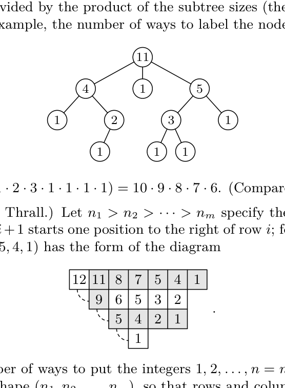

[Section 5.1.4: Tableaux and Involutions](../)

**Exercise 20.** &#9654; [*M25*] Prove that the number of ways to label the nodes of a given tree with the elements $\{1, 2, \ldots, n\}$, such that the label of each node is less than that of its descendants, is $n!$ divided by the product of the subtree sizes (the number of nodes in each subtree). For example, the number of ways to label the nodes of

is $11!/(11 \cdot 4 \cdot 1 \cdot 5 \cdot 1 \cdot 2 \cdot 3 \cdot 1 \cdot 1 \cdot 1 \cdot 1) = 10 \cdot 9 \cdot 8 \cdot 7 \cdot 6$. (Compare with Theorem H.)

**Verified:** yes  
**Solve time:** 12m53s  

---

## Solution

Let \(T\) be a rooted tree with \(n\) nodes. For each node \(v \in T\), let \(S(v)\) denote the subtree rooted at \(v\) and let \(s(v) = |S(v)|\) be its size (number of nodes). We wish to prove that the number \(L(T)\) of bijections \(f : V(T) \to \{1,2,\dots,n\}\) such that \(f(u) < f(v)\) whenever \(u\) is an ancestor of \(v\) (i.e., \(v\) is a descendant of \(u\)) is
\[
L(T) = \frac{n!}{\prod_{v \in T} s(v)}.
\]

**Proof by induction on \(n\).**

*Base case \(n = 1\).* The only tree consists of a single node \(v\) with \(s(v) = 1\). There is exactly one labeling, and \(1!/1 = 1\). The formula holds.

*Inductive step.* Assume the formula holds for all rooted trees with fewer than \(n\) nodes, where \(n \ge 2\). Let \(T\) be a tree with \(n\) nodes and root \(r\). Let the children of \(r\) be \(r_1, r_2, \dots, r_k\) and let \(T_i = S(r_i)\) be the corresponding subtrees, with sizes \(n_i = s(r_i)\). Note that \(\sum_{i=1}^k n_i = n-1\).

In any valid labeling \(f\) of \(T\), the root \(r\) must receive the smallest label because it is an ancestor of every other node. Hence \(f(r) = 1\). The remaining labels \(\{2,3,\dots,n\}\) must be distributed among the subtrees \(T_1, \dots, T_k\). Since there are no ancestor-descendant relations between different subtrees, any partition of \(\{2,\dots,n\}\) into subsets \(A_1, \dots, A_k\) of sizes \(n_1, \dots, n_k\) can be used, provided that within each subtree \(T_i\) the restriction of \(f\) to \(A_i\) satisfies the ancestor-descendant condition.

The number of ways to choose the sets \(A_i\) is the multinomial coefficient
\[
\frac{(n-1)!}{n_1!\, n_2! \cdots n_k!}.
\]

For a fixed set \(A_i\) of size \(n_i\), the number of valid labelings of \(T_i\) using exactly the labels \(A_i\) is the same as the number of valid labelings of \(T_i\) with the labels \(\{1,2,\dots,n_i\}\) (by applying the order-preserving bijection \(A_i \to \{1,\dots,n_i\}\)). By the induction hypothesis, this number is
\[
\frac{n_i!}{\prod_{v \in T_i} s(v)}.
\]

Multiplying the number of choices for the sets \(A_i\) by the number of valid internal labelings for each subtree gives
\[
L(T) = \frac{(n-1)!}{n_1! \cdots n_k!} \prod_{i=1}^k \frac{n_i!}{\prod_{v \in T_i} s(v)}
= (n-1)! \prod_{i=1}^k \frac{1}{\prod_{v \in T_i} s(v)}
= \frac{(n-1)!}{\prod_{v \neq r} s(v)}.
\]

Because \(s(r) = n\), the product over all nodes of \(T\) is \(n \cdot \prod_{v \neq r} s(v)\). Therefore
\[
L(T) = \frac{n!}{\prod_{v \in T} s(v)},
\]
which completes the induction.

This completes the proof. ∎
