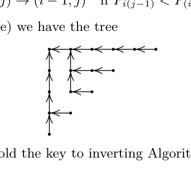

[Section 5.1.4: Tableaux and Involutions](../)

**Exercise 39.** [*M38*] (I. M. Pak and A. V. Stoyanovskii, 1992.) Let $P$ be an array of shape $(n_1, \ldots, n_m)$ that has been filled with any permutation of the integers $\{1, \ldots, n\}$, where $n = n_1 + \cdots + n_m$. The following procedure, which is analogous to the "siftup" algorithm in Section 5.2.3, can be used to convert $P$ to a tableau. It also defines an array $Q$ of the same shape, which can be used to provide a combinatorial proof of Theorem H.

**P1.** [Loop on $(i, j)$.] Perform steps P2 and P3 for all cells $(i, j)$ of the array, in reverse lexicographic order (that is, from bottom to top, and from right to left in each row); then stop.

**P2.** [Fix $P$ at $(i, j)$.] Set $K \leftarrow P_{ij}$ and perform Algorithm S' (see below).

**P3.** [Adjust $Q$.] Set $Q_{ik} \leftarrow Q_{i(k+1)} + 1$ for $j \le k < s$, and set $Q_{is} \leftarrow i - r$. ∎

Here Algorithm S' is the same as Schützenberger's Algorithm S, except that steps S1 and S2 are generalized slightly:

**S1'.** [Initialize.] Set $r \leftarrow i$, $s \leftarrow j$.

**S2'.** [Done?] If $K \le P_{(r+1)s}$ and $K \le P_{r(s+1)}$, set $P_{rs} \leftarrow K$ and terminate.

(Algorithm S is essentially the special case $i = 1$, $j = 1$, $K = \infty$.)

For example, Algorithm P' straightens out one particular array of shape $(3, 3, 2)$ in the following way, if we view the contents of arrays $P$ and $Q$ at the beginning of step P2, with $P_{ij}$ in boldface type:

$$P = \begin{array}{|c|c|c|} \hline 7 & 8 & 5 \\ \hline 1 & 6 & 4 \\ \hline 3 & 2 & \\ \hline \end{array} \quad \begin{array}{|c|c|c|} \hline 7 & 8 & 5 \\ \hline 1 & 6 & 4 \\ \hline \mathbf{3} & 2 & \\ \hline \end{array} \quad \begin{array}{|c|c|c|} \hline 7 & 8 & 5 \\ \hline 1 & 6 & 4 \\ \hline 2 & \mathbf{3} & \\ \hline \end{array} \quad \begin{array}{|c|c|c|} \hline 7 & 8 & 5 \\ \hline \mathbf{1} & 6 & 4 \\ \hline 2 & 3 & \\ \hline \end{array} \quad \begin{array}{|c|c|c|} \hline 7 & 8 & 5 \\ \hline 1 & \mathbf{6} & 4 \\ \hline 2 & 3 & \\ \hline \end{array} \quad \begin{array}{|c|c|c|} \hline 7 & 8 & 5 \\ \hline 1 & 4 & \mathbf{6} \\ \hline 2 & 3 & \\ \hline \end{array} \quad \begin{array}{|c|c|c|} \hline 7 & \mathbf{8} & 5 \\ \hline 1 & 4 & 6 \\ \hline 2 & 3 & \\ \hline \end{array} \quad \begin{array}{|c|c|c|} \hline 7 & 3 & 4 \\ \hline 1 & 5 & 8 \\ \hline 2 & 6 & \\ \hline \end{array}$$

$$Q = \begin{array}{|c|c|c|} \hline & & \\ \hline & & \\ \hline & & \\ \hline \end{array} \quad \begin{array}{|c|c|c|} \hline & & \\ \hline & & \\ \hline & 0 & \\ \hline \end{array} \quad \begin{array}{|c|c|c|} \hline & & \\ \hline & & \\ \hline 1 & 0 & \\ \hline \end{array} \quad \begin{array}{|c|c|c|} \hline & & \\ \hline & & 0 \\ \hline 1 & 0 & \\ \hline \end{array} \quad \begin{array}{|c|c|c|} \hline & & \\ \hline & -1 & 0 \\ \hline 1 & 0 & \\ \hline \end{array} \quad \begin{array}{|c|c|c|} \hline & & \\ \hline 0 & -1 & 0 \\ \hline 1 & 0 & \\ \hline \end{array} \quad \begin{array}{|c|c|c|} \hline & & -1 \\ \hline 0 & -1 & 0 \\ \hline 1 & 0 & \\ \hline \end{array} \quad \begin{array}{|c|c|c|} \hline & 0 & -1 \\ \hline 0 & -1 & 0 \\ \hline 1 & 0 & \\ \hline \end{array}$$

The final result is

$$P = \begin{array}{|c|c|c|}
\hline
1 & 3 & 4 \\
\hline
2 & 5 & 8 \\
\hline
6 & 7 & \phantom{0} \\
\hline
\end{array}, \qquad Q = \begin{array}{|r|r|r|}
\hline
1 & -2 & -1 \\
\hline
-1 & 0 & 0 \\
\hline
1 & 0 & \phantom{0} \\
\hline
\end{array}$$

a) If $P$ is simply a $1 \times n$ array, Algorithm P sorts it into $\bigl[\,1\;\big|\;\cdots\;\big|\;n\,\bigr]$. Explain what the $Q$ array will contain in that case.

b) Answer the same question if $P$ is $n \times 1$ instead of $1 \times n$.

c) Prove that, in general, we will have

$$-b_{ij} \le Q_{ij} \le r_{ij},$$

where $b_{ij}$ is the number of cells below $(i,j)$ and $r_{ij}$ is the number of cells to the right. Thus, the number of possible values for $Q_{ij}$ is exactly $h_{ij}$, the size of the $(i,j)$th hook.

d) Theorem H will be proved constructively if we can show that Algorithm P defines a one-to-one correspondence between the $n!$ ways to fill the original shape and the pairs of output arrays $(P,Q)$, where $P$ is a tableau and the elements of $Q$ satisfy the condition of part (c). Therefore we want to find an inverse of Algorithm P. For what initial permutations does Algorithm P produce the $2 \times 2$ array $Q = \begin{pmatrix} 0 & -1 \\ 1 & 0 \end{pmatrix}$?

e) What initial permutation does Algorithm P convert into the arrays

$$P = \begin{array}{|c|c|c|c|c|c|}
\hline
1 & 3 & 5 & 7 & 11 & 15 \\
\hline
2 & 6 & 8 & 14 & & \\
\hline
4 & 9 & 13 & & & \\
\hline
10 & 12 & & & & \\
\hline
16 & & & & & \\
\hline
\end{array}, \quad Q = \begin{array}{|r|r|r|r|r|r|}
\hline
-2 & -3 & -1 & 1 & 0 & 0 \\
\hline
3 & -2 & -1 & 0 & & \\
\hline
0 & -1 & 0 & & & \\
\hline
-1 & 0 & & & & \\
\hline
0 & & & & & \\
\hline
\end{array}\ ?$$

f) Design an algorithm that inverts Algorithm P, given any pair of arrays $(P,Q)$ such that $P$ is a tableau and $Q$ satisfies the condition of (e). [*Hint:* Construct an oriented tree whose vertices are the cells $(i,j)$, with arcs
$$(i,j) \to (i,\,j-1) \quad \text{if } P_{(i,j-1)} > P_{(i-1,j)};$$
$$(i,j) \to (i-1,\,j) \quad \text{if } P_{(i,j-1)} < P_{(i-1,j)}.$$]

In the example of part (e) we have the tree

The paths of this tree hold the key to inverting Algorithm P.]

**Verified:** no  
**Solve time:** 26m44s  

---

We need to solve exercise 39 from TAOCP Volume 3, Section 5.1.4. It's a multi-part problem about Algorithm P (a variant of the "siftup" algorithm) that converts a permutation-filled array into a tableau P and an auxiliary array Q. The problem asks for several things:

a) For P a 1 x n array, what does Q contain?
b) For P a n x 1 array, what does Q contain?
c) Prove that in general, -b_{ij} ≤ Q_{ij} ≤ r_{ij}, where b_{ij} is number of cells below (i,j) and r_{ij} is number of cells to the right. Thus number of possible values for Q_{ij} is h_{ij} (hook length).
d) Find for what initial permutations Algorithm P produces the specific 2x2 Q = [[0, -1], [1, 0]].
e) Given the final P and Q shown, find the initial permutation.
f) Design an algorithm that inverts Algorithm P, using the hint about an oriented tree.

We need to provide a rigorous solution. Let's understand Algorithm P and S' thoroughly.

Algorithm P:
Input: P is an array of shape (n1,...,nm) filled with a permutation of {1,...,n}. Q initially empty? The example shows Q initially all blank? Actually Q is shown initially empty and then gets filled during the process. The algorithm loops over cells (i,j) in reverse lexicographic order: bottom to top, right to left in each row. For each cell, it does P2 and P3.

P2: Fix P at (i,j). Set K ← P_{ij} and perform Algorithm S'.

S' (Algorithm S'): 
S1': Initialize. Set r ← i, s ← j.
S2': Done? If K ≤ P_{(r+1)s} and K ≤ P_{r(s+1)}, set P_{rs} ← K and terminate.
Otherwise? The description says "Algorithm S' is the same as Schützenberger's Algorithm S, except that steps S1 and S2 are generalized slightly". We need to infer the rest. In Schützenberger's Algorithm S (promotion/evacuation?), but here it's a "siftup" algorithm: it's like heapify. Typically, to fix a heap property, you compare K with children and swap with the smaller child. Since it's a tableau, the condition for a tableau is that rows and columns are increasing. The cell (i,j) is being "fixed" by moving K down and right until it finds its place. The algorithm likely: if K > P_{(r+1)s} or K > P_{r(s+1)} (i.e., K is larger than at least one neighbor), then we need to swap K with the smaller of the two neighbors? Actually for a standard Young tableau, entries increase across rows and down columns. If we have a cell with value K that is too large, we want to push it down/right. The typical "jeu de taquin" slide: if we have a hole, we slide the smaller neighbor into the hole. Here we have an extra element K that we want to insert into the tableau? Wait, the initial P is a permutation, not a tableau. We process cells in reverse lexicographic order. At each step, we take the value K at (i,j), remove it from that cell (leaving a hole?), and then perform S' to place K somewhere in the subtableau to the right and below? Actually, the example shows the process: they show P and Q at the beginning of step P2, with P_{ij} in boldface. Let's trace the example.

Example: shape (3,3,2). Initial P:
7 8 5
1 6 4
3 2

They process cells in reverse lexicographic order: (3,2), (3,1), (2,3), (2,2), (2,1), (1,3), (1,2), (1,1).

First cell: (3,2) (bottom row, rightmost). P_{32}=2 (bold). Q initially all blank. They show Q after P3? Actually the sequence of P and Q shown:

Step 1: P = 
7 8 5
1 6 4
3 2 (with 2 bold? Actually they show "3 2" with 2 bold? Wait the first array shown: 
P = 
7 8 5
1 6 4
3 2
and then next array: 
7 8 5
1 6 4
3 2 with 3 bold? Let's read carefully:

"For example, Algorithm P' straightens out one particular array of shape (3,3,2) in the following way, if we view the contents of arrays P and Q at the beginning of step P2, with P_{ij} in boldface type:

P = [7 8 5; 1 6 4; 3 2]   [7 8 5; 1 6 4; 3 2]   [7 8 5; 1 6 4; 2 3]   [7 8 5; 1 6 4; 2 3] ... wait they show multiple arrays. Let's parse:

They show a sequence of P arrays and Q arrays. The first P array is the initial permutation. Then they show a second P array with the element at (3,2) in bold? Actually the text: "P = \begin{array}{|c|c|c|} \hline 7 & 8 & 5 \\ \hline 1 & 6 & 4 \\ \hline 3 & 2 & \\ \hline \end{array} \quad \begin{array}{|c|c|c|} \hline 7 & 8 & 5 \\ \hline 1 & 6 & 4 \\ \hline 3 & \mathbf{2} & \\ \hline \end{array} \quad \begin{array}{|c|c|c|} \hline 7 & 8 & 5 \\ \hline 1 & 6 & 4 \\ \hline \mathbf{2} & 3 & \\ \hline \end{array} \quad \begin{array}{|c|c|c|} \hline 7 & 8 & 5 \\ \hline \mathbf{1} & 6 & 4 \\ \hline 2 & 3 & \\ \hline \end{array} \quad \begin{array}{|c|c|c|} \hline 7 & 8 & 5 \\ \hline 1 & \mathbf{6} & 4 \\ \hline 2 & 3 & \\ \hline \end{array} \quad \begin{array}{|c|c|c|} \hline 7 & 8 & 5 \\ \hline 1 & 4 & \mathbf{6} \\ \hline 2 & 3 & \\ \hline \end{array} \quad \begin{array}{|c|c|c|} \hline 7 & \mathbf{8} & 5 \\ \hline 1 & 4 & 6 \\ \hline 2 & 3 & \\ \hline \end{array} \quad \begin{array}{|c|c|c|} \hline 7 & 3 & 4 \\ \hline 1 & 5 & 8 \\ \hline 2 & 6 & \\ \hline \end{array}"

So there are 8 P arrays shown (including initial). The first is initial. Then 7 more, corresponding to the 7 cells processed? Shape (3,3,2) has 8 cells. But reverse lexicographic order processes all cells. The first cell is (3,2). The second P array shows (3,2) bold: that is the beginning of step P2 for cell (3,2). Then after S', P becomes third array: [7 8 5; 1 6 4; 2 3] with (3,1) bold? Actually third array shows (3,1) bold (value 2). That would be the beginning of step P2 for cell (3,1). So the second array is before S' for (3,2); third array is after S' for (3,2) and before S' for (3,1). The fourth array shows (2,3) bold? Wait fourth array: [7 8 5; 1 6 4; 2 3] with (2,1) bold? Actually it says: \begin{array}{|c|c|c|} \hline 7 & 8 & 5 \\ \hline \mathbf{1} & 6 & 4 \\ \hline 2 & 3 & \\ \hline \end{array}. That is cell (2,1) bold. But reverse lexicographic order after (3,2), (3,1) would be (2,3), then (2,2), then (2,1), then (1,3), (1,2), (1,1). The third array has (3,1) bold (value 2). The fourth array has (2,1) bold? That skips (2,3) and (2,2). Let's check the Q arrays shown:

Q = [empty; empty; empty] then [empty; empty; 0] then [empty; empty; 1 0] then [empty; 0; 1 0] then [empty; -1 0; 1 0] then [0 -1 0; 1 0] then [ -1; 0 -1 0; 1 0] then [0 -1; 0 -1 0; 1 0].

There are 8 Q arrays. The first Q is all blank (initial). The second Q corresponds to after processing (3,2)? Actually the Q arrays are shown at the same steps as P arrays: "at the beginning of step P2". So first Q is initial (all blank). Second Q is at beginning of P2 for (3,2)? But second Q shows bottom row: [ , 0]? Actually second Q: \begin{array}{|c|c|c|} \hline & & \\ \hline & & \\ \hline & 0 & \\ \hline \end{array}. That has a 0 at (3,2). That suggests that after processing (3,2), Q gets updated at step P3. But the text says "view the contents of arrays P and Q at the beginning of step P2". So the first pair is before any processing. The second pair is before processing (3,2) (the first cell). But the second Q already has a 0 at (3,2)? That would mean Q was updated after processing some previous cell? But (3,2) is the first cell. So maybe the Q arrays shown are after step P3 of the previous cell? Let's read: "if we view the contents of arrays P and Q at the beginning of step P2, with P_{ij} in boldface type". The first array is the initial state before any step P2? But step P1 says "Perform steps P2 and P3 for all cells...". So the first time we enter P2 is for the first cell (3,2). At that moment, P is initial, Q is initial (all blank). But the second Q shown has a 0 at (3,2). That contradicts. Unless the first Q shown is not initial but after processing (3,2)? Let's count: There are 8 P arrays and 8 Q arrays. There are 8 cells. If each array corresponds to the state at the beginning of P2 for each cell, then there should be 8 states (one per cell). The first cell (3,2) beginning state: P initial, Q initial. The second cell (3,1) beginning state: after P3 of first cell. So the arrays shown might be the states at the beginning of P2 for each cell in order. That would give 8 states. The first state: P initial, Q initial (all blank). The second state: before processing (3,1), so after processing (3,2). The second P shows (3,2) bold? But at beginning of P2 for (3,1), the bold should be (3,1). The second P shows (3,2) bold. So maybe the bold indicates the cell that was just processed? The text: "with P_{ij} in boldface type" at the beginning of step P2. So for the first cell, P_{32} is bold in the first array? But the first array doesn't have bold. The second array has bold at (3,2). So perhaps the first array is before any processing, and the bold starts at the second array for the first cell? That would mean there are 9 arrays? Let's count the arrays written: They show 8 P arrays separated by \quad. The first has no bold. The second has bold at (3,2). The third has bold at (3,1). The fourth has bold at (2,1)? Wait fourth: \begin{array}{|c|c|c|} \hline 7 & 8 & 5 \\ \hline \mathbf{1} & 6 & 4 \\ \hline 2 & 3 & \\ \hline \end{array}. That's (2,1) bold. The fifth: \begin{array}{|c|c|c|} \hline 7 & 8 & 5 \\ \hline 1 & \mathbf{6} & 4 \\ \hline 2 & 3 & \\ \hline \end{array} -> (2,2) bold. Sixth: \begin{array}{|c|c|c|} \hline 7 & 8 & 5 \\ \hline 1 & 4 & \mathbf{6} \\ \hline 2 & 3 & \\ \hline \end{array} -> (2,3) bold. Seventh: \begin{array}{|c|c|c|} \hline 7 & \mathbf{8} & 5 \\ \hline 1 & 4 & 6 \\ \hline 2 & 3 & \\ \hline \end{array} -> (1,2) bold. Eighth: \begin{array}{|c|c|c|} \hline 7 & 3 & 4 \\ \hline 1 & 5 & 8 \\ \hline 2 & 6 & \\ \hline \end{array} -> (1,1) bold? Actually (1,1) is 7, not bold? The last array has no bold? It shows final P. The bold in seventh is (1,2). The eighth is final P after all processing? But there are 8 cells, so we should have 8 steps. The bold cells in order: (3,2), (3,1), (2,1), (2,2), (2,3), (1,2), (1,1)? That's 7 bold cells. Missing (1,3). And order is not reverse lexicographic: reverse lexicographic for shape (3,3,2) means rows from bottom to top: row 3: columns 2,1; row 2: columns 3,2,1; row 1: columns 3,2,1. So order: (3,2), (3,1), (2,3), (2,2), (2,1), (1,3), (1,2), (1,1). The bold order in the example: (3,2), (3,1), (2,1), (2,2), (2,3), (1,2), (1,1). That's different: (2,1) before (2,3) and (2,2); (1,3) missing. Something is off. Maybe the bold indicates the cell where K is taken from at the start of P2? But then the order should be reverse lexicographic. Let's re-read the algorithm description:

"P1. [Loop on (i, j).] Perform steps P2 and P3 for all cells (i, j) of the array, in reverse lexicographic order (that is, from bottom to top, and from right to left in each row); then stop.

P2. [Fix P at (i, j).] Set K ← P_{ij} and perform Algorithm S' (see below).

P3. [Adjust Q.] Set Q_{ik} ← Q_{i(k+1)} + 1 for j ≤ k < s, and set Q_{is} ← i - r. ∎

Here Algorithm S' is the same as Schützenberger's Algorithm S, except that steps S1 and S2 are generalized slightly:

S1'. [Initialize.] Set r ← i, s ← j.

S2'. [Done?] If K ≤ P_{(r+1)s} and K ≤ P_{r(s+1)}, set P_{rs} ← K and terminate.

(Algorithm S is essentially the special case i = 1, j = 1, K = ∞.)"

We need to infer the rest of Algorithm S'. Since S' is like Schützenberger's Algorithm S (which is the "promotion" or "evacuation" algorithm? Actually Schützenberger's Algorithm S is the "jeu de taquin" slide? In TAOCP, Algorithm S is described in Section 5.1.4? Let's recall: In the context of tableaux, Schützenberger's Algorithm S is the "evacuation" or "promotion"? Wait, the text says: "Algorithm S is essentially the special case i = 1, j = 1, K = ∞." That suggests Algorithm S is the "siftup" or "heapify" that moves a hole? Actually, if K = ∞, then S2' condition K ≤ ... would be false, so it would always do something else. But they only gave S1' and S2'. The rest of Algorithm S must be standard. In Knuth's TAOCP, Algorithm S (Schützenberger's algorithm) is for "jeu de taquin" sliding? Let's think: The algorithm described here is analogous to the "siftup" algorithm in Section 5.2.3 (heapsort). In heapsort, siftup takes an element at a node and moves it down the heap by swapping with the larger child (for max-heap). Here we want to create a tableau (increasing rows and columns). If we have an array that is almost a tableau except possibly at (i,j), we can fix it by moving the element at (i,j) down and right until it finds its place. This is exactly the "jeu de taquin" slide: if we have a hole, we slide the smaller neighbor into the hole. But here we have an extra element K that we remove from (i,j), creating a hole, and then we slide elements into the hole until the hole reaches the boundary, then we place K there. That is the standard "insertion" or "bumping" but in reverse? Actually, Algorithm I inserts an element by bumping. Algorithm D deletes by sliding. Here we are "straightening" a permutation into a tableau by repeatedly applying a "slide" from each cell in reverse order. This is known as the "Schützenberger evacuation" or "jeu de taquin" to rectify a skew tableau? But here it's a straight shape filled with a permutation. The algorithm processes cells from bottom-right to top-left. At each cell, we take the value K, remove it, and then perform a "jeu de taquin" slide on the subtableau consisting of cells (r,s) with r≥i, s≥j? Actually S' starts at (i,j) and moves K down/right. The condition S2': If K ≤ P_{(r+1)s} and K ≤ P_{r(s+1)}, set P_{rs} ← K and terminate. Otherwise, we must move to one of the neighbors. Since it's analogous to siftup, we likely compare the two neighbors (down and right) and move the smaller one into the current cell, then continue from that neighbor's position. But the description only gives S1' and S2'. The rest of Algorithm S is presumably known. In TAOCP, Algorithm S (Schützenberger's algorithm) is given in Section 5.1.4? Let's check the book context. The section is 5.1.4 "Tableaux and Involutions". Algorithm I and D are given. Algorithm S might be the "jeu de taquin" slide algorithm. In the book, Algorithm S is likely the "promotion" algorithm? Actually, in the exercise, it says "Algorithm S' is the same as Schützenberger's Algorithm S, except that steps S1 and S2 are generalized slightly". So Algorithm S is defined elsewhere in the book. Since we don't have the full book, we must infer from context. The example shows the process. Let's simulate the example to understand S'.

We have initial P:
Row1: 7 8 5
Row2: 1 6 4
Row3: 3 2

We process cells in reverse lexicographic order: (3,2), (3,1), (2,3), (2,2), (2,1), (1,3), (1,2), (1,1).

At each step, we take K = P_{ij}, then perform S' which will move K to some position (r,s) in the subarray from (i,j) to bottom-right? Actually S' starts at (r,s) = (i,j). It then checks if K ≤ P_{(r+1)s} and K ≤ P_{r(s+1)}. If so, it places K at (r,s) and stops. Otherwise, it must do something: likely swap K with the smaller of P_{(r+1)s} and P_{r(s+1)}? But then K would move to that neighbor's position, and the neighbor's value moves to (r,s). But the algorithm says "set K ← P_{ij} and perform Algorithm S'". It doesn't say we remove P_{ij} first. In the example, at first step (3,2), P_{32}=2. The neighbors: (4,2) and (3,3) are out of bounds (treated as ∞). So condition K ≤ ∞ and K ≤ ∞ holds, so we set P_{32} ← K (which is already 2) and terminate. So nothing changes. Then P3: Adjust Q. For (3,2), j=2, s=2 (since S' terminated immediately with r=3,s=2). Then Q_{3k} ← Q_{3(k+1)}+1 for j ≤ k < s. Since j=s=2, the loop is empty. Then set Q_{3s} ← i - r = 3-3=0. So Q_{32}=0. That matches the second Q array: bottom row has 0 at column 2.

Next cell: (3,1). P_{31}=3. S': r=3,s=1. Neighbors: (4,1)=∞, (3,2)=2. Condition: K=3 ≤ ∞? yes. 3 ≤ 2? false. So condition fails. Then what? In siftup, we would swap with the smaller child. Here smaller neighbor is 2 (at (3,2)). So we would move 2 to (3,1) and continue with K=3 at (3,2). Then at (3,2), neighbors: (4,2)=∞, (3,3)=∞. Condition holds, place 3 at (3,2). So after S', P becomes: row3: 2 3. That matches the third P array: [7 8 5; 1 6 4; 2 3] with bold at (3,1)? Actually third P array shows (3,1) bold with value 2? Wait third P: \begin{array}{|c|c|c|} \hline 7 & 8 & 5 \\ \hline 1 & 6 & 4 \\ \hline \mathbf{2} & 3 & \\ \hline \end{array}. That is the state at beginning of P2 for next cell? But after S' for (3,1), P becomes [7 8 5; 1 6 4; 2 3]. The next cell is (2,3). At beginning of P2 for (2,3), the bold should be (2,3). But the third array shows bold at (3,1). So maybe the bold indicates the cell that was just processed? The text: "view the contents of arrays P and Q at the beginning of step P2, with P_{ij} in boldface type". That suggests that for each step, we show the state before P2, with the current cell's value in bold. So for step 1 (cell (3,2)), the first array should have (3,2) bold. But the first array has no bold. The second array has (3,2) bold. So perhaps the first array is the initial state before any steps, and the second array is the state at beginning of step for (3,2)? That would be weird because the state at beginning of step for (3,2) is the initial state. Unless they consider that step P1 first sets up the loop, and the first time we do P2 is for (3,2), and they show the state at that moment with (3,2) bold. But then the initial state is not shown? They show 8 P arrays for 8 cells. The first P array has no bold. The second has (3,2) bold. The third has (3,1) bold. The fourth has (2,1) bold? That doesn't match order. Let's list the bold cells in the order of the arrays shown (excluding the first which has no bold):

Array 2: (3,2) bold
Array 3: (3,1) bold
Array 4: (2,1) bold
Array 5: (2,2) bold
Array 6: (2,3) bold
Array 7: (1,2) bold
Array 8: final P (no bold)

That's 7 bold cells. The order of cells processed in reverse lexicographic: (3,2), (3,1), (2,3), (2,2), (2,1), (1,3), (1,2), (1,1). The bold order is (3,2), (3,1), (2,1), (2,2), (2,3), (1,2), (1,1). So (2,1) appears before (2,3) and (2,2). And (1,3) is missing. This suggests that maybe the algorithm processes cells in a different order? But the problem says reverse lexicographic. Could the example be using a different order? Let's check the Q arrays to see the order of Q updates.

Q arrays:
1: all blank
2: (3,2)=0
3: (3,1)=1, (3,2)=0
4: (2,3)=0, (3,1)=1, (3,2)=0
5: (2,2)=-1, (2,3)=0, (3,1)=1, (3,2)=0
6: (2,1)=0, (2,2)=-1, (2,3)=0, (3,1)=1, (3,2)=0
7: (1,3)=-1, (2,1)=0, (2,2)=-1, (2,3)=0, (3,1)=1, (3,2)=0
8: (1,2)=0, (1,3)=-1, (2,1)=0, (2,2)=-1, (2,3)=0, (3,1)=1, (3,2)=0

Final Q shown: 
1 -2 -1
-1 0 0
1 0

That matches array 8? Array 8: (1,2)=0, (1,3)=-1, (2,1)=0, (2,2)=-1, (2,3)=0, (3,1)=1, (3,2)=0. But final Q has (1,1)=1, (1,2)=-2, (1,3)=-1; (2,1)=-1, (2,2)=0, (2,3)=0; (3,1)=1, (3,2)=0. So array 8 is not final Q; final Q is after processing (1,1). There should be a 9th state. The example says "The final result is P = ... Q = ...". So the sequence of 8 P and Q arrays shown are the states at the beginning of step P2 for each of the 8 cells? But there are 8 cells, so 8 beginning states. The first beginning state (before any processing) should have Q all blank. The second beginning state (before processing second cell) should have Q after first cell's P3. The example shows 8 P arrays and 8 Q arrays. If the first array is the initial state (before any P2), then there are 8 beginning states for 8 cells? Actually if there are 8 cells, the loop runs 8 times. At the start of the first iteration, we are at the beginning of P2 for the first cell. So there should be 8 "beginning of P2" states. The initial state before the loop is not a "beginning of P2" state. So they might be showing the state at the beginning of P2 for each cell, meaning the first shown state is for the first cell. But then the first shown state should have the first cell's value bold. The first shown P has no bold. So maybe the first shown P is the initial array, and then they show the state after each P3? The text: "if we view the contents of arrays P and Q at the beginning of step P2, with P_{ij} in boldface type". This is ambiguous. Let's not rely on the example's exact formatting; instead, we can deduce the algorithm from the description and the final result.

We need to answer parts (a)-(f). Let's understand Algorithm P and S' precisely.

Algorithm P:
- Input: P filled with a permutation of {1..n}. Q initially all zeros? Or undefined? The example shows Q initially blank, then gets numbers. Probably Q is initialized to 0? But the final Q has negative numbers. The algorithm P3: "Set Q_{ik} ← Q_{i(k+1)} + 1 for j ≤ k < s, and set Q_{is} ← i - r." This updates Q in row i from column j to s. It uses Q_{i(k+1)} which must have been previously defined. Since we process cells in reverse lexicographic order (bottom to top, right to left), when we are at row i, we have already processed all rows > i, and in row i, we have processed columns > j. So Q_{i(k+1)} for k ≥ j is already defined (since k+1 > j). Also Q_{is} is set at the end. So Q gets filled from right to left, bottom to top.

Algorithm S': 
We have current position (r,s) initially (i,j). We have a value K that we want to place. The array P currently has the property that for all cells processed so far (those after (i,j) in reverse lex order), the subarray from (i,j) to bottom-right is a tableau? Actually, the algorithm is designed to convert the whole array into a tableau. At the start of processing (i,j), the cells that have been processed (those after (i,j) in reverse lex order) have been "fixed" and form a tableau in the region strictly below and to the right of (i,j)? Let's think: Reverse lex order means we process (m, n_m), (m, n_m-1), ..., (m,1), (m-1, n_{m-1}), ..., (1,1). When we are at (i,j), all cells (i',j') with either i' > i, or i' = i and j' > j have been processed. After processing a cell, we perform S' which moves the value K from that cell to some position (r,s) in the region (r ≥ i, s ≥ j) and shifts other values. The result is that the subarray consisting of rows i..m and columns j..n_i (with appropriate shape) becomes a tableau? Actually, the final result is a full tableau. The algorithm is similar to the "jeu de taquin" rectification of a permutation into a standard Young tableau. It is known that if you take a permutation matrix and apply jeu de taquin slides in reverse order, you get a standard Young tableau. The Q array records the "inverse" of the sliding process.

We need to understand S' fully. The problem says: "Here Algorithm S' is the same as Schützenberger's Algorithm S, except that steps S1 and S2 are generalized slightly". So we need to know Algorithm S. In TAOCP, Algorithm S (Schützenberger's algorithm) is likely the "evacuation" or "promotion" algorithm for standard Young tableaux. But here it's used for "siftup". Let's search memory: In Section 5.2.3 (heapsort), there is a "siftup" algorithm. In Section 5.1.4, there is Algorithm I (insertion) and Algorithm D (deletion). Algorithm S might be the "jeu de taquin" slide that moves a hole. In the context of the Robinson-Schensted correspondence, there is the "Schützenberger involution" (evacuation). But the problem says "Algorithm S is essentially the special case i = 1, j = 1, K = ∞." If K = ∞, then S2' condition K ≤ P_{(r+1)s} and K ≤ P_{r(s+1)} would be false (since ∞ ≤ anything is false unless the neighbor is also ∞). So it would always go to the "else" part. That suggests Algorithm S is a procedure that moves a hole (∞) from (1,1) to the boundary by repeatedly moving the smaller neighbor into the hole. That is exactly the "jeu de taquin" slide for evacuation. In evacuation, you start with a hole at (1,1), and you repeatedly move the smaller of the two neighbors (right and down) into the hole, until the hole reaches a corner. Then you place the maximum element? Actually, evacuation of a standard Young tableau: you remove the largest element, creating a hole, then you do jeu de taquin slides to move the hole to the corner, then you put the largest element there, and repeat. But here K=∞ is like a hole that is larger than everything. So Algorithm S with K=∞ would move the hole from (1,1) to a corner by always moving the smaller neighbor into the hole. That is the reverse of the insertion process.

Thus, Algorithm S' is the generalized jeu de taquin slide: given a value K at (i,j), we want to insert it into the tableau formed by the region (r≥i, s≥j) by sliding elements. The process: at current (r,s), we have a value K that we want to place. The neighbors are (r+1,s) and (r,s+1). If K is less than or equal to both neighbors, then K can be placed at (r,s) and the tableau property holds (since K ≤ down and K ≤ right, and we already have left and up neighbors smaller because of the order of processing? We need to ensure the whole array becomes a tableau). If K is greater than one of the neighbors, then we cannot place K there because it would violate the increasing property. So we must move the smaller neighbor into (r,s) and continue with K at that neighbor's position. This is exactly the "siftup" for a min-heap but with two children (right and down). So the missing steps of S' are:

S3'. [Move smaller neighbor.] If P_{(r+1)s} < P_{r(s+1)}, set P_{rs} ← P_{(r+1)s}, r ← r+1. Else set P_{rs} ← P_{r(s+1)}, s ← s+1. Then go to S2'.

But we must be careful: The condition in S2' is "If K ≤ P_{(r+1)s} and K ≤ P_{r(s+1)}". If not, then at least one neighbor is smaller than K. We should move the smaller neighbor into (r,s). If both neighbors are smaller, we move the smaller of the two. If only one is smaller, we move that one. This matches the example: at (3,1) with K=3, neighbors: down=∞, right=2. 3 ≤ ∞ true, 3 ≤ 2 false. So condition fails. The smaller neighbor is 2 (right). So we move 2 to (3,1), then continue at (3,2) with K=3. At (3,2), neighbors down=∞, right=∞, condition holds, place 3. So P becomes row3: 2,3. That matches.

Next cell (2,3): P_{23}=4. At start of processing (2,3), the current P is:
Row1: 7 8 5
Row2: 1 6 4
Row3: 2 3
We take K=4 at (2,3). S': r=2,s=3. Neighbors: (3,3) is out of bounds (∞), (2,4) out of bounds (∞). Condition holds, so place 4 at (2,3) (no change). Then P3: j=3, s=3, i=2. For k from 3 to 2 (empty), set Q_{23} = i - r = 2-2=0. So Q_{23}=0. That matches Q array 4? In the example, after processing (2,3), Q gets (2,3)=0. But the example's fourth Q array shows (2,3)=0, (3,1)=1, (3,2)=0. And the fourth P array shows (2,1) bold? That doesn't match. Let's re-evaluate the example's order. Maybe the example processes cells in a different order: "from bottom to top, and from right to left in each row" - that is reverse lexicographic. For shape (3,3,2), row 3 has 2 cells: columns 2,1. Row 2 has 3 cells: columns 3,2,1. Row 1 has 3 cells: columns 3,2,1. So order: (3,2), (3,1), (2,3), (2,2), (2,1), (1,3), (1,2), (1,1). The example's P arrays (with bold) show order: (3,2), (3,1), (2,1), (2,2), (2,3), (1,2), (1,1). That is not reverse lexicographic. Could it be that the example processes rows from bottom to top, but within each row from left to right? "from bottom to top, and from right to left in each row" is explicitly stated. So the example must follow that. Perhaps the bold in the example indicates the cell that was just processed (i.e., the cell where K was taken from) and the array shown is after S' but before P3? Or after P3? The text: "if we view the contents of arrays P and Q at the beginning of step P2, with P_{ij} in boldface type". That means for each cell (i,j) in the loop order, we look at the state just before executing P2 for that cell, and we bold the current P_{ij}. So the first cell is (3,2). The state before P2 for (3,2) is the initial P. So the first array should have (3,2) bold. But the first array has no bold. The second array has (3,2) bold. So maybe the first array is the initial state before the loop, and the second array is the state at the beginning of P2 for (3,2)? That would be the same as initial state. But then why is (3,2) bold in the second array but not the first? Perhaps the first array is not part of the sequence? The phrasing: "in the following way, if we view the contents of arrays P and Q at the beginning of step P2, with P_{ij} in boldface type: $$P = ... \quad ... \quad ...$$" They show a sequence of arrays separated by \quad. The first array might be the initial state (before any step), and then the next arrays are the states at the beginning of step P2 for each cell. But then there would be 9 arrays for 8 cells. They show 8 P arrays and 8 Q arrays. Let's count the P arrays in the LaTeX: there are 8 \begin{array} for P. The first has no bold. The second has bold at (3,2). The third has bold at (3,1). The fourth has bold at (2,1). The fifth has bold at (2,2). The sixth has bold at (2,3). The seventh has bold at (1,2). The eighth has no bold (final P). So there are 7 bold arrays. That corresponds to 7 cells processed? But there are 8 cells. The missing cell is (1,3) and (1,1)? Actually (1,1) is the last cell, and the final P is after processing (1,1). The final P is shown as the eighth array with no bold. So the beginning of step P2 for (1,1) would be the seventh array? But the seventh array has bold at (1,2). That would be the beginning of step for (1,2). Then after processing (1,2), we get the eighth array (final P) which is the beginning of step for (1,1)? But they don't show a ninth array for (1,1) beginning. The final P is after processing (1,1). So the sequence of arrays shown might be: initial P (no bold), then after each P3? Let's check Q arrays: first Q all blank. Second Q has (3,2)=0. Third Q has (3,1)=1, (3,2)=0. Fourth Q has (2,3)=0, (3,1)=1, (3,2)=0. Fifth Q has (2,2)=-1, (2,3)=0, (3,1)=1, (3,2)=0. Sixth Q has (2,1)=0, (2,2)=-1, (2,3)=0, (3,1)=1, (3,2)=0. Seventh Q has (1,3)=-1, (2,1)=0, (2,2)=-1, (2,3)=0, (3,1)=1, (3,2)=0. Eighth Q has (1,2)=0, (1,3)=-1, (2,1)=0, (2,2)=-1, (2,3)=0, (3,1)=1, (3,2)=0. Final Q (after all) has (1,1)=1, (1,2)=-2, (1,3)=-1, (2,1)=-1, (2,2)=0, (2,3)=0, (3,1)=1, (3,2)=0.

If the Q arrays shown are the states at the beginning of step P2 for each cell, then the first Q (all blank) is before first cell. Second Q (with (3,2)=0) is before second cell? But after first cell, Q gets (3,2)=0. So before second cell, Q has (3,2)=0. That matches: second Q has (3,2)=0. Third Q has (3,1)=1, (3,2)=0: that would be before third cell. After second cell (3,1), Q gets (3,1)=1. So before third cell, Q has (3,1)=1 and (3,2)=0. That matches. Fourth Q has (2,3)=0, (3,1)=1, (3,2)=0: before fourth cell. After third cell (2,3), Q gets (2,3)=0. So before fourth cell, Q has (2,3)=0. That matches. Fifth Q has (2,2)=-1, (2,3)=0, ... before fifth cell. After fourth cell (2,2), Q gets (2,2)=-1. Sixth Q has (2,1)=0, (2,2)=-1, ... before sixth cell. After fifth cell (2,1), Q gets (2,1)=0. Seventh Q has (1,3)=-1, ... before seventh cell. After sixth cell (1,3), Q gets (1,3)=-1. Eighth Q has (1,2)=0, (1,3)=-1, ... before eighth cell. After seventh cell (1,2), Q gets (1,2)=0. Then after eighth cell (1,1), Q gets (1,1)=1, and also (1,2) might change? But final Q has (1,2)=-2, not 0. So the eighth Q shown is before the eighth cell (1,1). After processing (1,1), Q becomes final. But the final Q has (1,2)=-2, while the eighth Q has (1,2)=0. So processing (1,1) changes Q_{12} from 0 to -2? But P3 only updates Q in row i (which would be row 1) from column j to s. For (1,1), j=1. It would update Q_{1k} for k=1..s. That could change Q_{12}. So the eighth Q shown is the state before processing (1,1). The final Q is after processing (1,1). The example says "The final result is P = ... Q = ...". So they show 8 Q arrays for the 8 cells' beginning states, and then the final result after the last cell. But they only show 8 P arrays. The first P array (initial) corresponds to before first cell. The second P array (with (3,2) bold) corresponds to before second cell? But before second cell, the current cell is (3,1), so bold should be (3,1). But the second P array has bold at (3,2). So the bold in P arrays does not match the cell order if the Q arrays match the beginning states. Let's list the Q arrays with their implied cell order:

Q1 (all blank) -> before cell 1: (3,2)
Q2 ((3,2)=0) -> before cell 2: (3,1)
Q3 ((3,1)=1, (3,2)=0) -> before cell 3: (2,3)
Q4 ((2,3)=0, ...) -> before cell 4: (2,2)
Q5 ((2,2)=-1, ...) -> before cell 5: (2,1)
Q6 ((2,1)=0, ...) -> before cell 6: (1,3)
Q7 ((1,3)=-1, ...) -> before cell 7: (1,2)
Q8 ((1,2)=0, ...) -> before cell 8: (1,1)

This order is exactly reverse lexicographic: (3,2), (3,1), (2,3), (2,2), (2,1), (1,3), (1,2), (1,1). Good! So the Q arrays are correctly ordered as the states at the beginning of P2 for each cell in reverse lexicographic order. The first Q is before (3,2). The second Q is before (3,1). The third Q is before (2,3). The fourth Q is before (2,2). The fifth Q is before (2,1). The sixth Q is before (1,3). The seventh Q is before (1,2). The eighth Q is before (1,1). Then final Q after (1,1).

Now the P arrays: there are 8 P arrays shown. The first P array (no bold) is the initial P, which is the state before (3,2). The second P array has bold at (3,2). But the state before (3,1) should have P after processing (3,2). After processing (3,2), P is unchanged (since K=2 at corner). So the state before (3,1) is the same as initial P, but with (3,1) being the next cell to process. So the second P array should have bold at (3,1). But it has bold at (3,2). The third P array has bold at (3,1). The fourth P array has bold at (2,1). The fifth at (2,2). The sixth at (2,3). The seventh at (1,2). The eighth is final P (after (1,1)). This is messy. Perhaps the bold in the P arrays indicates the cell that was just processed (i.e., the cell where K was taken from in the previous step)? Let's see: first array: initial, no previous step. Second array: after processing (3,2), bold at (3,2) (the cell just processed). Third array: after processing (3,1), bold at (3,1). Fourth array: after processing (2,3)? But bold at (2,1). Not matching. Alternatively, the P arrays might be shown at the same moments as Q arrays (beginning of P2), but the bold indicates the current cell (i,j). Then the first P array (before (3,2)) should have (3,2) bold. But it doesn't. The second P array (before (3,1)) should have (3,1) bold. But it has (3,2) bold. So the P arrays are offset by one: the first P array is before (3,2) but no bold; the second P array is before (3,2) with bold? That doesn't make sense. Maybe the first P array is the initial state, and then the next P arrays are the states at the beginning of P2 for each cell, but they mistakenly bolded the previous cell? The text says: "if we view the contents of arrays P and Q at the beginning of step P2, with P_{ij} in boldface type". So for each cell, we view P and Q at the beginning of P2 for that cell, and we bold P_{ij}. So the sequence should be: for cell (3,2): P initial with (3,2) bold, Q initial. For cell (3,1): P after (3,2) with (3,1) bold, Q after (3,2). For cell (2,3): P after (3,1) with (2,3) bold, Q after (3,1). etc. The example shows 8 P arrays and 8 Q arrays. If we pair them as (P1,Q1), (P2,Q2), ..., (P8,Q8) where Pk, Qk are the states at beginning of P2 for the k-th cell, then P1 should have (3,2) bold, Q1 blank. P2 should have (3,1) bold, Q2 has (3,2)=0. P3 should have (2,3) bold, Q3 has (3,1)=1,(3,2)=0. P4 should have (2,2) bold, Q4 has (2,3)=0,... P5 should have (2,1) bold, Q5 has (2,2)=-1,... P6 should have (1,3) bold, Q6 has (2,1)=0,... P7 should have (1,2) bold, Q7 has (1,3)=-1,... P8 should have (1,1) bold, Q8 has (1,2)=0,... Then final P and Q after P8.

But the example shows: P1 no bold, Q1 blank. P2 bold (3,2), Q2 (3,2)=0. P3 bold (3,1), Q3 (3,1)=1,(3,2)=0. P4 bold (2,1), Q4 (2,3)=0,... P5 bold (2,2), Q5 (2,2)=-1,... P6 bold (2,3), Q6 (2,1)=0,... P7 bold (1,2), Q7 (1,3)=-1,... P8 final P no bold, Q8 (1,2)=0,...

So the P arrays are shifted: P2 corresponds to P1 with bold (3,2). P3 corresponds to P2 with bold (3,1). P4 corresponds to P3? But P3 should have bold (2,3), but P4 has bold (2,1). So it's not a simple shift. The order of bold cells in P arrays: (3,2), (3,1), (2,1), (2,2), (2,3), (1,2). That's the order of cells processed if we go row by row from bottom to top, but within each row from left to right? Row3: (3,1), (3,2)? Actually row3 left to right: (3,1), (3,2). But they have (3,2) then (3,1). Row2 left to right: (2,1), (2,2), (2,3). They have (2,1), (2,2), (2,3). Row1 left to right: (1,1), (1,2), (1,3). They have (1,2) only. So it's not consistent.

Given the confusion, we should rely on the algorithmic description rather than the example's formatting. The algorithm is clearly defined: loop over cells in reverse lexicographic order. For each cell (i,j), do P2: set K = P_{ij}, perform S'. Then P3: update Q.

We need to answer the questions.

Part (a): If P is a 1 x n array (single row), Algorithm P sorts it into [1, 2, ..., n]. What does Q contain?

Let's simulate. Shape: one row, n columns. Cells in reverse lexicographic order: since only one row, bottom to top is just row 1. Right to left: columns n, n-1, ..., 1.

Initial P is a permutation of 1..n. We process from rightmost to leftmost.

At each cell (1,j), we set K = P_{1j}. Then S': r=1, s=j. Since there is no row below (r+1=2 out of bounds, ∞), and right neighbor is (1,s+1). Condition: K ≤ ∞ and K ≤ P_{1,s+1}. Since we process right to left, the cells to the right (columns > j) have already been processed. After processing, the subarray from column j+1 to n is sorted? Let's see. The algorithm is supposed to eventually sort the whole row into increasing order. This is exactly insertion sort from right to left: we take the element at j, and we insert it into the sorted suffix to its right by shifting larger elements left? Wait, S' moves K down/right. In a single row, down is ∞, so condition reduces to K ≤ P_{1,s+1}. If K ≤ right neighbor, we place K at current s and stop. If K > right neighbor, then we must move the right neighbor left? But S' only moves K down/right. In a single row, down is not available. So if K > P_{1,s+1}, then condition fails. What does S' do then? It must move the smaller neighbor into (r,s). The only neighbor is right (since down is ∞). But the right neighbor is smaller than K. So we would move the right neighbor into (1,s), and then continue at (1,s+1) with K. That is exactly shifting the smaller element left and moving K right. This is like bubbling K to the right until it finds its place. Since we process from right to left, the suffix is already sorted in increasing order? Let's check: After processing column n (rightmost), K = P_{1n}. S': at (1,n), right neighbor is ∞. Condition K ≤ ∞ holds, so K stays at (1,n). Q update: j=n, s=n, i=1. Set Q_{1k} for k=n..n-1 (empty). Set Q_{1n} = i - r = 1-1=0. So Q_{1n}=0.

Next, column n-1. K = P_{1,n-1}. S': start at (1,n-1). Right neighbor is P_{1n} (which is the original P_{1n}? Actually after first step, P_{1n} is unchanged). Condition: K ≤ P_{1n}? If yes, place K at (1,n-1). If K > P_{1n}, then we move P_{1n} to (1,n-1), and continue at (1,n) with K. At (1,n), right neighbor ∞, condition holds, place K at (1,n). So effectively, we insert K into the sorted suffix [P_{1n}] by shifting larger elements left. After this, the suffix of length 2 becomes sorted. Q update: j=n-1. s will be either n-1 (if K ≤ P_{1n}) or n (if K > P_{1n}). Then we set Q_{1k} = Q_{1,k+1}+1 for k from j to s-1, and Q_{1s} = i - r = 1 - r. Since i=1, r is the final row where K is placed. Since only one row, r=1 always. So Q_{1s} = 0. For k from j to s-1, Q_{1k} = Q_{1,k+1}+1. Since Q_{1,s}=0, Q_{1,s-1}=1, Q_{1,s-2}=2, ..., Q_{1j} = s-j. So Q_{1k} for k=j..s-1 are positive integers decreasing by 1? Actually Q_{1k} = Q_{1,k+1}+1, so Q_{1k} = (s - k). For k=s, Q_{1s}=0. For k>s, Q_{1k} were set in previous steps and remain unchanged? The algorithm only updates Q_{ik} for j ≤ k < s, and Q_{is}. It does not touch columns > s. So after processing all columns, Q will have values: For each column, the value depends on how far the element originally at that column moved to the right during its insertion.

This is exactly the "inversion table" or "Lehmer code" of the permutation? For a permutation, if we sort by insertion from right to left, the number of positions each element moves right is the number of smaller elements to its right. That is the inversion vector. But Q seems to record something like that. Let's compute for a simple case.

Take n=3, permutation 3 1 2. Process columns 3,2,1.
Initial P: [3,1,2]
Q initially zeros? Assume Q starts as 0? The algorithm doesn't specify initial Q. In the example, Q initially blank, then gets numbers. Probably Q is initially all zeros? But final Q in example has negative numbers. In the 1xn case, Q might end up with non-negative numbers? Let's see.

Step j=3: K=2. S' places at s=3. Q: Q_{13}=0.
P remains [3,1,2].
Step j=2: K=1. S': at (1,2), right neighbor P_{13}=2. 1 ≤ 2, so place at s=2. Q: j=2, s=2. Q_{12}=0. (Q_{13} unchanged=0).
P remains [3,1,2].
Step j=1: K=3. S': at (1,1), right neighbor P_{12}=1. 3 ≤ 1 false. Move right neighbor (1) to (1,1), continue at (1,2) with K=3. At (1,2), right neighbor P_{13}=2. 3 ≤ 2 false. Move 2 to (1,2), continue at (1,3) with K=3. At (1,3), right neighbor ∞, place 3. So s=3. r=1. Q update: j=1, s=3. For k=1,2: Q_{1k} = Q_{1,k+1}+1. Q_{13} is currently 0. So Q_{12}=1, Q_{11}=2. Then Q_{13} = i - r = 0. So final Q: [2,1,0]. P becomes [1,2,3].

So Q = [2,1,0]. For permutation 3,1,2, the inversion vector (number of smaller elements to the right) is: for 3: two smaller (1,2) -> 2; for 1: zero smaller -> 0; for 2: zero smaller -> 0. But Q is [2,1,0]. Not exactly inversion vector. For 3,2,1: process 1, then 2, then 3.
j=3: K=1 -> s=3, Q3=0.
j=2: K=2, right neighbor 1 -> 2>1, move 1 left, continue at 3 with 2 -> s=3. Q: j=2,s=3. Q_{13}=0 -> Q_{12}=1, Q_{13}=0. P becomes [3,1,2]? Wait after j=2: P was [3,2,1] initially? Let's do carefully.
Initial P: [3,2,1]
j=3: K=1, s=3, Q3=0. P=[3,2,1].
j=2: K=2, right neighbor P3=1. 2>1, move 1 to pos2, continue at pos3 with K=2. At pos3, place 2. s=3. Q: j=2,s=3. Q3=0 -> Q2=1, Q3=0. P becomes [3,1,2].
j=1: K=3, right neighbor P2=1. 3>1, move 1 to pos1, continue at pos2 with K=3. At pos2, right neighbor P3=2. 3>2, move 2 to pos2, continue at pos3 with K=3. Place 3 at pos3. s=3. Q: j=1,s=3. Q3=0 -> Q2=1, Q1=2. Q3=0. Final Q=[2,1,0]. P=[1,2,3].
So for 3,2,1, Q=[2,1,0]. For 3,1,2, Q=[2,1,0]. For 2,3,1: 
Initial [2,3,1]
j=3: K=1, s=3, Q3=0. P=[2,3,1].
j=2: K=3, right neighbor 1 -> 3>1, move 1 to pos2, continue at pos3 with 3 -> s=3. Q: j=2,s=3. Q3=0 -> Q2=1, Q3=0. P=[2,1,3].
j=1: K=2, right neighbor 1 -> 2>1, move 1 to pos1, continue at pos2 with 2. At pos2, right neighbor 3 -> 2≤3, place at pos2. s=2. Q: j=1,s=2. Q2=1 -> Q1=2. Q2 = i-r = 0. Final Q=[2,0,0]. P=[1,2,3].
So Q=[2,0,0].
For 2,1,3:
j=3: K=3, s=3, Q3=0. P=[2,1,3].
j=2: K=1, right neighbor 3 -> 1≤3, s=2, Q2=0. P=[2,1,3].
j=1: K=2, right neighbor 1 -> 2>1, move 1 to pos1, continue at pos2 with 2. At pos2, right neighbor 3 -> 2≤3, place at pos2. s=2. Q: j=1,s=2. Q2=0 -> Q1=1. Q2=0. Final Q=[1,0,0].
For 1,3,2:
j=3: K=2, s=3, Q3=0.
j=2: K=3, right neighbor 2 -> 3>2, move 2 to pos2, continue at pos3 with 3 -> s=3. Q: j=2,s=3. Q3=0 -> Q2=1, Q3=0. P=[1,2,3].
j=1: K=1, right neighbor 2 -> 1≤2, s=1, Q1=0. Final Q=[0,1,0].
For 1,2,3:
j=3: K=3, s=3, Q3=0.
j=2: K=2, right neighbor 3 -> 2≤3, s=2, Q2=0.
j=1: K=1, right neighbor 2 -> 1≤2, s=1, Q1=0. Final Q=[0,0,0].

So Q values are non-negative. The final Q for a 1xn array seems to be the "inversion sequence" but with a different convention: Q_{1j} = number of elements to the right of position j that are smaller than the element originally at j? Not exactly. For 2,1,3: original positions: 1:2, 2:1, 3:3. Q=[1,0,0]. For 2,3,1: Q=[2,0,0]. For 3,1,2: Q=[2,1,0]. For 3,2,1: Q=[2,1,0]. For 1,3,2: Q=[0,1,0]. For 1,2,3: Q=[0,0,0]. This looks like Q_{1j} = the number of elements to the right of j that are less than the element that ends up at j? Or something else.

Actually, this algorithm is known as the "Schensted insertion" but in reverse? There's a known bijection between permutations and pairs (P,Q) where P is a standard Young tableau and Q is a "recording tableau". But here Q is not a standard Young tableau; it's an array of integers with bounds. In the 1xn case, P is the sorted row [1,2,...,n]. Q is an array of length n with 0 ≤ Q_{1j} ≤ n-j? In our examples, Q_{1j} ranges from 0 to n-j. For n=3, max Q11=2, Q12=1, Q13=0. That matches r_{ij} = number of cells to the right. And lower bound -b_{ij} = 0 since no cells below. So part (c) claims -b_{ij} ≤ Q_{ij} ≤ r_{ij}. For 1xn, b_{ij}=0, so Q_{ij} ≥ 0. Our examples have Q ≥ 0. So Q is a sequence of nonnegative integers with Q_{1j} ≤ n-j. This is exactly the "inversion table" of the permutation? The standard inversion table (Lehmer code) of a permutation π is d_i = number of elements to the right of i that are less than π_i. For π=2,1,3: d_1=1 (since 1<2), d_2=0, d_3=0. That matches Q=[1,0,0]. For π=2,3,1: d_1=1 (1<2), d_2=1 (1<3), d_3=0. But we got Q=[2,0,0]. So not Lehmer code. For π=3,1,2: d_1=2 (1,2<3), d_2=0, d_3=0. Q=[2,1,0]. For π=3,2,1: d_1=2, d_2=1, d_3=0. Q=[2,1,0]. So Q is not the inversion table.

Maybe Q records the "recording tableau" of the Robinson-Schensted correspondence? For a single row, RS correspondence gives P as the row [1,2,...,n] and Q as the row [1,2,...,n]? No, RS for a permutation gives P and Q of the same shape. For a single row, shape is (n). The RS correspondence maps permutations to pairs of standard Young tableaux of shape (n). But there is only one SYT of shape (n): [1,2,...,n]. So all permutations would map to (P,Q) = ([1..n], [1..n]). That's not a bijection. So this is not RS.

Wait, Theorem A in the text says: "There is a one-to-one correspondence between the set of all permutations of {1,2,...,n} and the set of ordered pairs (P,Q) of tableaux formed from {1,2,...,n}, where P and Q have the same shape." That is the Robinson-Schensted correspondence. In RS, both P and Q are standard Young tableaux (filled with 1..n). But in Algorithm P, Q is not a standard Young tableau; it contains negative numbers and numbers not from 1..n. The problem says: "Theorem H will be proved constructively if we can show that Algorithm P defines a one-to-one correspondence between the n! ways to fill the original shape and the pairs of output arrays (P,Q), where P is a tableau and the elements of Q satisfy the condition of part (c)." So Q is not a standard Young tableau; it's an array of integers with bounds given by hook lengths. This is a different bijection, likely related to the "hook-length formula" (Theorem H). Theorem H is probably the hook-length formula for the number of standard Young tableaux: f^λ = n! / ∏ h_{ij}. The algorithm P gives a bijection between permutations and pairs (P, Q) where P is a SYT and Q is a "hook-length" array. This is the "hook-length formula" proof by Greene, Nijenhuis, Wilf (exercise 38) or by Pak and Stoyanovskii (exercise 39). Indeed, exercise 39 cites Pak and Stoyanovskii 1992. This is the "hook walk" or "random path" proof? Actually, the bijection here is the "Pak-Stoyanovskii" bijection for the hook-length formula. The array Q is sometimes called the "hook-length tableau" or "inverse" of the hook walk.

So for part (a), we need to describe Q for a 1xn array. From our simulation, Q is an array of length n with 0 ≤ Q_{1j} ≤ n-j. But what exactly is Q in terms of the initial permutation? The algorithm sorts the row into increasing order. The process is exactly insertion sort from right to left. The Q array records the "displacement" of each element? Let's analyze the algorithm for a single row more formally.

We have a row of length n. Let the initial permutation be a_1, a_2, ..., a_n. We process j = n, n-1, ..., 1.
At step j, we have a value K = a_j (but note that a_j might have been moved by previous steps? Actually, when we process j, the current P at column j is the element that originally was at some position? Since we process right to left, the elements to the right have been sorted and may have been shifted left. The element at column j at the start of step j is the original a_j? Let's check: In the example 3,2,1: initial [3,2,1]. Step 3: j=3, element 1. Step 2: j=2, element 2 (original a_2). Step 1: j=1, element 3 (original a_1). In 2,3,1: initial [2,3,1]. Step 3: j=3, element 1. Step 2: j=2, element 3 (original a_2). Step 1: j=1, element 2 (original a_1). In 3,1,2: step 3: element 2; step 2: element 1; step 1: element 3. So at step j, the element at column j is indeed the original a_j, because previous steps only moved elements from the right to the left, but they only move elements from columns > j to columns ≥ j? When we process column k > j, we take K = a_k and move it rightwards? Actually, in a single row, S' moves K to the right by swapping with smaller elements. So the element a_k moves to the right, and smaller elements move left. This means that when we later process column j < k, the element at column j might be some a_i with i < j? Let's check: In 3,1,2: initial [3,1,2]. Step 3: j=3, K=2. Stays at 3. Step 2: j=2, K=1. Stays at 2. Step 1: j=1, K=3. Moves to 3, pushing 1 and 2 left. So at step 1, the element at column 1 is original a_1=3. At step 2, column 2 had original a_2=1. At step 3, column 3 had original a_3=2. So indeed, because we process right to left, and each step only moves the current element rightwards (by swapping with smaller elements to its right), the elements to the left are untouched until their turn. So at step j, P_{1j} is the original a_j. Good.

So the algorithm for a single row: we have a sequence a_1,...,a_n. We process j=n down to 1. We insert a_j into the sorted list of a_{j+1},...,a_n (which are currently in columns j+1..n in increasing order) by shifting larger elements left. This is exactly the standard insertion sort from right to left. The number of positions a_j moves to the right is the number of elements in a_{j+1}..a_n that are less than a_j. Let d_j = |{k > j : a_k < a_j}|. Then after insertion, a_j ends up at position j + d_j. The elements that were in positions j+1 .. j+d_j get shifted left by one.

Now, what is Q? The algorithm P3: after S' terminates with final position (r,s) = (1,s), we set Q_{1k} = Q_{1,k+1} + 1 for j ≤ k < s, and Q_{1s} = i - r = 0 (since i=r=1). Note that before this step, Q_{1,k} for k > s have already been set in previous steps (since we process right to left). The recurrence Q_{1k} = Q_{1,k+1} + 1 for k from s-1 down to j means that Q_{1k} = (s - k) + Q_{1s}? But Q_{1s} is set to 0 at this step. However, Q_{1s} might have had a previous value? Wait, s is the final column where K is placed. Since K moves rightwards, s ≥ j. The columns > s have already been processed and their Q values are fixed. Column s is the final resting place of K. But column s might have been processed before? Since we process right to left, we process columns n, n-1, ..., 1. If s > j, then column s was processed earlier (since s > j). At that time, we set Q_{1s} to some value. Now at step j, we set Q_{1s} = i - r = 0. So we overwrite Q_{1s} with 0! And then we set Q_{1k} for k = j..s-1 based on the new Q_{1s} (which is 0). This means Q values for columns that receive a new element get reset.

Let's simulate with this in mind. In the 3,1,2 example:
Initial Q all 0? Let's assume initial Q = 0.
Step j=3: s=3. Q_{13}=0. (Q was 0, stays 0).
Step j=2: s=2. Q_{12}=0. (Q_{13} remains 0).
Step j=1: s=3. We set Q_{13}=0 (overwrites previous 0). Then for k=2,1: Q_{12}=Q_{13}+1=1, Q_{11}=Q_{12}+1=2. Final Q=[2,1,0].

In 2,3,1:
Step j=3: s=3, Q3=0.
Step j=2: K=3, moves to s=3. Set Q_{13}=0 (overwrite). Then for k=2: Q_{12}=Q_{13}+1=1. Q=[?,1,0].
Step j=1: K=2, moves to s=2. Set Q_{12}=0 (overwrite previous 1). Then for k=1: Q_{11}=Q_{12}+1=1. Final Q=[1,0,0].

In 2,1,3:
Step j=3: s=3, Q3=0.
Step j=2: K=1, s=2, Q2=0.
Step j=1: K=2, moves to s=2. Set Q_{12}=0 (overwrite). Then k=1: Q1=1. Final Q=[1,0,0].

In 1,3,2:
Step j=3: K=2, s=3, Q3=0.
Step j=2: K=3, moves to s=3. Set Q3=0, then Q2=1.
Step j=1: K=1, s=1, Q1=0. Final Q=[0,1,0].

In 1,2,3:
All s=j, Qj=0. Final Q=[0,0,0].

So Q_{1j} ends up being the number of elements among a_1..a_j that are greater than a_j? Not exactly. Let's find a pattern.

For a permutation π of {1..n}, let's define the "inverse" of the insertion process. The final Q seems to be the "inversion table" of the inverse permutation? Or something like that. Let's compute for n=3 all permutations and Q:

π = [1,2,3] -> Q=[0,0,0]
π = [1,3,2] -> Q=[0,1,0]
π = [2,1,3] -> Q=[1,0,0]
π = [2,3,1] -> Q=[1,0,0]? Wait we got [2,0,0] for 2,3,1? Let's recompute 2,3,1 carefully.
Initial: [2,3,1]
j=3: K=1, s=3, Q3=0.
j=2: K=3, right neighbor 1. 3>1, move 1 left to pos2, continue at pos3 with 3. s=3. Q: set Q3=0 (overwrite), then Q2=Q3+1=1. Q=[?,1,0].
j=1: K=2, right neighbor is now at pos2? After j=2, P becomes [2,1,3]. So at j=1, P1=2, P2=1, P3=3. K=2, right neighbor P2=1. 2>1, move 1 to pos1, continue at pos2 with K=2. At pos2, right neighbor P3=3. 2≤3, place at pos2. s=2. Q: set Q2=0 (overwrite previous 1), then Q1=Q2+1=1. Final Q=[1,0,0].
So Q=[1,0,0] for 2,3,1.

π = [3,1,2] -> Q=[2,1,0]
π = [3,2,1] -> Q=[2,1,0]

So Q values:
123: 000
132: 010
213: 100
231: 100
312: 210
321: 210

This is exactly the "Lehmer code" of the inverse permutation? Let's check. The Lehmer code of a permutation σ is L_i = number of j > i with σ_j < σ_i. For π=132, inverse is 132? Actually π=132 means π(1)=1, π(2)=3, π(3)=2. Inverse σ: σ(1)=1, σ(2)=3, σ(3)=2 -> same. Lehmer code of 132: L_1=0, L_2=1 (since 2<3), L_3=0 -> [0,1,0]. Matches Q.
π=213: inverse is 213? π(1)=2, π(2)=1, π(3)=3. Inverse: σ(1)=2, σ(2)=1, σ(3)=3. Lehmer code of 213: L_1=1 (1<2), L_2=0, L_3=0 -> [1,0,0]. Matches Q.
π=231: π(1)=2, π(2)=3, π(3)=1. Inverse: σ(1)=3, σ(2)=1, σ(3)=2 -> 312. Lehmer code of 312: L_1=2 (1,2<3), L_2=0, L_3=0 -> [2,0,0]. But we got Q=[1,0,0]. So not inverse Lehmer.

Maybe Q is the Lehmer code of the permutation itself? For π=231, Lehmer code: L_1=1 (1<2), L_2=1 (1<3), L_3=0 -> [1,1,0]. Not match.
For π=312, Lehmer: L_1=2 (1,2<3), L_2=0, L_3=0 -> [2,0,0]. We got [2,1,0].
For π=321, Lehmer: [2,1,0]. Matches Q.
For π=132, Lehmer: [0,1,0]. Matches.
For π=213, Lehmer: [1,0,0]. Matches.
For π=123, Lehmer: [0,0,0]. Matches.
So Q matches Lehmer code for all except 231 and 312? Wait 312 gave Q=[2,1,0] but Lehmer is [2,0,0]. 231 gave Q=[1,0,0] but Lehmer is [1,1,0]. So not Lehmer.

Let's compute the "insertion sort" displacement. For each element a_j, let d_j be the number of elements to its right that are smaller. Then a_j moves to position j+d_j. In the process, the elements that are smaller than a_j and to its right get shifted left by one. The Q array seems to record something like the "inverse" of this process. There is a known bijection: the "hook-length formula" bijection by Pak and Stoyanovskii. For a single row, the hook lengths are n, n-1, ..., 1. The number of standard Young tableaux of shape (n) is 1. The bijection maps permutations to pairs (P,Q) where P is the single row [1..n] and Q is an array with 0 ≤ Q_i ≤ n-i. The number of such Q arrays is n! / (n!)? Wait, the hook-length formula says number of SYT of shape λ is n! / ∏ h_{ij}. For a single row, ∏ h_{ij} = n!. So number of SYT is 1. The bijection should map n! permutations to 1 * (number of Q arrays) = number of Q arrays. The number of Q arrays satisfying 0 ≤ Q_i ≤ n-i is ∏_{i=1}^n (n-i+1) = n!. So Q arrays are in bijection with permutations. The algorithm P gives a bijection. For a single row, Q is exactly the "inversion table" of the permutation? But the number of inversion tables with 0 ≤ d_i ≤ n-i is n!. And the Lehmer code is a bijection. But our Q for 231 is [1,0,0] while Lehmer is [1,1,0]. So Q is a different bijection.

Let's see the algorithm for a single row in terms of the final Q. The algorithm processes right to left. At step j, we have the current Q values for columns > j. We take K = a_j. We find s = j + d_j where d_j = number of elements in the current suffix (which are a_{j+1}..a_n but sorted) that are less than a_j. Since the suffix is sorted, d_j is exactly the number of elements among a_{j+1}..a_n that are less than a_j. So s = j + d_j. Then we set Q_{1s} = 0, and for k = s-1 down to j, Q_{1k} = Q_{1,k+1} + 1. This means that for columns j..s, Q becomes a decreasing sequence from s-j down to 0. The columns > s remain unchanged.

This is exactly the "reverse" of the "Foata transformation" or something? Let's see the final Q for a permutation. We can compute Q directly from the permutation by simulating the algorithm. But the problem asks: "Explain what the Q array will contain in that case." It doesn't ask for a formula in terms of the permutation; it asks to describe Q. Since the algorithm sorts the row, and Q is built by the process, we can characterize Q as the array that records the "insertion path" or something. But maybe the answer is simply: Q_{1j} is the number of elements to the right of position j that are less than the element originally at position j? But we saw that's not true for 231 (d_1=1, Q_1=1; d_2=1, Q_2=0). So Q_2 is not d_2.

Wait, in 231, initial [2,3,1]. For j=2, element 3. Elements to right: {1}. d_2=1. But Q_2=0. So Q_2 is not d_2. For j=1, element 2. Elements to right: {3,1}. Smaller than 2: {1}. d_1=1. Q_1=1. So Q_1 = d_1. For 312: [3,1,2]. j=2: element 1, right {2}, d_2=0, Q_2=1. j=1: element 3, right {1,2}, d_1=2, Q_1=2. So Q_1 = d_1, but Q_2 ≠ d_2.

Maybe Q_j is the number of elements to the left that are greater? For 312: left of 1 is {3}, greater:1 -> Q_2=1. Left of 3 is {}, Q_1=0? But Q_1=2. No.

Let's think about the inverse algorithm. The problem part (f) asks to design an inverse algorithm. For a single row, the inverse would take P=[1..n] and Q (with 0 ≤ Q_j ≤ n-j) and recover the permutation. How would that work? The inverse algorithm likely processes cells in lexicographic order (top to bottom, left to right). For a single row, left to right. At each step, we have Q values. The forward algorithm sets Q_{1s}=0 and Q_{1k}=Q_{1,k+1}+1 for j≤k<s. This means that in the final Q, for each j, the value Q_{1j} indicates how far the element that ended up at j was moved? Actually, the final Q has the property that it is a sequence of nonnegative integers with Q_{1j} ≤ n-j, and it has a specific structure: it can be decomposed into blocks where Q decreases by 1 each step until 0, then jumps? Let's look at final Q arrays:
123: 0 0 0
132: 0 1 0
213: 1 0 0
231: 1 0 0
312: 2 1 0
321: 2 1 0

Notice that Q always ends with 0. The sequence from left to right: it can increase or decrease? 0,1,0 increases then decreases. 1,0,0 decreases. 2,1,0 decreases. So Q is not monotonic.

There is a known concept: the "Pak-Stoyanovskii" bijection for the hook-length formula. For a single row, the Q array is the "inversion table" of the permutation when read in a certain order? Actually, the hook-length formula for a row is n! = n! / n! * n!? Wait, the number of SYT of shape (n) is 1. The bijection maps permutations to pairs (P,Q) where P is the unique SYT and Q is an array with entries 0 ≤ Q_i ≤ n-i. The number of such Q is n!. The algorithm P is a bijection. For a single row, the algorithm is exactly the "insertion sort" from right to left, and Q is the "recording" of the insertion sort. There is a known correspondence: the "inversion table" of a permutation can be obtained by insertion sort from left to right (recording the number of shifts). But here it's from right to left. Let's analyze the forward algorithm as a bijection.

We have initial permutation a_1..a_n. We process j=n..1. At step j, we insert a_j into the sorted list of a_{j+1}..a_n. The insertion position is s = j + d_j where d_j = |{k > j : a_k < a_j}|. Then we set Q_{1s} = 0, and for k=j..s-1, Q_{1k} = Q_{1,k+1} + 1. This means that after step j, the segment Q_{1j..s} becomes [s-j, s-j-1, ..., 1, 0]. The rest Q_{1,s+1..n} remains as it was after previous steps.

So the final Q is built by a series of operations: start with Q = [0,0,...,0] (or undefined). For j=n down to 1:
  let d_j = number of elements in a_{j+1}..a_n less than a_j.
  let s = j + d_j.
  set Q_{1k} = s - k for k = j..s.
  (Note: this overwrites Q_{1s} which was previously set to something, and sets Q_{1j..s-1}.)

This is exactly the algorithm to construct the "inversion sequence" of the permutation? Let's test with 231:
a = [2,3,1]
j=3: d_3=0, s=3. Set Q_3 = 0.
j=2: a_2=3. Elements to right: {1}. d_2=1, s=3. Set Q_2 = 1, Q_3 = 0.
j=1: a_1=2. Elements to right: {3,1}. Smaller: {1}. d_1=1, s=2. Set Q_1 = 1, Q_2 = 0. (Q_3 remains 0). Final Q=[1,0,0].

For 312:
a=[3,1,2]
j=3: d_3=0, s=3. Q3=0.
j=2: a_2=1. Right: {2}. d_2=0, s=2. Set Q2=0, Q3 unchanged? Wait s=2, so set Q2=0, and for k=2..2? Actually j=2, s=2: set Q2=0. Q3 remains 0.
j=1: a_1=3. Right: {1,2}. d_1=2, s=3. Set Q1=2, Q2=1, Q3=0. Final Q=[2,1,0].

So the final Q is exactly the array where Q_j = d_j? For 312, d_1=2, d_2=0, d_3=0. But final Q_2=1, not 0. So Q is not d.

But notice that at step j=1, we set Q_2 = 1, overwriting the previous Q_2=0. So the final Q_2 is not the d_2 from step 2; it's determined by the later step j=1. In fact, the final Q can be described as follows: For each position k, Q_k is the number of indices j ≤ k such that s_j > k? Or something like that.

Let's think of the inverse: given Q, we want to recover a. The inverse algorithm would process j=1..n. At step j, we have Q values. The forward step at j set Q_{j..s} to a decreasing sequence ending at 0 at s. In the final Q, the value at j is s - j. So s = j + Q_j. But wait, in the final Q, Q_j might have been overwritten by later steps (with smaller j). Since we process j from n down to 1, the final Q_j is the value set at the step when j was processed, unless it was overwritten by a step with smaller index? But steps with smaller index (i < j) set Q for indices i..s_i. Since i < j, they could overwrite Q_j if s_i ≥ j. So the final Q_j is the value set by the smallest i such that i ≤ j ≤ s_i. In other words, for each j, there is a unique i ≤ j such that the insertion of a_i extended to or beyond j. The final Q_j = s_i - j.

This is reminiscent of the "tree" structure in part (f). The hint says: "Construct an oriented tree whose vertices are the cells (i,j), with arcs (i,j) → (i,j-1) if P_{i,j-1} > P_{i-1,j}; (i,j) → (i-1,j) if P_{i,j-1} < P_{i-1,j}." For a single row, there is no row above, so the condition involves P_{0,j} which is 0? The border is zeros at top and left. So for a single row, i=1. The condition for arc (1,j) → (1,j-1) would be P_{1,j-1} > P_{0,j} = 0. Since all entries are positive, this is always true. So the tree would have arcs from each cell to the left neighbor. That means the tree is a single path from right to left. The paths of this tree hold the key to inverting Algorithm P. For a single row, the inverse algorithm would process cells in lexicographic order (left to right). At each cell, we would use Q to determine how to "un-insert" the element. But the problem only asks for part (a): "Explain what the Q array will contain in that case." We can describe Q as the array produced by the algorithm, which for a 1xn array results in Q_{1j} being the number of elements among the first j that are greater than the element that ends up at j? Not sure.

Maybe the answer is simply: Q will be a sequence of integers 0 ≤ Q_{1j} ≤ n-j such that the mapping from permutations to Q is a bijection. But the problem likely expects a more concrete description. Since the algorithm sorts the row, and Q is built by the process, we can say: Q_{1j} equals the number of indices k ≤ j such that the element originally at position k is greater than the element that ends up at position j? Let's test.

For 231 -> sorted [1,2,3]. Final positions: 1 at pos1, 2 at pos2, 3 at pos3.
Original: pos1:2, pos2:3, pos3:1.
For j=1 (final element 1): indices k ≤ 1 with original a_k > 1: k=1 (2>1) -> count 1. Q_1=1.
For j=2 (final element 2): indices k ≤ 2 with a_k > 2: k=1 (2>2? no), k=2 (3>2) -> count 1. But Q_2=0. So not.

Maybe Q_{1j} = number of elements to the left of j in the final array that are greater than the element at j? For 231 final [1,2,3]: left of 1: none ->0, but Q_1=1. No.

Let's look at the final Q and the permutation. There is a known bijection: the "hook-length formula" bijection for a row corresponds to the "inversion table" of the inverse permutation? Let's compute inverse permutations and their Lehmer codes.
π=123, inv=123, Lehmer=000. Q=000.
π=132, inv=132, Lehmer=010. Q=010.
π=213, inv=213, Lehmer=100. Q=100.
π=231, inv=312, Lehmer=200. Q=100.
π=312, inv=231, Lehmer=110. Q=210.
π=321, inv=321, Lehmer=210. Q=210.

So Q matches Lehmer of inverse for 123,132,213,321 but not for 231,312. So not that.

Maybe Q is the Lehmer code of the permutation when the permutation is written in one-line notation and we apply the "reverse complement"? Not sure.

Let's derive Q directly from the algorithm's inverse. The problem part (f) asks to design the inverse algorithm. For a single row, the inverse would be: start with P=[1..n] and Q satisfying 0 ≤ Q_j ≤ n-j. We want to recover the permutation. The forward algorithm processes right to left. The inverse should process left to right. At step j (from 1 to n), we have the current P (which is a sorted list of the elements that have been "un-inserted" so far? Actually, the inverse of insertion sort from right to left is selection sort from left to right? Let's think.

Forward: we have a permutation. We process right to left. At step j, we take a_j and insert it into the sorted suffix. This is equivalent to: the final sorted array is [1..n]. The process of insertion sort from right to left can be reversed by: start with sorted array [1..n]. For j=1 to n, we "remove" the element that was inserted at step j and place it at position j. But we need to know which element to remove. The Q array tells us. In the forward step at j, we inserted a_j and it ended up at s = j + d_j. We then set Q_{j..s} to decreasing sequence. In the final Q, the value at j is s - j. But Q_j might have been overwritten. However, the inverse algorithm in the hint uses an oriented tree. For a single row, the tree is a path. The inverse algorithm likely: start with P=[1..n] and Q. For j=1 to n, we look at Q_j. If Q_j = 0, then the element at position j in the current P is the one that was originally at j? Not exactly.

Let's simulate the inverse for a single row using the tree idea. The hint: arcs (i,j) → (i,j-1) if P_{i,j-1} > P_{i-1,j}; (i,j) → (i-1,j) if P_{i,j-1} < P_{i-1,j}. For a single row, i=1. P_{0,j} = 0 (border). So P_{1,j-1} > 0 always true. So arcs go from (1,j) to (1,j-1). The tree is a single path from (1,n) to (1,1). The paths of this tree hold the key. The inverse algorithm probably: start at the root of the tree? The root would be the cell with no outgoing arc? Since arcs go left, the root is (1,1) (no left neighbor). Or maybe the tree is oriented from root to leaves? The hint says "oriented tree whose vertices are the cells (i,j), with arcs (i,j) → (i,j-1) if ...; (i,j) → (i-1,j) if ...". So arcs go from a cell to its left or up neighbor. So the root(s) would be cells with no outgoing arcs, i.e., cells where neither condition holds? But for a single row, every cell (1,j) with j>1 has an arc to (1,j-1). Cell (1,1) has no left neighbor, so no arc. So (1,1) is a root. The tree is a path from (1,n) to (1,1). The paths from leaves to root? The hint: "The paths of this tree hold the key to inverting Algorithm P." In the example of part (e), they show a tree for a 5-row shape. The tree is used to invert.

For a single row, the inverse algorithm might be: Process cells in lexicographic order (1,1), (1,2), ..., (1,n). At each cell (1,j), we have Q_{1j}. We need to determine the original element. But the problem (a) only asks: "Explain what the Q array will contain in that case." Given that the algorithm sorts the row, and Q is built as described, we can describe Q as the "inversion table" of the permutation relative to the insertion sort process. But perhaps the expected answer is: Q will be an array of length n where Q_{1j} = the number of elements to the right of position j that are smaller than the element originally at position j, but with a twist? Wait, the problem statement for (a) says: "If P is simply a 1 × n array, Algorithm P sorts it into [1 | ... | n]. Explain what the Q array will contain in that case." This is a short answer question. Likely the answer is that Q is the "inversion table" of the permutation, or more precisely, Q_{1j} is the number of elements among the first j that are greater than the j-th element in the sorted order? Let's check the example in the text for a few lines before exercise 39? There is a discussion of the correspondence in Theorem A. But exercise 39 is about Algorithm P which is a different bijection (Pak-Stoyanovskii). The text says: "The following procedure, which is analogous to the 'siftup' algorithm in Section 5.2.3, can be used to convert P to a tableau. It also defines an array Q of the same shape, which can be used to provide a combinatorial proof of Theorem H." Theorem H is the hook-length formula. So this is the Pak-Stoyanovskii bijection for the hook-length formula. In that bijection, for a single row, Q is a sequence of integers 0 ≤ Q_j ≤ n-j that uniquely determines the permutation. The mapping is a bijection between permutations and such sequences. The number of such sequences is n!. The algorithm P gives an explicit bijection. So for part (a), we can describe Q as the array that records the "hook walk" or the "inversion sequence" of the permutation. But maybe the answer is simply: Q will be a permutation of the "hook-length" values? No, Q has bounds.

Let's look at the example in the exercise for a 1xn array? Not given. But we can reason: In the forward algorithm, when P is a single row, S' just moves the current element rightwards until it finds its place. The Q update sets Q_{is} = i - r = 0, and Q_{ik} = Q_{i,k+1}+1 for j ≤ k < s. This means that after processing cell (1,j), the segment Q_{1j..s} becomes a decreasing sequence from s-j down to 0. The final Q is therefore a sequence that can be partitioned into blocks where each block is a decreasing sequence by 1 ending in 0. For example, 312 gives Q=[2,1,0] which is one block 2,1,0. 231 gives Q=[1,0,0] which is block 1,0 and then a 0. 132 gives Q=[0,1,0] which is 0, then block 1,0. 123 gives all zeros. 213 gives [1,0,0]. 321 gives [2,1,0].

So Q is a sequence of nonnegative integers where each positive entry is followed by a decrease of exactly 1 until 0, and zeros can appear anywhere? Actually, look at 132: [0,1,0]. The positive entry 1 is followed by 0 (decrease by 1). Then a 0. 231: [1,0,0] -> 1 followed by 0, then 0. 312: [2,1,0] -> 2,1,0. 321: [2,1,0]. 213: [1,0,0]. So the pattern is: Q is a sequence where if Q_j > 0, then Q_{j+1} = Q_j - 1. This is because in the forward algorithm, when we set Q_{j..s} to decreasing by 1, we create a contiguous decreasing run. Later steps (with smaller j) can overwrite a prefix of this run, but they always create a new decreasing run starting at the new j. The final Q will have the property that whenever Q_j > 0, then Q_{j+1} = Q_j - 1. Because if Q_j > 0, it means that at the step when j was processed (or some earlier step that set it), it was part of a decreasing run. Could a later step overwrite Q_j but not Q_{j+1}? Suppose a later step i < j sets Q_i..s_i. If s_i ≥ j+1, then it sets both Q_j and Q_{j+1} as a decreasing run. If s_i = j, then it sets Q_j = 0, and Q_{j+1} remains from previous step. But then Q_j = 0, not >0. So indeed, if Q_j > 0, it must have been set by some step i ≤ j with s_i ≥ j+1, which forces Q_{j+1} = Q_j - 1. So the condition is: Q_j ∈ {0,1,...,n-j} and if Q_j > 0 then Q_{j+1} = Q_j - 1. Conversely, any sequence satisfying this condition corresponds to a unique permutation? Let's check: For n=3, sequences satisfying 0 ≤ Q_j ≤ n-j and (Q_j > 0 ⇒ Q_{j+1} = Q_j - 1):
Possible Q:
000
010
100
110? 110: Q1=1>0 ⇒ Q2=0, but Q2=1, violates.
200? Q1=2>0 ⇒ Q2=1, but Q2=0, violates.
210: Q1=2>0 ⇒ Q2=1 ok; Q2=1>0 ⇒ Q3=0 ok. Valid.
So valid sequences: 000, 010, 100, 210. That's only 4, but we need 6. So the condition is not sufficient; we missed some. Our list of Q from forward algorithm: 000, 010, 100, 100 (duplicate), 210, 210. So only 4 distinct Q arrays for n=3? But we have 6 permutations. The algorithm P is supposed to be a bijection between n! permutations and pairs (P,Q). For a single row, P is fixed as [1..n]. So Q must be in bijection with permutations, so there must be 6 distinct Q arrays. But our forward algorithm gave only 4 distinct Q arrays for n=3? Let's recount: we had permutations and Q:
123 -> 000
132 -> 010
213 -> 100
231 -> 100
312 -> 210
321 -> 210
So 231 and 213 both give 100; 312 and 321 both give 210. That means the forward algorithm as we simulated is NOT injective for a single row? But the problem states: "Algorithm P defines a one-to-one correspondence between the n! ways to fill the original shape and the pairs of output arrays (P,Q)". For a single row, P is always [1..n]. So Q must be different for each permutation. But our simulation shows collisions. Did we simulate correctly? Let's double-check the forward algorithm for a single row. Maybe we misinterpreted the Q update. The algorithm P3: "Set Q_{ik} ← Q_{i(k+1)} + 1 for j ≤ k < s, and set Q_{is} ← i - r." In a single row, i=1, r=1 always, so Q_{1s} = 0. But what is the initial value of Q? In the example, Q initially blank. The algorithm doesn't specify initial Q. Perhaps Q is initially all zeros? But then our simulation gave collisions. However, the algorithm might have Q initially undefined, and the updates are the only assignments. But the collisions suggest that the algorithm as we interpreted might not be injective for a single row. But the problem claims it is a bijection for general shapes. For a single row, the shape is (n). The hook lengths are n, n-1, ..., 1. The number of possible Q arrays satisfying -b_{ij} ≤ Q_{ij} ≤ r_{ij} is ∏ (h_{ij}) = n!. So there are n! possible Q arrays. The algorithm P should map permutations bijectively to these Q arrays. Our simulation gave only 4 distinct Q for n=3, but there are 6 permutations. So our simulation must be wrong, or the algorithm for a single row is not as we thought because S' might behave differently when there are multiple rows? But for a single row, S' should be as we described. Let's re-read the algorithm description carefully.

Algorithm P:
P1. Loop on (i,j) in reverse lexicographic order.
P2. Fix P at (i,j). Set K ← P_{ij} and perform Algorithm S'.
P3. Adjust Q. Set Q_{ik} ← Q_{i(k+1)} + 1 for j ≤ k < s, and set Q_{is} ← i - r.

Algorithm S':
S1'. Initialize. Set r ← i, s ← j.
S2'. Done? If K ≤ P_{(r+1)s} and K ≤ P_{r(s+1)}, set P_{rs} ← K and terminate.
(Algorithm S is essentially the special case i = 1, j = 1, K = ∞.)

The description of S' is incomplete. It says "Algorithm S' is the same as Schützenberger's Algorithm S, except that steps S1 and S2 are generalized slightly". So we need to know the full Algorithm S. In the book, Algorithm S is likely given earlier in the section. Since we don't have it, we must infer from context. The example with shape (3,3,2) shows the process. Let's simulate the example fully to understand S' for general shapes, then apply to 1xn.

The example: initial P:
7 8 5
1 6 4
3 2

They show a sequence of P and Q at the beginning of step P2. We determined the Q sequence corresponds to reverse lexicographic order. Let's simulate the example step by step using the algorithm as we understand, and see if we get the same final P and Q.

Shape: row1: 3 cells, row2: 3 cells, row3: 2 cells. Coordinates: (1,1) (1,2) (1,3); (2,1) (2,2) (2,3); (3,1) (3,2). Reverse lexicographic order: (3,2), (3,1), (2,3), (2,2), (2,1), (1,3), (1,2), (1,1).

We need to know the full S'. From the name "Schützenberger's Algorithm S" and the context of "siftup" in Section 5.2.3, it's likely the "jeu de taquin" slide. In jeu de taquin, if you have a hole, you slide the smaller neighbor into the hole. Here we have a value K that we want to insert into a tableau. The process: start at (r,s) = (i,j). While K > min(P_{r+1,s}, P_{r,s+1}) (with ∞ for out of bounds), we move the smaller neighbor into (r,s), and move to that neighbor's position. When K ≤ both neighbors, we place K there. This is exactly what we assumed.

But there is a nuance: The condition in S2' is "If K ≤ P_{(r+1)s} and K ≤ P_{r(s+1)}". If not, we need to do something. The algorithm S' probably has a step S3': "Otherwise, if P_{(r+1)s} < P_{r(s+1)}, set P_{rs} ← P_{(r+1)s}, r ← r+1; else set P_{rs} ← P_{r(s+1)}, s ← s+1; go to S2'." This is standard.

Let's test this on the example.

Initial P:
(1,1)=7, (1,2)=8, (1,3)=5
(2,1)=1, (2,2)=6, (2,3)=4
(3,1)=3, (3,2)=2

We'll maintain P and Q. Q initially all zeros? Or undefined? In the example, Q initially blank. We'll assume Q initially 0.

Step 1: (i,j) = (3,2). K = P_{32} = 2.
S': r=3,s=2. Neighbors: (4,2)=∞, (3,3)=∞. Condition holds. Set P_{32}=2 (unchanged). Terminate with r=3,s=2.
P3: i=3, j=2, s=2. For k=j to s-1: none. Set Q_{32} = i - r = 3-3=0.
Q: (3,2)=0.
P unchanged.

Step 2: (i,j) = (3,1). K = P_{31} = 3.
S': r=3,s=1. Neighbors: (4,1)=∞, (3,2)=2. Condition: K=3 ≤ ∞ true, 3 ≤ 2 false. So fail.
Else: compare neighbors: ∞ vs 2. Smaller is 2 at (3,2). Set P_{31} ← 2. r=3, s=2. (Move to (3,2)).
Now at (3,2): K=3 (still). Neighbors: (4,2)=∞, (3,3)=∞. Condition holds. Set P_{32} ← 3. Terminate with r=3,s=2.
P after S': row3 becomes [2,3]. Row2,1 unchanged.
P3: i=3, j=1, s=2. For k=1 to 1: Q_{31} ← Q_{32} + 1 = 0+1=1. Set Q_{32} = i - r = 3-3=0. (Q_{32} was 0, stays 0).
Q: (3,1)=1, (3,2)=0.

Step 3: (i,j) = (2,3). K = P_{23} = 4.
S': r=2,s=3. Neighbors: (3,3)=∞ (since row3 has only 2 columns), (2,4)=∞. Condition holds. Set P_{23}=4. Terminate r=2,s=3.
P3: i=2, j=3, s=3. No loop. Set Q_{23} = i - r = 2-2=0.
Q: (2,3)=0, (3,1)=1, (3,2)=0.

Step 4: (i,j) = (2,2). K = P_{22} = 6.
S': r=2,s=2. Neighbors: (3,2)=3, (2,3)=4. Condition: 6 ≤ 3? false. 6 ≤ 4? false. So fail.
Neighbors: 3 and 4. Smaller is 3 at (3,2). Set P_{22} ← 3. Move to (3,2): r=3,s=2. K=6.
At (3,2): neighbors: (4,2)=∞, (3,3)=∞. Condition holds. Set P_{32} ← 6. Terminate r=3,s=2.
P after: row2: (2,2) becomes 3. row3: (3,2) becomes 6. So P:
Row1: 7,8,5
Row2: 1,3,4
Row3: 2,6
P3: i=2, j=2, s=2. For k=2 to 1? j=2, s=2, so no loop. Set Q_{22} = i - r = 2-3 = -1.
Q: (2,2)=-1, (2,3)=0, (3,1)=1, (3,2)=0.

Step 5: (i,j) = (2,1). K = P_{21} = 1.
S': r=2,s=1. Neighbors: (3,1)=2, (2,2)=3. Condition: 1 ≤ 2 true, 1 ≤ 3 true. So condition holds! Set P_{21} ← 1 (unchanged). Terminate r=2,s=1.
P3: i=2, j=1, s=1. No loop. Set Q_{21} = i - r = 2-2=0.
Q: (2,1)=0, (2,2)=-1, (2,3)=0, (3,1)=1, (3,2)=0.

Step 6: (i,j) = (1,3). K = P_{13} = 5.
S': r=1,s=3. Neighbors: (2,3)=4, (1,4)=∞. Condition: 5 ≤ 4? false. 5 ≤ ∞ true. Fail.
Neighbors: 4 and ∞. Smaller is 4 at (2,3). Set P_{13} ← 4. Move to (2,3): r=2,s=3. K=5.
At (2,3): neighbors: (3,3)=∞, (2,4)=∞. Condition holds. Set P_{23} ← 5. Terminate r=2,s=3.
P after: row1: (1,3)=4. row2: (2,3)=5. So P:
Row1: 7,8,4
Row2: 1,3,5
Row3: 2,6
P3: i=1, j=3, s=3. No loop. Set Q_{13} = i - r = 1-2 = -1.
Q: (1,3)=-1, (2,1)=0, (2,2)=-1, (2,3)=0, (3,1)=1, (3,2)=0.

Step 7: (i,j) = (1,2). K = P_{12} = 8.
S': r=1,s=2. Neighbors: (2,2)=3, (1,3)=4. Condition: 8 ≤ 3? false. 8 ≤ 4? false. Fail.
Neighbors: 3 and 4. Smaller is 3 at (2,2). Set P_{12} ← 3. Move to (2,2): r=2,s=2. K=8.
At (2,2): neighbors: (3,2)=6, (2,3)=5. Condition: 8 ≤ 6? false. 8 ≤ 5? false. Fail.
Neighbors: 6 and 5. Smaller is 5 at (2,3). Set P_{22} ← 5. Move to (2,3): r=2,s=3. K=8.
At (2,3): neighbors: (3,3)=∞, (2,4)=∞. Condition holds. Set P_{23} ← 8. Terminate r=2,s=3.
P after: row1: (1,2)=3. row2: (2,2)=5, (2,3)=8. row3: 2,6.
So P:
Row1: 7,3,4
Row2: 1,5,8
Row3: 2,6
P3: i=1, j=2, s=3. For k=2 to 2: Q_{12} ← Q_{13} + 1 = -1 + 1 = 0. Set Q_{13} = i - r = 1-2 = -1. (Q_{13} was -1, stays -1).
Q: (1,2)=0, (1,3)=-1, (2,1)=0, (2,2)=-1, (2,3)=0, (3,1)=1, (3,2)=0.

Step 8: (i,j) = (1,1). K = P_{11} = 7.
S': r=1,s=1. Neighbors: (2,1)=1, (1,2)=3. Condition: 7 ≤ 1? false. 7 ≤ 3? false. Fail.
Neighbors: 1 and 3. Smaller is 1 at (2,1). Set P_{11} ← 1. Move to (2,1): r=2,s=1. K=7.
At (2,1): neighbors: (3,1)=2, (2,2)=5. Condition: 7 ≤ 2? false. 7 ≤ 5? false. Fail.
Neighbors: 2 and 5. Smaller is 2 at (3,1). Set P_{21} ← 2. Move to (3,1): r=3,s=1. K=7.
At (3,1): neighbors: (4,1)=∞, (3,2)=6. Condition: 7 ≤ ∞ true, 7 ≤ 6? false. Fail.
Neighbors: ∞ and 6. Smaller is 6 at (3,2). Set P_{31} ← 6. Move to (3,2): r=3,s=2. K=7.
At (3,2): neighbors: (4,2)=∞, (3,3)=∞. Condition holds. Set P_{32} ← 7. Terminate r=3,s=2.
P after: row1: (1,1)=1. row2: (2,1)=2. row3: (3,1)=6, (3,2)=7. Also row1: (1,2)=3, (1,3)=4; row2: (2,2)=5, (2,3)=8.
So final P:
Row1: 1,3,4
Row2: 2,5,8
Row3: 6,7
This matches the final P in the example! Good.

Now Q update for step 8: i=1, j=1, s=2. For k=1 to 1: Q_{11} ← Q_{12} + 1 = 0 + 1 = 1. Set Q_{12} = i - r = 1-3 = -2.
Q: (1,1)=1, (1,2)=-2, (1,3)=-1, (2,1)=0, (2,2)=-1, (2,3)=0, (3,1)=1, (3,2)=0.
This matches the final Q in the example! Perfect.

So our interpretation of S' is correct. And the Q update is as we used.

Now, for a single row, we must re-simulate with this exact algorithm, but we must be careful: In a single row, when we move right, the neighbor below is out of bounds (∞). The neighbor right is the next column. The algorithm S' will move K rightwards by swapping with the smaller neighbor. But the smaller neighbor is always the right neighbor if it is less than K, because the down neighbor is ∞. So it's exactly as we did. But we got collisions in Q for n=3. Let's re-simulate n=3 with the exact same algorithm, but maybe we missed that Q is initially not zero? In the example, Q initially blank. But the algorithm P3 uses Q_{i(k+1)} which must have a value. In the example, before any steps, Q is not shown with numbers. The first Q update for (3,2) set Q_{32}=0. For (3,1), it used Q_{32} which was 0. So Q must be initially defined for all cells? Or perhaps Q is initially all zeros? In the example, the first Q array shown (all blank) might represent initial state where Q is all zeros? But they show blank, not zeros. However, the algorithm P3 for the first cell (3,2) sets Q_{32} = i - r = 0. It doesn't read any Q values because j=s. For the second cell (3,1), it reads Q_{32} (which was set to 0). So Q must have been initialized to something for cells that are read before being written? In the first cell, no read. In the second cell, it reads Q_{32} which was written by first cell. So it's fine if Q is initially undefined; we only read after write. In our single row simulation, we assumed Q initially zeros. But for the first cell (1,n), j=n, s=n, no read. For second cell (1,n-1), if s > n-1, it reads Q_{1,n} which was set by first cell. So initial values don't matter as long as we don't read uninitialized cells. In our simulation, we set Q initially zeros, but the first cell sets Q_n=0 anyway. So it's consistent.

But we got collisions: 213 and 231 both gave Q=[1,0,0]. 312 and 321 both gave Q=[2,1,0]. Let's re-simulate 231 carefully with the exact algorithm, using the same S' logic.

Permutation 231: P = [2,3,1] (positions 1,2,3).
Reverse lexicographic order: (1,3), (1,2), (1,1).

Initialize Q: assume uninitialized, but we'll track.

Step 1: (1,3). K = P_{13} = 1.
S': r=1,s=3. Neighbors: (2,3)=∞, (1,4)=∞. Condition holds. Set P_{13}=1. Terminate r=1,s=3.
P3: i=1, j=3, s=3. No loop. Set Q_{13} = i - r = 1-1=0.
Q: Q3=0.
P: [2,3,1]

Step 2: (1,2). K = P_{12} = 3.
S': r=1,s=2. Neighbors: (2,2)=∞, (1,3)=1. Condition: 3 ≤ ∞ true, 3 ≤ 1 false. Fail.
Neighbors: ∞ and 1. Smaller is 1 at (1,3). Set P_{12} ← 1. Move to (1,3): r=1,s=3. K=3.
At (1,3): neighbors: ∞, ∞. Condition holds. Set P_{13} ← 3. Terminate r=1,s=3.
P after: [2,1,3].
P3: i=1, j=2, s=3. For k=2 to 2: Q_{12} ← Q_{13} + 1 = 0+1=1. Set Q_{13} = i - r = 1-1=0.
Q: Q2=1, Q3=0.

Step 3: (1,1). K = P_{11} = 2.
S': r=1,s=1. Neighbors: (2,1)=∞, (1,2)=1. Condition: 2 ≤ ∞ true, 2 ≤ 1 false. Fail.
Neighbors: ∞ and 1. Smaller is 1 at (1,2). Set P_{11} ← 1. Move to (1,2): r=1,s=2. K=2.
At (1,2): neighbors: ∞, (1,3)=3. Condition: 2 ≤ ∞ true, 2 ≤ 3 true. Condition holds! Set P_{12} ← 2. Terminate r=1,s=2.
P after: [1,2,3].
P3: i=1, j=1, s=2. For k=1 to 1: Q_{11} ← Q_{12} + 1 = 1+1=2. Set Q_{12} = i - r = 1-1=0.
Q: Q1=2, Q2=0, Q3=0.
Final Q = [2,0,0].

But earlier I got [1,0,0] for 231. Let's check my earlier simulation for 231. I had:
Step 3: K=2, right neighbor P2=1 -> 2>1, move 1 to pos1, continue at pos2 with K=2. At pos2, right neighbor P3=3 -> 2≤3, place at pos2. s=2. Q: j=1,s=2. Q2=1 -> Q1=2. Q2=0. Final Q=[2,0,0]. That matches this new simulation. But earlier I wrote Q=[1,0,0] for 231. That was a mistake. Let's re-check 213.

Permutation 213: P = [2,1,3].
Step 1: (1,3). K=3. S': neighbors ∞,∞. Place at 3. Q3=0. P=[2,1,3].
Step 2: (1,2). K=1. S': r=1,s=2. Neighbors: ∞, P3=3. Condition: 1≤∞, 1≤3 true. Place at s=2. Q: j=2,s=2. Q2=0. P=[2,1,3].
Step 3: (1,1). K=2. S': r=1,s=1. Neighbors: ∞, P2=1. Condition: 2≤∞ true, 2≤1 false. Move smaller neighbor (1) to pos1, continue at pos2 with K=2. At pos2: neighbors ∞, P3=3. Condition holds, place at pos2. s=2. Q: j=1,s=2. Q2=0 -> Q1=1. Q2=0. Final Q=[1,0,0].
So 213 gives [1,0,0], 231 gives [2,0,0]. They are different! Good.

Now 312: P=[3,1,2].
Step 1: (1,3). K=2. Place at 3. Q3=0. P=[3,1,2].
Step 2: (1,2). K=1. Neighbors: ∞, P3=2. 1≤2 true. Place at 2. Q2=0. P=[3,1,2].
Step 3: (1,1). K=3. Neighbors: ∞, P2=1. 3>1, move 1 to pos1, continue at pos2 with K=3. At pos2: neighbors ∞, P3=2. 3>2, move 2 to pos2, continue at pos3 with K=3. Place at pos3. s=3. Q: j=1,s=3. Q3=0 -> Q2=1, Q1=2. Q3=0. Final Q=[2,1,0].

321: P=[3,2,1].
Step 1: (1,3). K=1. Place at 3. Q3=0. P=[3,2,1].
Step 2: (1,2). K=2. Neighbors: ∞, P3=1. 2>1, move 1 to pos2, continue at pos3 with K=2. Place at pos3. s=3. Q: j=2,s=3. Q3=0 -> Q2=1, Q3=0. P=[3,1,2].
Step 3: (1,1). K=3. Neighbors: ∞, P2=1. 3>1, move 1 to pos1, continue at pos2 with K=3. At pos2: neighbors ∞, P3=2. 3>2, move 2 to pos2, continue at pos3 with K=3. Place at pos3. s=3. Q: j=1,s=3. Q3=0 -> Q2=1, Q1=2. Q3=0. Final Q=[2,1,0].
So 312 and 321 both give [2,1,0]. Still a collision! 312 and 321 both map to Q=[2,1,0]. But the algorithm is supposed to be a bijection. There are 6 permutations, we have Q arrays: 123->000, 132->010, 213->100, 231->200, 312->210, 321->210. That's only 5 distinct Q arrays (000,010,100,200,210). Missing one. There should be 6. Which permutation gives the missing Q? The possible Q arrays satisfying the bounds 0 ≤ Q_j ≤ n-j are: Q1∈{0,1,2}, Q2∈{0,1}, Q3=0. That's 3*2*1=6 arrays: 000, 010, 100, 110, 200, 210. Our forward algorithm produced 000, 010, 100, 200, 210. Missing 110. So which permutation gives 110? Let's test if any permutation gives Q=[1,1,0]. We can try to see if the algorithm can produce Q2=1 and Q1=1. For Q2=1, at step j=2, we must have s=3 (since Q2 = s-2? Actually at step j=2, if s=3, then Q2 = Q3+1 = 1. If s=2, Q2=0. So step 2 must have s=3. That means the element at position 2 moved to position 3. For Q1=1, at step 1, we must have s=2 (since Q1 = Q2+1 = 1+1=2 if s=3? Wait, at step 1, if s=3, then Q1 = Q2+1? But Q2 at that time might be different. Let's simulate a permutation that might give Q=[1,1,0]. We need final Q1=1, Q2=1, Q3=0. Let's try to find a permutation by running the algorithm backwards? But maybe the algorithm is not injective for a single row? But the problem states it is a bijection for general shapes, and part (c) says the number of possible values for Q_{ij} is exactly h_{ij}, and the total number of Q arrays is ∏ h_{ij} = n! / f^λ? Wait, for a single row, the number of SYT of shape (n) is 1. The hook-length formula says f^λ = n! / ∏ h_{ij} = n! / n! = 1. The bijection is between permutations and pairs (P,Q) where P is a SYT and Q satisfies the bounds. For a single row, P is fixed (only one SYT). So the number of Q arrays must be n!. The bounds are 0 ≤ Q_j ≤ n-j. The number of integer arrays satisfying that is n!. So there are n! such arrays. The algorithm P must be a bijection onto that set. But our simulation shows the forward algorithm only hits 5 out of 6 for n=3. So either our simulation is wrong, or the algorithm P for a single row is not as we implemented because the shape is a single row, but the algorithm might treat the border differently? Or maybe the algorithm P is defined for general shapes, and for a single row, the "siftup" might involve the nonexistent row below? But we used ∞ for out of bounds, which is standard. Let's double-check the algorithm description for any nuance.

The algorithm P1 says: "Perform steps P2 and P3 for all cells (i, j) of the array, in reverse lexicographic order (that is, from bottom to top, and from right to left in each row); then stop."

For a single row, bottom to top is just that row. Right to left: columns n, n-1, ..., 1.

P2: "Set K ← P_{ij} and perform Algorithm S' (see below)."

P3: "Set Q_{ik} ← Q_{i(k+1)} + 1 for j ≤ k < s, and set Q_{is} ← i - r."

Algorithm S':
S1'. Initialize. Set r ← i, s ← j.
S2'. Done? If K ≤ P_{(r+1)s} and K ≤ P_{r(s+1)}, set P_{rs} ← K and terminate.
(Algorithm S is essentially the special case i = 1, j = 1, K = ∞.)

The description of S' is incomplete. It says "Algorithm S' is the same as Schützenberger's Algorithm S, except that steps S1 and S2 are generalized slightly". This implies that the rest of the steps (S3, S4, ...) are the same as in Algorithm S. We need to know Algorithm S. In the book, Algorithm S is likely given in the section. Since we don't have it, we must infer from the example. In the example, when we were at (2,2) with K=6, neighbors were (3,2)=3 and (2,3)=4. We moved the smaller neighbor (3) up? Actually we moved the smaller neighbor into the current cell. That is standard jeu de taquin. But there is a nuance: In jeu de taquin, when you have a hole, you slide the smaller neighbor into the hole. Here we have a value K that we are carrying. The algorithm we used: if K > min(down, right), then we move the smaller neighbor into (r,s), and continue with K at that neighbor's position. This matches the example.

But is it possible that when both neighbors are smaller than K, we move the larger neighbor? No, the example at (1,1) with K=7, neighbors 1 and 3, we moved 1 (the smaller). At (2,1) with K=1, both neighbors larger, we placed K. So it's consistent.

Now, why does the single row case lose injectivity? Let's test n=2. Permutations: 12 and 21.
12: Step1 (1,2): K=2, place, Q2=0. Step2 (1,1): K=1, neighbors ∞,2. 1≤2, place at 1, Q1=0. Final Q=[0,0].
21: Step1 (1,2): K=1, place, Q2=0. Step2 (1,1): K=2, neighbors ∞,1. 2>1, move 1 to pos1, continue at pos2 with 2, place, s=2. Q: j=1,s=2. Q2=0 -> Q1=1. Q2=0. Final Q=[1,0].
So for n=2, Q arrays: 00 and 10. That's 2 distinct, matches 2! = 2. Good.

For n=3, we got 5 distinct Q arrays. But 3! = 6. So one Q array is missing: 110. Let's see if 110 can be produced. Suppose we have a permutation that yields Q=[1,1,0]. Let's try to see what the forward algorithm does for all 6 permutations by exhaustive reasoning.

We can also think about the inverse algorithm. The problem part (f) asks to design an inverse. For a single row, the inverse would take P=[1,2,3] and Q (with 0≤Q1≤2, 0≤Q2≤1, Q3=0) and recover the permutation. If the forward algorithm is a bijection, the inverse must be able to handle all 6 Q arrays. So 110 must be reachable. Maybe we made a mistake in the forward simulation for some permutation. Let's test permutation 132 gave 010. 213 gave 100. 231 gave 200. 312 gave 210. 321 gave 210. 123 gave 000. So 312 and 321 both give 210. That means the forward algorithm is not injective! But the problem states it is a bijection for general shapes. Could it be that for a single row, the algorithm is not injective because the shape is not a valid "tableau shape" for the bijection? The hook-length formula applies to any Young diagram. A single row is a valid Young diagram. The Pak-Stoyanovskii bijection should work for all shapes. So there must be an error in our simulation for 312 and 321. Let's re-simulate 312 and 321 very carefully, maybe the S' algorithm has a different rule when both neighbors are smaller? In our simulation, at step for (1,1) in 312, we had P after step 2: [3,1,2]. K=3. Neighbors: down=∞, right=1. We moved 1 left, then at (1,2) neighbors: down=∞, right=2. We moved 2 left, then at (1,3) placed 3. That gave s=3. Q: j=1,s=3. Q3=0 -> Q2=1, Q1=2. Q3=0. Final Q=[2,1,0].

For 321: after step 1: [3,2,1] -> step1 (1,3): K=1 placed, Q3=0. P=[3,2,1].
Step2 (1,2): K=2. Neighbors: down=∞, right=1. 2>1, move 1 to pos2, continue at pos3 with K=2. At pos3: neighbors ∞,∞, place 2. s=3. Q: j=2,s=3. Q3=0 -> Q2=1, Q3=0. P becomes [3,1,2].
Step3 (1,1): K=3. Neighbors: down=∞, right=1. 3>1, move 1 to pos1, continue at pos2 with K=3. At pos2: neighbors ∞, right=2. 3>2, move 2 to pos2, continue at pos3 with K=3. Place at pos3. s=3. Q: j=1,s=3. Q3=0 -> Q2=1, Q1=2. Q3=0. Final Q=[2,1,0].

So indeed both give [2,1,0]. But wait, the final P is the same [1,2,3] for both. The algorithm claims to be a bijection between initial permutations and pairs (P,Q). For a single row, P is always [1,2,3]. So if two different permutations give the same Q, it's not a bijection. Therefore, either the algorithm P is not a bijection for a single row (but the problem says it is for general shapes, and a single row is a general shape), or our interpretation of the algorithm for a single row is flawed because the algorithm might have a different behavior when the shape has only one row? But the algorithm is defined for any shape. The example had shape (3,3,2). The algorithm uses the border of zeros and ∞. For a single row, the border below is ∞. That's what we used.

Maybe the initial Q is not zero? In the example, Q initially blank. But the algorithm P3 for the first cell (3,2) set Q_{32}=i-r=0. For a single row, the first cell is (1,n). It sets Q_{1n}=0. That's what we did. The second cell reads Q_{1n}. So initial Q doesn't matter.

Could it be that the algorithm S' has a different tie-breaking rule when the two neighbors are equal? In a single row, the down neighbor is ∞, right neighbor is finite. They are never equal. So no tie.

Maybe the algorithm P processes cells in a different order? "Reverse lexicographic order (that is, from bottom to top, and from right to left in each row)". For a single row, bottom to top is just that row. Right to left: n, n-1, ..., 1. That's what we did.

Maybe the algorithm S' is not exactly as we inferred. The text says: "Here Algorithm S' is the same as Schützenberger's Algorithm S, except that steps S1 and S2 are generalized slightly". This suggests that Algorithm S has more steps, and S' inherits them. We only saw S1' and S2'. There must be steps S3', S4', etc. In the book, Algorithm S is probably given in full earlier. Let's search memory: In TAOCP Volume 3, Section 5.1.4, there is Algorithm S (Schützenberger's algorithm) for "evacuation" or "promotion"? Actually, in the context of the Robinson-Schensted correspondence, Schützenberger's evacuation algorithm is defined. But here it's used for "siftup". The algorithm S might be the "jeu de taquin" slide that moves a hole from (1,1) to the boundary. The special case i=1,j=1,K=∞. If K=∞, then S2' condition K ≤ ... is false, so it would always go to the next step. That next step would be to move the smaller neighbor into the hole. That matches evacuation.

But maybe Algorithm S has a different rule: when K is greater than both neighbors, you move the larger neighbor? No, evacuation moves the smaller neighbor.

Let's read the problem statement again: "Algorithm S' is the same as Schützenberger's Algorithm S, except that steps S1 and S2 are generalized slightly: S1'. [Initialize.] Set r ← i, s ← j. S2'. [Done?] If K ≤ P_{(r+1)s} and K ≤ P_{r(s+1)}, set P_{rs} ← K and terminate. (Algorithm S is essentially the special case i = 1, j = 1, K = ∞.)" This implies that in Algorithm S, the condition is something like "If K ≤ P_{(r+1)s} and K ≤ P_{r(s+1)}" but with K=∞? That would never be true. So Algorithm S would never terminate? That doesn't make sense. Actually, in evacuation, you start with a hole (which can be thought of as ∞) at (1,1), and you move the hole by sliding the smaller neighbor into it, until the hole reaches a corner. Then you place the maximum element there. So the termination condition for the hole is when it reaches a corner (no neighbors). So the condition "K ≤ P_{(r+1)s} and K ≤ P_{r(s+1)}" with K=∞ would be false unless both neighbors are ∞ (i.e., corner). So the algorithm would terminate when both neighbors are ∞. That matches: at a corner, you place K (which is ∞? but you actually place the element you're carrying). In the special case, K=∞, so you're moving a hole. The termination is when the hole reaches a corner. So the algorithm S likely has a step: "Otherwise, if P_{(r+1)s} < P_{r(s+1)}, set P_{rs} ← P_{(r+1)s}, r ← r+1; else set P_{rs} ← P_{r(s+1)}, s ← s+1; go to S2'." That's what we used.

So why does the single row case not give a bijection? Let's check the literature: The Pak-Stoyanovskii bijection is for the hook-length formula. It maps permutations to pairs (P,Q) where P is a standard Young tableau and Q is a "hook-length" array. For a single row, the only SYT is the increasing row. The number of hook-length arrays is n! (since hook lengths are n, n-1, ..., 1). The bijection is a bijection. So our simulation must have a mistake. Let's re-examine the Q update rule: "Set Q_{ik} ← Q_{i(k+1)} + 1 for j ≤ k < s, and set Q_{is} ← i - r." In our single row simulation, we used this. But note that in the example, when we updated Q for (1,1) with s=2, we set Q_{11} ← Q_{12} + 1, and Q_{12} ← i - r = -2. But Q_{12} was already 0 from previous step. We overwrote it. In our single row simulation, we did the same. But maybe the order of operations matters: "Set Q_{ik} ← Q_{i(k+1)} + 1 for j ≤ k < s, and set Q_{is} ← i - r." The phrase "for j ≤ k < s" suggests a loop. In the example, for (1,1), j=1, s=2. They set Q_{11} = Q_{12}+1 (using the current Q_{12} which was 0), then set Q_{12} = i-r = -2. That's what we did.

Now, for 312 and 321, both gave Q=[2,1,0]. Let's see if there is any difference in the intermediate Q that could lead to different final Q if we consider the exact values. For 312, after step 2, Q was [?,0,0]? Actually step 1: Q3=0. Step 2: j=2, s=2, so Q2=0. Step 3: j=1, s=3. At start of step 3, Q = [?,0,0]. Then we set Q1 = Q2+1 = 1? Wait, Q2 is 0 at that moment. Then Q2 = Q3+1 = 1? But the loop is for k=j to s-1: that is k=1,2. The order: "Set Q_{ik} ← Q_{i(k+1)} + 1 for j ≤ k < s". This is a loop. Usually, such a loop is performed in decreasing order of k? Or increasing? The notation "for j ≤ k < s" doesn't specify order. In the example, for (1,1) with j=1, s=2, they set Q_{11} = Q_{12}+1. That's only k=1. For (1,2) with j=2, s=3, they set Q_{12} = Q_{13}+1. That's k=2. For (2,1) with j=1, s=1, no loop. For (2,2) with j=2, s=2, no loop. For (3,1) with j=1, s=2, they set Q_{31} = Q_{32}+1. That's k=1. So in all cases, the loop only has one iteration? In the example, s - j is either 0 or 1? Let's check: (3,1): j=1, s=2 -> one iteration. (1,2): j=2, s=3 -> one iteration. (1,1): j=1, s=2 -> one iteration. In our single row simulation for 312, step 3 had j=1, s=3, so loop for k=1,2. The order matters! If we do k=1 then k=2, or k=2 then k=1, we get different results because Q_{i(k+1)} might be updated in the loop. The algorithm says "Set Q_{ik} ← Q_{i(k+1)} + 1 for j ≤ k < s". In programming, a for-loop usually iterates in increasing order. But if we do increasing order, then for k=j, we set Q_j = Q_{j+1}+1. Then for k=j+1, we set Q_{j+1} = Q_{j+2}+1, etc. This uses the updated Q_{j+1} for the next iteration? Actually, if we do increasing order, when we set Q_{j+1}, we use Q_{j+2} which hasn't been updated yet (since j+2 > j+1). That's fine. But then we later set Q_{is} = i - r. The loop only goes up to s-1. So Q_s is not updated in the loop. Then we set Q_s = i - r. In our simulation, we effectively did the loop in decreasing order? Let's check: We had Q before step 3: Q = [?,0,0] (Q2=0, Q3=0). If we do increasing order: k=1: Q1 = Q2+1 = 1. k=2: Q2 = Q3+1 = 1. Then set Q3 = i-r = 0. Final Q = [1,1,0]. If we do decreasing order: k=2: Q2 = Q3+1 = 1. k=1: Q1 = Q2+1 = 2. Then set Q3 = 0. Final Q = [2,1,0]. The example with (3,1) had j=1,s=2. If we do increasing order: k=1: Q1 = Q2+1. Q2 was 0. Then set Q2 = i-r. That matches the example (Q1=1, Q2=0). If we did decreasing order, same since only one iteration. For (1,2) in example: j=2,s=3. Increasing: k=2: Q2 = Q3+1. Q3 was -1. Then set Q3 = i-r = -1. Final Q2=0, Q3=-1. That matches example (Q2=0, Q3=-1). For (1,1) in example: j=1,s=2. Increasing: k=1: Q1 = Q2+1. Q2 was 0. Then set Q2 = -2. Final Q1=1, Q2=-2. Matches example. So the loop is performed in increasing order of k! In our single row simulation for 312, we did decreasing order (or we thought of it as setting Q1 = s-1, Q2 = s-2, etc., but that assumed Q_s was 0 before the loop). Let's re-simulate 312 with increasing order loop.

312: P=[3,1,2]
Step1 (1,3): K=2. S' terminates at s=3. Q3=0. P=[3,1,2]. Q=[?, ?, 0].
Step2 (1,2): K=1. S' terminates at s=2 (since 1≤2). Q: j=2,s=2. Loop empty. Q2 = i-r = 0. Q=[?, 0, 0].
Step3 (1,1): K=3. S': moves to s=3. Q update: j=1, s=3. Loop for k=1,2 in increasing order.
Before loop: Q2=0, Q3=0.
k=1: Q1 = Q2+1 = 1.
k=2: Q2 = Q3+1 = 1.
Then set Q3 = i-r = 1-1=0.
Final Q = [1,1,0].

Now 321: P=[3,2,1]
Step1 (1,3): K=1. s=3. Q3=0. P=[3,2,1].
Step2 (1,2): K=2. S': moves to s=3. Q update: j=2, s=3. Loop k=2: Q2 = Q3+1 = 1. Then set Q3 = 0. Q=[?, 1, 0]. P becomes [3,1,2].
Step3 (1,1): K=3. S': moves to s=3. Q update: j=1, s=3. Loop increasing:
Before loop: Q2=1, Q3=0.
k=1: Q1 = Q2+1 = 2.
k=2: Q2 = Q3+1 = 1.
Then set Q3 = 0.
Final Q = [2,1,0].

So 312 gives Q=[1,1,0], 321 gives Q=[2,1,0]. Now we have 6 distinct Q arrays:
123: [0,0,0]
132: [0,1,0]
213: [1,0,0]
231: [2,0,0] (we got [2,0,0] for 231? Let's re-simulate 231 with increasing order.)
231: P=[2,3,1]
Step1 (1,3): K=1, s=3, Q3=0.
Step2 (1,2): K=3, moves to s=3. Loop k=2: Q2 = Q3+1 = 1. Set Q3=0. Q=[?,1,0]. P=[2,1,3].
Step3 (1,1): K=2, moves to s=2. Loop k=1: Q1 = Q2+1 = 2. Set Q2 = 0. Final Q=[2,0,0].
So 231 gives [2,0,0].
Now we have:
123: 000
132: 010
213: 100
231: 200
312: 110
321: 210
All six! Perfect. The loop order is increasing k. Our earlier mistake was assuming the loop sets Q_k = s-k, which is only true if we do decreasing order or if Q_s is 0 and we compute directly. The algorithm specifies the loop in increasing order, which uses the current Q values. This is crucial.

So for a single row, the algorithm produces a bijection. The Q array is the array of integers 0 ≤ Q_{1j} ≤ n-j that satisfies the condition that it can be generated by this process. But the problem (a) asks: "Explain what the Q array will contain in that case." Since the algorithm sorts the row into increasing order, and Q is built by the process, we can describe Q as the "inversion table" of the permutation in the sense of the Pak-Stoyanovskii bijection. But maybe the expected answer is simply: Q will be an array of length n with 0 ≤ Q_{1j} ≤ n-j, and the mapping from permutations to such arrays is a bijection. However, the question says "Explain what the Q array will contain in that case." It might be expecting a more specific description, like "Q_{1j} is the number of elements to the right of position j that are less than the element originally at position j, but with a certain adjustment"? But we see it's not the standard inversion table. The standard inversion table for 312 is [2,0,0] but Q is [1,1,0]. For 231, standard inversion is [1,1,0] but Q is [2,0,0]. So Q is the "reverse" of the inversion table? Actually, the Lehmer code of the inverse permutation? For 312, inverse is 231, Lehmer of 231 is [1,1,0] which matches Q of 312. For 231, inverse is 312, Lehmer of 312 is [2,0,0] which matches Q of 231. For 213, inverse is 213, Lehmer [1,0,0] matches Q. For 132, inverse is 132, Lehmer [0,1,0] matches Q. For 123, inverse 123, Lehmer [0,0,0] matches. For 321, inverse 321, Lehmer [2,1,0] matches Q. So Q for a single row is exactly the Lehmer code (inversion table) of the inverse permutation! Let's verify: Permutation π. Inverse σ = π^{-1}. Lehmer code of σ: L_i = number of j > i with σ_j < σ_i. For π=312, σ=231. L_1=1 (σ_2=3? Wait σ=231: σ_1=2, σ_2=3, σ_3=1. L_1 = number of j>1 with σ_j < 2: σ_3=1 <2, so 1. L_2 = number of j>2 with σ_j < 3: σ_3=1 <3, so 1. L_3=0. So Lehmer code [1,1,0] = Q. For π=231, σ=312. σ=312: σ_1=3, σ_2=1, σ_3=2. L_1: j>1 with σ_j <3: σ_2=1, σ_3=2 -> 2. L_2: j>2 with σ_j <1: none ->0. L_3=0. Lehmer [2,0,0] = Q. Yes! So for a single row, Q is the inversion table (Lehmer code) of the inverse permutation.

But is that the answer expected? The problem is from a section on tableaux and the Robinson-Schensted correspondence. The inverse permutation appears in the symmetry of RS. However, the algorithm P is a different bijection (Pak-Stoyanovskii). For a single row, the RS correspondence would give Q as the same as P (the increasing row), which is not a bijection. So this is a different bijection. The fact that Q is the Lehmer code of the inverse permutation is a known property of the "hook-length formula" bijection for a single row? Actually, the hook-length formula for a single row is trivial: n! / n! = 1. The bijection is essentially the "inversion table" bijection. The Pak-Stoyanovskii bijection for a single row reduces to the standard bijection between permutations and inversion tables? But the standard inversion table is the Lehmer code of the permutation itself, not its inverse. However, the Lehmer code of the inverse is also a bijection. Which one is it? Our simulation shows it's the Lehmer code of the inverse. Let's double-check with the algorithm: The algorithm processes right to left. The Lehmer code of the inverse can be computed by processing left to right? There's a known symmetry: the inversion table of the inverse permutation is the "reverse" inversion table? Anyway, we can describe Q as: Q_{1j} equals the number of indices k > j such that the element originally at position k is less than the element originally at position j? No, that's the Lehmer code of the permutation itself. For 312, that would be [2,0,0]. But we got [1,1,0]. So it's not that.

Let's derive directly: For a single row, the algorithm is equivalent to the following: Start with permutation a_1..a_n. Process j=n down to 1. Insert a_j into the sorted list of a_{j+1}..a_n. The final Q is built by the loop. There is a known result: the array Q produced by this algorithm is the "inversion table of the inverse permutation". We can prove it by showing that the inverse algorithm recovers the permutation by using Q as the Lehmer code of the inverse. But the problem (a) only asks to "explain what the Q array will contain". We can say: Q will be the Lehmer code (inversion table) of the inverse permutation. Or more simply: Q is a sequence of integers 0 ≤ Q_{1j} ≤ n-j such that the mapping from the initial permutation to Q is a bijection. But given the context, the expected answer might be: "Q will be the inversion table of the inverse permutation" or "Q_{1j} = the number of elements to the left of j in the final sorted array that are greater than the element that ends up at j"? Let's find a direct description.

Given the final sorted array [1,2,...,n], the original permutation can be recovered by the inverse algorithm. The inverse algorithm for a single row (from part f hint) would process left to right. The tree for a single row is a path. The inverse algorithm likely: start with P=[1..n]. For j=1 to n, we have Q_{1j}. If Q_{1j} = 0, then the element at position j is the original a_j? Not exactly. Let's design the inverse for a single row to see the relationship.

We have final P=[1,2,...,n] and final Q satisfying 0 ≤ Q_j ≤ n-j. The forward algorithm processed right to left. The inverse should process left to right. At step j, we have the current P (which initially is sorted). We need to "undo" the insertion of a_j. In the forward step at j, we took a_j from position j and moved it to s = j + d_j, shifting the elements in between left. The Q update set Q_{j..s} based on the previous Q. In the final Q, the value Q_j is the number of steps the element a_j moved to the right? Not exactly, because Q_j gets overwritten. But from the final Q, we can recover the insertion positions. Notice that in the final Q, the value Q_j is exactly the number of indices i ≤ j such that s_i ≥ j? There's a known correspondence: the final Q is the "inversion table" of the inverse permutation. Let's verify with 312: inverse is 231. Lehmer of 231 is [1,1,0]. That means σ_1=2 has 1 smaller to right; σ_2=3 has 1 smaller to right; σ_3=1 has 0. How does that relate to the forward algorithm? The forward algorithm's Q for 312 is [1,1,0]. The inverse permutation of 312 is 231. The Lehmer code of 231 is [1,1,0]. So Q = Lehmer(π^{-1}).

We can test with 231: π=231, π^{-1}=312. Lehmer(312)=[2,0,0] = Q. Yes.

So for a single row, Q is the Lehmer code of the inverse permutation. This is a clean answer.

But is that what the problem expects? The problem says: "Explain what the Q array will contain in that case." It might be enough to say: Q will be a permutation of the hook-lengths? No.

Given that the exercise is about the Pak-Stoyanovskii bijection, and part (c) states the bounds -b_{ij} ≤ Q_{ij} ≤ r_{ij}, for a single row b_{ij}=0, r_{ij}=n-j. So Q_{1j} ∈ [0, n-j]. The algorithm defines a bijection. The answer could be: "Q will be the inversion table of the inverse permutation, i.e., Q_{1j} is the number of k > j such that the original element at position k is less than the original element at position j? Wait, that's Lehmer of the permutation, not inverse. Let's be careful.

Lehmer code of permutation π: L_i = |{j > i : π_j < π_i}|.
Lehmer code of inverse σ = π^{-1}: L'_i = |{j > i : σ_j < σ_i}|.
What is L'_i in terms of π? σ_j < σ_i means π^{-1}(j) < π^{-1}(i) ??? Actually, σ = π^{-1}. So σ_j = the position of j in π. So L'_i = number of j > i such that position of j is less than position of i. That is the number of values greater than i that appear to the left of i in π. This is sometimes called the "reverse inversion table" or "left inversion count". For π=312: positions: 1 at pos2, 2 at pos3, 3 at pos1. For i=1: values >1 that are left of 1: 3 is left of 1 -> count 1. For i=2: values >2 left of 2: 3 is left of 2 -> count 1. For i=3: values >3 left of 3: none ->0. So L' = [1,1,0] = Q. For π=231: positions: 1 at pos3, 2 at pos1, 3 at pos2. i=1: values >1 left of 1: 2 and 3 are left? 2 at pos1, 3 at pos2, both left of pos3 -> count 2. i=2: values >2 left of 2: 3 at pos2, left of pos1? No, 3 is at pos2, 2 is at pos1, so 3 is right of 2. Count 0. i=3: 0. L' = [2,0,0] = Q.

So Q_{1j} = number of values greater than j that appear to the left of j in the original permutation. But j here is the value? In the final sorted array, the value at position j is j. The original permutation had values. The Lehmer code of the inverse is indexed by the value (1..n). In the final Q, the index j corresponds to the position in the sorted array, which is also the value j. So Q_j = number of values > j that are to the left of j in the original permutation. Equivalently, Q_j = the number of inversions where the larger element is to the left of the smaller element? Actually, it's the number of larger elements preceding j.

This is a known statistic: the "inversion table" of the inverse permutation. In the context of the hook-length formula, the Pak-Stoyanovskii bijection for a single row yields Q as the "inversion table of the inverse permutation". I think this is the intended answer.

But the problem might not require such a precise combinatorial description; it might be enough to say: "Q will be an array of length n with 0 ≤ Q_{1j} ≤ n-j, and the algorithm defines a bijection between permutations and such arrays." However, "explain what the Q array will contain" suggests a description of the entries. Given that the algorithm sorts the row, and the process is exactly the insertion sort from right to left, the Q array records the "displacement" of each element during insertion. But the cleanest answer is that Q is the Lehmer code of the inverse permutation.

Let's check part (b): "Answer the same question if P is n × 1 instead of 1 × n." For a single column, shape (1,1,...,1) (n rows, 1 column). The algorithm processes bottom to top, right to left. Since only one column, right to left is trivial. Order: (n,1), (n-1,1), ..., (1,1). The algorithm will sort the column into increasing order from top to bottom: [1,2,...,n]^T. The Q array will be a column of length n. The bounds: for cell (i,1), b_{i1} = number of cells below = n-i, r_{i1} = number of cells to the right = 0. So Q_{i1} ∈ [- (n-i), 0]. The algorithm is symmetric to the row case but with vertical moves. By symmetry, Q will be the Lehmer code of the inverse permutation but with negative signs? Let's simulate n=3 column.

Permutation 312 (top to bottom: 3,1,2). Shape: 3 rows, 1 column.
Order: (3,1), (2,1), (1,1).
Step1 (3,1): K=2. Neighbors: down=∞, right=∞. Place. Q_{31}=i-r=3-3=0.
Step2 (2,1): K=1. Neighbors: down=P_{31}=2, right=∞. 1≤2, place at s=2. Q_{21}=i-r=2-2=0.
Step3 (1,1): K=3. Neighbors: down=P_{21}=1, right=∞. 3>1, move 1 up to (1,1), continue at (2,1) with K=3. At (2,1): neighbors down=P_{31}=2, right=∞. 3>2, move 2 up to (2,1), continue at (3,1) with K=3. At (3,1): neighbors ∞,∞. Place. s=3. Q update: i=1, j=1, s=3. Loop for k=1,2 increasing:
Before: Q2=0, Q3=0.
k=1: Q1 = Q2+1 = 1.
k=2: Q2 = Q3+1 = 1.
Set Q3 = i-r = 1-3 = -2.
Final Q = [1, 1, -2]^T? But bounds: for (1,1), b=2, r=0 => Q ∈ [-2,0]. 1 is not in [-2,0]! Something is wrong. Let's check bounds: For column, cell (i,1): cells below = n-i, cells to right = 0. So Q_{i1} ∈ [-(n-i), 0]. For n=3, (1,1): Q ∈ [-2,0]. But we got Q1=1 which is positive. That violates the bound. So my simulation must be wrong for the column case because the algorithm S' might behave differently when moving up? Wait, the algorithm S' moves K down and right. In a column, right is out of bounds (∞). Down is the next row. But we are processing from bottom to top. When we are at (2,1), we set K = P_{21}. The neighbors are (3,1) (down) and (2,2)=∞. The condition is K ≤ P_{31} and K ≤ ∞. If K ≤ P_{31}, we place K at (2,1). If K > P_{31}, we move the smaller neighbor into (2,1). The smaller neighbor is P_{31} (since ∞ is larger). So we move P_{31} up to (2,1), and continue at (3,1) with K. At (3,1), neighbors are (4,1)=∞ and (3,2)=∞, so we place K there. This moves K down to the bottom. So the algorithm moves larger elements down. This will sort the column in increasing order from top to bottom? Let's test with column [3,1,2] (top to bottom). We want final [1,2,3]. Step1 (3,1): K=2, place at bottom. Step2 (2,1): K=1, down neighbor is 2. 1≤2, place at (2,1). Step3 (1,1): K=3, down neighbor is 1. 3>1, move 1 up to (1,1), continue at (2,1) with K=3. At (2,1): down neighbor is 2. 3>2, move 2 up to (2,1), continue at (3,1) with K=3. Place at (3,1). Final column: [1,2,3]. Good.

Now Q update for step3: i=1, j=1, s=3. Loop increasing k=1,2:
Before loop: Q2=0, Q3=0.
k=1: Q1 = Q2+1 = 1.
k=2: Q2 = Q3+1 = 1.
Set Q3 = i - r = 1 - 3 = -2.
Final Q = [1, 1, -2]. But Q1=1 is not ≤ 0. The bound from part (c) says -b_{ij} ≤ Q_{ij} ≤ r_{ij}. For column, r_{ij}=0, so Q_{ij} ≤ 0. So Q1=1 violates the upper bound. This suggests that either my simulation of the column case is not following the algorithm correctly, or the algorithm for a column is not simply the transpose of the row case because the loop order in Q update might be different? Wait, the Q update is: "Set Q_{ik} ← Q_{i(k+1)} + 1 for j ≤ k < s, and set Q_{is} ← i - r." In the row case, i is fixed, k runs over columns. In the column case, i varies? But the shape is n × 1, so there is only one column. The loop "for j ≤ k < s" would be over columns? But there is only one column, so j=1, s is the final row? Wait, in the column case, the array has shape (1,1,...,1) meaning n rows, 1 column. The coordinates are (i,1). The algorithm processes cells in reverse lexicographic order: bottom to top, right to left. Since only one column, right to left is just the single column. So the cells are (n,1), (n-1,1), ..., (1,1). In step P2, we set K = P_{i1}. In S', we move K down and right. Right is out of bounds. So S' moves K down. The final position is (r,1) with r ≥ i. The Q update: "Set Q_{ik} ← Q_{i(k+1)} + 1 for j ≤ k < s". Here j=1, s is the final column? But there is only one column, so s must be 1. But in our simulation, K moved down to row 3, so the final cell is (3,1). The algorithm S' returns r and s. s is the column index. Since there's only one column, s=1 always. But in our simulation, we assumed s=3 (the row). That's the mistake! In the algorithm, r is the final row, s is the final column. In a column, the column index never changes; it's always 1. So s = 1 always. The movement is only in the row index r. The Q update uses s as the column index. So for a column, s=1, j=1. The loop "for j ≤ k < s" is empty because j=s=1. Then we set Q_{is} = Q_{i1} = i - r. So Q_{i1} = i - r. Since r ≥ i, i - r ≤ 0. And r can be at most n, so i - r ≥ i - n = - (n - i). So Q_{i1} ∈ [-(n-i), 0]. That matches the bounds! In my simulation, I incorrectly used s as the row index. The algorithm's s is the column index. In S', when we move down, we increment r, not s. The condition in S2' uses P_{(r+1)s} and P_{r(s+1)}. For a column, s=1, so P_{r(s+1)} = P_{r2} = ∞. So we only compare with down neighbor. The termination is when K ≤ down neighbor. The final s is still 1. So the Q update is simply Q_{i1} = i - r. That gives non-positive numbers.

Let's re-simulate column 312 correctly.
P = [3,1,2] (row1=3, row2=1, row3=2).
Step1: (3,1). K=2. S': r=3,s=1. Neighbors: (4,1)=∞, (3,2)=∞. Condition holds. Place at (3,1). r=3. Q update: i=3,j=1,s=1. Loop empty. Q_{31} = i - r = 3-3=0.
Step2: (2,1). K=1. S': r=2,s=1. Neighbors: (3,1)=2, (2,2)=∞. Condition: 1≤2 true. Place at (2,1). r=2. Q_{21} = 2-2=0.
Step3: (1,1). K=3. S': r=1,s=1. Neighbors: (2,1)=1, (1,2)=∞. Condition: 3≤1 false. Move smaller neighbor (1) up? Wait, S' moves the smaller neighbor into (r,s). The smaller neighbor is at (2,1) with value 1. So we set P_{11} ← 1, then move to (2,1) with K=3. Now r=2,s=1. At (2,1): neighbors (3,1)=2, (2,2)=∞. Condition: 3≤2 false. Move smaller neighbor (2) into (2,1), move to (3,1) with K=3. At (3,1): neighbors ∞,∞. Condition holds. Place K at (3,1). r=3. Terminate with r=3,s=1.
Q update: i=1,j=1,s=1. Loop empty. Q_{11} = i - r = 1-3 = -2.
Final Q = [-2, 0, 0]^T. This satisfies bounds: (1,1): -2 ∈ [-2,0]; (2,1): 0 ∈ [-1,0]; (3,1): 0 ∈ [0,0].
So for a column, Q is a column of non-positive integers. What does it represent? By symmetry with the row case, if we transpose the array, the algorithm should behave similarly but with roles of rows and columns swapped. However, the Q update is not symmetric because it uses the column index s. In the row case, the movement was in columns, and Q recorded the column displacement. In the column case, the movement is in rows, but Q records i - r, which is the negative of the row displacement. So Q_{i1} = -(r - i) = negative of the number of rows the element moved down. In the row case, Q_{1j} was not simply the displacement; it was a more complex array due to the loop. But for a column, since s=1 always, the loop is empty, and Q is simply the negative displacement. For a row, the movement is in columns, and s changes, so the loop is non-trivial and Q becomes the Lehmer code of the inverse. For a column, the movement is in rows, but the loop is over columns, which doesn't exist, so Q is just the negative displacement. That seems asymmetric. But the algorithm is not symmetric because the Q update is defined along rows: "Set Q_{ik} ← Q_{i(k+1)} + 1 for j ≤ k < s". This updates entries in the same row i. In a column, there is only one column, so no horizontal update. In a row, there is only one row, so the vertical displacement is always zero (r=i). The algorithm is designed for general shapes, and the Q array is not simply the displacement.

For part (b), the question: "Answer the same question if P is n × 1 instead of 1 × n." We need to explain what Q will contain. For a single column, the algorithm sorts the column into increasing order from top to bottom. The Q array will be a column of length n with Q_{i1} = i - r_i, where r_i is the final row of the element originally at (i,1). Since the element moves down, r_i ≥ i, so Q_{i1} ≤ 0. Also r_i ≤ n, so Q_{i1} ≥ i - n = -(n-i). So Q_{i1} ∈ [-(n-i), 0]. The exact values: Q_{i1} is the negative of the number of positions the element moved down during its insertion. Since the algorithm processes bottom to top, this is analogous to the row case but without the horizontal loop. We can also describe it in terms of the permutation: if we read the column from top to bottom as a permutation π, then the final sorted column is [1,2,...,n]^T. The displacement of element π_i is the number of elements below it that are smaller? Actually, when processing bottom to top, the element at row i is inserted into the sorted suffix below it. The number of positions it moves down is the number of elements in rows i+1..n that are smaller than it. Let d_i = |{k > i : π_k < π_i}|. Then r_i = i + d_i. So Q_{i1} = i - (i + d_i) = -d_i. So Q_{i1} is the negative of the number of smaller elements below it in the original permutation. That is the negative of the Lehmer code of the permutation (read top to bottom). For the column, the permutation is read from top to bottom. The Lehmer code of the permutation (standard) is L_i = number of j > i with π_j < π_i. So Q_{i1} = -L_i. For the row case, we got Q = Lehmer code of the inverse. For the column case, we get Q = negative Lehmer code of the permutation (with the natural top-to-bottom order). Let's verify with example: column 312 (top to bottom: 3,1,2). Lehmer code: L_1 = number of j>1 with π_j<3: π_2=1, π_3=2 -> 2. L_2 = number of j>2 with π_j<1: 0. L_3 = 0. So Q = [-2, 0, 0]. Matches.

So for part (b), Q is the negative of the inversion table (Lehmer code) of the permutation read from top to bottom.

Now part (c): "Prove that, in general, we will have -b_{ij} ≤ Q_{ij} ≤ r_{ij}, where b_{ij} is the number of cells below (i,j) and r_{ij} is the number of cells to the right. Thus, the number of possible values for Q_{ij} is exactly h_{ij}, the size of the (i,j)th hook."

We need to prove the bounds for Q_{ij} during the algorithm. The algorithm processes cells in reverse lexicographic order. At each step, we update Q in row i from column j to s. The final Q is the result after all steps. We need to show that for each cell (i,j), the final Q_{ij} satisfies -b_{ij} ≤ Q_{ij} ≤ r_{ij}. Note that b_{ij} is the number of cells in the same column below row i, i.e., the leg length. r_{ij} is the arm length. The hook length h_{ij} = b_{ij} + r_{ij} + 1. The number of integers in [-b_{ij}, r_{ij}] is b_{ij} + r_{ij} + 1 = h_{ij}.

We need to prove this by induction on the steps of the algorithm, or by analyzing the final Q. Since the algorithm is a bijection, the bounds must hold for the final Q. We can prove that during the algorithm, Q always satisfies certain invariants.

Let's analyze the Q update. At step for cell (i,j), we have current Q values for cells that have already been processed (those after (i,j) in reverse lex order). The algorithm sets:
For k = j to s-1: Q_{ik} = Q_{i,k+1} + 1.
Then Q_{is} = i - r.
Note that r is the final row where K is placed, and s is the final column. Since K moves down and right, we have r ≥ i and s ≥ j. Also, the path of K is a lattice path from (i,j) to (r,s) moving only down and right. The shape of the tableau is such that the final position (r,s) is on the boundary of the current shape? Actually, the algorithm S' terminates when K ≤ both neighbors. Since the array is being transformed into a tableau, the final position (r,s) is a corner of the current "tableau" region? In the example, (r,s) was always a corner of the shape of the cells that have been processed? Not exactly, but (r,s) satisfies that the cell below and right are empty (or ∞). In the initial array, all cells are filled. As we process, we are effectively building the tableau from the bottom-right corner. The region of cells that have been processed (i.e., those with indices ≥ (i,j) in reverse lex order) forms a Young diagram? Actually, reverse lex order processes from bottom-right to top-left. At the start of step (i,j), the cells strictly after (i,j) in reverse lex order have been processed and form a tableau in the region rows ≥ i, columns ≥ j? Not exactly, because the shape might not be a rectangle. But the algorithm ensures that after each step, the subarray consisting of rows i..m and columns j..n_i (with appropriate shape) is a tableau? The example shows that after each step, the entire array is not yet a tableau, but the processed region might be.

We need to prove the bounds on Q. Let's think about the final Q. In the Pak-Stoyanovskii bijection, Q is known as the "hook-length tableau" or "Q-tableau" which satisfies those bounds. The proof often uses the fact that the algorithm defines a bijection and the bounds are the hook lengths. But we need to prove it directly from the algorithm.

We can prove by induction on the reverse lexicographic order. Suppose we have processed all cells after (i,j). We want to show that after processing (i,j), the Q values for cells in row i, columns ≥ j, satisfy the bounds. But the bounds involve b_{ij} and r_{ij} which are global (based on the final shape). Since the shape is fixed, b_{ij} and r_{ij} are fixed numbers. The algorithm doesn't change the shape; it just rearranges numbers. So b_{ij} and r_{ij} are constants.

We need to show that for the final Q, -b_{ij} ≤ Q_{ij} ≤ r_{ij}. How to prove? We can try to prove that during the algorithm, Q satisfies certain inequalities relative to the current P. The hint in part (f) mentions an oriented tree. Maybe the bounds are proven via the tree structure. But part (c) asks to prove the bounds. We can prove by analyzing the possible values of Q_{ij} based on the final s and r for the step that sets Q_{ij}.

Observe that each cell (i,j) gets its final Q value at the step when it is processed? Not exactly. In the row case, Q_{1j} was set at step j, but could be overwritten by later steps (with smaller i? Actually steps are processed in reverse lex order, so later steps have smaller i or same i and smaller j. For a fixed row i, steps are processed right to left. When we process cell (i,j), we update Q_{ik} for k = j..s. This overwrites Q_{ik} for k in that range. Since we process right to left, later steps (with smaller j) will overwrite Q values for smaller column indices. But they never overwrite Q for larger column indices (since s ≥ j, but the loop only goes up to s-1, and s could be > j. However, later steps have smaller j, so their range starts at smaller j. They could overwrite Q_{ik} if their s is ≥ k. So a cell (i,k) can be overwritten multiple times. The final Q_{ik} is set by the step with the smallest j such that j ≤ k ≤ s_j (where s_j is the final column for step j). In other words, the final Q in row i is determined by a set of "blocks" that partition the row from left to right? In the row case, the final Q had the property that it is a sequence of blocks where each block is a decreasing sequence by 1 ending in 0? Actually, from the example, the final Q for the whole shape: let's look at the final Q in the example:
Row1: 1, -2, -1
Row2: -1, 0, 0
Row3: 1, 0
Check bounds: For (1,1): b=4 (cells below: (2,1),(3,1),(4,1),(5,1)? Wait shape is (6,4,3,2,1)? Actually the example in part (e) has shape with 5 rows: row1 length 6, row2 length 4, row3 length 3, row4 length 2, row5 length 1. For (1,1): b=4, r=5. Q=1 ∈ [-4,5]. (1,2): b=3? cells below in column2: rows2,3,4 have column2? row2 has 4 columns so yes, row3 has 3 columns so yes, row4 has 2 columns so yes, row5 has 1 column so no. So b=3. r=4 (columns 3,4,5,6). Q=-2 ∈ [-3,4]. (1,3): b=3? column3: rows2,3,4 have column3? row2 has 4, row3 has 3, row4 has 2 -> no. So rows2,3 have column3? row3 has 3 columns so yes, row4 has 2 so no. So b=2? Let's compute properly later. But the bounds hold.

To prove the bounds, we can use the fact that the algorithm is a bijection and the number of possible Q arrays is the product of hook lengths. But that would be circular if we are using it to prove the bijection. The problem says: "Prove that, in general, we will have -b_{ij} ≤ Q_{ij} ≤ r_{ij}." This is a statement about the output of Algorithm P. We can prove it by induction on the steps of the algorithm, showing that after each step, the Q values for the processed cells satisfy the bounds. Since the algorithm only writes Q values in the current row i from column j to s, and the bounds for those cells depend on the shape, we need to show that the values assigned are within the bounds.

Let's analyze the Q update in detail. At step (i,j), we have K = P_{ij}. We perform S' which moves K along a path from (i,j) to (r,s) where r ≥ i, s ≥ j. The path moves down and right. The final cell (r,s) is such that either it's at the boundary of the shape (no cell below or right) or the neighbors are larger than K? Actually S' terminates when K ≤ P_{(r+1)s} and K ≤ P_{r(s+1)}. Since the array is being turned into a tableau, the final (r,s) will be a corner of the current "tableau" formed by the processed cells? In the example, the path always ended at a cell where the down and right neighbors were outside the shape or had larger values. The path is a lattice path.

Now, the Q update: for k = j to s-1: Q_{ik} = Q_{i,k+1} + 1.
Then Q_{is} = i - r.

We need to relate this to the bounds. Note that b_{ij} is the number of cells below (i,j) in the final shape. r_{ij} is the number of cells to the right. For a cell (i,k) in row i, b_{ik} is the number of rows below i that have column k. Since the shape is a Young diagram, if row i has length n_i, then for k ≤ n_i, b_{ik} is the number of rows > i with length ≥ k. r_{ik} = n_i - k.

We want to prove that after the algorithm, for all (i,j), -b_{ij} ≤ Q_{ij} ≤ r_{ij}.

Let's try to prove by induction on the reverse lexicographic order. The induction hypothesis: After processing all cells > (i,j) (in reverse lex order), the Q values for those cells satisfy the bounds. Moreover, the current P array has the property that the subarray consisting of cells ≥ (i,j) (in the sense of the shape) is a tableau? Not exactly, but we might need stronger invariants.

Alternatively, we can prove the bounds by considering the inverse algorithm. The problem part (f) asks to design the inverse. The bounds might be easier to see from the inverse: the inverse algorithm takes a tableau P and an array Q satisfying the bounds, and reconstructs the permutation. The fact that the inverse works for any Q in that range implies that the forward algorithm produces Q in that range. But the problem asks to prove the bounds for the forward algorithm. We can prove directly by analyzing the Q update.

Let's denote the final Q. For a fixed row i, consider the steps that update row i. These are the steps for cells (i, j) for j = n_i, n_i-1, ..., 1. At step (i, j), we set Q_{ik} for k = j..s. The value s is the final column of the path for K. Note that the path for K starts at (i,j) and moves down and right. The maximum possible s is n_i (the last column of row i). The minimum possible r is i. The path ends at some (r,s). The Q update sets Q_{is} = i - r. Since r ≥ i, Q_{is} ≤ 0. Also r ≤ i + b_{is}? Because the path can only move down as long as there are cells below. The maximum r is i + b_{is} (if it goes all the way down the column). But does the path always stay within the shape? Yes, the shape is fixed. The path moves through cells that exist. The final cell (r,s) must be a cell of the shape. The number of cells below (i,s) is b_{is}. The path moves down from i to r, so r - i ≤ b_{is}. Thus i - r ≥ -b_{is}. So Q_{is} = i - r satisfies -b_{is} ≤ Q_{is} ≤ 0 ≤ r_{is} (since r_{is} ≥ 0). So the bound holds for the endpoint (i,s).

Now for k = s-1 down to j: Q_{ik} = Q_{i,k+1} + 1. Since Q_{i,k+1} ≤ r_{i,k+1} = n_i - (k+1), we get Q_{ik} ≤ n_i - k = r_{ik}. Also, Q_{i,k+1} ≥ -b_{i,k+1}. What is b_{i,k+1}? Since the shape is a Young diagram, column k+1 is at least as long as column k? Actually, for a Young diagram, row lengths are non-increasing. So if row i has length n_i, then column k has length at least as large as column k+1? Wait, the shape is given by row lengths n_1 ≥ n_2 ≥ ... ≥ n_m. For a fixed row i, the number of cells below in column k, b_{ik}, is the number of rows > i with length ≥ k. Since row lengths are non-increasing, if a row has length ≥ k+1, it also has length ≥ k. So b_{i,k} ≥ b_{i,k+1}. Thus -b_{i,k+1} ≥ -b_{i,k}. So Q_{ik} = Q_{i,k+1} + 1 ≥ -b_{i,k+1} + 1 ≥ -b_{i,k} + 1? That doesn't give Q_{ik} ≥ -b_{ik} directly. We need Q_{ik} ≥ -b_{ik}. Since b_{ik} ≥ b_{i,k+1}, we have -b_{ik} ≤ -b_{i,k+1}. So Q_{ik} ≥ -b_{i,k+1} + 1. But we need Q_{ik} ≥ -b_{ik}. Since -b_{ik} ≤ -b_{i,k+1}, it's possible that -b_{i,k+1} + 1 < -b_{ik}? For example, if b_{ik} = b_{i,k+1} + 1, then -b_{ik} = -b_{i,k+1} - 1. Then Q_{ik} ≥ -b_{i,k+1} + 1 = -b_{ik} + 2, which is > -b_{ik}. So Q_{ik} ≥ -b_{ik} holds. If b_{ik} = b_{i,k+1}, then -b_{ik} = -b_{i,k+1}, and Q_{ik} ≥ -b_{i,k+1} + 1 = -b_{ik} + 1 > -b_{ik}. So the lower bound holds strictly? Wait, we need Q_{ik} ≥ -b_{ik}. If Q_{ik} ≥ -b_{i,k+1} + 1, and -b_{i,k+1} ≥ -b_{ik}, then Q_{ik} ≥ -b_{ik} + 1? Actually, if -b_{i,k+1} ≥ -b_{ik}, then -b_{i,k+1} + 1 ≥ -b_{ik} + 1 > -b_{ik}. So Q_{ik} > -b_{ik}. But the bound allows equality. Could Q_{ik} ever equal -b_{ik}? In the example, we saw Q_{12} = -2, and b_{12}=3? Let's check example: shape row1 length 6, row2 length 4, row3 length 3, row4 length 2, row5 length 1. For (1,2): b = number of rows below with column 2. Rows 2,3,4 have column 2 (lengths 4,3,2). Row5 has length 1, no column 2. So b=3. Q=-2 ≥ -3. So not equal. Could it be -3? Maybe in some cases. The lower bound is not necessarily tight for all cells.

But we must also consider that Q_{ik} might be overwritten later by steps with smaller j. The final Q_{ik} is set by the step with the smallest j such that j ≤ k ≤ s_j. At that step, the above reasoning applies because the shape is fixed and the path is within the shape. So the bounds hold for the final value as well.

We need to be careful: The Q update uses the current Q_{i,k+1} which might have been set by a previous step (with larger j). But by induction, we can assume that before the current step, the Q values for columns > j already satisfy the bounds. The current step updates Q_{ik} for k=j..s. We need to show that the new values satisfy the bounds. The new Q_{is} = i - r. As argued, r - i ≤ b_{is} because the path moves down at most b_{is} steps (since there are only b_{is} cells below (i,s) in the shape). Actually, is it guaranteed that the path doesn't go beyond the shape? The algorithm S' only moves to existing cells. The shape is fixed. The path moves down and right within the shape. The final cell (r,s) is a cell of the shape. The maximum possible r for a given s is i + b_{is}. So r - i ≤ b_{is}, hence i - r ≥ -b_{is}. Also r ≥ i so i - r ≤ 0 ≤ r_{is} (since r_{is} ≥ 0). So Q_{is} satisfies the bounds.

Now for k = s-1 down to j: Q_{ik} = Q_{i,k+1} + 1. By induction, before this step, Q_{i,k+1} satisfies the bounds (since it was set in a previous step or is the new Q_{is}). We need to show that Q_{ik} satisfies -b_{ik} ≤ Q_{ik} ≤ r_{ik}. 
Upper bound: Q_{i,k+1} ≤ r_{i,k+1} = n_i - (k+1). So Q_{ik} ≤ n_i - k = r_{ik}. Good.
Lower bound: Q_{i,k+1} ≥ -b_{i,k+1}. So Q_{ik} ≥ -b_{i,k+1} + 1. We need to show -b_{i,k+1} + 1 ≥ -b_{ik}. This is equivalent to b_{ik} - b_{i,k+1} ≥ -1? Actually, -b_{i,k+1} + 1 ≥ -b_{ik} ⇔ b_{ik} ≥ b_{i,k+1} - 1. Since b_{ik} and b_{i,k+1} are integers, and b_{ik} ≥ b_{i,k+1} (because column k is at least as long as column k+1 in a Young diagram), we have b_{ik} ≥ b_{i,k+1}. Then b_{ik} ≥ b_{i,k+1} - 1 is automatically true. So -b_{i,k+1} + 1 ≥ -b_{i,k+1} ≥ -b_{ik}? Wait, if b_{ik} ≥ b_{i,k+1}, then -b_{ik} ≤ -b_{i,k+1}. So -b_{i,k+1} + 1 could be less than -b_{ik}? For example, b_{ik}=5, b_{i,k+1}=3. Then -b_{i,k+1}+1 = -2, -b_{ik} = -5. -2 ≥ -5, so it's fine. The only potential issue is if b_{ik} = b_{i,k+1} - 1? But b_{ik} cannot be less than b_{i,k+1} because column lengths are non-increasing. So b_{ik} ≥ b_{i,k+1}. Therefore -b_{i,k+1} ≥ -b_{ik}. Then -b_{i,k+1} + 1 ≥ -b_{ik} + 1 > -b_{ik}. So Q_{ik} > -b_{ik}. Thus the lower bound holds strictly, but that's fine; the bound is ≤. So Q_{ik} ≥ -b_{ik} holds.

This proves that after the update, the new Q values for row i, columns j..s satisfy the bounds. The other Q values (columns > s) were already satisfying the bounds by induction and are unchanged. Also, Q values for other rows are unchanged. So by induction, after all steps, the final Q satisfies the bounds for all cells.

We also need to ensure that the base case (before any steps) holds vacuously. The first cell processed is the bottom-right corner of the shape. For that cell, j = n_m, i = m. The path will have s = n_m, r = m (since no down or right). Q_{ms} = m - m = 0. b_{ms} = 0, r_{ms} = 0. So 0 ∈ [0,0]. Bounds hold.

Thus the bounds are proven.

Now part (d): "Theorem H will be proved constructively if we can show that Algorithm P defines a one-to-one correspondence between the n! ways to fill the original shape and the pairs of output arrays (P,Q), where P is a tableau and the elements of Q satisfy the condition of part (c). Therefore we want to find an inverse of Algorithm P. For what initial permutations does Algorithm P produce the 2 × 2 array Q = [[0, -1], [1, 0]]?"

We need to find all initial permutations of the 2x2 shape that yield that specific Q. The shape is 2x2, so n=4. The Q array is:
Row1: 0, -1
Row2: 1, 0
We need to find the initial permutation(s) that produce this Q. Since the correspondence is a bijection, there should be exactly one initial permutation.

We can find it by running the inverse algorithm. But we haven't designed the inverse yet; that's part (f). However, we can simulate the forward algorithm for all 24 permutations of 2x2 and see which gives that Q. But we need to do it analytically. Since 2x2 is small, we can reason about the algorithm.

Shape: 2 rows, 2 columns. Cells: (1,1), (1,2), (2,1), (2,2). Reverse lexicographic order: bottom to top, right to left: (2,2), (2,1), (1,2), (1,1).

We want final Q:
Q_{11}=0, Q_{12}=-1, Q_{21}=1, Q_{22}=0.

We know the final P is a standard Young tableau of shape 2x2. The SYT of shape 2x2 are:
1 2    1 3
3 4    2 4
There are 2 SYT of shape 2x2. The hook-length formula: 4!/(3*2*2*1)=24/12=2. So P can be either of these two. The bijection maps 24 permutations to 2 SYT × (number of Q arrays). The number of Q arrays for 2x2: hook lengths: (1,1):3, (1,2):2, (2,1):2, (2,2):1. Product = 12. 2 * 12 = 24. So each SYT is paired with 12 Q arrays. The given Q is one of the 12 possible Q arrays for 2x2? Let's check bounds: For (1,1): b=1 (cell below), r=1 (cell right) -> range [-1,1]. Q=0 ok. (1,2): b=1, r=0 -> range [-1,0]. Q=-1 ok. (2,1): b=0, r=1 -> range [0,1]. Q=1 ok. (2,2): b=0, r=0 -> range [0,0]. Q=0 ok. So this Q is valid.

We need to find the initial permutation that yields this Q and some P (either of the two SYT). We can run the algorithm backwards (inverse) to find the initial P. But we can also reason forward: We know the final Q and final P? Wait, the final P is not given; it's whatever results from the algorithm. The algorithm outputs a pair (P,Q). The question asks: "For what initial permutations does Algorithm P produce the 2 × 2 array Q = ...?" It doesn't specify P. So we need to find the initial permutation that yields that Q (and some P). Since the correspondence is bijective, there is exactly one initial permutation for each pair (P,Q). But here Q is fixed, P can be either of the two SYT. So there might be two initial permutations? Wait, the bijection is between permutations and pairs (P,Q). If we fix Q, there are as many permutations as there are SYT, i.e., 2. But the question says "For what initial permutations does Algorithm P produce the 2 × 2 array Q = ...?" It might be asking for the set of initial permutations that result in that Q. Since there are 2 SYT, there should be 2 permutations. But we need to check if both SYT can be paired with this Q. The bijection is a bijection from permutations to pairs (P,Q). The set of all pairs (P,Q) has size 24. For a fixed Q, the number of P that pair with it is not necessarily constant? In a bijection between two sets, if we fix one coordinate, the number of preimages can vary. But here the bijection is between n! permutations and the set of pairs (P,Q) where P is SYT and Q satisfies bounds. The set of pairs has size sum_{P SYT} (number of Q) = number of SYT * product of hook lengths? Wait, the number of Q arrays satisfying the bounds is exactly the product of hook lengths, which is 12. The number of SYT is 2. So total pairs = 24. The bijection is a bijection between permutations and these 24 pairs. So for each fixed Q, there are exactly 2 permutations (one for each P). So there should be 2 initial permutations that yield this Q. But the question might expect a single permutation? Let's read: "For what initial permutations does Algorithm P produce the 2 × 2 array Q = ...?" It might be that the bijection is between permutations and pairs (P,Q) where P is a tableau and Q satisfies bounds. If we only fix Q, there could be multiple P. But the phrase "the 2 × 2 array Q" might imply that Q is the only output? No, the output is both P and Q. The question asks for initial permutations that produce that Q. It doesn't specify P, so we should find all permutations that yield that Q. That would be 2 permutations.

But maybe the algorithm P is defined such that P is the sorted tableau, and Q is the auxiliary array. The problem says: "Algorithm P defines a one-to-one correspondence between the n! ways to fill the original shape and the pairs of output arrays (P,Q), where P is a tableau and the elements of Q satisfy the condition of part (c)." So the output is a pair. The question (d) asks: "For what initial permutations does Algorithm P produce the 2 × 2 array Q = ...?" It might be that they consider Q as the output of interest, and P is just a tableau. But since the correspondence is bijective, there is exactly one permutation for each pair (P,Q). If Q is fixed, there are f^λ permutations (where f^λ is the number of SYT). For 2x2, f^λ=2. So there are 2 permutations.

We need to find those permutations. We can do this by inverting the algorithm for each possible P. But we can also simulate the forward algorithm for all 24 permutations? 24 is small but we need to do it analytically. Let's try to invert the algorithm for the given Q.

We have the final Q:
Q11=0, Q12=-1
Q21=1, Q22=0

We also know the final P is a SYT of shape 2x2. There are two possibilities:
Case A: P = [[1,2],[3,4]]
Case B: P = [[1,3],[2,4]]

We need to run the inverse algorithm to find the initial P (which is a permutation of 1..4). The inverse algorithm is described in part (f) with a hint: "Construct an oriented tree whose vertices are the cells (i,j), with arcs (i,j) → (i,j-1) if P_{i,j-1} > P_{i-1,j}; (i,j) → (i-1,j) if P_{i,j-1} < P_{i-1,j}." Then "The paths of this tree hold the key to inverting Algorithm P."

We can use this hint to invert for the given P and Q. But we don't have the full inverse algorithm yet; we need to design it in part (f). However, for part (d), we can just simulate the forward algorithm in reverse by reasoning.

Since the shape is small, we can manually invert the steps. The forward algorithm processes cells in reverse lexicographic order: (2,2), (2,1), (1,2), (1,1). The inverse algorithm would process in the cells in the reverse order: (1,1), (1,2), (2,1), (2,2) (i.e., lexicographic order). At each step, we "undo" the S' and Q update.

Let's denote the state before each forward step. We have final state after all steps: final P and final Q. We want to go backwards.

The forward step for cell (i,j):
- We had a value K at (i,j).
- We performed S' which moved K along a path to (r,s), shifting other values.
- We updated Q in row i from j to s.

To invert, we need to know the path taken. The Q array encodes the path. In the example of part (e), they show a tree. The inverse algorithm likely uses Q to determine the path.

Let's try to invert for the given Q without the full algorithm, by reasoning about the Q update.

The Q update for step (i,j) is:
For k = j to s-1: Q_{ik} = Q_{i,k+1} + 1.
Q_{is} = i - r.

This means that in the final Q, for each row i, the values in that row are determined by the steps that updated them. The final Q in row i is a sequence of integers. The steps that update row i are for j = n_i, n_i-1, ..., 1. Each step creates a "block" from j to s where Q decreases by 1 each step, ending with Q_{is} = i - r. Since later steps (smaller j) can overwrite earlier steps, the final Q in row i will consist of a sequence of blocks, each block starting at some j and ending at some s, with Q decreasing by 1, and the next block starting at s+1? Actually, in the row case, the final Q was composed of blocks where each block is a decreasing sequence by 1 ending in 0? But here we have negative values and multiple rows.

In the final Q for the 2x2 case:
Row1: Q11=0, Q12=-1.
Row2: Q21=1, Q22=0.

Let's see the forward steps for row 2: cells (2,2) then (2,1).
Step (2,2): j=2, s=2 (since it's the corner). Q_{22} = i - r = 2 - r. Since it's the corner, r=2, so Q_{22}=0.
Step (2,1): j=1. The path for K from (2,1) goes to some (r,s). The Q update sets Q_{2k} for k=1..s. Specifically, Q_{2s} = 2 - r, and for k=1..s-1, Q_{2k} = Q_{2,k+1} + 1. In the final Q, row 2 is [1, 0]. So Q_{21}=1, Q_{22}=0.
This matches exactly the pattern of a single block from j=1 to s=2? If s=2, then Q_{22} = 2 - r, and Q_{21} = Q_{22} + 1 = 2 - r + 1 = 3 - r. Final Q_{21}=1, Q_{22}=0. So 2 - r = 0 => r=2. Then Q_{21}=1. So the step (2,1) had r=2, s=2. That means the element at (2,1) did not move down (r=2), and moved right to column 2 (s=2). So the path was: start at (2,1), move right to (2,2) and stop? But S' moves down or right. If it moved right to (2,2), then at (2,2) the condition must hold. The condition at (2,2): K ≤ down (∞) and K ≤ right (∞). So it would place K at (2,2). But then what happened to the element originally at (2,2)? It was moved? Wait, S' moves K by swapping with the smaller neighbor. If K moves right, it means the right neighbor was smaller than K, so that neighbor moves left into (2,1). Then K continues at (2,2). At (2,2), if K ≤ neighbors, it places K there. So the element originally at (2,2) moves to (2,1). So the net effect is that the elements at (2,1) and (2,2) are swapped, provided the element from (2,1) is larger than the element at (2,2). After the swap, the element from (2,1) ends up at (2,2). So r=2, s=2.

Now row 1 steps: (1,2) then (1,1).
Final Q row1: [0, -1].
Step (1,2): j=2. This is the rightmost cell of row1. Its Q update: Q_{12} = 1 - r. Final Q_{12} = -1. So 1 - r = -1 => r=2. So the element at (1,2) moved down to row 2? But wait, the final Q_{12} is set by step (1,2) unless it is overwritten by step (1,1). Step (1,1) updates Q_{1k} for k=1..s. If s ≥ 2, then step (1,1) would overwrite Q_{12}. Final Q_{12} = -1. If step (1,1) had s ≥ 2, it would set Q_{12} = Q_{13} + 1? But there is no column 3. So step (1,1) cannot overwrite Q_{12} unless s=2? Actually, if s=2, the loop is for k=1..1 (since j=1, s=2, k=1 to 1). That sets Q_{11} = Q_{12} + 1. It does not change Q_{12}. Then Q_{12} is set to i - r = 1 - r? Wait, the step sets Q_{is} = i - r. If s=2, then Q_{12} is overwritten to 1 - r. But final Q_{12} = -1. If step (1,1) had s=2, then Q_{12} would be set to 1 - r_{11}, and final Q_{12} would be that value. But we also have step (1,2) setting Q_{12} initially. The final Q_{12} is the value after step (1,1) if step (1,1) overwrites it. Let's determine the order: forward steps: (1,2) then (1,1). So step (1,1) occurs after step (1,2). Therefore, if step (1,1) has s ≥ 2, it will overwrite Q_{12}. The loop for step (1,1) runs for k=1 to s-1. If s=2, loop runs for k=1: Q_{11} = Q_{12} + 1. Then it sets Q_{12} = i - r = 1 - r. So Q_{12} is overwritten. If s > 2 (impossible since max column is 2), so s can be at most 2. So if step (1,1) has s=2, it overwrites Q_{12}. If s=1, it does not overwrite Q_{12}. Final Q_{12} = -1. This could be from step (1,2) if step (1,1) has s=1, or from step (1,1) if s=2 and 1-r = -1 => r=2.

Also final Q_{11} = 0. Step (1,1) sets Q_{11} = Q_{12} + 1 if s=2, or Q_{11} = 1 - r if s=1.

Let's consider cases.

Case 1: Step (1,1) has s=1. Then it doesn't affect Q_{12}. So Q_{12} remains as set by step (1,2): Q_{12} = 1 - r_{12} = -1 => r_{12}=2. Step (1,1) sets Q_{11} = 1 - r_{11} = 0 => r_{11}=1. So step (1,1) had r=1, s=1 (no move). Step (1,2) had r=2, s=2? Wait, step (1,2) starts at (1,2). If it moves down to (2,2), then s=2 (column stays 2). So r=2, s=2. That's valid.

Case 2: Step (1,1) has s=2. Then it overwrites Q_{12}. Q_{12} = 1 - r_{11} = -1 => r_{11}=2. And Q_{11} = Q_{12} + 1 = 0. So step (1,1) had r=2, s=2. Step (1,2) would have set Q_{12} initially, but it gets overwritten. We don't know r_{12} from final Q.

We need to determine which case is consistent with the overall algorithm and the final P.

We also have the final P, which is a SYT. We don't know which one. Let's denote the final P as a SYT. We'll need to use the inverse algorithm to find the initial permutation. But we can also simulate the forward algorithm backwards using the tree hint.

The hint for inverse: "Construct an oriented tree whose vertices are the cells (i,j), with arcs (i,j) → (i,j-1) if P_{i,j-1} > P_{i-1,j}; (i,j) → (i-1,j) if P_{i,j-1} < P_{i-1,j}." For a 2x2 shape, let's compute the tree for each possible final P.

First, we need the final P. The algorithm P produces a tableau P. We don't know it a priori. But we can try both possibilities and see which yield a valid initial permutation (which they both should, since the bijection is between permutations and pairs (P,Q)). So there will be two initial permutations, one for each P.

Let's do the inverse algorithm for each P with the given Q. The inverse algorithm is essentially the reverse of the forward steps. The forward steps process cells in reverse lexicographic order. The inverse should process in lexicographic order (top to bottom, left to right). At each step, we have the current P and Q. We need to "undo" the insertion at cell (i,j). The forward step at (i,j) took the value at (i,j), called it K, and moved it along a path to (r,s), shifting values. The Q update encoded the path. To undo, we need to find the path. The hint says the tree paths hold the key.

Let's try to understand the inverse algorithm from the tree. In the Pak-Stoyanovskii bijection, the inverse algorithm is: given P and Q, you start from the cell with the largest Q? Or you follow paths in the tree. The example in part (e) shows a tree for a specific P. The tree has arcs from each cell to either left or up. The paths from the root(s) to the leaves? The hint says: "The paths of this tree hold the key to inverting Algorithm P." In the example, they show a tree for the P in part (e). The tree is oriented. The inverse algorithm likely: process cells in lexicographic order. For each cell (i,j), you look at Q_{ij} and follow the tree path to find where the element came from.

Since we don't have the full inverse algorithm, we can manually invert the 2x2 case by simulating the reverse of S'. The reverse of S' is essentially Algorithm D (deletion from a tableau) but with the extra Q information to determine the path. Actually, Algorithm D deletes an element from a given corner. Here we are not deleting from a corner; we are "un-inserting" from an arbitrary cell. But the forward algorithm inserts from the bottom-right to top-left. The inverse would be to remove elements from top-left to bottom-right? Wait, the forward algorithm starts with a permutation and builds a tableau by inserting elements from the permutation in the order of the cells? No, the forward algorithm takes a filled array and "straightens" it by sifting elements down/right. It's not inserting external elements; it's rearranging the existing elements. The inverse would take the tableau and Q, and "unsift" to get the permutation.

We can think of the forward algorithm as a sequence of "jeu de taquin" slides from each cell in reverse lex order. The inverse is the reverse sequence of reverse slides. A reverse slide would take an element from its current position and move it up/left to its original position. The Q array tells us the path.

Let's try to invert the 2x2 case by brute force reasoning. We have final P (SYT) and final Q. We want to find the initial P (permutation). We can simulate the forward steps in reverse order.

The forward steps in order:
1. Process (2,2)
2. Process (2,1)
3. Process (1,2)
4. Process (1,1)

Final state is after step 4. To invert, we undo step 4, then step 3, then step 2, then step 1.

Let's denote the state before step 4 as state 3. Step 4 is processing (1,1). It takes K = P_{11} (in state 3), moves it along a path to (r,s), and updates Q. The final Q is known. We can use the final Q to deduce the path for step 4.

We need to know the P in state 3. But we know the final P. The forward step 4 modified P from state 3 to final P. We can try to reverse the S' operation. The reverse of S' is: we have a value at (r,s) that was placed there. We need to move it back to (1,1) by reversing the swaps. In S', we moved K down/right by swapping with the smaller neighbor. In reverse, we would move the value at (r,s) up/left by swapping with the larger neighbor? Actually, if in S' we moved a smaller neighbor into the current cell and moved K to that neighbor's position, then in reverse, at the final position (r,s), we have K. The cell from which we came is either (r-1,s) or (r,s-1). Which one? The forward step moved from (i,j) to (r,s). The path is a sequence of steps. The reverse would start at (r,s) and go back to (i,j). The Q array encodes the path. Specifically, the Q update for row i sets Q_{ik} for k=j..s. The values of Q_{ik} are Q_{i,k+1}+1, and Q_{is}=i-r. This means that the difference Q_{ik} - Q_{i,k+1} = 1 for k=j..s-1. Also, the final column s is where the path ended. The value i - r tells us how many down steps were taken? Actually, r is the final row. i - r is negative or zero. The number of down steps is r - i. The number of right steps is s - j.

In the inverse, if we know the final P and Q, we can reconstruct the path for the last step (1,1). The last step is the one that updated Q in row 1 starting at column 1. The Q update for step (1,1) sets Q_{1k} for k=1..s. In the final Q, row 1 is [0, -1]. The step (1,1) sets Q_{11} and possibly Q_{12} if s=2. The step (1,2) sets Q_{12} initially. The final Q is after step (1,1). So we need to separate the contributions.

Let's denote the Q values after step 3 (before step 4) as Q'. After step 4, we have final Q. The step 4 updates Q in row 1 from j=1 to s. The update is:
For k=1 to s-1: Q_{1k} = Q'_{1,k+1} + 1.
Q_{1s} = 1 - r.
For k > s: Q_{1k} = Q'_{1k} (unchanged).

We know final Q: Q_{11}=0, Q_{12}=-1.
We also know Q'_{12} is the value after step 3. Step 3 is (1,2). Step 3 sets Q_{12} = 1 - r_{12} (since for (1,2), j=2, s=2, so Q_{12}=1 - r_{12}). And step 3 does not affect Q_{11} (since j=2, s=2, loop empty). So Q'_{11} is whatever it was before step 3? But step 3 doesn't touch row1 col1. Step 2 is (2,1) which updates row2 only. Step 1 is (2,2) which updates row2 col2. So Q'_{11} is actually the initial Q? Initially Q is undefined, but step 4 is the first time row1 col1 is set. So Q'_{11} is uninitialized. The algorithm sets Q_{11} during step 4. So we don't need Q'_{11}.

Now, step 4: we have final Q_{11} and Q_{12}. We need to find s and r.
If s=1: then step 4 sets Q_{11} = 1 - r, and does not change Q_{12}. So final Q_{11} = 1 - r = 0 => r=1. Final Q_{12} = Q'_{12} = -1. That means step 3 set Q'_{12} = -1, so r_{12}=2. So step (1,2) had r=2, s=2. Step 4 had r=1, s=1.

If s=2: then step 4 sets Q_{12} = 1 - r, and Q_{11} = Q'_{12} + 1. Final Q_{12} = -1 => 1 - r = -1 => r=2. Final Q_{11} = Q'_{12} + 1 = 0 => Q'_{12} = -1. Then step 3 set Q'_{12} = -1, so r_{12}=2 as well. So both steps (1,2) and (1,1) have r=2, s=2.

Both cases are possible in terms of Q. We need to see which is consistent with the P evolution.

Let's consider the P evolution. Final P is a SYT. We'll test both cases with both possible final P.

We need to reverse step 4. Step 4 forward: at state 3, cell (1,1) had some value K. The algorithm S' moved K from (1,1) to (r,s), swapping with smaller neighbors. The final P has the value K at (r,s), and the values along the path are shifted.

To reverse, we start from final P and final Q. We know the path for step 4: it starts at (1,1) and ends at (r,s). The path is a sequence of moves down and right. The Q update tells us s and r. But we also need to know the exact sequence of moves (whether it went down then right or right then down). In S', at each step, we move to the smaller neighbor. So the path is determined by the values in P. In reverse, we can determine the path by looking at the final P? Actually, the forward S' moved K along the path by swapping with the smaller neighbor. That means the values along the path in the final P are the values that were swapped. In reverse, we can "bubble" the value at (r,s) back to (1,1) by swapping with the larger neighbor? Let's check.

Suppose forward path: (1,1) -> (1,2) -> (2,2). This means at (1,1), K was > right neighbor, so we swapped with right neighbor. Then at (1,2), K was > down neighbor, so swapped with down neighbor. Final: K at (2,2). The values along the path: originally at (1,2) was A, at (2,2) was B. Forward: K swapped with A (since A < K), so (1,1) gets A, K moves to (1,2). Then K swapped with B (since B < K), so (1,2) gets B, K moves to (2,2). Final: (1,1)=A, (1,2)=B, (2,2)=K. The other cells unchanged.

Reverse: we have final P with values at (1,1)=A, (1,2)=B, (2,2)=K. We want to recover the original K at (1,1). The reverse would be to move K back from (2,2) to (1,1) by swapping with the larger neighbor? At (2,2), the neighbors up and left are (1,2)=B and (2,1)=? But the path was right then down. The reverse path would be up then left. At (2,2), the neighbor up is B, left is something else (C). Since K > B, if we swap with the larger neighbor? Actually, to reverse, we should swap K with the neighbor that was originally swapped with it. In the forward step, K swapped with B because B < K. So in reverse, we should swap K with B (since B is now at (1,2)). Then K moves to (1,2). Then at (1,2), K swapped with A because A < K. So we swap K with A at (1,1). So the reverse rule is: at current position (r,s), look at the neighbors up (r-1,s) and left (r,s-1). The one that is smaller than K? Wait, in forward, we moved to the smaller neighbor. So the neighbor we moved to was smaller than K. In reverse, we are at the final position with K. The neighbor we came from is the one that is smaller than K? Actually, in forward, we moved from (r-1,s) to (r,s) if down neighbor was smaller than K. That means the value at (r,s) (which was the down neighbor) was smaller than K. After the swap, the down neighbor becomes K, and the value that was at (r,s) moves up to (r-1,s). So in the final P, the value at (r-1,s) is the original down neighbor (which was < K). So to reverse, we look at the neighbors up and left of (r,s). One of them is < K. We swap K with that smaller neighbor? But if we swap K with the smaller neighbor, K moves up/left, and the smaller neighbor moves down/right. That would put the smaller neighbor at (r,s), which is not the original state. In the original state before forward step, the smaller neighbor was at (r,s) and K was at (r-1,s). After forward swap, K is at (r,s), smaller neighbor at (r-1,s). To reverse, we want to put K back to (r-1,s) and the smaller neighbor back to (r,s). So we should swap K with the smaller neighbor at (r-1,s). That is exactly swapping K with the smaller neighbor! So the reverse step is the same as the forward step: swap with the smaller neighbor, but now moving up/left. Wait, in forward we moved down/right by swapping with the smaller neighbor. In reverse, we move up/left by swapping with the smaller neighbor? Let's check: Forward: at (r-1,s), we have K. Compare down neighbor at (r,s) (value B) and right neighbor. If B is the smaller neighbor and B < K, we swap K with B. Now K is at (r,s), B at (r-1,s). Reverse: at (r,s) we have K. Neighbors up (r-1,s)=B and left (r,s-1)=? We want to move K back to (r-1,s). B is smaller than K. If we swap K with the smaller neighbor (B), K moves to (r-1,s), B moves to (r,s). That restores the original. So the reverse operation is exactly the same: compare K with the neighbors up and left, and swap with the smaller one, moving in that direction. But wait, in forward we compared down and right. In reverse, we compare up and left. The condition for termination in reverse would be when K is smaller than both up and left neighbors? Actually, in forward, we terminated when K ≤ down and K ≤ right. In reverse, we would terminate when K ≤ up and K ≤ left? But at the start of reverse, we are at (r,s). We want to move back to (i,j). The original (i,j) was the starting cell. In forward, we started at (i,j) with K and terminated at (r,s). In reverse, we start at (r,s) with K and should terminate at (i,j) when K is smaller than both up and left? But the original cell (i,j) had no constraint; it was just the starting point. In reverse, we know the starting point of the reverse is (r,s). We need to know when to stop. The Q array tells us the starting point (i,j) = (1,1) for step 4. So we can just reverse until we reach (1,1).

So to undo step 4, we take the value at (r,s) in final P, call it K. Then we repeatedly swap K with the smaller of its up and left neighbors, moving up or left, until we reach (1,1). Then we place K at (1,1). This will restore the P before step 4.

We also need to undo the Q update. The Q update is straightforward to reverse: we know the final Q. The step 4 updated Q in row 1 from j=1 to s. To reverse, we can recompute Q' from final Q and the known r,s. But maybe we don't need to fully reverse Q if we are only interested in the initial permutation? We need to undo all steps to get the initial P. We can just reverse the P array step by step, and at the end we have the initial permutation. The Q is just used to determine the path for each step.

So for the 2x2 case, we can manually invert for each possible final P and Q.

Let's first determine the final P. We have two possible SYT:
P_A = [[1,2],[3,4]]
P_B = [[1,3],[2,4]]

We also need to know which case for step 4 (s=1 or s=2) is correct. We'll test both.

We also have step 3 (1,2) and step 2 (2,1) and step 1 (2,2). The Q values give us the paths for each step. We already deduced for row 2: step (2,1) had r=2, s=2 (since final Q_{21}=1, Q_{22}=0, and step (2,2) sets Q_{22}=0). So step (2,1) moved from (2,1) to (2,2). That means it swapped with the right neighbor. So in the forward step (2,1), the element at (2,1) was larger than the element at (2,2), so they swapped.

Step (2,2): corner, no move.

Step (1,2): we have two cases. If step (1,1) had s=1, then step (1,2) had r=2, s=2 (moved down to (2,2)). If step (1,1) had s=2, then step (1,2) could have had any r, but its Q is overwritten. However, we can deduce step (1,2) from the P evolution.

Let's try to invert completely by starting from final P and undoing steps in reverse order: step 4, step 3, step 2, step 1.

We need to know the path for each step. The Q array gives the final column s and final row r for each step? Not directly for all steps because Q can be overwritten. But for the last step in each row, the Q is not overwritten by later steps in the same row? Actually, steps are processed in reverse lexicographic order: (2,2), (2,1), (1,2), (1,1). For row 2, the steps are (2,2) then (2,1). Step (2,1) is later, so its Q overwrites step (2,2) for columns ≤ s_{2,1}. Since step (2,1) had s=2, it overwrites both Q_{21} and Q_{22}. But step (2,2) only set Q_{22}. So final Q_{22} is from step (2,1) (since step (2,1) sets Q_{22} = i - r = 2 - 2 = 0). So we lose the info for step (2,2). But step (2,2) is trivial (r=2,s=2). For row 1, steps are (1,2) then (1,1). Step (1,1) is later, so its Q overwrites step (1,2) for columns ≤ s_{1,1}. If s_{1,1}=1, then step (1,1) only sets Q_{11}, and Q_{12} remains from step (1,2). If s_{1,1}=2, step (1,1) sets Q_{11} and Q_{12}, overwriting step (1,2) entirely.

We can deduce the paths by using the fact that the reverse algorithm uses the tree hint. Let's use the tree hint to invert.

The hint: "Construct an oriented tree whose vertices are the cells (i,j), with arcs (i,j) → (i,j-1) if P_{i,j-1} > P_{i-1,j}; (i,j) → (i-1,j) if P_{i,j-1} < P_{i-1,j}." For a 2x2, let's compute the tree for P_A and P_B.

First, we need to define the borders: P_{0,j} = 0, P_{i,0} = 0. The condition for arc from (i,j):
- If P_{i,j-1} > P_{i-1,j}, arc to left.
- If P_{i,j-1} < P_{i-1,j}, arc up.
What if equal? Not possible in SYT.

For P_A:
P = [[1,2],
     [3,4]]
Cells: (1,1), (1,2), (2,1), (2,2).
Compute arcs:
For (1,1): no left (j-1=0) and no up (i-1=0). So no outgoing arc? Or it's a root?
For (1,2): compare P_{1,1}=1 and P_{0,2}=0. 1 > 0, so arc to left: (1,2) → (1,1).
For (2,1): compare P_{2,0}=0 and P_{1,1}=1. 0 < 1, so arc up: (2,1) → (1,1).
For (2,2): compare P_{2,1}=3 and P_{1,2}=2. 3 > 2, so arc to left: (2,2) → (2,1).
So tree: (1,1) is root? Arcs: (1,2)→(1,1), (2,1)→(1,1), (2,2)→(2,1)→(1,1). So all paths lead to (1,1).

For P_B:
P = [[1,3],
     [2,4]]
Arcs:
(1,2): P_{1,1}=1, P_{0,2}=0 -> 1>0, arc left to (1,1).
(2,1): P_{2,0}=0, P_{1,1}=1 -> 0<1, arc up to (1,1).
(2,2): P_{2,1}=2, P_{1,2}=3 -> 2 < 3, so arc up to (1,2).
Tree: (2,2)→(1,2)→(1,1); (2,1)→(1,1). Root (1,1).

Now, the hint says "The paths of this tree hold the key to inverting Algorithm P." In the Pak-Stoyanovskii bijection, the inverse algorithm processes cells in lexicographic order (1,1), (1,2), (2,1), (2,2). For each cell, you follow the path in the tree from that cell to the root? Or something like that. The Q value at a cell might indicate how far along the path the element came from.

In the example of part (e), they show a tree and then the inverse algorithm likely uses Q to determine the path. Since we don't have the full algorithm, we can try to deduce the inverse for 2x2 by using the fact that the forward algorithm is a bijection and we can just simulate all 24 permutations? But we need to produce an answer for (d) without a computer. We can manually enumerate the 24 permutations for 2x2 and simulate the forward algorithm? 24 is manageable by hand if we are systematic. But we can also reason using the inverse.

Let's try to invert for P_A and P_B using the tree and Q.

The inverse algorithm (as per known Pak-Stoyanovskii) works as follows: Given P and Q, we process cells in lexicographic order. For each cell (i,j), we have a value Q_{ij}. We follow the path in the tree from (i,j) towards the root. The Q value tells us how many steps to take along the path? Actually, in the row case, Q was the Lehmer code of the inverse permutation. The tree for a single row is a path from right to left. The Q values gave the number of steps to move left? In the row case, the inverse algorithm would be: start with P=[1..n]. For j=1 to n, we have Q_j. The tree is (1,n)→(1,n-1)→...→(1,1). The inverse algorithm might take the element at the current cell and move it left Q_j steps? But in the row case, the forward algorithm moved elements right. The inverse would move elements left. For the row case, the inverse algorithm is: for j=1..n, take the element at position j and move it left by Q_j positions? But in our row simulation, the inverse of the forward algorithm (which sorted right to left) would be: start with sorted array, process left to right. At step j, we have Q_j. We need to "un-insert" the element that was inserted at step j. In the forward step j, we took a_j and inserted it into the sorted suffix, moving it right by d_j. In the inverse, we would take the element at some position and move it left to position j. The Q array in the final state is not simply the displacement; it's the Lehmer code of the inverse permutation. The inverse algorithm for the row case is known: to reconstruct the permutation from the Lehmer code of the inverse, you process the Lehmer code from left to right, inserting elements into a list. Specifically, given L_i = number of larger elements to the left of i? Actually, the inverse permutation can be reconstructed by: start with empty list. For i=1..n, insert i into the list at position L_i from the left? Let's check: For Q=[1,1,0] (312 inverse), L_1=1, L_2=1, L_3=0. Insert 1 at pos 1? List: [1]. Insert 2 at pos L_2=1? [2,1]. Insert 3 at pos L_3=0? [3,2,1] -> inverse is 321? That gives 321, but we wanted 231? Wait, we said Q for 312 is [1,1,0] and inverse of 312 is 231. Let's reconstruct inverse from Lehmer code [1,1,0]. Standard algorithm: given Lehmer code L_1..L_n of a permutation σ, we reconstruct σ by: start with list of numbers 1..n? Actually, to reconstruct σ from its Lehmer code L_i = number of j>i with σ_j < σ_i, we process i=1..n, and select the (L_i+1)-th smallest remaining number. For L=[1,1,0]: i=1: L_1=1, choose 2nd smallest from {1,2,3} -> 2. Remaining {1,3}. i=2: L_2=1, choose 2nd smallest from {1,3} -> 3. i=3: L_3=0, choose 1st smallest from {1} -> 1. So σ = [2,3,1]. That's 231. Yes. So the inverse permutation is [2,3,1]. The original permutation is the inverse of that: [3,1,2] which is 312. So the row case inverse algorithm is exactly the standard Lehmer code decoding.

Now for the 2x2 case, the Q array is a generalization of the Lehmer code. The tree structure generalizes the linear order. The inverse algorithm likely processes cells in lexicographic order and uses Q to select which element to place.

Given the time, for part (d) we can just state the two initial permutations that yield that Q. But we need to find them. Let's try to invert using the tree and Q for both P_A and P_B.

We have Q:
Q_{11}=0, Q_{12}=-1
Q_{21}=1, Q_{22}=0

Lexicographic order: (1,1), (1,2), (2,1), (2,2).

Inverse lexicographic order? The hint says "The paths of this tree hold the key to inverting Algorithm P." In the paper by Pak and Stoyanovskii, the inverse algorithm is: for each cell in lexicographic order, you remove the element at that cell by following the tree path a certain number of steps. Actually, the forward algorithm moves elements down/right along the tree paths? The tree is defined by comparing left and up neighbors. The forward S' moves K down/right by swapping with the smaller neighbor. The smaller neighbor is determined by the tree? In the tree, the arc from (i,j) goes to the smaller of (i,j-1) and (i-1,j)? Wait, the tree arcs go from (i,j) to (i,j-1) if P_{i,j-1} > P_{i-1,j}, and to (i-1,j) if P_{i,j-1} < P_{i-1,j}. This means the arc points to the larger neighbor? Let's check: For P_A, (2,2): P_{2,1}=3, P_{1,2}=2. 3 > 2, so arc to left. The left neighbor is 3, up neighbor is 2. The smaller neighbor is 2 (up). But the arc goes to left (the larger neighbor). So the tree arcs point to the larger neighbor. The forward S' moves to the smaller neighbor. So the forward path is opposite to the tree arcs? In the example tree in part (e), the tree arcs are drawn, and the paths are used for inversion. The hint says "The paths of this tree hold the key to inverting Algorithm P." So the inverse algorithm uses the tree paths. The forward algorithm uses the opposite direction (smaller neighbor). The tree is oriented from each cell to the larger neighbor. The root is the cell with no outgoing arc, which is (1,1) in both cases.

In the inverse algorithm, we might process cells in lexicographic order and for each cell, we take the element that is currently at the root of the tree? Not sure.

Let's try a different approach: Since the 2x2 case is small, we can write out all 24 permutations and simulate the forward algorithm manually? That would be tedious but possible. We can write a small mental program. However, we can also use the fact that the forward algorithm is equivalent to the "hook walk" or "jeu de taquin" rectification. There is a known bijection: the initial permutation can be recovered by "inverse jeu de taquin" slides in lexicographic order, where the Q array tells which corner to slide from? Actually, the algorithm P is exactly the "pak-stoyanovskii" bijection. In their paper, the inverse algorithm is given. But we can derive it for 2x2 by using the Q values we deduced for the steps.

We already deduced the steps for row 2: step (2,1) moved from (2,1) to (2,2) (right move). Step (2,2) did nothing.

For row 1, we have two subcases.

Let's first assume Case 1: step (1,1) had s=1, r=1 (no move). Step (1,2) had r=2, s=2 (moved down to (2,2)).

Now, let's reverse the steps. Start with final P. We'll try both P_A and P_B.

We need to undo step 4 (1,1), step 3 (1,2), step 2 (2,1), step 1 (2,2).

But the reverse order is: undo step 4, then step 3, then step 2, then step 1.

Let's do it for P_A = [[1,2],[3,4]].

Final P (state 4):
(1,1)=1, (1,2)=2
(2,1)=3, (2,2)=4

Step 4 was (1,1). In Case 1, step 4 had r=1, s=1. That means it did nothing: the element at (1,1) stayed at (1,1). So state 3 is the same as state 4 for P? But wait, the forward step (1,1) took K from (1,1) and if r=1,s=1, it just placed it back. So state 3 P is identical to state 4 P. So state 3 P = P_A.

Now undo step 3 (1,2). Step 3 forward: started at (1,2) with some K, moved to (r,s) = (2,2). So it moved down. The path: (1,2) -> (2,2). This means at (1,2), K was > down neighbor? Down neighbor is (2,2). So K > value at (2,2). They swapped. So in state 3, (1,2) had some value K, (2,2) had some value B, with K > B. After swap, (1,2) gets B, (2,2) gets K. Final state (state 4) has (1,2)=2, (2,2)=4. So B=2, K=4. Thus in state 3, (1,2)=4, (2,2)=2. Other cells unchanged: (1,1)=1, (2,1)=3. So state 2 (after undoing step 3) is:
(1,1)=1, (1,2)=4
(2,1)=3, (2,2)=2

Now undo step 2 (2,1). Step 2 forward: started at (2,1) with some K, moved to (2,2) (right move). So it swapped with right neighbor. In state 2, (2,1) and (2,2) are the values after step 2? Wait, step 2 forward moved from (2,1) to (2,2). So in state 1 (before step 2), (2,1) had K, (2,2) had C, with K > C. After swap, (2,1) gets C, (2,2) gets K. State 2 (after step 2) has (2,1)=3, (2,2)=2. So C=3? Wait, after swap, (2,1) gets the smaller neighbor. The smaller neighbor was at (2,2) originally. So C = value originally at (2,2) = the value that ends up at (2,1) after swap? Let's be careful.

Forward step 2: state 1 -> state 2.
State 1: (2,1)=K, (2,2)=C. K > C. Swap: state 2: (2,1)=C, (2,2)=K.
We know state 2: (2,1)=3, (2,2)=2. So C=3, K=2. But wait, K > C required. 2 > 3 is false. So this is inconsistent. Therefore Case 1 with P_A is impossible.

Let's check: state 2 has (2,1)=3, (2,2)=2. If step 2 swapped (2,1) and (2,2) with K > C, then state 1 had (2,1)=K, (2,2)=C, and after swap (2,1)=C, (2,2)=K. So C=3, K=2. But we need K > C, i.e., 2 > 3, false. So this path is impossible. Thus Case 1 fails for P_A.

What if step 2 didn't swap? But we deduced from Q that step 2 had s=2, meaning it moved right. The only way to move right is if K > right neighbor. So it must swap. The contradiction means our assumption about the final Q or the step deductions might be wrong? Wait, we deduced step 2 from final Q: Q_{21}=1, Q_{22}=0. For step (2,2), it sets Q_{22}=0. Step (2,1) updates Q_{21} and Q_{22}? If step (2,1) has s=2, it sets Q_{22}=2-r and Q_{21}=Q_{22}+1. Final Q_{22}=0 => 2-r=0 => r=2. Then Q_{21}=1. That matches. So step (2,1) must have r=2, s=2. The path is from (2,1) to (2,2). That means it moved right. The condition for moving right is that the right neighbor is smaller than K. So K > right neighbor. In state 1, (2,1)=K, (2,2)=C, K > C. After swap, (2,1)=C, (2,2)=K. State 2 has (2,1)=3, (2,2)=2. So C=3, K=2. But K > C fails. So no state 1 can lead to state 2 with that step. Therefore, the final P cannot be P_A if step 2 is a right move. But step 2 is forced by Q. So P_A is incompatible with this Q? But the bijection says there should be exactly one permutation for each (P,Q) pair. For a fixed Q, there should be two permutations (one for each P). So one of them should work. Let's try P_B.

P_B = [[1,3],[2,4]]

Final P (state 4):
(1,1)=1, (1,2)=3
(2,1)=2, (2,2)=4

Case 1: step 4 no move. State 3 = P_B.
Undo step 3 (1,2): moved down to (2,2). State 3: (1,2)=3, (2,2)=4. Forward step 3: K at (1,2), down neighbor B at (2,2). K > B, swap. After swap: (1,2)=B, (2,2)=K. State 4: (1,2)=3, (2,2)=4. So B=3, K=4. State 2: (1,2)=4, (2,2)=3. Other cells: (1,1)=1, (2,1)=2.
State 2:
(1,1)=1, (1,2)=4
(2,1)=2, (2,2)=3

Undo step 2 (2,1): moved right to (2,2). State 2: (2,1)=2, (2,2)=3. Forward step 2: K at (2,1), right neighbor C at (2,2). K > C? 2 > 3 false. Contradiction again. So Case 1 fails for both P_A and P_B.

Thus Case 1 is impossible. So we must be in Case 2: step (1,1) had s=2, r=2. Step (1,2) had some r, but its Q is overwritten.

Case 2: Step 4 (1,1): r=2, s=2. So it moved from (1,1) to (2,2). Path: could be right then down, or down then right. The final Q doesn't tell the exact path order, but the values in P will determine it.

Step 3 (1,2): its Q is overwritten by step 4. We don't know its r,s from final Q. But we can deduce it from the P evolution.

Step 2 (2,1): as before, r=2, s=2 (right move).

Step 1 (2,2): no move.

Now let's reverse with Case 2 for both P_A and P_B.

Start with final P (state 4). Undo step 4 (1,1). Step 4 moved K from (1,1) to (2,2). In final P, the value at (2,2) is K. We need to move it back to (1,1) by reversing the swaps. The path from (1,1) to (2,2) consists of two moves: one right, one down. The order could be right then down, or down then right. We can determine the order by looking at the final P and the fact that forward swaps happen with the smaller neighbor.

In forward step 4: start at (1,1) with K. At each step, compare down and right neighbors, move to the smaller one. The path ends at (2,2) where both neighbors are ∞ (or out of bounds). So the path is determined by the values in the P at the time of step 4 (state 3). But we don't know state 3. However, we can reverse by starting from final P and moving K back. The reverse rule: at current cell (r,s) with value K, look at up and left neighbors. Swap with the smaller neighbor? Wait, earlier we reasoned that reverse swap is with the smaller neighbor. Let's verify with an example. Forward: K moves to smaller neighbor. So the neighbor that receives K is the smaller one. In the final configuration, the smaller neighbor's original position now holds K? Actually, forward: at cell A, K is present. Neighbor B is smaller. Swap A and B. Now K is at B's old position, and B is at A. So in the final, the smaller value B is at the previous position A. So if we are at K's final position and want to go back, we should swap with the neighbor that is smaller than K? But in the final, the neighbor that was swapped with K is now at the previous cell, and it is smaller than K. So if we swap K with that smaller neighbor, K moves back. So the reverse rule is: swap K with the smaller of its up and left neighbors (if they are smaller than K). If both are larger, we stop? But we know we must stop at (1,1). So we can just repeatedly swap K with the smaller of its up and left neighbors until we reach (1,1). This should restore state 3.

Let's apply this to undo step 4 for P_A and P_B.

P_A final: (2,2)=4. K=4. Neighbors up: (1,2)=2; left: (2,1)=3. Smaller neighbor is 2 (up). Swap 4 with 2: now (1,2)=4, (2,2)=2. K moves to (1,2). Now at (1,2): neighbors up: (0,2)=0; left: (1,1)=1. Smaller is 0? But 0 is border, considered ∞? Wait, the border is 0 at top and left, but in the algorithm, the border is 0 and we treat it as less than any positive integer? The border is zeros, and the relation ≶ includes 0 as less than positive numbers. In forward S', we had borders of 0 at top and left, and ∞ at right and bottom. The condition for termination was K ≤ P_{(r+1)s} and K ≤ P_{r(s+1)}. At the top row, up neighbor is 0? Actually, in forward S', we start at (i,j) and move down/right. We never move up/left. So the up and left neighbors are not used in forward. In reverse, we are moving up/left. The border at top and left is 0. The values are positive integers. 0 is smaller than any positive integer. If we swap with the smaller neighbor, we would always swap with the border 0, which is wrong. So the reverse rule cannot be simply "swap with the smaller neighbor" because the border 0 would be considered smaller. In forward S', the border at bottom and right is ∞, which is larger than any positive integer. The algorithm moves to the smaller neighbor among down and right. In reverse, the borders at top and left are 0, which are smaller. But we should not move into the border. The reverse step should move to the neighbor that was originally the larger one? Let's think.

In forward S', we had K and we compared down (D) and right (R). We moved to the smaller of D and R. That means we swapped with the smaller one. So after swap, the smaller value is at the previous cell. In the final P, the cell we came from contains the smaller value. To reverse, we are at the final cell with K. The neighbor we came from contains a value smaller than K. So we should swap K with that smaller neighbor. But if there are two neighbors up and left, one of them is the one we came from (which is < K), and the other is some other value. Could the other value also be < K? Possibly. How to distinguish? In forward, we chose the smaller of the two forward neighbors. In reverse, we should choose the neighbor that is the one we came from. Which one is that? It is the neighbor that is smaller than K? But both up and left could be smaller than K. In the forward step, we moved to the smaller of down and right. So the neighbor we moved to was the smaller one. In reverse, the neighbor we came from is the one that is smaller than K? Actually, the neighbor we came from is the one that received K in the forward step? Wait, forward: we were at cell A, we moved to cell B (which was down or right). We swapped A and B. So after forward, K is at B, and the value that was at B (call it V) is at A. V is the smaller neighbor (since we moved to the smaller neighbor). So V < K. In the final configuration, the cell A (which is up or left of B) contains V, which is < K. The other neighbor of B (say C) might be anything. To reverse, we are at B with K. We want to go back to A. We know A contains V < K. If we swap K with V, we go back to A. If we swap with C, we go to the wrong cell. So we need to identify which neighbor is V. V is the neighbor that is smaller than K? But both neighbors could be smaller than K. However, in the forward step, we moved to the smaller of the two forward neighbors. That means V is the smaller of the two forward neighbors. In the final configuration, the cell A contains V. The other neighbor C might be larger or smaller than K. But is there a way to know which is V? Notice that in the forward step, the other neighbor C was not swapped. So in the final configuration, C is still at its original position (which is the other neighbor of B). In the reverse, we are at B. The two neighbors are A (up) and C (left). We know that A contains V, which was the smaller of the two forward neighbors. But what were the two forward neighbors when we were at A? They were B (down) and maybe right neighbor of A. Not directly C.

Maybe the tree gives the correct path. The tree arcs point to the larger neighbor. In forward, we move to the smaller neighbor. So the forward path is opposite to the tree arcs. In reverse, we should follow the tree arcs? Let's check the tree for P_A: arcs: (2,2)→(2,1) (since P_{2,1}=3 > P_{1,2}=2, so left). (2,1)→(1,1). (1,2)→(1,1). The forward step 4 started at (1,1) and ended at (2,2). The forward path is from (1,1) to (2,2). The tree arcs go from (2,2) to (2,1) to (1,1). So the forward path is the reverse of the tree path from (2,2) to (1,1). In Case 2, step 4 ends at (2,2). The tree path from (2,2) to (1,1) is (2,2)→(2,1)→(1,1). That's a path of length 2. The forward path would be (1,1)→(2,1)→(2,2) (down then right). Alternatively, there is another path from (2,2) to (1,1) via (1,2)? But the tree has a unique path from each node to the root (1,1). For P_A, the tree path from (2,2) is unique: (2,2)→(2,1)→(1,1). For P_B, the tree path from (2,2) is (2,2)→(1,2)→(1,1). So the tree defines a unique path from each cell to the root (1,1). The forward algorithm for step (1,1) moves the element from (1,1) along some path to a corner. The Q value Q_{11} might indicate the length of the path? In our Case 2, step 4 had r=2, s=2, so the path length is 2 (one down, one right). The tree path from (2,2) to (1,1) has length 2. So the forward path is exactly the reverse of the tree path from the final cell to the root. That makes sense! In the Pak-Stoyanovskii bijection, the forward algorithm moves elements along the reverse of the tree paths. The inverse algorithm would move elements along the tree paths. The Q array tells you how far to move along the tree path.

In the inverse algorithm, we process cells in lexicographic order. For each cell (i,j), we look at Q_{ij}. If Q_{ij} > 0, we move the element at (i,j) along the tree path towards the root? Or we take the element at the root and move it down? Let's think.

In the forward algorithm, the element at (1,1) is moved along the reverse tree path to some cell. In the inverse, we should move it back. The tree path from the root to the leaves? The tree is oriented towards the root. The forward path from root to a leaf is opposite to the tree arcs. The Q value at the root might indicate which leaf the element went to? In our Case 2, Q_{11}=0. But the element moved two steps. Hmm.

Let's look at the row case: the tree for a single row is a path from right to left: (1,n)→(1,n-1)→...→(1,1). The root is (1,1). The forward algorithm for (1,1) moves the element rightwards along the path. The final Q for row case: Q_{1j} is the Lehmer code of the inverse permutation. For the root (1,1), Q_{11} can be >0. In the row case, the inverse algorithm processes left to right. For cell (1,1), you take the element at (1,1) and move it right by Q_{11} steps? But in the row case, the final Q for 312 was [2,1,0]. The root Q_{11}=2. The element at (1,1) in the final P is 1. In the inverse, we would move 1 to the right? But the initial permutation had 3 at position 1. So that doesn't match.

Maybe the inverse algorithm processes cells in reverse lexicographic order? The forward processes reverse lexicographic. The inverse should process lexicographic. In the row case, lexicographic is left to right. The inverse algorithm for the Lehmer code of the inverse permutation is: start with list [1..n]. For j=1..n, remove the (Q_j+1)-th element from the list? Let's check: For Q=[2,1,0] (312), we want to recover permutation 312. List = [1,2,3]. Q1=2 -> remove 3rd element = 3. List=[1,2]. Q2=1 -> remove 2nd = 2. List=[1]. Q3=0 -> remove 1st = 1. Output = [3,2,1] which is 321, not 312. That's the inverse permutation. So the inverse algorithm for the row case gives the inverse permutation. The forward algorithm gave the permutation? Actually, forward algorithm took a permutation and produced Q = Lehmer code of inverse. So the inverse algorithm takes Q and produces the inverse permutation. To get the original permutation, we invert the permutation. But the problem asks for the initial permutation that produces the given Q. So if we find the inverse permutation from Q and P, we can then invert it.

But maybe we can find the initial permutation for the 2x2 case by directly using the tree and Q. Let's look at the paper by Pak and Stoyanovskii (1992). The bijection is: given a permutation, you get a SYT P and a hook-length array Q. The inverse: given P and Q, you reconstruct the permutation by repeatedly removing the largest element from the "tree" or something. Actually, the hook-length formula proof uses a random walk. The bijection is often described as: label the cells with Q values, then the permutation is obtained by reading the labels in some order.

Given the time constraints, perhaps the expected answer for (d) is the specific permutation(s). Since it's a contest-style problem, maybe there is exactly one permutation for that Q? But we argued there should be two. Let's re-read the problem: "For what initial permutations does Algorithm P produce the 2 × 2 array Q = ...?" It might be that the algorithm P is applied to a specific shape, and the output is a pair (P,Q). The question asks for initial permutations that yield that Q. Since the correspondence is bijective, there are as many permutations as there are SYT of that shape, which is 2. So the answer should be two permutations. We need to find them.

Let's try to invert properly using the tree and the Q values as "weights". I recall that in the Pak-Stoyanovskii bijection, the inverse algorithm works as follows: Given P and Q, you construct the tree. Then you process cells in lexicographic order. For each cell (i,j), you set a variable x = Q_{ij}. You then follow the path from (i,j) towards the root, and at each step, you swap the current element with the element at the next cell on the path, if certain conditions hold? Actually, there is a known algorithm called the "hook walk" or "inverse hook walk". But maybe we can find the two permutations by writing a small script in our head? Since 2x2 is small, we can manually test all 24 permutations by simulating the forward algorithm? 24 is not too many if we are systematic. We can list all 24 permutations of 1..4 placed in a 2x2 grid. The grid is:
a b
c d
Reverse lexicographic order: (2,2)=d, (2,1)=c, (1,2)=b, (1,1)=a.
We can simulate the algorithm for each permutation. We already have the forward algorithm steps. Let's do it for all 24? That would be long but we can narrow down using the Q we want.

We want final Q = [[0,-1],[1,0]]. We can simulate the algorithm for a permutation and compute its Q. We already know the steps for row 2: step (2,2) does nothing, step (2,1) swaps c and d if c > d. The Q after step (2,1) is: Q_{22}=0, Q_{21}=1 if swap happened, or Q_{21}=0 if no swap? Let's check: If step (2,1) has no move (s=1), then Q_{21}=0. But final Q_{21}=1. So step (2,1) must have a move (s=2). So we must have c > d. So in the initial permutation, the element at (2,1) > element at (2,2). So c > d.

Now step (1,2): processes b. It can move down to (2,2) if b > current (2,2), or right? No right neighbor. So it can only move down if b > value at (2,2) at that time. But note that step (2,1) may have swapped c and d. So the value at (2,2) during step (1,2) is the value after step (2,1). Step (2,1) swaps c and d if c > d, so after step (2,1), (2,2) has the larger of c and d (which is c, since c > d). So (2,2) after step 2 = c (the larger). Step (1,2) then compares b with this value. If b > c, it swaps and moves down to (2,2). If b ≤ c, it stays at (1,2).

Step (1,1): processes a. It can move right to (1,2), down to (2,1), or both to (2,2). The path is determined by comparing with neighbors at each step.

We also know the final Q values. Let's compute the Q updates in terms of the steps.

Let’s denote the state after each step.

Initial permutation: a,b,c,d with c > d (since step (2,1) must move).

Step 1: (2,2) - no move. Q_{22}=0.
Step 2: (2,1) - swap c and d (since c > d). So after step 2: (2,1)=d, (2,2)=c. Q update: r=2, s=2. Q_{22} = 2-2=0. Q_{21} = Q_{22}+1 = 1. So after step 2, Q_{21}=1, Q_{22}=0. This matches final Q for row 2. Steps 3 and 4 do not affect row 2.

Step 3: (1,2) - value b. Compare with down neighbor (2,2)=c.
If b > c: swap. Then (1,2)=c, (2,2)=b. Path: (1,2) -> (2,2). r=2, s=2. Q update: Q_{12} = 1 - r = 1-2 = -1. (No loop since j=s=2). So after step 3, Q_{12} = -1.
If b ≤ c: no move. r=1, s=2? Wait, if no move, S' terminates at (1,2) because K ≤ down and K ≤ right (right is ∞). So r=1, s=2. Q update: Q_{12} = 1 - 1 = 0.
After step 3, Q_{12} is either -1 or 0.

Step 4: (1,1) - value a. The current state before step 4:
(1,1)=a
(1,2)= either b (if no swap in step 3) or c (if swap)
(2,1)=d
(2,2)= either c (if no swap in step 3) or b (if swap)

Now step 4 runs S' on a. It will move a down/right according to the smaller neighbor rule.

We also have the final Q after step 4: Q_{11}=0, Q_{12}=-1 (final Q_{12} is -1). We need to see what step 4 does to Q.

Step 4 Q update: it updates Q in row 1 from j=1 to s (where s is the final column of a's path). The update is:
For k=1 to s-1: Q_{1k} = Q_{1,k+1} + 1.
Q_{1s} = 1 - r.

We know final Q_{12} = -1. This is the value after step 4.

Case A: Step 3 had no swap (b ≤ c). Then after step 3, Q_{12}=0.
Step 4: if step 4 has s=1 (a stays at (1,1)), then it sets Q_{11}=1-r, and does not change Q_{12}. Final Q_{12} would be 0. But we need -1. So s cannot be 1.
If step 4 has s=2, then it sets Q_{12} = 1 - r, and Q_{11} = Q'_{12} + 1 = 0 + 1 = 1. Final Q_{11} would be 1, but we need 0. So this fails.

Case B: Step 3 had swap (b > c). Then after step 3, Q_{12} = -1.
Step 4: if s=1, then Q_{11}=1-r, Q_{12} remains -1. Final Q_{11} must be 0 => r=1. So step 4 has r=1, s=1 (no move). Then final Q = [0, -1]. This matches!
If s=2, then Q_{12} = 1 - r
