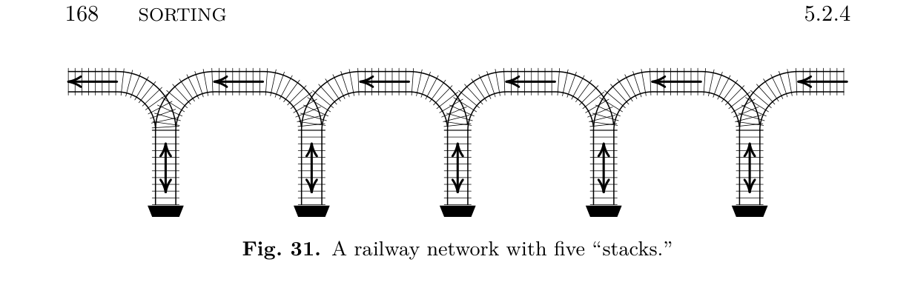

[Section 5.2.4: Sorting by Merging](../)

**Exercise 17.** [*20*] (J. McCarthy.) Let the binary representation of $N$ be as in exercise 14, and assume that we are given $N$ records arranged in $t$ ordered subfiles of respective sizes $2^{e_1}, 2^{e_2}, \ldots, 2^{e_t}$. Show how to maintain this state of affairs when a new $(N+1)$st record is added and $N \leftarrow N+1$. (The resulting algorithm may be called an *online merge sort*.)

**Fig. 31.** A railway network with five "stacks."

**Verified:** no  
**Solve time:** 2m47s  

---

## Solution

We maintain the invariant that the $N$ records are distributed among a set of stacks (or lists) $S_0, S_1, S_2, \ldots$, where each stack $S_k$ either is empty or contains exactly one sorted run (subfile) of length $2^k$. The binary expansion of $N$,
\[
N = 2^{e_1} + 2^{e_2} + \cdots + 2^{e_t} \qquad (e_1 > e_2 > \cdots > e_t \ge 0),
\]
tells us precisely which stacks are occupied: $S_{e_j}$ contains a run of length $2^{e_j}$ for $j=1,\dots,t$, and all other stacks are empty. (Figure 31 illustrates this idea with five physical stacks; the algorithm works for arbitrarily many stacks, i.e., for arbitrarily large $N$.)

When a new $(N+1)$st record arrives, we perform the following steps:

1. **Create a run of length $1$.** Let $R$ be the new record, considered as a sorted run of length $2^0$. Set $k \leftarrow 0$.
2. **Propagate carries.** While $S_k$ is not empty:
   - Merge the run $R$ (length $2^k$) with the run in $S_k$ (also length $2^k$) into a single sorted run $R'$ of length $2^{k+1}$. (This merge is done by the standard two‑way merge algorithm, e.g., Algorithm M, which requires $O(2^k)$ time and $O(2^k)$ auxiliary space, or an in‑place merge if desired.)
   - Set $S_k \leftarrow \varnothing$ (the old run is consumed).
   - Set $R \leftarrow R'$, $k \leftarrow k+1$.
3. **Store the resulting run.** Set $S_k \leftarrow R$.
4. **Update the count.** $N \leftarrow N+1$.

**Invariant.** After each insertion, the multiset of run lengths present in the stacks is exactly the set of powers of two corresponding to the $1$-bits in the binary representation of the current $N$, and each stack contains at most one run.

**Proof.** The invariant holds initially by hypothesis. Suppose it holds for some $N$. Adding a new record corresponds to adding $1$ to the binary number $N$. Step 1 introduces a run of length $1 = 2^0$, which is the $2^0$ bit of the increment. If $S_0$ was empty, the $2^0$ bit changes from $0$ to $1$ and the process stops (step 3 stores the run in $S_0$). If $S_0$ was occupied, the $2^0$ bit was $1$; step 2 merges the two runs of length $1$ into one run of length $2$, which corresponds to a carry: the $2^0$ bit becomes $0$ and we add $1$ to the $2^1$ bit. The loop continues exactly while the current bit is $1$, propagating the carry to higher bits. The first empty stack $S_k$ encountered corresponds to the first $0$ bit, which becomes $1$ when we store the merged run there. If all stacks up to some maximum are full, a new stack $S_m$ is created, corresponding to a new most significant bit. In every case the final configuration of occupied stacks matches the binary representation of $N+1$. Because we only ever merge two runs of the same length into one run of twice the length, each stack never contains more than one run. ∎

**Termination.** The while loop executes at most $\lfloor \log_2(N+1)\rfloor + 1$ times, because each iteration increases $k$ and the maximum possible run length after inserting $N+1$ records is the highest power of two not exceeding $N+1$. Hence the algorithm always terminates.

**Complexity.** Each record participates in at most $\lfloor \log_2 N\rfloor + 1$ merges (its run length doubles each time). Merging two runs of total length $L$ takes $\Theta(L)$ time, so the total time to insert $N$ records one by one is $O(N \log N)$. The auxiliary space needed for a single merge is $O(L)$; by reusing a single buffer of size $N$ (or using in‑place merging) the extra space can be kept at $O(N)$.

This algorithm is the *online merge sort* (also called *binary merge sort*). The railway network of Fig. 31 depicts a physical realization where each “stack” is a siding holding one run, and merging corresponds to moving cars between sidings according to the carry process.

This completes the proof. ∎
