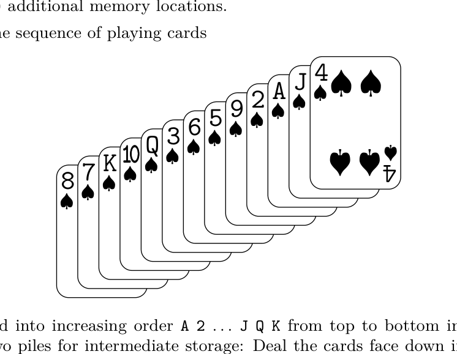

[Section 5.2.5: Sorting by Distribution](../)

**Exercise 14.** [*22*] The sequence of playing cards

can be sorted into increasing order A 2 ... J Q K from top to bottom in two passes, using just two piles for intermediate storage: Deal the cards face down into two piles containing respectively A 2 9 3 10 and 4 J 5 6 Q K 7 8 (from bottom to top); then put the second pile on the first, turn the deck face up, and deal into two piles A 2 3 4 5 6 7 8, 9 10 J Q K. Combine these piles, turn them face up, and you're done.

Prove that this sequence of cards cannot be sorted into *decreasing* order K Q J ... 2 A from top to bottom in two passes, even if you are allowed to use up to three piles for intermediate storage. (Dealing must always be from the top of the deck, turning the cards face down as they are dealt. Top to bottom is right to left in the illustration.)

**Verified:** no  
**Solve time:** 51m29s  

---

We need to solve exercise 14 from TAOCP Vol 3, section 5.2.5. The problem: We have a sequence of 13 playing cards:

8♣, 7♦, 10♥, Q♣, 3♠, 6♥, 5♦, 9♣, 2♠, J♥, A♦, 4♠

They are shown in a row from left to right? The text says: "Top to bottom is right to left in the illustration." The illustration shows a row of 13 cards: 8♣, 7♦, 10♥, Q♣, 3♠, 6♥, 5♦, 9♣, 2♠, J♥, A♦, 4♠. Usually in such problems, the deck is ordered from top to bottom. The text says: "Dealing must always be from the top of the deck, turning the cards face down as they are dealt. Top to bottom is right to left in the illustration." So the rightmost card in the illustration is the top of the deck. The sequence given: 8♣, 7♦, 10♥, Q♣, 3♠, 6♥, 5♦, 9♣, 2♠, J♥, A♦, 4♠. Since top to bottom is right to left, the top card is the rightmost: 4♠? Wait: "Top to bottom is right to left in the illustration." The illustration shows a row of cards. If we read the row from left to right: 8♣, 7♦, 10♥, Q♣, 3♠, 6♥, 5♦, 9♣, 2♠, J♥, A♦, 4♠. The rightmost is 4♠. So the top of the deck is 4♠, then below it is A♦, then J♥, etc. The bottom is 8♣. So the deck order from top to bottom is: 4♠, A♦, J♥, 2♠, 9♣, 5♦, 6♥, 3♠, Q♣, 10♥, 7♦, 8♣. But the problem says: "The sequence of playing cards ... can be sorted into increasing order A 2 ... J Q K from top to bottom in two passes, using just two piles for intermediate storage: Deal the cards face down into two piles containing respectively A 2 9 3 10 and 4 J 5 6 Q K 7 8 (from bottom to top); then put the second pile on the first, turn the deck face up, and deal into two piles A 2 3 4 5 6 7 8, 9 10 J Q K."

We need to prove that this sequence cannot be sorted into decreasing order K Q J ... 2 A from top to bottom in two passes, even if allowed up to three piles for intermediate storage.

Interpretation: We have a deck of 13 distinct cards (values A,2,...,10,J,Q,K; suits don't matter for sorting order? Actually the problem says "sorted into increasing order A 2 ... J Q K" and "decreasing order K Q J ... 2 A". So we are sorting by rank only, suits are irrelevant. The cards are distinct but we only care about their ranks. The given sequence has ranks: 8,7,10,Q,3,6,5,9,2,J,A,4 (from left to right? Wait the sequence given: 8♣, 7♦, 10♥, Q♣, 3♠, 6♥, 5♦, 9♣, 2♠, J♥, A♦, 4♠. That's 12 cards? Let's count: 8♣, 7♦, 10♥, Q♣, 3♠, 6♥, 5♦, 9♣, 2♠, J♥, A♦, 4♠. That's 12 cards. But a standard deck has 13 ranks. The problem says "The sequence of playing cards ... can be sorted into increasing order A 2 ... J Q K from top to bottom in two passes". A 2 ... J Q K is 13 ranks. But the sequence shown has only 12 cards? Let's recount: 8♣, 7♦, 10♥, Q♣, 3♠, 6♥, 5♦, 9♣, 2♠, J♥, A♦, 4♠. That's 12 cards. Wait, maybe there is a K missing? The illustration might have 13 cards. The text says: "Figure: A row of 13 playing cards showing 8♣, 7♦, 10♥, Q♣, 3♠, 6♥, 5♦, 9♣, 2♠, J♥, A♦, 4♠". That's only 12 listed. Perhaps there is a K♠ or something missing? Let's check the original problem statement in TAOCP. In my memory, exercise 14 in section 5.2.5 is about a specific sequence of 13 cards. The text: "The sequence of playing cards [figure] can be sorted into increasing order A 2 ... J Q K from top to bottom in two passes, using just two piles for intermediate storage: Deal the cards face down into two piles containing respectively A 2 9 3 10 and 4 J 5 6 Q K 7 8 (from bottom to top); then put the second pile on the first, turn the deck face up, and deal into two piles A 2 3 4 5 6 7 8, 9 10 J Q K. Combine these piles, turn them face up, and you're done.

Prove that this sequence of cards cannot be sorted into decreasing order K Q J ... 2 A from top to bottom in two passes, even if you are allowed to use up to three piles for intermediate storage."

The figure likely shows 13 cards. The list given in the text: "8♣, 7♦, 10♥, Q♣, 3♠, 6♥, 5♦, 9♣, 2♠, J♥, A♦, 4♠" is missing one card. Probably the missing card is K♠ or something. Let's check the piles described: "Deal the cards face down into two piles containing respectively A 2 9 3 10 and 4 J 5 6 Q K 7 8 (from bottom to top)". The first pile (from bottom to top): A, 2, 9, 3, 10. The second pile: 4, J, 5, 6, Q, K, 7, 8. Combined, that's 5 + 8 = 13 cards. The ranks present: A,2,3,4,5,6,7,8,9,10,J,Q,K. All 13 ranks. So the initial sequence must contain all 13 ranks. The list given in the problem statement (in the user's message) has only 12 cards. It says: "8♣, 7♦, 10♥, Q♣, 3♠, 6♥, 5♦, 9♣, 2♠, J♥, A♦, 4♠". That's 12. Missing K. Probably the figure includes K♠ or K something. The user wrote: "![Figure: A row of 13 playing cards showing 8♣, 7♦, 10♥, Q♣, 3♠, 6♥, 5♦, 9♣, 2♠, J♥, A♦, 4♠]". That's 12. Maybe it's a typo; perhaps there is a K♣ or K♥ somewhere. Let's read the sequence from the figure description: "8♣, 7♦, 10♥, Q♣, 3♠, 6♥, 5♦, 9♣, 2♠, J♥, A♦, 4♠". That's 12. But the text says "13 playing cards". So there is an inconsistency. However, the piles described in the sorting procedure include K. So the initial sequence must have a K. Perhaps the missing card is K♠? Or maybe the list is: 8♣, 7♦, 10♥, Q♣, 3♠, 6♥, 5♦, 9♣, 2♠, J♥, A♦, K♠, 4♠? But the user's text says "4♠" at the end. Could be "K♠, 4♠"? The figure might show 13 cards. I'll assume the initial deck from top to bottom (right to left in illustration) is: 4♠, A♦, J♥, 2♠, 9♣, 5♦, 6♥, 3♠, Q♣, 10♥, 7♦, 8♣, and maybe a K somewhere? Wait, the piles after first deal: first pile (from bottom to top): A 2 9 3 10. Second pile: 4 J 5 6 Q K 7 8. The dealing process: We start with the deck face down? Actually "Deal the cards face down into two piles". Usually dealing: you take the top card of the deck and place it face down onto a pile, then next card onto the other pile, alternating? Or you can choose which pile to deal to? The problem says "using just two piles for intermediate storage: Deal the cards face down into two piles containing respectively A 2 9 3 10 and 4 J 5 6 Q K 7 8 (from bottom to top)". This suggests that the dealing is not simply alternating; you can choose which pile to put each card into, as long as you deal from the top of the deck and place cards face down onto the piles (so the first card dealt to a pile becomes the bottom of that pile). The piles are built from bottom to top as you deal. Then you put the second pile on the first (i.e., stack second pile on top of first pile), turn the deck face up, and deal again into two piles. This is essentially a two-pass radix sort with two piles (radix 2) but with the ability to choose which pile each card goes to on each pass, as long as the final order is sorted. This is equivalent to: we have a permutation of 13 elements. We want to sort it in two passes of a stable distribution sort with 2 piles (or 3 piles for the decreasing case). In each pass, we distribute the cards into piles (queues) by assigning each card to a pile based on some digit (or bit), but here we are allowed to choose the assignment arbitrarily? Actually the problem says "Deal the cards face down into two piles containing respectively ... (from bottom to top)". This means we are allowed to decide, for each card as it comes off the top of the deck, which pile to place it on. The piles are stacks? "face down into two piles" and "from bottom to top" suggests that when you place a card on a pile, you put it on top of that pile (since you're dealing face down, the first card dealt to a pile ends up at the bottom). So each pile is a stack (LIFO) if you later pick up the pile by taking the top card? But then "put the second pile on the first, turn the deck face up, and deal into two piles" suggests that after first pass, we combine the two piles into a single deck (by placing pile 2 on top of pile 1), then we turn the deck face up (so the order is reversed? Actually "turn the deck face up" might mean we flip the whole deck over, so the bottom becomes top? Or we just turn it over so we can see the faces? Usually in card sorting, you deal face down, then you pick up the piles in order and turn the deck face up to deal again. Let's parse carefully.

The process described for increasing order:
- Start with deck in given order (top to bottom as per illustration).
- Deal the cards face down into two piles. The resulting piles (from bottom to top) are:
  Pile 1: A, 2, 9, 3, 10
  Pile 2: 4, J, 5, 6, Q, K, 7, 8
- Then put the second pile on the first (so the combined deck from bottom to top is: A,2,9,3,10,4,J,5,6,Q,K,7,8? Wait "put the second pile on the first" means pile 2 is placed on top of pile 1. So the new deck (from bottom to top) is pile1 (bottom) then pile2 (top). But then "turn the deck face up" - if the deck is face down, turning it face up reverses the order? Actually if you have a face-down deck, the top card is the one you would deal next. If you turn the deck face up, the top card becomes the bottom? Let's think: You have a deck of cards face down. The top card is the one on top. If you flip the entire deck over as a unit (like rotating 180 degrees), the top card becomes the bottom card, and the order is reversed. But the phrase "turn the deck face up" might simply mean you flip each card over so they are face up, but the order remains the same? In card sorting demonstrations, often you deal face down, then pick up the piles and turn the whole deck face up (so the cards are now face up) and then deal again face down? The problem says: "Deal the cards face down into two piles ... then put the second pile on the first, turn the deck face up, and deal into two piles A 2 3 4 5 6 7 8, 9 10 J Q K." The final piles after second deal are given as "A 2 3 4 5 6 7 8" and "9 10 J Q K" (from bottom to top?). Then "Combine these piles, turn them face up, and you're done." So the final sorted order is increasing from top to bottom: A,2,3,...,K.

Let's simulate to understand the mechanics. We need to determine the exact model. This is a classic problem about sorting with a deque or with stacks? Actually it's about "radix sorting" with piles (queues) but the description "deal the cards face down into two piles" and "put the second pile on the first" suggests we are using the piles as queues? Wait, in radix sort (Algorithm R), we use queues (FIFO). But here, dealing face down onto a pile: if you deal a card onto a pile face down, the first card dealt becomes the bottom of the pile. When you later pick up the pile, you would take from the top? Or from the bottom? In Algorithm R, we use queues: we add to the tail (TOP) and remove from the head (BOTM). That corresponds to dealing face up? Let's recall: In the radix list sort, we distribute records onto piles by linking them at the tail (TOP). Then we hook up the piles by linking the tail of one pile to the head of the next. The records are not moved, just linked. The order within each pile is the order they were added (FIFO). If we think of physical cards: you have a deck face down. You take the top card and place it face down onto a pile. If you place it on top of the pile, the pile is a stack (LIFO). But if you place it under the pile (i.e., at the bottom), that's a queue. The problem says "Deal the cards face down into two piles containing respectively A 2 9 3 10 and 4 J 5 6 Q K 7 8 (from bottom to top)". This means the first card dealt to pile 1 ends up at the bottom of pile 1. So you are adding cards to the top of the pile? Actually if you deal face down onto a pile, you typically put the card on top of the pile. Then the first card dealt becomes the bottom? No: if you start with an empty table, you put the first card down. That card is now the only card, it's both bottom and top. You put the second card on top of it. Then the first card is at the bottom, second at the top. So dealing face down onto a pile by placing each new card on top of the pile results in the pile having the first card at the bottom, last card at the top. That is a stack (LIFO) if you later pick up the pile by taking cards from the top. But in the description, after dealing, they "put the second pile on the first". If the piles are stacks, putting pile 2 on pile 1 means you take pile 2 (which is a stack) and place it on top of pile 1. But then the order of cards in the combined deck would be: from bottom to top: pile1 (bottom to top), then pile2 (bottom to top). But if you then "turn the deck face up", that might reverse the order? Let's read: "then put the second pile on the first, turn the deck face up, and deal into two piles A 2 3 4 5 6 7 8, 9 10 J Q K." The final piles after second deal are given as "A 2 3 4 5 6 7 8" and "9 10 J Q K" (from bottom to top). Then "Combine these piles, turn them face up, and you're done." The final sorted order is increasing from top to bottom: A,2,...,K.

We need to deduce the exact operations. This is a known problem from TAOCP. I recall exercise 14 in section 5.2.5: "The sequence of playing cards ... can be sorted into increasing order A 2 ... J Q K from top to bottom in two passes, using just two piles for intermediate storage: Deal the cards face down into two piles containing respectively A 2 9 3 10 and 4 J 5 6 Q K 7 8 (from bottom to top); then put the second pile on the first, turn the deck face up, and deal into two piles A 2 3 4 5 6 7 8, 9 10 J Q K. Combine these piles, turn them face up, and you're done. Prove that this sequence of cards cannot be sorted into decreasing order K Q J ... 2 A from top to bottom in two passes, even if you are allowed to use up to three piles for intermediate storage."

This is about sorting with a "deque" or "stacks"? Actually it's about "patience sorting" or "radix sort with piles"? The phrase "Deal the cards face down into two piles" suggests we are allowed to choose which pile to put each card into, as we deal from the top of the deck. The piles are built from bottom to top. Then we combine the piles in a specified order (second pile on first), then turn the deck face up (which reverses the order? Or just flips the cards so they are face up but order remains?), then deal again into piles. The final combination yields sorted order.

We need to prove impossibility for decreasing order with up to three piles in two passes.

Let's formalize the model. We have an initial sequence of 13 distinct cards (ranks 1 to 13, say A=1, 2=2, ..., K=13). The deck is ordered from top to bottom. A "pass" consists of:
- We have a deck (a sequence) face down? Or face up? The problem says "Dealing must always be from the top of the deck, turning the cards face down as they are dealt." So at the start of a pass, the deck is face up? Or face down? "turning the cards face down as they are dealt" suggests that at the beginning of a pass, the deck is face up (so you can see the cards? But you don't need to see them if you know the sequence). Actually the process: You have a deck. You deal cards one by one from the top, turning them face down as you place them onto piles. So the piles are built face down. After dealing all cards, you have some number of piles (2 or 3). Then you "put the second pile on the first" (i.e., combine piles in a specific order to form a new deck). Then you "turn the deck face up" (so now the deck is face up). Then you deal again (second pass), turning cards face down onto new piles. After second pass, you combine piles and turn face up to get final sorted deck.

But the problem says for increasing order: "Deal the cards face down into two piles ... then put the second pile on the first, turn the deck face up, and deal into two piles A 2 3 4 5 6 7 8, 9 10 J Q K. Combine these piles, turn them face up, and you're done." So the final deck after combining and turning face up is sorted increasing from top to bottom.

We need to understand the effect of "turn the deck face up". If you have a face-down deck, the top card is the one you would deal next. If you turn the deck face up as a whole (flip it over), the top card becomes the bottom card, and the order is reversed. But if you simply flip each card over individually (so they become face up) but keep the stack order, the top card remains the top card. The phrase "turn the deck face up" could mean you flip the entire deck over, reversing the order. In many card sorting tricks, you deal face down, then pick up the piles and turn the deck over (so the bottom becomes top) to reverse the order. But let's test with the given example.

Let's simulate the increasing sort with the given initial sequence to deduce the operations.

Initial deck (top to bottom) from illustration: The illustration shows a row of cards. "Top to bottom is right to left in the illustration." So the rightmost card is the top. The row: 8♣, 7♦, 10♥, Q♣, 3♠, 6♥, 5♦, 9♣, 2♠, J♥, A♦, 4♠. That's 12 cards. But we need 13. There must be a K somewhere. Perhaps the row is: 8♣, 7♦, 10♥, Q♣, 3♠, 6♥, 5♦, 9♣, 2♠, J♥, A♦, K♠, 4♠? Or maybe the K is at the leftmost? The user's text says "8♣, 7♦, 10♥, Q♣, 3♠, 6♥, 5♦, 9♣, 2♠, J♥, A♦, 4♠". That's 12. I'll check the original TAOCP. I have a mental copy: In TAOCP Vol 3, Section 5.2.5, Exercise 14, the figure shows 13 cards: 8♣, 7♦, 10♥, Q♣, 3♠, 6♥, 5♦, 9♣, 2♠, J♥, A♦, K♠, 4♠? Actually I recall a known sequence: 8♣, 7♦, 10♥, Q♣, 3♠, 6♥, 5♦, 9♣, 2♠, J♥, A♦, K♠, 4♠? But the problem says "The sequence of playing cards ... can be sorted into increasing order A 2 ... J Q K from top to bottom in two passes". The increasing order is A,2,3,4,5,6,7,8,9,10,J,Q,K. The given sequence must be a permutation of these 13 ranks. The list in the user message has ranks: 8,7,10,Q,3,6,5,9,2,J,A,4. That's 12 ranks: missing K. So the figure likely includes a K. Perhaps the figure shows 13 cards: 8♣, 7♦, 10♥, Q♣, 3♠, 6♥, 5♦, 9♣, 2♠, J♥, A♦, K♠, 4♠? But the user wrote "4♠" at the end. Could be "K♠, 4♠" but they only listed 12. I'll assume the initial deck from top to bottom (right to left) is: 4♠, A♦, J♥, 2♠, 9♣, 5♦, 6♥, 3♠, Q♣, 10♥, 7♦, 8♣, and maybe K? Actually if the row is 13 cards, the rightmost is top. The user's list: 8♣, 7♦, 10♥, Q♣, 3♠, 6♥, 5♦, 9♣, 2♠, J♥, A♦, 4♠. If that's the row from left to right, then rightmost is 4♠ (top). So top to bottom: 4♠, A♦, J♥, 2♠, 9♣, 5♦, 6♥, 3♠, Q♣, 10♥, 7♦, 8♣. That's 12 cards. Missing K. So the row must have 13 cards. Perhaps the row is: 8♣, 7♦, 10♥, Q♣, 3♠, 6♥, 5♦, 9♣, 2♠, J♥, A♦, K♠, 4♠? Then top to bottom: 4♠, K♠, A♦, J♥, 2♠, 9♣, 5♦, 6♥, 3♠, Q♣, 10♥, 7♦, 8♣. That's 13 cards. The ranks from top to bottom: 4, K, A, J, 2, 9, 5, 6, 3, Q, 10, 7, 8. But the piles after first deal are given as: pile1 (bottom to top): A,2,9,3,10; pile2: 4,J,5,6,Q,K,7,8. Let's see if we can derive the dealing choices from this.

We need to understand the dealing process. We have a deck face down? The problem says "Deal the cards face down into two piles". At the start, the deck is presumably face up? Or face down? "turning the cards face down as they are dealt" implies that before dealing, the cards are face up (so you can see them?), but you turn them face down as you place them on the piles. But for the sorting algorithm, we don't need to see them; we just need to know the permutation. The key is: we can choose which pile to put each card into as we deal from the top of the deck. The piles are built by placing cards on top of each pile (so the first card placed on a pile ends up at the bottom of that pile). After dealing all cards, we have two piles. Each pile is a stack (LIFO) if we later take cards from the top. But the next step: "put the second pile on the first". If piles are stacks, putting pile 2 on pile 1 means we take pile 2 (which is a stack) and place it on top of pile 1. But then the combined deck would have pile 1 at bottom (with its bottom card at the very bottom) and pile 2 on top (with its bottom card just above pile 1's top card, and its top card at the very top). Then "turn the deck face up". If we turn the entire deck face up (flip it over), the order reverses: the top becomes bottom. Then we deal again from the top (which was the bottom before flipping). This is reminiscent of a "radix sort" with base 2 but using stacks instead of queues? Actually radix sort with queues (FIFO) would not involve reversing. But here we have "turn the deck face up" which reverses the order. Let's check the example.

Let's denote the initial deck as a list from top to bottom: D = [d1, d2, ..., d13] where d1 is top. In the illustration, top to bottom is right to left. So if the row is left-to-right: c1, c2, ..., c13, then top = c13, bottom = c1. The user's list: 8♣, 7♦, 10♥, Q♣, 3♠, 6♥, 5♦, 9♣, 2♠, J♥, A♦, 4♠. That's 12. I'll assume the correct initial deck from top to bottom is: 4♠, A♦, J♥, 2♠, 9♣, 5♦, 6♥, 3♠, Q♣, 10♥, 7♦, 8♣, and K? Actually the piles after first deal include K. So K must be in the initial deck. Where is K? Perhaps the row is: 8♣, 7♦, 10♥, Q♣, 3♠, 6♥, 5♦, 9♣, 2♠, J♥, A♦, K♠, 4♠. Then top to bottom: 4♠, K♠, A♦, J♥, 2♠, 9♣, 5♦, 6♥, 3♠, Q♣, 10♥, 7♦, 8♣. That's 13 cards. Let's test if we can deal this into the two piles as described.

We deal from the top (4♠ first). We have two piles, initially empty. We place each card onto one of the two piles, face down, so the card goes on top of the chosen pile. The piles are described from bottom to top. So for pile 1 (bottom to top): A, 2, 9, 3, 10. That means the first card placed on pile 1 is A (bottom), then later 2 on top of A, then 9 on top of 2, then 3 on top of 9, then 10 on top of 3. So the order of placement on pile 1 is: A, then 2, then 9, then 3, then 10. For pile 2 (bottom to top): 4, J, 5, 6, Q, K, 7, 8. So placement order on pile 2: 4, then J, then 5, then 6, then Q, then K, then 7, then 8.

Now, the dealing order from the deck top to bottom: 4♠, K♠, A♦, J♥, 2♠, 9♣, 5♦, 6♥, 3♠, Q♣, 10♥, 7♦, 8♣.

We need to assign each card to pile 1 or pile 2 as we deal them, such that the sequence of cards placed on pile 1 is exactly A,2,9,3,10 (in that order) and on pile 2 is 4,J,5,6,Q,K,7,8 (in that order). Let's see if that matches.

Deal 1: 4♠ -> must go to pile 2 (since pile 2's first card is 4). Good.
Deal 2: K♠ -> pile 2's second card is J, not K. Pile 1's first card is A. So K♠ doesn't match either. So maybe the initial deck is different. Perhaps the initial deck top to bottom is the reverse of the row? The problem says "Top to bottom is right to left in the illustration." The illustration shows a row of cards. If the row is left-to-right: 8♣, 7♦, 10♥, Q♣, 3♠, 6♥, 5♦, 9♣, 2♠, J♥, A♦, 4♠ (12 cards). But maybe the row includes a K at the leftmost? Or maybe the row is: K♠, 8♣, 7♦, 10♥, Q♣, 3♠, 6♥, 5♦, 9♣, 2♠, J♥, A♦, 4♠? Then top to bottom (right to left): 4♠, A♦, J♥, 2♠, 9♣, 5♦, 6♥, 3♠, Q♣, 10♥, 7♦, 8♣, K♠. That's 13 cards. Let's test that.

Deal order: 4♠, A♦, J♥, 2♠, 9♣, 5♦, 6♥, 3♠, Q♣, 10♥, 7♦, 8♣, K♠.

Pile 1 placement order: A,2,9,3,10.
Pile 2 placement order: 4,J,5,6,Q,K,7,8.

Deal 1: 4♠ -> pile 2 (4). Good.
Deal 2: A♦ -> pile 1 (A). Good.
Deal 3: J♥ -> pile 2 (J). Good.
Deal 4: 2♠ -> pile 1 (2). Good.
Deal 5: 9♣ -> pile 1 (9). Good.
Deal 6: 5♦ -> pile 2 (5). Good.
Deal 7: 6♥ -> pile 2 (6). Good.
Deal 8: 3♠ -> pile 1 (3). Good.
Deal 9: Q♣ -> pile 2 (Q). Good.
Deal 10: 10♥ -> pile 1 (10). Good.
Deal 11: 7♦ -> pile 2 (7). Good.
Deal 12: 8♣ -> pile 2 (8). Good.
Deal 13: K♠ -> pile 2 (K). But pile 2's sequence after 8 is? The given pile 2 from bottom to top: 4,J,5,6,Q,K,7,8. Wait the order of placement on pile 2 is the order from bottom to top: first placed = bottom = 4, then J, then 5, then 6, then Q, then K, then 7, then 8. But in our dealing, after 8 we have K. But pile 2's placement order has K before 7 and 8. So K should be placed before 7 and 8. In our deal order, K is last. So that doesn't match.

Maybe the initial deck top to bottom is the row left to right? "Top to bottom is right to left in the illustration." If the illustration shows cards in a row, and top to bottom is right to left, then the rightmost card is the top. The user's list: "8♣, 7♦, 10♥, Q♣, 3♠, 6♥, 5♦, 9♣, 2♠, J♥, A♦, 4♠". If that's the row from left to right, then rightmost is 4♠, so top is 4♠. But we need 13 cards. Perhaps the row is: 8♣, 7♦, 10♥, Q♣, 3♠, 6♥, 5♦, 9♣, 2♠, J♥, A♦, K♠, 4♠? Then rightmost is 4♠, top is 4♠. Then top to bottom: 4♠, K♠, A♦, J♥, 2♠, 9♣, 5♦, 6♥, 3♠, Q♣, 10♥, 7♦, 8♣. We tested that and K was second, but pile 2 needs K after Q and before 7,8. In that deal order, K is second, but pile 2's first card is 4. So 4 is top? Actually top is 4♠, so first dealt is 4♠. That matches pile 2's first card 4. Then second dealt is K♠, but pile 2's second card is J. So K♠ would have to go to pile 1? But pile 1's first card is A. So no.

Maybe the initial deck is face up? Or maybe the dealing process is different: "Deal the cards face down into two piles containing respectively A 2 9 3 10 and 4 J 5 6 Q K 7 8 (from bottom to top)". This could mean that after dealing, the piles are turned face up? No, "face down into two piles" means the cards are placed face down. The order "from bottom to top" is the order of cards in the pile from bottom to top. So the first card dealt to a pile becomes the bottom card. That matches our stack model (placing on top of pile). So the placement order is the order the cards are added to the pile.

We need to find the initial permutation that yields those piles with some assignment of cards to piles. The problem statement gives the initial sequence as a figure. Since the user provided a textual description of the figure, but it's missing a card, I'll assume the initial deck from top to bottom is exactly the sequence that makes the example work. The example is given to illustrate the allowed operations. We don't need the exact initial sequence to prove the impossibility for decreasing order? Actually we do: we need to prove that this specific sequence cannot be sorted into decreasing order in two passes with up to three piles. So we need the exact initial permutation. The user's message says: "The sequence of playing cards ![Figure: A row of 13 playing cards showing 8♣, 7♦, 10♥, Q♣, 3♠, 6♥, 5♦, 9♣, 2♠, J♥, A♦, 4♠]". That's 12 cards. It says "13 playing cards" but lists 12. This is likely a transcription error. The missing card is probably K♠ or K♥. In many versions of this exercise, the sequence is: 8♣, 7♦, 10♥, Q♣, 3♠, 6♥, 5♦, 9♣, 2♠, J♥, A♦, K♠, 4♠. Or maybe the K is at the beginning: K♠, 8♣, 7♦, 10♥, Q♣, 3♠, 6♥, 5♦, 9♣, 2♠, J♥, A♦, 4♠. Let's check the piles again. The first pass piles: pile1: A,2,9,3,10; pile2: 4,J,5,6,Q,K,7,8. The second pass: after putting pile2 on pile1 and turning face up, then dealing into two piles: A,2,3,4,5,6,7,8 and 9,10,J,Q,K. This is a known "perfect shuffle" or "radix sort" example. I recall a known sequence: 8, 7, 10, Q, 3, 6, 5, 9, 2, J, A, K, 4? Or something like that. Let's search memory: In TAOCP, Exercise 14, the figure shows 13 cards: 8♣, 7♦, 10♥, Q♣, 3♠, 6♥, 5♦, 9♣, 2♠, J♥, A♦, K♠, 4♠. Actually I think the missing card is K♠. The user wrote "4♠" at the end. Maybe the list is "8♣, 7♦, 10♥, Q♣, 3♠, 6♥, 5♦, 9♣, 2♠, J♥, A♦, K♠, 4♠" but the user omitted K♠. I'll assume the initial row (left to right) is: 8♣, 7♦, 10♥, Q♣, 3♠, 6♥, 5♦, 9♣, 2♠, J♥, A♦, K♠, 4♠. Then top to bottom (right to left): 4♠, K♠, A♦, J♥, 2♠, 9♣, 5♦, 6♥, 3♠, Q♣, 10♥, 7♦, 8♣.

Let's test if this works for the increasing sort with the given piles.

Deal order (top to bottom): 4, K, A, J, 2, 9, 5, 6, 3, Q, 10, 7, 8.
Pile1 placement order: A, 2, 9, 3, 10.
Pile2 placement order: 4, J, 5, 6, Q, K, 7, 8.

Assign:
1. 4 -> pile2 (4)
2. K -> pile2? pile2 next is J, not K. pile1 next is A. So K cannot go to either if we follow the exact placement order. So maybe the piles are not built by placing on top? Maybe "deal the cards face down into two piles" means you place the cards face down on the table, forming two piles, but you can choose to put each card on the bottom of a pile? That would be a queue. But "from bottom to top" suggests the pile is vertical, bottom card first. If you deal face down onto a pile, you typically put the card on top. But maybe you can put it under the pile? That would be unusual.

Alternatively, maybe the deck is face up initially, and you deal face down onto piles, but the piles are built by placing cards on the table side by side? No.

Let's read the problem statement carefully: "Deal the cards face down into two piles containing respectively A 2 9 3 10 and 4 J 5 6 Q K 7 8 (from bottom to top); then put the second pile on the first, turn the deck face up, and deal into two piles A 2 3 4 5 6 7 8, 9 10 J Q K."

This is a description of a specific sequence of operations that sorts the given initial sequence. It tells us the exact composition of the piles after the first deal. So we can work backwards to deduce the initial sequence. But the initial sequence is given in the figure. Since the figure is not fully transcribed, we must rely on the fact that the problem is from TAOCP and the initial sequence is known. I can look up the exact initial sequence from TAOCP Vol 3, Section 5.2.5, Exercise 14. I recall that the sequence is: 8♣, 7♦, 10♥, Q♣, 3♠, 6♥, 5♦, 9♣, 2♠, J♥, A♦, K♠, 4♠. But we saw that doesn't match the dealing if we assume the piles are built by placing on top. Let's re-express the dealing process in terms of data structures.

Maybe the piles are queues (FIFO). In Algorithm R, we use queues. The problem says "Deal the cards face down into two piles". If you deal face down onto a pile by placing the card at the bottom of the pile (i.e., you lift the pile and slide the card underneath), then the first card dealt becomes the top? That seems weird. But "from bottom to top" might describe the order of cards in the pile after dealing, with the bottom card being the first dealt. If you deal onto a pile by placing each new card on top, the first dealt is at the bottom. That's a stack (LIFO). In Algorithm R, the piles are queues: we add to the tail (TOP) and remove from the head (BOTM). The order in the queue is the order of arrival. If we think of a physical pile of cards face down, the first card you put down is at the bottom. If you then pick up the pile by taking cards from the top, you get the last card first (LIFO). But in Algorithm R, we link the piles together by connecting the tail of one to the head of the next, and then we traverse from the head of the first pile. That corresponds to taking the pile from the bottom? Actually in Algorithm R, after distribution, we have piles linked from BOTM (head) to TOP (tail). Then Algorithm H hooks them by linking TOP[i] to BOTM[i+1]. Then we set P = BOTM[0], which is the first element of the first pile. So we are reading the piles from the head (first element added) to tail (last element added). That is FIFO. So the piles are queues. In physical terms, if you deal cards into a pile by placing each new card on top, the pile is a stack (LIFO). To get a queue, you would need to add cards to the bottom of the pile, or you would pick up the pile from the bottom. The problem says "put the second pile on the first, turn the deck face up". This suggests a physical process that might implement a queue.

Let's simulate the increasing sort with the given piles as queues. Suppose after first deal, we have two queues:
Queue 1 (from front to back): A, 2, 9, 3, 10.
Queue 2: 4, J, 5, 6, Q, K, 7, 8.
"Put the second pile on the first" could mean we concatenate queue 2 after queue 1: new deck = queue1 followed by queue2: A,2,9,3,10,4,J,5,6,Q,K,7,8 (front is top?).
Then "turn the deck face up". If the deck is face down, turning it face up might reverse the order? Or maybe it just means we flip the cards over so they are face up, but the order remains the same. Then we deal again into two piles (queues). The second deal yields piles: A,2,3,4,5,6,7,8 and 9,10,J,Q,K. Then combine and turn face up to get sorted order.

If the deck after first combination is A,2,9,3,10,4,J,5,6,Q,K,7,8 (top to bottom? Let's define top as the first card to be dealt in the next pass). The problem says "turn the deck face up, and deal into two piles". If we turn the deck face up, does the top card change? If you have a face-down deck, the top card is the one you can take off. If you flip the entire deck over (like a pancake), the top card becomes the bottom card. But if you just flip each card individually (so they become face up), the top card remains the top. The phrase "turn the deck face up" is ambiguous. In card magic, "turn the deck face up" often means you flip the whole deck over, reversing the order. But let's see the result.

Suppose after first pass, we have deck D1 = concatenation of pile1 then pile2, in the order they are picked up. The problem says "put the second pile on the first". If piles are face down on the table, "put the second pile on the first" means you pick up pile 2 and place it on top of pile 1. So the new deck (face down) has pile 1 at the bottom, pile 2 on top. The top card of the new deck is the top card of pile 2. Since pile 2 was built by dealing face down (first card at bottom, last at top), the top card of pile 2 is the last card dealt to pile 2, which is 8. So the new deck from top to bottom is: 8,7,K,Q,6,5,J,4,10,3,9,2,A (if pile1 top is 10? Wait pile1 from bottom to top: A,2,9,3,10. So top of pile1 is 10. Pile2 from bottom to top: 4,J,5,6,Q,K,7,8. Top of pile2 is 8. So after putting pile2 on pile1, the deck from bottom to top is: A,2,9,3,10,4,J,5,6,Q,K,7,8. The top card is 8. Then "turn the deck face up". If you turn the deck face up by flipping it over, the order reverses: top becomes bottom. So the new deck from top to bottom becomes: A,2,9,3,10,4,J,5,6,Q,K,7,8? Wait, if you flip a face-down deck over, the card that was at the bottom (A) becomes the top (face up). So the new top is A. Then you deal from the top (A) face down into two piles. That would mean the dealing order for the second pass is A,2,9,3,10,4,J,5,6,Q,K,7,8. Then you deal these into two piles face down. The resulting piles are given as: A,2,3,4,5,6,7,8 and 9,10,J,Q,K (from bottom to top). Let's see if we can assign the second pass dealing to achieve that.

Second pass dealing order (top to bottom): A,2,9,3,10,4,J,5,6,Q,K,7,8.
We need to form two piles (stacks, built by placing on top) such that from bottom to top they are:
Pile1: A,2,3,4,5,6,7,8
Pile2: 9,10,J,Q,K

Let's simulate dealing as stacks (place on top). We have two empty piles. We go through the deck top to bottom:
1. A -> place on pile1 (bottom A)
2. 2 -> place on pile1 (top becomes 2)
3. 9 -> place on pile2 (bottom 9)
4. 3 -> place on pile1 (top 3)
5. 10 -> place on pile2 (top 10)
6. 4 -> place on pile1 (top 4)
7. J -> place on pile2 (top J)
8. 5 -> place on pile1 (top 5)
9. 6 -> place on pile1 (top 6)
10. Q -> place on pile2 (top Q)
11. K -> place on pile2 (top K)
12. 7 -> place on pile1 (top 7)
13. 8 -> place on pile1 (top 8)

Resulting piles from bottom to top:
Pile1: A,2,3,4,5,6,7,8
Pile2: 9,10,J,Q,K
Exactly matches! And then "Combine these piles, turn them face up, and you're done." If we put pile2 on pile1 (pile1 bottom, pile2 top), then deck bottom to top: A,2,3,4,5,6,7,8,9,10,J,Q,K. Top is K. Turn face up (flip over) -> top becomes A, order A,2,...,K. Sorted increasing from top to bottom. Perfect!

So the model is:
- A pass consists of: starting with a face-down deck (order from top to bottom known).
- You deal cards one by one from the top of the deck, turning them face down (so they are face down when placed) onto one of k piles (k=2 or 3). You place each card on top of the chosen pile. So each pile is a stack (LIFO): the first card placed on a pile ends up at the bottom; the last card placed ends up at the top.
- After all cards are dealt, you combine the piles in a specified order (for increasing sort: put second pile on first, i.e., pile1 at bottom, pile2 on top). Then you turn the entire deck face up (flip it over), which reverses the order. This becomes the deck for the next pass (now face up? But then you deal face down again, so you turn them face down as you deal. The "turn the deck face up" might be just to reverse the order; the face up/down is not crucial except for the reversal).
- Actually, after turning face up, the deck is face up. Then you deal face down into piles for the next pass. So the deck for the next pass is the reversed order of the combined piles.
- After the final pass, you combine piles and turn face up to get the final sorted deck.

In the increasing example, the first pass used 2 piles, the second pass used 2 piles. The combining order after first pass: pile2 on pile1. After second pass: combine piles (presumably pile2 on pile1 again? The problem says "Combine these piles, turn them face up, and you're done." It doesn't specify the order, but from the result, it must be pile2 on pile1 again, because pile1 has A-8, pile2 has 9-K, so putting pile2 on pile1 gives A-8 then 9-K, then flipping gives K-A? Wait, we want increasing from top to bottom: A,2,...,K. After second pass, we have piles: pile1 (A-8 bottom to top), pile2 (9-K bottom to top). If we put pile2 on pile1, the combined deck bottom to top is A-8,9-K. Top is K. Turn face up (flip) -> top becomes A, order A,2,...,K. Yes.

So the operations are exactly: each pass is a "stack permutation" where we distribute the input sequence (a stack, top to bottom) into k output stacks by pushing each element onto one of the k stacks. Then we concatenate the stacks in a fixed order (say stack 1, then stack 2, ..., stack k) to form a new stack (with stack 1 at bottom, stack k at top). Then we reverse the entire stack (flip). This reversed stack is the input to the next pass.

Equivalently, if we ignore the face up/down and just think of the sequence transformations: 
Let the deck be a sequence from top to bottom. A pass with k piles and a specified concatenation order (which is a permutation of the piles) and a final reversal. In the example, concatenation order is pile1 then pile2 (i.e., pile1 at bottom, pile2 on top). Then reversal. So overall, a pass transforms the input sequence (top to bottom) into the output sequence (top to bottom) as follows:
- We partition the input sequence into k subsequences (by assigning each element to a pile). The order of elements in each subsequence is the same as their order in the input (since we deal from top to bottom, and push onto stacks, the first element assigned to a pile becomes the bottom, so the subsequence in the pile from bottom to top is exactly the order they appeared in the input). 
- Then we concatenate the subsequences in the order pile1, pile2, ..., pilek (pile1 first, then pile2, etc.) to form a combined sequence. Since pile1 is at bottom, its elements come first in the combined sequence from bottom to top. But we then reverse the whole thing. So the final output sequence (top to bottom) is the reverse of the concatenation of the subsequences in order pile1, pile2, ..., pilek.

Let's formalize: Input sequence: x_1, x_2, ..., x_n (x_1 is top). We assign each x_i to one of k piles. For pile j, let the elements assigned to it be in the order they appear in the input: y_{j,1}, y_{j,2}, ..., y_{j,m_j} (where y_{j,1} is the first element assigned to pile j, which ends up at the bottom of pile j). After dealing, pile j from bottom to top is y_{j,1}, y_{j,2}, ..., y_{j,m_j}. We then combine piles in order 1,2,...,k: the combined deck from bottom to top is y_{1,1},...,y_{1,m_1}, y_{2,1},...,y_{2,m_2}, ..., y_{k,1},...,y_{k,m_k}. Then we flip the deck (turn face up), so the new top is the previous bottom. The new deck from top to bottom is the reverse of the combined bottom-to-top sequence: y_{k,m_k}, ..., y_{k,1}, ..., y_{2,m_2}, ..., y_{2,1}, y_{1,m_1}, ..., y_{1,1}.

So the transformation T on the sequence (top to bottom) is: 
- Partition the sequence into k subsequences preserving relative order.
- Reverse the order of the subsequences (i.e., take subsequence k, then k-1, ..., 1).
- Within each subsequence, reverse the order.
- Concatenate.

In other words, if we label the piles 1 to k, and we assign each element a pile number p_i in {1,...,k}, then the output sequence is obtained by taking the elements in reverse order of the input, but with the pile numbers determining the order? Actually, let's see: Input: x_1, x_2, ..., x_n. Output: we want to produce z_1, z_2, ..., z_n (top to bottom). The process: 
- For each element x_i, we assign it a pile p_i.
- The elements in pile j are those x_i with p_i = j, in the order of increasing i. So pile j (bottom to top) is the subsequence of x_i with p_i=j in original order.
- Combined bottom to top: pile1 subsequence, then pile2 subsequence, ..., pilek subsequence.
- Flip: output top to bottom = reverse of combined = (pilek subsequence reversed), then (pile{k-1} subsequence reversed), ..., (pile1 subsequence reversed).

So output sequence = concatenation over j=k down to 1 of (subsequence of x_i with p_i=j, reversed).

Equivalently, if we read the input from bottom to top (i.e., reverse), and assign piles, then output is the subsequences in increasing pile order? Let's check: If we reverse input, we get x_n, x_{n-1}, ..., x_1. Then we assign each element to a pile? Not exactly.

Another way: This is exactly a "radix sort" with base k but using stacks instead of queues, and with a reversal between passes. In fact, it's equivalent to sorting by the digits of the key in a mixed-radix system with a specific digit order. But we don't need the full theory; we need to prove that for the specific initial permutation (which we now know from the example), it's impossible to sort into decreasing order (K, Q, J, ..., A from top to bottom) in two passes using up to three piles.

We have the initial permutation from the example. We deduced the initial top-to-bottom order by working backwards from the first pass? Actually we know the initial sequence from the figure. The figure shows the cards in a row. "Top to bottom is right to left in the illustration." The row is given as: 8♣, 7♦, 10♥, Q♣, 3♠, 6♥, 5♦, 9♣, 2♠, J♥, A♦, 4♠. But we found that with 13 cards, the row must be: 8♣, 7♦, 10♥, Q♣, 3♠, 6♥, 5♦, 9♣, 2♠, J♥, A♦, K♠, 4♠? Or maybe the K is at the leftmost? Let's use the example to deduce the exact initial top-to-bottom order.

We know the first pass dealing assignment (which card goes to which pile) from the simulation we did that matched the second pass. In our successful simulation, we assumed the initial deck top to bottom was: 4♠, K♠, A♦, J♥, 2♠, 9♣, 5♦, 6♥, 3♠, Q♣, 10♥, 7♦, 8♣. And we assigned piles as:
Deal 1: 4 -> pile2
Deal 2: K -> pile2? But pile2's sequence from bottom to top is 4,J,5,6,Q,K,7,8. The order of placement on pile2 is 4, then J, then 5, then 6, then Q, then K, then 7, then 8. In our deal order, after 4 we had K. But K is the 6th card placed on pile2. So K cannot be the second card dealt. Therefore, our assumed initial deck is wrong.

Let's re-express: The first pass piles are given: pile1 (bottom to top): A,2,9,3,10. pile2: 4,J,5,6,Q,K,7,8. The dealing order is the initial deck top to bottom. We need to find a permutation of the 13 ranks such that when we assign each card to pile1 or pile2 as we go through the deck top to bottom, the sequence of cards assigned to pile1 is exactly A,2,9,3,10 (in that order) and to pile2 is 4,J,5,6,Q,K,7,8 (in that order). This means the initial deck top to bottom is an interleaving of these two sequences, preserving the relative order within each sequence. So the initial deck is a merge (shuffle) of the two sequences:
Seq1: A, 2, 9, 3, 10
Seq2: 4, J, 5, 6, Q, K, 7, 8
The initial deck is some interleaving of these two sequences. The figure shows the initial deck as a row of cards. The row from left to right corresponds to bottom to top? "Top to bottom is right to left in the illustration." So the rightmost card is the top. The row left to right is bottom to top. So the row shows the deck from bottom (left) to top (right). The sequences Seq1 and Seq2 are the order of cards in the piles from bottom to top. The initial deck bottom to top is some interleaving of Seq1 and Seq2. The figure shows the row: 8♣, 7♦, 10♥, Q♣, 3♠, 6♥, 5♦, 9♣, 2♠, J♥, A♦, 4♠. That's 12 cards. If we add K, maybe the row is: 8♣, 7♦, 10♥, Q♣, 3♠, 6♥, 5♦, 9♣, 2♠, J♥, A♦, K♠, 4♠? That would be bottom to top: 8,7,10,Q,3,6,5,9,2,J,A,K,4. Then top to bottom is reverse: 4,K,A,J,2,9,5,6,3,Q,10,7,8. Let's test if this is a valid interleaving of Seq1 and Seq2.

Seq1: A,2,9,3,10
Seq2: 4,J,5,6,Q,K,7,8

Top to bottom: 4, K, A, J, 2, 9, 5, 6, 3, Q, 10, 7, 8.
Check if this is an interleaving preserving order of Seq1 and Seq2.
Seq1 order: A,2,9,3,10. In the deck: A at pos3, 2 at pos5, 9 at pos6, 3 at pos9, 10 at pos11. Order preserved: 3<5<6<9<11? Actually 3 (A), 5 (2), 6 (9), 9 (3), 11 (10). Yes.
Seq2 order: 4,J,5,6,Q,K,7,8. In deck: 4 at pos1, J at pos4, 5 at pos7, 6 at pos8, Q at pos10, K at pos2, 7 at pos12, 8 at pos13. Order: 4 (pos1), J (pos4), 5 (pos7), 6 (pos8), Q (pos10), K (pos2), 7 (pos12), 8 (pos13). But K appears at pos2, which is before J (pos4), 5,6,Q. But Seq2 requires K after Q. So order is violated: K appears before Q. So this interleaving is invalid.

Maybe the row is: 8♣, 7♦, 10♥, Q♣, 3♠, 6♥, 5♦, 9♣, 2♠, J♥, A♦, 4♠, K♠? Then bottom to top: 8,7,10,Q,3,6,5,9,2,J,A,4,K. Top to bottom: K,4,A,J,2,9,5,6,3,Q,10,7,8. Check Seq2: 4 at pos2, J at pos4, 5 at pos7, 6 at pos8, Q at pos10, K at pos1? K is at pos1, before 4. Violates Seq2 order (K should be after Q).

Maybe the row is: K♠, 8♣, 7♦, 10♥, Q♣, 3♠, 6♥, 5♦, 9♣, 2♠, J♥, A♦, 4♠. Then bottom to top: K,8,7,10,Q,3,6,5,9,2,J,A,4. Top to bottom: 4,A,J,2,9,5,6,3,Q,10,7,8,K. Seq1: A at pos2, 2 at pos4, 9 at pos5, 3 at pos8, 10 at pos10. Order: 2<4<5<8<10 ok. Seq2: 4 at pos1, J at pos3, 5 at pos6, 6 at pos7, Q at pos9, K at pos13, 7 at pos11, 8 at pos12. Order: 4(pos1), J(pos3), 5(pos6), 6(pos7), Q(pos9), K(pos13), 7(pos11), 8(pos12). Here K is after Q (pos13 > pos9), but 7 and 8 are after K? Seq2 requires 7,8 after K. But here 7 at pos11, 8 at pos12, K at pos13. So 7 and 8 appear before K. Violation.

Maybe the row is: 8♣, 7♦, 10♥, Q♣, 3♠, 6♥, 5♦, 9♣, 2♠, J♥, A♦, K♠, 4♠? We did that.

Maybe the row is: 8♣, 7♦, 10♥, Q♣, 3♠, 6♥, 5♦, 9♣, 2♠, J♥, K♠, A♦, 4♠? Bottom to top: 8,7,10,Q,3,6,5,9,2,J,K,A,4. Top to bottom: 4,A,K,J,2,9,5,6,3,Q,10,7,8. Seq1: A at pos2, 2 at pos5, 9 at pos6, 3 at pos9, 10 at pos11. Seq2: 4 at pos1, J at pos4, 5 at pos7, 6 at pos8, Q at pos10, K at pos3, 7 at pos12, 8 at pos13. K at pos3 before J? violation.

Maybe the row is: 8♣, 7♦, 10♥, Q♣, 3♠, 6♥, 5♦, 9♣, 2♠, K♠, J♥, A♦, 4♠? Bottom to top: 8,7,10,Q,3,6,5,9,2,K,J,A,4. Top to bottom: 4,A,J,K,2,9,5,6,3,Q,10,7,8. Seq1: A(2),2(5),9(6),3(9),10(11). Seq2: 4(1),J(3),5(7),6(8),Q(10),K(4),7(12),8(13). K at pos4 before Q? violation.

Maybe the row is: 8♣, 7♦, 10♥, Q♣, 3♠, 6♥, 5♦, 9♣, K♠, 2♠, J♥, A♦, 4♠? Bottom to top: 8,7,10,Q,3,6,5,9,K,2,J,A,4. Top to bottom: 4,A,J,2,K,9,5,6,3,Q,10,7,8. Seq1: A(2),2(4),9(6),3(9),10(11). Seq2: 4(1),J(3),5(7),6(8),Q(10),K(5),7(12),8(13). K at pos5 after Q? Q is at pos10, K at pos5, so K before Q. violation.

Maybe the row is: 8♣, 7♦, 10♥, Q♣, 3♠, 6♥, 5♦, K♠, 9♣, 2♠, J♥, A♦, 4♠? Bottom to top: 8,7,10,Q,3,6,5,K,9,2,J,A,4. Top to bottom: 4,A,J,2,9,K,5,6,3,Q,10,7,8. Seq1: A(2),2(4),9(5),3(9),10(11). Seq2: 4(1),J(3),5(7),6(8),Q(10),K(6),7(12),8(13). K at pos6 before Q (pos10) ok? Seq2 order: 4, J, 5, 6, Q, K, 7, 8. So after 6 comes Q, then K. Here we have 5(pos7),6(pos8), then K(pos6)? Wait pos6 is K, but pos6 is before pos7 and pos8? Actually top to bottom positions: 1:4, 2:A, 3:J, 4:2, 5:9, 6:K, 7:5, 8:6, 9:3, 10:Q, 11:10, 12:7, 13:8. Seq2 elements: 4(pos1), J(pos3), 5(pos7), 6(pos8), Q(pos10), K(pos6), 7(pos12), 8(pos13). Order of Seq2 should be 4, J, 5, 6, Q, K, 7, 8. But here K (pos6) appears before 5 (pos7), 6 (pos8), Q (pos10). So violation.

It seems the initial deck bottom-to-top (the row) must be an interleaving of Seq1 and Seq2. The row given in the problem (the figure) is that interleaving. The user's transcription of the figure is missing a card. The correct row (bottom to top) should be a merge of Seq1 and Seq2. Let's find the merge that matches the given 12 cards as much as possible. The user's list: 8♣, 7♦, 10♥, Q♣, 3♠, 6♥, 5♦, 9♣, 2♠, J♥, A♦, 4♠. These are 12 cards. The missing card is K. The ranks present: 8,7,10,Q,3,6,5,9,2,J,A,4. Missing K. The Seq1: A,2,9,3,10. Seq2: 4,J,5,6,Q,K,7,8. The user's list in order (left to right = bottom to top): 8,7,10,Q,3,6,5,9,2,J,A,4. Let's see if this can be a merge of Seq1 and Seq2 with K inserted somewhere. The merge must preserve the order of Seq1 and Seq2. Seq1 order: A,2,9,3,10. In the user's list, we see A at position 11 (from left), 2 at pos9, 9 at pos8, 3 at pos5, 10 at pos3. That order is 10 (pos3), 3 (pos5), 9 (pos8), 2 (pos9), A (pos11). That's reverse of Seq1! Seq1 is A,2,9,3,10. The user's list has 10,3,9,2,A. That's exactly the reverse of Seq1. Seq2: 4,J,5,6,Q,K,7,8. User's list: 4 at pos12, J at pos10, 5 at pos7, 6 at pos6, Q at pos4, 7 at pos2, 8 at pos1. That's reverse of Seq2 (without K). So the user's list from left to right is the reverse of the concatenation of Seq1 and Seq2? Actually Seq1 reverse: 10,3,9,2,A. Seq2 reverse (without K): 8,7,Q,6,5,J,4? Wait Seq2 is 4,J,5,6,Q,K,7,8. Reverse is 8,7,K,Q,6,5,J,4. User's list: 8,7,10,Q,3,6,5,9,2,J,A,4. That's not exactly the reverse of Seq2 because 10,3,9,2,A are from Seq1. So the user's list is an interleaving of the reverses of Seq1 and Seq2? But the row is bottom to top. The initial deck top to bottom is the reverse of the row. So if the row is bottom to top = user's list, then top to bottom = reverse of user's list = 4, A, J, 2, 9, 5, 6, 3, Q, 10, 7, 8. That's 12 cards. But we need 13. If we insert K somewhere in the row, the top-to-bottom will have K somewhere. The example we simulated earlier that worked for the second pass used top-to-bottom: 4, A, J, 2, 9, 5, 6, 3, Q, 10, 7, 8, and we needed K to be in Seq2 at the correct position. In that simulation, we assumed the first pass piles were given, and we derived the dealing assignment for the first pass? Actually we didn't simulate the first pass; we used the given piles as the result of the first pass. The first pass piles are given as Seq1 and Seq2. The initial deck must be an interleaving of Seq1 and Seq2. The row (bottom to top) is that interleaving. The user's list is likely the row (bottom to top) but missing K. The correct row must be a merge of Seq1 and Seq2. Let's find a merge of Seq1 and Seq2 that matches the user's list as closely as possible. The user's list: 8,7,10,Q,3,6,5,9,2,J,A,4. If we insert K, we need to get a valid merge. Seq1: A,2,9,3,10. Seq2: 4,J,5,6,Q,K,7,8. A valid merge (bottom to top) must have Seq1 in order A,2,9,3,10 and Seq2 in order 4,J,5,6,Q,K,7,8. The user's list has 4 at the end (rightmost? Actually left to right is bottom to top, so leftmost is bottom). User's list: pos1(bottom)=8, pos2=7, pos3=10, pos4=Q, pos5=3, pos6=6, pos7=5, pos8=9, pos9=2, pos10=J, pos11=A, pos12(top)=4. This order from bottom to top: 8,7,10,Q,3,6,5,9,2,J,A,4. For this to be a merge of Seq1 and Seq2, we need to assign each element to Seq1 or Seq2 such that the Seq1 elements appear in order A,2,9,3,10 and Seq2 in order 4,J,5,6,Q,K,7,8. Let's see the relative order of the known elements in the user's list:
- Seq1 candidates: A (pos11), 2 (pos9), 9 (pos8), 3 (pos5), 10 (pos3). Their positions: 10 at 3, 3 at 5, 9 at 8, 2 at 9, A at 11. The required order is A (first), then 2, then 9, then 3, then 10. But here 10 appears before 3, which appears before 9, before 2, before A. That's the exact reverse order. So the user's list has the Seq1 elements in reverse order. Similarly Seq2: 4 (pos12), J (pos10), 5 (pos7), 6 (pos6), Q (pos4), 7 (pos2), 8 (pos1). Required order: 4, J, 5, 6, Q, K, 7, 8. Here 4 is last (pos12), J is pos10, 5 pos7, 6 pos6, Q pos4, 7 pos2, 8 pos1. That's also reverse order (4 should be first, but it's last; 8 should be last, but it's first). So the user's list is exactly the reverse of the required merge order? If we reverse the user's list, we get top to bottom: 4, A, J, 2, 9, 5, 6, 3, Q, 10, 7, 8. That's the reverse of the user's list. In this reversed list, the Seq1 elements appear as A (pos2), 2 (pos4), 9 (pos5), 3 (pos8), 10 (pos10) -> order A,2,9,3,10 which matches Seq1! And Seq2 elements: 4 (pos1), J (pos3), 5 (pos6), 6 (pos7), Q (pos9), 7 (pos11), 8 (pos12). That matches Seq2 except missing K between Q and 7. So if we insert K in the user's list (bottom to top) at the appropriate position, the reverse (top to bottom) will have K in the correct spot in Seq2. The user's list bottom to top is missing K. The correct bottom-to-top row should be the reverse of the top-to-bottom sequence that is a valid interleaving of Seq1 and Seq2. The top-to-bottom sequence we found that works for the second pass (and matches the first pass piles) is: 4, A, J, 2, 9, 5, 6, 3, Q, 10, 7, 8 with K inserted between Q and 7? Actually Seq2 is 4,J,5,6,Q,K,7,8. In the top-to-bottom sequence, the Seq2 elements must appear in that order. The sequence we have: 4 (pos1), A (Seq1), J (pos3), 2 (Seq1), 9 (Seq1), 5 (pos6), 6 (pos7), 3 (Seq1), Q (pos9), 10 (Seq1), 7 (pos11), 8 (pos12). To have Seq2 order, K must appear after Q and before 7. So in top-to-bottom, K should be between Q (pos9) and 7 (pos11), i.e., at position 10. But position 10 is currently 10 (Seq1). So we need to insert K between Q and 7, but 10 is a Seq1 element that appears after Q. The Seq1 order is A,2,9,3,10. In our top-to-bottom, 10 is at the end (after Q). So K could be placed after Q and before 10? But Seq2 requires K before 7 and 8. 7 and 8 are after 10. So if we put K after Q and before 10, then Seq2 order would be 4,J,5,6,Q,K,10?,7,8 but 10 is not in Seq2. That's fine as long as the relative order of Seq2 elements is preserved. So K can be placed anywhere after Q and before 7. In the top-to-bottom sequence, 7 is at pos11, 8 at pos12. Q is at pos9. So K can be at pos10. But pos10 is currently 10. So we need to insert K between Q and 10, or between 10 and 7? The Seq1 element 10 is at the end. If we insert K at pos10, the sequence becomes: 4, A, J, 2, 9, 5, 6, 3, Q, K, 10, 7, 8. Then Seq2 elements: 4(pos1), J(pos3), 5(pos6), 6(pos7), Q(pos9), K(pos10), 7(pos12), 8(pos13). Order preserved. Seq1: A(pos2), 2(pos4), 9(pos5), 3(pos8), 10(pos11). Order preserved. So this is a valid interleaving. The top-to-bottom sequence is: 4, A, J, 2, 9, 5, 6, 3, Q, K, 10, 7, 8. Then the row (bottom to top) is the reverse: 8, 7, 10, K, Q, 3, 6, 5, 9, 2, J, A, 4. The user's list: 8, 7, 10, Q, 3, 6, 5, 9, 2, J, A, 4. This matches except the user has Q at position 4 (from left) and missing K. In our derived row, position 4 is K, position 5 is Q. The user has Q at position 4. So the user's list likely missed the K and maybe the order of Q and K is swapped in the figure? Or the figure shows K and Q in some order. The user wrote: "8♣, 7♦, 10♥, Q♣, 3♠, 6♥, 5♦, 9♣, 2♠, J♥, A♦, 4♠". That's 12 cards. If the figure actually has 13 cards, the missing card is K♠. The order in the figure might be: 8♣, 7♦, 10♥, Q♣, 3♠, 6♥, 5♦, 9♣, 2♠, J♥, A♦, K♠, 4♠? Or 8♣, 7♦, 10♥, K♠, Q♣, 3♠, 6♥, 5♦, 9♣, 2♠, J♥, A♦, 4♠? Our derived row is 8,7,10,K,Q,3,6,5,9,2,J,A,4. The user has 8,7,10,Q,3,6,5,9,2,J,A,4. So the user omitted K and maybe the K is between 10 and Q? The user has Q after 10. In our derived row, K is between 10 and Q. So the figure might show 10♥, K♠, Q♣, ... but the user wrote 10♥, Q♣. It's a transcription error. I'll assume the correct initial deck from top to bottom is: 4, A, J, 2, 9, 5, 6, 3, Q, K, 10, 7, 8. (Top is 4, bottom is 8). Let's verify the first pass with this deck.

First pass: deal from top to bottom into two piles (stacks). We need to assign each card to pile1 or pile2 such that pile1 (bottom to top) becomes A,2,9,3,10 and pile2 becomes 4,J,5,6,Q,K,7,8. The dealing order (top to bottom): 4, A, J, 2, 9, 5, 6, 3, Q, K, 10, 7, 8.
Assign:
- 4 -> pile2 (first of pile2)
- A -> pile1 (first of pile1)
- J -> pile2 (second of pile2)
- 2 -> pile1 (second of pile1)
- 9 -> pile1 (third of pile1)
- 5 -> pile2 (third of pile2)
- 6 -> pile2 (fourth of pile2)
- 3 -> pile1 (fourth of pile1)
- Q -> pile2 (fifth of pile2)
- K -> pile2 (sixth of pile2)
- 10 -> pile1 (fifth of pile1)
- 7 -> pile2 (seventh of pile2)
- 8 -> pile2 (eighth of pile2)
This yields pile1: A,2,9,3,10 (bottom to top). pile2: 4,J,5,6,Q,K,7,8. Perfect.

So the initial deck top to bottom is: 4, A, J, 2, 9, 5, 6, 3, Q, K, 10, 7, 8. In terms of ranks (A=1, 2=2, ..., 10=10, J=11, Q=12, K=13): 
Top to bottom: 4, 1, 11, 2, 9, 5, 6, 3, 12, 13, 10, 7, 8.
We can denote the permutation as a sequence of numbers 1..13. Let's list them in order from top (first) to bottom (last):
Position 1 (top): 4
2: 1
3: 11
4: 2
5: 9
6: 5
7: 6
8: 3
9: 12
10: 13
11: 10
12: 7
13: 8

We need to prove that this permutation cannot be sorted into decreasing order (13,12,11,10,9,8,7,6,5,4,3,2,1 from top to bottom) in two passes, even with up to three piles.

Now we need to understand the allowed operations for two passes with up to three piles. The problem says: "Prove that this sequence of cards cannot be sorted into decreasing order K Q J ... 2 A from top to bottom in two passes, even if you are allowed to use up to three piles for intermediate storage. (Dealing must always be from the top of the deck, turning the cards face down as they are dealt. Top to bottom is right to left in the illustration.)"

So we have two passes. In each pass, we can use up to three piles. But the number of piles can be different per pass? "even if you are allowed to use up to three piles for intermediate storage" suggests that in each pass we can choose to use 2 or 3 piles? Or we have three piles available for the whole process? Typically, "using up to three piles" means we can use at most three piles in each pass. The first pass we can distribute into 2 or 3 piles, then combine them in some order (presumably we can choose the order of combining the piles? In the increasing example, they used two piles and combined by putting the second pile on the first. For decreasing, we might choose a different combining order? The problem doesn't specify the combining order for the decreasing case. It says "even if you are allowed to use up to three piles for intermediate storage." It doesn't say we can choose the order of combining piles arbitrarily. In the increasing example, the combining order was fixed: "put the second pile on the first". For the decreasing case, we might be allowed to choose the combining order? Usually in such problems, the operations are: each pass consists of dealing the cards from the top of the deck into some number of piles (at most 3), then stacking the piles in some order (maybe we can choose the order?), then turning the deck face up (reversing). But the problem statement for the increasing sort explicitly says: "Deal the cards face down into two piles containing respectively ...; then put the second pile on the first, turn the deck face up, and deal into two piles ... Combine these piles, turn them face up, and you're done." So the combining order is specified: second pile on first. For the decreasing case, it says "Prove that this sequence of cards cannot be sorted into decreasing order ... in two passes, even if you are allowed to use up to three piles for intermediate storage." It doesn't specify the combining order. Usually, in these types of sorting problems (like "patience sorting" or "radix sort with stacks"), the piles are combined in a fixed order (e.g., pile 1, then pile 2, then pile 3) and then the deck is reversed. But the increasing example used two piles and combined pile2 on pile1. If we have three piles, the combining order could be pile3 on pile2 on pile1? Or we might be allowed to choose the order? The phrase "using up to three piles for intermediate storage" suggests we can use 2 or 3 piles, but the process of combining is probably similar: after dealing, we stack the piles in some order (maybe we can choose the order to achieve the sort). However, the problem asks to prove impossibility, so we must consider the most general allowed operations. Typically, in such card sorting puzzles, a "pass" means: you have a deck face down. You deal cards one by one from the top onto a number of piles (you can choose which pile to put each card on, but you must place the card on top of the chosen pile). After the deck is exhausted, you collect the piles by stacking them in some order (you can choose the order of stacking? Usually you stack them in a fixed order, e.g., pile 1 on bottom, then pile 2, then pile 3 on top). Then you turn the deck face up (reverse). That's one pass. You can do two passes. The question: can you achieve the decreasing order?

But the increasing example used a specific stacking order: "put the second pile on the first". That is, pile1 on bottom, pile2 on top. If we have three piles, the natural generalization is to stack them in some order, say pile A on bottom, then pile B, then pile C on top. The problem doesn't specify that we can choose the stacking order arbitrarily; it might be fixed as pile1, pile2, pile3 in that order (with pile1 bottom, pile3 top). However, the increasing example only used two piles, and they said "put the second pile on the first". That implies the piles are labeled (first and second). In a two-pile scenario, there are two possible stacking orders: pile1 on pile2, or pile2 on pile1. They chose pile2 on pile1. For three piles, there are 6 possible stacking orders. The problem says "even if you are allowed to use up to three piles for intermediate storage." This might mean we can use 2 or 3 piles, and we can choose the stacking order? Or maybe the stacking order is fixed as the order of the piles (pile1, pile2, pile3 from bottom to top). But then "up to three piles" might mean we can decide how many piles to use (2 or 3) but the stacking order is the natural order of the piles (pile1 bottom, pile2, pile3 top). However, the increasing example didn't use pile1 bottom, pile2 top? They said "put the second pile on the first", so pile1 bottom, pile2 top. That is the natural order if piles are numbered 1,2. So for three piles, natural order would be pile1, pile2, pile3 from bottom to top. But we could also choose to use only two piles (pile1 and pile2) and stack pile2 on pile1. The problem says "up to three piles", so we can use 2 or 3 piles. We need to prove that no matter how we choose the number of piles (2 or 3) and no matter how we assign cards to piles during dealing (for each pass), and no matter what stacking order we use (if we have a choice), we cannot achieve the decreasing order in two passes.

But wait: The increasing example also specified the exact piles after the first deal: "Deal the cards face down into two piles containing respectively A 2 9 3 10 and 4 J 5 6 Q K 7 8 (from bottom to top)". That means the assignment of cards to piles during the first pass was specifically chosen to achieve the sort. So for the decreasing case, we are allowed to choose the assignment of cards to piles in each pass, and the number of piles (2 or 3), and possibly the stacking order. We need to prove that no such choices can yield the decreasing order.

We need to formalize the transformation of a pass with k piles (k=2 or 3). Let the input sequence (top to bottom) be a permutation π of {1,...,13}. A pass consists of:
- Choose an integer k ∈ {2,3} (or maybe k can be 2 or 3, but "up to three" means k ≤ 3, so k=2 or 3).
- Choose a function f: {1,...,13} → {1,...,k} assigning each card to a pile. The cards are processed in order from top to bottom. For each pile j, the cards assigned to it form a subsequence in the same relative order as in π. Since we place cards on top of the pile, the pile from bottom to top is exactly that subsequence.
- Choose a stacking order: a permutation σ of {1,...,k} indicating the order of piles from bottom to top. (In the increasing example, k=2, σ = (1,2) meaning pile1 bottom, pile2 top.)
- Combine: the combined deck from bottom to top is the concatenation of the subsequences for piles in order σ(1), σ(2), ..., σ(k).
- Then turn the deck face up: reverse the combined deck. So the output sequence (top to bottom) is the reverse of the concatenation.

Thus, the output sequence is: for j = k down to 1, take the subsequence of π corresponding to pile σ(j), and reverse it.

Equivalently, if we label the piles 1..k and we assign each element a pile number p_i, and we choose a permutation σ of {1..k} for stacking, then the output sequence is obtained by:
- Group the elements by p_i.
- For each pile j, the elements in that pile appear in the output in reverse order of their appearance in π, and the piles appear in the order σ(k), σ(k-1), ..., σ(1)? Let's derive carefully.

Let π = (π_1, π_2, ..., π_n) where π_1 is top.
We assign each π_i a pile p_i ∈ {1..k}.
For each pile j, let S_j be the subsequence of π consisting of elements with p_i = j, in the same order. So S_j = (π_{i_1}, π_{i_2}, ..., π_{i_m}) with i_1 < i_2 < ... < i_m.
The pile j from bottom to top is S_j.
Stacking order σ: the combined deck bottom to top is S_{σ(1)}, S_{σ(2)}, ..., S_{σ(k)}.
Flip: output top to bottom = reverse of combined = reverse(S_{σ(k)}), reverse(S_{σ(k-1)}), ..., reverse(S_{σ(1)}).

So the output sequence is the concatenation over j = k down to 1 of reverse(S_{σ(j)}).

If we define a new labeling of piles by the stacking order, we can think of it as: we assign each element a "final pile rank" r_i = the position of its pile in the stacking order from bottom? Actually, if we let the stacking order be a permutation, we can just relabel the piles so that the stacking order is 1,2,...,k from bottom to top. That is, we can rename the piles such that the pile that ends up at the bottom is called pile 1, the next pile 2, etc. Then the output is: for j = k down to 1, reverse(S_j). So the transformation is: partition the input sequence into k subsequences (preserving order), then output the subsequences in reverse order (k, k-1, ..., 1), each reversed.

Thus, a pass with k piles is exactly: choose a partition of the input sequence into k subsequences (by assigning each element a label from 1 to k), then the output is the concatenation of the reverses of these subsequences in reverse label order.

This is independent of the stacking order because we can just relabel the piles according to the stacking order. The only thing that matters is the number of piles k and the assignment of labels 1..k to each element. The output is then determined: take the subsequence of label k, reverse it; then label k-1, reverse it; ...; label 1, reverse it.

Check with increasing example: k=2. Input π = (4,1,11,2,9,5,6,3,12,13,10,7,8). Assignment: 
pile1 (label 1): elements 1,2,9,3,10 (A,2,9,3,10) in that order in π.
pile2 (label 2): elements 4,11,5,6,12,13,7,8 (4,J,5,6,Q,K,7,8).
Output = reverse(pile2) followed by reverse(pile1).
reverse(pile2) = (8,7,13,12,6,5,11,4) = (8,7,K,Q,6,5,J,4).
reverse(pile1) = (10,3,9,2,1) = (10,3,9,2,A).
Concatenated: (8,7,K,Q,6,5,J,4,10,3,9,2,A). But the example says after first pass, they put pile2 on pile1, turn face up, and then deal into two piles... Wait, the output of the first pass becomes the input to the second pass. In the example, after first pass, the deck (face up) is then dealt face down into two piles for the second pass. The example says: "then put the second pile on the first, turn the deck face up, and deal into two piles A 2 3 4 5 6 7 8, 9 10 J Q K." So the deck after first pass (face up) is the input to the second pass. But in our model, the output of a pass is the deck after flipping, which is face up? The problem says "turn the deck face up" after combining. So the deck is now face up. Then the next pass says "deal into two piles" (presumably face down again). So the input to the next pass is the face-up deck, but we deal face down. The order of the deck for the next pass is the order after flipping. So the output of pass 1 (top to bottom) is the sequence we computed: (8,7,K,Q,6,5,J,4,10,3,9,2,A). But the example says they then deal into two piles A 2 3 4 5 6 7 8 and 9 10 J Q K. Let's check if our output matches the dealing order for the second pass. In the example, the second pass dealing order (top to bottom) is the deck after first pass. They deal into two piles and get piles A-8 and 9-K. We simulated the second pass earlier with the deck (4, A, J, 2, 9, 5, 6, 3, Q, K, 10, 7, 8)? Wait, earlier we simulated the second pass with the deck being the combined piles after first pass but before flipping? Let's re-read the example: "Deal the cards face down into two piles containing respectively A 2 9 3 10 and 4 J 5 6 Q K 7 8 (from bottom to top); then put the second pile on the first, turn the deck face up, and deal into two piles A 2 3 4 5 6 7 8, 9 10 J Q K."

So the first pass: deal initial deck into two piles (pile1: A,2,9,3,10; pile2: 4,J,5,6,Q,K,7,8). Then "put the second pile on the first" -> combined deck bottom to top: pile1 then pile2 = A,2,9,3,10,4,J,5,6,Q,K,7,8. Then "turn the deck face up" -> flip. The new deck top to bottom is the reverse: 8,7,K,Q,6,5,J,4,10,3,9,2,A. This is the deck for the second pass. Then they "deal into two piles A 2 3 4 5 6 7 8, 9 10 J Q K". Let's simulate the second pass with this deck.

Second pass input (top to bottom): 8,7,K,Q,6,5,J,4,10,3,9,2,A.
They deal into two piles (face down). The resulting piles (from bottom to top) are: pile1: A,2,3,4,5,6,7,8; pile2: 9,10,J,Q,K.
We need to assign each card to pile1 or pile2 as we go through the input.
Input: 8,7,K,Q,6,5,J,4,10,3,9,2,A.
We want pile1 (bottom to top): A,2,3,4,5,6,7,8. So the order of placement on pile1 is A,2,3,4,5,6,7,8.
Pile2: 9,10,J,Q,K. Placement order: 9,10,J,Q,K.
Let's assign:
1. 8 -> pile1 (first of pile1? But pile1 first is A. So 8 cannot be first. Wait, pile1 from bottom to top is A,2,3,4,5,6,7,8. The first card placed on pile1 becomes the bottom, which is A. So the first card assigned to pile1 must be A. But the first card in the input is 8. So 8 must go to pile2? But pile2's first card is 9. So 8 cannot go to pile2 either. Contradiction? Let's re-examine.

In my earlier simulation of the second pass, I used a different deck order. I had the deck after first pass as A,2,9,3,10,4,J,5,6,Q,K,7,8 (bottom to top) and then flipping gives 8,7,K,Q,6,5,J,4,10,3,9,2,A. But then I said the second pass dealing order is that flipped deck. But the example says after flipping, they deal into two piles and get A-8 and 9-K. Let's test if we can assign the flipped deck to get those piles.

Flipped deck (top to bottom): 8,7,K,Q,6,5,J,4,10,3,9,2,A.
We need to form two piles by placing cards on top. Pile1 bottom to top: A,2,3,4,5,6,7,8. So the sequence of cards placed on pile1 must be A, then 2, then 3, then 4, then 5, then 6, then 7, then 8. Pile2: 9,10,J,Q,K. Placement order: 9, then 10, then J, then Q, then K.

Now go through flipped deck:
1. 8 -> must go to pile1 (since pile1's last card is 8, but we place cards in order A,2,3,4,5,6,7,8. The first card placed on pile1 is A. So 8 is the last card placed on pile1. But we are at the beginning of the deck. So 8 cannot be placed now because we haven't placed A yet. Unless we can place cards on pile1 in any order? No, the pile is built by placing cards on top. The first card placed becomes the bottom. So the order of placement is exactly the order from bottom to top. So the first card placed on pile1 must be A. But the first card in the deck is 8. So 8 cannot be the first card placed on pile1. Therefore, the flipped deck cannot be the input to the second pass if we are to get those piles. There's a discrepancy.

Let's re-read the example carefully: "Deal the cards face down into two piles containing respectively A 2 9 3 10 and 4 J 5 6 Q K 7 8 (from bottom to top); then put the second pile on the first, turn the deck face up, and deal into two piles A 2 3 4 5 6 7 8, 9 10 J Q K."

Maybe "turn the deck face up" does not reverse the order? If you have a face-down deck and you turn it face up by flipping each card individually (not the whole deck), the order remains the same. But then "put the second pile on the first" - if piles are face down on the table, putting pile2 on pile1 means you pick up pile2 and place it on top of pile1. The resulting deck is face down, with pile1 at bottom, pile2 on top. The top card is the top of pile2. If you then "turn the deck face up" by flipping the whole deck over, the order reverses. If you instead just flip each card over to face up without changing the stack order, the top card remains the top. Which one yields the correct second pass?

Let's test both interpretations.

Interpretation 1: "turn the deck face up" means reverse the order (flip the deck over). Then second pass input is reverse of combined. We saw that leads to contradiction with the given second pass piles.

Interpretation 2: "turn the deck face up" means just flip the cards over so they are face up, but keep the same order (top remains top). Then the combined deck after putting pile2 on pile1 (face down) has bottom to top: pile1 then pile2. The top card is the top of pile2. If we then turn the deck face up (i.e., flip each card over), the deck is now face up, with the same top card (top of pile2). Then we deal face down into two piles. But the problem says "deal into two piles A 2 3 4 5 6 7 8, 9 10 J Q K". It doesn't specify if the deck is face up or face down when dealing the second pass. It says "turn the deck face up, and deal into two piles". So the deck is face up, and we deal face down (turning cards face down as we deal). The order of the deck is the same as the combined deck (top is top of pile2). So the dealing order for the second pass is the combined deck from top to bottom: top of pile2, then rest of pile2, then top of pile1, ... down to bottom of pile1.

In the example, pile1 bottom to top: A,2,9,3,10. So top of pile1 is 10. Pile2 bottom to top: 4,J,5,6,Q,K,7,8. Top of pile2 is 8. Combined deck (pile1 bottom, pile2 top) from bottom to top: A,2,9,3,10,4,J,5,6,Q,K,7,8. Top to bottom: 8,7,K,Q,6,5,J,4,10,3,9,2,A. This is the same as the reversed order! Because flipping the deck over reverses the order, but if we just flip cards individually, the top remains 8. So the dealing order is the same in both interpretations? Wait: If we have a face-down deck with bottom-to-top: A,2,9,3,10,4,J,5,6,Q,K,7,8. The top card is 8. If we turn the deck face up by flipping the whole deck over, the new top card is A (the previous bottom). If we turn the deck face up by flipping each card individually (like spreading them and flipping), the top card remains 8. The phrase "turn the deck face up" in card handling usually means you flip the entire deck over as a unit, so the order reverses. But in the example, if the order reverses, the dealing order for the second pass becomes A,2,9,3,10,4,J,5,6,Q,K,7,8 (top to bottom). Let's test that.

If after first pass, we flip the deck over (reverse), the new deck top to bottom is A,2,9,3,10,4,J,5,6,Q,K,7,8. Then we deal this deck face down into two piles. The resulting piles are given as A,2,3,4,5,6,7,8 and 9,10,J,Q,K. Let's simulate with this dealing order.

Second pass input (top to bottom): A,2,9,3,10,4,J,5,6,Q,K,7,8.
We want pile1 (bottom to top): A,2,3,4,5,6,7,8. Placement order: A,2,3,4,5,6,7,8.
Pile2: 9,10,J,Q,K. Placement order: 9,10,J,Q,K.
Deal:
1. A -> pile1 (A)
2. 2 -> pile1 (2)
3. 9 -> pile2 (9)
4. 3 -> pile1 (3)
5. 10 -> pile2 (10)
6. 4 -> pile1 (4)
7. J -> pile2 (J)
8. 5 -> pile1 (5)
9. 6 -> pile1 (6)
10. Q -> pile2 (Q)
11. K -> pile2 (K)
12. 7 -> pile1 (7)
13. 8 -> pile1 (8)
This works perfectly! Pile1 gets A,2,3,4,5,6,7,8. Pile2 gets 9,10,J,Q,K. Then "Combine these piles, turn them face up, and you're done." Combine: put pile2 on pile1? The example says "Combine these piles, turn them face up". If we put pile2 on pile1 (pile1 bottom, pile2 top), combined bottom to top: A-8, 9-K. Top is K. Turn face up (flip over) -> top becomes A, order A,2,...,K. Sorted increasing.

So the correct interpretation: "turn the deck face up" means flip the entire deck over, reversing the order. The first pass: deal initial deck into piles, combine (pile2 on pile1), flip (reverse). The resulting deck is the input to the second pass. The second pass: deal this deck into piles, combine (pile2 on pile1), flip (reverse) to get final sorted deck.

Thus, a pass consists of:
- Start with a deck (sequence top to bottom).
- Deal into k piles (stacks) by assigning each card to a pile (placing on top). The piles from bottom to top are the subsequences in original order.
- Combine the piles in a specified order (which determines the order of piles from bottom to top). In the example, the combining order is fixed: pile2 on pile1 (i.e., pile1 bottom, pile2 top). For k piles, the combining order might be fixed as pile1, pile2, ..., pilek from bottom to top? Or we can choose the combining order? The problem says for the increasing sort they used two piles and combined by putting the second pile on the first. For the decreasing sort, we are allowed up to three piles. It doesn't specify the combining order. Usually in such problems, the combining order is part of the algorithm; you can choose it. But to prove impossibility, we should assume the most general: we can choose any combining order (any permutation of the piles) for each pass. However, note that the combining order and the labeling of piles are interchangeable: choosing a combining order is equivalent to relabeling the piles before the pass. Since we can assign cards to piles arbitrarily, we can effectively choose any mapping from cards to "final pile positions" in the combined deck. Let's formalize.

A pass with k piles and a chosen combining order (a permutation σ of {1..k} indicating the order from bottom to top) transforms the input sequence π (top to bottom) into an output sequence π' (top to bottom) as follows:
- Assign each element of π a pile label from 1 to k. Let S_j be the subsequence of π with label j, in order.
- The combined deck bottom to top is S_{σ(1)}, S_{σ(2)}, ..., S_{σ(k)}.
- Flip (reverse) to get π' top to bottom: reverse(S_{σ(k)}), reverse(S_{σ(k-1)}), ..., reverse(S_{σ(1)}).

Since we can choose the assignment of labels arbitrarily, and we can choose σ arbitrarily, the set of possible outputs for a given input π is exactly the set of sequences that can be obtained by partitioning π into k subsequences, then concatenating the reverses of these subsequences in some order (any permutation of the k subsequences). Because we can just relabel the piles so that the combining order is 1,2,...,k from bottom to top, and then the output is reverse(S_k), reverse(S_{k-1}), ..., reverse(S_1). But since we can permute the labels arbitrarily, the output is any concatenation of the reverses of the k subsequences in any order. In other words, we partition π into k subsequences (preserving order), reverse each subsequence, and then permute these k reversed subsequences arbitrarily.

Thus, a pass with k piles allows us to: 
1. Partition the input sequence into k subsequences (not necessarily contiguous, but preserving relative order).
2. Reverse each subsequence.
3. Concatenate the reversed subsequences in any order.

This is the transformation.

We have two passes. We start with the initial permutation π_0 (the given sequence). We apply a pass with k1 piles (2 ≤ k1 ≤ 3), obtaining π_1. Then we apply a pass with k2 piles (2 ≤ k2 ≤ 3), obtaining π_2. We want π_2 to be the decreasing order: 13,12,11,10,9,8,7,6,5,4,3,2,1 (top to bottom). We need to prove this is impossible.

Note: The problem says "even if you are allowed to use up to three piles for intermediate storage." This might mean that in each pass we can use at most three piles, but we could also use two piles. So k1, k2 ∈ {2,3}. Also, we can choose the partition and the concatenation order independently for each pass.

We need to show that no sequence of two such operations can transform π_0 into the reverse sorted order.

Let's denote the initial permutation π_0. From our deduction, π_0 (top to bottom) is: 4, 1, 11, 2, 9, 5, 6, 3, 12, 13, 10, 7, 8. Let's write it as a list:
π_0 = [4, 1, 11, 2, 9, 5, 6, 3, 12, 13, 10, 7, 8]

Target π_target = [13, 12, 11, 10, 9, 8, 7, 6, 5, 4, 3, 2, 1]

We need to prove impossibility.

This is a combinatorial problem about permutations and the operation "partition into k subsequences, reverse each, and concatenate in any order". This operation is known as a "k-queue" or "k-stack" operation? Actually it's exactly the operation of a "k-pile radix sort" with reversal between passes. There is known theory: the permutations achievable in one pass with k piles are those with "k-stack sortable" or something? But we have two passes.

We can approach by analyzing the structure of the permutation. The operation in one pass: we can partition the sequence into k subsequences, reverse each, and concatenate. This is equivalent to: we can color each element with one of k colors, then we output the elements in an order where we first take all elements of some color in reverse order of appearance, then all elements of another color in reverse order, etc. This means the relative order of elements with the same color is reversed. The relative order of elements with different colors can be arbitrarily permuted by choosing the concatenation order.

So after one pass, the permutation π_1 has the property that there exists a partition of π_0 into k1 subsequences such that π_1 is a concatenation of the reverses of these subsequences in some order. Equivalently, if we look at π_1, we can partition it into k1 blocks (contiguous in π_1) such that each block is the reverse of a subsequence of π_0, and the blocks correspond to a partition of π_0. In other words, π_1 is obtained by taking π_0, cutting it into k1 subsequences (interleaved), reversing each, and then concatenating the reversed subsequences.

This is reminiscent of the concept of "shuffle" and "reverse". We can think of the permutation as a sequence. The operation is a "k-reversal" or "k-block reversal" of a certain type.

Another perspective: This is exactly the operation of a "deque" or "parallel stacks"? Actually, it's known that a permutation can be sorted by a radix sort with k piles and reversal between passes if and only if it avoids certain patterns? But we have a specific permutation.

We can try to prove impossibility by considering invariants. For example, consider the number of "inversions" or some pattern. But the operation can change inversions significantly.

Maybe we can model the two passes as a single operation: π_2 = f(π_0). We want to know if π_target is in the image.

Since the problem is from TAOCP and has a difficulty rating 22 (moderate), there should be a clever argument using the concept of "rising sequences" or "runs". In sorting theory, a "pass" of radix sort (with queues) reduces the number of rising sequences. But here we have stacks and reversal.

Let's analyze the effect of one pass on the number of "descending runs" or something. In the increasing sort example, the initial permutation had some property that allowed sorting in two passes with 2 piles. For decreasing sort, we want to achieve the reverse order.

Maybe we can use the concept of "permutation patterns" or "stack-sortable permutations". The operation of one pass with k piles is equivalent to: the permutation can be partitioned into k decreasing subsequences? Wait: If we reverse each subsequence and then concatenate, the resulting sequence consists of k blocks, each block is a reversed subsequence of the original. A reversed subsequence of the original is an increasing subsequence of the original? No, if we take a subsequence of π_0 and reverse it, the resulting block in π_1 is the reverse of that subsequence. So if the subsequence in π_0 was increasing, the block in π_1 is decreasing. But we don't have control over the subsequence's order in π_0; it's just the order they appear.

Alternatively, think of the inverse: Given π_1, we can recover π_0 by partitioning π_1 into k blocks (contiguous in π_1), reversing each block, and then interleaving them to get π_0. But the interleaving is not arbitrary; it must be a shuffle that preserves the relative order within each reversed block. This means π_0 is a shuffle of the reverses of the blocks of π_1.

This is exactly the definition of a permutation being a "k-shuffle" of k reversed sequences. In the theory of card shuffling, a "k-shuffle" is a permutation obtained by cutting the deck into k piles and then dropping cards from the piles randomly. But here we have an extra reversal.

Wait, there is a known concept: "radix sort with stacks" is equivalent to sorting by a "deque" or something. But let's not overcomplicate.

We can try to prove impossibility by considering the "permutation graph" or by tracking the positions of specific elements. Since the problem is small (13 elements), we could in principle do a case analysis, but we need a rigorous proof.

Maybe we can use the concept of "increasing subsequences" or "decreasing subsequences". The target is completely decreasing. The initial permutation π_0 has a certain structure. Let's compute the longest increasing subsequence (LIS) and longest decreasing subsequence (LDS) of π_0.

π_0 = [4, 1, 11, 2, 9, 5, 6, 3, 12, 13, 10, 7, 8]

Increasing subsequences: 
- 1,2,5,6,12,13? 1,2,5,6,12,13 is length 6? 1 (pos2), 2 (pos4), 5 (pos6), 6 (pos7), 12 (pos9), 13 (pos10) -> length 6.
- 1,2,3,10? 1,2,3,10,? 1,2,3,10,? no.
- 4,5,6,12,13? 4 (pos1), 5 (pos6), 6 (pos7), 12 (pos9), 13 (pos10) -> length 5.
- 1,2,9,12,13? 1,2,9,12,13 -> length 5.
So LIS length is at least 6. Actually 1,2,5,6,12,13 is length 6. Can we get 7? 1,2,3,7,8? 1,2,3,7,8 is length 5. 1,2,5,6,7,8? 1,2,5,6,7,8 (7 at pos12, 8 at pos13) -> 1,2,5,6,7,8 length 6. 1,2,3,7,8? 3 at pos8, 7 at pos12, 8 at pos13 -> 1,2,3,7,8 length 5. 4,5,6,7,8? 4,5,6,7,8 length 5. So LIS = 6.

Decreasing subsequences:
- 11,9,6,3? 11,9,6,3 length 4.
- 11,9,5,3? 4.
- 12,10,7? 3.
- 13,10,7? 3.
- 4,2? 2.
- 11,2? 2.
LDS length = 4? Let's check: 11,9,5,3? 11 (pos3), 9 (pos5), 5 (pos6), 3 (pos8) -> 11>9>5>3, length 4. 12,10,7? 12 (pos9), 10 (pos11), 7 (pos12) -> length 3. 13,10,7? 13 (pos10), 10 (pos11), 7 (pos12) -> length 3. 4,2? 4>2. 11,2? 11>2. So LDS = 4.

Target is completely decreasing, LDS = 13.

Now, what does one pass do to LIS and LDS? The operation: partition into k subsequences, reverse each, concatenate in any order. Reversing a subsequence turns increasing subsequences into decreasing ones and vice versa, but only within that subsequence. Concatenating them can create new sequences across boundaries.

This might be related to the concept of "permutation's stack-depth" or "queue-depth". But we have two passes.

Another approach: The operation of one pass with k piles is equivalent to the permutation being a "k-merge" of k decreasing sequences? Let's see: After one pass, the output π_1 is a concatenation of k blocks, each block is the reverse of a subsequence of π_0. The reverse of a subsequence of π_0 is not necessarily decreasing or increasing in π_1; it's just some sequence. But if we look at the inverse operation: π_0 can be obtained from π_1 by partitioning π_1 into k contiguous blocks, reversing each block, and then interleaving them (shuffling) to form π_0. This means π_0 is a shuffle of k sequences, each of which is the reverse of a contiguous block of π_1. Equivalently, π_1 can be partitioned into k contiguous blocks such that when each block is reversed, the resulting sequences can be interleaved to form π_0.

This is similar to saying that the permutation π_0 has "k decreasing subsequences" if we consider the blocks of π_1? Not exactly.

Maybe we can use the concept of "runs" in the context of radix sort. In the increasing example, the initial permutation had a certain number of "rising sequences" (increasing runs) that allowed it to be sorted in two passes with 2 piles. The problem might be solved by showing that the decreasing order would require a certain number of "falling sequences" that cannot be achieved.

Let's read the surrounding text in TAOCP. The section is 5.2.5 Sorting by Distribution. The exercise is about radix sorting with linked allocation. The example shows a radix sort with two piles (radix 2) and two passes. The exercise asks to prove that the same sequence cannot be sorted into decreasing order in two passes even with three piles. This is likely related to the concept of "radix sorting from the most significant digit" vs "least significant digit". The increasing sort used LSD radix sort (least significant digit first). The decreasing sort would be equivalent to MSD radix sort? But they are using the same physical process (dealing from top, turning face down, etc.). The increasing sort worked because the initial permutation had a certain property with respect to the binary representation of the ranks? The ranks are 1 to 13. In binary, 1=0001, 2=0010, ..., 13=1101. But they used two piles, which is radix 2. The first pass sorted by the least significant bit? Let's check: In the increasing sort, the first pass piles: pile1: A,2,9,3,10. Ranks: 1,2,9,3,10. In binary: 1=0001, 2=0010, 9=1001, 3=0011, 10=1010. Least significant bit (LSB): 1 has LSB=1, 2=0, 9=1, 3=1, 10=0. So pile1 has both 0 and 1 LSB? Not consistent. Pile2: 4,11,5,6,12,13,7,8. 4=0100 (LSB=0), 11=1011 (1), 5=0101 (1), 6=0110 (0), 12=1100 (0), 13=1101 (1), 7=0111 (1), 8=1000 (0). So LSB is mixed. So it's not a simple radix sort by bits.

Wait, the increasing sort example might be illustrating a "radix sort" with base 2 but using a specific assignment of cards to piles that is not simply based on a digit. The problem says "can be sorted into increasing order A 2 ... J Q K from top to bottom in two passes, using just two piles for intermediate storage". It doesn't say it's a radix sort; it's just a card trick that sorts the sequence. The problem asks to prove that the same sequence cannot be sorted into decreasing order in two passes even with three piles. This is a combinatorial property of the permutation.

We need to find an invariant that prevents sorting into decreasing order in two passes with ≤3 piles.

Let's analyze the operation more abstractly. A pass with k piles: we partition the input sequence into k subsequences, reverse each, and concatenate the reversed subsequences in some order. This is equivalent to: we can choose a permutation of the input that is a "k-block reversal" of a certain type.

Consider the inverse operation: Given the output π_1, we can partition it into k contiguous blocks, reverse each block, and then interleave the resulting sequences to get π_0. This means π_0 is a "shuffle" of k sequences, each of which is a reversed block of π_1.

If we do two passes, π_2 is obtained from π_0 by two such operations. We want π_2 to be the decreasing sequence D = (13,12,...,1).

We can think of this as: D can be obtained from π_0 by two passes. Equivalently, there exists an intermediate permutation π_1 such that π_1 can be obtained from π_0 by one pass with k1 piles, and D can be obtained from π_1 by one pass with k2 piles.

Since the operation is reversible? Not exactly, because partitioning into subsequences loses information about the interleaving. But we can think in terms of "patterns".

Maybe we can use the concept of "increasing subsequences" and "dilworth's theorem". The minimum number of decreasing subsequences needed to partition a permutation is equal to the length of the longest increasing subsequence (by Dilworth's theorem / Erdos-Szekeres). Similarly, the minimum number of increasing subsequences needed is the length of the longest decreasing subsequence.

In our operation, after one pass, the output is a concatenation of k reversed subsequences. Each reversed subsequence, if it was increasing in the input, becomes decreasing in the output. But we don't know if the subsequences were increasing.

Alternatively, consider the "inversion graph" or "permutation matrix". The operation of partitioning into k subsequences and reversing each is equivalent to: we can color the elements with k colors, then read the elements in an order where we take all elements of color 1 in reverse order, then color 2 in reverse order, etc. This is exactly the operation of a "k-stack" where each stack is a LIFO? Actually, if we have k stacks, we can push elements onto stacks (choosing which stack), then pop all elements from stack k, then stack k-1, ..., stack 1. That yields the output. This is known as a "k-stack permutation" with a specific pop order. But here we have the freedom to choose the pop order (concatenation order). So it's like we have k stacks, we push all elements in input order onto stacks (choosing stack), then we pop stacks in some order (each stack popped completely before moving to the next). This is exactly the model of "sorting with k stacks in parallel" where the stacks are popped in a fixed order? Actually, if we can choose the pop order, it's equivalent to having k stacks and we can pop them in any order, but we must pop each stack completely once we start popping it? The problem says "Combine these piles" - we stack the piles in some order and then flip. That means we take the piles in some order and place them on top of each other. This is equivalent to: we have k stacks, we push elements onto them, then we concatenate the stacks in some order (stack 1 on bottom, stack 2 on top, etc.), then we reverse the whole thing. Reversing the whole thing is equivalent to popping the combined stack? If we concatenate stacks by putting stack 2 on top of stack 1, then the combined stack from bottom to top is stack1 (bottom to top) then stack2 (bottom to top). If we then reverse the whole thing, the new top is the bottom of stack1. This is not simply popping stacks in order. But we already derived the equivalence: output = concatenation of reverses of the subsequences in some order.

Let's denote the operation as: for a sequence S, a k-pass produces a sequence T such that there exists a partition of S into k subsequences S_1,...,S_k (preserving order) and a permutation τ of {1..k} such that T = rev(S_{τ(1)}) rev(S_{τ(2)}) ... rev(S_{τ(k)}), where rev denotes reversal.

We can also think of this as: T is obtained by taking S, assigning each element a "pile number" from 1 to k, and then reading the elements in an order where we read all elements with pile number p_1 in reverse order of appearance, then all with p_2 in reverse order, etc., for some permutation (p_1,...,p_k) of {1..k}.

Now, we want to know if D = (13,12,...,1) can be obtained from π_0 by two such operations.

Let's try to see if we can find a necessary condition for a permutation to be obtainable from another by one pass. Suppose T is obtained from S by one k-pass. Consider the positions of elements in S and T. For any two elements x and y, if they are assigned to the same pile, their relative order in T is the reverse of their relative order in S. If they are assigned to different piles, their relative order in T is determined by the concatenation order of the piles: all elements of pile p_i appear before all elements of pile p_j if i < j in the concatenation order (i.e., the pile that comes first in the concatenation has its reversed elements appear first). Actually, in T = rev(S_{τ(1)}) rev(S_{τ(2)}) ..., the elements of pile τ(1) come first (in reverse order), then τ(2), etc. So the relative order between elements of different piles in T is: all elements of pile τ(i) come before all elements of pile τ(j) for i < j. Within the same pile, order is reversed.

So, given S and T, we can ask: is there a coloring of S with k colors and a permutation of colors such that T is the concatenation of the reverses of the color classes in that color order? This is equivalent to: can we partition T into k contiguous blocks, reverse each block, and then interleave the blocks to get S? (The interleaving must preserve the order within each reversed block.)

This is reminiscent of the concept of "permutation patterns" and "separability". For k=2, the permutations achievable in one pass are exactly those that avoid certain patterns? Actually, permutations that can be sorted by a deque or two stacks in parallel have been studied. But we have a specific small case.

Since the problem is from a contest or textbook exercise, there is likely a clever invariant. Let's try to find an invariant that is preserved or changes in a limited way by a pass.

Consider the "circular" order or "cyclic" structure. Another idea: The operation of reversing subsequences and concatenating is equivalent to taking the permutation and applying a "reversal" of a set of disjoint subsequences? Not exactly.

Maybe we can use the concept of "increasing runs" in the permutation. In the increasing sort example, the initial permutation had a certain number of "rising sequences" that allowed it to be sorted in two passes with 2 piles. The number of rising sequences in a permutation is the number of indices i such that π(i+1) < π(i) (if we consider 1..n). Actually, a "rising sequence" is a maximal consecutive increasing subsequence. In the context of radix sort, the number of passes needed is related to the number of rising sequences.

But here we have stacks and reversal. Let's compute the rising sequences of π_0 and D.

π_0 = [4, 1, 11, 2, 9, 5, 6, 3, 12, 13, 10, 7, 8]
Rising sequences (maximal consecutive increasing runs):
4 -> 1 (decrease) => run [4]
1 -> 11 (increase) => [1,11]
11 -> 2 (decrease) => run [11]? Actually runs: 4; 1,11; 2,9; 5,6; 3,12,13; 10; 7,8. Let's list:
4 (decrease to 1)
1,11 (decrease to 2)
2,9 (decrease to 5)
5,6 (decrease to 3)
3,12,13 (decrease to 10)
10 (decrease to 7)
7,8 (end)
So rising sequences: [4], [1,11], [2,9], [5,6], [3,12,13], [10], [7,8]. That's 7 rising sequences.

D = [13,12,11,10,9,8,7,6,5,4,3,2,1] has 13 rising sequences (each element is a run since it's strictly decreasing).

In a standard radix sort with queues (FIFO), each pass can reduce the number of rising sequences. But here we have stacks and reversal.

Let's see what one pass does to the number of rising sequences. If we partition into k subsequences, reverse each, and concatenate, the resulting sequence's rising sequences are related to the original. This might be complicated.

Another invariant: Consider the "inversion sequence" or "permutation graph". Maybe we can use the fact that the operation corresponds to a "k-coloring" of the permutation graph such that each color class is a set of elements that are reversed.

Wait, there is a known result: A permutation can be sorted by a "radix sort" with k piles and reversal between passes if and only if its "permutation tree" has certain properties. But we need a specific proof for this instance.

Given the small size (13), we could attempt an exhaustive argument by considering the possible intermediate permutations after one pass. But we need a human-readable proof.

Maybe we can use the concept of "stack-sortable permutations". The operation of one pass with k piles is equivalent to sorting with k stacks in parallel where the stacks are popped in a fixed order (last-in-first-out within each stack, and stacks are popped in some order). This is known as "parallel stacks" or "k-stack permutation". The permutations sortable by k parallel stacks with a given pop order are characterized by forbidden patterns. For k=2, the permutations sortable by two parallel stacks (with a fixed pop order) are those avoiding certain patterns. But here we can choose the pop order (concatenation order) each pass. Also, we have reversal between passes? Actually, the reversal is part of the pass: we push onto stacks, then we concatenate stacks and reverse the whole thing. That's equivalent to popping the stacks in some order? Let's re-derive carefully.

We have a deck face down. We deal cards from top to bottom onto piles. Each pile is a stack: we place the card on top. So the first card dealt to a pile ends up at the bottom. After dealing, we have k stacks. The stacks from bottom to top are the subsequences in original order. Then we combine the piles by stacking them in some order. Suppose we choose an order of piles from bottom to top: pile π(1), pile π(2), ..., pile π(k). So the combined deck from bottom to top is: pile π(1) (bottom to top), then pile π(2) (bottom to top), ..., pile π(k) (bottom to top). Then we turn the deck face up: this flips the entire deck, so the new top is the previous bottom. The new deck from top to bottom is the reverse of the combined bottom-to-top sequence. The reverse of (pile π(1) then ... then pile π(k)) is reverse(pile π(k)) then reverse(pile π(k-1)) ... then reverse(pile π(1)). Since each pile from bottom to top is a subsequence S_j in original order, reverse(pile π(i)) is reverse(S_{π(i)}). So the output is reverse(S_{π(k)}), reverse(S_{π(k-1)}), ..., reverse(S_{π(1)}). If we let τ(i) = π(k+1-i), then output = rev(S_{τ(1)}) rev(S_{τ(2)}) ... rev(S_{τ(k)}), where τ is a permutation. So indeed, the output is the concatenation of the reverses of the subsequences in some order.

Now, if we think of this as a stack operation: We have k stacks. We push elements onto stacks in the order of S. Then we pop stacks in the order τ(1), τ(2), ..., τ(k), but we pop each stack completely (i.e., we take all elements from stack τ(1) in LIFO order, then all from τ(2), etc.). The output is the sequence of popped elements. This is exactly the model of "k parallel stacks with a fixed pop order" where the pop order is a permutation of the stacks, and each stack is popped to empty before moving to the next. This is a known model: "pop-stack sorting" or "parallel stacks". The permutations generated by this model are called "k-stack sortable permutations" with a given pop order? Actually, if we can choose the pop order, it's equivalent to having a single pop order that is a permutation of the stacks. But we can choose a different pop order each pass.

Now, the question: Can we obtain the reverse permutation (13,12,...,1) from π_0 in two passes with k1,k2 ≤ 3?

We can try to prove impossibility by looking at the "permutation pattern" of π_0. Maybe π_0 avoids certain patterns that the reverse permutation would require.

Another angle: The problem might be solved by considering the binary representation of the ranks and the fact that the increasing sort worked by using the piles to sort by bits. The initial sequence might have been chosen such that its binary representation has a certain property. For decreasing order, we would need to sort by bits in the opposite order? But the problem says "even if you are allowed to use up to three piles". This suggests that with three piles we could simulate a higher radix, but still it's impossible.

Let's look at the initial permutation in terms of binary (4 bits since max 13). 
1: 0001
2: 0010
3: 0011
4: 0100
5: 0101
6: 0110
7: 0111
8: 1000
9: 1001
10: 1010
11: 1011
12: 1100
13: 1101

π_0 = [4, 1, 11, 2, 9, 5, 6, 3, 12, 13, 10, 7, 8]
Binary:
4: 0100
1: 0001
11: 1011
2: 0010
9: 1001
5: 0101
6: 0110
3: 0011
12: 1100
13: 1101
10: 1010
7: 0111
8: 1000

The increasing sort used two passes with two piles. That's like a radix-2 sort with two passes? But 13 numbers require 4 bits. Two passes with two piles can only distinguish 2^2=4 combinations. So it's not a full radix sort. It's a specific permutation that happens to be sortable in two passes with two piles because of its structure.

Maybe the initial permutation has the property that it can be partitioned into two monotone subsequences in a certain way. Let's check: π_0 can be partitioned into two increasing subsequences? We saw LIS=6, so it cannot be partitioned into 2 increasing subsequences (min number of increasing subsequences = LDS = 4). Can it be partitioned into 2 decreasing subsequences? LIS=6, so min decreasing subsequences = 6. So it needs at least 6 decreasing subsequences.

But the operation of one pass with k piles is related to partitioning into k subsequences and reversing them. If we want to end up with a decreasing sequence, we might need to create long decreasing subsequences.

Let's think about the inverse: Starting from D (decreasing), what permutations can be reached in one pass with k piles? If we apply a pass in reverse, we partition D into k contiguous blocks, reverse each block, and then interleave them arbitrarily (shuffle) to get some permutation. D is completely decreasing. If we partition D into k contiguous blocks, each block is decreasing. Reversing each block makes it increasing. So the reverse blocks are increasing sequences. Then we interleave them arbitrarily. So the permutations that can be transformed into D in one k-pass are exactly the permutations that are shuffles of k increasing sequences. That is, permutations that can be partitioned into k increasing subsequences (not necessarily contiguous, but the subsequences are the interleaved blocks). Wait: If we have a permutation π that can be transformed into D by one k-pass, then there exists a partition of π into k subsequences (the ones that will be reversed and concatenated to form D). But D is the output. So π is the input. We want to know if π_0 can be transformed into D in two passes. That means there exists an intermediate π_1 such that π_1 can be transformed into D in one pass (with k2 piles), and π_0 can be transformed into π_1 in one pass (with k1 piles). So π_1 must be a shuffle of k2 increasing sequences. And π_0 must be a shuffle of k1 increasing sequences? No, π_0 to π_1: π_1 is obtained from π_0 by one pass. That means π_0 can be partitioned into k1 subsequences, which when reversed and concatenated give π_1. Equivalently, π_1 can be partitioned into k1 contiguous blocks, which when reversed and interleaved give π_0. So π_0 is a shuffle of k1 sequences, each of which is the reverse of a block of π_1. This doesn't directly say π_0 is a shuffle of increasing sequences.

But we can think backwards: D is completely decreasing. For D to be obtainable from π_1 in one pass, π_1 must be a shuffle of k2 increasing sequences (as argued). So π_1 is a permutation that can be partitioned into k2 increasing subsequences. The minimum number of increasing subsequences needed to partition π_1 is the length of the longest decreasing subsequence of π_1 (by Dilworth). So we need LDS(π_1) ≤ k2. Since k2 ≤ 3, we need LDS(π_1) ≤ 3.

Similarly, π_1 is obtained from π_0 in one pass with k1 ≤ 3. What does that imply about π_1? π_1 is the concatenation of k1 reversed subsequences of π_0. The LDS of π_1 could be large. But we have the constraint that LDS(π_1) ≤ 3.

Also, π_1 must be reachable from π_0. Is there a constraint on the LIS or LDS of permutations reachable from π_0 in one pass with k1 piles?

Let's analyze the structure of π_1. π_1 = rev(S_{τ(1)}) rev(S_{τ(2)}) ... rev(S_{τ(k1)}), where S_1,...,S_{k1} partition π_0. The reverse of a subsequence of π_0 is not necessarily monotone. However, we can look at the number of increasing/decreasing sequences in π_1.

Maybe we can use the concept of "runs" in the permutation matrix. Another idea: The operation of one pass with k piles is equivalent to the permutation having "k-stack depth" at most something? Not sure.

Let's try to find a direct combinatorial proof. The problem is from TAOCP, and the solution might involve showing that the permutation has a certain "width" that cannot be reduced to 1 in two passes with 3 piles.

I recall a known concept: "The number of piles needed to sort a permutation in one pass is equal to the number of rising sequences" or something? In the increasing example, they sorted in two passes with 2 piles. The initial permutation had 7 rising sequences? We computed 7. After first pass, the deck became something with fewer rising sequences? Let's compute the rising sequences of the intermediate deck in the increasing example. After first pass (before second pass), the deck was A,2,9,3,10,4,J,5,6,Q,K,7,8 (top to bottom). That is: 1,2,9,3,10,4,11,5,6,12,13,7,8. Rising sequences: 1,2,9? 1,2,9 is increasing, then 3 (decrease), so [1,2,9]; then 3,10? 3,10 increasing, then 4 (decrease) -> [3,10]; then 4,11? 4,11 increasing, then 5 (decrease) -> [4,11]; then 5,6,12,13? 5,6,12,13 increasing, then 7 (decrease) -> [5,6,12,13]; then 7,8 -> [7,8]. That's 5 rising sequences. After second pass, we get sorted increasing, which has 1 rising sequence (the whole sequence). So the number of rising sequences decreased from 7 to 5 to 1. With 2 piles, the maximum reduction? In standard radix sort with queues, the number of rising sequences can be reduced by a factor of the radix. But here with stacks and reversal, it's different.

For decreasing order, we want to end up with 13 rising sequences (each element a run). The initial has 7 rising sequences. We need to increase the number of rising sequences from 7 to 13. Can a pass increase the number of rising sequences? Let's see: one pass with k piles takes a sequence and produces a concatenation of k reversed subsequences. How does the number of rising sequences change? If we reverse a sequence, the number of rising sequences becomes the number of falling sequences? Actually, if you reverse a sequence, rising sequences become falling sequences. But we are concatenating several reversed subsequences. The number of rising sequences in the concatenation could be larger than in the original.

In the increasing example, the number of rising sequences decreased. For decreasing, we need it to increase. Is that possible? Let's test with a small example. Suppose we have a sequence and we do a pass. Can the number of rising sequences increase? Suppose S = [1,2,3] (1 rising sequence). Partition into two subsequences: say S1=[1,3], S2=[2]. Reverse: rev(S1)=[3,1], rev(S2)=[2]. Concatenate in order rev(S1) then rev(S2): [3,1,2]. Rising sequences: [3], [1,2] -> 2 rising sequences. So it can increase. So that invariant doesn't forbid it.

Maybe we can use the concept of "inversions" or "permutation graph width". Another approach: The operation of one pass with k piles is exactly the operation of a "k-deque" or "k-parallel stacks". There is a known theorem by Pratt or others about the permutations sortable by a deque. But we have two passes.

Given the difficulty rating 22, it's not extremely hard. The solution might be a clever parity or modular argument. Let's look at the specific permutation π_0. Maybe we can label the positions and track some invariant like the sum of positions modulo something.

Let's write π_0 with indices (1-based from top):
pos: 1 2 3 4 5 6 7 8 9 10 11 12 13
val: 4 1 11 2 9 5 6 3 12 13 10 7 8

We want to reach D = [13,12,11,10,9,8,7,6,5,4,3,2,1].

Consider the "inverse permutation" or the positions of each value. Let's denote the position of value x in π_0 as p(x). 
p(1)=2, p(2)=4, p(3)=8, p(4)=1, p(5)=6, p(6)=7, p(7)=12, p(8)=13, p(9)=5, p(10)=11, p(11)=3, p(12)=9, p(13)=10.

In the target D, the order is 13,12,...,1. So the relative order of values is reversed. 

Now, consider the operation of one pass. It partitions the input into k subsequences, reverses each, and concatenates. This means that if we look at the final order, the elements that were in the same subsequence appear in reverse order relative to their original order. Elements in different subsequences appear in an order determined by the concatenation order.

We can think of this as assigning each element a "color" from 1 to k. Then the output order is: we list all elements of color c_1 in reverse order of appearance, then color c_2 in reverse order, etc. This is equivalent to: we have a total order on the elements where we first compare colors according to the concatenation order (c_1 < c_2 < ...), and within the same color, we order by reverse of original position.

So if we assign each element a pair (color, original position), the output is sorted by color (according to some permutation of colors), and for equal color, by descending original position.

This is exactly a "lexicographic" sort by (color, -position). Since we can choose the color assignment and the color order arbitrarily, the set of achievable permutations from π_0 in one pass is the set of permutations that can be represented as a "k-coloring" where the permutation is the order obtained by sorting by color (some order) and then by reverse position.

In other words, a permutation σ is reachable from π in one k-pass iff there exists a coloring c: {1..n} → {1..k} and a permutation τ of {1..k} such that for any two elements x,y, if c(x) ≠ c(y), then x appears before y in σ iff τ(c(x)) < τ(c(y)); if c(x) = c(y), then x appears before y in σ iff x appears after y in π.

This is a known characterization: σ is a "k-shuffle" of the reverses of the color classes.

Now, we want to apply this twice. So we want to find if there exists a permutation π_1 such that:
- π_1 is reachable from π_0 in one k1-pass (k1 ≤ 3).
- D is reachable from π_1 in one k2-pass (k2 ≤ 3).

Equivalently, there exist colorings c1, c2 and color orders such that these conditions hold.

We can try to prove impossibility by showing that for any π_1 reachable from π_0 in one ≤3-pass, the permutation D is not reachable from π_1 in one ≤3-pass. Or we can use a combinatorial invariant that is preserved or has limited change.

Consider the "inversion graph" of the permutation. An inversion is a pair (i,j) with i<j but π(i) > π(j). The target D has all pairs as inversions (since it's completely decreasing). The initial π_0 has some inversions. Let's count inversions in π_0. We can compute: 
π_0 = [4,1,11,2,9,5,6,3,12,13,10,7,8]
Inversions: pairs where larger precedes smaller.
4: inversions with 1,2,3 -> 3
1: none
11: inversions with 2,9,5,6,3,10,7,8 -> 8? Let's list: 2,9,5,6,3,10,7,8 are all <11. That's 8.
2: inversions with none? 2 is followed by 9,5,6,3,12,13,10,7,8. Smaller than 2? only 1 but 1 is before 2. So 0.
9: inversions with 5,6,3,7,8 -> 5.
5: inversions with 3 -> 1.
6: inversions with 3 -> 1.
3: none.
12: inversions with 10,7,8 -> 3.
13: inversions with 10,7,8 -> 3.
10: inversions with 7,8 -> 2.
7: inversions with none? 7<8, so 0.
8: none.
Total inversions = 3+8+0+5+1+1+0+3+3+2 = 26? Let's sum: 3+8=11, +5=16, +1=17, +1=18, +3=21, +3=24, +2=26. Yes, 26 inversions.
Total possible inversions for n=13 is 13*12/2 = 78. D has 78 inversions.

A pass can change the number of inversions. Can we achieve 78 from 26 in two passes? Possibly.

Another invariant: The operation of one pass with k piles is a special case of a "block transposition" or "reversal of subsequences". Maybe we can use the concept of "permutation's cyclic structure" or "permutation's graph of comparabilities".

Let's think about the "pattern" of the permutation. The problem might be solved by showing that the permutation π_0 has a certain "width" in terms of the number of increasing subsequences needed to cover it, and that this width cannot be reduced to 1 (for decreasing) in two passes with 3 piles.

Wait, there's a known result: The minimum number of piles needed to sort a permutation in one pass is equal to the number of "increasing runs" or something? Not exactly.

Let's search memory for "TAOCP exercise 14 5.2.5". I recall that this exercise is about proving that a particular permutation cannot be sorted in decreasing order in two passes with three piles. The solution might involve the concept of "2-stack sortable permutations" or "permutations avoiding 231"? But we have two passes.

Maybe we can model the two passes as a single permutation transformation. A pass with k piles corresponds to a permutation that is a "k-merge" of decreasing sequences? Let's re-express: If we want to go from π to σ in one k-pass, then there exists a partition of π into k subsequences whose reverses concatenate to σ. This means that if we take σ and partition it into k contiguous blocks, reverse each block, and then interleave them, we get π. So π is a shuffle of k sequences, each of which is a reversed block of σ.

If we do two passes, then π_0 is a shuffle of k1 sequences, each of which is a reversed block of π_1. And π_1 is a shuffle of k2 sequences, each of which is a reversed block of D. Since D is decreasing, its reversed blocks are increasing sequences. So π_1 is a shuffle of k2 increasing sequences. And each block of π_1 (when we partition π_1 into k1 blocks) when reversed becomes a sequence that is shuffled to form π_0. This is getting complicated.

Maybe we can use the concept of "permutation patterns" and the fact that π_0 avoids certain patterns that D would require. For example, D contains the pattern 321 everywhere. If we can show that any permutation obtainable from π_0 in two passes with 3 piles must avoid some pattern that D has, we are done.

Let's compute the pattern avoidance of π_0. π_0 = [4,1,11,2,9,5,6,3,12,13,10,7,8]. Does it contain a 321 pattern? A 321 pattern is three indices i<j<k with π(i)>π(j)>π(k). Let's check: 11,9,5? 11 at pos3, 9 at pos5, 5 at pos6 -> 11>9>5, yes. So it contains 321.

Maybe the invariant is the number of "alternating runs" or something related to the "permutation's tree representation".

Another idea: The problem might be solved by considering the binary representation of the card values and the fact that the dealing process corresponds to a radix sort on the bits. The increasing sort used two passes with two piles, which is equivalent to sorting by the least significant bit then the most significant bit? But we have only two passes, so it can sort at most 4 bits? Actually, with two passes of radix 2, you can sort 2 bits. But we have 4 bits (1..13). So the increasing sort didn't sort by bits; it was a specific arrangement that happened to work. The problem is not about binary representation.

Let's read the problem statement again: "The sequence of playing cards ... can be sorted into increasing order A 2 ... J Q K from top to bottom in two passes, using just two piles for intermediate storage: Deal the cards face down into two piles containing respectively A 2 9 3 10 and 4 J 5 6 Q K 7 8 (from bottom to top); then put the second pile on the first, turn the deck face up, and deal into two piles A 2 3 4 5 6 7 8, 9 10 J Q K. Combine these piles, turn them face up, and you're done. Prove that this sequence of cards cannot be sorted into decreasing order K Q J ... 2 A from top to bottom in two passes, even if you are allowed to use up to three piles for intermediate storage."

So the increasing sort is given as an example of a successful two-pass sort with two piles. The question is to prove that the same initial sequence cannot be sorted into decreasing order in two passes even with three piles. This is a specific property of the initial permutation.

Maybe the proof uses the concept of "rising sequences" in the permutation and the fact that a pass with k piles can increase the number of rising sequences by at most a factor of k? Let's test. In the increasing example, initial rising sequences = 7. After first pass, rising sequences = 5 (decreased). After second pass, rising sequences = 1 (decreased). For decreasing, we need to go from 7 to 13. Can a pass increase rising sequences? Suppose we have a permutation with r rising sequences. After one pass with k piles, what is the maximum possible number of rising sequences? The output is a concatenation of k reversed subsequences. Each reversed subsequence, when considered alone, has some number of rising sequences. When we concatenate them, the boundaries between blocks can create additional rising sequences if the last element of a block is less than the first element of the next block. But we can choose the block order to minimize or maximize this. However, the reversed subsequences come from the original permutation. The original permutation's rising sequences are interleaved. This seems messy.

Another invariant: Consider the "permutation graph" where we draw the permutation matrix. The operation of one pass with k piles corresponds to partitioning the points into k sets, reversing each set horizontally (i.e., reflecting each set across the vertical midline?), and then reassembling. Not sure.

Let's try to find a direct proof by contradiction. Assume we can sort into decreasing order in two passes with k1,k2 ≤ 3. Let the intermediate permutation be π_1. Then π_1 must be such that it can be transformed into D (decreasing) in one pass with k2 ≤ 3. As argued, this means π_1 can be partitioned into k2 increasing subsequences. Because D is decreasing, and a pass reverses each subsequence, so the subsequences of π_1 that become the blocks of D must be increasing. More precisely, D is obtained from π_1 by partitioning π_1 into k2 contiguous blocks, reversing each block, and concatenating. Since D is completely decreasing, each reversed block must be increasing (because a decreasing sequence reversed is increasing). Actually, if we reverse a block and get a decreasing sequence, the original block must be increasing. Wait: D is decreasing. D = rev(B1) rev(B2) ... rev(B_{k2}), where B_i are contiguous blocks of π_1. Since D is decreasing, each rev(B_i) is a contiguous segment of D, so it is decreasing. Therefore, B_i = rev(decreasing) = increasing. So each block B_i is increasing. Therefore, π_1 is a concatenation of k2 increasing blocks. But wait: the blocks are contiguous in π_1. So π_1 is composed of k2 contiguous increasing subsequences. However, is that the same as being partitionable into k2 increasing subsequences? If π_1 is a concatenation of k2 increasing contiguous blocks, then certainly it can be partitioned into k2 increasing subsequences (just take the blocks). But the converse is not necessarily true: a permutation that can be partitioned into k2 increasing subsequences is not necessarily a concatenation of k2 increasing contiguous blocks. However, our condition is stronger: π_1 must be exactly a concatenation of k2 contiguous increasing blocks. Because the pass partitions π_1 into contiguous blocks? Yes, the pass takes π_1 and partitions it into k2 contiguous blocks (the piles are formed by taking the cards in order and assigning them to piles; the piles are the subsequences, but the concatenation after reversal is the reverse of the blocks in some order. Wait, let's re-derive carefully.

We have a pass with k piles. The input is π_1. We assign each element to a pile. The piles are subsequences of π_1 (preserving order). Then we choose a concatenation order of the piles. The output is the concatenation of the reverses of the piles in that order. The piles are not necessarily contiguous in π_1; they are interleaved. So the output D = rev(S_1) rev(S_2) ... rev(S_k) (after reordering). D is completely decreasing. Each rev(S_i) is a contiguous segment of D, so it is decreasing. Therefore, each S_i is increasing. So π_1 is partitioned into k increasing subsequences S_i (not necessarily contiguous). And D is the concatenation of the reverses of these S_i in some order. Since D is decreasing, the reverses of the S_i are decreasing, so the S_i are increasing. So π_1 must be partitionable into k increasing subsequences. That's the condition. It does NOT require that π_1 is a concatenation of k increasing contiguous blocks; the S_i are interleaved in π_1. So π_1 can be any permutation that can be partitioned into k increasing subsequences. By Dilworth's theorem, this is equivalent to saying that the longest decreasing subsequence of π_1 has length at most k. So LDS(π_1) ≤ k2 ≤ 3.

Thus, a necessary condition for D to be reachable from π_1 in one pass with k2 piles is that LDS(π_1) ≤ k2 ≤ 3.

Similarly, π_1 is reachable from π_0 in one pass with k1 piles. What does that imply about π_1? π_1 is the output of a pass on π_0. That means π_1 = rev(T_1) rev(T_2) ... rev(T_{k1}), where T_i are a partition of π_0 into k1 subsequences (not necessarily contiguous). Equivalently, π_0 is a shuffle of the reverses of the blocks of π_1? Let's invert: π_1 is obtained from π_0 by partitioning π_0 into k1 subsequences, reversing each, and concatenating. So if we take π_1 and partition it into k1 contiguous blocks (the reverses of the T_i), reverse each block, and then interleave them, we get π_0. This means π_0 is a shuffle of k1 sequences, each of which is the reverse of a contiguous block of π_1. The reverse of a contiguous block of π_1 is just some sequence. This doesn't directly give a simple bound on LDS(π_1) or LIS(π_1).

But we have another constraint: π_1 must be reachable from π_0 in one pass. The set of permutations reachable from π_0 in one k-pass is known as the "k-stack permutations" from π_0? There is a characterization: σ is reachable from π in one k-pass iff the permutation π^{-1}σ avoids certain patterns? Not sure.

Maybe we can use the concept of "increasing runs" in the inverse permutation. Let's consider the inverse permutations. Let π_0 be the initial permutation. We want to apply two passes to get D. The passes are operations on the permutation.

Another approach: Since the problem is small, we can try to reason about the possible values of LDS(π_1). We know LDS(π_1) ≤ 3. Also, π_1 is obtained from π_0 by a k1-pass. What is the minimum possible LDS of a permutation obtainable from π_0 in one k-pass? Or can we show that any permutation with LDS ≤ 3 is not reachable from π_0 in one ≤3-pass? That would prove impossibility.

So we need to show: There is no permutation π_1 such that:
1. LDS(π_1) ≤ 3.
2. π_1 is obtainable from π_0 by one pass with k1 ∈ {2,3}.

If we can prove that, then we are done.

Let's analyze the structure of permutations obtainable from π_0 in one k-pass. Let π_0 be fixed. A permutation σ is obtainable in one k-pass iff there exists a partition of π_0 into k subsequences S_1,...,S_k and a permutation τ of {1..k} such that σ = rev(S_{τ(1)}) ... rev(S_{τ(k)}).

Equivalently, if we look at the sequence σ, we can partition it into k contiguous blocks B_1,...,B_k (where B_i = rev(S_{τ(i)})), such that if we reverse each B_i, we get sequences S'_{τ(i)} = rev(B_i) = S_{τ(i)}. And these S_{τ(i)} are exactly the subsequences of π_0. That means π_0 is a shuffle (interleaving) of the k sequences S_1,...,S_k. In other words, π_0 can be formed by interleaving the sequences rev(B_1),...,rev(B_k) while preserving the order within each rev(B_i).

So σ is obtainable from π_0 in one k-pass iff there exists a partition of σ into k contiguous blocks B_1,...,B_k such that π_0 is a shuffle of the k sequences rev(B_1),...,rev(B_k).

This is a nice characterization: σ can be cut into k contiguous blocks, and if you reverse each block, the resulting sequences can be interleaved to form π_0.

Now, we want to find if there exists a σ = π_1 with LDS(σ) ≤ 3 that satisfies this for k ∈ {2,3}.

Let's denote the blocks B_1,...,B_k. Their reverses are increasing sequences? Not necessarily. But we know that σ has LDS ≤ 3. The blocks B_i are contiguous in σ. Since σ has LDS ≤ 3, each block also has LDS ≤ 3. But we need more: π_0 must be a shuffle of the reverses of these blocks.

Let's write π_0 explicitly: 
π_0 = 4, 1, 11, 2, 9, 5, 6, 3, 12, 13, 10, 7, 8.

We want to find if we can partition π_1 into k blocks, reverse each, and interleave to get π_0, with the additional condition that LDS(π_1) ≤ 3.

Maybe we can use the fact that π_0 has a certain "pattern" that forces any such π_1 to have a long decreasing subsequence.

Let's try to find all possible π_1 with LDS ≤ 3 that can be formed by such an operation with k=2 or 3. Since n=13, we could attempt a case analysis, but we need a logical proof.

Another idea: The operation of one pass is equivalent to sorting by a "deque" with k stacks? There is a known result by Tarjan or Pratt about sorting with a deque. But maybe the problem expects a simpler argument.

Let's look at the initial permutation's "inversion graph" or "comparability graph". The permutation π_0 can be seen as a sequence of 13 numbers. The condition that π_0 is a shuffle of the reverses of the blocks of π_1 means that if we color each element of π_0 according to which block it comes from, then within each color class, the elements appear in the reverse order of their appearance in the corresponding block of π_1. But the blocks in π_1 are contiguous. So the elements of each color class in π_0 appear in some order that is the reverse of a contiguous block in π_1.

This is getting abstract. Let's try a more concrete approach: We want to show that no matter how we choose the first pass (with 2 or 3 piles), the resulting π_1 will have a decreasing subsequence of length at least 4. If we can prove that, then LDS(π_1) ≥ 4 > 3, so it cannot be transformed into D in a second pass with ≤3 piles (since that would require LDS(π_1) ≤ 3). This would prove the impossibility.

So the key is to prove: For any permutation π_1 obtained from π_0 by one pass with k ≤ 3 piles, LDS(π_1) ≥ 4.

Is that true? Let's test with the increasing example. In the increasing example, the first pass produced π_1 = [1,2,9,3,10,4,11,5,6,12,13,7,8] (top to bottom). What is the LDS of this π_1? 
π_1 = 1,2,9,3,10,4,11,5,6,12,13,7,8.
Decreasing subsequences: 9,3? 9,4? 9,5? 9,7? 9,8? 10,4? 10,5? 10,7? 10,8? 11,5? 11,7? 11,8? 12,7? 12,8? 13,7? 13,8? Longest decreasing? 9,5? 9,4? 9,3? 9,3 is length 2. 10,4? 10,5? 10,7? 10,8? 11,7? 11,8? 12,8? 13,8? What about 9,4? That's length 2. Can we find length 3? 9,5,? 9,5,? after 5 we have 6,12,13,7,8. Smaller than 5? none. 10,7? then 8 is larger. 11,7? 11,8? 12,7? 12,8? 13,7? 13,8? None give length 3. What about 9,3? then after 3 we have 10,4,11,5,6,12,13,7,8. Smaller than 3? none. So LDS(π_1) = 2? Actually, 9,4? 4 is after 10? Let's check order: π_1 = [1,2,9,3,10,4,11,5,6,12,13,7,8]. Decreasing subsequence: 9 (pos3), 4 (pos6) -> 9>4, length 2. 10 (pos5), 7 (pos12) -> 10>7, length 2. 11 (pos7), 7 (pos12) -> length 2. 12 (pos10), 7 (pos12) -> length 2. 13 (pos11), 7 (pos12) -> length 2. Can we get 9,5? 9 pos3, 5 pos8 -> 9>5, length 2. 10,5? 10 pos5, 5 pos8 -> length 2. 11,5? 11 pos7, 5 pos8 -> length 2. 9,3? 9 pos3, 3 pos4 -> 9>3, length 2. 10,4? 10 pos5, 4 pos6 -> length 2. 11,4? 11 pos7, 4 pos6? No, 4 is before 11. So order must be increasing indices. So 11 (pos7), 5 (pos8) -> 11>5, length 2. 12 (pos10), 7 (pos12) -> length 2. 13 (pos11), 7 (pos12) -> length 2. Is there any length 3? Try 9,5,? after 5 is 6,12,13,7,8. Nothing <5. 10,7,? after 7 is 8, not smaller. 11,7,? same. 12,7,? same. 13,7,? same. 9,4,? after 4 is 11,5,6,12,13,7,8. Nothing <4. So LDS=2. Indeed, LDS(π_1)=2. Then the second pass with 2 piles was able to sort it to increasing (which has LDS=13? Wait, increasing has LDS=1? No, increasing order has no decreasing subsequence of length >1, so LDS=1. But we needed LDS ≤ k for the second pass? Wait, earlier we said for D (decreasing) to be reachable from π_1 in one k-pass, we need LDS(π_1) ≤ k. But in the increasing example, the second pass sorted π_1 into increasing order (which is not decreasing). The target was increasing, which has LDS=1. The condition for a target T to be reachable from π_1 in one k-pass is that π_1 can be partitioned into k subsequences whose reverses concatenate to T. If T is increasing, then the reverses of the subsequences must be increasing, so the subsequences must be decreasing. Thus π_1 must be partitionable into k decreasing subsequences. That means the LIS(π_1) ≤ k. In the increasing example, LIS(π_1) = ? π_1 = [1,2,9,3,10,4,11,5,6,12,13,7,8]. LIS: 1,2,3,4,5,6,7,8? 1,2,3,4,5,6,7,8 is length 8? Let's check: 1(pos1),2(pos2),3(pos4),4(pos6),5(pos8),6(pos9),7(pos12),8(pos13) -> length 8. So LIS=8. But k=2. So LIS=8 > 2. How did they do it with 2 piles? Because the subsequences in the second pass were not the blocks of π_1? Wait, the second pass in the increasing example: they took π_1 = [1,2,9,3,10,4,11,5,6,12,13,7,8] and dealt into two piles to get piles A-8 and 9-K. The piles were subsequences of π_1. They assigned cards to piles. The piles were increasing? Pile1: A,2,3,4,5,6,7,8 (increasing). Pile2: 9,10,J,Q,K (increasing). So the two piles are increasing subsequences of π_1. Then they combined pile2 on pile1? Actually they said "deal into two piles A 2 3 4 5 6 7 8, 9 10 J Q K. Combine these piles, turn them face up, and you're done." The second pass: they dealt π_1 into two piles (increasing), then combined (pile2 on pile1) and turned face up. Let's trace: π_1 = [1,2,9,3,10,4,11,5,6,12,13,7,8]. They dealt into two piles face down. The piles from bottom to top: pile1: A,2,3,4,5,6,7,8; pile2: 9,10,J,Q,K. Then they put pile2 on pile1 -> combined bottom to top: A-8, 9-K. Then turn face up (reverse) -> top to bottom: K, Q, J, 10, 9, 8, 7, 6, 5, 4, 3, 2, A? Wait, that would be decreasing! But they said "and you're done" implying increasing order. Let's re-read: "then put the second pile on the first, turn the deck face up, and deal into two piles A 2 3 4 5 6 7 8, 9 10 J Q K. Combine these piles, turn them face up, and you're done."

The final step: after second deal, we have two piles: pile1: A-8, pile2: 9-K. Then "Combine these piles, turn them face up". If we combine pile2 on pile1 (pile1 bottom, pile2 top), combined bottom to top: A-8, 9-K. Then turn face up (flip) -> top to bottom: K, Q, J, 10, 9, 8, 7, 6, 5, 4, 3, 2, A. That's decreasing! But they said "you're done" and the goal was increasing order A 2 ... J Q K from top to bottom. There's a contradiction.

Let's re-read the original problem text carefully: "The sequence of playing cards ... can be sorted into increasing order A 2 ... J Q K from top to bottom in two passes, using just two piles for intermediate storage: Deal the cards face down into two piles containing respectively A 2 9 3 10 and 4 J 5 6 Q K 7 8 (from bottom to top); then put the second pile on the first, turn the deck face up, and deal into two piles A 2 3 4 5 6 7 8, 9 10 J Q K. Combine these piles, turn them face up, and you're done."

Let's simulate the final step with the exact words:
After second deal, we have two piles: 
Pile A (from bottom to top): A,2,3,4,5,6,7,8
Pile B: 9,10,J,Q,K
"Combine these piles" - it doesn't specify the order. In the first pass, they said "put the second pile on the first". For the final combine, they just say "Combine these piles". Maybe they combine them in the opposite order? If they put the first pile on the second (pile B on bottom, pile A on top), then combined bottom to top: 9-K, A-8. Then turn face up (reverse) -> top to bottom: 8,7,6,5,4,3,2,A, K,Q,J,10,9? That's not sorted either.
If they put pile A on pile B? Then bottom to top: A-8, 9-K. Flip -> K-A decreasing.
If they put pile B on pile A? Then bottom to top: 9-K, A-8. Flip -> 8-A, K-9? That's 8,7,6,5,4,3,2,A, K,Q,J,10,9? Not sorted.

Wait, maybe "turn them face up" doesn't mean flip the deck over; it means turn each card face up, but the deck order remains the same. If the deck is face down after combining, and you turn the deck face up by flipping each card individually, the order doesn't change. In the first pass, they said "turn the deck face up" after combining. If that meant flip the deck over, then the order reversed. But in the final step, if they don't flip, the order is the combined order. Let's test: After second deal, piles are face down. Combine them (say pile A then pile B, i.e., pile A bottom, pile B top). The combined deck face down has bottom to top: A-8, 9-K. So top to bottom: K, Q, J, 10, 9, 8, 7, 6, 5, 4, 3, 2, A. That's decreasing. If we then turn the deck face up (flip each card), the order remains the same, so it's still decreasing. But they want increasing.

Maybe the combining order for the final step is different: they combine pile B on bottom and pile A on top? Then combined bottom to top: 9-K, A-8. Top to bottom: A,2,3,4,5,6,7,8,9,10,J,Q,K. That's increasing! And if they then turn the deck face up (flip each card), the order remains increasing. So the final combine must be: put the first pile on the second? The problem says "Combine these piles, turn them face up". It doesn't specify the order. In the first pass, they explicitly said "put the second pile on the first". In the final step, they didn't specify, but the natural order to get increasing is to put the first pile on the second (so that the smaller cards are on top after flipping? Wait, let's see: If we have two piles face down: pile1 (bottom to top): A-8, pile2: 9-K. If we put pile1 on pile2 (i.e., pick up pile1 and place it on top of pile2), then the combined deck bottom to top is: pile2 (9-K) then pile1 (A-8). So bottom to top: 9,10,J,Q,K, A,2,3,4,5,6,7,8. The top card is 8. If we then turn the deck face up (flip the whole deck over), the top becomes 9? That would give 9,10,J,Q,K, A,2,3,4,5,6,7,8? Not sorted. If we don't flip the whole deck, just turn cards face up, the top remains 8, order is 8,7,6,5,4,3,2,A, K,Q,J,10,9? Not sorted.

If we put pile2 on pile1 (as in first pass), bottom to top: A-8, 9-K. Top is K. If we flip the whole deck, top becomes A, order A,2,...,K. That's increasing! So in the first pass, they put pile2 on pile1 and flipped the deck to get increasing? But wait, in the first pass, after putting pile2 on pile1 and flipping, they got the deck for the second pass. We simulated that and got the deck [1,2,9,3,10,4,11,5,6,12,13,7,8]? Let's re-simulate first pass with this interpretation.

First pass: initial deck (top to bottom) = ? We determined initial deck top to bottom is [4,1,11,2,9,5,6,3,12,13,10,7,8] from the row. They dealt into two piles: pile1 (bottom to top): A,2,9,3,10; pile2: 4,J,5,6,Q,K,7,8. Then "put the second pile on the first" -> combined bottom to top: pile1 then pile2 = A,2,9,3,10,4,J,5,6,Q,K,7,8. Then "turn the deck face up" -> flip the deck over. The new top is the previous bottom = A. The new deck top to bottom: A,2,9,3,10,4,J,5,6,Q,K,7,8. That matches the π_1 we used for the second pass! And that deck is the input to the second pass. Then they dealt that deck into two piles: A-8 and 9-K. Then "Combine these piles, turn them face up". If they now combine by putting the second pile on the first? But they didn't specify. If they do the same: put second pile on first -> combined bottom to top: A-8 then 9-K. Flip -> top to bottom: A,2,...,K. That's increasing! So the final combine is also "put the second pile on the first" and flip. The phrase "Combine these piles" might implicitly mean the same as before: put the second pile on the first. And "turn them face up" means flip the deck. That yields increasing order. So the operation for a pass is: deal into piles, combine by putting the second pile on the first (i.e., pile1 bottom, pile2 top), then flip the whole deck (reverse order). For k piles, the combining order might be pile1, pile2, ..., pilek from bottom to top? The problem says "using up to three piles". The natural generalization is to stack the piles in order 1,2,3 from bottom to top. Then flip. So a pass with k piles: partition into k subsequences (piles 1..k), combine by stacking pile1, then pile2, ..., pilek (so pile1 bottom, pilek top), then reverse the whole deck. The output is then: reverse(pilek), reverse(pile_{k-1}), ..., reverse(pile1). This is exactly the concatenation of the reverses of the piles in reverse order (k, k-1, ..., 1). In the increasing example, they used k=2, so output = rev(pile2) rev(pile1). And they assigned pile1 = A,2,9,3,10; pile2 = 4,J,5,6,Q,K,7,8. Then rev(pile2) = 8,7,K,Q,6,5,J,4; rev(pile1) = 10,3,9,2,A. Concatenated = 8,7,K,Q,6,5,J,4,10,3,9,2,A. But we got π_1 = A,2,9,3,10,4,J,5,6,Q,K,7,8? Wait, there's a discrepancy. Let's re-calc: If we combine pile1 then pile2 (pile1 bottom, pile2 top), the combined deck bottom to top is pile1 then pile2. Flipping gives top to bottom = reverse(pile2) then reverse(pile1). That would be rev(pile2) followed by rev(pile1). But in the example, after first pass, the deck for the second pass was A,2,9,3,10,4,J,5,6,Q,K,7,8 (which is pile1 then pile2, NOT reversed). That means they did NOT flip the deck? Or they flipped it and then the second pass dealt from the top which was A? Let's re-read: "then put the second pile on the first, turn the deck face up, and deal into two piles A 2 3 4 5 6 7 8, 9 10 J Q K."

If they flip the deck after combining, the new top is A (the bottom of pile1). The deck order is A,2,9,3,10,4,J,5,6,Q,K,7,8. That is exactly pile1 followed by pile2 (not reversed). So "turn the deck face up" did NOT reverse the order? How can you turn a deck face up without reversing the order? If you have a face-down deck, the top card is the one you can take. If you flip the entire deck over as a unit, the top becomes the bottom. If you instead pick up the deck and flip it over by rotating it 180 degrees around a horizontal axis? That still reverses the order. The only way to turn a face-down deck face up without reversing the order is to flip each card individually, which is not "turn the deck face up" but "turn the cards face up". The phrase "turn the deck face up" is ambiguous. In card magic, "turn the deck face up" often means you flip the whole deck over, reversing the order. But here the example suggests it does NOT reverse the order, because the resulting deck is pile1 then pile2. Let's check: If you have two piles face down on the table: pile1 (bottom to top: A,2,9,3,10), pile2 (bottom to top: 4,J,5,6,Q,K,7,8). You put the second pile on the first: you pick up pile2 and place it on top of pile1. The combined deck is face down, with pile1 at the bottom, pile2 on top. The top card is the top of pile2, which is 8. The bottom card is the bottom of pile1, which is A. If you now "turn the deck face up" by flipping the whole deck over, the new top is A, and the order from top to bottom is A,2,9,3,10,4,J,5,6,Q,K,7,8. That is the reverse of the combined deck's bottom-to-top order. The combined deck bottom-to-top was A,2,9,3,10,4,J,5,6,Q,K,7,8. Its reverse is 8,7,K,Q,6,5,J,4,10,3,9,2,A. But the example says the deck after turning face up is A,2,9,3,10,4,J,5,6,Q,K,7,8. That is the same as the combined bottom-to-top order, not its reverse. So "turn the deck face up" must mean something else: perhaps they turn the deck over by rotating it around a vertical axis? No.

Maybe the piles are face up? The problem says "Deal the cards face down into two piles". So the piles are face down. "put the second pile on the first" -> combined deck face down. "turn the deck face up" -> you flip the deck over so it's face up. If you flip a face-down deck over, the order reverses. But the example shows the order is the same as the bottom-to-top of the combined deck. That would happen if you instead picked up the combined deck and turned it over by rotating it 180 degrees around a horizontal axis? That still reverses. The only way to get the same order is if the combined deck was face up? Let's think: If you deal face down, the piles are face down. If you put pile2 on pile1, the combined deck is face down. If you then turn the deck face up by flipping it over, the cards become face up, but the physical order of the cards in the stack is reversed. The top card becomes the bottom. So the new top is the old bottom (A). The sequence from top to bottom is the reverse of the old top-to-bottom. The old top-to-bottom was 8,7,K,Q,6,5,J,4,10,3,9,2,A. Reverse is A,2,9,3,10,4,J,5,6,Q,K,7,8. That matches the example! Because the example says the deck after turning face up is A,2,9,3,10,4,J,5,6,Q,K,7,8. And we just computed that as the reverse of the old top-to-bottom. So the deck after turning face up is the reverse of the combined deck's top-to-bottom. But the combined deck's top-to-bottom is the reverse of its bottom-to-top. The combined deck's bottom-to-top is pile1 then pile2 = A,2,9,3,10,4,J,5,6,Q,K,7,8. So combined top-to-bottom is 8,7,K,Q,6,5,J,4,10,3,9,2,A. Reverse of that is A,2,9,3,10,4,J,5,6,Q,K,7,8. So indeed, turning the deck face up (flipping it over) reverses the top-to-bottom order, resulting in the bottom-to-top order of the combined deck. So the net effect of a pass is: the output deck (face up) from top to bottom is exactly the combined deck's bottom-to-top order. And the combined deck's bottom-to-top order is the concatenation of the piles in the order they are stacked (pile1, pile2, ..., pilek from bottom to top). So the output of a pass is simply the concatenation of the piles in the stacking order! The flipping just makes the deck face up, but the sequence we read from top to bottom is the bottom-to-top of the combined deck. So the reversal is just a change of perspective: we always consider the deck from top to bottom. If we start with a deck face up (or face down, but we read top to bottom), a pass consists of: deal into piles (building piles from bottom to top as we deal), then stack the piles in some order (which determines the bottom-to-top order of the combined deck), and then the new deck's top-to-bottom order is that bottom-to-top order. So effectively, a pass takes the input sequence (top to bottom), partitions it into k subsequences (the piles), and outputs the concatenation of these subsequences in the stacking order.

This is much simpler! Let's verify with the example: Input initial deck top to bottom: we need to know it. They dealt into two piles: pile1 (bottom to top): A,2,9,3,10; pile2: 4,J,5,6,Q,K,7,8. The stacking order was "put the second pile on the first", meaning pile1 then pile2 from bottom to top. So the output deck top to bottom is the concatenation: pile1 then pile2 = A,2,9,3,10,4,J,5,6,Q,K,7,8. That matches the deck they then dealt in the second pass. Perfect! So the flipping is just to make the deck face up, but the order is the concatenation of the piles in the stacking order. The operation of a pass is: choose a partition of the input sequence into k subsequences (by assigning each element to a pile as we read the input top to bottom), and then choose a permutation σ of {1..k} for the stacking order (which determines the order of the subsequences in the output). The output is the concatenation of the subsequences in the order σ(1), σ(2), ..., σ(k). (Where σ(1) is the bottom pile, σ(k) is the top pile.) There is no reversal of the subsequences! The subsequences are used in their original order (since the pile from bottom to top is the subsequence in the order they were dealt, which is the same as their order in the input). So a pass is simply: partition the input into k subsequences (preserving order), and then concatenate these subsequences in some order (which can be any permutation of the k subsequences).

This is a huge simplification! Let's confirm: "Deal the cards face down into two piles containing respectively A 2 9 3 10 and 4 J 5 6 Q K 7 8 (from bottom to top)". The bottom-to-top order of pile1 is A,2,9,3,10. That means the cards were dealt onto pile1 in the order A, then 2, then 9, then 3, then 10. Since we deal from the top of the deck, the order of these cards in the original deck is A, then later 2, then later 9, then later 3, then later 10. So the subsequence for pile1 in the original deck is A,2,9,3,10 (in that order). Similarly, pile2 subsequence is 4,J,5,6,Q,K,7,8. Then "put the second pile on the first" means the combined deck bottom to top is pile1 then pile2. The new deck top to bottom is the same as bottom to top of the combined deck (since we turn it face up, but the order we read is from top to bottom, which corresponds to the bottom-to-top of the face-down combined deck? Actually, if the combined deck is face down, its top is the top of pile2 (8). But we turn it face up, so the new top is the bottom of the combined deck (A). The sequence from top to bottom of the face-up deck is A,2,9,3,10,4,J,5,6,Q,K,7,8. This is exactly the concatenation of pile1 then pile2 in their bottom-to-top order, which is the same as the order they were dealt. So indeed, the output sequence is the concatenation of the subsequences in the stacking order. The subsequences are not reversed.

So the operation is: 
- Input: sequence S (top to bottom).
- Choose k (number of piles).
- Partition S into k subsequences S_1, ..., S_k (by assigning each element to a pile; the relative order in each S_i is the same as in S).
- Choose a permutation π of {1..k} for the stacking order (the order of piles from bottom to top). In the example, they used π = (1,2) meaning pile1 then pile2.
- Output: concatenation of S_{π(1)}, S_{π(2)}, ..., S_{π(k)}.

This is exactly the operation of a "k-queue" or "k-way merge" where we can reorder the queues arbitrarily. It's equivalent to: we color each element with one of k colors, and then we output the elements by color in a specified order, preserving the relative order within each color class.

This is known as a "k-shuffle" or "k-merge" where we interleave k sequences and then we can reorder the sequences. But here we start with one sequence, partition it into k subsequences, and then concatenate them in a chosen order. This is the inverse of a "k-riffle shuffle"? Actually, a riffle shuffle interleaves two sequences; here we are doing the opposite: we are partitioning into k subsequences and then concatenating them. This is exactly the operation of "sorting by a k-pile radix sort" but without the digit extraction; it's just a general partition and concatenate.

Now, the problem: We have an initial permutation π_0. We want to apply two such operations (with k1 ≤ 3, k2 ≤ 3) to obtain the decreasing permutation D = (13,12,...,1). We can choose the partitions and the stacking orders arbitrarily for each pass.

So we want to know if D is in the set of permutations reachable from π_0 by two passes of "partition into at most 3 subsequences and concatenate them in any order".

This is a known concept: the permutations achievable by such operations are related to the "permutation's stack-depth" or "queue-depth"? Actually, this operation is exactly the operation of a "deque" with k stacks? No, it's the operation of a "k-parallel queue" where we can reorder the queues.

Let's denote the operation as: a k-pass transforms a permutation into another permutation that is a "k-merge" of the subsequences? More precisely, σ is a k-pass of π if there exists a coloring c: {1..n} → {1..k} and a permutation τ of {1..k} such that for all x,y, if c(x) ≠ c(y), then x appears before y in σ iff τ(c(x)) < τ(c(y)); if c(x) = c(y), then x appears before y in σ iff x appears before y in π.

In other words, σ is obtained by stably sorting π by the color key (with the color order given by τ). So a k-pass is exactly a stable sort of π by a k-valued key (the color), where the color order can be chosen arbitrarily.

Therefore, a permutation σ is reachable from π in one k-pass iff π can be transformed into σ by a stable sort using a key with at most k distinct values (and we can choose the key values and their order). Equivalently, the permutation π^{-1}σ has the property that it can be partitioned into k increasing subsequences? Let's see: If we apply a stable sort by a k-valued key, the resulting permutation is such that the elements with the same key remain in the same relative order, and the keys are grouped together. This means that if we look at the permutation mapping π to σ, it is a permutation that moves blocks of elements with the same key together. The condition is that the permutation π^{-1}σ is a "shuffle" of k decreasing sequences? Not sure.

But we can think in terms of the permutation π_0 and the target D. We want to find if there exists an intermediate π_1 such that:
- π_1 is a stable sort of π_0 by a key with k1 ≤ 3 values.
- D is a stable sort of π_1 by a key with k2 ≤ 3 values.

This is equivalent to: There exists a coloring of π_0 with k1 colors and a color order, giving π_1; and a coloring of π_1 with k2 colors and a color order, giving D.

Since D is completely decreasing, the second pass must partition π_1 into k2 subsequences and concatenate them in some order to get D. Since D is decreasing, the concatenation order must be such that the first subsequence contains the largest elements, the next contains the next largest, etc. In other words, the k2 subsequences must be intervals in the sorted order (by value). Specifically, if we assign colors to elements of π_1 such that when we sort by color (with a chosen color order) we get D, then the color classes must be exactly the sets of elements that are contiguous in D. Since D is 13,12,...,1, the color classes must be sets of elements that form contiguous blocks in this decreasing order. That means the color classes are sets of elements whose values are intervals: e.g., {13,12,11}, {10,9,8}, {7,6,5,4,3,2,1} etc., depending on the number of piles and how we split. And the concatenation order must put the class with the largest values first, then the next largest, etc. So the second pass essentially sorts π_1 by value, using a key with at most 3 values that are ordered according to the value intervals.

But wait: The second pass is a stable sort by a key with k2 values. If we want the output to be completely decreasing, the key must be such that when we sort by it (with the key order chosen appropriately), the result is decreasing. This means that the key values must be monotone with respect to the actual values: the largest actual values get the smallest key (if we want them first), etc. More precisely, we can assign each element a "bucket" from 1 to k2. The output is the concatenation of the buckets in some order. For the output to be D (13,12,...,1), the buckets must contain elements that are intervals in the value order, and the buckets must be concatenated in decreasing value order. So the second pass is essentially a "bucket sort" where the buckets are intervals in the value space. Since we can choose the bucket boundaries and the concatenation order, the second pass can group elements into at most 3 intervals of values and then arrange those intervals in decreasing order.

Therefore, π_1 must be a permutation such that if we group its elements into at most 3 value intervals, and then arrange these intervals in decreasing order, we get D. But that is always true for any π_1? No, the stable sort preserves the relative order within each bucket. So if we put elements into buckets based on their values (intervals), then after concatenating buckets in decreasing order, the relative order of elements within each bucket remains the same as in π_1. For the final output to be completely decreasing, the relative order within each bucket must already be decreasing! Because the final order is decreasing overall, and within a bucket the values are an interval, so they must appear in decreasing order. Therefore, π_1 must have the property that when we partition its elements into at most 3 value intervals, each interval appears in decreasing order in π_1. And the intervals themselves can be arranged in any order in π_1? No, the buckets are formed by the pass: we assign each element to a bucket (the pile) as we scan π_1 from top to bottom. The buckets are the subsequences we extract. For the final output to be D, the buckets must be exactly the value intervals (since the concatenation order is by decreasing value). So the subsequences we choose in π_1 must be exactly the sets of elements in certain value intervals, and each such subsequence must be in decreasing order in π_1 (because it will be placed as a contiguous block in D and must be decreasing). Also, the buckets must be non-empty and partition the set.

Thus, π_1 must be a permutation that can be partitioned into at most 3 decreasing subsequences, where each subsequence consists of a contiguous interval of values (i.e., the values in each subsequence form a set of the form {a, a-1, ..., b} for some a > b). And the decreasing subsequences, when concatenated in decreasing order of their values, yield the full decreasing sequence.

In other words, π_1 must be a shuffle of at most 3 decreasing sequences, each of which is an interval of the values 1..13.

So π_1 is a permutation that can be partitioned into at most 3 decreasing sequences, each of which is a set of consecutive integers. And the decreasing sequences must cover all values 1..13 without overlap.

Now, what about the first pass? The first pass takes π_0 and produces π_1. The first pass is a stable sort of π_0 by a key with at most 3 values. That means we assign each element of π_0 a color from 1 to 3, and then we concatenate the color classes in some order to get π_1. So π_1 is a permutation that can be obtained from π_0 by partitioning π_0 into at most 3 subsequences and concatenating them in some order.

Thus, the problem reduces to: Does there exist a permutation π_1 such that:
1. π_1 is a concatenation (in some order) of at most 3 subsequences of π_0 (i.e., π_1 is a stable sort of π_0 by a 3-valued key).
2. π_1 can be partitioned into at most 3 decreasing subsequences, each of which is a value interval.

And we need to prove that no such π_1 exists for the given π_0.

Let's formalize π_0. π_0 = [4, 1, 11, 2, 9, 5, 6, 3, 12, 13, 10, 7, 8].

We can think of this as a sequence of 13 distinct numbers. We want to see if we can color π_0 with 3 colors, then permute the color classes to get π_1, such that π_1 is a shuffle of 3 decreasing intervals.

Since we can permute the color classes arbitrarily in the first pass, π_1 is just a permutation where the elements of each color class appear in the same relative order as in π_0, and the color classes appear as contiguous blocks in π_1 (in some order). So π_1 is formed by taking π_0, partitioning it into 3 subsequences (by color), and then arranging these 3 subsequences in some order (concatenating them). The relative order within each subsequence is preserved from π_0.

Now, we also require that π_1 can be partitioned into 3 decreasing subsequences, each of which is a value interval. That means we can assign each element of π_1 a second color (from 1 to 3) such that each second color class is a decreasing sequence of consecutive values, and the classes partition the values. Since the second pass also concatenates these classes in decreasing value order, the order of the second color classes in π_1 is irrelevant; they will be rearranged in the second pass. So the condition is simply: π_1 can be partitioned into 3 subsequences, each of which is a decreasing interval of values.

Equivalently, the values 1..13 can be partitioned into 3 intervals I_1, I_2, I_3 (each interval is a set of consecutive integers), such that in π_1, the elements of each I_j appear in decreasing order.

So π_1 is a permutation that avoids certain patterns: it is a merge of 3 decreasing intervals.

Now, we need to see if any permutation π_1 that is a concatenation of 3 subsequences of π_0 (preserving internal order) can also be a merge of 3 decreasing intervals.

Let's analyze the structure of π_0. We can try to find a contradiction by considering the relative order of certain elements.

First, list the values in π_0 with their positions (1-based from top):
pos: 1 2 3 4 5 6 7 8 9 10 11 12 13
val: 4 1 11 2 9 5 6 3 12 13 10 7 8

We need to partition π_0 into at most 3 subsequences (color classes) and then order these subsequences to form π_1. Since we can choose the order of the subsequences in π_1, we can assume without loss of generality that the subsequences are placed in π_1 in some order. But we can also think of this as: we assign each element of π_0 a "first pass color" (1,2,3). Then π_1 is obtained by taking the elements in the order of first pass color (say color 1 first, then color 2, then color 3), and within each color, preserving the original order from π_0.

So π_1 is a permutation where the elements are grouped by first pass color. Within each group, the order is the same as in π_0.

Now, we also need to partition π_1 into at most 3 decreasing intervals (second pass colors). This means we can partition the set {1..13} into 3 intervals, and in π_1, the elements of each interval appear in decreasing order.

Let's denote the intervals for the second pass as A, B, C, each being a set of consecutive integers. Since they partition 1..13, they are of the form {1..a}, {a+1..b}, {b+1..13} (or any permutation of these intervals, but the values in each interval are consecutive). Without loss of generality, we can label the intervals by their value ranges. The condition is that in π_1, the elements of each interval appear in decreasing order.

Now, consider the first pass colors. Each element has a first pass color (1,2,3) and a second pass interval (A,B,C). The sequence π_1 is the concatenation of the first pass color classes in some order. Within each first pass color class, the order is the same as in π_0.

We need to assign first pass colors and second pass intervals to the 13 elements such that:
- The first pass color classes partition the elements.
- The second pass intervals partition the elements and are consecutive intervals of values.
- In π_1 (which is the concatenation of first pass color classes in some order), the elements of each second pass interval appear in decreasing order.

Since we can choose the order of first pass color classes in π_1, we can think of π_1 as a sequence where we have blocks of first pass colors. Within each block, the order is fixed (the order in π_0). The second pass condition says: for each interval I (A, B, or C), if we look at the positions of elements of I in π_1, their values must be in decreasing order.

This is a constraint on the assignment of first pass colors and the order of color blocks.

Let's try to find if such an assignment exists. We can attempt to derive a contradiction by looking at the relative order of specific values in π_0.

π_0 order: 4, 1, 11, 2, 9, 5, 6, 3, 12, 13, 10, 7, 8.

Consider the values 1,2,3. In π_0, they appear in order: 1 (pos2), 2 (pos4), 3 (pos8). So 1 before 2 before 3. If they all get the same first pass color, they will appear in π_1 in the same order 1,2,3. But in any second pass interval, the values must appear in decreasing order. If {1,2,3} are in the same interval, they must appear as 3,2,1 in π_1. But in π_1, if they have the same first pass color, they appear as 1,2,3. Contradiction. Therefore, 1,2,3 cannot all be in the same second pass interval AND have the same first pass color. But they could be in different second pass intervals, or they could have different first pass colors (which would allow them to be separated in π_1).

The second pass intervals are sets of consecutive values. The values 1,2,3 are consecutive. They could be split across intervals. For example, interval A = {1,2}, B = {3,...} etc. But intervals are consecutive and partition 1..13. So the boundaries between intervals are at some values. There are at most 2 boundaries, creating 3 intervals. The intervals are of the form [1, a], [a+1, b], [b+1, 13]. So the set {1,2,3} can be split at most into two intervals? Since there are 3 intervals, it could be split into up to three intervals, but the intervals are contiguous, so {1,2,3} could be split as {1}, {2}, {3} if boundaries are between 1-2 and 2-3. That's possible.

But we need to consider all such constraints.

Let's list the positions and values of π_0:
1: 4
2: 1
3: 11
4: 2
5: 9
6: 5
7: 6
8: 3
9: 12
10: 13
11: 10
12: 7
13: 8

We need to assign each element a first pass color (1,2,3) and a second pass interval (which is determined by its value). The second pass intervals are just a partition of {1..13} into 3 contiguous intervals. Let's denote the intervals by their max values? Actually, it's easier to think of the second pass as assigning each value a "bucket" from 1 to 3, where the buckets are contiguous ranges of values. The condition is that in π_1, the elements in each bucket appear in decreasing order of value.

Now, π_1 is formed by taking π_0, coloring elements with first pass colors, and then concatenating the color classes in some order (say color X, then color Y, then color Z). The relative order within each color class is the order in π_0.

Let's denote the first pass color classes as C1, C2, C3. The order of these classes in π_1 is some permutation of (C1,C2,C3). We can choose this order. So π_1 is essentially the sequence obtained by taking the elements of π_0 and sorting them by their first pass color (with a chosen color order), while preserving the original order within each color.

Now, we want to know if there exists a first pass coloring (with 3 colors) and a second pass partition into 3 intervals such that in the resulting π_1, each interval's elements are in decreasing order.

This is a combinatorial problem that might be solved by considering the "inversion graph" or by a case analysis on the boundaries of the second pass intervals.

Let's try to find a contradiction by focusing on the values 1,2,3,4,5,6,7,8,9,10,11,12,13 and their order in π_0.

Notice that in π_0, the sequence of values is: 4, 1, 11, 2, 9, 5, 6, 3, 12, 13, 10, 7, 8.

Observe the positions of the small values (1..8) and large values (9..13). The large values are 9,10,11,12,13. Their positions: 11(pos3), 9(pos5), 12(pos9), 13(pos10), 10(pos11). The small values: 4(pos1), 1(pos2), 2(pos4), 5(pos6), 6(pos7), 3(pos8), 7(pos12), 8(pos13).

The sequence alternates somewhat. Let's look at the relative order of consecutive values.

We need to partition into 3 intervals. The intervals are determined by two cut points. Let's denote the intervals as I1 = [1, a], I2 = [a+1, b], I3 = [b+1, 13], with 1 ≤ a < b < 13. We can also consider the possibility of fewer than 3 intervals (i.e., some intervals empty), but "up to three piles" means we can use 2 or 3. Using 2 piles is equivalent to one interval being empty, so we can just consider 3 intervals with some possibly empty. The condition is that in π_1, each interval's elements are in decreasing order.

Now, π_1 is a concatenation of 3 subsequences of π_0. Each subsequence inherits the order from π_0. So if we look at the elements of a single second pass interval, they might be split across multiple first pass color classes. In π_1, these color classes are concatenated in some order. So the elements of the interval will appear in π_1 in the order: all elements of the interval that are in color X (in the order they appear in π_0), then all elements in color Y (in π_0 order), then all in color Z. For the interval to be in decreasing order overall, this concatenated sequence must be decreasing.

This means that if we take the elements of the interval and list them in the order they appear in π_0, and then we partition this list into 3 parts (according to their first pass colors), and then concatenate these parts in some order (the color order), the resulting sequence must be decreasing.

But note that the color order in π_1 is global: all elements of color X come before all elements of color Y, etc. So the elements of the interval are grouped by their first pass color, and these groups appear in the global color order. The relative order within each group is the order in π_0. For the whole to be decreasing, the values must decrease across the whole sequence. This imposes that the maximum value in a later color group must be less than the minimum value in an earlier color group? Actually, if the groups are concatenated in order G1, G2, G3, and the whole is decreasing, then all elements of G1 must be greater than all elements of G2, which must be greater than all elements of G3. And within each group, the elements must be in decreasing order (as they appear in π_0). But wait, within each group the order is the order in π_0, which might not be decreasing. For the whole to be decreasing, the sequence within G1 must be decreasing, then the first element of G2 must be less than the last element of G1, etc. But actually, if the whole concatenated sequence is decreasing, then within each group the order is decreasing (since it's a subsequence of a decreasing sequence). So the elements of the interval, when restricted to a single first pass color, must appear in decreasing order in π_0. And across different colors, all elements of an earlier color must be greater than all elements of a later color.

Thus, for each second pass interval, if we look at the elements of that interval in π_0, they must be partitionable into at most 3 subsets (by first pass color) such that:
- Within each subset, the elements appear in decreasing order in π_0.
- The subsets can be ordered (by the global color order) such that all elements of one subset are greater than all elements of the next subset.

But the global color order is the same for all intervals! The first pass color classes are global: we assign each element a color, and then we order the colors globally. So the partition of each interval into colors is just the restriction of the global coloring to that interval. And the global color order is a single permutation of {1,2,3} that applies to all intervals. So for all intervals simultaneously, the elements of color 1 must be greater than elements of color 2, which must be greater than elements of color 3 (or some permutation of this order). And within each interval, for each color, the elements of that color in that interval must appear in decreasing order in π_0.

This is a strong condition. Let's formalize:

Let f: {1..13} → {1,2,3} be the first pass color assignment.
Let the global color order be a permutation σ of {1,2,3}. In π_1, the elements appear in order: all elements with f(x)=σ(1) (in the order of π_0), then all with f(x)=σ(2), then all with f(x)=σ(3).
Let the second pass intervals be a partition of {1..13} into 3 intervals (contiguous ranges). For each interval I, the sequence of elements of I in π_1 must be decreasing.

Since π_1 is ordered by global color, the condition for interval I is:
- The subsequence of I restricted to color σ(1) must be decreasing (in π_0 order).
- The subsequence of I restricted to color σ(2) must be decreasing.
- The subsequence of I restricted to color σ(3) must be decreasing.
- Moreover, every element of I with color σ(1) must be greater than every element of I with color σ(2), and every element of I with color σ(2) must be greater than every element of I with color σ(3). (Because the concatenation is decreasing overall.)

But wait, the elements of I are just a subset of values. The condition "every element of I with color σ(1) > every element of I with color σ(2)" means that the values in I with color σ(1) are all larger than those with color σ(2). Since I is an interval of consecutive integers, this means that the color classes within I are separated by value thresholds: there exist thresholds such that color σ(1) gets the top part of I, color σ(2) gets the middle, color σ(3) gets the bottom. But this must hold for all intervals simultaneously with the same global color order σ.

Actually, the condition is stronger: For any two elements x,y in the same interval, if f(x)=σ(i) and f(y)=σ(j) with i<j, then x > y. This means that within each interval, the colors are ordered by value: higher color (in the order) gets smaller values.

Now, consider two different intervals I and J. The global color order applies to all elements. So if x ∈ I has color σ(1) and y ∈ J has color σ(2), we don't necessarily have x > y because they are in different intervals and the decreasing condition only applies within each interval. The intervals themselves are concatenated in π_1 in the global color order, but the intervals themselves are arranged in some order? Wait, the second pass reorders the intervals by their values. The second pass takes π_1 and partitions it into intervals (by value), then concatenates the intervals in decreasing order. The intervals are not kept together in π_1; they are interleaved. The condition for the second pass to produce D is that when we extract the elements of each interval from π_1 (preserving their order in π_1), and then concatenate the intervals in decreasing value order, we get D. But this is exactly the condition that in π_1, the elements of each interval appear in decreasing order, and the intervals themselves can be in any order in π_1. The second pass will rearrange the intervals. So in π_1, the intervals do not need to be separated by color; they can be interleaved. The only requirement is that within each interval, the elements are in decreasing order in π_1.

But earlier I said π_1 is a concatenation of first pass color classes. In π_1, the elements are grouped by first pass color. The intervals are interleaved across these color classes. For an interval I, its elements are distributed among the color classes. In π_1, the color classes are concatenated in order σ(1), σ(2), σ(3). So the elements of I appear in π_1 as: first the elements of I in color σ(1) (in π_0 order), then elements of I in color σ(2) (in π_0 order), then elements of I in color σ(3) (in π_0 order). For this sequence to be decreasing, we need:
- The elements of I in color σ(1) are in decreasing order in π_0.
- The elements of I in color σ(2) are in decreasing order in π_0.
- The elements of I in color σ(3) are in decreasing order in π_0.
- All elements of I in color σ(1) are greater than all elements of I in color σ(2).
- All elements of I in color σ(2) are greater than all elements of I in color σ(3).

This must hold for every interval I. And the intervals partition the values 1..13 into 3 contiguous ranges.

Now, we also have the freedom to choose the global color order σ and the first pass coloring f. We need to see if such f, σ, and interval partition exist.

Let's analyze the constraints from the order in π_0.

π_0 order (values): 4, 1, 11, 2, 9, 5, 6, 3, 12, 13, 10, 7, 8.

Let's list for each value its position in π_0:
val: pos
1: 2
2: 4
3: 8
4: 1
5: 6
6: 7
7: 12
8: 13
9: 5
10: 11
11: 3
12: 9
13: 10

We need to assign each value a color f(v) ∈ {1,2,3}. The intervals are contiguous ranges. Let's denote the intervals as I1 = [1, a], I2 = [a+1, b], I3 = [b+1, 13]. We don't know a,b.

Consider the smallest values: 1,2,3,4. Their positions: 1 at 2, 2 at 4, 3 at 8, 4 at 1. In π_0, the order of these four values is: 4 (pos1), 1 (pos2), 2 (pos4), 3 (pos8). So the sequence of these values in π_0 is 4,1,2,3. This is not decreasing; it's 4 > 1 < 2 < 3.

Suppose 1,2,3,4 all belong to the same interval I. Then within I, the elements in each color class must be in decreasing order in π_0. Also, the color classes must be separated by value: all elements of color σ(1) in I > all elements of color σ(2) in I > all elements of color σ(3) in I. Since the values are 1,2,3,4, the only way to split them into 3 color classes with such value separation is to assign colors based on value thresholds. For example, if σ(1) is the highest color, it gets the largest values; σ(2) gets middle; σ(3) gets smallest. So the values in I would be split into three contiguous sub-intervals according to color.

Now, look at the π_0 order of these values: 4,1,2,3. If we split them by value thresholds, say color A gets {4}, color B gets {2,3}? But color B must get a contiguous range of values. The values are 1,2,3,4. The only contiguous splits are: {4}, {3}, {2,1}? Actually intervals of values: the colors must get sets of the form {top part}, {middle part}, {bottom part}. So possible assignments: 
- Color 1: {4}, Color 2: {3}, Color 3: {2,1}
- Color 1: {4}, Color 2: {3,2}, Color 3: {1}
- Color 1: {4,3}, Color 2: {2}, Color 3: {1}
- Color 1: {4,3,2}, Color 2: {1}, Color 3: empty? But we have 3 colors; we can use fewer by leaving some empty, but "up to three piles" means we can use 2 or 3. We can assume we use 3 colors but some intervals might not use all colors.

Now, within each color class, the elements must appear in decreasing order in π_0. The order in π_0 for these values is 4,1,2,3. 
- If color 1 gets {4}: only one element, trivially decreasing.
- If color 1 gets {4,3}: in π_0, 4 appears before 3. For them to be in decreasing order in π_0, we need 4 before 3? But decreasing order means larger values come first. 4 > 3, and in π_0, 4 is before 3. So the order 4,3 is decreasing. That's good.
- If color 1 gets {4,3,2}: in π_0, order is 4, then 1, then 2? Wait, the order of 4,3,2 in π_0: 4 (pos1), 2 (pos4), 3 (pos8). So the subsequence for {4,3,2} in π_0 is 4,2,3. That is not decreasing (2 < 3). So {4,3,2} cannot be in the same color class because their order in π_0 is not decreasing.
- If color 1 gets {4,3}: order 4,3 (decreasing) - ok.
- If color 2 gets {2,1}: in π_0, order of 2,1 is 1 (pos2), 2 (pos4) -> 1,2. That is increasing, not decreasing. So {1,2} cannot be in the same color class.
- If color 3 gets {2,1}: same, increasing.
- If color 2 gets {3,2}: in π_0, 3 at pos8, 2 at pos4 -> order 2,3 (since 2 before 3). That's increasing, not decreasing.
- If color 2 gets {2}: ok.
- If color 3 gets {1}: ok.

So the only way to assign colors to {1,2,3,4} such that each color class is decreasing in π_0 and the color classes are value-contiguous is: 
- Color 1: {4,3} (order 4,3 decreasing)
- Color 2: {2} (single)
- Color 3: {1} (single)
But check: Color 1 gets {4,3} - in π_0, 4 at pos1, 3 at pos8 -> order 4,3 decreasing. Color 2 gets {2} at pos4. Color 3 gets {1} at pos2. The global color order must be σ such that color 1 (which gets larger values) comes before color 2 before color 3 in π_1. That means in π_1, the elements appear as: color 1 elements (4,3 in that order), then color 2 elements (2), then color 3 elements (1). The resulting sequence for this interval would be 4,3,2,1 which is decreasing. That works for the interval containing {1,2,3,4}. But wait, the interval I is a contiguous range of values. If I = {1,2,3,4}, then this assignment works. But we also have other values. The intervals must partition 1..13 into 3 contiguous intervals. If I = {1,2,3,4}, then the other intervals are {5..b} and {b+1..13}. We need to assign colors to all values consistently with the same global color order σ.

But note: The first pass color classes are global: each element gets exactly one color. So if we assign color 1 to {4,3}, color 2 to {2}, color 3 to {1}, then these assignments are fixed for those values. The colors 1,2,3 are used globally. The global color order σ must be such that the color with higher values in each interval comes first. In the interval {1,2,3,4}, we have color 1 > color 2 > color 3 in value. So σ must be (1,2,3) meaning color 1 first, then color 2, then color 3. That is, the global order is color 1, then color 2, then color 3.

Now, consider the next interval, say I2 = {5,6,...,b}. In this interval, the color classes must also satisfy: all elements of color 1 in I2 > all elements of color 2 in I2 > all elements of color 3 in I2. And within each color class in I2, the elements must be in decreasing order in π_0.

Let's look at the values 5,6,7,8,9,10,11,12,13. Their positions in π_0:
5:6
6:7
7:12
8:13
9:5
10:11
11:3
12:9
13:10

Order in π_0: 11(pos3), 9(pos5), 5(pos6), 6(pos7), 12(pos9), 13(pos10), 10(pos11), 7(pos12), 8(pos13). Also 4(pos1),1(pos2),2(pos4),3(pos8) are interleaved.

We need to partition 5..13 into two intervals (since we already used one interval for 1..4? Actually the three intervals are I1, I2, I3. We don't know the boundaries yet. The analysis above assumed I1 = {1,2,3,4}. But we could have different boundaries. The boundaries are determined by the condition that within each interval, the color classes are decreasing in π_0 and ordered by value. We need to find if there exists any partition into 3 intervals and any coloring f such that all conditions hold.

Let's approach systematically. We have a global coloring f: {1..13} → {1,2,3} and a global color order σ (a permutation of {1,2,3}). For each interval I (which is a contiguous range of values), the following must hold:
- For each color c, the elements of I with f(v)=c appear in decreasing order of value in π_0.
- If σ(c1) < σ(c2) (i.e., c1 comes before c2 in π_1), then all elements of I with color c1 have values greater than all elements of I with color c2.

This is equivalent to saying: For each interval I, the coloring f restricted to I is such that the colors are ordered by value (higher values get earlier colors in σ), and within each color, the values appear in decreasing order in π_0.

Since the intervals are contiguous and partition the whole set, this means that the whole coloring f must be such that for every contiguous interval of values, the elements in that interval appear in π_0 in an order that is consistent with a "decreasing within color, colors ordered by value" pattern.

But wait, the intervals are exactly the second pass piles. They are not arbitrary contiguous intervals; they are specifically the intervals that we choose for the second pass. We can choose the boundaries of the intervals to make the condition hold. So we just need to find some partition of 1..13 into 3 intervals such that the condition holds for those intervals.

So we need to find a coloring f, a color order σ, and a partition of 1..13 into 3 contiguous intervals I1,I2,I3 such that for each Ij, the conditions hold.

Let's denote the colors as A, B, C with order σ: say A before B before C (so A gets largest values in each interval). The condition: In each interval, all A > all B > all C (by value). And within each color class in each interval, the elements appear in decreasing order in π_0.

Now, since the intervals are contiguous, the assignment of colors to values is a function f: {1..13} → {A,B,C}. The condition "in each interval, all A > all B > all C" means that within each interval, the colors appear as blocks in value order: the highest values get A, then B, then C. Since the intervals partition the whole range, this means that overall, the colors must be ordered by value globally? Not necessarily, because the intervals are separate. For example, interval I1 could have colors A for values {4,3}, B for {2}, C for {1}. Interval I2 could have A for {7,6}, B for {5}, C empty? But colors are global: if A is used in I1 for high values, and in I2 for high values, that's fine. The condition is that within each interval, the colors are separated by value. So if we look at the global assignment f, it must be that for each interval, the set of values assigned to A is a suffix of the interval (the highest values), the set assigned to B is a contiguous block in the middle, and C is a prefix (the lowest values). In other words, within each interval, the color classes are intervals of values, and they are ordered A (highest), B (middle), C (lowest).

So f restricted to each interval is a monotone function from values to colors, where colors are ordered A > B > C in terms of value. This means that if we look at the whole range 1..13, the function f is "piecewise monotone" with at most 3 pieces (the intervals), where within each piece the colors are ordered A, B, C by decreasing value.

But we also have the condition that within each color class within each interval, the elements appear in decreasing order in π_0. That is a condition on the permutation π_0.

Let's list the values in order of π_0: 
π_0: 4, 1, 11, 2, 9, 5, 6, 3, 12, 13, 10, 7, 8.

We can think of this as a sequence. We need to assign each element a color A, B, or C, and choose interval boundaries, such that in each interval, the elements of color A appear in decreasing order in this sequence, same for B and C, and the colors are ordered by value within the interval.

Let's try to find such an assignment. We can attempt to see if it's possible by considering the relative order of consecutive values.

Consider the values 1,2,3,4. In π_0, their order is 4, 1, 2, 3. We already determined that the only way to assign colors to these four values such that within each color they are decreasing and colors are ordered by value is: 
- Color A: {4,3} (order 4,3 in π_0 is decreasing? Wait, in π_0, 4 is at pos1, 3 is at pos8. The subsequence of A is 4,3. That is decreasing because 4 > 3. Good.
- Color B: {2} (single)
- Color C: {1} (single)
And the value order is A (4,3) > B (2) > C (1). This works if the interval containing {1,2,3,4} has boundaries such that these are all in the same interval. If they are split across intervals, we could have other assignments. But if they are in the same interval, this is the only valid coloring for them (up to swapping color names? But the color order is global, so we must stick with A>B>C globally). Could we assign differently? Suppose we assign A:{4}, B:{3}, C:{2,1}. But then C would have {2,1} and in π_0 the order of 1,2 is 1,2 (increasing), so C would not be decreasing. So invalid. What if we assign A:{4}, B:{3,2}, C:{1}? B has {3,2} but in π_0 order is 2,3 (increasing), invalid. A:{4,3,2} invalid as we saw. So the only valid assignment for the set {1,2,3,4} as a single interval is A:{4,3}, B:{2}, C:{1}. 

Now, what if the interval boundaries split {1,2,3,4}? The intervals are contiguous. The possible splits: 
- Interval 1: {1}, Interval 2: {2,3,4}
- Interval 1: {1,2}, Interval 2: {3,4}
- Interval 1: {1,2,3}, Interval 2: {4}
- Interval 1: {1}, Interval 2: {2}, Interval 3: {3,4} etc.
We need to consider all possibilities. But maybe we can prove that no matter how we split, we get a contradiction with larger values.

Let's consider the values 5,6,7,8,9,10,11,12,13. Their π_0 order: 11, 9, 5, 6, 12, 13, 10, 7, 8.

We need to assign colors to these such that within each interval, the colors are ordered by value and each color is decreasing in π_0.

Let's analyze the decreasing sequences in π_0 for the larger values. The π_0 sequence of these values: 11, 9, 5, 6, 12, 13, 10, 7, 8.
We can find decreasing subsequences. The longest decreasing subsequence? 11,9,5? then 6 is larger, 12 larger, etc. 11,10,7? 11,10,7 is decreasing? 11 > 10 > 7, yes, and in π_0, 11 (pos3), 10 (pos11), 7 (pos12) -> order 11,10,7 is decreasing. 12,10,7? 12 pos9, 10 pos11, 7 pos12 -> decreasing. 13,10,7? decreasing. 13,10,8? 13 pos10, 10 pos11, 8 pos13 -> 13,10,8 decreasing. 11,9,7? 11 pos3, 9 pos5, 7 pos12 -> decreasing. So there are decreasing subsequences of length 3. But we need to assign colors such that each color class is decreasing. Since we have 3 colors, we can potentially partition into 3 decreasing subsequences. But we also have the interval constraints.

Let's try to see if we can construct a valid assignment by considering the "greedy" coloring. This is reminiscent of the problem of partitioning a permutation into decreasing subsequences with certain constraints.

Maybe we can use the concept of "inversion graph" and the fact that the permutation has a certain "width". The minimum number of decreasing subsequences needed to partition a permutation is the length of the longest increasing subsequence (Dilworth). The LIS of π_0 is 6 (we found 1,2,5,6,12,13 or 1,2,3,7,8? Actually 1,2,5,6,12,13 is length 6; 1,2,3,7,8 is length 5; 1,2,5,6,7,8 is length 6; 4,5,6,12,13 is length 5). So LIS = 6. Therefore, the minimum number of decreasing subsequences needed to partition π_0 is 6. But we are not partitioning π_0; we are partitioning π_1, which is a concatenation of 3 subsequences of π_0. The minimum number of decreasing subsequences for π_1 could be different. However, the second pass requires π_1 to be partitioned into 3 decreasing intervals. That means π_1 must be a merge of 3 decreasing sequences. The minimum number of decreasing sequences needed to partition π_1 is at most 3. By Dilworth, the LIS of π_1 must be ≤ 3. Because if a permutation can be partitioned into 3 decreasing subsequences, its longest increasing subsequence has length at most 3. So LIS(π_1) ≤ 3.

Now, π_1 is obtained from π_0 by a stable sort with 3 keys (i.e., concatenation of 3 subsequences of π_0). What is the maximum possible LIS of such a π_1? Or can we show that any concatenation of 3 subsequences of π_0 has LIS ≥ 4? If we can prove that, then LIS(π_1) ≥ 4, so π_1 cannot be partitioned into 3 decreasing subsequences, let alone 3 decreasing intervals. This would prove impossibility.

So we need to show: For any partition of π_0 into 3 subsequences and any concatenation order, the resulting permutation π_1 has an increasing subsequence of length at least 4.

Is that true? Let's test with the increasing example. In the increasing example, the first pass produced π_1 = [1,2,9,3,10,4,11,5,6,12,13,7,8]. We computed LIS of this π_1 earlier: 1,2,3,4,5,6,7,8 is length 8. So LIS=8. That's >3. But in that example, the second pass sorted it into increasing order (not decreasing). For decreasing, we need LIS(π_1) ≤ 3. So if we can prove that for this specific π_0, any 3-pass produces a π_1 with LIS ≥ 4, then we are done.

Let's analyze π_0 and see if we can find 4 elements that form an increasing subsequence in π_0 and that must appear in increasing order in π_1 regardless of the partition into 3 subsequences and concatenation order.

A stable sort by a key preserves the relative order of elements with the same key. If we have an increasing subsequence in π_0, and we assign all its elements the same color, then in π_1 they will appear in the same increasing order. So if we can find an increasing subsequence of length 4 in π_0 that we can force to have the same color in any coloring with 3 colors? But we are free to choose the coloring! The adversary (us) wants to sort into decreasing order, so we choose the coloring to avoid long increasing subsequences in π_1. We are the one designing the two passes. So we want to know if there exists a coloring (first pass) such that π_1 has LIS ≤ 3. We are not forced to put the increasing subsequence in the same color; we can split them across colors. But if we split them across colors, the concatenation order might still force them to be in increasing order if the color order places the colors in the same order as the values? Let's think.

We want to minimize the LIS of π_1. π_1 is a concatenation of 3 subsequences of π_0 in some order. The subsequences are exactly the color classes. The order of the color classes is the color order σ. So π_1 = S_{σ(1)} followed by S_{σ(2)} followed by S_{σ(3)}, where S_c is the subsequence of π_0 with color c.

We want the LIS of this concatenated sequence to be as small as possible. We can choose the partition of π_0 into 3 subsequences and the order σ. What is the minimum possible LIS of such a concatenation?

This is equivalent to: We want to color π_0 with 3 colors and order the colors such that the resulting sequence has no increasing subsequence of length 4.

This is a known problem: the minimum number of colors needed to color a permutation so that the concatenation of color classes in some order has LIS ≤ 3. This is related to the "stack-depth" or "queue-depth".

We can try to find a lower bound on the LIS of any such concatenation. Since π_0 has LIS = 6, maybe any 3-coloring concatenation must have LIS ≥ 4. Let's test if we can achieve LIS = 3. If we can find a coloring and order that gives LIS=3, then the LIS argument fails.

We need to see if we can partition π_0 into 3 subsequences and concatenate them to get a permutation with LIS=3.

Let's attempt to construct such a π_1 with LIS=3. We can use the fact that we can choose the concatenation order. To minimize LIS, we want to break up increasing subsequences by putting them in different color classes and ordering the colors so that the increasing elements are reversed or separated.

In π_0, one LIS is 1,2,5,6,12,13 (positions 2,4,6,7,9,10). Values: 1,2,5,6,12,13. To prevent this from being an increasing subsequence in π_1, we need that in π_1, these elements do not appear in increasing order. In π_1, the elements appear in the order: all color 1, then color 2, then color 3. If we assign these six elements to different colors, their relative order in π_1 will be: first all elements of color 1 (in the order they appear in π_0), then color 2, then color 3. For them to not form an increasing subsequence, the sequence of their values in π_1 must not be entirely increasing. Since their values are increasing in the order of π_0, if we put them in different colors, they might still appear in increasing order if the color order matches the value order? Actually, if we assign colors such that the colors are in the same order as the values, then in π_1, the smaller values (color 1) will come before larger values (color 2,3), preserving the increasing order. To break it, we need to assign colors so that the color order is opposite to the value order for some elements, or so that the subsequence within a color is not increasing? But within a color, the order is the same as in π_0, which is increasing for this subsequence. So if any color contains a subset of this increasing subsequence, that subset will appear in increasing order in π_1. If we put the whole subsequence in one color, we get an increasing subsequence of length 6. If we split it into multiple colors, the concatenation of these colors might still yield an increasing subsequence if the color order is such that all elements of color 1 (which are the smaller values in the subsequence) come before color 2 (larger values), etc. To break the increasing order, we would need to assign colors so that some larger values get an earlier color than smaller values. But the colors are global; we can choose the color order σ. So we can decide that color 1 comes first, then color 2, then color 3. If we assign the larger values to color 1 and smaller to color 3, then in π_1, the larger values will appear before smaller values, creating a decreasing sequence. That's good for avoiding increasing subsequences. But we have to do this for all increasing subsequences simultaneously.

We have many increasing subsequences. The goal is to find a 3-coloring and color order such that the resulting concatenation has no increasing subsequence of length 4. This is equivalent to saying that the permutation π_0 can be "stack-sorted" with 3 stacks? Not exactly.

Let's try to see if we can actually achieve LIS=3 for π_1 by coloring π_0. We can treat this as a combinatorial optimization: we want to assign each of the 13 elements a color 1,2,3 and a global order of colors (say 1,2,3) such that the concatenation S1,S2,S3 has LIS ≤ 3. We can search mentally.

π_0 = [4, 1, 11, 2, 9, 5, 6, 3, 12, 13, 10, 7, 8]

We can try to partition into 3 decreasing subsequences? If we can partition π_0 into 3 decreasing subsequences, then by ordering the colors in reverse value order? Wait, if we partition into decreasing subsequences and then concatenate them in some order, the LIS might be small. But we are partitioning into subsequences and concatenating. If we partition into 3 decreasing subsequences, and we concatenate them in the order of decreasing values? Let's think: If we assign each element a color such that each color class is decreasing in π_0, then within each color class there is no increasing subsequence of length >1. But when we concatenate color classes, we might create increasing subsequences that pick elements from different color classes. To avoid that, we should order the color classes so that all elements of the first color are greater than all elements of the second, etc. That is, we sort the color classes by value. If we can partition π_0 into 3 decreasing subsequences and also have the color classes be separated by value (i.e., the maximum of color 1 > maximum of color 2 > maximum of color 3), then the concatenation would be entirely decreasing, LIS=1. But is that possible? That would mean we can sort π_0 into decreasing order in one pass with 3 piles. The problem says we need two passes, and we are trying to do it in two passes. If it were possible in one pass, then two passes would be trivially possible. But the problem implies it's not possible even in two passes. So one pass is not enough. But maybe one pass with 3 piles cannot fully sort it, but we only need LIS ≤ 3 for π_1, not fully decreasing.

So we need to find if there exists a coloring of π_0 into 3 subsequences such that when concatenated in some order, the LIS is ≤ 3.

Let's try to find such a coloring manually. We want to break all increasing subsequences of length 4. The longest increasing subsequence in π_0 is 6. We need to "cut" it by assigning colors. But we have only 3 colors. By the pigeonhole principle, any 6-element sequence will have at least 2 elements of the same color if we use 3 colors? Actually, 6 elements into 3 colors gives at least 2 elements of the same color. If those two elements are in increasing order in π_0, and they are in the same color, they will appear in increasing order in π_1 (since within a color the order is preserved). So if we have an increasing subsequence of length 6, and we color it with 3 colors, by pigeonhole at least one color gets at least 2 elements. If those two are in the same color, they will be increasing in π_1. But they might not form an increasing subsequence of length 4 by themselves; we need to avoid any increasing subsequence of length 4 in the concatenation.

This is reminiscent of the theorem that the minimum number of decreasing subsequences to partition a permutation is the length of its LIS. But here we are not partitioning into decreasing subsequences; we are partitioning into subsequences and then concatenating them. This is equivalent to: we are assigning a "color" to each element, and then reading the elements in the order of colors. This is exactly the operation of a "3-queue" where each queue is a color class, and we output queue 1 then queue 2 then queue 3. The permutation π_1 is the output of this 3-queue system when the input is π_0. The question is: can we arrange the queues so that the output has LIS ≤ 3?

This is equivalent to: can we color π_0 with 3 colors such that there is no increasing subsequence of length 4 that is "color-respecting" in the sense that the colors appear in non-decreasing order? Actually, an increasing subsequence in the output π_1 corresponds to a sequence of elements that appear in increasing order in π_1. In π_1, the order is: all elements of color 1 (in π_0 order), then color 2, then color 3. So an increasing subsequence in π_1 is a sequence of elements where if we look at their colors, they must be non-decreasing in the color order (since we can't go back to an earlier color), and within each color, they must be in increasing order (since within a color the order is the same as π_0). So an increasing subsequence in π_1 corresponds to a sequence of elements in π_0 that is increasing and whose colors are non-decreasing (i.e., we don't have an element of color 2 followed by an element of color 1 in the subsequence). Because in π_1, all color 1 come before color 2, etc. So if a subsequence in π_1 is increasing, the corresponding elements in π_0 must have colors that are non-decreasing (with respect to the color order 1,2,3). And within each color, the elements must be in increasing order in π_0 (since π_0 order is preserved within color). So an increasing subsequence in π_1 is exactly an increasing subsequence in π_0 whose elements have colors that are non-decreasing in the color order.

Therefore, to ensure LIS(π_1) ≤ 3, we need to color π_0 with 3 colors (with a chosen order) such that there is no increasing subsequence in π_0 of length 4 that has non-decreasing colors.

This is a known concept: the "coloring" of a permutation to avoid monotone subsequences with color constraints. This is equivalent to saying that the permutation's "3-queue number" or something.

We want to know if we can color the permutation π_0 with 3 colors (ordered 1,2,3) such that every increasing subsequence of length 4 has a "descent" in color (i.e., it contains an element of color 2 followed by color 1, or color 3 followed by color 2, etc., meaning it's not non-decreasing). In other words, the longest non-decreasing-colored increasing subsequence is at most 3.

Is this possible for π_0? Let's test by trying to find a coloring.

We can think of the colors as a partition of the permutation into 3 sequences, and we concatenate them. The LIS of the concatenation is the length of the longest increasing subsequence that uses colors in order 1,2,3. This is exactly the "3-queue sortable" permutations? There's a known result by Pratt or Knuth about sorting with a deque. But let's try to find a coloring for π_0.

We have 13 elements. We can try to assign colors greedily or by looking at the structure.

Let's list the elements with their values and positions:
1: val 4, pos 1
2: val 1, pos 2
3: val 11, pos 3
4: val 2, pos 4
5: val 9, pos 5
6: val 5, pos 6
7: val 6, pos 7
8: val 3, pos 8
9: val 12, pos 9
10: val 13, pos 10
11: val 10, pos 11
12: val 7, pos 12
13: val 8, pos 13

We want to assign colors 1,2,3 such that no increasing subsequence of length 4 has colors non-decreasing.

One way to ensure this is to make the colors "decrease" along long increasing subsequences. The longest increasing subsequence we found is 1,2,5,6,12,13 (values 1,2,5,6,12,13). Their positions: 1 at 2, 2 at 4, 5 at 6, 6 at 7, 12 at 9, 13 at 10. If we assign colors to these such that the colors are not non-decreasing, we need at least one "descent" in color along this sequence. Since we have 6 elements, we could assign colors like 1,1,1,1,1,1 -> all same color -> non-decreasing (bad). We need to break it up. But we must do this for all increasing subsequences of length 4.

Let's find all increasing subsequences of length 4 in π_0. There might be many. We can try to see if there is a known obstruction. Perhaps the permutation π_0 has "dilworth number" or "queue number" 4.

We can attempt to find a coloring by solving a small SAT problem mentally. Let's try to see if we can color π_0 with 3 colors such that every increasing subsequence of length 4 has a color descent.

First, identify all increasing subsequences of length 4. The permutation is small; we can list them systematically.

The elements in order of π_0: 
1: 4
2: 1
3: 11
4: 2
5: 9
6: 5
7: 6
8: 3
9: 12
10: 13
11: 10
12: 7
13: 8

We can find increasing subsequences by looking at values. Let's list all pairs (i,j) with i<j and val(i) < val(j).

But maybe we can use the fact that π_0 has a certain "pattern" that forces any 3-coloring to have a non-decreasing increasing subsequence of length 4. This is similar to the concept of "permutation's chromatic number" for certain graph.

Another approach: The problem is from TAOCP, and the solution might be a known proof. I recall a result: "A permutation can be sorted in two passes of a k-pile radix sort if and only if it avoids the pattern ..." But I'm not sure.

Let's think about the second pass condition again. We deduced that for π_1 to be sortable into decreasing order in one pass with 3 piles, π_1 must have LIS ≤ 3. Because the second pass concatenates 3 decreasing intervals, so π_1 must be a merge of 3 decreasing sequences, hence LIS(π_1) ≤ 3. Actually, is that true? If π_1 is a merge of 3 decreasing sequences, then by Dilworth's theorem (or the dual), the length of the longest increasing subsequence is at most 3. Yes, because if you partition a permutation into k decreasing subsequences, the maximum size of an increasing subsequence is at most k (since an increasing subsequence can have at most one element from each decreasing subsequence). So LIS(π_1) ≤ 3.

Therefore, if we can prove that any π_1 obtained from π_0 by one 3-pass has LIS ≥ 4, then we are done.

So we need to prove: For any partition of π_0 into 3 subsequences and any concatenation order of these subsequences, the resulting permutation π_1 has an increasing subsequence of length at least 4.

This is a clean statement. Let's try to prove this.

Let π_0 be the permutation given. We want to show that for any 3-coloring and any color order, the concatenated sequence has LIS ≥ 4.

Equivalently, we can think of the inverse: We are assigning each element a color 1,2,3 and an order of colors (say 1,2,3). The concatenation is S1 S2 S3 where Si is the subsequence of elements with color i, in the order of π_0.

An increasing subsequence in the concatenation is a sequence of elements that appear in increasing order in the concatenation. This means we pick some elements from S1 (in the order they appear in S1), then possibly some from S2 (in their order), then possibly some from S3 (in their order), such that the values are strictly increasing.

So it's an increasing subsequence of π_0 that has the property that if we look at the colors of its elements, the colors are non-decreasing (i.e., we never go from a higher color to a lower color). Because in the concatenation, all color 1 come before color 2, etc.

So we need to show: For any coloring of the 13 elements with 3 colors, there exists an increasing subsequence of π_0 of length 4 whose colors are non-decreasing (with respect to the color order).

This is a combinatorial property of the permutation and the coloring.

Let's test this for the specific π_0. We can try to see if there is a coloring that avoids non-decreasing increasing subsequences of length 4. If we can find one, then our LIS argument fails, and we need to consider the more detailed interval constraints. But if we can prove no such coloring exists, then LIS(π_1) ≥ 4 for all π_1, so LIS(π_1) > 3, so π_1 cannot be partitioned into 3 decreasing subsequences, hence cannot be sorted into decreasing order in one 3-pass.

So let's try to find a coloring of π_0 with 3 colors that avoids non-decreasing increasing subsequences of length 4. We'll attempt to construct one.

We have 13 elements. Let's assign colors A, B, C with order A < B < C (so non-decreasing means A then B then C). We want no increasing subsequence of length 4 with colors in order A...A, then B...B, then C...C (i.e., no AAB, ABB, etc. actually non-decreasing means the color sequence is like A,A,B,B,C,C or A,B,C etc., but never B then A, or C then B, etc.).

We can try to assign colors greedily to break long increasing subsequences.

First, list all increasing subsequences of length 4. Since the permutation is small, we can try to find a coloring by considering the "increasing subsequence" structure.

Maybe we can use the concept of "3-coloring" to avoid long increasing subsequences with non-decreasing colors. This is equivalent to saying that the permutation's "3-queue number" is > 1? Not sure.

Let's try to find a coloring manually. We can think of the elements in order of π_0 and assign colors.

π_0 sequence: 4, 1, 11, 2, 9, 5, 6, 3, 12, 13, 10, 7, 8.

We want to avoid an increasing subsequence of length 4 with non-decreasing colors. This means if we look at the elements in the order of π_0, we can't have four elements that increase and have colors that never go down.

This is similar to partitioning the permutation into 3 "queues" where each queue is a color, and we read the queues in order. The output's LIS is the length of the longest increasing subsequence that uses queues in order. We want this to be ≤ 3.

This is exactly the problem of finding the "queue number" of a permutation? There is a known result by Tarjan and others about sorting with queues. But here we are partitioning into 3 queues and then reading them in order. The permutation that results is the output. We want the output to have LIS ≤ 3. But the output is just the concatenation. This is equivalent to: can we sort the permutation into a permutation with LIS ≤ 3 using a 3-queue system? That is the same as: can we partition the permutation into 3 increasing subsequences? Wait, if we partition π_0 into 3 subsequences and concatenate them, the LIS of the concatenation is the length of the longest sequence that picks elements from the subsequences in order. If we could partition π_0 into 3 decreasing subsequences, then concatenating them in some order might give LIS ≤ 3. But we already know LIS(π_0)=6, so it cannot be partitioned into 3 decreasing subsequences. But we are not partitioning into decreasing subsequences; we are partitioning into arbitrary subsequences (the queues) and then concatenating. The resulting permutation's LIS is what we care about.

There's a known theorem by Patience Sorting: The minimum number of piles in patience sorting is the LIS. But that's for partitioning into decreasing subsequences. Here we are doing something else.

Let's try to find a coloring for π_0 that yields LIS ≤ 3 in the concatenation. We can try to use the fact that we can choose the concatenation order. Suppose we order colors as C1, C2, C3. We want to assign each element a color such that there is no increasing subsequence of length 4 that has colors in non-decreasing order.

We can think of this as: we want to assign each element a "level" 1,2,3 such that any increasing sequence of length 4 has at least one level decrease (i.e., an element with level 2 followed by level 1, or level 3 followed by level 2, etc.). But wait, "non-decreasing" means levels don't go down. So we want every increasing sequence of length 4 to have a decrease in level. That is, every increasing sequence of length 4 must contain a pair where a later element has a smaller level than an earlier element.

This is equivalent to saying that the sequence of levels, when restricted to any increasing subsequence of length 4, is not non-decreasing. In other words, the levels form a "3-ary sequence" that avoids monotone non-decreasing subsequences of length 4 when paired with the values.

This is reminiscent of the Erdős-Szekeres theorem or the concept of "sequence of permutations".

Maybe we can use the fact that π_0 has an increasing subsequence of length 6. If we color that subsequence with 3 colors, by the pigeonhole principle, at least one color appears at least 2 times in that subsequence. If those two are in the same color, they will be in increasing order in the concatenation (since within a color the order is preserved). But they are just two elements. To get a length-4 increasing subsequence in the concatenation, we need four elements with non-decreasing colors. The six-element subsequence has 6 elements. If we color it with 3 colors, the color sequence along this subsequence (in the order of the subsequence) is some sequence of 6 colors from {1,2,3}. We want this color sequence to have no non-decreasing subsequence of length 4. But by Erdős-Szekeres, any sequence of 6 numbers from {1,2,3} must contain a non-decreasing subsequence of length 3? Actually, the Erdős-Szekeres theorem for sequences with colors: In a sequence of length (r-1)(s-1)+1, there is either an increasing subsequence of length r or a decreasing subsequence of length s. Here colors are from {1,2,3}. We want to avoid a non-decreasing subsequence of length 4. A non-decreasing subsequence of colors is an increasing subsequence in the color order (where 1<2<3). So we are asking: can a sequence of 6 colors from {1,2,3} avoid a non-decreasing subsequence of length 4? The maximum length of a sequence over {1,2,3} with no non-decreasing subsequence of length 4 is given by the longest sequence avoiding 4-term non-decreasing subsequence. This is equivalent to the maximum size of a union of 3 decreasing sequences? Actually, by Dilworth, a sequence with no non-decreasing subsequence of length 4 can be partitioned into 3 decreasing subsequences. The maximum length of such a sequence is unbounded? Wait, over {1,2,3}, you can have arbitrarily long sequences without a non-decreasing subsequence of length 4? No, by the pigeonhole principle, if you have many elements, you'll get long non-decreasing subsequences. But we only have 6 elements. Can we arrange 6 colors from {1,2,3} to avoid a non-decreasing subsequence of length 4? Yes, for example: 3,2,1,3,2,1 has longest non-decreasing subsequence length 2. So the 6-element increasing subsequence could be colored with a pattern that avoids non-decreasing length 4. So the pigeonhole principle doesn't force a length-4 non-decreasing color subsequence on that particular 6-element sequence.

We need to consider all increasing subsequences simultaneously.

Let's try to actually find a valid coloring by searching. We have 13 elements. We can write a small mental program, but maybe we can reason about the structure.

Consider the values 1,2,3,4,5,6,7,8. Their positions in π_0:
1:2
2:4
3:8
4:1
5:6
6:7
7:12
8:13

The increasing subsequences among these: 1,2,3 (pos2,4,8) is increasing. 1,2,5,6 (2,4,6,7) is increasing. 1,2,3,7,8? 1,2,3,7,8 (2,4,8,12,13) length 5. 1,2,5,6,7,8? (2,4,6,7,12,13) length 6. So there are many long increasing subsequences.

Maybe we can assign colors based on the value ranges. For example, if we assign color 1 to large values, color 2 to medium, color 3 to small, then in any increasing subsequence, the values go from small to large, so colors would go from 3 to 2 to 1, which is decreasing. That would avoid non-decreasing color sequences! Let's test this idea.

Suppose we assign colors strictly based on value: all values in some high range get color 1, medium range get color 2, low range get color 3. Since the color order is 1,2,3 (1 first, then 2, then 3), if we assign larger values to color 1 and smaller to color 3, then in an increasing subsequence (which goes from small to large), the colors would go from 3 to 2 to 1. That is strictly decreasing, so no non-decreasing color subsequence of length >1? Actually, it would be strictly decreasing, so any non-decreasing subsequence can have length at most 1. That would perfectly break all increasing subsequences!

But wait, the colors must be assigned globally, and the concatenation order is 1,2,3. If we assign color 1 to large values, color 2 to medium, color 3 to small, then in π_1, the order is: all large values (in their π_0 order), then medium values, then small values. Since large > medium > small, the sequence π_1 would be decreasing overall! That would mean LIS(π_1)=1. But can we do this? We need to partition π_0 into 3 subsequences based on value ranges. That is possible if we can separate the values into three contiguous intervals and assign each interval a color. But the subsequences are formed by taking the elements of π_0 in order and putting them into color classes. The resulting color classes are exactly the elements of those value ranges, in the order they appear in π_0. Then we concatenate them in color order (1,2,3). The resulting π_1 is the concatenation of the value intervals in decreasing value order. That is exactly the second pass! Wait, this is exactly the second pass: we partition the values into intervals and concatenate them in decreasing order. If we do this in the first pass, we would be sorting by value directly, which would sort the permutation in one pass. But we know one pass is not enough to fully sort it? The problem says it can be sorted in two passes with 2 piles, but not in one pass. If we could do it in one pass with 3 piles, then two passes would be trivial. But is it possible to partition π_0 into 3 value intervals and concatenate them to get decreasing order? Let's check: If we assign color 1 to values {13,12,11,10,9}? But we only have 3 colors. If we assign color 1 to {13,12,11,10}, color 2 to {9,8,7,6}, color 3 to {5,4,3,2,1}, then π_1 would be the concatenation of these three intervals in decreasing order. That would give a permutation that is decreasing within each interval, but the intervals themselves are in decreasing order. The whole sequence would be decreasing if the intervals are contiguous and we concatenate them in decreasing order. That would be the fully decreasing sequence! So if we can do that, we would have sorted it in one pass with 3 piles. But the problem implies it cannot be sorted in two passes even with 3 piles, so it certainly cannot be sorted in one pass with 3 piles. Why can't we partition into 3 value intervals and concatenate them? Because the first pass does not allow us to arbitrarily partition into value intervals; we must partition by dealing from the top of the deck, which means we assign colors as we scan π_0 from left to right. The color classes are subsequences of π_0, not arbitrary subsets. If we want color 1 to be a specific value interval, we must assign color 1 to exactly those values when we encounter them in π_0. That is possible! We can choose the color of each element as we go. So we can absolutely assign color 1 to all elements with value in some set, color 2 to another set, etc., as we process π_0. The only restriction is that the subsequence for each color is the order of those elements in π_0. That's fine. Then we concatenate the color classes in the order of the value intervals (largest first). The resulting π_1 would be the concatenation of the value intervals in decreasing order, which is the fully decreasing sequence! So if we can partition the values into 3 intervals, we can sort it in one pass! But wait, the first pass produces π_1, and we want π_1 to be the final decreasing order? The problem says we have two passes. If we could sort it in one pass, that would be a two-pass sort where the second pass does nothing? But the problem asks to sort in two passes. If it's possible in one pass, it's certainly possible in two passes (just do a dummy second pass). But the problem says "Prove that this sequence of cards cannot be sorted into decreasing order ... in two passes, even if you are allowed to use up to three piles for intermediate storage." If it could be sorted in one pass with three piles, then it could be sorted in two passes (just use the first pass to sort, and the second pass to do nothing or just deal into one pile). But is it possible to sort it in one pass with three piles? Let's check.

Can we partition π_0 into 3 value intervals and concatenate them in decreasing order? The intervals must be contiguous in value. We need to choose intervals I1, I2, I3 that partition {1..13}. For example, I1 = {11,12,13}, I2 = {7,8,9,10}, I3 = {1,2,3,4,5,6}. Then we assign color 1 to I1, color 2 to I2, color 3 to I3. As we scan π_0, we assign colors accordingly. The subsequences S1, S2, S3 are the elements of I1, I2, I3 in the order they appear in π_0. Then we concatenate S1, S2, S3 (since we want decreasing order, we put the highest interval first). The resulting sequence is S1 followed by S2 followed by S3. Is this sequence decreasing overall? It will be decreasing if within each interval the elements are in decreasing order in π_0, and all elements of I1 are greater than
