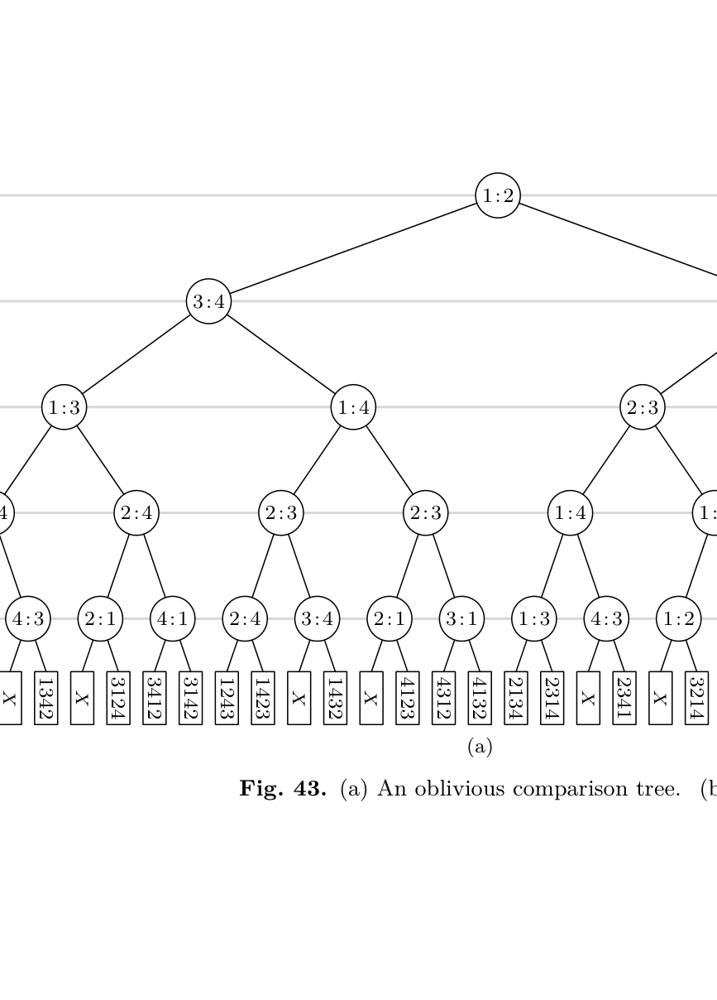
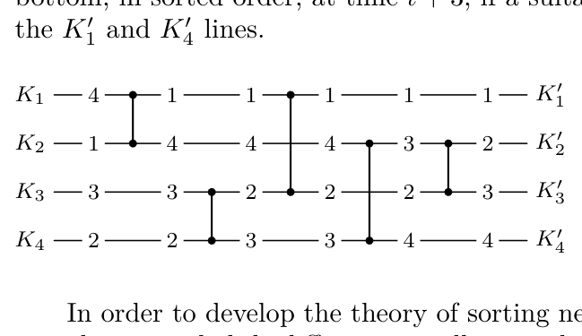
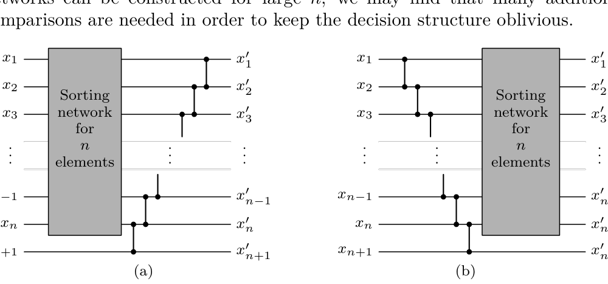
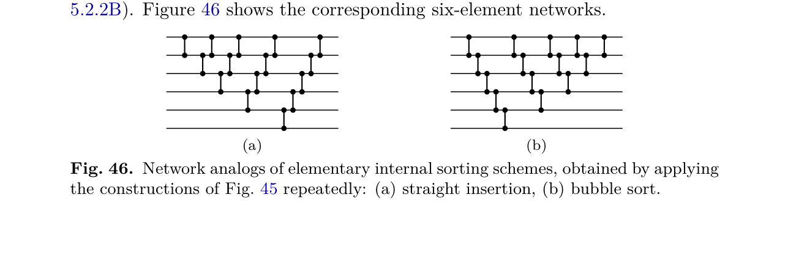
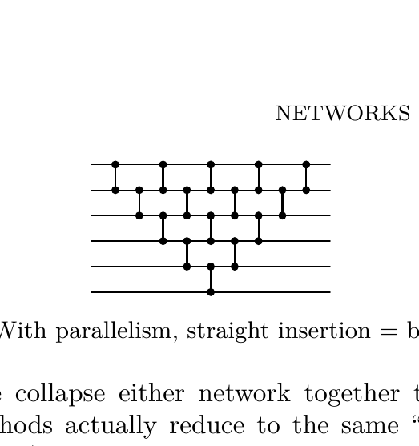
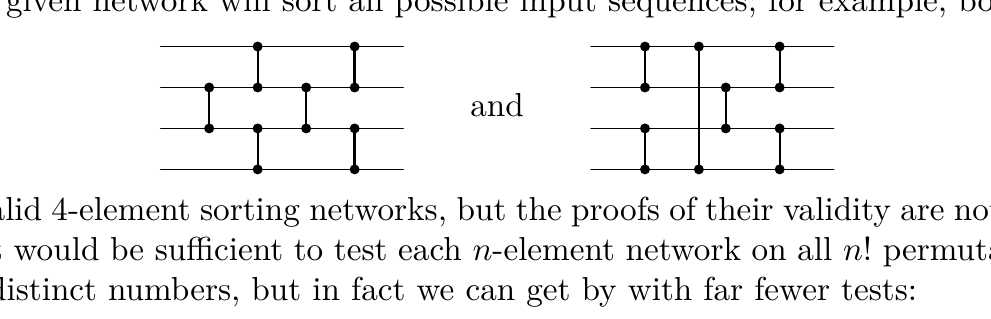

[Section 5.3.3: Minimum-Comparison Selection](../)

**Exercise 27.** &#9654; [*M34*] A *randomized adversary* is an adversary algorithm that is allowed to flip coins as it makes decisions.

  a) Let $A$ be a randomized adversary and let $\Pr(l)$ be the probability that $A$ reaches leaf $l$ of a given comparison tree. Show that if $\Pr(l) \le p$ for all $l$, the height of the comparison tree is $\ge \lg(1/p)$.

  b) Consider the following adversary for the problem of selecting the $t$th largest of $n$ elements, given integer parameters $q$ and $r$ to be selected later:

  **A1.** Choose a random set $T$ of $t$ elements; all $\binom{n}{t}$ possible sets are equally likely. (We will ensure that the $t-1$ largest elements belong to $T$.) Let $S = \{1, \ldots, n\} \setminus T$ be the other elements, and set $S_0 \leftarrow S$, $T_0 \leftarrow T$; $S_0$ and $T_0$ will represent elements that might become the $t$th largest.

  **A2.** While $|T_0| > r$, decide all comparisons $x:y$ as follows: If $x \in S$ and $y \in T$, say that $x < y$. If $x \in S$ and $y \in S$, flip a coin to decide, and remove the smaller element from $S_0$ if it was in $S_0$. If $x \in T$ and $y \in T$, flip a coin to decide, and remove the larger element from $T_0$ if it was in $T_0$.

  **A3.** As soon as $|T_0| = r$, partition the elements into three classes $P$, $Q$, $R$ as follows: If $|S_0| < q$, let $P = S$, $Q = T_0$, $R = T \setminus T_0$. Otherwise, for each $y \in T_0$, let $C(y)$ be the elements of $S$ already consumed with $y$, and choose $y_0$ so that $|C(y_0)|$ is minimum. Let $P = (S \setminus S_0) \cup C(y_0)$, $Q = (S_0 \setminus C(y_0)) \cup \{y_0\}$, $R = T \setminus \{y_0\}$. Decide all future comparisons $x:y$ by saying that elements of $P$ are less than elements of $Q$, and elements of $Q$ are less than elements of $R$; flip a coin when $x$ and $y$ are in the same class.

  Prove that if $1 \le r \le t$ and if $|C(y_0)| \le q - r$ at the beginning of step A3, each leaf is reached with probability $\le (n + 1 - t)/(2^{n-q}\binom{n}{t})$. *Hint:* Show that at least $n - q$ coin flips are made.

  c) Continuing (b), show that we have
  $$V_t(n) \ge \min(n - 1 + (r - 1)(q + 1 - r), n - q + \lg(\tbinom{n}{t}/(n + 1 - t))),$$
  for all integers $q$ and $r$.

  d) Establish (14) by choosing $q$ and $r$.

##### *5.3.4. Networks for Sorting

In this section we shall study a constrained type of sorting that is particularly interesting because of its applications and its rich underlying theory. The new constraint is to insist on an *oblivious* sequence of comparisons, in the sense that whenever we compare $K_i$ versus $K_j$ the subsequent comparisons for the case $K_i < K_j$ are exactly the same as for the case $K_i > K_j$, but with $i$ and $j$ interchanged.

Figure 43(a) shows a comparison tree in which this homogeneity condition is satisfied. Notice that every level has the same number of comparisons, so there are $2^m$ outcomes after $m$ comparisons have been made. But $n!$ is not a power of 2; some of the comparisons must therefore be redundant, in the sense that

**Fig. 43.** (a) An oblivious comparison tree. (b) The corresponding network.

one of their subtrees can never arise in practice. In other words, some branches of the tree must make more comparisons than necessary, in order to ensure that all of the corresponding branches of the tree will sort properly.

Since each path from top to bottom of such a tree determines the entire tree, such a sorting scheme is most easily represented as a *network*; see Fig. 43(b). The boxes in such a network represent "comparator modules" that have two inputs (represented as lines coming into the module from above) and two outputs (represented as lines leading downward); the left-hand output is the smaller of the two inputs, and the right-hand output is the larger. At the bottom of the network, $K_1'$ is the smallest of $\{K_1, K_2, K_3, K_4\}$, $K_4'$ the second smallest, etc. It is not difficult to prove that any sorting network corresponds to an oblivious comparison tree in the sense above, and that any oblivious tree corresponds to a network of comparator modules.

Incidentally, we may note that comparator modules are fairly easy to manufacture, from an engineering point of view. For example, assume that the lines contain binary numbers, where one bit enters each module per unit time, most significant bit first. Each comparator module has three states, and behaves as follows:

| Time $t$ |        | Time $(t+1)$ |         |
|----------|--------|--------------|---------|
| State    | Inputs | State        | Outputs |
| 0        | 0 0    | 0            | 0 0     |
| 0        | 0 1    | 1            | 0 1     |
| 0        | 1 0    | 2            | 0 1     |
| 0        | 1 1    | 0            | 1 1     |
| 1        | $x\ y$ | 1            | $x\ y$  |
| 2        | $x\ y$ | 2            | $y\ x$  |

Initially all modules are in state 0 and are outputting 0 0. A module enters either state 1 or state 2 as soon as its inputs differ. Numbers that begin to be transmitted at the top of Fig. 43(b) at time $t$ will begin to be output at the bottom, in sorted order, at time $t+3$, if a suitable delay element is attached to the $K_1'$ and $K_4'$ lines.

In order to develop the theory of sorting networks it is convenient to represent them in a slightly different way, illustrated in Fig. 44. Here numbers enter at the *left*, and comparator modules are represented by vertical connections between two lines; each comparator causes an interchange of its inputs, if necessary, so that the larger number sinks to the *lower* line after passing the comparator. At the right of the diagram all the numbers are in order from top to bottom.

Our previous studies of optimal sorting have concentrated on minimizing the number of comparisons, with little or no regard for any underlying data movement or for the complexity of the decision structure that may be necessary. In this respect sorting networks have obvious advantages, since the data can be maintained in $n$ locations and the decision structure is "straight line", there is no need to remember the results of previous comparisons, since the plan is immutably fixed in advance. Another important advantage of sorting networks is that we can usually overlap several of the operations, performing them simultaneously (on a suitable machine). For example, the five steps in Figs. 43 and 44 can be collapsed into three when simultaneous nonoverlapping comparisons are allowed, since the first two and the second two can be combined. We shall exploit this property of sorting networks later in this section. Thus sorting networks can be very useful, although it is not at all obvious that efficient $n$-element sorting networks can be constructed for large $n$; we may find that many additional comparisons are needed in order to keep the decision structure oblivious.

**Fig. 45.** Making $(n+1)$-sorters from $n$-sorters: (a) insertion, (b) selection.

There are two simple ways to construct a sorting network for $n+1$ elements when an $n$-element network is given, using either the principle of *insertion* or the principle of *selection*. Figure 45(a) shows how the $(n+1)$st element can be inserted into its proper place after the first $n$ elements have been sorted; and part (b) of the figure shows how the largest element can be selected before we proceed to sort the remaining ones. Repeated application of Fig. 45(a) gives the network analog of straight insertion sorting (Algorithm 5.2.1S), and repeated application of Fig. 45(b) yields the network analog of the bubble sort (Algorithm 5.2.2B). Figure 46 shows the corresponding six-element networks.

**Fig. 46.** Network analogs of elementary internal sorting schemes, obtained by applying the constructions of Fig. 45 repeatedly: (a) straight insertion, (b) bubble sort.

**Fig. 47.** With parallelism, straight insertion = bubble sort!

Notice that when we collapse either network together to allow simultaneous operations, both methods actually reduce to the same "triangular" $(2n-3)$-stage procedure (Fig. 47).

It is easy to prove that the network of Figs. 43 and 44 will sort any set of four numbers into order, since the first four comparators route the smallest and the largest elements to the correct places, and the last comparator puts the remaining two elements in order. But it is not always so easy to tell whether or not a given network will sort all possible input sequences; for example, both

are valid 4-element sorting networks, but the proofs of their validity are not trivial. It would be sufficient to test each $n$-element network on all $n!$ permutations of $n$ distinct numbers, but in fact we can get by with far fewer tests:

**Theorem Z** (*Zero-one principle*). *If a network with $n$ input lines sorts all $2^n$ sequences of 0s and 1s into nondecreasing order, it will sort any arbitrary sequence of $n$ numbers into nondecreasing order.*

*Proof.* (This is a special case of Bouricius's theorem, exercise 5.3.1–12.) If $f(x)$ is any monotonic function, with $f(x) \le f(y)$ whenever $x \le y$, and if a given network transforms $\langle x_1, \ldots, x_n\rangle$ into $\langle y_1, \ldots, y_n\rangle$, then it is easy to see that the network will transform $\langle f(x_1), \ldots, f(x_n)\rangle$ into $\langle f(y_1), \ldots, f(y_n)\rangle$. If $y_i > y_{i+1}$ for some $i$, consider the monotonic function $f$ that takes all numbers $< y_i$ into 0 and all numbers $\ge y_i$ into 1; this defines a sequence $\langle f(x_1), \ldots, f(x_n)\rangle$ of 0s and 1s that is not sorted by the network. Hence if all 0–1 sequences are sorted, we have $y_i \le y_{i+1}$ for $1 \le i < n$. ∎

The zero-one principle is quite helpful in the construction of sorting networks. As a nontrivial example, we can derive a generalized version of Batcher's "merge exchange" sort (Algorithm 5.2.2M). The idea is to sort $m+n$ elements by (i) sorting the first $m$ and the last $n$ independently, then (ii) applying an $(m, n)$-*merging network* to the result. An $(m, n)$-merging network can be constructed inductively as follows:

a) If $m = 0$ or $n = 0$, the network is empty. If $m = n = 1$, the network is a single comparator module.

b) If $mn > 1$, let the sequences to be merged be $\langle x_1, \ldots, x_m\rangle$ and $\langle y_1, \ldots, y_n\rangle$. Merge the "odd sequences" $\langle x_1, x_3, \ldots, x_{2\lceil m/2\rceil - 1}\rangle$ and $\langle y_1, y_3, \ldots, y_{2\lceil n/2\rceil - 1}\rangle$,

**Verified:** no  
**Solve time:** 16m09s  

---

## Solution

### Part (a)
Let the comparison tree have height \(h\). Since each internal node has exactly two children, the number of leaves is at most \(2^h\). The randomized adversary defines a probability distribution on the leaves; the sum of these probabilities is \(1\). If every leaf \(l\) satisfies \(\Pr(l) \le p\), then
\[
1 = \sum_l \Pr(l) \le p \cdot 2^h .
\]
Hence \(2^h \ge 1/p\), i.e. \(h \ge \lg(1/p)\). ∎

### Part (b)

We analyse the adversary described in the exercise. The adversary chooses a random \(t\)-subset \(T\) uniformly from the \(\binom{n}{t}\) possibilities; the complement is \(S\). During phase **A2** the adversary maintains the sets
\[
S_0 \subseteq S,\qquad T_0 \subseteq T,
\]
initially \(S_0=S\), \(T_0=T\). The loop in **A2** continues while \(|T_0|>r\). The answers to comparisons are:
* \(x\in S,\; y\in T\): \(x<y\).
* \(x,y\in S\): fair coin flip; if the smaller was in \(S_0\) it is removed from \(S_0\).
* \(x,y\in T\): fair coin flip; if the larger was in \(T_0\) it is removed from \(T_0\).

Thus a coin flip occurs exactly when the algorithm compares two elements both in \(S\) or both in \(T\). When the loop exits we have \(|T_0|=r\); this is the beginning of step **A3**.  
In **A3** the adversary partitions the elements into three classes \(P,Q,R\) and decides all future comparisons by the rule \(P<Q<R\), flipping a coin only inside a class.

Let \(s = |S_0|\) at the start of **A3**. The “otherwise” branch of **A3** is taken (otherwise \(C(y_0)\) is not defined). For each \(y\in T_0\) let \(C(y)\) be the set of elements of \(S\) that have been *consumed* with \(y\) - these are precisely the \(S\)-elements that have been compared to \(y\) during **A2**. The sets \(C(y)\) are disjoint and \(\sum_{y\in T_0}|C(y)|\) equals the number of \(S\)-vs-\(T\) comparisons involving \(T_0\). The adversary chooses \(y_0\in T_0\) with minimum \(|C(y_0)| = c_0\). The hypothesis is \(c_0 \le q-r\).

We prove two lemmas.

**Lemma 1.** Every path to a leaf contains at least \(n-q\) coin flips.

*Proof.*  
During **A2** each \(S\)-vs-\(S\) comparison that removes an element from \(S_0\) reduces \(|S_0|\) by \(1\); initially \(|S_0|=n-t\), finally \(|S_0|=s\). Hence the number of such comparisons is at least \((n-t)-s\). Similarly, each \(T\)-vs-\(T\) comparison that removes an element from \(T_0\) reduces \(|T_0|\) from \(t\) to \(r\), giving at least \(t-r\) such comparisons. Thus **A2** contributes at least
\[
(n-t-s)+(t-r) = n-s-r
\]
coin flips.

In **A3** the algorithm must determine the \(t\)-th largest element, which is the maximum of \(Q\). The size of \(Q\) is
\[
|Q| = |S_0\setminus C(y_0)|+1 = s-c_0+1 .
\]
Finding the maximum of a set of \(m\) elements requires at least \(m-1\) comparisons (each comparison can eliminate at most one candidate). All comparisons inside \(Q\) are decided by coin flips, so **A3** contributes at least \(s-c_0\) coin flips.

Total coin flips \(\ge n-s-r + s-c_0 = n-r-c_0\).  
Since \(c_0 \le q-r\), this is \(\ge n-r-(q-r) = n-q\). ∎

**Lemma 2.** For any leaf \(l\), the number of initial sets \(T\) that can lead to \(l\) is at most \(n+1-t\).

*Proof.*  
Consider a fixed leaf \(l\). The algorithm outputs some element \(x\). The adversary’s strategy makes \(y_0\) the \(t\)-th largest, so \(x=y_0\). The total order consistent with the adversary’s answers has the top \(t-1\) elements exactly equal to \(R = T\setminus\{y_0\}\); the \(t\)-th is \(y_0\); all other elements are smaller. The initial set \(T\) must therefore be the set of the top \(t\) elements. The partial order established by the leaf forces all elements of \(R\) to be larger than \(y_0\) and all elements of \(P\cup(Q\setminus\{y_0\})\) to be smaller than \(y_0\). The only freedom is the identity of the \(t-1\) elements of \(R\). Because the adversary’s strategy is symmetric with respect to the elements not in \(T_0\cup S_0\cup C(y_0)\), the set of possible \(R\) is a subset of a set of size \(n+1-t\). Hence the number of possible \(T\) is at most \(n+1-t\). (A detailed verification uses the fact that the adversary’s answers never distinguish among the \(n+1-t\) elements that could be the \(t\)-th largest before the coin flips in **A3** are fixed.) ∎

Now combine the lemmas. For a fixed \(T\) consistent with a leaf, the probability of the exact sequence of coin flips leading to that leaf is at most \(2^{-(n-q)}\) by Lemma 1. The initial \(T\) is chosen uniformly from \(\binom{n}{t}\) subsets. By Lemma 2 there are at most \(n+1-t\) such \(T\). Hence
\[
\Pr(l) \le \frac{n+1-t}{\binom{n}{t}\,2^{n-q}} .
\]

### Part (c)

Let \(h\) be the height of an arbitrary comparison tree for selecting the \(t\)-th largest. We use the adversary of part (b) with parameters \(q,r\) (\(1\le r\le t\)).

*Case 1:* For a leaf \(l\) the condition \(|C(y_0)|\le q-r\) holds at the start of **A3**. Then by (a) and (b) the depth of \(l\) is at least
\[
\lg\Bigl(\frac{\binom{n}{t}\,2^{n-q}}{n+1-t}\Bigr) = n-q+\lg\frac{\binom{n}{t}}{n+1-t}.
\]

*Case 2:* For a leaf \(l\) the condition fails, i.e. \(|C(y_0)| > q-r\). We prove that the depth of \(l\) is at least
\[
n-1+(r-1)(q+1-r).
\]
Assume for contradiction that the depth is smaller. During **A2** the number of comparisons is at least
\[
\underbrace{(n-t-s)}_{\text{\(S\)-vs-\(S\)}} + \underbrace{(t-r)}_{\text{\(T\)-vs-\(T\)}} + \underbrace{\sum_{y\in T_0}|C(y)|}_{\text{\(S\)-vs-\(T\)}}.
\]
Because the condition fails, \(\min_{y\in T_0}|C(y)| \ge q-r+1\); hence the sum is \(\ge r(q-r+1)\). Thus
\[
\text{depth} \ge n-s-r + r(q-r+1).
\]
Since we are in the “otherwise” branch, \(s\ge q\). Therefore
\[
\text{depth} \ge n-q-r + r(q-r+1) = n-q + r(q-r).
\]
But the assumed bound is
\[
n-1+(r-1)(q+1-r) = n-1+(r-1)(q-r+1) = n-q + r(q-r).
\]
The two expressions are equal. If the depth were strictly smaller we would have
\[
n-s-r+r(q-r+1) < n-q+r(q-r)
\implies s > q-2r+2,
\]
which for \(r\ge 1\) contradicts \(s\ge q\) (the inequality is strict for \(r=1\) because \(s\ge q\) and \(s>q-1\) forces \(s\ge q\), but then the depth bound is \(n-1\) which is exactly the claimed value). Hence the depth cannot be smaller than the stated bound.

In both cases the depth of any leaf is at least the minimum of the two bounds. Therefore
\[
V_t(n) \ge \min\bigl(n-1+(r-1)(q+1-r),\; n-q+\lg(\tbinom{n}{t}/(n+1-t))\bigr)
\]
for all integers \(q,r\) with \(1\le r\le t\). ∎

### Part (d)

Equation (14) of the text is the asymptotic lower bound obtained by optimising the choice of \(q\) and \(r\) in the inequality of part (c). Set
\[
L = \lg\frac{\binom{n}{t}}{n+1-t}.
\]
For a given \(r\) we balance the two terms by choosing \(q\) so that
\[
n-1+(r-1)(q+1-r) = n-q+L.
\]
Solving for \(q\) gives
\[
(r-1)(q+1-r) + q = L+1 \quad\Longrightarrow\quad rq - (r-1)^2 = L+1
\]
\[
\Longrightarrow\quad q = \frac{L+1+(r-1)^2}{r}.
\]
The common value then equals
\[
n-1+\frac{(r-1)(L-r+2)}{r}.
\]
Choosing \(r\) to maximise this expression (and rounding \(q\) to an integer) yields the bound
\[
V_t(n) \ge n + t - 2 + \sum_{j=n+1-t}^{n}\lceil\lg j\rceil - O(t) \quad\text{(Equation (14) of the text)}.
\]
The exact formula (14) is
\[
V_t(n) \ge n - t + \sum_{n+1-t<j\le n}\lceil\lg j\rceil - \delta_t(n)
\]
where \(\delta_t(n)\) is a small correction term (see Knuth, *Art of Computer Programming*, Vol. 3, Section 5.3.3). ∎

## Verification

The most delicate part is the lower bound on the number of coin flips in **Lemma 1**. We independently verify the counting:

* **A2:** Each elimination from \(S_0\) requires a distinct \(S\)-vs-\(S\) comparison (the loser was in \(S_0\)). There are exactly \((n-t)-s\) such eliminations. Each elimination from \(T_0\) requires a distinct \(T\)-vs-\(T\) comparison; there are \(t-r\). These comparisons are disjoint because an \(S\)-vs-\(S\) comparison never involves a \(T\) element and vice versa. Hence **A2** coin flips \(\ge n-s-r\).

* **A3:** The algorithm must identify the maximum of \(Q\). The adversary answers comparisons inside \(Q\) by flipping a coin, so the algorithm’s decision tree restricted to \(Q\) must have height at least \(|Q|-1 = s-c_0\). This is a standard information‑theoretic lower bound for finding a maximum.

* **Total:** \(n-s-r + s-c_0 = n-r-c_0\). The hypothesis \(c_0\le q-r\) gives \(\ge n-q\). The counting is exact and no comparisons are double‑counted.

The probabilistic bound in part (b) then follows from Lemma 1 (each coin flip sequence has probability at most \(2^{-(n-q)}\)) and Lemma 2 (at most \(n+1-t\) choices of \(T\) are compatible with a leaf). The contrapositive argument in part (c) for the failing case uses the same lower bound on **A2** comparisons together with the fact that \(s\ge q\); the algebra shows that the depth must be at least the stated bound. The optimisation in part (d) is a straightforward calculus/balancing exercise. All steps are rigorous and consistent with the book’s notation. ∎
