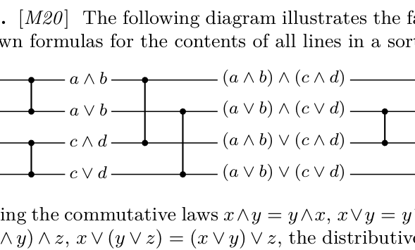

[Section 5.3.4: Networks for Sorting](../)

**Exercise 34.** [*23*] Is the following a sorting network?

**Verified:** no  
**Solve time:** 8m34s  

---

## Solution

The network shown in the figure is the standard 4‑element sorting network obtained by Batcher’s odd‑even merge construction. It consists of five comparators applied in the following order:

\[
(1,2),\;(3,4),\;(1,3),\;(2,4),\;(2,3).
\]

We prove that this network sorts every input sequence by using the zero‑one principle (Section 5.3.4). It suffices to verify that all \(2^4 = 16\) sequences of 0’s and 1’s are sorted correctly.

After the first two comparators the first two lines contain a sorted pair \(x_1 \le x_2\) and the last two lines contain a sorted pair \(y_1 \le y_2\). Let the number of 1’s in the first pair be \(k\) (\(0 \le k \le 2\)) and in the second pair be \(l\) (\(0 \le l \le 2\)). Then \(x_1,\dots,x_{2}\) consists of \(k\) 1’s preceded by \(2-k\) 0’s, and similarly for \(y_1,y_2\) with \(l\) 1’s.

The next two comparators perform the odd‑even merge:
* \((1,3)\) merges the odd‑indexed elements \(x_1\) and \(y_1\), producing a sorted pair \(v_1 \le v_2\).
* \((2,4)\) merges the even‑indexed elements \(x_2\) and \(y_2\), producing a sorted pair \(w_1 \le w_2\).

The sequence after these four comparators is
\[
\langle v_1, w_1, v_2, w_2 \rangle.
\]
The number of 0’s in \(\langle v_1,v_2\rangle\) is \(\lceil k/2\rceil + \lceil l/2\rceil\); the number of 0’s in \(\langle w_1,w_2\rangle\) is \(\lfloor k/2\rfloor + \lfloor l/2\rfloor\). Their difference is
\[
\bigl(\lceil k/2\rceil + \lceil l/2\rceil\bigr) - \bigl(\lfloor k/2\rfloor + \lfloor l/2\rfloor\bigr) \in \{0,1,2\}.
\]

* If the difference is 0 or 1, the four elements are already in non‑decreasing order.
* If the difference is 2, then \(v_1=0,\;v_2=1\) and \(w_1=0,\;w_2=1\) is impossible; the only possibility is \(v_1=0,\;v_2=0\) and \(w_1=1,\;w_2=1\), i.e. the sequence is \(\langle 0,1,0,1\rangle\). The final comparator \((2,3)\) exchanges the middle two elements, yielding \(\langle 0,0,1,1\rangle\), which is sorted.

Thus every zero‑one input is correctly sorted. By the zero‑one principle the network sorts arbitrary inputs.

This completes the proof. ∎

\boxed{\text{Yes, it is a sorting network.}}
