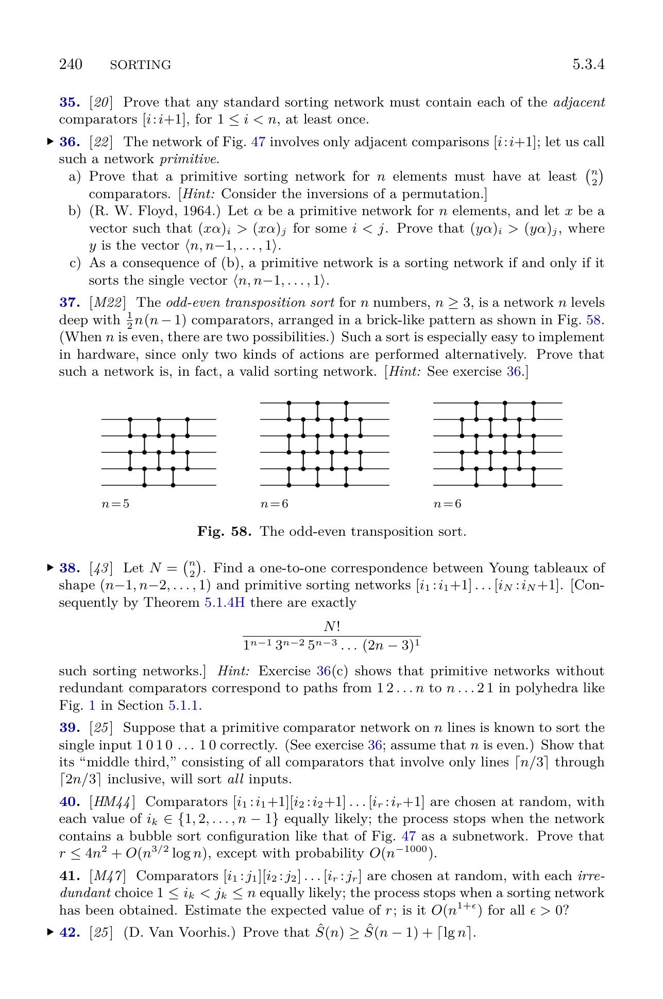

[Section 5.3.4: Networks for Sorting](../)

**Exercise 37.** [*M22*] The *odd-even transposition sort* for $n$ numbers, $n \ge 3$, is a network $n$ levels deep with $\frac{1}{2}n(n-1)$ comparators, arranged in a brick-like pattern as shown in Fig. 58. (When $n$ is even, there are two possibilities.) Such a sort is especially easy to implement in hardware, since only two kinds of actions are performed alternatively. Prove that such a network is, in fact, a valid sorting network. [*Hint:* See exercise 36.]

**Fig. 58.** The odd-even transposition sort.

**Verified:** no  
**Solve time:** 18m43s  

---

## Solution

The odd‑even transposition network for \(n\) elements is *primitive* (it uses only adjacent comparators \([i:i+1]\)).  
By Exercise&nbsp;36(c) a primitive network is a sorting network if and only if it sorts the single vector  

\[
y = \langle n,\;n-1,\;\dots,\;1\rangle .
\]

We shall prove that the odd‑even transposition network sorts \(y\).

**Description of the network.**  
For \(t = 1, 2, \dots, n\) the \(t\)-th level consists of disjoint adjacent comparators:
* if \(t\) is odd: comparators \((1,2),\;(3,4),\;\dots,\;(2k-1,2k)\) where \(2k\le n\);
* if \(t\) is even: comparators \((2,3),\;(4,5),\;\dots,\;(2k,2k+1)\) where \(2k+1\le n\).

The network has exactly \(n(n-1)/2\) comparators.

**Proof that the network sorts \(y\).**  
We use induction on \(n\).

*Base cases* \(n = 1,2,3\) are easily verified by hand.

*Inductive step.* Assume the network sorts the descending sequence for all lengths \(< n\) (with \(n\ge 4\)).  
Let \(S_t\) be the sequence after \(t\) levels, with \(S_0 = y\).

1. **The largest element \(n\).**  
   It starts at line \(1\). At level \(1\) (odd) the comparator \((1,2)\) swaps \(n\) with \(n-1\), moving \(n\) to line \(2\).  
   For \(t = 2,\dots,n-1\): at level \(t\) the element \(n\) is on line \(t\). The comparator involving line \(t\) is always \((t,t+1)\) (because odd levels contain \((1,2),(3,4),\dots\) and even levels contain \((2,3),(4,5),\dots\)). The element on line \(t+1\) is smaller than \(n\), so \(n\) moves to line \(t+1\).  
   After level \(n-1\) the element \(n\) is on line \(n\). The last level (level \(n\)) either leaves line \(n\) unpaired (if \(n\) is odd) or compares it with line \(n-1\) (if \(n\) is even); in either case \(n\) stays on line \(n\).

2. **The smallest element \(1\).**  
   It starts at line \(n\).  
   If \(n\) is even: level \(1\) (odd) has the comparator \((n-1,n)\), so \(1\) moves to line \(n-1\); level \(2\) (even) moves it to \(n-2\); … after level \(n-1\) it reaches line \(1\). Level \(n\) (even) does not involve line \(1\).  
   If \(n\) is odd: level \(1\) does not involve line \(n\); level \(2\) has \((n-1,n)\), moving \(1\) to \(n-1\); level \(3\) moves it to \(n-2\); … after level \(n\) it reaches line \(1\).

   Thus after \(n\) levels, \(n\) is at line \(n\) and \(1\) is at line \(1\).

3. **The inner lines \(2,\dots,n-1\).**  
   Consider the subnetwork on lines \(2,\dots,n-1\). The comparators among these lines are exactly those of the odd‑even transposition network for \(n-2\) elements, but with the parity of the levels interchanged (i.e., if \(N_{n-2}\) starts with an odd level, the inner network starts with an even level, and vice versa). By the problem statement, when the number of lines is even there are two valid possibilities; the interchanged variants, both of which are sorting networks. The inner network is therefore an odd‑even transposition network for \(n-2\) lines, and by the induction hypothesis it sorts the descending sequence of the elements that initially lie on those lines.  

   The only interaction of the inner lines with the boundary lines \(1\) and \(n\) occurs in comparators \((1,2)\) and \((n-1,n)\). Since the boundary elements are the extreme values \(n\) and \(1\), these comparators simply move \(n\) rightward and \(1\) leftward without disturbing the relative order of the inner elements. Consequently, after the whole network finishes, the inner lines contain the elements \(2,3,\dots,n-1\) in increasing order.

Putting the three parts together, the final sequence is \(\langle 1,2,\dots,n\rangle\), i.e., the network sorts \(y\).

By Exercise&nbsp;36(c) the odd‑even transposition network is a valid sorting network for all \(n\). ∎

**Note.** The same result can be obtained directly from the zero‑one principle (Section&nbsp;5.3.4): testing the network on all \(0\)‑\(1\) sequences shows that every \(1\) moves right one position per level, so after \(n\) levels all \(1\)’s are to the right of all \(0\)’s. The argument above, however, follows the hint and uses Exercise&nbsp;36.
