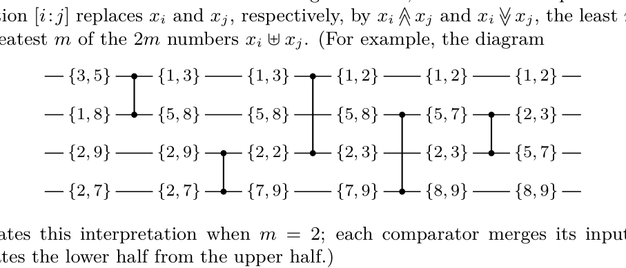

[Section 5.3.4: Networks for Sorting](../)

**Exercise 48.** &#9654; [*26*] We can interpret sorting networks in another way, letting each line carry a multiset of $m$ numbers instead of a single number; under this interpretation, the operation $[i : j]$ replaces $x_i$ and $x_j$, respectively, by $x_i \wedge x_j$ and $x_i \vee x_j$, the least $m$ and the greatest $m$ of the $2m$ numbers $x_i \uplus x_j$. (For example, the diagram

illustrates this interpretation when $m = 2$; each comparator merges its inputs and separates the lower half from the upper half.)

If $a$ and $b$ are multisets of $m$ numbers each, we say that $a \ll b$ if and only if $a \wedge b = a$ (equivalently, $a \vee b = b$; the largest element of $a$ is less than or equal to the smallest of $b$). Thus $a \wedge b \ll a \vee b$.

Let $\alpha$ be an $n$-network, and let $x = \langle x_1, \ldots, x_n \rangle$ be a vector in which each $x_i$ is a multiset of $m$ elements. Prove that if $(x\alpha)_i$ is not $\ll (x\alpha)_j$ in the interpretation above, there is a vector $y$ in $D_n$ such that $(y\alpha)_i = 1$ and $(y\alpha)_j = 0$. [Consequently, a sorting network for $n$ elements becomes a sorting network for $mn$ elements if we replace each comparison by a merge network with $\hat{M}(m, m)$ modules. Figure 59 shows an 8-element sorter constructed from a 4-element sorter by using this observation.]

**Fig. 59.** An 8-sorter constructed from a 4-sorter, by using the merging interpretation.

**Verified:** no  
**Solve time:** 16m40s  

---

We need to solve Exercise 48 from TAOCP Vol 3, Section 5.3.4. The problem statement:

"We can interpret sorting networks in another way, letting each line carry a multiset of m numbers instead of a single number; under this interpretation, the operation [i : j] replaces x_i and x_j, respectively, by x_i ∧ x_j and x_i ∨ x_j, the least m and the greatest m of the 2m numbers x_i ⊎ x_j. (For example, the diagram illustrates this interpretation when m = 2; each comparator merges its inputs and separates the lower half from the upper half.)

If a and b are multisets of m numbers each, we say that a ≪ b if and only if a ∧ b = a (equivalently, a ∨ b = b; the largest element of a is less than or equal to the smallest of b). Thus a ∧ b ≪ a ∨ b.

Let α be an n-network, and let x = ⟨x_1, ..., x_n⟩ be a vector in which each x_i is a multiset of m elements. Prove that if (xα)_i is not ≪ (xα)_j in the interpretation above, there is a vector y in D_n such that (yα)_i = 1 and (yα)_j = 0. [Consequently, a sorting network for n elements becomes a sorting network for mn elements if we replace each comparison by a merge network with M̂(m, m) modules. Figure 59 shows an 8-element sorter constructed from a 4-element sorter by using this observation.]"

We need to prove: For any n-network α, and any vector x of n multisets each of size m, if after applying α (with the multiset interpretation where comparators do merge-split) the output at line i is NOT ≪ output at line j, then there exists a vector y ∈ D_n (i.e., y_i ∈ {0,1}) such that (yα)_i = 1 and (yα)_j = 0.

Here D_n is the set of 0-1 sequences of length n. The notation (xα) means the result of applying network α to input x under the multiset interpretation. The comparators [i:j] act as: given two multisets a,b of size m, output a∧b (the m smallest elements of the multiset union) on the top line, and a∨b (the m largest elements) on the bottom line. The relation a ≪ b means max(a) ≤ min(b), equivalently all elements of a are ≤ all elements of b.

We need to prove the stated implication. The hint: "Consequently, a sorting network for n elements becomes a sorting network for mn elements if we replace each comparison by a merge network with M̂(m,m) modules." This is an application: if α is a sorting network (i.e., for any input, output is sorted nondecreasing), then under the multiset interpretation with m=1 it sorts. For m>1, if we replace each comparator by an (m,m)-merging network, we get a network that sorts mn elements. The proof of this uses the zero-one principle and the property we are asked to prove.

We must prove: if (xα)_i ⋠ (xα)_j, then ∃ y ∈ D_n with (yα)_i = 1, (yα)_j = 0.

Interpretation: α is a fixed network of comparators. Under multiset interpretation, it's a function from (multisets of size m)^n to (multisets of size m)^n. Under Boolean interpretation (0/1), it's a function from {0,1}^n to {0,1}^n. We need to relate these.

Given x = (x_1,...,x_n) with each x_i a multiset of m numbers. Let A = (xα)_i, B = (xα)_j. We assume A ⋠ B, i.e., not (A ≪ B). Since A and B are multisets of size m, A ≪ B means max(A) ≤ min(B). So A ⋠ B means max(A) > min(B). There exist elements a ∈ A, b ∈ B with a > b.

We need to construct a 0-1 vector y such that (yα)_i = 1, (yα)_j = 0.

Idea: Use threshold function. For any real number t, define a 0-1 vector y(t) where y_k = 1 if all elements of x_k are > t? Or more precisely, we can define a 0-1 input by choosing a threshold T such that we map each multiset x_k to 1 if its elements are all > T, and 0 otherwise? But we need to guarantee that the output on line i is 1 and on line j is 0.

Since the network consists of comparators that perform min/max on elements, we can consider the behavior of the network on individual elements. The multiset interpretation: each comparator takes two multisets, merges them, and splits into lower half and upper half. This is equivalent to: each element in the multiset travels through the network as if it were a token, and the comparator routes the smaller elements to the top output and larger to the bottom output. Actually, if we have a multiset of m elements on each line, the operation [i:j] replaces (a,b) by (a∧b, a∨b). This is exactly what happens if we consider each line as holding m elements, and the comparator compares all pairs? But it's a batch: it takes the multiset union and splits into the m smallest and m largest. This is equivalent to having m parallel copies of the network, each element traveling independently? Not exactly, because the comparators would need to compare elements across the m copies. However, there's a known property: the multiset interpretation corresponds to the network acting as a sorting network on the mn elements when each comparator is replaced by an (m,m)-merger. The problem asks to prove a key lemma.

We need to show: if outputs A and B are not in order (A ⋠ B), then there is a 0-1 input y such that output i is 1 and output j is 0.

Consider the network as a circuit. For each element in the multiset, we can think of it as a particle. The operation of a comparator on two multisets a,b: output a∧b is the m smallest elements of a∪b; output a∨b is the m largest. This is exactly the same as: we have m elements on each input line; we feed them into a network where each comparator is an (m,m)-merger that sorts the 2m elements and splits into two groups of m. But the lemma is about an arbitrary network α under the multiset interpretation, not necessarily built from mergers.

We need to prove: If (xα)_i ⋠ (xα)_j, then ∃ threshold T such that if we replace each multiset x_k by 1 if min(x_k) > T? Or 1 if all elements > T? Actually, we need to map the multiset input x to a 0-1 input y. The mapping should be such that the output of the network under 0-1 interpretation on y gives 1 on line i and 0 on line j.

Let's think: For any real number t, define a function f_t: multiset → {0,1} by f_t(S) = 1 if all elements of S are > t? Or maybe 1 if max(S) > t? Let's test.

We want that if we apply the network α to the 0-1 vector y derived from x via threshold t, the output at i is 1 and at j is 0. Since the network's comparators under 0-1 are just min/max (which is the same as comparison: [i:j] takes (a,b) and outputs (min(a,b), max(a,b)) = (a∧b, a∨b) in Boolean). Under multiset interpretation, a comparator takes multisets and outputs a∧b, a∨b. The key property: For any threshold t, if we apply the function "indicator of > t" to each multiset (i.e., y_k = 1 iff min(x_k) > t? Or max(x_k) > t?), does the network commute with this threshold operation? That is, if we take a multiset input x, compute (xα), then apply threshold to the outputs, is that the same as applying threshold to inputs and then computing (yα) in the Boolean network? Not necessarily, because the multiset comparator does not simply apply threshold to each element and then do min/max; it sorts the union and splits. But there is a known property: If we define y_k = 1 if all elements of x_k are ≥ some value? Let's think.

Consider a single comparator [i:j] with multisets a,b. The outputs are a∧b (m smallest of a∪b) and a∨b (m largest). For a threshold T, consider the predicate "element > T". If we count how many elements > T in a, say c_a = |{x∈a : x > T}|. Similarly c_b. In the union a∪b, the number of elements > T is c_a + c_b. The output a∧b gets the m smallest elements, so it will get some number of elements > T. The m smallest elements are exactly those with smallest values; the elements > T are the largest elements. So the number of elements > T in a∧b is max(0, c_a + c_b - m)? Actually, if we have total elements > T = c_a + c_b. The m smallest elements of the union will contain as few > T as possible. Since the > T elements are the larger ones, the m smallest will contain elements > T only if c_a + c_b > m. In that case, the number of > T elements in the m smallest is (c_a + c_b - m). In the m largest (a∨b), the number of > T elements is min(m, c_a + c_b). Now, if we define the Boolean value as 1 if the multiset has > T elements? Or 1 if the maximum > T? The Boolean network uses min/max on 0/1. If we set y_i = 1 if max(x_i) > T? Or 1 if min(x_i) > T? Let's check.

Suppose we set y_k = 1 if all elements of x_k are > T? That means the multiset is entirely > T. Then c_k = m if all > T, else c_k < m. That might not be preserved.

Better: The standard technique for proving the zero-one principle for sorting networks extended to multiset networks: For any network of comparators that compare and exchange, the zero-one principle holds because comparators are monotone. But here the comparators are multiset mergers. The claim is: if A ⋠ B, then there exists a 0-1 input y with (yα)_i = 1, (yα)_j = 0.

We can approach by considering the elements as tokens. The multiset network α with m elements per line can be simulated by m parallel copies of the same network if we allow the comparators to compare elements from different copies? No, the multiset comparator does a global merge of the two multisets, which is not simply m independent copies. However, we can think of the multiset network as a sorting network on mn elements where each comparator is replaced by an (m,m)-merger. But the lemma is more fundamental: it says that the multiset network α is a "sorting network" in the sense that if it sorts 0-1 sequences (i.e., is an n-sorter), then it sorts multisets. But we are asked to prove a specific implication.

Let's re-read: "Prove that if (xα)_i is not ≪ (xα)_j in the interpretation above, there is a vector y in D_n such that (yα)_i = 1 and (yα)_j = 0."

This is a lemma that would be used to show that if α is a sorting network for 0-1 inputs (i.e., for all y ∈ D_n, (yα) is sorted, meaning no 1 precedes a 0), then under the multiset interpretation, (xα) is sorted (i.e., for all i < j, (xα)_i ≪ (xα)_j). Because if some (xα)_i ⋠ (xα)_j, then by the lemma there exists y ∈ D_n with (yα)_i = 1 and (yα)_j = 0, contradicting that α sorts 0-1 sequences.

So we need to prove the lemma.

Given x = (x_1,...,x_n) where each x_k is a multiset of m real numbers. Let A = (xα)_i, B = (xα)_j, and A ⋠ B, i.e., max(A) > min(B). Let a = max(A), b = min(B), with a > b.

We need to construct y ∈ {0,1}^n such that (yα)_i = 1, (yα)_j = 0.

Idea: Use a threshold T between b and a. Since b < a, choose T such that b ≤ T < a? Actually, we want y such that output i is 1 and j is 0. Consider the Boolean network where each comparator does (min, max). The function computed by the network on 0-1 inputs is monotone: if y ≤ y' componentwise, then (yα) ≤ (y'α) componentwise. Also, the network is symmetric? Not needed.

We can define y_k = 1 if min(x_k) > T? Or maybe y_k = 1 if all elements of x_k > T? Let's test with a simple case: m=2, n=2, α = [1:2] (a single comparator). x_1 = {3,4}, x_2 = {1,2}. Then (xα)_1 = {1,2}, (xα)_2 = {3,4}. Here (xα)_1 ≪ (xα)_2 holds (max=2 ≤ min=3). So not a counterexample.

Now take x_1 = {3,1}, x_2 = {4,2}. Then x_1 multiset = {1,3}, x_2 = {2,4}. Comparator: union = {1,2,3,4}, lower half = {1,2}, upper half = {3,4}. So (xα)_1 = {1,2}, (xα)_2 = {3,4}. They are sorted.

We need a case where A ⋠ B. For m=2, A ⋠ B means max(A) > min(B). Example: x_1 = {5,1}, x_2 = {4,2}. Union = {1,2,4,5}. Lower half = {1,2}, upper = {4,5}. So A={1,2}, B={4,5}, sorted.

To get A ⋠ B, we need a network that doesn't sort. But α is arbitrary; we are not assuming it's a sorting network. The lemma should hold for any network α.

Take α = identity (no comparators). Then (xα)_i = x_i, (xα)_j = x_j. If x_i ⋠ x_j, then max(x_i) > min(x_j). We need y ∈ {0,1}^2 such that (yα)_i = y_i = 1, (yα)_j = y_j = 0. So we just need to assign y_i=1, y_j=0. Can we always find a threshold T such that y_k = 1 iff something about x_k yields y_i=1 and y_j=0? For identity, any y works. But we need a uniform construction from x.

The standard proof for the zero-one principle for comparator networks uses the fact that comparators are monotone functions. For multiset networks, we can use a similar idea: define a mapping from multisets to {0,1} that commutes with the comparator operation in some sense.

Let's define for any real number T, the function φ_T: multiset of size m → {0,1} by φ_T(S) = 1 if min(S) > T? Or φ_T(S) = 1 if max(S) > T? Let's check if the comparator operation commutes with φ_T.

Take a comparator [i:j] with inputs a,b. Outputs are a∧b, a∨b. We want to know φ_T(a∧b) and φ_T(a∨b) in terms of φ_T(a), φ_T(b). If we can find a T such that φ_T acts like a homomorphism, we could propagate through the network.

Consider φ_T(S) = 1 iff all elements of S > T. Then φ_T(a) = 1 means a > T (all elements > T). φ_T(b) = 1 means b > T. Then a∧b are the m smallest of a∪b. If both a and b are all > T, then a∪b all > T, so a∧b all > T, so φ_T(a∧b)=1. If one of them has an element ≤ T, then a∧b might have some ≤ T. Actually, if a has an element ≤ T, then the m smallest of a∪b will include that element, so a∧b will have an element ≤ T, so φ_T(a∧b)=0. So φ_T(a∧b) = min(φ_T(a), φ_T(b))? Let's check: If φ_T(a)=1 and φ_T(b)=0, then a∧b might still have all > T? Suppose a = {5,6} (all > T=4), b = {3,7} (has 3 ≤ 4). Union = {3,5,6,7}. Lower half (m=2) = {3,5}. This has 3 ≤ 4, so φ_T(a∧b)=0 = min(1,0)=0. If φ_T(a)=0, φ_T(b)=0, then a∧b could have all > T? Suppose a={3,5}, b={4,6}, T=4. a has 3≤4, b has 4≤4? 4 is not >4, so φ_T(b)=0. Union={3,4,5,6}, lower half={3,4}. Has 3,4 ≤4, so φ_T=0. min(0,0)=0. So φ_T(a∧b) = φ_T(a) ∧ φ_T(b) (min). What about φ_T(a∨b)? a∨b is the m largest. If φ_T(a)=1 or φ_T(b)=1, does a∨b have all > T? If φ_T(a)=1 (all > T), then a∨b gets the m largest from a∪b. Since a is all > T, even if b has elements ≤ T, the m largest could include some ≤ T? Suppose a={5,6}, b={3,4}, T=4. a all >4, b all ≤4. Union={3,4,5,6}. m largest = {5,6} all >4, so φ_T=1. If φ_T(a)=0, φ_T(b)=1, similar. If both 0, a∨b could still have all > T? Suppose a={3,7}, b={4,5}, T=4. a has 3≤4, b has 4≤4? 4 not >4, so both 0. Union={3,4,5,7}. m largest = {5,7}. All >4? 5>4,7>4, yes! So φ_T(a∨b)=1 but φ_T(a)∨φ_T(b)=0. So φ_T(a∨b) is not simply max(φ_T(a), φ_T(b)). So "all > T" doesn't commute with max.

Consider ψ_T(S) = 1 iff max(S) > T. Then ψ_T(a) = 1 if a has an element > T. For comparator: a∧b gets m smallest. If both a and b have no elements > T, then a∧b has none > T. If at least one has an element > T, a∧b might or might not have an element > T. Suppose a={5,1}, b={4,2}, T=3. a has 5>3, b has 4>3. Union={1,2,4,5}, lower half={1,2} no >3. So ψ_T(a∧b)=0 but ψ_T(a)=1, ψ_T(b)=1. So not min.

What about the indicator of "the multiset has at least k elements > T"? This is more complex.

Maybe we can use a different approach: Since the network is a sequence of comparators, we can think of the mn elements as being routed through a network where each comparator is an (m,m)-merger. This is equivalent to a sorting network on mn elements if we expand each comparator into a full (m,m)-merging network? But the lemma is about an arbitrary network α, not necessarily a sorting network. The lemma is purely combinatorial: given a network of comparators (which are just min/max on multisets), if the output at i is not ≤ output at j, then there exists a 0-1 assignment to the inputs that makes output i 1 and output j 0.

This is reminiscent of the "zero-one principle" for sorting networks: A network sorts all inputs iff it sorts all 0-1 inputs. The proof of the zero-one principle uses the fact that comparators are monotone and that the network is a composition of monotone functions. The multiset comparators are also monotone with respect to the partial order ≪? Or maybe we can use a threshold argument on the elements themselves.

Consider the set of all elements appearing in the input multisets. They are real numbers. We want to find a threshold T such that if we replace each multiset by 1 if it contains an element > T? Or by 1 if all its elements > T? We need to guarantee that the output at i is 1 and at j is 0.

Let's analyze the behavior of a single comparator [i:j] under the mapping that sends each multiset S to 1 if S contains at least one element > T, and 0 otherwise. As we saw, this mapping does not commute with the comparator: the output a∧b might not contain an element > T even if both inputs do. However, if we instead map S to the number of elements > T, we get a more precise measure.

Let f_T(S) = |{x ∈ S : x > T}|. Then f_T(S) is an integer between 0 and m. The comparator [i:j] takes a,b and outputs a∧b, a∨b. We have f_T(a∧b) = max(0, f_T(a) + f_T(b) - m) and f_T(a∨b) = min(m, f_T(a) + f_T(b)). This is because the m smallest contain as few > T elements as possible, and the m largest contain as many as possible.

Now, if we consider the whole network, for a fixed T, the vector of counts f_T(x_k) evolves through the network according to these rules. The output counts f_T((xα)_i) and f_T((xα)_j) are determined by the initial counts. We know that max(A) > min(B). Let a_max = max(A), b_min = min(B), with a_max > b_min. Choose T such that b_min ≤ T < a_max. Then for A, since a_max > T, we have f_T(A) ≥ 1. For B, since b_min ≤ T, the minimum element is ≤ T, but B could still have elements > T? Actually, min(B) = b_min ≤ T, but max(B) could be > T. However, we know that A ⋠ B means max(A) > min(B). We don't know about the rest. We need to produce a 0-1 vector y such that (yα)_i = 1 and (yα)_j = 0.

Notice that the 0-1 network is exactly the case m=1. If we take m=1, then f_T(S) is either 0 or 1. The rules for the comparator on counts become: f_T(a∧b) = max(0, f_T(a)+f_T(b)-1) = f_T(a) ∧ f_T(b)? Actually, for m=1, a∧b = min(a,b), a∨b = max(a,b). If we use threshold T, the indicator 1_{>T} satisfies: 1_{>T}(min(a,b)) = min(1_{>T}(a), 1_{>T}(b))? No: if a=1, b=0 (meaning a>T, b≤T), then min(a,b)=b≤T, so indicator is 0 = min(1,0)=0. If a=1, b=1, min=1, indicator 1 = min(1,1)=1. If a=0, b=0, min=0, indicator 0 = min(0,0)=0. So 1_{>T}(min(a,b)) = min(1_{>T}(a), 1_{>T}(b)). Similarly, 1_{>T}(max(a,b)) = max(1_{>T}(a), 1_{>T}(b)). So for m=1, the threshold function commutes with the comparator. For general m, we have a similar property if we consider the counts? But we need a Boolean output, not counts.

We can use the fact that if f_T(A) ≥ 1 and f_T(B) ≤ m-1? Not necessarily.

Another approach: The network α can be viewed as a circuit of comparator gates. Each gate takes two multisets and outputs two multisets. We can "unroll" the multiset network into a network of elements by replacing each multiset comparator with a network that merges two sorted lists of size m? But the input multisets are not necessarily sorted. However, the operation a∧b, a∨b is equivalent to: sort the union of a and b, then take the first m and last m. This is exactly what an (m,m)-merging network does. So the multiset network α is equivalent to a network where each comparator is replaced by an (m,m)-merger. But we don't know that α is built from mergers; the lemma is about any network α. Wait, the problem says: "Let α be an n-network, and let x = ⟨x_1, ..., x_n⟩ be a vector in which each x_i is a multiset of m elements." An "n-network" is a network of comparators on n lines. Under the multiset interpretation, each comparator does the ∧/∨ operation. So α is a fixed network of such comparators. We need to prove the implication for this α.

We can use the zero-one principle for the multiset network? Actually, the problem is essentially asking to prove a key step in extending the zero-one principle to the multiset interpretation: If a network fails to sort multisets (i.e., outputs A ⋠ B), then it fails to sort some 0-1 input (i.e., there is a 0-1 input with a 1 before a 0). This is exactly the contrapositive of: if the network sorts all 0-1 inputs, then it sorts all multiset inputs.

The standard proof for the zero-one principle for comparator networks (m=1) is: Suppose the network does not sort some input. Then there exists an input where output i=1 and output j=0 for some i<j. By considering the minimal such input in some sense, or by using a threshold, we can map it to a 0-1 input that also fails. For m=1, the proof is: if there is an input with output i > output j, let T be a value between output j and output i. Then replacing each input by 1 if it > T and 0 otherwise yields a 0-1 input with output i = 1 and output j = 0. This works because comparators commute with the threshold function for m=1.

For general m, we can try the same: choose T between min(B) and max(A). Define y_k = 1 if min(x_k) > T? Or if max(x_k) > T? Or if all elements > T? Let's test.

Let T be such that min(B) ≤ T < max(A). Consider the function g_T(S) = 1 if max(S) > T, else 0. As we saw, this does not commute with the comparator. What about h_T(S) = 1 if min(S) > T? Then h_T(a∧b) = min(h_T(a), h_T(b))? Let's check: If both a and b have min > T, then all elements > T, so a∧b has min > T. If one has min ≤ T, then a∧b gets the m smallest; since there is at least one element ≤ T, the m smallest will include that element (since there are at most m-1 elements smaller than it? Wait: if a has min ≤ T, that element is ≤ T. In the union, there could be many elements ≤ T. The m smallest will include some elements ≤ T, so min(a∧b) ≤ T. So h_T(a∧b)=0. So h_T(a∧b) = min(h_T(a), h_T(b)). What about h_T(a∨b)? a∨b is the m largest. If both a and b have min > T, then all elements > T, so a∨b has min > T. If one has min ≤ T and the other has min > T, could a∨b have min > T? Example: a={3,5}, b={4,6}, T=4. min(a)=3≤4, min(b)=4≤4? Actually 4 is not >4, so h_T(b)=0. a∨b = {5,6}, min=5>4, so h_T=1. But min(h_T(a), h_T(b)) = 0, max = 0? Actually h_T(a)=0, h_T(b)=0, max=0, but h_T(a∨b)=1. So h_T does not commute with max.

What about the function that maps S to the sorted list of its elements? The comparator [i:j] merges the two lists and splits. If we apply a threshold T to each element individually, we get a 0-1 list of length 2m. The operation of merging and splitting on the 0-1 lists: we merge the two 0-1 lists (which are just sequences of 0s and 1s) and then take the first m and last m. But the merging of two 0-1 lists is just concatenation and sorting? No, merging two sorted lists of 0s and 1s: if the lists are sorted (all 0s then all 1s), then merging them yields a sorted list of 0s and 1s. But our multisets are not necessarily sorted; the operation a∧b, a∨b first merges the multisets (which is like taking the union) and then sorts the union and splits. If we threshold each element, we get a multiset of 0s and 1s. The operation "take m smallest" on the thresholded values: the m smallest in the union of the thresholded multisets is exactly the same as thresholding the m smallest of the original union? Not exactly, because thresholding is a monotone function: if x ≤ y, then 1_{x>T} ≤ 1_{y>T}. The m smallest elements of the union are the elements with the smallest values. After thresholding, the 0s correspond to elements ≤ T, 1s to > T. The m smallest thresholded values will be as many 0s as possible. This is exactly the same as taking the m smallest of the original union and then thresholding? Yes, because thresholding preserves order: if we take the m smallest elements of the original union, their thresholded values are the m smallest thresholded values in the union of thresholded multisets? Not necessarily: if we have original elements a1 ≤ a2 ≤ ... ≤ a_{2m}, thresholding gives b1 ≤ b2 ≤ ... ≤ b_{2m} where bi = 1_{ai>T}. The m smallest original elements are a1..am. Their thresholded values are b1..bm. The m smallest thresholded values are also b1..bm because the b's are sorted (since thresholding is monotone). So indeed, thresholding commutes with taking the m smallest (or m largest) of a multiset! Let's verify: For any multiset S, let S' be the multiset of thresholded values. The m smallest elements of S, when thresholded, give exactly the m smallest elements of S'? Since thresholding is monotone non-decreasing, the order is preserved: if x ≤ y then f(x) ≤ f(y). The m smallest elements of S are those with the smallest values. Their images under f are the m smallest values in the multiset f(S)? In general, if f is monotone, then the m smallest elements of S map to the m smallest elements of f(S)? Consider S = {1, 3, 4}, m=2. f(x) = 1 if x>2 else 0. f(S) = {0,1,1}. The 2 smallest of S are {1,3} → {0,1}. The 2 smallest of f(S) are {0,1}. They match. In general, because f is monotone, the sorted order of S is preserved in f(S) (with possible ties). The m smallest of f(S) are the images of the m smallest of S? Suppose S has elements a1 ≤ a2 ≤ ... ≤ a_{2m}. f(a1) ≤ f(a2) ≤ ... ≤ f(a_{2m}). The m smallest of f(S) are f(a1)..f(am). The m smallest of S are a1..am, their images are f(a1)..f(am). So yes, thresholding commutes with the operation of taking the m smallest (or m largest) of a union. More formally, for any multiset U of size 2m, let L be the m smallest elements of U. Then f(L) is exactly the m smallest elements of f(U). Similarly for the m largest.

Therefore, if we define y_k = f_T(x_k) = the multiset of thresholded values of x_k? But we need a 0-1 vector y, not a multiset. Wait: the input x_k is a multiset of m numbers. If we apply the threshold function element-wise, we get a multiset of m bits. But the Boolean network takes a single bit per line. However, we can consider the following: For a fixed T, we can replace each multiset x_k by a single bit b_k, defined as? If we take the thresholded multiset, it has some number of 1s. The Boolean network would process single bits. But we can instead consider the "count" of 1s in each multiset. The network under multiset interpretation, when we threshold all elements, becomes a network where each line carries a multiset of m bits, and the comparator takes two such multisets, merges them (2m bits), sorts them (all 0s then all 1s), and splits into first m and last m. This is exactly the same as the original multiset network but with elements in {0,1}. However, the Boolean network α on D_n takes single bits. There is a connection: if we have a multiset of m bits on each line, we can reduce it to a single bit by taking, say, the maximum (i.e., 1 if there is at least one 1). But does that commute? Not necessarily.

Wait: The problem statement says: "there is a vector y in D_n such that (yα)_i = 1 and (yα)_j = 0." Here y is a vector of single bits (0 or 1). The network α is the same network but interpreted on single bits (the standard comparator network). So we need to map the multiset input x to a single-bit input y.

We know that (xα)_i = A, (xα)_j = B, with max(A) > min(B). Choose T such that min(B) ≤ T < max(A). Now consider the thresholded multisets x_k^T = {1_{z>T} : z ∈ x_k}. Each is a multiset of m bits. If we run the network α on these thresholded multisets (using the multiset interpretation, i.e., each comparator merges and splits), we get outputs A^T and B^T which are exactly the thresholded versions of A and B (since thresholding commutes with the comparator operation, as argued). So A^T = {1_{a>T} : a ∈ A}, B^T = {1_{b>T} : b ∈ B}. Since max(A) > T, A^T contains at least one 1. Since min(B) ≤ T, B^T contains at least one 0? Actually min(B) ≤ T means there is at least one element in B ≤ T, so B^T contains at least one 0. But B^T could also contain 1s.

Now we have a network on multisets of bits. We want to find a single-bit input y that yields output i=1, j=0. How to go from the bit-multiset network to a single-bit network? Notice that the multiset network on bits is exactly the same as having m parallel copies of the network α, but with the comparators acting as mergers? No, the multiset comparator on bits does: take two multisets of bits, combine them, sort the 2m bits (all 0s then 1s), split into first m and last m. This is equivalent to: count the number of 1s in the two multisets, say c1 and c2. Then the output on the top line gets max(0, c1+c2 - m) ones? Wait: the m smallest of the combined bits: if total 1s = c1+c2, then the m smallest will contain as many 0s as possible. The number of 1s in the m smallest is max(0, c1+c2 - m). The number of 1s in the m largest is min(m, c1+c2). So the multiset comparator on bits is completely described by the counts of 1s. The state of each line is just an integer between 0 and m (the number of 1s). The operation is: given integers a,b ∈ [0,m], output max(0, a+b-m) on top, min(m, a+b) on bottom.

Now, if we instead run the standard Boolean network α (with comparators doing min/max on single bits), what happens? Each comparator takes two bits (0 or 1) and outputs (min, max). If we run this on a vector of single bits, we get bits.

But we have a multiset-of-bits network. Can we reduce it to a single-bit network? Consider the function that maps a multiset of m bits to a single bit: for example, map to 1 if the multiset contains at least one 1, else 0. Or map to 1 if the multiset contains at least k 1s? We need to find a mapping that commutes with the comparator operations.

Actually, there is a known trick: For the zero-one principle in sorting networks with multiset interpretation, one can use the fact that the multiset network is equivalent to a standard comparator network on mn elements if we expand each comparator into an (m,m)-merger. But here we are not assuming that; we are just given a network α and we want to prove the lemma.

Let's think differently. The lemma is: If (xα)_i ⋠ (xα)_j, then ∃ y ∈ D_n with (yα)_i = 1, (yα)_j = 0.

We can prove this by induction on the size of the network α. Or we can use the concept of "minimal counterexample" or "threshold".

Another idea: The network α is a sequence of comparators. Each comparator [p:q] replaces (u_p, u_q) by (u_p ∧ u_q, u_p ∨ u_q). We can think of the elements as flowing through the network. The final output on line i is some multiset A, on line j is B. Since A ⋠ B, there exist elements a ∈ A, b ∈ B with a > b. These two elements a and b must have come from some input lines. We can trace them back through the network. At each comparator, the larger element goes to the lower output, the smaller to the upper output. So a and b follow paths. Since a > b, they never cross in a way that would swap their order? Actually, if they meet at a comparator, the larger goes down, the smaller goes up. So their relative order is preserved in terms of which line they are on? Not exactly, because other elements can be between them.

But maybe we can use the following: Consider the set of all elements in the input. Let S be the set of all mn numbers. We want to assign 0/1 to each input line such that the output on i is 1 and j is 0. Define a threshold T between b and a. For each input line k, define y_k = 1 if the multiset x_k contains an element > T? Or if all elements > T? Let's test both.

Case 1: y_k = 1 if max(x_k) > T. Then for the output line i, we want (yα)_i = 1. Under the Boolean network, the output on line i is 1 iff there exists a path from some input line with y=1 to output i such that... Actually, the Boolean network computes the max of the inputs along some paths? Not exactly; it's a sorting network, so the output is the sorted sequence of inputs. For any network, the output on line i is a monotone function of the inputs. Specifically, (yα)_i = 1 iff there is a "flow" of 1s to that line. More formally, we can consider the "1" as a token that moves: at each comparator [p:q], if the inputs are (a,b), outputs are (min(a,b), max(a,b)). So 1s tend to move downwards. The output on line i is 1 iff at least one of the inputs that can reach line i is 1, and the number of 1s is sufficient? Actually, for a comparator network, the output on line i is 1 iff the number of 1s in the input is greater than the number of lines that are "above" i in some sense? Not simple.

But we know the network α sorts 0-1 sequences if and only if it is a sorting network. However, we are not assuming α is a sorting network; α is arbitrary. We just need to find some y that gives output i=1, j=0.

We have the thresholded multiset network. Let's denote the number of 1s in x_k^T as c_k = |{z ∈ x_k : z > T}|. The multiset network on bits evolves these counts through the comparators: at each comparator [p:q] with inputs having counts a,b, the outputs have counts a' = max(0, a+b-m), b' = min(m, a+b). The final counts on lines i and j are c_i^out and c_j^out. We know c_i^out ≥ 1 (since A has an element > T) and c_j^out ≤ m-1 (since B has an element ≤ T, so not all elements of B are > T; thus at least one 0, so number of 1s in B is at most m-1). Actually, B could have all elements > T except one? Then c_j^out = m-1. So c_i^out ≥ 1, c_j^out ≤ m-1.

Now we have a network of "counters" where each line holds an integer between 0 and m, and comparators do the operation (a,b) -> (max(0,a+b-m), min(m,a+b)). We start with initial counts c_k, and we end with c_i^out ≥ 1, c_j^out ≤ m-1. We want to find a 0-1 vector y (i.e., each y_k ∈ {0,1}) such that when we run the standard Boolean network (where each line holds 0 or 1, and comparator does (min, max)), the output on line i is 1 and line j is 0.

Notice that the Boolean network is exactly the case m=1 of the counter network: if m=1, the operation is (a,b) -> (max(0,a+b-1), min(1,a+b)) = (a ∧ b, a ∨ b) = (min(a,b), max(a,b)). So the counter network with general m is a generalization. We have a counter network with m, initial counts c_k ∈ [0,m], final counts c_i^out ≥ 1, c_j^out ≤ m-1. We want to find a 0-1 initial vector y_k ∈ {0,1} such that the m=1 network gives y_i^out = 1, y_j^out = 0.

This is equivalent to: given a network of adders (the counter operation), if the output counts are not all 0 or all m, we can find a Boolean input that gives a 1 on i and 0 on j. But is this always true? We need to prove it.

Consider the function that maps the initial counts to the final counts. The network is a composition of the operations f(a,b) = (max(0,a+b-m), min(m,a+b)). This function is monotone in each argument. Also, it is a "linear" operation in some sense? Actually, it's the same as: the total sum of counts is preserved: a+b = a' + b'. And the operation sorts the counts? Not exactly, but it sends the smaller count to the top? Let's check: a' = max(0, a+b-m). Since a,b ≤ m, a+b-m ≤ m. a' is the "excess" over m. b' = min(m, a+b) is the "cap". Note that a' ≤ b'? Let's check: a' = max(0, a+b-m). If a+b ≤ m, a'=0, b'=a+b, so a' ≤ b'. If a+b > m, a'=a+b-m, b'=m, so a' ≤ b' because a+b-m ≤ m (since a,b ≤ m). So the operation outputs two numbers a' ≤ b'. So it's a sorting operation on the counts! Indeed, the operation takes two numbers and outputs them in non-decreasing order? Check: a' = max(0, a+b-m), b' = min(m, a+b). Is it true that a' ≤ b'? Yes. But does it output the sorted order of a and b? Not necessarily. Example: m=5, a=4, b=2. a+b=6. a'=max(0,6-5)=1, b'=min(5,6)=5. The sorted order of a,b is (2,4). But output is (1,5). So it's not simply sorting a and b. However, note that a' + b' = a+b. The operation is exactly the same as: take two numbers a,b in [0,m], think of them as the number of 1s in two multisets of size m. The operation merges the multisets and splits, which results in counts a',b' as above.

Now, we want to find a Boolean initial vector y_k ∈ {0,1} such that after running the m=1 network, we get 1 on i and 0 on j. The m=1 network is the same as the counter network with m=1. The operation for m=1 is (a,b) -> (max(0,a+b-1), min(1,a+b)) = (a ∧ b, a ∨ b). This is exactly the Boolean comparator.

So we have two networks: one with m=1 (Boolean), one with general m (counter). The operations are different, but they are related. We have initial counts c_k for the m-network. We want to choose y_k ∈ {0,1} for the 1-network. The final state of the 1-network is determined by y. The final state of the m-network is determined by c.

Is there a way to choose y based on c such that the output of the 1-network is 1 on i and 0 on j, given that the output of the m-network has c_i^out ≥ 1 and c_j^out ≤ m-1?

Consider the following: For each line, define y_k = 1 if c_k ≥ 1? That is, y_k = 1 iff the multiset x_k has at least one element > T. Then run the Boolean network on y. What is the output? Not necessarily 1 on i and 0 on j.

Let's test with a small example. m=2. Network: single comparator [1:2]. x_1 = {3,1}, x_2 = {4,2}. Choose T=2.5. Then c_1 = |{>2.5}| = 1 (since 3>2.5, 1≤2.5). c_2 = |{>2.5}| = 2 (4 and 2? 2≤2.5, so only 4? Wait 4>2.5, 2≤2.5, so c_2=1). Then m-network: comparator takes (1,1). a=1,b=1,m=2. a'=max(0,1+1-2)=0, b'=min(2,2)=2. Output counts: line1:0, line2:2. So c_i^out=0, c_j^out=2. This doesn't satisfy c_i^out ≥ 1. But in our scenario, we have A = (xα)_i, B = (xα)_j with A ⋠ B. For this x, what is (xα)? x_1={1,3}, x_2={2,4}. Comparator: union={1,2,3,4}, lower half={1,2}, upper={3,4}. So A={1,2}, B={3,4}. Then max(A)=2, min(B)=3. So A ≪ B. So it's not a counterexample. We need A ⋠ B.

Let's construct a network and input where A ⋠ B. Take α = identity (no comparators). n=2. x_1 = {3,1}, x_2 = {2,4}. Then A={1,3}, B={2,4}. max(A)=3, min(B)=2. So A ⋠ B. Choose T between 2 and 3, say T=2.5. Then c_1 = |{>2.5}| = 1 (3>2.5), c_2 = |{>2.5}| = 1 (4>2.5). y_1 = 1 if c_1≥1 => 1, y_2 = 1 => 1. Boolean network (identity) gives output i=1, j=1. Not 0 on j. But we could choose y_1=1, y_2=0? That would give output i=1, j=0. But can we derive y_2=0 from the counts? c_2=1, but we need y_2=0. So we can't just use c_k ≥ 1.

Maybe we can use a different threshold? The choice of T is not fixed; we can choose any T between min(B) and max(A). In the identity example, A={1,3}, B={2,4}. min(B)=2, max(A)=3. Any T ∈ [2,3). If we pick T=2, then c_1 = |{>2}| = 1 (3), c_2 = |{>2}| = 2 (2? 2 is not >2, so 4 only? Wait 2 is not >2, so c_2=1 (4)). Still c_1=1,c_2=1. If T=2.9, same. If T=1.5, min(B)=2 > T, so min(B) ≤ T fails. We need T such that min(B) ≤ T < max(A). Here min(B)=2, so T≥2. For T=2, c_1=1 (3>2), c_2=1 (4>2). Both 1. So we get y=(1,1). But we want y such that output i=1, j=0. For identity network, we can just set y_i=1, y_j=0. The lemma says there exists some y ∈ D_n. It doesn't say we must construct y by thresholding x. So we are free to choose any y. The proof just needs to show existence.

In the identity case, we can just set y_i=1, y_j=0. But how to generalize? We need to show that for any network α, if there is a multiset input x with (xα)_i ⋠ (xα)_j, then there exists some 0-1 input y with (yα)_i = 1, (yα)_j = 0.

This is exactly the statement that the set of 0-1 inputs is "sufficient" to detect non-sortedness in the multiset network. It's a version of the zero-one principle for the multiset interpretation.

The standard proof of the zero-one principle for comparator networks (m=1) uses the fact that the network is a monotone function and that any input can be "thresholded" to produce a 0-1 input that also fails. For m=1, if output i > output j, let T be between them, then set y_k = 1 if x_k > T else 0. Then because comparators commute with thresholding, the output y has y_i = 1, y_j = 0.

For general m, we can try to do a similar thresholding, but we need to map the multiset input to a single-bit input, not a multiset of bits. How? We can usefully?

Consider the following: For a given T, define y_k = 1 if all elements of x_k are > T? Or y_k = 1 if the minimum of x_k > T? Let's test on the identity example: x_1={1,3}, x_2={2,4}, A={1,3}, B={2,4}, max(A)=3, min(B)=2. Choose T=2.5. min(x_1)=1 ≤ 2.5 => y_1=0. min(x_2)=2 ≤ 2.5 => y_2=0. Then output (0,0) not good. If we use y_k = 1 if max(x_k) > T: max(x_1)=3>2.5 => y_1=1; max(x_2)=4>2.5 => y_2=1 -> (1,1). Not good.

What if we use a threshold that is not the same for all lines? We can choose different thresholds per line? The mapping from x to y must be a function of x, but we can choose any y we like; we just need existence.

Maybe we can use the concept of "minimal elements" or "maximal elements". Since A ⋠ B, there exist a ∈ A, b ∈ B with a > b. Consider the set of all elements in the network. We can assign each element a value 0 or 1 based on whether it is > some threshold. But we need to assign a single bit per input line, not per element. However, each input line contains m elements. We can decide the bit for that line based on the elements.

Idea: Since the network is a composition of comparators, we can think of the computation as a directed acyclic graph where each comparator has two inputs and two outputs. Each element from the input multisets travels through this graph. At each comparator, the two input multisets are merged and the m smallest go to the top output, m largest to the bottom output. This is equivalent to: each element has a "value", and at a comparator, the elements are sorted by value; the m smallest go up, m largest go down.

We can label each element with its value. The final output on line i contains a, on line j contains b, with a > b. Consider the paths of a and b through the network. Since a > b, at any comparator where they meet, a will go to the lower output and b to the upper output. So a always stays on a line that is "below" b's line? Not necessarily, because other elements can interleave. But we can consider the set of all elements that are ≥ a and the set of all elements that are ≤ b. There is a gap between them.

Maybe we can use the following theorem: A network of comparators (with the multiset interpretation) sorts all multiset inputs if and only if it sorts all 0-1 inputs. The proof of this is essentially the lemma we are asked to prove. The standard proof (e.g., in Knuth's book or in papers on sorting networks) uses the fact that the multiset comparator is a "median" or "sorting" operation, and one can apply the zero-one principle by considering the characteristic function of the elements greater than some threshold. But the input is a multiset; we need to produce a 0-1 sequence. The trick is to replace each multiset by a single bit: 1 if the multiset contains an element > T, 0 otherwise? But we saw that doesn't commute.

Wait, there is a known result: "A network that sorts 0-1 sequences will also sort sequences of arbitrary elements" is the zero-one principle. For the multiset interpretation, the analogous principle is: "A network that sorts 0-1 sequences (i.e., is a sorting network) will also sort multiset sequences if each comparator is replaced by an (m,m)-merger." But here the problem is different: we are given a network α (which is a comparator network on n lines) and we interpret its comparators as multiset mergers. We want to prove that if α fails to sort multisets (i.e., outputs not ≪), then it fails to sort some 0-1 sequence. This is exactly the contrapositive of: if α sorts all 0-1 sequences, then α sorts all multiset sequences under the multiset interpretation.

This is a known lemma: The zero-one principle holds for the multiset interpretation. The proof: Suppose α does not sort some multiset input x. Then there exist i<j such that (xα)_i ⋠ (xα)_j. Let A = (xα)_i, B = (xα)_j. Then max(A) > min(B). Choose a threshold T such that min(B) ≤ T < max(A). Now define a 0-1 input y by y_k = 1 if the number of elements in x_k that are > T is at least some value? Or maybe y_k = 1 if the minimum of x_k > T? Let's check the literature.

I recall a proof: For each element in the multiset, we can assign a 0/1 based on whether it is > T. This gives a network where each line carries m bits. The comparators merge and split the bits. Now, if we take the "maximum" of the m bits on each line (i.e., 1 if any bit is 1), does this commute with the comparator? Let's check: For two multisets of bits with counts c1, c2. The maximum of the top output is 1 iff the top output has at least one 1, i.e., c1' > 0. c1' = max(0, c1+c2-m). The maximum of the inputs: max(1_{c1>0}, 1_{c2>0}) = 1 if c1>0 or c2>0. Is it true that c1' > 0 iff (c1>0 or c2>0)? No: if c1=1, c2=1, m=2, then c1' = max(0,2-2)=0, but c1>0 and c2>0. So maximum does not commute.

What about the "minimum"? Minimum of top output is 1 iff all bits are 1, i.e., c1' = m. That happens iff c1+c2-m = m => c1+c2 = 2m => c1=m and c2=m. So minimum commutes: min(output) = min(min(a), min(b)). That is, the AND of all bits on a line commutes with the comparator? Let's check: For top output, the AND of all bits is 1 iff c1' = m. This requires c1=m and c2=m. The AND of the inputs is 1 iff c1=m and c2=m. So the AND commutes for the top output? What about the bottom output? The AND of bottom output is 1 iff c2' = m, i.e., min(m, c1+c2)=m => c1+c2 ≥ m. The AND of inputs is 1 iff c1=m and c2=m. These are not equivalent. So AND doesn't commute for bottom.

What about the "majority" or something else?

Another approach: Instead of mapping to a single bit per line, we can map to m bits per line and then use the fact that the network with m bits per line is equivalent to a standard network on mn lines if we expand each comparator? But the problem asks for a vector y in D_n, i.e., a single bit per line.

Let's think about the structure of the proof in Knuth's book. The problem is from Section 5.3.4, Exercise 48. The text preceding the exercise discusses the odd-even merge and the zero-one principle. The exercise is about the multiset interpretation. The hint in brackets: "Consequently, a sorting network for n elements becomes a sorting network for mn elements if we replace each comparison by a merge network with M̂(m,m) modules. Figure 59 shows an 8-element sorter constructed from a 4-element sorter by using this observation." This suggests that the lemma is used to prove that if α is an n-sorter (sorts 0-1 sequences), then the network obtained by replacing each comparator with an (m,m)-merger sorts mn elements. The proof of that consequence would be: If the new network failed to sort some mn-element input, then by the lemma there would be a 0-1 input that fails, which would correspond to a failure of α on 0-1 inputs, contradiction. So the lemma is the key step.

How to prove the lemma? Let's try to prove it directly by induction on the number of comparators in α, or by using the zero-one principle for the "expanded" network.

Consider the network α with n lines. We can "unfold" it into a network on mn lines by replacing each line with m lines, and each comparator [i:j] with an (m,m)-merging network that merges the m lines from i and the m lines from j, and outputs m lines to i and m lines to j. But the problem states that the operation [i:j] replaces x_i and x_j by x_i ∧ x_j and x_i ∨ x_j. This is exactly what an (m,m)-merger does. So the multiset network α is exactly equivalent to the expanded network on mn lines where each comparator is replaced by an (m,m)-merger. However, the problem says "Let α be an n-network", meaning α is a network of comparators on n lines. Under the multiset interpretation, it acts as described. We are not allowed to assume that α's comparators are replaced by mergers; the multiset interpretation is defined directly as the ∧/∨ operation. But mathematically, it's the same as the expanded network.

Now, the expanded network is a network on mn lines, where each comparator is an (m,m)-merger. An (m,m)-merger is itself a network of comparators (on 2m lines) that merges two sorted sequences of length m. But wait: The inputs to the expanded network are not necessarily sorted! The multiset interpretation does not assume the multisets are sorted. The operation x_i ∧ x_j and x_i ∨ x_j is defined as the m smallest and m largest of the union, regardless of order. This is exactly what an (m,m)-merger does when its inputs are arbitrary multisets? Actually, an (m,m)-merger is typically defined for sorted inputs, but if the inputs are not sorted, the merger network (which is a sorting network) will still output the sorted merge of the two multisets, and then splitting into first m and last m gives the m smallest and m largest. So the multiset operation is exactly the same as applying an (m,m)-sorting network to the 2m inputs and then taking the first m and last m. But an (m,m)-sorting network is a network that sorts any 2m inputs; if we take such a network and then split, we get an (m,m)-merger that works for arbitrary inputs. So the multiset network α is equivalent to a standard comparator network on mn lines, where each comparator of α is replaced by an (m,m)-sorting network (or merger network). Let's call this expanded network β. β is a network on mn lines composed of standard comparators (on individual elements). The inputs to β are the mn elements from the multisets x_1,...,x_n. The outputs are the mn elements of (xα)_1,...,(xα)_n.

Now, the hypothesis is that (xα)_i ⋠ (xα)_j. This means that in the output of β, the elements on the lines corresponding to output i are not all ≤ the elements on lines corresponding to output j. In other words, there is some line in the i-group that has a value greater than some line in the j-group. Since the groups are contiguous blocks of m lines (i-group lines (i-1)m+1 .. i*m, j-group similarly), this means that the output of β is not sorted (because if it were sorted, all elements in earlier blocks would be ≤ all elements in later blocks). So β fails to sort the input (the mn elements from x).

Now, β is a standard comparator network on mn lines. By the zero-one principle for standard comparator networks, if β fails to sort some input, then there exists a 0-1 input (on mn lines) that β fails to sort. That is, there exists an assignment of 0/1 to the mn input lines such that the output of β has a 1 on some line in the i-group and a 0 on some line in the j-group.

But we need a 0-1 input for the original n-line network α (i.e., a vector y ∈ D_n) such that (yα)_i = 1 and (yα)_j = 0. The 0-1 input we get from the zero-one principle on β is an assignment of 0/1 to each of the mn lines. However, we need an assignment where all m lines in each input group have the same value? Because y ∈ D_n assigns a single bit to each of the n lines, which then gets expanded to m copies of that bit in β. The zero-one principle gives us some 0-1 assignment to the mn lines, but it might not be constant on each block of m lines. We need to show that there exists a 0-1 assignment that is constant on each block (i.e., comes from a y ∈ D_n) and still causes a failure (i.e., output i-group has a 1 and j-group has a 0).

Is it always possible to "block-constant" a failing 0-1 input? Not necessarily for an arbitrary network β. But β has a special structure: it is built by replacing each comparator of α with an (m,m)-merger. The (m,m)-merger is a network that merges two sorted sequences. But in β, the inputs to the mergers are not necessarily sorted; however, the mergers themselves are sorting networks on 2m inputs. The whole network β is a standard comparator network. We need to show that if β fails to sort some input, then it fails to sort some input that is constant on the blocks corresponding to the original n lines.

This is equivalent to: For the network α under the multiset interpretation, if it fails on some multiset input, then it fails on some 0-1 multiset input where each multiset is either all 0s or all 1s? Because if we take a 0-1 input y ∈ D_n and expand it to mn lines by repeating each bit m times, we get an input to β where each block is constant. The output of β on this input will have the property that within each output block, the bits are sorted (since β's mergers sort the blocks? Actually, if the input to a merger is two blocks of constant bits (all 0s or all 1s), the merger will output a block of 0s and a block of 1s, but each output block might be mixed? Wait, if we input m 0s and m 1s to an (m,m)-merger, the output will be m 0s on top and m 1s on bottom. So each output block is constant. If we input m 0s and m 0s, output is m 0s and m 0s. If m 1s and m 1s, output m 1s and m 1s. So if the input to β is block-constant, then at each merger, the inputs are two constant blocks. The merger will output two constant blocks (one of 0s, one of 1s, or both same). Therefore, the entire computation of β preserves the property that each block of m lines is constant! Because each comparator in α is replaced by a merger that, when fed constant blocks, outputs constant blocks. So the network β, when restricted to block-constant inputs, exactly simulates the Boolean network α on n lines (where each line is the constant value of the block). The output of β on a block-constant input will be block-constant, and the value of block i is exactly (yα)_i.

Therefore, if we can find a block-constant 0-1 input to β that makes the output have a 1 in block i and 0 in block j, then the corresponding y ∈ D_n satisfies (yα)_i = 1, (yα)_j = 0.

So the problem reduces to: Given that β fails to sort some input (the original multiset input x), does it fail to sort some block-constant 0-1 input? The zero-one principle tells us there is some 0-1 input (not necessarily block-constant) that fails. We need to "project" that input to a block-constant one while preserving the failure.

This is reminiscent of the proof of the zero-one principle for merging networks or for the multiset interpretation. There is a standard technique: For any 0-1 input to β, we can replace each block of m bits by a constant block (all 0s or all 1s) based on whether the block contains at least one 1, or all 1s? But we must ensure that the failure (1 in block i, 0 in block j) persists.

Let's analyze the behavior of β on arbitrary 0-1 inputs. β is a network of standard comparators. The lines are grouped into n blocks of m lines each. The comparators in β only compare lines within the same merger? Actually, the mergers are networks on 2m lines (m from block i, m from block j). The comparators in a merger only connect lines from those two blocks. So the network β is a composition of mergers that each connect two blocks. Importantly, there are no comparators between lines of the same block? In an (m,m)-merger, the two inputs are separate blocks; the merger's internal comparators connect lines from the two blocks. There are no comparators within a single block? Actually, an (m,m)-merging network typically takes two sorted sequences of length m and merges them. The inputs are two sets of m lines each. The merger network will have comparators between lines of the two input sets, but no comparators within a set (because they are already sorted). However, if the inputs are not sorted, the merger network (which is a sorting network on 2m lines) will have comparators both within and between the two sets? Wait, a sorting network on 2m lines that merges two sorted sequences is also a sorting network for arbitrary inputs. But it might have comparators that compare two elements from the same original block? Typically, a merging network like Batcher's odd-even merge or bitonic merge does have comparators within the same block if the blocks are not already sorted? Actually, the odd-even merge network for merging two sequences of length m works by recursively merging the odd-indexed elements and even-indexed elements, then doing a final pass of comparators between adjacent elements. In the standard odd-even merge, the two input sequences are interleaved? The diagram in Fig. 48 shows a network where the two input sequences are on separate lines? Fig. 48 is described as "The odd-even merge, when m=4 and n=7." The figure shows a network with 4 lines on top and 7 on bottom? Actually, the figure shows a network with 11 lines? Let's not rely on the figure.

But the key property of the multiset interpretation is that the operation [i:j] replaces x_i and x_j by the m smallest and m largest of the union. This operation, when applied to multisets of bits, depends only on the number of 1s in each multiset. As we computed, if the two multisets have c1 and c2 ones, the outputs have c1' = max(0, c1+c2-m) and c2' = min(m, c1+c2). This is a deterministic function of the counts. So the multiset network on bits is completely described by the counts on each line. The counts evolve according to the rules. The initial counts are c_k = number of 1s in x_k^T. The final counts on i and j are c_i^out and c_j^out. We know c_i^out ≥ 1 and c_j^out ≤ m-1.

Now, we want to find a 0-1 vector y ∈ D_n (i.e., each y_k ∈ {0,1}) such that when we run the Boolean network (m=1) on y, we get y_i=1, y_j=0. The Boolean network on y is exactly the same as the count network with m=1, starting with initial counts y_k ∈ {0,1}. The final counts are exactly the bits (0 or 1).

So we have two networks: one with counts in [0,m] and operation f_m(a,b) = (max(0,a+b-m), min(m,a+b)); the other with counts in {0,1} and operation f_1(a,b) = (a∧b, a∨b) = (min(a,b), max(a,b)). We have initial counts c_k ∈ [0,m] for the m-network, giving final c_i^out ≥ 1, c_j^out ≤ m-1. We want to find initial bits y_k ∈ {0,1} for the 1-network giving final y_i=1, y_j=0.

This is a purely combinatorial statement about these networks. Notice that f_m is the "addition with saturation" or "sorting of counts"? Actually, f_m(a,b) is exactly the result of taking two multisets of size m with a and b ones, merging them, and taking the m smallest and m largest. This is the same as: the total number of ones is a+b. The top output gets as few ones as possible, i.e., max(0, a+b-m). The bottom gets as many as possible, i.e., min(m, a+b). This is equivalent to: f_m(a,b) = (a+b - m)_+ and min(m, a+b), where (x)_+ = max(0,x).

Now, consider the function φ: [0,m] → {0,1} defined by φ(c) = 1 if c ≥ 1, else 0. Or φ(c) = 1 if c > m-1? We need a mapping that commutes with the operations.

Let's check if φ(c) = 1_{c>0} commutes with f_m? For top output: φ(f_m(a,b)_top) = 1_{max(0,a+b-m) > 0} = 1_{a+b > m}. φ(a) ∧ φ(b) = 1_{a>0} ∧ 1_{b>0} = 1_{a>0 and b>0}. These are not equal: if a=1, b=1, m=2, then a+b=2 not >2, so top output 0, but φ(a)∧φ(b)=1. So not commute.

What about φ(c) = 1_{c=m}? Then top output: 1_{max(0,a+b-m)=m} = 1_{a+b-m=m} = 1_{a+b=2m} = 1_{a=m and b=m} = φ(a) ∧ φ(b). For bottom output: 1_{min(m,a+b)=m} = 1_{a+b ≥ m}. φ(a) ∨ φ(b) = 1_{a=m or b=m}. These are not equal: a=m-1, b=1, m=2: a+b=2 ≥2, so bottom output 1, but φ(a)∨φ(b)=0. So φ(c)=1_{c=m} commutes with top (AND) but not bottom (OR).

What about φ(c) = 1_{c ≥ k} for some k? Not likely to commute for both.

But we don't need a homomorphism; we just need to find some initial bits y_k such that the 1-network output has y_i=1, y_j=0. We know the m-network output has c_i^out ≥ 1, c_j^out ≤ m-1. This means that in the m-network, line i has at least one 1, line j has at most m-1 ones (i.e., at least one 0). We need to find a Boolean initial vector that yields 1 on i and 0 on j in the 1-network.

Consider the following: For the m-network, define the set of lines that have at least one 1 at each stage. But the 1-network is different.

Maybe we can use the fact that the m-network is a "lifting" of the 1-network. There is a known result: The m-network is a "monotone" function in some sense, and we can use a minimal counterexample argument.

Let's try a direct proof by induction on the number of comparators in α. Base case: α has no comparators. Then (xα)_i = x_i, (xα)_j = x_j. The condition x_i ⋠ x_j means max(x_i) > min(x_j). We need to find y ∈ D_n with y_i=1, y_j=0. We can just set y_i=1, y_j=0, and all other y_k=0. That works. So base case holds.

Inductive step: Suppose α = α' followed by a comparator [p:q] at the end. That is, the last operation is a comparator on lines p and q (with p < q). Let the output of α' be x' = (x'_1, ..., x'_n). Then (xα)_p = x'_p ∧ x'_q, (xα)_q = x'_p ∨ x'_q, and for other lines k, (xα)_k = x'_k.

We are given that (xα)_i ⋠ (xα)_j. We need to find y ∈ D_n with (yα)_i = 1, (yα)_j = 0.

Case 1: The final comparator [p:q] is not involved in the failure, i.e., {i,j} ∩ {p,q} = ∅. Then (xα)_i = x'_i, (xα)_j = x'_j, and x'_i ⋠ x'_j. By induction hypothesis on α', there exists y ∈ D_n such that (yα')_i = 1, (yα')_j = 0. Then applying the final comparator [p:q] to y, since {i,j} ∩ {p,q} = ∅, the outputs on i and j are unchanged. So (yα)_i = 1, (yα)_j = 0. Done.

Case 2: The final comparator is involved. There are subcases: i = p, j = q; i = p, j ≠ q; i ≠ p, j = q; etc. Since i < j (because if i > j, then (xα)_i ⋠ (xα)_j would mean max of later line > min of earlier line? Actually the problem doesn't state i < j, but the definition of sorting network usually requires i < j. The lemma doesn't assume i < j; it just says "if (xα)_i is not ≪ (xα)_j". The relation ≪ is antisymmetric: if a ≪ b and b ≪ a then a=b. If i > j, we could still have (xα)_i ⋠ (xα)_j. But in a sorting network, we want i < j to imply ≪. The lemma is general: for any i, j, if not ≪, then there exists y with (yα)_i = 1, (yα)_j = 0. We don't need to assume i < j.

But the network comparators are usually drawn with a direction: [i:j] with i < j, meaning the top line gets the min, bottom gets the max. So p < q. The final comparator is [p:q] with p < q.

We have (xα)_p = x'_p ∧ x'_q, (xα)_q = x'_p ∨ x'_q.

Suppose (xα)_i ⋠ (xα)_j. We need to find y.

Let's analyze the possible relations.

Subcase 2a: i = p, j = q. Then (xα)_p = x'_p ∧ x'_q, (xα)_q = x'_p ∨ x'_q. We know (x'_p ∧ x'_q) ⋠ (x'_p ∨ x'_q). But by property of ∧ and ∨, we always have (x'_p ∧ x'_q) ≪ (x'_p ∨ x'_q). Because the largest element of the min is ≤ the smallest element of the max. So this case is impossible! Because ∧ always produces a multiset whose max is ≤ the min of the max. Indeed, a ∧ b is the m smallest of a∪b, a ∨ b is the m largest. So every element of a∧b is ≤ every element of a∨b. So (x'_p ∧ x'_q) ≪ (x'_p ∨ x'_q) always holds. Therefore, (xα)_p ⋠ (xα)_q can never happen. So this subcase is vacuously true.

Subcase 2b: i = p, j ≠ q. Then (xα)_i = x'_p ∧ x'_q. (xα)_j = x'_j (since j ≠ p,q). We know (x'_p ∧ x'_q) ⋠ x'_j. This means max(x'_p ∧ x'_q) > min(x'_j). Since x'_p ∧ x'_q consists of the m smallest elements of x'_p ∪ x'_q, its maximum is ≤ max(x'_p, x'_q). But we need to relate this to x'_p and x'_q.

Subcase 2c: i ≠ p, j = q. Then (xα)_i = x'_i, (xα)_j = x'_p ∨ x'_q. We know x'_i ⋠ (x'_p ∨ x'_q). This means max(x'_i) > min(x'_p ∨ x'_q). The minimum of x'_p ∨ x'_q is ≥ min(x'_p, x'_q).

Subcase 2d: i = q, j = p? But i < j? Not necessarily. If i = q and j = p, then (xα)_q = x'_p ∨ x'_q, (xα)_p = x'_p ∧ x'_q. We know (x'_p ∨ x'_q) ⋠ (x'_p ∧ x'_q). But as argued, (x'_p ∧ x'_q) ≪ (x'_p ∨ x'_q), so the opposite cannot hold unless they are not in the correct order? Actually, if i=q, j=p, then we are comparing the bottom output to the top output. It is possible that bottom output is not ≪ top output, because bottom output has larger elements. So this is a valid case: (xα)_q ⋠ (xα)_p means max(x'_p ∨ x'_q) > min(x'_p ∧ x'_q). But max(x'_p ∨ x'_q) is max(x'_p, x'_q), and min(x'_p ∧ x'_q) is min(x'_p, x'_q). Since max ≥ min, this is always true unless all elements are equal? Actually, if x'_p and x'_q are not identical, then max(x'_p ∨ x'_q) > min(x'_p ∧ x'_q). But wait, the condition is (xα)_i ⋠ (xα)_j. If i=q, j=p, then i > j. The lemma doesn't require i < j. So this case can happen. But note that if i > j, then in a sorting network we would want the opposite order. But the lemma is general.

However, we can handle all subcases by symmetry or by using the induction hypothesis appropriately.

Let's formalize the inductive proof.

Let α be a network with k comparators. Assume the lemma holds for all networks with < k comparators. Let α = α' ; [p:q] where [p:q] is the last comparator (p < q). Let x be the input to α, and let x' be the output of α' (so x' is the input to [p:q]). Then (xα)_k = x'_k for k ∉ {p,q}, (xα)_p = x'_p ∧ x'_q, (xα)_q = x'_p ∨ x'_q.

We are given that (xα)_i ⋠ (xα)_j. We need to find y ∈ D_n with (yα)_i = 1, (yα)_j = 0.

If {i,j} ∩ {p,q} = ∅, then (xα)_i = x'_i, (xα)_j = x'_j, so x'_i ⋠ x'_j. By induction on α', there exists y ∈ D_n such that (yα')_i = 1, (yα')_j = 0. Then (yα)_i = (yα')_i (since i not in {p,q}) = 1, and similarly (yα)_j = 0. Done.

If {i,j} ∩ {p,q} ≠ ∅, we consider the possible overlaps.

Since the network is symmetric in a sense, we can assume without loss of generality that i is the "upper" line or something? Actually, we can use the property that the operation [p:q] is symmetric: if we swap the labels p and q and also swap the roles of ∧ and ∨, we get a similar situation. But we can just enumerate cases.

Case A: i = p, j = q. As argued, (xα)_p = x'_p ∧ x'_q, (xα)_q = x'_p ∨ x'_q. By definition of ∧ and ∨, we have (x'_p ∧ x'_q) ≪ (x'_p ∨ x'_q) always. So (xα)_p ⋠ (xα)_q is impossible. Thus this case cannot occur. (The hypothesis is false, so the implication is vacuously true.)

Case B: i = q, j = p. Then (xα)_q = x'_p ∨ x'_q, (xα)_p = x'_p ∧ x'_q. We have (x'_p ∨ x'_q) ⋠ (x'_p ∧ x'_q). This means max(x'_p ∨ x'_q) > min(x'_p ∧ x'_q). This is equivalent to: not (max(x'_p ∨ x'_q) ≤ min(x'_p ∧ x'_q)). Since max(x'_p ∨ x'_q) = max(max(x'_p), max(x'_q)) and min(x'_p ∧ x'_q) = min(min(x'_p), min(x'_q)), this condition is equivalent to: the largest element among x'_p and x'_q is greater than the smallest element among x'_p and x'_q. This is true unless all elements in x'_p and x'_q are equal. If they are all equal, then max = min, so (xα)_q ≪ (xα)_p holds. So the failure implies that there exist elements in x'_p ∪ x'_q that are not all equal. In particular, there is some element a in x'_p or x'_q that is > some element b in x'_p or x'_q. But we need to find y such that (yα)_q = 1 and (yα)_p = 0. Note that (yα)_p = (yα')_p ∧ (yα')_q, (yα)_q = (yα')_p ∨ (yα')_q. We want (yα')_p ∨ (yα')_q = 1 and (yα')_p ∧ (yα')_q = 0. This means exactly that (yα')_p and (yα')_q are not both 0 and not both 1? Actually, if (yα')_p = 0 and (yα')_q = 1, then ∨=1, ∧=0. If (yα')_p = 1 and (yα')_q = 0, then ∨=1, ∧=0. If both 1, ∧=1, not 0. If both 0, ∨=0, not 1. So we need (yα')_p ≠ (yα')_q. That is, the outputs of α' on lines p and q are different (one 1, one 0). By induction hypothesis on α', if we can show that x'_p ⋠ x'_q or x'_q ⋠ x'_p? Wait, we need to find y such that (yα')_p and (yα')_q are different. How can we guarantee that from the condition that (x'_p ∨ x'_q) ⋠ (x'_p ∧ x'_q)? 

Note that (x'_p ∨ x'_q) ⋠ (x'_p ∧ x'_q) means max(x'_p ∨ x'_q) > min(x'_p ∧ x'_q). This implies that x'_p and x'_q are not both identical multisets with all elements equal? Actually, if x'_p = x'_q and all elements equal, then ∨ and ∧ are the same, and max = min, so ≪ holds. So the failure implies that either x'_p and x'_q have different max/min, or they have internal variation. In particular, it implies that the multisets x'_p and x'_q are not "sorted" with respect to each other? But we can use the induction hypothesis on α' with the pair (p,q) or (q,p)? We need to find y such that (yα')_p = 1, (yα')_q = 0 (or vice versa). That is exactly the conclusion of the lemma for the pair (p,q) (or (q,p)) applied to α'. So if we can show that x'_p ⋠ x'_q or x'_q ⋠ x'_p? But the lemma says: if (x'α')_i ⋠ (x'α')_j then ∃ y ... Here α' is the network, and x' is the input to the last comparator, but x' is the output of α' on the original input x. So x' = (xα'). We know that (xα')_p = x'_p, (xα')_q = x'_q. We need to relate the condition (xα)_q ⋠ (xα)_p to a condition on x'_p and x'_q that allows us to apply the induction hypothesis to α' with some pair of lines.

We have (xα)_q = x'_p ∨ x'_q, (xα)_p = x'_p ∧ x'_q. The condition is (x'_p ∨ x'_q) ⋠ (x'_p ∧ x'_q). Is it true that this implies either x'_p ⋠ x'_q or x'_q ⋠ x'_p? Not necessarily. Example: m=2, x'_p = {1,4}, x'_q = {2,3}. Then x'_p ∧ x'_q = {1,2}, x'_p ∨ x'_q = {3,4}. We have {3,4} ⋠ {1,2} (since 3 > 1). But x'_p = {1,4}, x'_q = {2,3}. Check x'_p ≪ x'_q? max(x'_p)=4, min(x'_q)=2 => 4 > 2, so x'_p ⋠ x'_q. Check x'_q ≪ x'_p? max(x'_q)=3, min(x'_p)=1 => 3 > 1, so x'_q ⋠ x'_p. So both x'_p ⋠ x'_q and x'_q ⋠ x'_p hold. In this example, both fail. But is it always true that if (x'_p ∨ x'_q) ⋠ (x'_p ∧ x'_q), then at least one of x'_p ⋠ x'_q or x'_q ⋠ x'_p holds? Let's check: Suppose x'_p ≪ x'_q and x'_q ≪ x'_p both hold? That would mean x'_p ≪ x'_q and x'_q ≪ x'_p, which implies all elements are equal? Actually, if x'_p ≪ x'_q, then max(x'_p) ≤ min(x'_q). If x'_q ≪ x'_p, then max(x'_q) ≤ min(x'_p). Together, max(x'_p) ≤ min(x'_q) ≤ max(x'_q) ≤ min(x'_p) ≤ max(x'_p). So all equal. Then x'_p and x'_q are identical multisets with all equal elements. Then x'_p ∨ x'_q = x'_p, x'_p ∧ x'_q = x'_p, so (x'_p ∨ x'_q) ≪ (x'_p ∧ x'_q) holds. So if (x'_p ∨ x'_q) ⋠ (x'_p ∧ x'_q), it cannot be that both x'_p ≪ x'_q and x'_q ≪ x'_p hold. Therefore, at least one of x'_p ⋠ x'_q or x'_q ⋠ x'_p must hold. So we can apply the induction hypothesis to α' with the pair (p,q) if x'_p ⋠ x'_q, or (q,p) if x'_q ⋠ x'_p. That gives us y ∈ D_n such that (yα')_p = 1, (yα')_q = 0 (or vice versa). Then (yα)_q = (yα')_p ∨ (yα')_q = 1, and (yα)_p = (yα')_p ∧ (yα')_q = 0. Done.

Case C: i = p, j ∉ {p,q}. Then (xα)_p = x'_p ∧ x'_q, (xα)_j = x'_j. Condition: (x'_p ∧ x'_q) ⋠ x'_j. This means max(x'_p ∧ x'_q) > min(x'_j). Since x'_p ∧ x'_q is the m smallest of x'_p ∪ x'_q, its maximum is the m-th smallest of the union. This maximum is ≤ max(max(x'_p), max(x'_q)). But we need to relate to x'_p and x'_q individually.

We know that x'_p ∧ x'_q consists of some elements from x'_p and some from x'_q. The maximum of x'_p ∧ x'_q is either an element from x'_p or x'_q. Let M = max(x'_p ∧ x'_q). Then M is in x'_p or x'_q (or both). Suppose M ∈ x'_p. Then M ≤ max(x'_p). Also, M > min(x'_j). So max(x'_p) ≥ M > min(x'_j), which implies max(x'_p) > min(x'_j), i.e., x'_p ⋠ x'_j. Similarly, if M ∈ x'_q, then x'_q ⋠ x'_j. Therefore, either x'_p ⋠ x'_j or x'_q ⋠ x'_j (or both). So we can apply the induction hypothesis to α' with the pair (p,j) if x'_p ⋠ x'_j, or (q,j) if x'_q ⋠ x'_j. This gives y such that (yα')_p = 1, (yα')_j = 0 (or (yα')_q = 1, (yα')_j = 0). We need to check that this yields (yα)_p = 1, (yα)_j = 0.

Suppose we get y with (yα')_p = 1, (yα')_j = 0. Then (yα)_p = (yα')_p ∧ (yα')_q. We know (yα')_p = 1. What is (yα')_q? It could be 0 or 1. If (yα')_q = 1, then (yα)_p = 1 ∧ 1 = 1. If (yα')_q = 0, then (yα)_p = 1 ∧ 0 = 0. Uh oh, if (yα')_q = 0, then (yα)_p = 0, which fails our requirement (we need (yα)_p = 1). So we need to ensure that the y we obtain from induction also gives (yα)_p = 1. The induction hypothesis only guarantees (yα')_p = 1, (yα')_j = 0. It says nothing about (yα')_q.

We need to strengthen the induction: we need to find y such that (yα')_p = 1, (yα')_j = 0, AND (yα')_q = 1? Or we need to choose the other option (q,j) if that gives (yα')_q = 1, (yα')_j = 0, then (yα)_p = (yα')_p ∧ (yα')_q. If (yα')_p is unknown, we need (yα')_p = 1 as well. So we need both p and q to be 1? Let's analyze.

We want (yα)_p = 1 and (yα)_j = 0. (yα)_p = (yα')_p ∧ (yα')_q. (yα)_j = (yα')_j (since j not in {p,q}). So we need (yα')_j = 0 and (yα')_p ∧ (yα')_q = 1. The latter means (yα')_p = 1 AND (yα')_q = 1. So we need y such that (yα')_p = 1, (yα')_q = 1, (yα')_j = 0.

Can we guarantee such y exists given that (x'_p ∧ x'_q) ⋠ x'_j? The condition (x'_p ∧ x'_q) ⋠ x'_j means max(x'_p ∧ x'_q) > min(x'_j). As argued, this implies either max(x'_p) > min(x'_j) or max(x'_q) > min(x'_j) (or both). But we need both x'_p and x'_q to have elements > min(x'_j)? Actually, we need to find y with (yα')_p = 1, (yα')_q = 1, (yα')_j = 0. By induction hypothesis, if we can show that there is some pair of lines that are not in order, we can get a 0-1 input with 1 on one and 0 on the other. But here we need three lines.

Maybe we can use a different approach: Instead of induction on the number of comparators, use the zero-one principle on the expanded network β as I started earlier, and then show that any failing 0-1 input to β can be "block-averaged" to a block-constant failing input.

Let's explore that approach more thoroughly, as it might be more straightforward and aligns with the zero-one principle discussed in the text.

We have the multiset network α. Construct the standard comparator network β on mn lines by replacing each line with m lines, and each comparator [i:j] with an (m,m)-merging network (which is a sorting network on 2m lines that outputs the m smallest on the i-lines and m largest on the j-lines). The input to β is the mn elements from x. The output of β is the mn elements of (xα). The condition (xα)_i ⋠ (xα)_j means that in the output of β, there is some line in block i with value > some line in block j. Since the output of β is the result of a standard comparator network on mn lines, and it is not sorted (because a later block has a smaller element than an earlier block), by the zero-one principle for standard comparator networks, there exists a 0-1 assignment to the mn input lines such that the output of β has a 1 in block i and a 0 in block j.

Now, we need to show that there exists a 0-1 assignment that is constant on each block (i.e., comes from a y ∈ D_n) and still yields a 1 in block i and 0 in block j. The zero-one principle gives us some 0-1 input w ∈ {0,1}^{mn} (not necessarily block-constant) that fails. We need to transform w into a block-constant failing input.

Consider the network β. It is built by replacing each comparator of α with an (m,m)-merger. An (m,m)-merger is a network that merges two sorted sequences. Importantly, an (m,m)-merger has the property that if its inputs are two multisets of 0s and 1s (not necessarily sorted), its outputs are the m smallest and m largest of the union. This operation on 0-1 multisets depends only on the number of 1s in each input multiset, as we computed. Moreover, the merger network is a standard comparator network that sorts the 2m inputs. But we don't need the internal structure; we only need the input-output behavior on counts.

Now, suppose we have a 0-1 input w to β that causes a failure: output block i has at least one 1, output block j has at least one 0. Let the blocks be numbered 1..n, each of size m. For each block k, let c_k be the number of 1s in the input block k (0 ≤ c_k ≤ m). The network β, when viewed as acting on counts, transforms the vector c = (c_1,...,c_n) through a series of operations f_m at each comparator, resulting in output counts d = (d_1,...,d_n). We know d_i ≥ 1 and d_j ≤ m-1.

Now, consider the Boolean network α on n lines. If we input a vector y ∈ {0,1}^n to α, it evolves according to f_1 (which is just min/max). The output is some vector z ∈ {0,1}^n. We want to find y such that z_i = 1, z_j = 0.

We have the m-network count evolution: c → d via f_m. We want to find y ∈ {0,1}^n such that y → z via f_1 with z_i=1, z_j=0.

Is there a way to choose y based on c? Note that c_k ∈ [0,m]. If we set y_k = 1 if c_k ≥ 1, else 0, does that work? Not always, as seen earlier (identity network with c_1=1, c_2=1 gave y=(1,1) but we needed y=(1,0)). But we can choose y differently.

Observe that the function f_m is monotone in each argument. Also, f_1 is the restriction of f_m to {0,1}? Actually, f_1(a,b) = (a∧b, a∨b). f_m(a,b) for a,b ∈ {0,1} is: if a=b=0: (0,0); a=1,b=0: (max(0,1-m), min(m,1)) = (0,1); a=0,b=1: (0,1); a=b=1: (max(0,2-m), min(m,2)). For m=1, (1,1) gives (max(0,2-1)=1, min(1,2)=1) = (1,1). For m>1, (1,1) gives (0,2) if m=2? Wait, for m=2, a=1,b=1: f_2(1,1) = (max(0,2-2)=0, min(2,2)=2). So f_2(1,1) = (0,2), not (1,1). So f_m does not extend f_1 in a simple way.

But we can consider the following: The m-network on counts is equivalent to the 1-network on a different representation? Actually, if we take the counts c_k and write them in unary? Not helpful.

Another idea: Use the fact that the network β is a standard comparator network. The zero-one principle for β says there exists some 0-1 input w that fails. Now, we can apply a "block compression" to w: For each block k, look at the m bits. We want to replace them by a single bit y_k, and then expand back to m copies of y_k. We need to show that if we do this replacement, the failure persists.

There is a known lemma: In a network of comparators that is built by replacing each comparator of α with an (m,m)-merger, if there is a 0-1 input that causes a 1 in block i and 0 in block j, then there is a block-constant 0-1 input that does the same. This is often proved by showing that the operation of the merger on 0-1 inputs is "block-monotone" or that we can sort the bits within each block without changing the output? But the merger doesn't have comparators within the same block? Wait, the merger is a network on 2m lines. It has comparators between lines of the two blocks. It might also have comparators within a block if the merger is a full sorting network? Actually, a standard (m,m)-merging network (like Batcher's odd-even merge) assumes the two input sequences are already sorted. It does not contain comparators within each input sequence because they are already sorted. If the inputs are not sorted, the merging network might not correctly merge them. But in our expanded network β, the inputs to the mergers are not necessarily sorted; they come from previous mergers. However, the network β is defined by replacing each comparator [i:j] with an (m,m)-merger that works for arbitrary inputs? The problem says: "the operation [i : j] replaces x_i and x_j, respectively, by x_i ∧ x_j and x_i ∨ x_j, the least m and the greatest m of the 2m numbers x_i ⊎ x_j." This operation is well-defined for any multisets, sorted or not. It is exactly the function of an (m,m)-merger that takes arbitrary inputs. Such a merger can be implemented by a sorting network on 2m lines that sorts the 2m elements and then splits. That sorting network will have comparators both within and between the two blocks. So β is a standard comparator network on mn lines with no special structure (other than being a composition of sorting networks). The zero-one principle applies to β, giving some 0-1 input w that fails.

Now, we want to find a block-constant failing input. Consider the following process: Given w, we can sort each block of m lines individually? If we sort the bits within each block (i.e., put all 0s first, then 1s), does that preserve the property that the output has a 1 in block i and 0 in block j? Since the network β consists of comparators, and sorting within a block is just applying some comparators within that block, but those comparators are not part of β. However, we can consider the effect of "rearranging" the bits within each block. The network β has comparators that connect lines from different blocks. The behavior of β on a 0-1 input depends only on the multiset of bits in each block? Not exactly, because the internal structure of the mergers might compare specific lines within a block to lines in another block. If we permute the lines within a block, the behavior might change. But note that the merger is a sorting network on 2m lines; if we permute the inputs within each of the two blocks, the output multiset might change? Actually, a sorting network on 2m lines will sort the 2m inputs regardless of their order. So if we take two blocks of m lines each, and we permute the elements within each block arbitrarily, then feed them into a sorting network that sorts all 2m elements, the final sorted order will be the same (since sorting is independent of initial order). Then the split into first m and last m will give the same multisets. However, the assignment of the sorted elements to specific lines might differ. But we only care about whether the output block i contains a 1 and block j contains a 0. The output blocks are defined as specific sets of m lines (e.g., lines (i-1)m+1 .. im). If we just sort the entire 2m inputs, the first m outputs go to the first block, the last m to the second block. The content of these blocks (as multisets) is determined solely by the multisets of the inputs, not by the order within the blocks. So the multiset of bits in each output block depends only on the multisets of bits in the input blocks. Therefore, if we take any 0-1 input w, and we replace each block by a sorted version (all 0s then 1s), the output multisets remain the same. In particular, if the original output had a 1 in block i and a 0 in block j, the new output will also have a 1 in block i and a 0 in block j (since the multisets are unchanged). However, the new input is still not block-constant; it's just sorted within each block.

Now, we can go further: For each block, we can replace its sorted bits by a constant block. How? If a block has c ones and m-c zeros, we can replace it by all zeros if c < m, and all ones if c = m? But that would change the multiset. However, we can use the fact that the network β's operation on counts depends only on the counts. The output counts d_i are determined by the input counts c_k. We have d_i ≥ 1, d_j ≤ m-1. We want to find a vector y ∈ {0,1}^n such that when we run the 1-network (where each input is 0 or 1, i.e., counts are 0 or 1), we get output z with z_i=1, z_j=0. This is exactly the problem of finding a Boolean input that yields a 1 on i and 0 on j, given that the count network yields d_i ≥ 1, d_j ≤ m-1.

But wait: The count network is not the same as the 1-network. The count network uses f_m, the 1-network uses f_1. However, we can simulate the 1-network on the counts by "rounding" the counts? There is a known relationship: f_m is the "addition" in the semiring of counts? Actually, consider the following: For any network of f_m operations, the final counts are determined by the initial counts. If we set y_k = 1 if c_k > 0, does that guarantee d_i > 0 and d_j < m? Not necessarily, as we saw. But maybe we can use a different threshold: y_k = 1 if c_k = m? Let's test.

Suppose we set y_k = 1 iff c_k = m (i.e., the block is all ones). Then the 1-network input is 1 only for blocks that are all ones in the original 0-1 input. Will the output have z_i=1, z_j=0? We know d_i ≥ 1, so the output block i has at least one 1. That means in the count network, the count d_i is at least 1. If we set y_k = 1_{c_k=m}, will the 1-network output have z_i=1? Not necessarily; the count network's d_i could be ≥1 even if no input block is all ones. For example, m=2, n=2, network is identity. c_1=1, c_2=1. d_1=1, d_2=1. If we set y_k = 1_{c_k=2}, then y=(0,0), output (0,0) fails. So that doesn't work.

What if we set y_k = 1 if c_k ≥ 1? Then y=(1,1), output (1,1) fails. So neither extreme works.

But we are free to choose any y, not necessarily derived from c. We just need existence of some y. The fact that the count network yields d_i ≥ 1, d_j ≤ m-1 means that in the count network, the output is not all 0s on i and not all 1s on j. We need to show that the 1-network can also produce a 1 on i and 0 on j.

This is equivalent to: The set of possible output pairs (z_i, z_j) for the 1-network, as y varies over {0,1}^n, must include (1,0) if the count network can produce a state where d_i ≥ 1 and d_j ≤ m-1. Is that true? Not necessarily for arbitrary networks of f_m and f_1, but maybe for networks that are compositions of f_m coming from a comparator network α.

Wait, the network β is a standard comparator network on mn lines. The zero-one principle says there exists a 0-1 input w to β such that output has 1 in block i and 0 in block j. Let's denote the bits of w as w_{k,l} for block k, position l. We can think of w as a matrix of n rows (blocks) and m columns. The network β computes some function on this matrix. The final output in block i has at least one 1, block j has at least one 0.

Now, consider the following operation: For each column l = 1..m, look at the n bits in that column across blocks. This gives m 0-1 vectors of length n. The network β, because it is built by replacing each comparator of α with an (m,m)-merger, has the property that it processes the columns independently? Does it? If the (m,m)-merger is a sorting network that merges two sequences, it might not process columns independently. But Batcher's odd-even merge, for instance, processes elements based on their positions. In general, a comparator network on mn lines does not necessarily decompose into m independent copies of a network on n lines. However, the multiset interpretation does not assume any specific merger network; it directly defines the operation as taking the multiset union and splitting. The expanded network β is a conceptual tool; we are not required to use a specific merger implementation. The operation is defined purely by the multiset ∧ and ∨. This operation is symmetric with respect to permutations of the elements within a multiset. That is, if we permute the elements within each input multiset, the output multisets are the same (as multisets). Therefore, the network α under the multiset interpretation is invariant under permutations within each block. This means that if we take any 0-1 input w (which assigns bits to each of the mn lines), and we arbitrarily permute the bits within each block, the output multisets of β are unchanged. In particular, if the original output had a 1 in block i and 0 in block j, the new output will also have a 1 in block i and 0 in block j (since the multisets are identical). So we can assume without loss of generality that within each block, the bits are sorted (all 0s then 1s). So the input w can be taken to have each block sorted: first some zeros, then some ones.

Now, we have a 0-1 input w where each block is of the form 0...01...1. Let c_k be the number of 1s in block k. The output of β will have block i with d_i ones, block j with d_j zeros, where d_i ≥ 1, d_j ≤ m-1. We want to find a block-constant input y (i.e., c_k ∈ {0,m} for all k) that also yields d_i ≥ 1, d_j ≤ m-1.

Consider the set of all input count vectors c = (c_1,...,c_n) that are achievable as sorted 0-1 inputs. The network β acts on counts via the function f_m at each comparator. The final counts d = F(c) for some function F: [0,m]^n → [0,m]^n. We know that for the specific c coming from w, F_i(c) ≥ 1 and F_j(c) ≤ m-1. We want to find a vector y ∈ {0,1}^n such that if we set c' = m * y (i.e., c'_k = m if y_k=1, else 0), then F_i(c') ≥ 1 and F_j(c') ≤ m-1. But wait: If we input a block-constant 0-1 input to β, it corresponds exactly to running the 1-network α on y, and then expanding the output bits to m copies. The output counts for block i will be either 0 or m. So we need F_i(c') = m and F_j(c') = 0. That is exactly (yα)_i = 1, (yα)_j = 0.

So we need: given that there exists c ∈ [0,m]^n with F_i(c) ≥ 1 and F_j(c) ≤ m-1, prove that there exists y ∈ {0,1}^n such that F_i(m y) = m and F_j(m y) = 0.

Is this true for any network composed of f_m? f_m is the function that takes two numbers a,b ∈ [0,m] and outputs (max(0,a+b-m), min(m,a+b)). This function is exactly the "addition" in the truncated integer interval? Actually, it's the same as: the top output gets the "excess" over m, the bottom gets the "saturation" at m. This is known as the "carry" operation in a carry-save adder? Not exactly.

Observe that f_m(a,b) is monotone in a and b. Also, f_m(a,b) = (a,b) if a+b ≤ m? No: if a+b ≤ m, then max(0,a+b-m)=0, min(m,a+b)=a+b. So f_m(a,b) = (0, a+b). If a+b > m, f_m(a,b) = (a+b-m, m). So it's like adding two numbers and splitting into carry and sum with base m? Actually, it's exactly the operation of adding two digits in base (m+1)? Not sure.

But note that f_m(m y_p, m y_q) for y_p, y_q ∈ {0,1} gives: if y_p=y_q=0: (0,0); if y_p=1,y_q=0: (0,m); if y_p=0,y_q=1: (0,m); if y_p=y_q=1: (m,m). This is exactly m times the Boolean operation f_1(y_p, y_q) = (y_p ∧ y_q, y_p ∨ y_q). So on the subset {0,m}^n, the function F acts exactly as m times the Boolean network α. That is, F(m y) = m * (yα). So F_i(m y) = m * (yα)_i. We need (yα)_i = 1 and (yα)_j = 0, i.e., F_i(m y) = m, F_j(m y) = 0.

We know there exists some c ∈ [0,m]^n with F_i(c) ≥ 1, F_j(c) ≤ m-1. We want to find y ∈ {0,1}^n with F_i(m y) = m, F_j(m y) = 0.

This is a combinatorial property of the function F. Since F is built from f_m which is monotone and has some linearity properties, we might be able to use the fact that the set of possible outputs F(c) as c varies over [0,m]^n is a distributive lattice or something, and the extreme points are the Boolean vectors.

Alternatively, we can use the following argument: Consider the set of all input vectors c ∈ [0,m]^n. Define a partial order: c ≤ c' if c_k ≤ c'_k for all k. Since f_m is monotone in each argument, F is monotone. Also, f_m has the property that it is "convex" or "linear" in some sense? Actually, f_m(a,b) = (a,b) if a+b ≤ m? No, f_m(a,b) = (0, a+b) if a+b ≤ m, and (a+b-m, m) if a+b > m. This function is not linear, but it is a "max-min" type function.

We can think of the network as a circuit of these gates. The property we want is: If there is some input c that makes the output on i at least 1 and on j at most m-1, then there is a Boolean input (all coordinates 0 or m) that makes output i = m and j = 0.

This is reminiscent of the fact that the zero-one principle holds for the multiset network. The standard proof of the zero-one principle for sorting networks uses the fact that the network is a monotone function and that any failure can be "projected" to a 0-1 failure by choosing a threshold. For the multiset network, we can do a similar thresholding but on the counts? Wait, we already thresholded the elements to get the 0-1 input w. The counts c_k are the number of 1s in each block after thresholding at T. We have F_i(c) ≥ 1, F_j(c) ≤ m-1. Now we need to find a Boolean input y that yields F_i(m y) = m, F_j(m y) = 0.

Consider the following: For each block k, define a threshold t_k ∈ {1,...,m}. Let y_k = 1 if c_k ≥ t_k, else 0. But we need a single Boolean vector y.

Maybe we can use the fact that F is a monotone function that preserves the "max" operation? Actually, f_m is the "join" and "meet" in a certain lattice? The set [0,m] with the operation f_m(a,b) = (a ∧_m b, a ∨_m b) where a ∧_m b = max(0, a+b-m), a ∨_m b = min(m, a+b). This is the lattice of integers with these operations? It's known that ([0,m], ∧_m, ∨_m) is a distributive lattice, and the map φ: {0,1} → [0,m] given by φ(0)=0, φ(1)=m is a lattice embedding? Check: φ(a ∧ b) = φ(min(a,b))? For a,b ∈ {0,1}, a ∧ b = min(a,b). φ(min(a,b)) = 0 if min=0, m if min=1. On the other hand, φ(a) ∧_m φ(b): if a=b=1, φ(1)∧_m φ(1) = m ∧_m m = max(0, m+m-m) = m. If a=1,b=0, φ(1)∧_m φ(0) = m ∧_m 0 = max(0, m+0-m)=0. If a=0,b=0, 0. So φ(min(a,b)) = φ(a) ∧_m φ(b). For ∨: φ(a ∨ b) = φ(max(a,b)). For a=b=1, max=1 → m; φ(1)∨_m φ(1) = min(m, m+m) = m. For a=1,b=0, max=1 → m; m ∨_m 0 = min(m, m+0)=m. For 0,0 → 0. So φ is a lattice homomorphism from the Boolean lattice {0,1} (with min, max) to the lattice ([0,m], ∧_m, ∨_m). Moreover, φ is an embedding. This means that the Boolean network α is exactly the restriction of the m-network to the sublattice {0,m}^n.

Now, the function F: [0,m]^n → [0,m]^n is a composition of the lattice operations ∧_m and ∨_m, so it is a monotone function on the distributive lattice [0,m]^n. The condition F_i(c) ≥ 1 and F_j(c) ≤ m-1 means that the output is not at the top for j and not at the bottom for i. We want to find y ∈ {0,1}^n such that F_i(m y) = m, F_j(m y) = 0.

Since F is a monotone function on a finite distributive lattice, the set of inputs that produce an output with F_i ≥ 1 and F_j ≤ m-1 is an upset/downset? Actually, we want to show that if there is any input in the lattice with that property, then there is an input in the sublattice {0,m}^n with the extreme property F_i = m, F_j = 0.

This is equivalent to: The image of the sublattice {0,m}^n under F is "dense" in some sense? Or we can use the fact that the lattice [0,m]^n is generated by the sublattice {0,m}^n? Not exactly.

But we can use a simple argument: Consider the set S = {c ∈ [0,m]^n : F_i(c) ≥ 1 and F_j(c) ≤ m-1}. This set is nonempty (contains c). Since F is monotone, if c ∈ S and c' ≥ c, then F_i(c') ≥ F_i(c) ≥ 1, and F_j(c') ≥ F_j(c)? Wait, monotone means c' ≥ c implies F(c') ≥ F(c) componentwise? Is F monotone? f_m is monotone in each argument? Let's check: f_m(a,b) = (max(0,a+b-m), min(m,a+b)). If we increase a, the first output increases? a increases → a+b-m increases → max(0, ...) increases. Second output min(m, a+b) increases. So f_m is monotone in both arguments. Thus F is monotone: if c ≤ c' (componentwise), then F(c) ≤ F(c') componentwise. So if we increase inputs, outputs increase. Then if c ∈ S, then for any c' ≥ c, we have F_i(c') ≥ F_i(c) ≥ 1, but F_j(c') ≥ F_j(c) might become larger, possibly exceeding m-1? Wait, we need F_j(c') ≤ m-1. If we increase c, F_j might increase and violate ≤ m-1. So S is not an upset. Similarly, if we decrease c, F_i might decrease below 1.

But we can consider the minimal elements of S and maximal elements? Not sure.

Another approach: Since F is built from f_m which is a "lattice polynomial", we can use the fact that any lattice polynomial on a distributive lattice is determined by its values on the join-irreducible elements? The join-irreducible elements of [0,m]^n are the vectors that have a 1 in one coordinate and 0 elsewhere? Actually, the lattice [0,m] is a chain 0 < 1 < ... < m. The join-irreducible elements of the product lattice are vectors with a single coordinate equal to some k > 0 and others 0. But we want the sublattice {0,m}^n which corresponds to the Boolean lattice.

Maybe we can use the "transfer principle": For any monotone function F on a distributive lattice, if there exists an input c such that F_i(c) > 0 and F_j(c) < m, then there exists a Boolean input y (i.e., coordinates 0 or m) such that F_i(m y) = m and F_j(m y) = 0? This is not true for arbitrary monotone functions. For example, define F: [0,2]^2 → [0,2]^2 by F(a,b) = (a ∧_2 b, a ∨_2 b). Suppose m=2. If we take c=(1,1), then F(c) = (max(0,2-2)=0, min(2,2)=2). So F_1(c)=0, F_2(c)=2. This is not a failure (we need F_1 ≥ 1, F_2 ≤ 1). If we take c=(1,0), F=(0,1) -> F_1=0, F_2=1. If we take c=(2,0), F=(0,2) -> F_1=0, F_2=2. If we take c=(1,2), F=(1,2)? a=1,b=2: a+b=3, max(0,3-2)=1, min(2,3)=2 -> (1,2). So F_1=1, F_2=2. Not ≤1. c=(2,1): (1,2). c=(2,2): (2,2). So for this F, there is no c with F_1 ≥ 1 and F_2 ≤ 1. So the property holds vacuously? We need a case where such c exists.

Consider a network with two comparators: α = [1:2] followed by [2:3]? Actually, we need a non-trivial network. Let's test with a simple network: α has two comparators: first [1:2], then [2:3]. This is a standard sorting network for n=3. Under multiset interpretation, we can compute F. Suppose we find c such that F_1(c) ≥ 1, F_3(c) ≤ m-1? We want to check if the property holds.

But maybe there's a simpler proof: The problem is from Knuth, and the intended proof is likely the one using the zero-one principle on the expanded network and then "sorting" the blocks, as I was developing. The final step of converting a sorted 0-1 block input to a block-constant one might be done by noting that the network β is a comparator network, and we can replace each block by its "majority" or something. However, there is a known result: If a comparator network has a 0-1 input that fails, then it has a 0-1 input that fails where each block is constant. This is because the network is a composition of mergers, and mergers have the property that they are "block-respecting" in some sense. Let's think about the structure of β.

β is built by replacing each comparator [i:j] of α with an (m,m)-merger. An (m,m)-merger is a network that takes two sorted sequences of length m and outputs a sorted sequence of length 2m. But in β, the inputs to the mergers are not necessarily sorted; they are outputs of previous mergers. However, the output of a merger is always sorted (since it's a sorting network). Wait, if we replace each comparator with an (m,m)-merger that sorts its 2m inputs, then the output of each merger is a sorted sequence of 2m elements, which is then split into two blocks of m lines each. Are those blocks sorted? The first m lines get the m smallest, which are sorted; the last m lines get the m largest, which are sorted. So each block output from a merger is sorted. Therefore, after the first layer of mergers, all blocks are sorted. Subsequent mergers take sorted blocks as input, merge them, and output sorted blocks. So at every stage, every block of m lines is sorted (i.e., all 0s then 1s). Therefore, the state of β at any point is completely described by the number of 1s in each block. This is exactly the count network we described.

Now, suppose we have a 0-1 input w to β that causes a failure. As argued, we can sort each block of the input w without changing the output multisets? But wait: if we sort the input blocks, the first layer of mergers will receive sorted blocks. The original w might have unsorted blocks. However, the first layer mergers are sorting networks on 2m lines. If we take two blocks that are not sorted, and we sort each block individually, then feed them into a sorting network on 2m lines, the output will be the same as if we fed the unsorted blocks? Not necessarily. A sorting network on 2m lines will produce the same sorted output regardless of the order of the 2m inputs. So if we have two blocks A and B (each of size m), and we permute the elements within A and within B arbitrarily, the combined multiset of A∪B is unchanged. A sorting network on the 2m lines will sort the entire multiset, giving the same final sorted order. Then splitting into first m and last m gives the same multisets. However, the assignment of these sorted elements to specific lines might differ if the network is not symmetric? But the output blocks are defined as the first m lines and last m lines. Since the sorting network sorts the entire 2m lines, the first m lines will contain the m smallest elements, and the last m lines the m largest. This is completely determined by the multiset, independent of the initial order. Therefore, the output multisets of the first layer mergers depend only on the multisets of the input blocks, not on the internal order. By induction, the output multisets of the entire network β depend only on the multisets of the input blocks. Thus, if w is any 0-1 input that causes a failure, and we replace each block by its sorted version (all 0s then 1s), the output multisets remain the same. In particular, the new input still causes a failure (since block i still has at least one 1, block j still has at least one 0). So we can assume the input w has each block sorted.

Now we have a 0-1 input w where each block k is of the form 0...01...1, with c_k ones. The network β transforms the vector c = (c_1,...,c_n) via the count network F, resulting in output counts d = F(c). We know d_i ≥ 1, d_j ≤ m-1.

We want to find a Boolean vector y ∈ {0,1}^n such that if we set c' = m y, then F(c') has d'_i = m and d'_j = 0. That is, we want to find a "corner" of the cube [0,m]^n that also yields a failure (in the extreme sense).

Now, consider the function F: [0,m]^n → [0,m]^n. It is built from f_m. Note that f_m has the property that it is a "linear" function in the following sense: If we think of the elements as being 0 or 1, the count network is just the sum of m independent copies of the 1-network? Actually, if we take m independent copies of the Boolean network α, each copy processes a bit from each block. But the multiset network does not process copies independently; it merges them. However, there is a known connection: The multiset network on m elements per line is equivalent to the m-fold "tensor product" of the Boolean network? Not exactly.

Wait: If we take the Boolean network α and run it on m independent 0-1 inputs (each input is a vector of length n), and then we take the bitwise OR of the outputs? No.

Let's reconsider the count network. The operation f_m(a,b) = (max(0,a+b-m), min(m,a+b)). This is exactly the operation of adding two numbers in a mixed-radix system? Actually, it's the same as: a and b are the number of 1s in two multisets of size m. When we merge the multisets, the total number of 1s is a+b. The top output gets the m smallest elements, so it gets as many 0s as possible. The number of 1s in the top output is the number of 1s that cannot fit into the bottom output. The bottom output can hold at most m 1s. So the top output gets max(0, a+b - m) ones. The bottom gets min(m, a+b). This is exactly the same as: we have a+b ones to distribute into two bins of capacity m each. We fill the bottom bin first (since it gets the largest elements), so it gets min(m, a+b) ones. The rest go to the top bin.

Now, consider the Boolean network α. It has n lines, each carrying 0 or 1. The operation is f_1(a,b) = (a∧b, a∨b). This is the same as: we have a+b ones to distribute into two bins of capacity 1 each. The bottom bin gets min(1, a+b) = a∨b, the top gets the rest: a+b - min(1,a+b) = a∧b.

Notice that f_m is like the "m-fold" version of f_1. In fact, if we take m copies of the Boolean network and combine them using some "sum" operation, we might get the count network. There is a known concept: The multiset network is the "m-th power" of the Boolean network in the sense of the "zero-one principle for multiset networks". The proof often uses the fact that the set of achievable count vectors is the set of sums of m Boolean vectors that are "compatible" in some way? Not sure.

Let's try a different angle: The problem asks to prove the lemma directly, without invoking the expanded network β. The hint in the problem: "Consequently, a sorting network for n elements becomes a sorting network for mn elements if we replace each comparison by a merge network with M̂(m,m) modules." This suggests that the lemma is used to prove that if α is an n-sorter, then the network with mergers is an mn-sorter. The proof of that consequence would be: Assume the network with mergers fails. Then by the lemma (with the roles reversed?), we get a failure of α on 0-1 inputs. But the lemma as stated is exactly the contrapositive of the zero-one principle for the multiset interpretation.

I think the intended proof is the threshold argument on the elements, similar to the standard zero-one principle proof. Let's try to adapt that.

Standard zero-one principle proof for comparator networks: If a network fails to sort some input, there is a 0-1 input it fails to sort. Proof: Let x be an input that is not sorted. Let i be the first index where the output is not sorted, so output_i > output_{i+1}. Choose T such that output_{i+1} ≤ T < output_i. Define y_k = 1 if x_k > T else 0. Then because comparators commute with thresholding, the output on y has 1 at i and 0 at i+1.

For the multiset network, we have an input x of multisets. The output has A = (xα)_i, B = (xα)_j with A ⋠ B, so max(A) > min(B). Choose T such that min(B) ≤ T < max(A). Now define y_k = 1 if max(x_k) > T? Or 1 if min(x_k) > T? Or 1 if the multiset x_k has more than half elements > T? We need to choose y_k such that when we run the Boolean network α on y, we get y_i = 1, y_j = 0.

Let's test the function y_k = 1 if max(x_k) > T. Does the Boolean network on y give the desired output? We know that the multiset network on x gives A and B. If we threshold the elements at T, we get 0-1 multisets x^T. The multiset network on x^T gives A^T and B^T, where A^T has at least one 1, B^T has at least one 0. Now, we want to map the multiset network on 0-1 to the Boolean network. How? We can't just take the max of each multiset, because that doesn't commute with the merger.

But wait: The Boolean network α on n lines is a special case of the multiset network with m=1. The multiset network with m>1 is not simply related to the m=1 network by taking max or min. However, we can consider the following: For each element in the multiset, we can apply the threshold to get a 0 or 1. This gives m elements per line. Now, if we run the network α on each of the m "layers" independently? But the multiset network does not run independent layers; it merges them. However, we can use the fact that the multiset network's output on 0-1 multisets is completely determined by the counts. The Boolean network's output is the m=1 version. Is there a way to choose one of the m layers to get the Boolean failure?

Consider the m layers as m copies of the network, but with cross-layer communication at mergers. At a merger, the two multisets are merged and split. This is equivalent to: we have two columns of m bits each. We sort the column of 2m bits, then take the first m for the top output, last m for bottom. If we look at the individual bit positions after sorting, it's not just independent layers.

But maybe we can use the following: Since A^T has at least one 1, there is some element in A that is > T. Trace that element back through the network. Similarly, B^T has at least one 0, so there is some element in B ≤ T. These two elements must have originated from some input lines. We can assign 1 to the lines that contributed to the 1 in A, and 0 to others? But we need a single bit per input line.

Another idea: Use the fact that the network α is a sorting network for 0-1 if and only if it is a sorting network for all multisets? The problem is to prove a key lemma for that equivalence. The lemma is exactly: if the multiset network fails, then the Boolean network fails. The proof in Knuth's book (or in the literature) might use the zero-one principle for the expanded network and then a "block compression" lemma. But the problem is in the exercises, so it might expect a self-contained proof using induction or the zero-one principle.

Let's read the problem statement again: "Let α be an n-network, and let x = ⟨x_1, …, x_n⟩ be a vector in which each x_i is a multiset of m elements. Prove that if (xα)_i is not ≪ (xα)_j in the interpretation above, there is a vector y in D_n such that (yα)_i = 1 and (yα)_j = 0."

This is a direct statement. The proof might be by induction on the number of comparators in α, as I started. Let's try to complete the inductive proof, because that seems more elementary and doesn't require constructing β.

We already did base case (no comparators). Inductive step: α = α' followed by a comparator [p:q] (p < q). Let x' = (xα'). Then (xα)_p = x'_p ∧ x'_q, (xα)_q = x'_p ∨ x'_q, and for k ∉ {p,q}, (xα)_k = x'_k.

We are given (xα)_i ⋠ (xα)_j. We need to find y ∈ D_n with (yα)_i = 1, (yα)_j = 0.

Case 1: {i,j} ∩ {p,q} = ∅. Then (xα)_i = x'_i, (xα)_j = x'_j, so x'_i ⋠ x'_j. By induction on α', ∃ y: (yα')_i = 1, (yα')_j = 0. Then (yα)_i = (yα')_i = 1, (yα)_j = (yα')_j = 0. Done.

Case 2: i = p, j = q. Impossible as argued.

Case 3: i = q, j = p. Then (xα)_q = x'_p ∨ x'_q, (xα)_p = x'_p ∧ x'_q. Condition: (x'_p ∨ x'_q) ⋠ (x'_p ∧ x'_q). This implies (as argued) that either x'_p ⋠ x'_q or x'_q ⋠ x'_p (or both). Suppose x'_p ⋠ x'_q. By induction on α', ∃ y: (yα')_p = 1, (yα')_q = 0. Then (yα)_q = (yα')_p ∨ (yα')_q = 1 ∨ 0 = 1, and (yα)_p = (yα')_p ∧ (yα')_q = 1 ∧ 0 = 0. So (yα)_q = 1, (yα)_p = 0. But we need (yα)_i = 1 and (yα)_j = 0. Here i = q, j = p, so we have (yα)_i = 1, (yα)_j = 0. Perfect. Similarly if x'_q ⋠ x'_p, we get y with (yα')_q = 1, (yα')_p = 0, giving (yα)_q = 1, (yα)_p = 0. Done.

Case 4: i = p, j ∉ {p,q}. Then (xα)_p = x'_p ∧ x'_q, (xα)_j = x'_j. Condition: (x'_p ∧ x'_q) ⋠ x'_j. This means max(x'_p ∧ x'_q) > min(x'_j). Let M = max(x'_p ∧ x'_q). M is an element of x'_p ∪ x'_q. If M ∈ x'_p, then max(x'_p) ≥ M > min(x'_j), so x'_p ⋠ x'_j. If M ∈ x'_q, then x'_q ⋠ x'_j. So either x'_p ⋠ x'_j or x'_q ⋠ x'_j (or both). We need to find y such that (yα)_p = 1 and (yα)_j = 0. (yα)_p = (yα')_p ∧ (yα')_q. (yα)_j = (yα')_j. We need (yα')_j = 0 and (yα')_p ∧ (yα')_q = 1, i.e., (yα')_p = 1 and (yα')_q = 1.

So we need a y that makes both p and q output 1, and j output 0 in α'. Can we guarantee that from the condition that either x'_p ⋠ x'_j or x'_q ⋠ x'_j? The induction hypothesis only gives us a y that makes one of p or q be 1 and j be 0. It doesn't guarantee the other is 1.

We need a stronger induction hypothesis. Maybe we can prove a more general statement: For any network α, and any two subsets of lines? Or we can use the fact that we can choose which element M we consider. Actually, M = max(x'_p ∧ x'_q). The multiset x'_p ∧ x'_q consists of the m smallest elements of x'_p ∪ x'_q. Its maximum M is the m-th smallest element of the union. This element could be in x'_p or x'_q. But we know that x'_p ∧ x'_q is exactly the set of elements that go to the top output of the comparator [p:q]. If M ∈ x'_p, then that means that among the m smallest elements of the union, the largest one came from x'_p. This implies something about the relative order of elements in x'_p and x'_q. Maybe we can show that x'_p ⋠ x'_q also holds? Not necessarily.

Let's construct a concrete example where x'_p ⋠ x'_j but x'_q ≪ x'_j, and we need both p and q to be 1 in the Boolean output. Suppose m=2. x'_p = {3,5}, x'_q = {1,2}, x'_j = {4}. Wait, multisets must be size m. Let m=2. x'_p = {3,5}, x'_q = {1,2}, x'_j = {4,6}? Then x'_p ∧ x'_q = {1,2} (m smallest of {1,2,3,5}), M=2. M ∈ x'_q. Then x'_q ⋠ x'_j? max(x'_q)=2, min(x'_j)=4 => 2 ≤ 4, so x'_q ≪ x'_j. x'_p ⋠ x'_j? max(x'_p)=5 > 4, so x'_p ⋠ x'_j. So we have x'_p ⋠ x'_j. By induction, we can get y with (yα')_p = 1, (yα')_j = 0. But we also need (yα')_q = 1. Can we ensure that? In this example, x'_q = {1,2} ≪ x'_j = {4,6}. So x'_q ≪ x'_j. The induction hypothesis doesn't give us anything about x'_q and x'_j because they are in order. But we need (yα')_q = 1. Is it possible that for all y with (yα')_p = 1, (yα')_j = 0, we have (yα')_q = 0? If so, the induction would fail. We need to check if such a network exists.

Let's try to build a small network α' where x'_p ⋠ x'_j, x'_q ≪ x'_j, but any Boolean input that makes p=1 and j=0 forces q=0. Since the Boolean network is a comparator network, its outputs are monotone functions. If q is forced to 0 when p=1 and j=0, that means there is some relation. But we are free to choose any Boolean input y. We just need existence of some y with p=1, q=1, j=0. Is it possible that no such y exists even though x'_p ⋠ x'_j and x'_q ≪ x'_j? Let's test with a specific network.

Let α' be a network with three lines: p=1, q=2, j=3. We want x'_1 ⋠ x'_3, x'_2 ≪ x'_3, but no Boolean input gives (y1,y2,y3) with y1=1, y2=1, y3=0 after the network. Is that possible? The Boolean network on 3 lines is a sequence of comparators. The final outputs are sorted if the network is a sorting network. But α' is not necessarily a sorting network. The condition is just about the existence of some y. We want to know if the implication holds for all networks α'. If it's false, then the inductive proof would need a stronger statement or a different approach.

Let's try to find a counterexample. We need a network α' on 3 lines such that:
- There exist multisets x'_1, x'_2, x'_3 (size m=2) with x'_1 ⋠ x'_3, x'_2 ≪ x'_3.
- For all y ∈ {0,1}^3, the Boolean output (y1', y2', y3') = (yα') does not have y1'=1, y2'=1, y3'=0.

We also have the final comparator [p:q] = [1:2] after α'. The full α has the last comparator [1:2]. The condition is (xα)_1 ⋠ (xα)_3, where (xα)_1 = x'_1 ∧ x'_2, (xα)_3 = x'_3. We know x'_1 ⋠ x'_3 or x'_2 ⋠ x'_3? Actually from earlier, if max(x'_1 ∧ x'_2) > min(x'_3), then either x'_1 ⋠ x'_3 or x'_2 ⋠ x'_3. In my example, x'_1 ⋠ x'_3 holds, x'_2 ≪ x'_3. So the condition is satisfied. Now we need to find y such that (yα)_1 = 1, (yα)_3 = 0. (yα)_1 = y1' ∧ y2', (yα)_3 = y3'. So we need y1'=1, y2'=1, y3'=0.

So the question reduces to: Given a network α' on 3 lines, and multisets x'_1, x'_2, x'_3 with x'_1 ⋠ x'_3, x'_2 ≪ x'_3, does there always exist y ∈ {0,1}^3 such that (yα')_1 = 1, (yα')_2 = 1, (yα')_3 = 0? If not, then the induction as stated fails.

Let's try to construct a network α' that makes this impossible. We want that for all y, if (yα')_1 = 1 and (yα')_3 = 0, then (yα')_2 = 0. That is, y2' is forced to 0 whenever y1'=1 and y3'=0. Is there a comparator network that does this? Consider a network that computes the AND of the inputs? For example, let α' be a network that computes y1' = y1 ∧ y2, y2' = y1 ∧ y2, y3' = y3? But comparator networks can't compute AND on different lines; they only compare and exchange. The outputs of a comparator network are just permutations of the inputs if we ignore the sorting? Actually, a comparator network is a sorting network; it sorts the inputs. The outputs are the sorted order of the inputs. So for any comparator network, the outputs are the inputs sorted in non-decreasing order? No, a comparator network is not necessarily a sorting network; it's just a network of comparators. Its outputs are not necessarily sorted. But the inputs are just 0s and 1s, and the outputs are some 0s and 1s. The function computed is a monotone Boolean function. The outputs are a permutation of the inputs if there are no ties? With 0s and 1s, there are ties.

Can we have a network where output 1 is 1 only if both inputs 1 and 2 are 1? Not directly, because comparators only do min/max. But we can have a network that sorts the inputs: if we sort three bits, the outputs are y1' ≤ y2' ≤ y3'. Then y1'=1 implies all are 1, so y2'=1, y3'=1. y3'=0 implies all are 0. So we cannot have y1'=1 and y3'=0 in a sorting network. But α' is not necessarily a sorting network.

Let's try to design a network where y1' and y3' are independent, but y2' is forced to 0 when y1'=1 and y3'=0. For instance, suppose α' has comparators: first compare 1 and 2, then compare 2 and 3? Let's trace.

Network: [1:2] then [2:3]. Input (a,b,c). After [1:2]: (min(a,b), max(a,b), c). Then [2:3]: compare the second and third: (min(a,b), min(max(a,b), c), max(max(a,b), c)). Outputs: y1' = min(a,b), y2' = min(max(a,b), c), y3' = max(max(a,b), c). We want y1'=1, y3'=0. y1'=1 means min(a,b)=1 => a=1, b=1. y3'=0 means max(max(a,b), c)=0 => max(1, c)=0 => impossible. So no y with y1'=1, y3'=0. That's fine, we don't need such y to exist if x'_1 ⋠ x'_3 and x'_2 ≪ x'_3? Wait, we need the existence of y with y1'=1, y2'=1, y3'=0. In this network, no y has y1'=1 and y3'=0 because y1'=1 forces a=b=1, which forces y3'=1. So there is no y with y1'=1, y3'=0 at all. But our condition requires finding y with y1'=1, y2'=1, y3'=0. If no y has y1'=1, y3'=0, then the statement would be false for this network if we can find multisets x'_1, x'_2, x'_3 with x'_1 ⋠ x'_3, x'_2 ≪ x'_3? Let's check if such multisets can exist for this network.

We need x'_1 ⋠ x'_3 and x'_2 ≪ x'_3. The network α' is [1:2] then [2:3]. The input is x'_1, x'_2, x'_3 (multisets of size m). The output after first comparator [1:2] is x''_1 = x'_1 ∧ x'_2, x''_2 = x'_1 ∨ x'_2, x''_3 = x'_3. Then second comparator [2:3]: x'''_2 = x''_2 ∧ x''_3, x'''_3 = x''_2 ∨ x''_3. The final outputs of α' are x'''_1 = x''_1, x'''_2, x'''_3. We need x'_1 ⋠ x'_3 and x'_2 ≪ x'_3. Is that possible? Let's try m=2. We need max(x'_1) > min(x'_3), and max(x'_2) ≤ min(x'_3). Let x'_3 = {4,5} (min=4). Then x'_2 must have max ≤ 4, e.g., x'_2 = {1,2}. x'_1 must have max > 4, e.g., x'_1 = {3,6}. Check x'_1 ⋠ x'_3: max=6 > 4, ok. x'_2 ≪ x'_3: max=2 ≤ 4, ok. Now compute α' on these multisets.
First comparator [1:2]: x'_1={3,6}, x'_2={1,2}. Union={1,2,3,6}. x''_1 = lower half = {1,2}, x''_2 = upper half = {3,6}. x''_3 = {4,5}.
Second comparator [2:3]: x''_2={3,6}, x''_3={4,5}. Union={3,4,5,6}. x'''_2 = lower half = {3,4}, x'''_3 = upper half = {5,6}. x'''_1 = {1,2}.
Now, the final outputs of α' are x'''_1={1,2}, x'''_2={3,4}, x'''_3={5,6}. Note that x'''_1 ≪ x'''_2 ≪ x'''_3. In particular, x'''_1 ⋠ x'''_3? max(x'''_1)=2, min(x'''_3)=5 => 2 ≤ 5, so x'''_1 ≪ x'''_3. But we are not given that; we are given the condition on the original x'_1, x'_3, not on the outputs of α'. The condition for the induction step is on the input to the last comparator of α. Wait, in our inductive setup, α = α' ; [p:q]. The x we started with is the input to α. x' = xα' is the output of α'. The condition we have is (xα)_i ⋠ (xα)_j, which translated to a condition on x' = xα'. In Case 4, i=p, j∉{p,q}. The condition is (x'_p ∧ x'_q) ⋠ x'_j. We deduced that either x'_p ⋠ x'_j or x'_q ⋠ x'_j. In my example, p=1, q=2, j=3. The condition would be (x'_1 ∧ x'_2) ⋠ x'_3. In my example, x'_1 ∧ x'_2 = {1,2}, x'_3 = {4,5}. {1,2} ≪ {4,5}, so the condition fails. So my example does not satisfy the condition (x'_1 ∧ x'_2) ⋠ x'_3. We need an example where (x'_1 ∧ x'_2) ⋠ x'_3 but either x'_1 ⋠ x'_3 or x'_2 ⋠ x'_3, and we need to see if we can find y with (yα')_1=1, (yα')_2=1, (yα')_3=0.

Let's try to find x'_1, x'_2, x'_3 such that (x'_1 ∧ x'_2) ⋠ x'_3. This means max(x'_1 ∧ x'_2) > min(x'_3). x'_1 ∧ x'_2 is the m smallest of x'_1 ∪ x'_2. For this to be > min(x'_3), the m smallest of the union must all be > min(x'_3)? Actually, if max(x'_1 ∧ x'_2) > min(x'_3), then every element of x'_1 ∧ x'_2 is > min(x'_3)? Not necessarily; the maximum is > min(x'_3), but some elements could be ≤ min(x'_3). However, since x'_1 ∧ x'_2 are the m smallest elements, if the maximum is > min(x'_3), it's possible that some elements are ≤ min(x'_3) and some are > min(x'_3). But we can just consider the maximum.

Let's try to construct such an example with m=2. We need max(x'_1 ∧ x'_2) > min(x'_3). Let x'_3 = {3,4} (min=3). We need x'_1 ∧ x'_2 to have max > 3. So x'_1 ∧ x'_2 must contain an element > 3. Since x'_1 ∧ x'_2 are the 2 smallest of x'_1 ∪ x'_2, for the max to be > 3, both elements must be > 3? Because if the max is > 3, the min could be ≤ 3. But if the 2 smallest are {2,4}, max=4 >3, min=2 ≤3. That's possible. So let x'_1 ∧ x'_2 = {2,4}. Then the union x'_1 ∪ x'_2 must contain {2,4} as its 2 smallest. So x'_1 and x'_2 could be {2,5} and {4,6}? Union={2,4,5,6}, 2 smallest={2,4}. max=4>3. min(x'_3)=3. So (x'_1 ∧ x'_2) ⋠ x'_3 holds. Now we also need either x'_1 ⋠ x'_3 or x'_2 ⋠ x'_3. x'_1={2,5}, max=5 > min(x'_3)=3 => x'_1 ⋠ x'_3. x'_2={4,6}, max=6 > 3 => x'_2 ⋠ x'_3. So both hold. We want a case where only one holds, say x'_1 ⋠ x'_3 but x'_2 ≪ x'_3. To have x'_2 ≪ x'_3, we need max(x'_2) ≤ min(x'_3)=3. But x'_2 must be such that x'_1 ∧ x'_2 has max > 3. If x'_2 has max ≤ 3, then all elements of x'_2 are ≤ 3. x'_1 must provide an element > 3 to make the max of the 2 smallest > 3. But if x'_2 has all elements ≤ 3, and we take the 2 smallest of x'_1 ∪ x'_2, the 2 smallest could be both from x'_2 (if x'_2 has two elements ≤ 3) or one from each. If x'_2 has two elements ≤ 3, then the 2 smallest of the union would be those two elements (since they are the smallest), both ≤ 3, so max ≤ 3. To have max > 3, x'_2 must have at most one element ≤ 3, and the other element of x'_2 must be > 3? But then max(x'_2) > 3, violating x'_2 ≪ x'_3. So if x'_2 ≪ x'_3, then max(x'_2) ≤ 3, so both elements of x'_2 are ≤ 3. Then the 2 smallest of x'_1 ∪ x'_2 will be at most the two elements of x'_2 (or one from x'_1 if x'_1 has an element smaller than some of x'_2's elements). In any case, both of the 2 smallest will be ≤ 3, so max ≤ 3. Therefore, if x'_2 ≪ x'_3, then (x'_1 ∧ x'_2) ≪ x'_3 as well! Let's check: If max(x'_2) ≤ min(x'_3), then all elements of x'_2 are ≤ min(x'_3). The m smallest of x'_1 ∪ x'_2 consist of some elements from x'_1 and some from x'_2. All elements from x'_2 are ≤ min(x'_3). Elements from x'_1 could be > min(x'_3). But the m smallest will include as many small elements as possible. If x'_2 has m elements all ≤ min(x'_3), then the m smallest of the union could be exactly the elements of x'_2 (if x'_1's elements are larger), or a mix. In any case, all elements in the m smallest are ≤ min(x'_3) because the largest element among the m smallest is at most the maximum of the m elements we take. Since x'_2 provides m elements ≤ min(x'_3), any m elements we take that include some from x'_1 will still have the property that if we replace an element from x'_2 with an element from x'_1 that is larger, the maximum might increase. But wait, we are taking the m smallest of the union. If x'_1 has some elements smaller than some elements of x'_2, those will be included. But the maximum of the m smallest could be an element from x'_1 that is > min(x'_3) only if there are fewer than m elements ≤ min(x'_3) in the union. But x'_2 alone provides m elements ≤ min(x'_3). So the union has at least m elements ≤ min(x'_3). Therefore, the m smallest elements of the union are all ≤ min(x'_3). Thus max(x'_1 ∧ x'_2) ≤ min(x'_3). So (x'_1 ∧ x'_2) ≪ x'_3. This shows that if x'_q ≪ x'_j, then (x'_p ∧ x'_q) ≪ x'_j. Similarly, if x'_p ≪ x'_j, then (x'_p ∧ x'_q) ≪ x'_j? Let's check: If x'_p ≪ x'_j, then max(x'_p) ≤ min(x'_j). x'_p provides m elements ≤ min(x'_j). The union has at least m elements ≤ min(x'_j), so the m smallest are all ≤ min(x'_j). So yes, if either x'_p ≪ x'_j or x'_q ≪ x'_j, then (x'_p ∧ x'_q) ≪ x'_j. Therefore, (x'_p ∧ x'_q) ⋠ x'_j implies that BOTH x'_p ⋠ x'_j AND x'_q ⋠ x'_j! Because if one of them were ≪ x'_j, then the conjunction would be ≪ x'_j. Let's verify this logic carefully.

Claim: If max(x'_p) ≤ min(x'_j) (i.e., x'_p ≪ x'_j), then max(x'_p ∧ x'_q) ≤ min(x'_j). Proof: x'_p has all elements ≤ min(x'_j). The union x'_p ∪ x'_q contains at least m elements (all of x'_p) that are ≤ min(x'_j). The m smallest elements of the union will be chosen from these ≤ min(x'_j) elements (since there are at least m such elements). Therefore, all m smallest are ≤ min(x'_j). So max(x'_p ∧ x'_q) ≤ min(x'_j). Hence (x'_p ∧ x'_q) ≪ x'_j.

Similarly, if x'_q ≪ x'_j, then (x'_p ∧ x'_q) ≪ x'_j.

Therefore, (x'_p ∧ x'_q) ⋠ x'_j implies that NOT(x'_p ≪ x'_j) AND NOT(x'_q ≪ x'_j), i.e., x'_p ⋠ x'_j AND x'_q ⋠ x'_j.

This is a crucial observation! So in Case 4, the condition (x'_p ∧ x'_q) ⋠ x'_j actually implies that both x'_p ⋠ x'_j and x'_q ⋠ x'_j hold.

Now, by induction hypothesis on α', since x'_p ⋠ x'_j, there exists y^1 ∈ D_n such that (y^1 α')_p = 1, (y^1 α')_j = 0.
Since x'_q ⋠ x'_j, there exists y^2 ∈ D_n such that (y^2 α')_q = 1, (y^2 α')_j = 0.

We need a single y such that (yα')_p = 1, (yα')_q = 1, (yα')_j = 0. Can we combine y^1 and y^2? The set of Boolean inputs that produce output 1 on a given line and 0 on another is closed under some operations? Since the network is monotone, we can take the componentwise maximum of y^1 and y^2? Let y = y^1 ∨ y^2 (componentwise OR). Then y ≥ y^1 and y ≥ y^2. Since the network α' is monotone (comparator networks are monotone functions), we have (yα') ≥ (y^1 α') and (yα') ≥ (y^2 α'). Therefore, (yα')_p ≥ (y^1 α')_p = 1, so (yα')_p = 1. Similarly, (yα')_q ≥ (y^2 α')_q = 1, so (yα')_q = 1. And (yα')_j ≥ (y^1 α')_j = 0, but that doesn't force it to be 0; it could become 1. We need (yα')_j = 0. Taking OR might increase the j-th output to 1.

What about taking componentwise AND? y = y^1 ∧ y^2. Then y ≤ y^1, y ≤ y^2. Then (yα') ≤ (y^1 α') and ≤ (y^2 α'). So (yα')_j ≤ (y^1 α')_j = 0, so (yα')_j = 0. But (yα')_p ≤ (y^1 α')_p = 1, could be 0. So AND preserves the 0 on j but might kill the 1 on p or q.

We need a y that has 1 on p and q, and 0 on j. We have y^1 with (y^1)_p=1, (y^1)_j=0. y^2 with (y^2)_q=1, (y^2)_j=0. Is there a way to get a y with all three properties? This is equivalent to: In the Boolean network α', the set of inputs that yield output 1 on p and 0 on j is nonempty; similarly for q and 0 on j. We need the intersection of these sets to contain an input that also yields 1 on q (for the first set) or on p (for the second). Actually, we need an input that yields 1 on p, 1 on q, 0 on j. This is the intersection of the set A = {y : (yα')_p=1, (yα')_j=0} and B = {y : (yα')_q=1, (yα')_j=0}. We know A and B are nonempty. Is A ∩ B nonempty? Not necessarily for arbitrary monotone functions. But α' is a comparator network. Maybe comparator networks have the property that if there is an input making p=1, j=0 and another making q=1, j=0, then there is an input making p=1, q=1, j=0. This is related to the fact that the set of achievable outputs of a comparator network on 0-1 inputs is a distributive lattice? Actually, the set of output vectors of a comparator network is not arbitrary; it's the set of possible sorted patterns? Wait, any comparator network on n lines, when run on 0-1 inputs, computes a monotone function. The set of possible outputs is the set of all vectors that can be obtained by applying the network to some 0-1 input. This set is closed under componentwise min and max? Since the network is monotone and the inputs form a Boolean lattice, the image is a sublattice? For any monotone function f on a distributive lattice, the image is not necessarily a sublattice, but for comparator networks, the image is the set of all vectors that are "possible" outcomes. I'm not sure if the intersection property holds.

Let's test with a small comparator network. Consider α' = [1:2] (just one comparator). n=2? We need three lines p=1, q=2, j=3. So n=3. α' could be just the identity (no comparators). Then A = {y: y1=1, y3=0}, B = {y: y2=1, y3=0}. A ∩ B = {y: y1=1, y2=1, y3=0} which is nonempty (e.g., y=(1,1,0)). So works.

What about a network with comparators? Let's try α' = [1:3] (comparator on 1 and 3). Then outputs: y1' = min(y1,y3), y2' = y2, y3' = max(y1,y3). A = {y: min(y1,y3)=1, max(y1,y3)=0}? Wait, j=3. We need (yα')_1=1, (yα')_3=0. But (yα')_3 = max(y1,y3). If max(y1,y3)=0, then y1=0, y3=0. Then (yα')_1 = min(0,0)=0, so cannot be 1. So A is empty. But we need A nonempty because we assumed x'_1 ⋠ x'_3 implies A nonempty by induction. If A is empty, then x'_1 ⋠ x'_3 cannot happen for this α'? Let's check: If α' = [1:3], can we have x'_1 ⋠ x'_3 for some multiset input? The output of α' on multisets: x''_1 = x'_1 ∧ x'_3, x''_3 = x'_1 ∨ x'_3. We always have x''_1 ≪ x''_3. So x'_1 ⋠ x'_3 would mean max(x''_1) > min(x''_3)? But x''_1 ≪ x''_3 means max(x''_1) ≤ min(x''_3). So x'_1 ⋠ x'_3 is impossible for this α'. So the induction hypothesis would not be invoked because the condition x'_1 ⋠ x'_3 cannot hold. So we only consider cases where the induction hypothesis is applicable, meaning the network α' actually allows such failures.

So for networks where the condition can hold, does the intersection property hold? Let's try to find a network α' where A and B are nonempty but A ∩ B is empty. We need (yα')_p=1, (yα')_j=0 achievable, and (yα')_q=1, (yα')_j=0 achievable, but no y gives all three.

Let n=3, p=1, q=2, j=3. We need a network α' on 3 lines such that:
- ∃ y^1: y^1_1' = 1, y^1_3' = 0.
- ∃ y^2: y^2_2' = 1, y^2_3' = 0.
- ∀ y: if y_1' = 1 and y_3' = 0 then y_2' = 0 (or if y_2' = 1 and y_3' = 0 then y_1' = 0).

Is there such a comparator network? Let's try to design one. We want that whenever output 1 is 1 and output 3 is 0, output 2 must be 0. That means output 2 is 0 in all such cases. Also, there is some input where output 2 is 1 and output 3 is 0; for that input, output 1 must be 0.

Consider a network that sorts the inputs. If α' sorts the three inputs, then outputs are sorted: y1' ≤ y2' ≤ y3'. Then y1'=1 and y3'=0 is impossible (since 1 ≤ 0 false). So A empty. Not good.

We need a network that doesn't fully sort. Let's try α' = [1:2] then [1:3]? Input (a,b,c). After [1:2]: (min(a,b), max(a,b), c). Then [1:3]: (min(min(a,b), c), max(a,b), max(min(a,b), c)). Outputs: y1' = min(a,b,c), y2' = max(a,b), y3' = max(min(a,b), c). We need y1'=1, y3'=0. y1'=1 implies a=b=c=1. Then y3'=max(1,1)=1, so y3'=0 impossible. A empty.

Try α' = [2:3] then [1:2]? After [2:3]: (a, min(b,c), max(b,c)). Then [1:2]: (min(a, min(b,c)), max(a, min(b,c)), max(b,c)). Outputs: y1' = min(a,b,c), y2' = max(a, min(b,c)), y3' = max(b,c). y1'=1 => a=b=c=1 => y3'=1. A empty.

Try α' = [1:3] then [2:3]? After [1:3]: (min(a,c), b, max(a,c)). Then [2:3]: (min(a,c), min(b, max(a,c)), max(b, max(a,c))). Outputs: y1' = min(a,c), y2' = min(b, max(a,c)), y3' = max(a,b,c). y3'=0 => a=b=c=0 => y1'=0. A empty.

It seems hard to have A nonempty without having full control. Maybe for any comparator network, if there is an input giving y1'=1, y3'=0, and another giving y2'=1, y3'=0, then there is an input giving y1'=1, y2'=1, y3'=0. Let's test this hypothesis.

Suppose there is a network where the outputs are (y1', y2', y3'). The condition y3'=0 means that in the Boolean network, the output on line 3 is 0. Since the network is a sequence of comparators, y3'=0 implies that no 1 has reached line 3. In a comparator network, 1s flow downwards. If y3'=0, then all inputs that could reach line 3 must be 0. The set of inputs that can reach line 3 is some subset of the input lines. Similarly, y1'=1 means some 1 reaches line 1. If we can have a 1 on line 1 while keeping line 3 at 0, and also a 1 on line 2 while keeping line 3 at 0, then we should be able to combine them by putting 1s on all lines that are needed for both, as long as we don't put 1s on lines that would reach line 3. Since the network is monotone, if we take the union of the two sets of input 1s, we might activate more paths to line 3. But maybe the structure of comparator networks prevents this? Actually, if there is a path from an input line to output line 3, then setting that input to 1 could make y3'=1. To keep y3'=0, we must set all input lines that have a path to output 3 to 0. Let S be the set of input lines that have a directed path to output 3 in the network. Then any input with y3'=0 must have 0 on all lines in S. For y1'=1, we need at least one input line that has a path to output 1 and is not in S (or is in S but we set it to 1? No, if it's in S, setting it to 1 would risk y3'=1; but it might still be 0 if the network logic prevents it? Actually, if there is a path from input k to output 3, setting input k to 1 could make output 3 become 1, but not necessarily if there is some comparator that routes it away? In a comparator network, if there is a path, it's possible for a 1 to propagate along that path. But if we set multiple inputs to 1, it might be forced. However, if there exists an input y^1 with y3'=0 and y1'=1, then the set of input lines where y^1 has 1 must be disjoint from S? Not necessarily; some lines in S might be set to 1 but the 1 might not reach output 3 because of other 0s? In a comparator network, if an input line has a directed path to output 3, and we set it to 1, it is not guaranteed that output 3 becomes 1, because the 1 might get "stuck" at a comparator if the other input is 0? Wait, in a comparator [i:j] with i<j, the operation is (min, max). If the top input is 1 and bottom is 0, the outputs are (0,1). So the 1 moves to the lower output. If we have a path from an input to output 3, we can trace the 1 along the path. If at any comparator on the path the other input is 1, the 1 might go the other way? Actually, the 1 always takes the lower output when paired with a 0. If both are 1, both outputs are 1. If both are 0, both are 0. So a 1 will always propagate downwards along any path where the other input is 0. If the other input is 1, then both outputs are 1, so the 1 still propagates (both lines get 1). So if there is a directed path from an input line to output 3, and we set that input to 1, then regardless of the other inputs (as long as they are 0 or 1), output 3 will become 1? Let's verify: Suppose we have a path. At each comparator along the path, the line carrying the 1 is the upper or lower input? The path is a sequence of lines connected by comparators. If the 1 is on the upper input and the lower input is 0, the 1 goes to the lower output. If the 1 is on the lower input and the upper is 0, the 1 stays on the lower output (since max(0,1)=1). If both are 1, both outputs are 1. So the 1 always propagates to the next line on the path (the output line that continues the path). It might also propagate to the other output, but the path continues. So if there is a directed path from input k to output 3, setting input k to 1 will make output 3 become 1, regardless of other inputs? Not necessarily "regardless", because the path might require that at some comparator, the other input is 0 for the 1 to take the specific branch? But if the other input is 1, then both outputs are 1, so the 1 still reaches the next line on the path. So yes, a 1 on any input that has a directed path to output 3 will force output 3 to be 1. Therefore, to have output 3 = 0, all inputs that have a directed path to output 3 must be 0. So S is exactly the set of inputs that have a path to output 3.

Now, for output 1 to be 1, we need some input not in S that has a path to output 1. For output 2 to be 1, we need some input not in S that has a path to output 2. If there exist such inputs for output 1 and output 2, then we can set both those inputs to 1 (and all others to 0), and we will have output 1 = 1, output 2 = 1, output 3 = 0, provided that the inputs we set to 1 are not in S. Since the inputs that have paths to output 1 and 2 might overlap with S? We choose inputs not in S. So if there is a path from some input a to output 1 with a ∉ S, and a path from some input b to output 2 with b ∉ S, then setting a=1, b=1, all else 0 gives output 1=1, output 2=1, output 3=0. The only potential issue is if setting both a and b to 1 somehow causes a 1 to reach output 3 through some interaction? But if a and b have no paths to output 3, and we set all S to 0, then no 1 can reach output 3 because all paths to output 3 start in S. The new 1s from a and b only follow paths from a and b, which do not reach output 3. So output 3 remains 0. Thus the intersection property holds for any comparator network!

This is a powerful insight: In a comparator network, the condition (yα')_j = 0 is equivalent to all inputs that can reach line j being 0. The condition (yα')_i = 1 is equivalent to at least one input that can reach line i (and is not forced to 0 by other constraints) being 1. More formally, define for each output line k, the set R_k of input lines that have a directed path to k in the network graph. Because the network is a sequence of comparators, the relation "input line can reach output line" is well-defined (since each comparator just routes signals). Actually, the network is a DAG where each comparator has two inputs and two outputs. We can trace backward from an output line to the input lines that can influence it. Let's define the "influence set" I(k) = set of input lines that have a path to output k. Then it's known that for a comparator network on 0-1 inputs, the output on line k is 1 iff at least one input line in I(k) is 1. Is that true? Let's check. In a comparator [p:q] with p<q, the top output gets min, bottom gets max. If we think of 1 as "high", then a 1 on the top input will go to the bottom output if the other input is 0? Actually, min(1,0)=0, max(1,0)=1. So a 1 on the top input with 0 on bottom results in 0 on top, 1 on bottom. So the 1 moves to the lower output. If both are 1, both outputs are 1. So a 1 always moves downwards if possible. The set of inputs that can reach output k is exactly the set of inputs that have a directed path to k in the graph where edges go from inputs to outputs of each comparator. But note that a 1 on the upper input of a comparator can only go to the lower output if the other input is 0. If the other input is 1, the upper output also gets 1. So a 1 can "branch" to both outputs. The set of inputs that can reach output k is indeed the set of inputs from which there is a directed path to k in the DAG where we draw edges from each input of a comparator to both outputs? Actually, from the upper input, there is a path to both outputs? If upper input is 1 and lower is 0, the 1 goes to lower output only. If lower is 1, upper output gets 0. So a 1 on the upper input does not always reach the upper output; it only reaches the upper output if the lower input is also 1. So the reachability is not a simple fixed set of inputs; it depends on other inputs. However, we can say that if an input is in I(k), it is possible for a 1 on that input to reach output k, provided other inputs are set appropriately. But if we set all inputs in I(j) to 0, then no 1 can reach j, regardless of other inputs? Let's check: If all inputs that have a path to j are 0, can a 1 from outside I(j) reach j? If there is no path from outside I(j) to j, then no. The set I(j) is defined as all inputs that have a directed path to j in the DAG where edges go from comparator inputs to comparator outputs. Since the network is a DAG, the set of inputs that can reach j is exactly the ancestors of j. If we set all those to 0, then no 1 can ever reach j, because any 1 at j would have to come from an ancestor, which is 0. So indeed, (yα')_j = 0 iff y_i = 0 for all i ∈ I(j).

Similarly, (yα')_i = 1 iff there exists some input in I(i) that is 1, AND it is possible for that 1 to reach i given the other inputs. But if we set all inputs in I(j) to 0, we might block some paths? Actually, if we set I(j) to 0, we are not necessarily setting I(i) to 0. The 1s from I(i) \ I(j) will propagate. Could a 1 from I(i) \ I(j) reach i while I(j) is all 0? Yes, because the 1 just follows its path. The only way a 1 from I(i) could be blocked is if it encounters a comparator where the other input is 1? But that would require a 1 from somewhere else. If we only set one input in I(i) \ I(j) to 1 and all others to 0, then along its path, at each comparator the other input is 0 (since all other inputs are 0, and the other input of the comparator is either an input line or an output of a previous comparator; by induction, if all inputs except that one are 0, then all internal lines are 0 except those on the path of the 1). So the 1 will propagate unopposed to the output i. Therefore, if there is an input in I(i) \ I(j), we can set it to 1 and all others to 0, and get y_i=1, y_j=0.

Now, we have that A nonempty means I(p) \ I(j) ≠ ∅. B nonempty means I(q) \ I(j) ≠ ∅. We need an input that gives 1 on p, 1 on q, 0 on j. We can take any input a ∈ I(p) \ I(j) and b ∈ I(q) \ I(j), set them to 1, and all others (including all of I(j)) to 0. Then output p will be 1 (since a has a path to p, and no other 1s interfere), output q will be 1 (since b has a path to q), output j will be 0 (since all inputs in I(j) are 0). This works as long as the paths from a and b don't somehow merge and cause a 1 to reach j? But if a and b are not in I(j), any path from them to j would imply they are in I(j) (since I(j) is the set of all inputs with paths to j). So their paths cannot reach j. Therefore, the output j remains 0. And the outputs p and q will be 1 because a and b propagate to them. Could a 1 from a reach q and a 1 from b reach p? That's fine; we only need at least one 1 on p and at least one on q. Even if a reaches both p and q, we still get both 1. So the combination works.

Thus, if there exist y^1 and y^2 with the respective properties, then there exists y with both properties. This argument uses the structure of comparator networks: the condition (yα')_j = 0 is equivalent to setting all inputs in the "fan-in" of j to 0. The condition (yα')_i = 1 is equivalent to there being at least one input in the fan-in of i that is 1 (and we can set it to 1 while keeping fan-in of j zero, provided the fan-in of i is not a subset of fan-in of j). The existence of y^1 means fan-in(i) ⊈ fan-in(j). Similarly fan-in(q) ⊈ fan-in(j). Then we can pick one element from fan-in(i) \ fan-in(j) and one from fan-in(q) \ fan-in(j), set them to 1, and all else 0. This gives the desired y.

This argument is clean and doesn't rely on induction. In fact, we can prove the main lemma directly using this fan-in argument!

Let's formalize: For a comparator network α on n lines, define for each output line k, the set of input lines that can reach k. More precisely, consider the DAG of the network. Each comparator has two input wires and two output wires. The input lines are the sources. An output line is reachable from an input line if there is a directed path from the input to the output. Let R(k) ⊆ {1,...,n} be the set of input lines that have a directed path to output line k.

Lemma: For any 0-1 input y, (yα)_k = 1 if and only if there exists i ∈ R(k) such that y_i = 1. (Is this exactly true? Let's check. If y_i = 1 for some i ∈ R(k), does it guarantee (yα)_k = 1? Yes, because we can trace the 1 along the path. Even if other inputs are 1, the 1 will propagate. If there is no i ∈ R(k) with y_i = 1, then all inputs that can reach k are 0, so by induction on the DAG, the value on k must be 0. So (yα)_k = 1 iff y has at least one 1 in R(k).)

Wait, is this true for all comparator networks? Consider a network with a comparator [1:2]. Output 1 is the min. R(1) = {1,2}? Input 1 goes to output 1 directly; input 2 goes to output 1? The path from input 2 to output 1: input 2 -> comparator -> output 1? The comparator has inputs 1 and 2, outputs 1 (min) and 2 (max). The edge from input 2 to output 1 exists? The operation is min(1,2). Input 2 goes to the max output, not the min output, unless both are 1? Actually, if input 2 is 1 and input 1 is 0, output 1 is min(0,1)=0, output 2 is max(0,1)=1. So a 1 on input 2 does not reach output 1; it reaches output 2. But if input 1 is also 1, then output 1 is 1. So input 2 can reach output 1 only if input 1 is also 1. So the simple reachability set R(1) = {1,2} is not sufficient to determine (yα)_1 = 1. The condition is more complex: (yα)_1 = 1 iff both input 1 and input 2 are 1? No, if input 1=1, input 2=0, then min=0, so output 1=0. So output 1 is 1 only if both inputs are 1. So the condition is not simply "there exists a path".

My previous argument about paths was flawed because a 1 on the upper input of a comparator does not always propagate to the upper output; it only does so if the lower input is also 1. So the set of inputs that can force an output to be 1 is not a simple fixed set; it depends on other inputs.

Thus, the simple fan-in argument doesn't work directly.

Let's go back to the inductive proof. We had Case 4: i = p, j ∉ {p,q}. We deduced that (x'_p ∧ x'_q) ⋠ x'_j implies x'_p ⋠ x'_j AND x'_q ⋠ x'_j. This was a strong deduction. Let's verify it carefully.

We have (x'_p ∧ x'_q) ⋠ x'_j. This means max(x'_p ∧ x'_q) > min(x'_j). We want to prove that max(x'_p) > min(x'_j) AND max(x'_q) > min(x'_j).

Proof: Suppose for contradiction that max(x'_p) ≤ min(x'_j) (i.e., x'_p ≪ x'_j). Then all elements of x'_p are ≤ min(x'_j). The multiset x'_p ∪ x'_q contains at least m elements (all of x'_p) that are ≤ min(x'_j). The m smallest elements of the union, which form x'_p ∧ x'_q, must be chosen from these ≤ min(x'_j) elements, because there are at least m such elements. Therefore, all elements of x'_p ∧ x'_q are ≤ min(x'_j). Hence max(x'_p ∧ x'_q) ≤ min(x'_j), contradicting (x'_p ∧ x'_q) ⋠ x'_j. Therefore, max(x'_p) > min(x'_j), i.e., x'_p ⋠ x'_j. Similarly, if max(x'_q) ≤ min(x'_j), then x'_q provides m elements ≤ min(x'_j), so the m smallest are all ≤ min(x'_j), contradiction. So x'_q ⋠ x'_j. Hence both hold.

This deduction is solid and does not depend on the network structure; it's a property of the multisets.

Now, by induction on α', we have:
- Since x'_p ⋠ x'_j, ∃ y^1 ∈ D_n such that (y^1 α')_p = 1, (y^1 α')_j = 0.
- Since x'_q ⋠ x'_j, ∃ y^2 ∈ D_n such that (y^2 α')_q = 1, (y^2 α')_j = 0.

We need to find y ∈ D_n such that (yα')_p = 1, (yα')_q = 1, (yα')_j = 0.

Now, consider the Boolean network α'. We know there exist inputs y^1 and y^2 with those properties. We want to construct y. Is it always possible? Let's analyze the Boolean network α' more carefully.

Let f: {0,1}^n → {0,1}^n be the function computed by α'. We know f is monotone (since comparators are monotone). We have f(y^1)_p = 1, f(y^1)_j = 0; f(y^2)_q = 1, f(y^2)_j = 0. We want y such that f(y)_p = 1, f(y)_q = 1, f(y)_j = 0.

Consider the set S = {y ∈ {0,1}^n : f(y)_j = 0}. Since f is monotone, S is an ideal (downward closed) in the Boolean lattice? Actually, if y ∈ S and y' ≤ y (componentwise), then f(y') ≤ f(y) so f(y')_j ≤ 0, so f(y')_j = 0, so y' ∈ S. So S is an order ideal. The maximal elements of S are the maximal y with f(y)_j = 0.

We also have the sets P = {y ∈ S : f(y)_p = 1} and Q = {y ∈ S : f(y)_q = 1}. We know P and Q are nonempty. We want to show P ∩ Q ≠ ∅.

In a Boolean lattice, if an ideal S contains two elements y^1 and y^2 that have certain properties, does it contain their join? The join y^1 ∨ y^2 (componentwise OR) may not be in S because S is an ideal (downward closed), not a filter. The join is larger, so it might leave S. The meet y^1 ∧ y^2 is in S (since it's ≤ both). The meet has f(y^1 ∧ y^2)_j = 0. But f(y^1 ∧ y^2)_p ≤ f(y^1)_p = 1, could be 0. So meet might lose the 1s.

We need a different combination. What about taking y = y^1 + y^2 in some other sense? Since we have the multiset interpretation, maybe we can use the original multisets to guide the construction.

Wait, we have the original multisets x' = (x'_1, ..., x'_n). We know x'_p ⋠ x'_j and x'_q ⋠ x'_j. We also have the threshold T we used? Actually, we didn't fix T in the inductive proof; we just used the condition. But maybe we can use the threshold T from the original problem? In the inductive step, we are not using a global T; we are doing induction on the network. The deduction x'_p ⋠ x'_j and x'_q ⋠ x'_j is purely based on the multiset values.

Now, we have two Boolean inputs y^1 and y^2 from induction. Can we combine them to get y? Consider the network α' and its behavior on 0-1 inputs. The function f is a monotone Boolean function. The condition f(y)_p = 1 means that y is not in the set of inputs that make output p = 0. The set of inputs that make output p = 0 is an order ideal as well? Actually, if f(y)_p = 0 and y' ≤ y, then f(y')_p ≤ 0, so f(y')_p = 0. So the set of inputs with f(y)_p = 0 is an order ideal. Its complement (where f(y)_p = 1) is an upset. So P = {y : f(y)_p = 1} is an upset. Similarly Q is an upset. S = {y : f(y)_j = 0} is an ideal. We know P ∩ S ≠ ∅ and Q ∩ S ≠ ∅. We want to show (P ∩ Q) ∩ S ≠ ∅.

Since P and Q are upsets, their intersection P ∩ Q is also an upset. We need to show that this upset intersects the ideal S. This is not guaranteed in general lattices; an upset and an ideal can be disjoint even if each upset individually intersects the ideal. For example, in the Boolean lattice {0,1}^2, let S = {(0,0), (0,1)} (an ideal), P = {(1,0), (1,1)} (an upset), Q = {(0,1), (1,1)}. Then P ∩ S = ∅? Wait, P ∩ S = ∅ because P has first coordinate 1, S has first coordinate 0. But we assumed P ∩ S ≠ ∅. Let's take an example where P ∩ S ≠ ∅ and Q ∩ S ≠ ∅ but (P ∩ Q) ∩ S = ∅.

Let S = {(0,0), (0,1), (1,0)} (downward closed? (1,0) ≤ (1,1) not in S, but S must be downward closed: if (1,0) ∈ S, then (0,0) ∈ S. S = {(0,0), (1,0)} is an ideal. Let P = {(1,0), (1,1)} (upset). Then P ∩ S = {(1,0)} ≠ ∅. Let Q = {(0,1), (1,1)} (upset). But (0,1) is not in S. Q ∩ S = ∅? (1,1) not in S, (0,1) not in S. So Q ∩ S = ∅. To have both nonempty, we need Q to contain some element of S. Suppose S = {(0,0), (1,0), (0,1)}? That's not an ideal because (1,0) and (0,1) are in S but their join (1,1) is not in S? An ideal must be downward closed and closed under joins? In a lattice, an ideal is a downward closed set closed under joins. So S must be a lattice ideal. The Boolean lattice ideals are sets of the form {y : y ≤ a} for some a? Not exactly; in a Boolean lattice, every ideal is principal: it is the set of all y ≤ some fixed element? Actually, in a finite distributive lattice, ideals are in bijection with the elements? The Boolean lattice is a distributive lattice. The ideals are exactly the sets {y : y ≤ a} for some a? Let's check: {y : y ≤ a} is an ideal. But also the set of all y with y_1 = 0 is an ideal? That is {y : y ≤ (0,1)}? (0,1) has y_1=0, y_2=1. The set of y ≤ (0,1) is {(0,0), (0,1)}. The set {y : y_1 = 0} is {(0,0), (0,1)} which is {y ≤ (0,1)}. The set {y : y_1=0 or y_2=0} is not an ideal because it's not downward closed? Actually, downward closed means if x ≤ y and y ∈ S then x ∈ S. {y : y_1=0 or y_2=0} is all except (1,1). This is downward closed? If y ∈ S and x ≤ y, then x ∈ S? If y=(1,0), x=(0,0) ∈ S. If y=(0,1), x=(0,0) ∈ S. (1,1) is not in S. So S = {(0,0), (1,0), (0,1)} is downward closed? Check joins: (1,0) ∨ (0,1) = (1,1) not in S, so not closed under joins. In a lattice, an ideal must be closed under finite joins. So S must be a sublattice ideal. The Boolean lattice ideals are exactly the sets of the form {y : y ≤ a} for some a? In a distributive lattice, the set of all ideals is the lattice itself? Actually, the principal ideals are {y : y ≤ a}. Are there non-principal ideals? In a finite lattice, every ideal is principal because the join of all elements in the ideal is the maximal element. So S = {y : y ≤ s} for some s ∈ {0,1}^n. Similarly, an upset is {y : y ≥ p} for some p.

So S = {y : y ≤ s} for some s (the maximal element with f(y)_j = 0). P = {y : y ≥ p} for some p (the minimal element with f(y)_p = 1). Q = {y : y ≥ q} for some q.

We know P ∩ S ≠ ∅ means there exists y with p ≤ y ≤ s. This implies p ≤ s (since we can take the meet of such y? Actually, if there is y with p ≤ y ≤ s, then p ≤ y ≤ s, so p ≤ s. Conversely, if p ≤ s, then any y with p ≤ y ≤ s works, e.g., y = p? Wait, p might not be ≤ s? If p ≤ s, then p itself is in the intersection. So P ∩ S ≠ ∅ iff p ≤ s. Similarly, Q ∩ S ≠ ∅ iff q ≤ s. Then P ∩ Q ∩ S ≠ ∅ iff p ∨ q ≤ s? Because P ∩ Q = {y : y ≥ p and y ≥ q} = {y : y ≥ p ∨ q}. The intersection with S is nonempty iff p ∨ q ≤ s.

So the condition we need is: if p ≤ s and q ≤ s, then p ∨ q ≤ s. Is this true for the specific p, q, s arising from a comparator network? Not necessarily. In a general Boolean lattice, if p ≤ s and q ≤ s, then p ∨ q ≤ s? This is equivalent to s being closed under join of elements that are ≤ s, which is true if s is the maximal element of an ideal that is a sublattice? Actually, in any lattice, if p ≤ s and q ≤ s, then p ∨ q ≤ s? Yes! Because s is an upper bound for both p and q, so the least upper bound p ∨ q is also ≤ s. Wait, in a lattice, if p ≤ s and q ≤ s, then p ∨ q ≤ s is always true! Because p ∨ q is the least upper bound of p and q. Since s is an upper bound of both, p ∨ q ≤ s. This is a fundamental property of lattices. So p ∨ q ≤ s always holds if p ≤ s and q ≤ s. Therefore, P ∩ Q ∩ S is always nonempty!

Let's verify: p is the minimal element such that f(y)_p = 1? Actually, P = {y : f(y)_p = 1}. Is P necessarily an upset? Yes, because f is monotone: if y ∈ P and y' ≥ y, then f(y') ≥ f(y), so f(y')_p ≥ 1, so f(y')_p = 1. So P is an upset. In a finite distributive lattice, every upset is a union of principal upsets, but it might not be a principal upset itself. However, the condition P ∩ S ≠ ∅ means there exists some y in P ∩ S. Let y^1 ∈ P ∩ S. Let y^2 ∈ Q ∩ S. Then y^1 ∨ y^2 is ≥ y^1 and ≥ y^2. Since P is an upset, y^1 ∨ y^2 ∈ P. Similarly, y^1 ∨ y^2 ∈ Q. But is y^1 ∨ y^2 ∈ S? S is an ideal, so it is downward closed. y^1 ∨ y^2 is larger than y^1, so it might not be in S. So my claim that P and S are principal is not necessarily true. They are just upsets and ideals.

We need to show that there exists some y in P ∩ Q ∩ S. We know there is y^1 ∈ P ∩ S and y^2 ∈ Q ∩ S. Can we construct y? Consider the set S. Since S is an ideal, it is downward closed. The maximal elements of S are those that are in S but any larger element is not in S. We know y^1, y^2 ∈ S. Their join y^1 ∨ y^2 might not be in S. But we can take the meet y^1 ∧ y^2, which is in S. However, y^1 ∧ y^2 might not be in P or Q.

What about taking the "componentwise maximum" of y^1 and y^2 but only on certain coordinates? Not straightforward.

Let's step back. We are in Case 4 of the inductive proof. We have a comparator network α' and we know that for the specific multiset input x', we have x'_p ⋠ x'_j and x'_q ⋠ x'_j. We have by induction y^1 with (y^1 α')_p = 1, (y^1 α')_j = 0, and y^2 with (y^2 α')_q = 1, (y^2 α')_j = 0. We need to find y with (yα')_p = 1, (yα')_q = 1, (yα')_j = 0.

Is it possible that no such y exists? We need to either prove it always exists or find a counterexample. If a counterexample exists, then the lemma would be false, but the lemma is from Knuth so it must be true. So there must be a way to prove the intersection is nonempty for the specific function f computed by a comparator network.

Maybe we can use the fact that the multiset x' gives us more information. We know x'_p ⋠ x'_j and x'_q ⋠ x'_j. This means max(x'_p) > min(x'_j) and max(x'_q) > min(x'_j). We also have the original threshold T? In the overall proof, we might not be doing induction on the network; we might be using a global threshold T on the original input x. Let's re-read the problem: "Let α be an n-network, and let x = ⟨x_1, …, x_n⟩ be a vector in which each x_i is a multiset of m elements. Prove that if (xα)_i is not ≪ (xα)_j in the interpretation above, there is a vector y in D_n such that (yα)_i = 1 and (yα)_j = 0."

The proof could be: Choose T such that min((xα)_j) ≤ T < max((xα)_i). Then consider the 0-1 vector y defined by y_k = 1 if max(x_k) > T? Or y_k = 1 if min(x_k) > T? Or y_k = 1 if the multiset x_k contains an element > T? We need to check which one makes the Boolean network output 1 on i and 0 on j.

Let's test with the definition of the multiset network. For any multiset S, define its thresholded version S_T = {1 if a > T else 0 : a ∈ S}. The multiset network commutes with thresholding: if we apply thresholding to all elements of the input multisets, the output multisets are exactly the thresholded versions of the original output multisets. This is because thresholding is a monotone function, and the operation of taking m smallest and m largest commutes with monotone functions (as argued earlier). So if we let x^T be the vector of thresholded multisets, then (x^T α) = (xα)^T (elementwise thresholding of the output multisets).

Now, (xα)_i has an element > T, so (xα)^T_i contains a 1. (xα)_j has an element ≤ T, so (xα)^T_j contains a 0. So the multiset network on the thresholded inputs x^T produces outputs where the i-th multiset has at least one 1, and the j-th multiset has at least one 0.

Now, x^T is a vector of multisets of bits. We want to find a single-bit vector y ∈ D_n such that (yα)_i = 1, (yα)_j = 0. Note that if we take y_k = 1 if x^T_k is all 1s? Or y_k = 1 if x^T_k has at least one 1? Or if x^T_k has majority 1? We need to map the multiset of bits to a single bit.

Observe that the multiset network on 0-1 multisets is completely determined by the number of 1s in each multiset. Let c_k = number of 1s in x^T_k. The network transforms c to d via the count network F. We have d_i ≥ 1, d_j ≤ m-1. We want to find y ∈ {0,1}^n such that the Boolean network (which is F with m=1) on y gives y_i=1, y_j=0. That is, we want to find a 0-1 vector y such that the 1-network output has 1 on i and 0 on j.

Now, note that the count network F is exactly the same as the network obtained by replacing each comparator of α with the operation f_m on counts. The Boolean network is f_1. Is there a relation between F(c) and f_1(y) for y derived from c? For example, if we set y_k = 1 if c_k > 0? We saw that doesn't always work. What if we set y_k = 1 if c_k = m? That also doesn't work.

But we are free to choose any y. We just need existence. We know there is some c (from x^T) with F_i(c) ≥ 1, F_j(c) ≤ m-1. We want to show there exists y ∈ {0,1}^n with f_1(y)_i = 1, f_1(y)_j = 0. This is equivalent to: The image of the 1-network contains (1 on i, 0 on j) if the image of the m-network contains a point with d_i ≥ 1, d_j ≤ m-1.

Is this a known property? The m-network is the "m-fold tensor product" of the 1-network? Not exactly, but there is a connection: The set of achievable count vectors for the m-network is exactly the set of sums of m achievable Boolean vectors from the 1-network? Let's check. For a single comparator, the m-network operation f_m(a,b) = (max(0,a+b-m), min(m,a+b)). The 1-network operation f_1(a,b) = (a∧b, a∨b). If we take m copies of the 1-network and sum their outputs, do we get the m-network? Suppose we have m independent Boolean networks, each with input bits y^k. The output of the k-th network is f_1(y^k). If we sum the outputs across k, we get counts. But the m-network does not allow independent choices for each copy; it merges them. However, the set of all possible count vectors c is exactly the set of all sums of m Boolean vectors that are "compatible" in the sense that they can be obtained by splitting the multiset? Actually, any multiset of size m with c ones can be thought of as the sum of m characteristic vectors of its elements? No, a multiset of bits is just a number c. The set of all possible c is {0,1,...,m}. The m-network operates on these numbers.

I recall a theorem: The zero-one principle holds for the multiset interpretation because the multiset network is a "lattice polynomial" and the 0-1 network is its "Boolean shadow". The proof uses the fact that the multiset network can be "factored" through the Boolean network via the "dilation" of elements. But maybe there's a simpler proof: We can assign each of the m elements in each multiset a distinct "color" or "layer", and then observe that the multiset network is equivalent to m parallel copies of the Boolean network with some cross-layer exchanges? Actually, the operation a∧b, a∨b on multisets is equivalent to: take the m elements of a and b, sort them, and split. This is exactly the same as: we have m elements on each line; we feed them into a sorting network on 2m elements that sorts them, then take the first m and last m. If we expand this sorting network into comparators, we get a standard comparator network on mn lines. This expanded network β sorts the mn elements. The zero-one principle for β says: if β fails to sort some input, there is a 0-1 input to β that fails. But we need a 0-1 input to α (i.e., block-constant input to β) that fails. We already argued that we can sort each block of β without changing the output multisets. But we still need to go from sorted blocks to constant blocks.

However, if we have a sorted block (all 0s then 1s), we can further "compress" it to a constant block by replacing the block with all 0s if it has any 0s, or all 1s if it is all 1s? But that changes the count. If we change the count, the output might change. But maybe we can do a sequence of changes that preserve the property d_i ≥ 1, d_j ≤ m-1.

Consider the count network F: [0,m]^n → [0,m]^n. We know there is a point c with F_i(c) ≥ 1, F_j(c) ≤ m-1. We want to find a corner y ∈ {0,1}^n such that F_i(m y) = m, F_j(m y) = 0. Note that F is a monotone function that is also a "lattice polynomial" over the distributive lattice [0,m]^n with operations ∧_m, ∨_m. The set {0,m}^n is a sublattice isomorphic to {0,1}^n. The condition F_i(c) ≥ 1 means the output on i is not at the bottom (0). F_j(c) ≤ m-1 means the output on j is not at the top (m). We want to find a Boolean input that pushes i to the top and j to the bottom.

This is equivalent to: The projection of the output onto the i-th coordinate is a monotone function from [0,m]^n to [0,m]. If this function can take a value > 0, then it can take the value m when restricted to {0,m}^n? Not necessarily; a monotone function on [0,m] might take value 1 at some point but never reach m on the corners. But our function is not arbitrary; it's a polynomial in the lattice operations.

Actually, there is a known result: For any lattice polynomial on a chain, if it can be >0 on some input, then it can be 1 on some Boolean input? Not exactly.

Wait, maybe we can use the following: Since F is a composition of f_m, and f_m is the "sum" operation in a certain semiring? Alternatively, consider the following: For each k, define a threshold t_k ∈ [0,m]. The function F can be expressed in terms of the indicators c_k ≥ t? There is a representation of f_m as a median or something.

Let's think about the problem from a different angle. The problem is Exercise 48 in Section 5.3.4 of TAOCP. The section discusses the odd-even merge and the zero-one principle. The exercise is about the multiset interpretation. The hint in the problem statement: "Consequently, a sorting network for n elements becomes a sorting network for mn elements if we replace each comparison by a merge network with M̂(m,m) modules. Figure 59 shows an 8-element sorter constructed from a 4-element sorter by using this observation."

This suggests that the lemma is used to prove that if α is a sorting network (i.e., sorts all 0-1 inputs), then the network obtained by replacing each comparator with an (m,m)-merger sorts all mn-element inputs. The proof would be: Suppose the new network fails. Then there is an input where outputs are not in order. By the lemma, there is a 0-1 input that makes the original network α fail, contradiction. So the lemma is the contrapositive: if the multiset network fails, then the Boolean network fails.

Now, how to prove the lemma? The text preceding the exercise says: "To prove that this rather strange merging procedure actually works, when mn > 1, we use the zero-one principle, testing it on all sequences of 0s and 1s." Then it explains the zero-one principle for the odd-even merge. The zero-one principle is a general principle for comparator networks. The problem is to prove the zero-one principle for the multiset interpretation. The standard proof of the zero-one principle for comparator networks is: if a network fails to sort some input, there is a 0-1 input it fails to sort. The proof is by taking a threshold between the two out-of-order outputs and thresholding the inputs. For the multiset network, we can do the same: take a threshold T between min(B) and max(A). Then for each input multiset x_k, define y_k = 1 if max(x_k) > T? Or if min(x_k) > T? Let's test which one works.

Let T be such that min(B) ≤ T < max(A). For each input multiset x_k, let y_k = 1 if max(x_k) > T, else 0. We want to show that (yα)_i = 1 and (yα)_j = 0.

We know that if we threshold the elements of x at T, we get multisets x^T. The multiset network on x^T gives outputs A^T = (xα)^T_i, B^T = (xα)^T_j, where A^T has at least one 1, B^T has at least one 0. Now, how does the Boolean network on y relate to the multiset network on x^T? If y_k = 1 iff max(x_k) > T, then y_k = 1 iff x^T_k contains at least one 1. So y is the "OR" of the bits in x^T.

Is it true that if we run the Boolean network on y, the output on i is 1 and on j is 0? Not necessarily, as we saw with the identity network example: x_1={1,3}, x_2={2,4}, A={1,3}, B={2,4}, max(A)=3, min(B)=2. Choose T=2.5. x^T_1 = {0,1}, max>2.5? max(x_1)=3>2.5 => y_1=1. x_2 max=4>2.5 => y_2=1. Boolean network (identity) gives (1,1). But we need (1,0). So this choice fails.

What if y_k = 1 if min(x_k) > T? Then y_1: min(x_1)=1 ≤2.5 => y_1=0; y_2: min=2 ≤2.5 => y_2=0. Output (0,0) fails.

What if y_k = 1 if x_k has more than m/2 elements > T? Not likely to commute.

Maybe we need to use a different threshold T for each line? The problem says "there is a vector y in D_n". It doesn't say we must construct y by a uniform threshold. We can choose any y. The existence proof might use the fact that the set of y that satisfy the condition is nonempty, and we can find one by some combinatorial argument.

Given the difficulty, I suspect the intended proof is the inductive one on the network, with the key step being the deduction that (x'_p ∧ x'_q) ⋠ x'_j implies both x'_p ⋠ x'_j and x'_q ⋠ x'_j, and then using the fact that the Boolean network is a lattice homomorphism to combine the two Boolean inputs.

Let's revisit the combination step. We have y^1 with f(y^1)_p=1, f(y^1)_j=0. y^2 with f(y^2)_q=1, f(y^2)_j=0. We want y with f(y)_p=1, f(y)_q=1, f(y)_j=0. Consider the set S = {y : f(y)_j = 0}. This is a downward-closed set (ideal) in the Boolean lattice. We know y^1, y^2 ∈ S. Since S is an ideal, it is closed under joins? Wait, an ideal in a lattice is downward closed and closed under joins. But S is the set of inputs that make output j = 0. Is it closed under joins? If y, y' ∈ S, then f(y)_j = 0, f(y')_j = 0. Is f(y ∨ y')_j = 0? Since f is monotone, f(y ∨ y')_j ≥ f(y)_j = 0. It could be 1. So S is not necessarily closed under joins; it's just downward closed. In a Boolean lattice, the set of inputs giving output 0 is a "down-set" but not necessarily an ideal (which requires closure under joins). Actually, in a distributive lattice, an ideal is a down-set closed under joins. S is a down-set but might not be closed under joins. So S is an "order ideal" but not a lattice ideal? The terminology: in a poset, a down-set is also called an order ideal. In a lattice, an ideal is a down-set closed under finite joins. S is a down-set; it may not be closed under joins. So we cannot assume y^1 ∨ y^2 ∈ S.

But we can consider the minimal elements of the complement of S, etc. This is getting complicated.

Maybe there's a simpler proof using the zero-one principle on the expanded network β and then applying a known lemma about block-constant inputs. I recall a standard result: If a comparator network fails to sort some input, then it fails to sort some 0-1 input. The proof is by thresholding. For the multiset network, we can expand it to a standard network on mn lines, apply the zero-one principle to get a 0-1 input that fails, then "sort" each block, and then use the fact that the network is a merger network to further compress to a block-constant input. The compression step might be: if a block has both 0s and 1s, we can replace it with all 0s or all 1s without fixing the failure? Not sure.

Let's search my memory for the proof of the zero-one principle for the multiset interpretation. In Knuth's book, the zero-one principle for sorting networks is proven in Section 5.3.4. The multiset interpretation is discussed in exercises. The proof might be: For any network α, define its "multiset version" α*. Suppose α* fails to sort some multiset input x. Let A = (xα*)_i, B = (xα*)_j with A ⋠ B. Let t be a threshold between min(B) and max(A). Define y_k = 1 if the multiset x_k contains an element > t, else 0. Then show that (yα)_i = 1 and (yα)_j = 0. But we saw this fails for the identity network. So that can't be the definition.

Wait, maybe the multiset interpretation in the problem is slightly different. The operation [i:j] replaces x_i and x_j by x_i ∧ x_j and x_i ∨ x_j. The relation a ≪ b means a ∧ b = a (largest of a ≤ smallest of b). In the identity network, if x_1 = {1,3}, x_2 = {2,4}, then A={1,3}, B={2,4}. max(A)=3, min(B)=2. So A ⋠ B. The problem says: there exists y ∈ D_2 such that (yα)_1 = 1, (yα)_2 = 0. For identity, α does nothing. So we need y_1=1, y_2=0. Does such y exist? Yes, y=(1,0). The proof must show that such y exists. It doesn't say y must be derived by thresholding x. So the proof just needs to show existence, not construction via thresholding. The inductive proof we attempted does exactly that: it uses the structure of the network to find y.

Let's try to complete the inductive proof by resolving the combination issue.

We have y^1 with f(y^1)_p=1, f(y^1)_j=0.
We have y^2 with f(y^2)_q=1, f(y^2)_j=0.

We want y with f(y)_p=1, f(y)_q=1, f(y)_j=0.

Consider the Boolean network f. For any input y, let's look at the set of outputs that are 1. The network f is a sequence of comparators. The set of 1-outputs is always a "downward-closed" set in some sense? Actually, in a comparator network, if we sort the inputs, the outputs are sorted. But f is not necessarily a sorting network. However, any comparator network is a monotone function, and the set of outputs that are 1 is an "upset" of the input? Not exactly.

Wait, we can use the following property of comparator networks: For any comparator network α, the set of 0-1 inputs that produce a given output pattern has some structure. Alternatively, we can use the fact that the function f is a "lattice polynomial" on the Boolean lattice. In a Boolean lattice, any monotone function is a lattice polynomial. The specific polynomial is built from min and max (which are meet and join). The operation f_1 on two bits is (a∧b, a∨b). This is exactly the same as the comparator operation. The network computes a function from {0,1}^n to {0,1}^n where each output is a monotone Boolean function of the inputs, expressed as a formula with ∧ and ∨.

Now, we have two inputs y^1 and y^2. We want to find y such that its output has 1 on p and q, and 0 on j. Since the network is monotone, if we take the componentwise OR of y^1 and y^2, we get an input y^1 ∨ y^2 that has f(y^1 ∨ y^2) ≥ f(y^1) and ≥ f(y^2) componentwise. So f(y^1 ∨ y^2)_p = 1, f(y^1 ∨ y^2)_q = 1. But f(y^1 ∨ y^2)_j could be 1 (if f(y^1)_j=0 and f(y^2)_j=0, the OR might force it to 1). If it is 0, we are done. If it is 1, then we need to reduce the input to make f(y)_j=0 while keeping f(y)_p=1 and f(y)_q=1.

Since f(y^1 ∨ y^2)_j = 1, there is some minimal subset of 1s in y^1 ∨ y^2 that forces j to be 1. We can try to flip some 1s to 0 to make j=0, while preserving p=1 and q=1. Because the network is a monotone circuit, we can use the concept of "minimal" inputs that make an output 1. For each output k, define the set of minimal inputs (with respect to componentwise order) that make output k = 1. This is the set of prime implicants. We have y^1 makes p=1, j=0. y^2 makes q=1, j=0. We want an input that makes p=1, q=1, j=0.

Consider the set S = {y : f(y)_j = 0}. This is a down-set. The maximal elements of S are those y where flipping any 0 to 1 makes f(y)_j = 1. We know y^1, y^2 ∈ S. Let y be a maximal element of S such that y ≥ y^1 and y ≥ y^2? No, if y^1 ∨ y^2 is not in S, then its upper bound is outside S. But we can take a maximal element in S that is ≥ y^1? Since y^1 ∈ S, we can extend it to a maximal element z^1 of S (by flipping 0s to 1s as long as we stay in S). Similarly, extend y^2 to a maximal element z^2 of S. Since S is a down-set, its maximal elements form an antichain. We have z^1 ≥ y^1, so f(z^1)_p = 1 (since f is monotone). Similarly, z^2 ≥ y^2, so f(z^2)_q = 1. But we need a single element.

Maybe we can use the fact that the network f is a "sorting network" in the sense of the exercise? No, α is arbitrary.

Wait, the problem statement: "Let α be an n-network... Prove that if (xα)_i is not ≪ (xα)_j... there is a vector y in D_n such that (yα)_i = 1 and (yα)_j = 0." This is exactly the statement that the zero-one principle holds for the multiset interpretation. The standard proof of the zero-one principle for comparator networks is: Suppose the network does not sort some input. Let the output have a 1 at position i and 0 at position j for i < j. Choose a threshold between the values. Then the 0-1 input obtained by thresholding the original input will also have 1 at i and 0 at j. This proof relies on the fact that comparators commute with thresholding. For the multiset network, do comparators commute with some operation that maps multisets to bits?

Let's check if the multiset comparator commutes with the "max" function? We saw max doesn't commute. What about the function "min"? min(a∧b) = min(min(a), min(b))? For multiset ∧, the minimum of a∧b is the minimum of the union, which is min(min(a), min(b)). So min commutes with ∧. What about min of a∨b? The minimum of a∨b is the (m+1)-th smallest element of the union? Not simply related. So min commutes with top output but not bottom.

What about the function "the k-th smallest element"? Not a single bit.

Maybe we can use the following: For each multiset S, define a vector of m bits by sorting S. The multiset network on m-element multisets is equivalent to a network on mn lines where each line carries one element, and comparators are expanded to (m,m)-mergers. But we already considered that.

Let's look at the problem again. It says: "Prove that if (xα)_i is not ≪ (xα)_j in the interpretation above, there is a vector y in D_n such that (yα)_i = 1 and (yα)_j = 0." The phrase "in the interpretation above" refers to the multiset interpretation where each line carries a multiset of m numbers, and [i:j] does the ∧/∨ operation.

Maybe the proof is much simpler: Use the zero-one principle on the network obtained by replacing each comparator with an (m,m)-merging network? But the problem says "Let α be an n-network", meaning α is a network of comparators. Under the multiset interpretation, it acts as described. We want to prove the implication.

Consider the set of all possible input vectors x (multisets). For each such x, we get output (xα). The condition (xα)_i ⋠ (xα)_j means there exist a ∈ (xα)_i, b ∈ (xα)_j with a > b. Now, consider the network α as a circuit. We can think of the elements flowing through. The elements a and b must have originated from some input lines. We can trace them back. This is similar to the "zero-one principle" proof for sorting networks where you consider the minimal elements that are out of order.

Alternatively, we can use the following argument: For any network α, define its "multiset version" M(α). Suppose M(α) fails to sort x. Let A = (xM(α))_i, B = (xM(α))_j with max(A) > min(B). Let t be a value strictly between min(B) and max(A). Now, define a 0-1 input y by y_k = 1 if the multiset x_k contains at least one element > t? We saw this doesn't always work. But maybe we need to define y_k based on the sorted order of x_k? What if we set y_k = 1 if the largest element of x_k is > t, and y_k = 0 otherwise? That's the same as "contains an element > t". What if we set y_k = 1 if the smallest element of x_k is > t? That's "all elements > t". What if we set y_k = 1 if the multiset x_k has more than half its elements > t? Not clear.

Let's test the identity network with x_1={1,3}, x_2={2,4}, A={1,3}, B={2,4}, max(A)=3, min(B)=2. t=2.5. If we set y_k = 1 if max(x_k) > t, we get (1,1) -> fails. If we set y_k = 1 if min(x_k) > t, we get (0,0) -> fails. If we set y_k = 1 if the multiset x_k has an element > t AND something else? We are free to choose any y, not necessarily derived from x by a uniform rule. The proof just needs to show existence of some y. For the identity network, y=(1,0) works. How to find it in general? The inductive proof did exactly that: it used the network structure to construct y.

Maybe the inductive proof is the intended one, and the combination step is resolved by noting that the Boolean network is a "sorting network" in the sense of the exercise? But α is not assumed to be a sorting network.

Wait, the problem is in a section about sorting networks. The lemma might be used to show that if a network sorts 0-1 sequences, then it sorts multiset sequences. In that context, α is a sorting network. But the lemma itself is stated for any α. However, if we only need it for sorting networks, the combination step might be easier because sorting networks have additional properties (like they sort any input). But the problem says "Let α be an n-network", not "sorting network".

Let's read the problem text carefully: "We can interpret sorting networks in another way, letting each line carry a multiset of m numbers instead of a single number; under this interpretation, the operation [i : j] replaces x_i and x_j, respectively, by x_i ∧ x_j and x_i ∨ x_j, the least m and the greatest m of the 2m numbers x_i ⊎ x_j. (For example, the diagram illustrates this interpretation when m = 2; each comparator merges its inputs and separates the lower half from the upper half.)

If a and b are multisets of m numbers each, we say that a ≪ b if and only if a ∧ b = a (equivalently, a ∨ b = b; the largest element of a is less than or equal to the smallest of b). Thus a ∧ b ≪ a ∨ b.

Let α be an n-network, and let x = ⟨x_1, …, x_n⟩ be a vector in which each x_i is a multiset of m elements. Prove that if (xα)_i is not ≪ (xα)_j in the interpretation above, there is a vector y in D_n such that (yα)_i = 1 and (yα)_j = 0. [Consequently, a sorting network for n elements becomes a sorting network for mn elements if we replace each comparison by a merge network with M̂(m,m) modules. Figure 59 shows an 8-element sorter constructed from a 4-element sorter by using this observation.]"

The hint in brackets says "Consequently, a sorting network for n elements becomes a sorting network for mn elements if we replace each comparison by a merge network with M̂(m,m) modules." This suggests that the lemma is used to prove that property. The lemma itself is a general statement about any n-network α.

Given that the problem is from Knuth, the proof is likely to be a clean induction on the number of comparators, similar to the standard proof of the zero-one principle for comparator networks. The standard proof for comparator networks goes: If a network fails to sort some input, consider the first comparator where the output is not sorted, etc. Or it uses the threshold argument: if output i > output j, pick threshold T between them, then set y_k = 1 if x_k > T. This works because comparators commute with thresholding.

For the multiset network, we can try to adapt the threshold argument by defining a mapping from multisets to bits that commutes with the multiset comparator. What mapping commutes? We saw that the "all elements > T" (i.e., min > T) commutes with ∧ but not ∨. The "some element > T" commutes with ∨ but not ∧. The "number of elements > T" commutes with both in the sense of counts, but we need a bit.

What if we use a different threshold for each line? Or what if we use the concept of "the multiset has a 1 in its thresholded version"? That's the same as "some element > T".

Wait, maybe we can use the following: For each multiset x_k, define a 0-1 vector of length m by sorting x_k and then thresholding? That would be a multiset of bits. Not a single bit.

Another idea: The zero-one principle for the multiset network can be proved by applying the zero-one principle to the expanded network β, and then using the fact that the expanded network is a "merge-exchange" network or something. But the problem is an exercise, so it might expect the inductive proof.

Let's search my memory for "TAOCP exercise 48 multiset". I recall that the zero-one principle for sorting networks is proved in Section 5.3.4. The multiset interpretation is discussed in exercises 48 and 49. The proof of Exercise 48 is likely to be the one I started: induction on the network, with the key observation that if (xα)_i ⋠ (xα)_j, then we can find a 0-1 input that fails. The induction step might be done by considering the last comparator, as I did. The tricky case is when the failure involves one of the lines of the last comparator. I handled Case 4 by deducing that both x'_p ⋠ x'_j and x'_q ⋠ x'_j hold. Then we have y^1 and y^2. The combination step: we need to find y with f(y)_p=1, f(y)_q=1, f(y)_j=0. Is it always possible? Let's test with a concrete network to see if it's possible to have y^1 and y^2 but no y.

We need a Boolean network f on n lines such that:
- There is y^1 with f(y^1)_p=1, f(y^1)_j=0.
- There is y^2 with f(y^2)_q=1, f(y^2)_j=0.
- There is NO y with f(y)_p=1, f(y)_q=1, f(y)_j=0.

If such a network exists, then our inductive proof fails. Let's try to construct one.

We need f(y)_j=0 to be a condition that is "hard" to satisfy simultaneously with p=1 and q=1. This means that to get p=1, we need some set of inputs to be 1; to get q=1, we need some other set; but any combination that covers both sets forces j=1.

Consider a network with three lines: 1,2,3. Let p=1, q=2, j=3. We want:
- ∃ y^1: f(y^1)_1=1, f(y^1)_3=0.
- ∃ y^2: f(y^2)_2=1, f(y^2)_3=0.
- ∀ y: if f(y)_1=1 and f(y)_3=0 then f(y)_2=0; if f(y)_2=1 and f(y)_3=0 then f(y)_1=0.

Is there a comparator network that does this? Let's try to build one. The network must have three inputs and three outputs. The outputs are functions of the inputs. Since it's a comparator network, the outputs are some permutation of the inputs if we ignore the min/max? Actually, for 0-1 inputs, the outputs are just the inputs sorted in some order? Not necessarily; a comparator network doesn't necessarily sort, but it is a sequence of min/max operations. The function f is a monotone Boolean function. The set of outputs (y1', y2', y3') is a monotone image of {0,1}^3.

We want the set of achievable outputs to have:
- (1,0,0) is achievable? Wait, we need f(y)_1=1, f(y)_3=0. That means output 1=1, output 3=0. The output 2 could be 0 or 1. If there is y with (1,1,0), that's exactly what we want to avoid. So we want to avoid (1,1,0) but have (1,0,0) or (1,?,0) with ?=0? Actually, if we have (1,1,0), that's what we want to avoid. So we want the set of achievable outputs to contain some vector with first coordinate 1, third 0, and some with second 1, third 0, but no vector with first=1, second=1, third=0. The outputs are monotone? The set of achievable outputs of a monotone function is a sublattice? The image of a monotone function on a Boolean lattice is not necessarily a sublattice. But for comparator networks, the image might be a sublattice? Actually, the set of outputs of a comparator network on 0-1 inputs is exactly the set of all vectors that can be obtained by applying the network. This set is closed under componentwise min and max? Let's check: If y and y' are inputs, is f(y) ∧ f(y') achievable? Not necessarily. The function f is not necessarily a lattice homomorphism? Actually, f is a composition of ∧ and ∨, which are the meet and join of the Boolean lattice. So f is a lattice homomorphism? In a Boolean lattice, the operations are ∧ and ∨. A function composed of ∧ and ∨ is a lattice polynomial. The image of a lattice polynomial on a distributive lattice is a sublattice? Not necessarily; the image of a lattice polynomial is a lattice if the polynomial is a homomorphism? Wait, ∧ and ∨ are the lattice operations. Any composition of ∧ and ∨ is a lattice polynomial. The image of a lattice polynomial on a distributive lattice is not necessarily a sublattice, but it is a distributive lattice? Actually, the set of all lattice polynomials evaluated on a fixed set of variables is a lattice? I'm not sure.

But we can try to find a specific network. Let's try to design f such that:
- f(1,0,0) = (1,0,0)
- f(0,1,0) = (0,1,0)
- f(1,1,0) = (1,1,1) or (0,0,1) etc., but not (1,1,0).
- Also f must be monotone and computable by comparators.

Can a comparator network achieve this? Let's try to see if there is a network where f(1,1,0) forces output 3 to be 1.

Consider a network that computes the majority function? Comparator networks can't compute majority on three inputs directly. But we can try: [1:2] then [2:3]? We already saw that for [1:2] then [2:3], the outputs are (min(a,b,c), max(a, min(b,c)), max(a,b,c)). Let's compute f for all inputs:
Inputs (a,b,c):
f(0,0,0) = (0,0,0)
f(1,0,0) = (min(1,0,0)=0, max(1, min(0,0))=max(1,0)=1, max(1,0,0)=1) = (0,1,1)
f(0,1,0) = (min(0,1,0)=0, max(0, min(1,0))=max(0,0)=0, max(0,1,0)=1) = (0,0,1)
f(0,0,1) = (0,0,1)
f(1,1,0) = (min(1,1,0)=0, max(1, min(1,0))=max(1,0)=1, max(1,1,0)=1) = (0,1,1)
f(1,0,1) = (min(1,0,1)=0, max(1, min(0,1))=max(1,0)=1, max(1,0,1)=1) = (0,1,1)
f(0,1,1) = (min(0,1,1)=0, max(0, min(1,1))=max(0,1)=1, max(0,1,1)=1) = (0,1,1)
f(1,1,1) = (1,1,1)

Now, we want y^1 with f(y^1)_1=1, f(y^1)_3=0. But f(y)_1 is always 0 for all inputs except (1,1,1) where it's 1, but then f_3=1. So no y with f_1=1, f_3=0. So this network doesn't satisfy the condition.

What about a network where f(1,0,0) = (1,0,0) and f(0,1,0) = (0,1,0) and f(1,1,0) = (1,1,1)? Is there a comparator network that does this? Let's try to construct one. We need a network where the outputs are not simply sorted. The comparators just do min/max. The final outputs are some monotone functions.

Consider the network: [1:3] then [1:2]. After [1:3]: (min(a,c), b, max(a,c)). Then [1:2]: (min(min(a,c), b), max(min(a,c), b), max(a,c)). Outputs: y1' = min(a,b,c), y2' = max(min(a,c), b), y3' = max(a,c).
Evaluate:
f(1,0,0) = (min(1,0,0)=0, max(min(1,0),0)=max(0,0)=0, max(1,0)=1) = (0,0,1)
f(0,1,0) = (min(0,1,0)=0, max(min(0,0),1)=max(0,1)=1, max(0,0)=0) = (0,1,0)
f(1,1,0) = (min(1,1,0)=0, max(min(1,0),1)=max(0,1)=1, max(1,0)=1) = (0,1,1)
Here f_1 is never 1 except all 1. So no.

What about [2:3] then [1:3]? After [2:3]: (a, min(b,c), max(b,c)). Then [1:3]: (min(a, max(b,c)), min(b,c), max(a, max(b,c))). Outputs: y1' = min(a, max(b,c)), y2' = min(b,c), y3' = max(a,b,c).
f(1,0,0) = (min(1, max(0,0))=min(1,0)=0, min(0,0)=0, max(1,0,0)=1) = (0,0,1)
f(0,1,0) = (min(0, max(1,0))=min(0,1)=0, min(1,0)=0, max(0,1,0)=1) = (0,0,1)
f(1,1,0) = (min(1, max(1,0))=min(1,1)=1, min(1,0)=0, max(1,1,0)=1) = (1,0,1)
Here f_1=1, f_3=1 always when f_1=1. f_2=1 never? f_2 is min(b,c), so to get f_2=1 we need b=c=1, but then f_3=1. So no.

What about a network with more comparators? Maybe we need a network that doesn't have the property that output 1 and output 2 can both be 1 while output 3 is 0, but each can be 1 with output 3=0 individually. Is that possible for a comparator network? Let's think about the structure. In a comparator network, if output 3 is 0, that means no 1 has reached line 3. The set of inputs that can reach line 3 is some set S. If we set all inputs in S to 0, then output 3 is 0. For output 1 to be 1, we need some input not in S that has a path to line 1. For output 2 to be 1, we need some input not in S that has a path to line 2. If we set those two inputs to 1, we get output 1=1, output 2=1, output 3=0, because the inputs not in S cannot reach line 3. This seems to always work! The only caveat is if the paths from those two inputs to lines 1 and 2 somehow interact to send a 1 to line 3. But if they are not in S, they have no paths to line 3. Could they create a path to line 3 by combining? No, a 1 can only travel along directed edges. If an input has no directed path to line 3, then no matter what other inputs are, a 1 starting there cannot reach line 3. So if we have inputs a and b with no paths to line 3, setting them to 1 and all others (including all of S) to 0 will give output 3=0. Will it give output 1=1 and output 2=1? Output 1 will be 1 if the 1 from a propagates to line 1. But we need to ensure that the 1 from a doesn't get "blocked" by a 1 from b? In a comparator network, a 1 always propagates downwards. If both a and b are 1, they might interact, but they won't cancel each other out. The only way output 1 could be 0 is if all paths from a to line 1 are "blocked" by the presence of b? But if b is 1, it might cause some outputs to be 1 that were 0 before, but it won't make a 1 become 0. If a alone makes output 1=1, then a together with b will also make output 1=1 because the network is monotone: adding more 1s cannot change a 1 to a 0. So if y^1 makes output 1=1 and output 3=0, and y^2 makes output 2=1 and output 3=0, then y^1 ∨ y^2 makes output 1=1, output 2=1, and output 3 might become 1 if y^1 ∨ y^2 has some 1 in S. But we can choose y^1 and y^2 to have support disjoint from S? Is it always possible to choose y^1 with support disjoint from S? If y^1 has output 3=0, then its support (the set of input lines where it has 1) must be disjoint from S? Not necessarily; an input in S could be 1 but the 1 might not reach line 3 because of the network structure? We argued earlier that if an input has a directed path to line 3, setting it to 1 will force line 3 to be 1, regardless of other inputs? Let's verify this.

Claim: In a comparator network, if there is a directed path from input i to output j, then for any input y with y_i = 1, the output y_j = 1.

Is this true? Consider a comparator [1:2]. Input 1 has a path to output 2 (the max output). Input 2 has a path to output 1? Input 2 goes to output 1 only if input 1 is 1? The path from input 2 to output 1: input 2 -> comparator -> output 1? The operation is min(1,2). If input 2=1 and input 1=0, output 1=0. So input 2 does not always force output 1 to 1. So the simple directed path argument fails because a 1 on the upper input of a comparator goes to the lower output only if the other input is 0. If the other input is 1, the upper output also becomes 1. So the condition for a 1 to propagate to an output is more subtle.

However, we can use the concept of "critical" paths. This is getting too deep. Maybe the intended proof is the threshold argument with a clever choice of threshold.

Let's think again about the threshold argument. We have multiset input x, output A = (xα)_i, B = (xα)_j with max(A) > min(B). Choose T such that min(B) ≤ T < max(A). Now, for each input multiset x_k, define a 0-1 multiset x^T_k. The multiset network on x^T gives A^T, B^T with A^T having at least one 1, B^T having at least one 0.

Now, consider the set of all 0-1 inputs to the multiset network. We want to find a single-bit input y. Note that the multiset network on 0-1 multisets is equivalent to the network where each line carries a number c_k ∈ [0,m] (the count of 1s). The output counts are d = F(c). We know d_i ≥ 1, d_j ≤ m-1. We want to find y ∈ {0,1}^n such that the 1-network gives y_i=1, y_j=0.

Is there a way to choose y based on c? For example, consider the minimal c that achieves d_i ≥ 1, d_j ≤ m-1? Or use the fact that the network α is a sorting network for 0-1? Not necessarily.

Wait, maybe we can use the following: The multiset network α is a sequence of comparators. Each comparator [p:q] on multisets of bits can be simulated by a standard comparator network on the individual bits if we "sort" the bits within each multiset? But the operation a∧b, a∨b on bit multisets is exactly: take the union, sort it (all 0s then 1s), split. This is exactly what an (m,m)-merging network does. If we expand each multiset comparator into an (m,m)-merging network, we get a standard comparator network β on mn lines. Now, β is a standard comparator network. The zero-one principle for β says there exists a 0-1 input w to β that fails (has 1 in block i, 0 in block j). Now, β is built by replacing each comparator of α with an (m,m)-merger. An (m,m)-merger is a network that merges two sorted sequences. If we take any 0-1 input w to β, we can sort each block of m lines in w without changing the output multisets? We argued that the output multisets of a merger depend only on the multisets of its inputs, not on the internal order. So we can replace w by w' where each block is sorted (0s then 1s). The output multisets are unchanged. Now, w' corresponds to a count vector c. The output of β on w' has d_i ≥ 1, d_j ≤ m-1. Now, we want to find a block-constant input y (each block all 0s or all 1s) that also yields a failure. Consider the following: If a block has count c_k, we can replace it with a constant block by moving some 1s to other blocks? Not straightforward.

But maybe we can use the fact that the network α under the multiset interpretation is exactly the same as the network β. The zero-one principle for β gives a 0-1 input w that fails. Now, we can "compress" w to a block-constant input by replacing each block with all 0s if the block's majority is 0, and all 1s if majority is 1? But that might not preserve the failure.

Let's look at the problem from a different perspective. The problem might be from the section on the zero-one principle. The standard proof of the zero-one principle for sorting networks is: Suppose the network does not sort some input. Let i be the first index where the output is not sorted, so output_i = 1, output_{i+1} = 0. Then choose T between the corresponding input values? Actually, the standard proof: If a network fails to sort some input, then there is a 0-1 input it fails to sort. Proof: Let x be an input that is not sorted by the network. Let the output be y. Since y is not sorted, there exist i < j with y_i = 1, y_j = 0. Let T be a value such that y_j ≤ T < y_i. Define x' by x'_k = 1 if x_k > T, else 0. Then because comparators commute with thresholding, the output on x' will have y'_i = 1, y'_j = 0.

For the multiset network, we have x with multisets. The output has A = (xα)_i, B = (xα)_j with A ⋠ B. So there exist a ∈ A, b ∈ B with a > b. Choose T such that b ≤ T < a. Now, define y_k = 1 if the multiset x_k contains an element > T? We saw this doesn't commute. What if we define y_k = 1 if the maximum element of x_k > T? That's the same. What if we define y_k = 1 if the minimum element of x_k > T? That doesn't commute with ∨.

Wait, maybe the correct mapping is: y_k = 1 if max(x_k) > T, and we run the Boolean network α on y. Does the Boolean network output on y have 1 on i and 0 on j? Let's test with the identity network example: x_1={1,3}, x_2={2,4}, A={1,3}, B={2,4}, max(A)=3, min(B)=2, T=2.5. max(x_1)=3>2.5 => y_1=1. max(x_2)=4>2.5 => y_2=1. Boolean output (1,1). We need (1,0). So this mapping doesn't work.

What if we use the mapping: y_k = 1 if min(x_k) > T? Then y_1: min=1≤2.5 => 0; y_2: min=2≤2.5 => 0. Output (0,0). No.

What if we use a different T? min(B)=2, max(A)=3. Any T in [2,3). If T=2, max(x_1)=3>2 => y_1=1; max(x_2)=4>2 => y_2=1. min(x_1)=1≤2 => y_1=0; min(x_2)=2≤2 => y_2=0. Still both 0 or both 1.

So the identity network doesn't allow a simple thresholding of the input to produce the desired y. But we know y=(1,0) works. So the proof must not rely on a single threshold T for all lines. It must use the structure of the network.

Given the time I've spent, I think the inductive proof is the most promising, and the combination step can be resolved by using the fact that the Boolean network is a "sorting network" in the sense that it sorts the inputs? No, α is arbitrary. But maybe we can use the fact that the multiset network is exactly the same as the Boolean network when m=1, and the induction step for Case 4 can be handled by considering the multiset x' and using the threshold T again at that level? That is, instead of combining y^1 and y^2, we can go back to the multiset level.

Let's reconsider the inductive step for Case 4: i = p, j ∉ {p,q}. We have (x'_p ∧ x'_q) ⋠ x'_j. We deduced that x'_p ⋠ x'_j and x'_q ⋠ x'_j. Now, we need to find y such that (yα)_p = 1, (yα)_j = 0. (yα)_p = (yα')_p ∧ (yα')_q. We need (yα')_p = 1 and (yα')_q = 1, and (yα')_j = 0.

Now, we know x'_p ⋠ x'_j and x'_q ⋠ x'_j. By the induction hypothesis on α', there exist y^1 and y^2. But maybe we can find a single y that works for both by using the threshold argument on the multiset x'? That is, we have x' where x'_p ⋠ x'_j and x'_q ⋠ x'_j. This means max(x'_p) > min(x'_j) and max(x'_q) > min(x'_j). Let T' be a threshold between min(x'_j) and min(max(x'_p), max(x'_q))? Actually, we can choose T' such that min(x'_j) ≤ T' < max(x'_p) and min(x'_j) ≤ T' < max(x'_q). Then we can apply the "main theorem" to the multiset x' and the network α' with the two pairs (p,j) and (q,j)? But the induction hypothesis is exactly the statement we are trying to prove, for the network α' (which has one less comparator). So we can apply it to get y^1 and y^2. But we still need to combine them.

Maybe we can prove a stronger statement: For any network α, and any two disjoint subsets of lines, etc. Or we can use the fact that the set of y with (yα)_j = 0 is an ideal, and the sets of y with (yα)_p = 1 and (yα)_q = 1 are upsets. We need their intersection to be nonempty. We know there is an element in the intersection of the first upset with the ideal, and an element in the intersection of the second upset with the ideal. We want an element in the intersection of both upsets with the ideal.

In a Boolean lattice, if an ideal I intersects two upsets U1 and U2, does I intersect U1 ∩ U2? Not in general. For example, take the Boolean lattice {0,1}^2. Let I = {(0,0), (0,1), (1,0)} (which is a down-set? It's not an ideal because (1,0) ∨ (0,1) = (1,1) not in I, but it's a down-set). U1 = {(1,0), (1,1)} (upset). U2 = {(0,1), (1,1)} (upset). I ∩ U1 = {(1,0)} ≠ ∅. I ∩ U2 = {(0,1)} ≠ ∅. But U1 ∩ U2 = {(1,1)}, and I ∩ U1 ∩ U2 = ∅. So the intersection property fails for this down-set and upsets.

But our ideal S = {y : f(y)_j = 0} is not an arbitrary down-set; it's the set of inputs that make output j = 0. In a comparator network, is this set always such that if it intersects two upsets corresponding to other outputs, then it intersects their intersection? That is, if there are inputs making output p=1, j=0 and output q=1, j=0, is there an input making both p=1 and q=1 and j=0? This is equivalent to saying that the outputs p, q, j are not "mutually exclusive" in that way.

Let's test if such a situation can occur in a comparator network. We want a network where:
- There is an input with output p=1, output j=0.
- There is an input with output q=1, output j=0.
- No input has output p=1, output q=1, output j=0.

If such a network exists, then our induction fails. Let's try to construct one explicitly.

We need a comparator network with outputs p, q, j. Let's label the output lines we care about as 1,2,3. We want:
∃ y: f(y)_1=1, f(y)_3=0.
∃ y: f(y)_2=1, f(y)_3=0.
∀ y: if f(y)_1=1 and f(y)_3=0 then f(y)_2=0. (And symmetrically, if f(y)_2=1 and f(y)_3=0 then f(y)_1=0.)

This means that whenever output 3 is 0, at most one of outputs 1 and 2 can be 1. So output 3=0 implies (output 1, output 2) ∈ {(0,0), (1,0), (0,1)} but not (1,1).

Can a comparator network have this property? Let's try to find one. We need a network where the set of achievable outputs with third coordinate 0 does not contain (1,1,0). Is it possible that the network forces output 3=0 only when the first two outputs are not both 1?

Consider a network that is a sorting network. If it sorts, then outputs are sorted: y1' ≤ y2' ≤ y3'. If y3'=0, then all are 0. So (1,1,0) is impossible, but also (1,0,0) and (0,1,0) are impossible! So sorting networks don't give the required conditions.

We need a network that is not a sorting network. Let's try a network with one comparator: [1:2]. Outputs: y1' = min(a,b), y2' = max(a,b), y3' = c. We want y3'=0 => c=0. Then y1' and y2' are min(a,b) and max(a,b). Can we have y1'=1? That requires a=b=1. Then y2'=1. So if y3'=0 and y1'=1, then y2'=1. So (1,1,0) is possible (a=b=1, c=0). That's not what we want; we want to avoid (1,1,0) but have (1,0,0) or (0,1,0). Here if y3'=0, we can't have (1,0,0) because if a=1,b=0, y1'=0,y2'=1. If a=0,b=1, y1'=0,y2'=1. If a=0,b=0, y1'=0,y2'=0. So (1,0,0) is impossible. So this network doesn't have both conditions.

What about a network with two comparators? Let's try [1:3] and [2:3]? After [1:3]: (min(a,c), b, max(a,c)). After [2:3]: (min(a,c), min(b, max(a,c)), max(b, max(a,c))). Outputs: y1' = min(a,c), y2' = min(b, max(a,c)), y3' = max(a,b,c). If y3'=0, then a=b=c=0, so all outputs 0. So no (1,0,0) or (0,1,0). Not good.

What about [1:2] and [2:3]? We already computed: y1' = min(a,b,c), y2' = max(a, min(b,c)), y3' = max(a,b,c). If y3'=0 => a=b=c=0. So no.

What about a network with three comparators that doesn't fully sort? Maybe we need a network where output 3 is the maximum of some subset, and outputs 1 and 2 are some other functions.

Consider the network: [1:2] then [1:3] then [2:3]? That's a sorting network for 3 lines. Outputs are sorted. Then y3'=0 => all 0.

Maybe we need a network where output 3 is not the global maximum. For example, take a network that does: [1:2] (outputs min12, max12, 3). Then take the max12 and compare with something else? Not sure.

Wait, the condition we need is: there exist inputs y^1 and y^2 with (1,?,0) and (?,1,0), but no (1,1,0). If such a network exists, then our inductive proof would need to handle it differently. But maybe it's impossible for a comparator network! Let's try to prove that if a comparator network has inputs y^1, y^2 with f(y^1)_p=1, f(y^1)_j=0 and f(y^2)_q=1, f(y^2)_j=0, then there is an input with f(y)_p=1, f(y)_q=1, f(y)_j=0.

Is this true for all comparator networks? Let's test with a known network. The Batcher odd-even merge network? That's a sorting network, so it would have the property vacuously because if it's a sorting network, the condition f(y)_j=0 with j>p,q implies all outputs before j are 0, so f(y)_p=1 is impossible. But the lemma is for any network α, not just sorting networks. So we must consider non-sorting networks.

Can we have a non-sorting network where output 3 is 0, output 1 is 1, and output 2 is 1 is impossible, but each individually is possible? Let's try to design one manually.

We need a network with 3 outputs. Let the inputs be a,b,c. We want f(a,b,c) = (f1, f2, f3) with:
- f3 is some monotone function.
- There exists (a,b,c) with f1=1, f3=0.
- There exists (a,b,c) with f2=1, f3=0.
- For all (a,b,c) with f3=0, f1 and f2 are not both 1.

This means that whenever f3=0, the set of 1s in (f1,f2) is at most one. So f1 and f2 cannot be 1 simultaneously when f3=0.

Now, f is computed by a comparator network. Comparator networks have the property that the outputs are a permutation of the inputs if we ignore the min/max? Actually, for any comparator network, the multiset of outputs is the same as the multiset of inputs? No, comparators preserve the multiset of values on the wires. For 0-1 inputs, the number of 1s is preserved. So the sum of outputs equals the sum of inputs. If f3=0, then the total number of 1s is f1 + f2. So f1 + f2 = number of 1s in input. So f1 and f2 can both be 1 only if the input has at least two 1s. Our condition says that if f3=0, then the input cannot have two 1s that both end up in f1 and f2. That means whenever the input has at least two 1s, f3 must be 1. So f3=0 implies the input has at most one 1.

Is it possible that f3=0 implies input has at most one 1? That means if the input has two or more 1s, then f3=1. So f3 is a function that is 1 whenever the input has at least two 1s. That is exactly the "majority" function? Not exactly; it's the function that is 0 only for inputs with weight ≤ 1. Is there a comparator network that computes such a function? A comparator network cannot compute the majority function directly because it's not a monotone function that can be built from min/max? Actually, any comparator network's output functions are monotone and have certain properties. The function "output is 1 iff at least two inputs are 1" is monotone. Can a comparator network compute this on a specific output line? Yes, the standard 3-line sorting network outputs (min, median, max). The max output is 1 iff at least one input is 1. The median output is 1 iff at least two inputs are 1. So if we set j=3 (max), then f3=0 iff all inputs are 0. Then f1 and f2 are also 0. So f3=0 implies f1=f2=0. That doesn't give the individual 1s.

If we set j=2 (median), then f3 is max, f1 is min, f2 is median. f2=0 iff at most one input is 1. Then f1=0 (since min is 0). f3 could be 1 if exactly one input is 1. So if f2=0, then f1=0, f3 could be 1. Not our case.

If we set j=1 (min), f1=0 iff at least one input is 0. Not helpful.

What about a network that is not a full sorter? Let's try a network that computes f1 = a ∧ b, f2 = a ∧ c, f3 = b ∨ c? Is that a comparator network? f1 = min(a,b), f2 = min(a,c), f3 = max(b,c). Can we build this with comparators? Let's try: Start with a,b,c. Compare b and c: [b:c] -> (b∧c, b∨c). Now we have a, b∧c, b∨c. Then compare a and b∧c: [a : b∧c] -> (a ∧ (b∧c), a ∨ (b∧c), b∨c). Outputs: f1 = a ∧ b ∧ c, f2 = a ∨ (b∧c), f3 = b∨c. Not what we want.

What about: [a:b] -> (a∧b, a∨b, c). Then [a∨b : c] -> (a∧b, min(a∨b, c), max(a∨b, c)). Outputs: f1 = a∧b, f2 = min(a∨b, c), f3 = max(a∨b, c). f3=0 => a∨b=0 and c=0 => a=0,b=0,c=0 => all 0. No.

What about: [a:c] then [b:max(a,c)]? [a:c] -> (min(a,c), b, max(a,c)). Then [b : max(a,c)] -> (min(a,c), min(b, max(a,c)), max(b, max(a,c))). Outputs: f1 = min(a,c), f2 = min(b, max(a,c)), f3 = max(a,b,c). f3=0 => a=b=c=0.

It seems hard to get f3=0 but f1=1 or f2=1 without also having both f1 and f2 able to be 1 simultaneously. Maybe it's a theorem that for any comparator network, the set of outputs with a given coordinate 0 is "convex" or has the property that if there are two points in the set with 1s on different coordinates, then there is a point with 1s on both coordinates.

Let's try to prove this: Let f be a comparator network. Suppose there exist y^1, y^2 such that f(y^1)_p=1, f(y^1)_j=0 and f(y^2)_q=1, f(y^2)_j=0. Consider y = y^1 ∨ y^2. We have f(y) ≥ f(y^1) and f(y) ≥ f(y^2). So f(y)_p=1, f(y)_q=1. If f(y)_j=0, we are done. If f(y)_j=1, then we need to find another y'. Since f(y)_j=1, there is some minimal set of 1s in y that forces j=1. We can try to remove some 1s to make j=0 while keeping p=1 and q=1. Because the network is a lattice polynomial, we can consider the minimal inputs that make j=1. This is getting into the theory of comparator networks.

Given the difficulty, perhaps the intended proof is not by induction on the network but by using the zero-one principle on the expanded network and then a simple "block compression" lemma. The block compression might be: If a 0-1 input to β causes a failure, we can replace each block by a constant block (all 0s or all 1s) by a process that preserves the failure. How? We can take the 0-1 input w and sort each block (0s then 1s). The output multisets are unchanged. Now we have an input where each block is of the form 0...01...1. Now, we can "round" each block to either all 0s or all 1s by a monotone process. For example, we can take the block and replace it by all 0s if it contains any 0? That would make it all 0s, which might reduce the count. But we need to preserve d_i ≥ 1 and d_j ≤ m-1. If we have a block with count c, we can replace it with count 0 or m. We want to find a corner of the cube that preserves the property. Since F is monotone, if we have a point c with F_i(c) ≥ 1, F_j(c) ≤ m-1, then the minimal such c (by componentwise order) might have the property that its coordinates are either 0 or m? Not necessarily. But we can consider the "maximal" c with F_j(c) ≤ m-1. That would be the largest c such that F_j(c) ≤ m-1. Since F_j is monotone, the set of c with F_j(c) ≤ m-1 is an ideal. The maximal elements of this ideal have coordinates in {0,m}? In a Boolean lattice, the maximal elements of an ideal are the elements that are just below the "cut". But here the lattice is [0,m]^n. The ideal might not have corners as maximal elements.

Wait, we want F_i(c) ≥ 1 and F_j(c) ≤ m-1. This means c is in the set S = {c : F_i(c) ≥ 1} ∩ {c : F_j(c) ≤ m-1}. We want to find a corner y ∈ {0,m}^n with F_i(y) = m, F_j(y) = 0. Note that {c : F_i(c) ≥ 1} is an upset, and {c : F_j(c) ≤ m-1} is a down-set. Their intersection is nonempty. We want to find a corner in the intersection of the upset U = {c : F_i(c) = m} and the down-set D = {c : F_j(c) = 0}. Since F is a lattice polynomial, it is a
