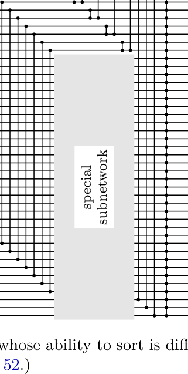

[Section 5.3.4: Networks for Sorting](../)

**Exercise 51.** &#9654; [*M25*] (R. L. Graham.) The comparator $[i:j]$ is called _redundant_ in the network $\alpha_1[i:j]\alpha_2$ if either $(x\alpha_1)_i \le (x\alpha_1)_j$ for all vectors $x$, or $(x\alpha_1)_i \ge (x\alpha_1)_j$ for all vectors $x$. Prove that if $\alpha$ is a network with $r$ _irredundant_ comparators, there are at least $r$ distinct ordered pairs $(i,j)$ of distinct indices such that $(x\alpha)_i \le (x\alpha)_j$ for all vectors $x$. (Consequently, a network with no redundant comparators contains at most $\binom{n}{2}$ modules.)

**Fig. 60.** A family of networks whose ability to sort is difficult to verify, illustrated for $m = 3$ and $n = 5$. (See exercise 52.)

**Verified:** no  
**Solve time:** 5m35s  

---

We need to solve Exercise 51 from Section 5.3.4 of TAOCP Volume 3.

Problem statement: 
"▶ 51. [M25] (R. L. Graham.) The comparator [i:j] is called redundant in the network α1[i:j]α2 if either (xα1)_i ≤ (xα1)_j for all vectors x, or (xα1)_i ≥ (xα1)_j for all vectors x. Prove that if α is a network with r irredundant comparators, there are at least r distinct ordered pairs (i,j) of distinct indices such that (xα)_i ≤ (xα)_j for all vectors x. (Consequently, a network with no redundant comparators contains at most (n choose 2) modules.)"

We need to prove this statement.

Let's parse the definitions.

We have a sorting network (or comparator network) α, which is a sequence of comparators. A comparator [i:j] takes two lines i and j and replaces the values with min and max. The network operates on vectors x = (x_1, ..., x_n). The notation (xα)_k denotes the value on line k after applying the network α to input x.

A comparator [i:j] in the network α1[i:j]α2 is called redundant if either for all input vectors x, after α1 we have (xα1)_i ≤ (xα1)_j, or for all input vectors x, (xα1)_i ≥ (xα1)_j. In other words, the comparator is guaranteed to always find the inputs already in sorted order (either non-decreasing or non-increasing) regardless of input. Such a comparator does nothing (it doesn't change the values) for any input, so it's redundant.

An irredundant comparator is one that is not redundant: there exist inputs x, y such that (xα1)_i > (xα1)_j and (yα1)_i < (yα1)_j. So the comparator actually does something for some inputs.

We need to prove: If α is a network with r irredundant comparators, then there are at least r distinct ordered pairs (i,j) of distinct indices such that (xα)_i ≤ (xα)_j for all vectors x.

In other words, the final network α enforces at least r distinct order relations among the output lines. Since there are only n choose 2 possible ordered pairs of distinct indices, we get r ≤ n(n-1)/2.

We need to prove this.

Let's think. The network α is a sequence of comparators. We can consider the effect of each comparator. For each comparator in the network, if it is irredundant, it contributes a new ordered pair that is enforced at the end? Or we need to show that for each irredundant comparator, there is a distinct ordered pair (i,j) such that the final output satisfies (xα)_i ≤ (xα)_j for all x.

How to associate an ordered pair with each irredundant comparator? Possibly by induction on the length of the network, or by considering the "transitive closure" of comparisons.

We need to formalize the network as a sequence of comparators: α = [i_1:j_1] [i_2:j_2] ... [i_t:j_t]. We are given that exactly r of these are irredundant. We need to show there are at least r distinct ordered pairs (p,q) such that for all inputs x, (xα)_p ≤ (xα)_q.

Observation: The comparator network can be seen as building a partial order. Initially, before any comparators, there are no enforced order relations among lines (except trivial equalities). Each comparator [i:j] enforces that after it, the value on line i is ≤ value on line j. However, that relation might not be "new" if it was already enforced by previous comparators (i.e., if it was already true that for all inputs, after previous network α_{k-1}, the value on line i ≤ value on line j). If it's not new, then the comparator is redundant? Wait, definition of redundant: a comparator [i:j] in α1[i:j]α2 is redundant if either (xα1)_i ≤ (xα1)_j for all x, or (xα1)_i ≥ (xα1)_j for all x. Note: If (xα1)_i ≥ (xα1)_j for all x, then the comparator would swap them to make i ≤ j, but since it's always ≥, the comparator always swaps? Actually, the comparator [i:j] replaces (a,b) with (min(a,b), max(a,b)). So if before the comparator we always have a ≥ b, then after the comparator we get (b,a). That means the comparator does change the values! But the definition says "redundant" if either a ≤ b for all inputs OR a ≥ b for all inputs. Wait, if a ≥ b for all inputs, then the comparator [i:j] will always swap them, so it's not doing nothing; it's actually performing a fixed permutation. But the definition calls it redundant. Why? Because if a ≥ b always, then we could just rename the lines or something? Actually, in the context of sorting networks, a comparator that always finds a ≥ b is redundant because we could just swap the lines in the preceding network? Or maybe the definition considers that if we know a ≥ b always, then the comparator is not needed because we could have just interchanged the lines before? Let's read carefully: "The comparator [i:j] is called redundant in the network α1[i:j]α2 if either (xα1)_i ≤ (xα1)_j for all vectors x, or (xα1)_i ≥ (xα1)_j for all vectors x." So if it's always a ≤ b, the comparator does nothing (min = a, max = b). If it's always a ≥ b, the comparator always swaps them, but we could just relabel the lines i and j in the rest of the network? But the definition says it's redundant in that case too. Possibly because if a ≥ b always, then the effect of the comparator is just to exchange the two lines, which could be absorbed into the following network α2. In any case, we accept the definition.

We need to prove: For a network with r irredundant comparators, there are at least r distinct ordered pairs (i,j) such that (xα)_i ≤ (xα)_j for all x.

This looks like an invariant: each irredundant comparator adds at least one new enforced inequality at the end.

Let's try to prove by induction on the number of comparators.

Let α be a network. Define a set of enforced inequalities at the end: E(α) = { (i,j) | i ≠ j, (xα)_i ≤ (xα)_j for all x }.

We want to show |E(α)| ≥ number of irredundant comparators in α.

Consider building the network by adding comparators one by one. Start with empty network α_0: E(α_0) = ∅, number of irredundant = 0. Property holds.

Suppose we have network α, and we append a comparator [i:j] to get α' = α[i:j]. We want to see how E changes and how irredundant count changes.

Case 1: The new comparator [i:j] is redundant in α'. That means in α, either (xα)_i ≤ (xα)_j for all x, or (xα)_i ≥ (xα)_j for all x. If (xα)_i ≤ (xα)_j for all x, then (i,j) ∈ E(α). Adding the comparator does nothing (since it's already ordered). Does E change? The new network α' = α[i:j]. For any input x, after α we have a ≤ b. Then the comparator leaves them as (a,b). So the outputs are same as α. Thus E(α') = E(α). The number of irredundant comparators in α' is same as in α (since this one is redundant). So the inequality |E| ≥ irredundant count remains true.

If (xα)_i ≥ (xα)_j for all x, then (j,i) ∈ E(α). The comparator will swap them. So the outputs of α' are the same as α except lines i and j are swapped. So E(α') is obtained from E(α) by swapping i and j in all pairs. So |E(α')| = |E(α)|. The irredundant count unchanged. So property holds.

Case 2: The new comparator [i:j] is irredundant in α'. That means in α, neither (i,j) nor (j,i) is in E(α). There exist inputs x, y such that (xα)_i > (xα)_j and (yα)_i < (yα)_j. Adding this comparator: for any input, after α we have values a, b on lines i,j. The comparator replaces them with min(a,b), max(a,b). So after the comparator, we always have value on i ≤ value on j. So (i,j) ∈ E(α'). Also, are there any other new enforced inequalities? Possibly the comparator could create new transitive relations? But we need to show that |E(α')| ≥ |E(α)| + 1. Since we added one irredundant comparator, we need the number of enforced inequalities to increase by at least 1. We know (i,j) is new because it wasn't in E(α). But could some old enforced inequalities be lost? When we add a comparator, we only change lines i and j. The values on other lines are unchanged. The comparator only swaps i and j if needed. So for any pair (k,l) not involving i or j, the relation is preserved. For pairs involving i or j, we need to check if any previously enforced inequality might be violated. Since the comparator only makes the value on i smaller or equal, and value on j larger or equal, it might break some inequalities? Let's check.

Suppose before the comparator, we had (k,i) ∈ E(α), i.e., (xα)_k ≤ (xα)_i for all x. After the comparator, (xα')_i = min((xα)_i, (xα)_j). Since (xα)_k ≤ (xα)_i, but we don't know relation with (xα)_j. Could it be that (xα)_k > min(...)? Since (xα)_k ≤ (xα)_i, and min ≤ (xα)_i, it's possible that (xα)_k > min if (xα)_j is smaller? But if (xα)_j is smaller than (xα)_k, then min = (xα)_j, and we don't know if (xα)_k ≤ (xα)_j. Actually, we don't have that enforced. So (k,i) might no longer be enforced. Similarly, (i,k) might be lost. So the set E can both gain and lose elements. We need to prove that the net change is at least +1 when adding an irredundant comparator.

This is a known result by R.L. Graham. The typical proof uses an invariant: each comparator that is irredundant creates a new "essential" comparison in the transitive closure of the network's comparison graph, or uses a potential function based on the number of distinct outputs or something.

Alternatively, we can use the concept of "zero-one principle" and consider the set of all 0-1 vectors. But the statement is about all vectors, not just 0-1. However, the condition (xα)_i ≤ (xα)_j for all vectors x is equivalent to it holding for all 0-1 vectors? Actually, if it holds for all vectors, it certainly holds for 0-1. Conversely, if it holds for all 0-1 vectors, does it hold for all vectors? For a comparator network, which is a monotone function (it preserves order?), the output is a monotone function of the input? Comparator networks are monotone in the sense that if x ≤ y componentwise, then (xα)_i ≤ (yα)_i? Yes, because each comparator replaces (a,b) with (min(a,b), max(a,b)), which is monotone. So the function is monotone. For monotone functions, if (xα)_i ≤ (xα)_j for all 0-1 inputs, does it hold for all real inputs? I think yes, because we can express the condition as: the maximum of (xα)_i - (xα)_j over all x is ≤ 0. Since the function is piecewise linear and homogeneous? Actually, it's a linear threshold function? Not exactly. But there is a known fact: a comparator network sorts all inputs iff it sorts all 0-1 inputs (zero-one principle). But here we are talking about a fixed network, not necessarily a sorting network. The property (xα)_i ≤ (xα)_j for all x is equivalent to the network output always having line i ≤ line j. This is a linear inequality? Not exactly linear. However, we can probably use the zero-one principle to simplify: The set of enforced inequalities E(α) is determined by 0-1 inputs? Let's check: If there is some real input where (xα)_i > (xα)_j, can we find a 0-1 input where it's also >? I think yes, by thresholding: if we take the inputs and replace each with 1 if it's above some threshold, 0 otherwise, the output will be the same thresholded version? Actually, comparator networks are "threshold functions" that preserve the property: if you apply a threshold to the inputs, the outputs are the threshold of the original outputs? Not exactly. But there is a known property: For any comparator network, the set of possible output tuples is the set of all vectors that can be obtained by sorting the input? No. But maybe we don't need zero-one principle.

Another approach: Consider the directed graph of enforced inequalities. Each comparator adds an edge i → j if it's irredundant? Actually, the standard proof: Define a relation R_k after k comparators: i R_k j if after the first k comparators, line i ≤ line j for all inputs. Initially R_0 is empty. When we add a comparator [i:j], if i R_{k-1} j, then it's redundant (already ordered). If j R_{k-1} i, then it's redundant (always reversed). Otherwise, neither i R j nor j R i. Then the comparator forces i ≤ j after it. But does it also force new relations via transitivity? The new relation R_k is the transitive closure of R_{k-1} ∪ {i → j}? But wait, is it exactly transitive closure? If after the comparator we have i ≤ j, and we had k ≤ i, then we get k ≤ j. Similarly, if we had j ≤ l, we get i ≤ l. However, we might lose some relations? Could we lose relations? Suppose we had i ≤ k before. After comparator, i becomes min(i,j). It's possible that min(i,j) > k even though i ≤ k? No, if i ≤ k, then min(i,j) ≤ i ≤ k, so i ≤ k still holds. What about k ≤ i? If k ≤ i before, after comparator i becomes min(i,j). Could k > min(i,j)? Yes, if j < k ≤ i, then min(i,j) = j < k, so k ≤ i fails. So we lose k ≤ i. But we might gain k ≤ j? Since k ≤ i and i ≥ j? Not necessarily. So the relation set is not simply transitive closure; it's more complex.

But Graham's result is known: "if a network has r irredundant comparators, then there are at least r distinct ordered pairs (i,j) such that (xα)_i ≤ (xα)_j for all x." This is from a paper by Graham? Possibly "On the number of comparisons in a sorting network" or something. The proof often uses an invariant: the number of distinct output vectors on 0-1 inputs? Or uses the concept of "essential comparisons".

Let's think differently. We can consider the network as a sequence of comparators. For each comparator, if it's irredundant, it means there exist inputs x, y such that after the previous network, line i > line j for x, and line i < line j for y. Then the comparator actually does something for some inputs. The claim is that each such irredundant comparator contributes a distinct "final" inequality.

Maybe we can prove by induction on the number of comparators, using a stronger invariant: For any network α, there exists an injection from the set of irredundant comparators in α to E(α). We can construct this injection by processing comparators from last to first? Or from first to last? Let's try from first to last.

Let α = [c_1, c_2, ..., c_t]. Let I be the set of indices k where c_k is irredundant. We need to assign to each k ∈ I a distinct pair (i,j) ∈ E(α).

Define the network α_k as the first k comparators. Let E_k be the enforced inequalities after k comparators. We have E_0 = ∅. For each k, if c_k is redundant, then E_k = E_{k-1} (up to swapping if it was always reversed? Actually if redundant because always a ≥ b, then the comparator swaps, so E_k is E_{k-1} with lines i and j swapped. That's a bijection, so |E_k| = |E_{k-1}|. If c_k is irredundant, then neither (i,j) nor (j,i) is in E_{k-1}. The comparator adds the relation i ≤ j. But it might remove some relations. However, we can define an injection from I to E_t.

Perhaps we can use a potential function: For a network α, consider the set of all possible output vectors (for all real inputs? or 0-1 inputs?). The number of distinct output vectors might increase with each irredundant comparator. But we need to map to ordered pairs.

Another idea: Use the zero-one principle. For 0-1 inputs, the output of a comparator network is also 0-1. The condition (xα)_i ≤ (xα)_j for all x is equivalent to: there is no 0-1 input where output has 1 on i and 0 on j. That means in the set of all output 0-1 vectors, i is never 1 while j is 0. So i is always ≤ j in the output.

Now, consider the set of all possible output vectors of α on 0-1 inputs. This is a subset of {0,1}^n. It is known that this set is "monotone" or "convex"? Actually, comparator networks produce "sorted" outputs in some sense? Not necessarily sorted, but the set of outputs is closed under some operations? There is a known result: The set of output vectors of a comparator network is a "lattice" or "sublattice"? Actually, the function is a lattice homomorphism: min and max. So the image of {0,1}^n is a sublattice of {0,1}^n? Since {0,1} is a lattice, the homomorphic image is a sublattice. So the set of outputs is a sublattice of the Boolean lattice.

The number of irredundant comparators is related to the number of "essential" comparisons. Perhaps we can use the fact that each irredundant comparator increases the number of "incomparabilities" or something.

Wait, there's a known theorem by Graham and others: "The number of irredundant comparators in a sorting network is at most n(n-1)/2." The proof often uses the concept of "comparisons that are forced at the end". Let me recall a proof.

Consider the network as a sequence of comparators. For each comparator [i:j] in the network, consider the set of input vectors for which this comparator actually swaps the values (i.e., before the comparator, line i > line j). If the comparator is irredundant, this set is non-empty and also not all inputs (since there are inputs where it doesn't swap). The set of inputs where it swaps is a "separating" set.

Maybe we can associate with each irredundant comparator a pair (i,j) that is "finally" enforced. The trick is to assign to each irredundant comparator the pair (i,j) where i is the line that ends up with the smaller value and j the larger value after the whole network, but that might not be distinct.

Let's try to prove by induction on the length of the network. Let α be a network with r irredundant comparators. We want to show |E(α)| ≥ r. We'll use induction on the number of comparators. Base case: empty network, r=0, |E|=0, holds.

Suppose α = β[c] where c = [i:j]. By induction, |E(β)| ≥ r_β, where r_β is the number of irredundant comparators in β. Now c is either redundant or irredundant in α.

If c is redundant in α, then r = r_β, and we need to show |E(α)| ≥ |E(β)|. But as noted, if c is redundant because (xβ)_i ≤ (xβ)_j for all x, then E(α) = E(β). If c is redundant because (xβ)_i ≥ (xβ)_j for all x, then E(α) is E(β) with i and j swapped, so |E(α)| = |E(β)|. So |E(α)| = |E(β)| ≥ r_β = r. OK.

If c is irredundant in α, then r = r_β + 1. We need to show |E(α)| ≥ |E(β)| + 1.

We know that in β, neither (i,j) nor (j,i) is in E(β). So (i,j) ∉ E(β) and (j,i) ∉ E(β). After adding c, we have (i,j) ∈ E(α). But could some other pairs be lost? We need to show that the net change is at least +1.

Let's analyze E(α) in terms of E(β). For any input x, let a = (xβ)_i, b = (xβ)_j. After c, the values on i and j are a' = min(a,b), b' = max(a,b). For any other line k, (xα)_k = (xβ)_k.

Consider a pair (k,l) with k,l ∉ {i,j}. (k,l) ∈ E(α) iff (k,l) ∈ E(β). So these are unchanged.

Consider pairs involving i and j.

- (i,j): Since a' ≤ b' always, (i,j) ∈ E(α). And (i,j) ∉ E(β) by assumption (irredundant means neither i≤j nor j≤i holds for all inputs in β). So (i,j) is new in E(α).

- (j,i): (j,i) ∈ E(α) would mean b' ≤ a' always, i.e., a' = b' always. But since c is irredundant, there exist inputs with a > b and a < b, so a' ≠ b' for some inputs. Thus (j,i) ∉ E(α). Also (j,i) ∉ E(β). So no change for (j,i).

Now consider (k,i) for k ∉ {i,j}. (k,i) ∈ E(α) means (xβ)_k ≤ min((xβ)_i, (xβ)_j) for all x. In β, we might have (k,i) ∈ E(β) meaning (xβ)_k ≤ (xβ)_i for all x. But it's possible that (xβ)_k ≤ (xβ)_i always, but (xβ)_k > min(...) for some x if (xβ)_j < (xβ)_k. So (k,i) could be lost. Similarly, (i,k) could be lost or gained.

So E(α) may lose some pairs from E(β). We need to show that the number of pairs lost is at most the number gained minus 1? Actually we need |E(α)| ≥ |E(β)| + 1. Since we gained (i,j), if we lose some pairs, we need to ensure we don't lose more than we gain. But we only gained one pair (i,j). Could we lose multiple pairs? Yes, potentially. So we need a more refined argument.

Maybe we can show that the pairs that are lost are "compensated" by new pairs involving j? For example, if (k,i) is lost, maybe (k,j) is gained? Let's check.

Suppose (k,i) ∈ E(β) but (k,i) ∉ E(α). That means (xβ)_k ≤ (xβ)_i for all x, but there exists some x such that (xβ)_k > min((xβ)_i, (xβ)_j). Since (xβ)_k ≤ (xβ)_i, the only way this can happen is if (xβ)_j < (xβ)_k ≤ (xβ)_i. For such x, min = (xβ)_j, so (xβ)_k > (xβ)_j. Thus (k,j) ∉ E(β) (since (xβ)_k > (xβ)_j for that x). But does (k,j) become enforced in α? After the comparator, (xα)_j = max((xβ)_i, (xβ)_j). Since (xβ)_k ≤ (xβ)_i, we have (xβ)_k ≤ max(...). Also for x where (xβ)_j ≥ (xβ)_i, min = (xβ)_i, and (xβ)_k ≤ (xβ)_i ≤ (xβ)_j = max? Actually if (xβ)_j ≥ (xβ)_i, then max = (xβ)_j, and (xβ)_k ≤ (xβ)_i ≤ (xβ)_j. So in all cases, (xβ)_k ≤ max((xβ)_i, (xβ)_j). So (k,j) ∈ E(α)! Let's verify: For any x, (xα)_k = (xβ)_k, (xα)_j = max(a,b). We know (xβ)_k ≤ a (since (k,i) ∈ E(β)). Also we don't know relation with b. But max(a,b) is at least a, so (xβ)_k ≤ a ≤ max(a,b). Thus (xα)_k ≤ (xα)_j for all x. So (k,j) ∈ E(α). Moreover, (k,j) was not in E(β) because there exists x with (xβ)_k > b (the x that caused (k,i) to be lost). So (k,j) is a new pair in E(α).

Similarly, if (i,k) ∈ E(β) is lost, then (j,k) is gained? Let's check: (i,k) ∈ E(β) means a ≤ (xβ)_k for all x. If it's lost in α, then there exists x such that min(a,b) > (xβ)_k. Since a ≤ (xβ)_k, this implies b < a? Wait: min(a,b) > (xβ)_k. Since a ≤ (xβ)_k, min(a,b) cannot be a (because a ≤ (xβ)_k). So min(a,b) must be b, and b > (xβ)_k. Also a ≤ (xβ)_k. So b > (xβ)_k ≥ a. Then for this x, a < (xβ)_k < b. In α, (xα)_i = min(a,b) = a, (xα)_j = max(a,b) = b. We know b > (xβ)_k = (xα)_k. So (j,k) is not violated? Actually (j,k) means b ≤ (xβ)_k? But b > (xβ)_k, so (j,k) ∉ E(α). Hmm, maybe (i,k) lost doesn't give a gain.

Let's carefully analyze the transitions.

Define sets:
A = { k ∉ {i,j} | (k,i) ∈ E(β) }
B = { k ∉ {i,j} | (i,k) ∈ E(β) }
C = { k ∉ {i,j} | (k,j) ∈ E(β) }
D = { k ∉ {i,j} | (j,k) ∈ E(β) }

We know (i,j) ∉ E(β), (j,i) ∉ E(β).

In α, we have:
- (i,j) ∈ E(α) (new)
- For k ∉ {i,j}:
  (k,i) ∈ E(α) iff (xβ)_k ≤ min(a,b) for all x. Since (xβ)_k ≤ a for all x (if k ∈ A), we need also (xβ)_k ≤ b for all x? Actually min(a,b) ≤ b always. So (k,i) ∈ E(α) iff (k,i) ∈ E(β) and (k,j) ∈ E(β). Because we need (xβ)_k ≤ a and (xβ)_k ≤ b for all x. So (k,i) ∈ E(α) iff k ∈ A ∩ C.
  (i,k) ∈ E(α) iff min(a,b) ≤ (xβ)_k for all x. Since a ≤ (xβ)_k for all x if k ∈ B? Wait, (i,k) ∈ E(β) means a ≤ (xβ)_k. For min(a,b) ≤ (xβ)_k, we need both a ≤ (xβ)_k and b ≤ (xβ)_k? Actually min(a,b) ≤ (xβ)_k is equivalent to (a ≤ (xβ)_k) AND (b ≤ (xβ)_k)? No, min(a,b) ≤ (xβ)_k means at least one of a,b is ≤ (xβ)_k? Wait: min(a,b) ≤ c iff a ≤ c OR b ≤ c? No, min(a,b) ≤ c is equivalent to (a ≤ c) OR (b ≤ c)? Let's check: if a=5, b=3, c=4, min=3 ≤4 true, a=5≤4 false, b=3≤4 true. So min ≤ c iff (a ≤ c) OR (b ≤ c). But we need this for all x. So (i,k) ∈ E(α) iff for all x, (a ≤ (xβ)_k) OR (b ≤ (xβ)_k). This is not simply expressed in terms of E(β) relations because it's a disjunction. However, we can use the fact that E(β) are universal quantifiers. Let's think differently.

Maybe there's a known proof using "critical pairs" or "zero-one principle" and "antichains". Another approach: Consider the set of all 0-1 inputs. For a network, the output is a 0-1 vector. The condition (xα)_i ≤ (xα)_j for all x means that in the set of output vectors S = {xα : x ∈ {0,1}^n}, the i-th coordinate is never 1 while the j-th is 0. That is, S is contained in the set of vectors where i ≤ j.

Now, each comparator [i:j] in the network, when applied to a set of vectors, replaces it by a new set. The operation is: for each vector, set i = min(i,j), j = max(i,j). This is exactly the operation of "sorting" the two coordinates.

We can think of the network as building a sequence of sets S_0, S_1, ..., S_t, where S_0 = {0,1}^n, and each step applies a comparator. The final set S_t is the set of outputs. The enforced inequalities E(α) are exactly the pairs (i,j) such that S_t ⊆ {v : v_i ≤ v_j}.

Now, an irredundant comparator is one where before applying it, the set S_{k-1} contains vectors with v_i = 1, v_j = 0 and also vectors with v_i = 0, v_j = 1. After applying it, all vectors have v_i ≤ v_j. So the comparator eliminates all vectors with (1,0) on (i,j). The new set S_k is a subset of S_{k-1} with the property that v_i ≤ v_j for all vectors.

We want to show that the number of irredundant comparators is at most the number of pairs (i,j) such that S_t ⊆ {v_i ≤ v_j}.

Consider the sequence of sets S_0 ⊇ S_1 ⊇ ... ⊇ S_t. Each irredundant comparator strictly reduces the set (since it removes at least the vectors with (1,0) on that pair). Redundant comparators might not reduce the set? If a comparator is redundant because v_i ≤ v_j always, then S_{k-1} already satisfies v_i ≤ v_j, so applying the comparator does nothing (S_k = S_{k-1}). If it's redundant because v_i ≥ v_j always, then S_{k-1} satisfies v_i ≥ v_j, so applying the comparator swaps them, giving S_k = {swap_{i,j}(v) : v ∈ S_{k-1}}. So the set is not necessarily the same, but it's isomorphic (just renaming i and j). In terms of the set of enforced inequalities, we already handled that case.

So we can focus on the case where the network has no redundant comparators of the second type? Actually, we can preprocess: if a comparator is redundant because always ≥, we can just swap the labels i and j in the rest of the network. This doesn't change the number of irredundant comparators or the number of final enforced inequalities. So we can assume without loss of generality that no comparator is redundant because of ≥. Then every redundant comparator is of the type where i ≤ j already holds. In that case, the set S_k = S_{k-1} (no change). So we can ignore redundant comparators entirely; they don't affect the final set S_t. So we can assume the network consists only of irredundant comparators, and we need to show that the number of irredundant comparators t is at most the number of pairs (i,j) with S_t ⊆ {v_i ≤ v_j}.

Now, each irredundant comparator [i:j] takes S_{k-1} and produces S_k = {v ∈ S_{k-1} : v_i ≤ v_j} (since it removes all vectors with v_i=1, v_j=0). Wait, is that exactly true? If S_{k-1} contains vectors with v_i=1, v_j=0, applying the comparator changes them to v_i=0, v_j=1. So the new set S_k is not just the subset with v_i ≤ v_j; it's the set where we take all vectors and force v_i ≤ v_j by swapping if necessary. But since we are considering the set of all possible outputs, the operation is: S_k = {sort_{i,j}(v) : v ∈ S_{k-1}}, where sort_{i,j} replaces (1,0) with (0,1) and leaves (0,0), (1,1), (0,1) unchanged. This is equivalent to S_k = {v ∈ {0,1}^n : v_i ≤ v_j and there exists u ∈ S_{k-1} with u = v or u = v with i,j swapped}. But if S_{k-1} is closed under some operations? Actually, S_{k-1} is a sublattice? The image of {0,1}^n under a comparator network is a sublattice. And the operation sort_{i,j} is a closure operator on sublattices? There is a known theory: comparator networks correspond to "lattice ideals" or something.

But maybe we can use a simpler invariant: the number of "inversions" or "antichains"? Another known proof: For each comparator, if it's irredundant, it creates a new "essential" comparison in the transitive closure of the network's comparison graph when viewed as a partial order? I recall a proof by Graham using the concept of "critical pairs" or "essential comparisons" in the final output.

Let's search memory: There's a classic result: "In any sorting network with no redundant comparators, the number of comparators is at most n(n-1)/2." The proof often goes: For each comparator [i:j] in the network, consider the set of inputs for which the output of the network has 1 on i and 0 on j. Or something like that. Actually, the statement in the exercise is: "if α is a network with r irredundant comparators, there are at least r distinct ordered pairs (i,j) such that (xα)_i ≤ (xα)_j for all vectors x." This is equivalent to: the number of irredundant comparators ≤ number of enforced inequalities at the end.

A known proof: Consider the network as a sequence of comparators. For each irredundant comparator, there is an input that makes it swap (i.e., before the comparator, line i > line j). Choose such an input for each irredundant comparator. Then show that the pairs (i,j) for which the final output has i ≤ j are at least the number of irredundant comparators.

Alternatively, we can use an inductive proof with a clever invariant: Define for each comparator a "witness" pair. When we add a comparator [i:j], if it's irredundant, we can assign to it the pair (i,j) itself, but we need to ensure distinctness. Maybe we can assign to each irredundant comparator a pair that becomes "forced" at the end and that is unique to that comparator.

Let's try to construct an injection from irredundant comparators to E(α). Process the network from last to first. For the last comparator [i:j], if it's irredundant, then (i,j) ∈ E(α). Assign (i,j) to this comparator. Now remove this comparator? But removing it might change E(α) for the remaining network. However, if we remove the last comparator, the resulting network α' has E(α') that might not contain (i,j). But we can relate E(α) and E(α'). If the last comparator is irredundant, then in α', neither (i,j) nor (j,i) is in E(α'). The comparator adds (i,j) to E(α). Could it also remove some pairs from E(α')? Yes, as we saw. But maybe we can show that the number of pairs removed is at most the number of pairs added by other comparators? Not straightforward.

Another approach: Use the concept of "sorting network" and "zero-one principle" to reduce to 0-1 vectors. Consider the set of all 0-1 inputs. The network computes a function f: {0,1}^n → {0,1}^n. The condition (xα)_i ≤ (xα)_j for all x means f(x)_i ≤ f(x)_j for all x. The number of such pairs is at least the number of irredundant comparators.

Now, each comparator is a function c_{i,j}: {0,1}^n → {0,1}^n that sorts coordinates i and j. The network is a composition of such functions. An irredundant comparator is one where the function before it does not already satisfy c_{i,j}(y) = y for all y in the image, nor does it satisfy c_{i,j}(y) = swap_{i,j}(y) for all y. In other words, the function before the comparator has both y with y_i=1,y_j=0 and y with y_i=0,y_j=1 in its image.

We want to show that the number of irredundant comparators in the composition is at most the number of pairs (i,j) such that the final function f satisfies f(x)_i ≤ f(x)_j for all x.

This looks like a known result in the theory of comparator networks. I recall a paper by Graham and possibly others on "The number of comparators in a sorting network" or "On the number of comparisons in a sorting network". There's a proof using "inversions" or "antichains" in the poset of outputs.

Let's think about the poset of outputs. The set of outputs S = f({0,1}^n) is a sublattice of {0,1}^n. The condition f(x)_i ≤ f(x)_j for all x means that in S, i is always ≤ j. This is equivalent to saying that S is contained in the sublattice where i ≤ j.

Each comparator [i:j] when applied to a sublattice T, produces a new sublattice T' = c_{i,j}(T). If T already satisfies i ≤ j, then T' = T. If T satisfies i ≥ j, then T' = swap_{i,j}(T). If T has both types, then T' is the sublattice obtained by "forcing i ≤ j" on T? Actually, c_{i,j} on a set T is the set of vectors obtained by sorting i,j in each vector of T. This set is the same as the sublattice generated by T with the relation i ≤ j? Not exactly.

But there is a known concept: the "comparison graph" of a network. Each comparator adds an edge i,j? But the network is directed? Actually, the final enforced inequalities form a partial order. The number of irredundant comparators is at most the number of edges in the transitive reduction of this partial order? Not exactly, because the network might not be a sorting network; it might not fully sort. But the statement holds for any network.

Let's try to prove by induction on the number of irredundant comparators.

Let α be a network with r irredundant comparators. We want to show |E(α)| ≥ r.

If r=0, trivial.

Suppose r>0. Consider the last irredundant comparator in α. Write α = β[c]γ, where c = [i:j] is the last irredundant comparator, and γ consists only of redundant comparators. But as we noted, redundant comparators of the ≥ type can be absorbed by swapping lines, and those of the ≤ type do nothing. However, γ might contain both types. But we can simplify: we can push the redundant comparators past the irredundant ones? Not necessarily, because redundant comparators might depend on the order.

Maybe we can prove a stronger statement: For any network α, there is an injection from the set of irredundant comparators in α to E(α). We can construct this injection by processing the network from first to last, maintaining a set of "active" pairs or something.

Let's think about the "zero-one principle" and the set of output vectors S. For each pair (i,j) ∈ E(α), we have S ⊆ {v: v_i ≤ v_j}. This means S is contained in the sublattice L_{i,j} = {v: v_i ≤ v_j}. The set E(α) corresponds to the set of all such pairs.

Now, each irredundant comparator corresponds to a step where we intersect with some L_{i,j} (or apply the sorting operation). But the sorting operation c_{i,j} on a sublattice T is not simply T ∩ L_{i,j}; it's more like the projection onto L_{i,j} along the swap. However, for sublattices, there is a known property: the image of a sublattice under c_{i,j} is the smallest sublattice containing T ∩ L_{i,j} and closed under something? Actually, c_{i,j}(T) = {v ∈ {0,1}^n : v_i ≤ v_j and there exists u ∈ T such that u = v or u = swap_{i,j}(v)}. This is the sublattice generated by T ∪ swap_{i,j}(T) intersected with L_{i,j}? Not sure.

But perhaps we can use the following invariant: The number of irredundant comparators is at most the number of pairs (i,j) such that S ⊆ L_{i,j}. This is equivalent to the statement that the number of irredundant comparators is at most the number of "forced comparisons" in the output.

I recall a proof by induction on the number of comparators, using the concept of "critical pairs" defined by the final output. For each irredundant comparator, we can find a 0-1 input that "witnesses" its irredundancy and maps to a distinct output vector, and then show that each such witness forces a new inequality.

Let's try to construct a direct proof.

Let α = [c_1, c_2, ..., c_m] be the network. For each k, let α_k = [c_1, ..., c_k]. Let S_k = {xα_k : x ∈ {0,1}^n} be the set of outputs after k comparators. S_0 = {0,1}^n. For each k, if c_k = [i:j] is irredundant, then S_{k-1} contains vectors with 1 on i, 0 on j, and also vectors with 0 on i, 1 on j. The operation c_k maps S_{k-1} to S_k.

We want to show that the number of irredundant c_k is ≤ |E(α_m)|.

Observation: If we have a set T ⊆ {0,1}^n, define the set of enforced pairs E(T) = {(i,j) : ∀v∈T, v_i ≤ v_j}. We want to show |E(S_m)| ≥ number of irredundant steps.

Note that if T ⊆ L_{i,j} (i.e., v_i ≤ v_j for all v∈T), then applying c_{i,j} leaves T unchanged. If T ⊆ L_{j,i} (v_i ≥ v_j for all v), then applying c_{i,j} swaps i and j, giving a set T' with E(T') = swap_{i,j}(E(T)). If T intersects both L_{i,j} and L_{j,i} non-trivially (i.e., has vectors with v_i=1,v_j=0 and v_i=0,v_j=1), then applying c_{i,j} forces i ≤ j in the result, but might change other pairs.

Let's analyze how E(T) changes when we apply an irredundant comparator c = c_{i,j} to T, where T has both types. Let T' = c(T). We know (i,j) ∈ E(T') but (i,j) ∉ E(T) and (j,i) ∉ E(T). For other pairs (k,l), what is the relation between E(T) and E(T')?

We can compute E(T') in terms of E(T). For any k,l ∉ {i,j}, (k,l) ∈ E(T') iff (k,l) ∈ E(T) because the comparator doesn't affect k,l.

For pairs involving i or j:
- (k,i) ∈ E(T') iff for all v∈T, min(v_i, v_j) ≥ v_k? Wait, (k,i) means v_k ≤ v_i' for all v'∈T'. v_i' = min(v_i, v_j). So we need v_k ≤ min(v_i, v_j) for all v∈T. This is equivalent to (k,i) ∈ E(T) AND (k,j) ∈ E(T).
- (i,k) ∈ E(T') iff for all v∈T, min(v_i, v_j) ≤ v_k. This is equivalent to: for all v∈T, (v_i ≤ v_k) OR (v_j ≤ v_k). This is NOT simply expressed in terms of E(T) because it's a disjunction. However, note that if (i,k) ∈ E(T) and (j,k) ∈ E(T), then certainly (i,k) ∈ E(T'). But the converse is not required; it's possible that neither (i,k) nor (j,k) is in E(T), but for every v, at least one holds. That would mean T ⊆ {v: v_i ≤ v_k} ∪ {v: v_j ≤ v_k}. Since T is a sublattice, is that possible? The union of two sublattices is not necessarily a sublattice. But T is a sublattice. If T ⊆ A ∪ B where A = {v: v_i ≤ v_k} and B = {v: v_j ≤ v_k}, and T is a sublattice, then T must be contained in A or in B? Not necessarily; consider T = {00,01,10,11} on {i,k,j}? Let's check. This is a known property: If a sublattice is contained in the union of two sublattices that are "prime" in some sense, then it's contained in one of them. But {v: v_i ≤ v_k} is a sublattice? The set of vectors with v_i ≤ v_k is a sublattice (since if v_i ≤ v_k and w_i ≤ w_k, then min(v_i,w_i) ≤ min(v_k,w_k) and max(v_i,w_i) ≤ max(v_k,w_k)). Similarly for v_j ≤ v_k. The union of two sublattices is not a sublattice in general. But T is a sublattice contained in the union. By a theorem of Birkhoff or something, a sublattice contained in the union of two sublattices must be contained in one of them? That's not true in general for lattices. For example, the lattice {0, a, b, 1} where a and b are incomparable, can be covered by two sublattices {0,a,1} and {0,b,1}? Their union is the whole lattice. So a sublattice can be contained in the union of two proper sublattices without being contained in either. However, our sublattice T is a sublattice of the Boolean lattice. The sets A and B are specific sublattices: A = {v: v_i ≤ v_k}, B = {v: v_j ≤ v_k}. These are "ideals" or "filters"? Actually, A is the set where coordinate i is 0 or coordinate k is 1. This is a sublattice. Is it possible that T ⊆ A ∪ B but T ⊈ A and T ⊈ B? Let's test with a small example. n=3, coordinates i,j,k. T is some sublattice. Suppose T contains vectors: v1 = (0,0,0) (i=0,j=0,k=0) ∈ A∩B; v2 = (1,0,1) (i=1,j=0,k=1) ∈ A; v3 = (0,1,1) (i=0,j=1,k=1) ∈ B; v4 = (1,1,1) (i=1,j=1,k=1) ∈ A∩B. Is T a sublattice? v2 ∧ v3 = (0,0,1) which has i=0,j=0,k=1. Check if (0,0,1) ∈ A∪B: i=0 ≤ k=1 so ∈ A. v2 ∨ v3 = (1,1,1) ∈ A∩B. So T = {000,101,011,111,001}? But is it closed? We also have v2 ∧ v4 = v2, etc. This set is {000,001,011,101,111}. Check if it's a sublattice: 000∧001=000, 000∨001=001; 001∧011=001, 001∨011=011; 001∧101=001, 001∨101=101; 011∧101=001, 011∨101=111; 101∧111=101, 101∨111=111; 011∧111=011, 011∨111=111. All in set. So T is a sublattice. Now check (i,k): (i,k) ∈ E(T') means min(v_i,v_j) ≤ v_k for all v∈T. v=(1,0,1): min(1,0)=0 ≤1 ok. v=(0,1,1): min=0≤1 ok. v=(1,1,1): min=1≤1 ok. v=(0,0,1): min=0≤1 ok. v=(0,0,0): min=0≤0 ok. So (i,k) holds for all v. But (i,k) ∉ E(T) because v=(1,0,1) has i=1,k=1 ok; v=(1,1,1) ok; but does any v have i=1,k=0? T has no vector with k=0 and i=1. Actually T has 000 (i=0,k=0), 001 (i=0,k=1), 011 (i=0,k=1), 101 (i=1,k=1), 111 (i=1,k=1). So (i,k) holds for all v in T? Wait, v=(1,0,1) has i=1,k=1 so i≤k holds. v=(1,1,1) holds. So (i,k) ∈ E(T) actually! Because all vectors have i ≤ k? Check: 000: 0≤0; 001:0≤1; 011:0≤1; 101:1≤1; 111:1≤1. Yes, all have i ≤ k. So (i,k) ∈ E(T). And (j,k): 000:0≤0; 001:0≤1; 011:1≤1; 101:0≤1; 111:1≤1. So (j,k) ∈ E(T) as well! So in this example, both (i,k) and (j,k) are in E(T). So the disjunction condition is equivalent to both being in E(T)? Let's check if there is a case where for all v, min(v_i,v_j) ≤ v_k but neither (i,k) nor (j,k) holds universally. That would require T to have a vector with v_i=1, v_k=0 (so (i,k) fails) and a vector with v_j=1, v_k=0 (so (j,k) fails), but never a vector with both v_i=1 and v_j=1 while v_k=0? Because if there is a vector with v_i=1, v_k=0, then min(v_i,v_j) ≤ v_k implies v_j must be 0. So any vector with v_i=1, v_k=0 must have v_j=0. Similarly, any vector with v_j=1, v_k=0 must have v_i=0. So T cannot contain a vector with v_i=1, v_j=1, v_k=0. Could T be a sublattice containing a vector with v_i=1,v_j=0,v_k=0 and another with v_i=0,v_j=1,v_k=0? Let's test: v = (1,0,0) and w = (0,1,0). Their join is (1,1,0). This has v_i=1,v_j=1,v_k=0, which violates the condition min(v_i,v_j) ≤ v_k (since min=1 > 0). So the join would not satisfy the condition. But T is a sublattice, so if T contains (1,0,0) and (0,1,0), it must contain (1,1,0). Then (1,1,0) would violate min ≤ v_k. So it's impossible for a sublattice to have the disjunction property without both (i,k) and (j,k) being in E(T). Is that always true?

Let's prove: Suppose T is a sublattice of {0,1}^n. Suppose for all v ∈ T, min(v_i, v_j) ≤ v_k. We want to show that either (i,k) ∈ E(T) or (j,k) ∈ E(T)? Actually we want to show that if (i,k) ∉ E(T) and (j,k) ∉ E(T), then there exists v ∈ T with min(v_i,v_j) > v_k. Assume (i,k) ∉ E(T) means there exists u ∈ T with u_i = 1, u_k = 0. Since min(u_i,u_j) ≤ u_k = 0, we must have min(1,u_j) = 0, so u_j = 0. So u = (1,0,0) on coordinates i,j,k. Similarly, (j,k) ∉ E(T) implies there exists v ∈ T with v_i=0, v_j=1, v_k=0. Now consider u ∨ v. This has i=1, j=1, k=0. Then min(u_i,u_j) = 1 > 0 = v_k, contradiction. So the assumption that both (i,k) and (j,k) are not in E(T) leads to a contradiction. Therefore, at least one of (i,k) or (j,k) is in E(T). But we need both to be in E(T) to conclude that (i,k) ∈ E(T')? Wait, (i,k) ∈ E(T') means min(v_i,v_j) ≤ v_k for all v∈T. We just proved that if this holds, then at least one of (i,k) or (j,k) is in E(T). But is it possible that only one is in E(T) and the disjunction holds? Suppose (i,k) ∈ E(T) but (j,k) ∉ E(T). Then there exists v with v_j=1, v_k=0. Then min(v_i,v_j) ≤ v_k? Since v_k=0, we need min(v_i,1)=0, so v_i=0. That's fine. But does min(v_i,v_j) ≤ v_k hold for all v? For v with v_j=1,v_k=0, we need v_i=0. But if T is a sublattice and contains such a v, and also contains u with u_i=1, u_k=0 (if (i,k) ∉ E(T)? Wait, if (i,k) ∈ E(T), then no u with u_i=1,u_k=0 exists. So (i,k) ∈ E(T) means all v have v_i ≤ v_k. Then min(v_i,v_j) ≤ v_i ≤ v_k, so the condition holds automatically. So if (i,k) ∈ E(T), then (i,k) ∈ E(T') regardless of (j,k). Similarly if (j,k) ∈ E(T). So actually (i,k) ∈ E(T') iff (i,k) ∈ E(T) OR (j,k) ∈ E(T)? Let's check: If (i,k) ∈ E(T), then for all v, v_i ≤ v_k, so min(v_i,v_j) ≤ v_i ≤ v_k, so (i,k) ∈ E(T'). If (j,k) ∈ E(T), then min(v_i,v_j) ≤ v_j ≤ v_k, so (i,k) ∈ E(T'). Conversely, if (i,k) ∈ E(T'), we proved that either (i,k) ∈ E(T) or (j,k) ∈ E(T). So indeed, (i,k) ∈ E(T') ⇔ (i,k) ∈ E(T) ∨ (j,k) ∈ E(T).

Similarly, (k,i) ∈ E(T') ⇔ (k,i) ∈ E(T) ∧ (k,j) ∈ E(T) (as we derived earlier).

Now, what about (j,k) and (k,j)?
- (j,k) ∈ E(T') means max(v_i,v_j) ≤ v_k. This is equivalent to (i,k) ∈ E(T) AND (j,k) ∈ E(T)? Because max ≤ v_k means both ≤ v_k. So (j,k) ∈ E(T') ⇔ (i,k) ∈ E(T) ∧ (j,k) ∈ E(T).
- (k,j) ∈ E(T') means v_k ≤ max(v_i,v_j). This is equivalent to (k,i) ∈ E(T) ∨ (k,j) ∈ E(T).

Now, what about (i,j) and (j,i)?
- (i,j) ∈ E(T') always (since min ≤ max).
- (j,i) ∈ E(T') iff max ≤ min iff max = min iff v_i = v_j for all v. But since c is irredundant, T has both (1,0) and (0,1) on (i,j), so (j,i) ∉ E(T').

So we have a complete description of how E changes when we apply an irredundant comparator c_{i,j} to a sublattice T.

Now, E(T) is a set of ordered pairs. The rules:
- For k ∉ {i,j}: (k,l) unchanged.
- (i,j) added (was not in E(T)).
- (j,i) remains out (was not in E(T)).
- (k,i) : new E = E_old ∩ E_old with j? Actually (k,i) in E' iff (k,i) in E and (k,j) in E.
- (k,j) in E' iff (k,i) in E and (k,j) in E? Wait, (k,j) in E' means v_k ≤ max(v_i,v_j). This is (k,i) ∨ (k,j) in E? We had: (k,j) ∈ E' ⇔ (k,i) ∈ E ∨ (k,j) ∈ E? Let's re-derive carefully.

We need to be systematic. Let T be the set before comparator, T' after comparator c_{i,j}. T' = {sort_{i,j}(v) : v ∈ T}.

For any pair (p,q):
- If p,q ∉ {i,j}: (p,q) ∈ E(T') iff (p,q) ∈ E(T).

For pairs involving i or j:
- (i,j): For all v∈T', v_i ≤ v_j by definition of sort. So (i,j) ∈ E(T').
- (j,i): For all v∈T', v_j ≥ v_i. So (j,i) ∈ E(T') iff v_i = v_j for all v∈T. Since c is irredundant, there exist v with v_i=1,v_j=0 and v with v_i=0,v_j=1, so v_i ≠ v_j for some v, thus (j,i) ∉ E(T').

- (k,i) for k ∉ {i,j}: v_k ≤ v_i' = min(v_i,v_j) for all v∈T. This is equivalent to (v_k ≤ v_i) AND (v_k ≤ v_j) for all v∈T. So (k,i) ∈ E(T') iff (k,i) ∈ E(T) AND (k,j) ∈ E(T).

- (i,k): v_i' = min(v_i,v_j) ≤ v_k for all v∈T. This is equivalent to (v_i ≤ v_k) OR (v_j ≤ v_k) for all v∈T. As argued, for sublattices this is equivalent to (i,k) ∈ E(T) OR (j,k) ∈ E(T). Let's prove: If (i,k) ∈ E(T) or (j,k) ∈ E(T), then clearly min(v_i,v_j) ≤ v_k for all v. Conversely, if min(v_i,v_j) ≤ v_k for all v, suppose neither (i,k) nor (j,k) is in E(T). Then there exist u with u_i=1, u_k=0 and v with v_j=1, v_k=0. Then u_i=1, u_k=0 implies u_j=0 (since min(1,u_j) ≤ 0 ⇒ u_j=0). Similarly v_i=0. Then u∨v has (1,1,0) on i,j,k, contradicting min ≤ v_k. So at least one of (i,k) or (j,k) is in E(T). So (i,k) ∈ E(T') ⇔ (i,k) ∈ E(T) ∨ (j,k) ∈ E(T).

- (k,j): v_k ≤ v_j' = max(v_i,v_j) for all v∈T. This is equivalent to (v_k ≤ v_i) OR (v_k ≤ v_j) for all v? Wait, max(v_i,v_j) is the larger of v_i and v_j. v_k ≤ max(v_i,v_j) means v_k ≤ v_i OR v_k ≤ v_j? Actually, if max is 1, then v_k can be 0 or 1; if max is 0, then v_k must be 0. The condition v_k ≤ max(v_i,v_j) for all v means: whenever v_k=1, we must have max=1, i.e., at least one of v_i,v_j is 1. This is equivalent to: there is no v with v_k=1, v_i=0, v_j=0. In terms of E(T): (k,i) ∈ E(T) means v_k ≤ v_i for all v, i.e., no v with v_k=1, v_i=0. (k,j) ∈ E(T) means no v with v_k=1, v_j=0. The condition "no v with v_k=1, v_i=0, v_j=0" is strictly weaker than the conjunction? Actually, it's equivalent to: (k,i) ∈ E(T) OR (k,j) ∈ E(T)? Let's check: If (k,i) ∈ E(T), then whenever v_k=1, v_i=1, so condition holds. If (k,j) ∈ E(T), similarly. Conversely, if neither (k,i) nor (k,j) is in E(T), there exist u with u_k=1, u_i=0 and v with v_k=1, v_j=0. Can we get a vector with v_k=1, v_i=0, v_j=0? Consider u ∧ v. Since u_i=0, v_j=0, u∧v has i=0, j=0. Also u_k=1, v_k=1 ⇒ (u∧v)_k=1. So u∧v has (0,0,1) on i,j,k, violating v_k ≤ max(v_i,v_j). But wait, u and v are in T, and T is a sublattice, so u∧v ∈ T. This gives a contradiction. So at least one of (k,i) or (k,j) must be in E(T). So (k,j) ∈ E(T') ⇔ (k,i) ∈ E(T) ∨ (k,j) ∈ E(T).

- (j,k): v_j' = max(v_i,v_j) ≤ v_k for all v∈T. This means (v_i ≤ v_k) AND (v_j ≤ v_k) for all v. So (j,k) ∈ E(T') ⇔ (i,k) ∈ E(T) ∧ (j,k) ∈ E(T).

Let's summarize the transformation of E when applying an irredundant comparator c_{i,j} to a sublattice T (which is the image of a network):

Let E be the set before, E' after. For any k,l ∉ {i,j}: (k,l) unchanged.

For pairs with i,j:
- (i,j) ∈ E' (new)
- (j,i) ∉ E'
- For k ∉ {i,j}:
  (k,i) ∈ E' ⇔ (k,i) ∈ E ∧ (k,j) ∈ E
  (i,k) ∈ E' ⇔ (i,k) ∈ E ∨ (j,k) ∈ E
  (k,j) ∈ E' ⇔ (k,i) ∈ E ∨ (k,j) ∈ E
  (j,k) ∈ E' ⇔ (i,k) ∈ E ∧ (j,k) ∈ E

Now, we want to show that |E'| ≥ |E| + 1.

We know (i,j) is added. But some pairs might be removed. Let's compute the net change.

Let A = {k ∉ {i,j} : (k,i) ∈ E}
B = {k ∉ {i,j} : (i,k) ∈ E}
C = {k ∉ {i,j} : (k,j) ∈ E}
D = {k ∉ {i,j} : (j,k) ∈ E}

Note that (i,j) ∉ E, (j,i) ∉ E.

In E', we have:
- (i,j) present.
- (j,i) absent.
- For k: (k,i) present iff k ∈ A ∩ C.
- (i,k) present iff k ∈ B ∪ D.
- (k,j) present iff k ∈ A ∪ C? Wait, (k,j) ∈ E' iff (k,i) ∈ E ∨ (k,j) ∈ E, i.e., k ∈ A ∪ C.
- (j,k) present iff k ∈ B ∩ D.

Now, which pairs from E are lost?
- (k,i) lost for k ∈ A \ C.
- (i,k) lost for k ∈ B \ D? Wait, (i,k) in E' iff B ∪ D. So if k ∈ B but k ∉ D, then (i,k) is still present! Because B ∪ D includes B. So (i,k) is NOT lost for k ∈ B \ D. Actually, (i,k) is lost only if k ∉ B and k ∉ D? But if k ∈ B, it's in B ∪ D, so present. So (i,k) is lost only if k ∉ B and k ∉ D? But originally (i,k) was present only if k ∈ B. If k ∈ B, it remains present. If k ∉ B, it wasn't present originally. So (i,k) is never lost! It can only be gained (for k ∈ D \ B). So (i,k) pairs are never removed; they can only be added.

Similarly, (k,j) in E' iff A ∪ C. Originally (k,j) present iff k ∈ C. If k ∈ C, then k ∈ A ∪ C, so present. So (k,j) is never lost; it can only be gained (for k ∈ A \ C).

Now, (k,i) is lost for k ∈ A \ C (since originally present, now requires both A and C). (j,k) is lost for k ∈ B \ D? Originally (j,k) present iff k ∈ D. In E', (j,k) present iff B ∩ D. So if k ∈ D but k ∉ B, then (j,k) is lost. So (j,k) lost for k ∈ D \ B.

Also, (j,i) was absent, remains absent. (i,j) was absent, now present.

So the changes:
Gains:
- (i,j) always gained.
- (i,k) gained for k ∈ D \ B.
- (k,j) gained for k ∈ A \ C.

Losses:
- (k,i) lost for k ∈ A \ C.
- (j,k) lost for k ∈ D \ B.

Note that the gains (i,k) for k ∈ D \ B exactly match the losses (j,k) for k ∈ D \ B? No, (i,k) and (j,k) are different pairs. The loss is (j,k), gain is (i,k). They are different pairs. Similarly, loss (k,i) for k ∈ A \ C, gain (k,j) for k ∈ A \ C.

So the net change in |E| is:
+1 (for (i,j))
+ |D \ B| (gains (i,k) for k ∈ D \ B)
- |D \ B| (losses (j,k) for k ∈ D \ B)
+ |A \ C| (gains (k,j) for k ∈ A \ C)
- |A \ C| (losses (k,i) for k ∈ A \ C)
= +1.

Wow! The gains and losses cancel exactly except for the +1 from (i,j). So |E'| = |E| + 1.

This is a beautiful invariant! When we add an irredundant comparator to a network whose output set is a sublattice (which is always the case for comparator networks on {0,1}^n), the number of enforced inequalities increases by exactly 1. And redundant comparators (of the ≤ type) leave E unchanged (or just swap lines, which preserves |E|). Therefore, by induction, the final |E| equals the number of irredundant comparators. Actually, we need to be careful: redundant comparators of the ≥ type swap lines, which might change the set E but its cardinality remains the same. So the number of irredundant comparators is at most |E|? Wait, if redundant comparators don't change |E|, and each irredundant comparator increases |E| by exactly 1, then |E| = number of irredundant comparators. But the problem statement says "there are at least r distinct ordered pairs". So it could be more? But our analysis shows exactly +1 per irredundant comparator, provided we start from empty network with |E|=0. However, the network might have redundant comparators of the ≥ type that swap lines. Swapping lines just permutes the indices in E, so |E| is unchanged. So indeed, after the whole network, |E| equals the number of irredundant comparators. But is it possible that some irredundant comparators don't increase |E| because the set T before them is not a sublattice? But the output set of a comparator network on {0,1}^n is always a sublattice. This is a known property: comparator networks are lattice homomorphisms, so the image of a sublattice is a sublattice. {0,1}^n is a sublattice, so S_k is a sublattice for all k. Our derivation used the fact that T is a sublattice to prove that (i,k) ∈ E' ⇔ (i,k) ∈ E ∨ (j,k) ∈ E, etc. So the invariant holds.

Therefore, the number of enforced inequalities at the end is exactly equal to the number of irredundant comparators. In particular, it is at least r.

But wait, the problem statement: "Prove that if α is a network with r irredundant comparators, there are at least r distinct ordered pairs (i,j) of distinct indices such that (xα)_i ≤ (xα)_j for all vectors x." Our proof shows exactly r. But "at least r" is satisfied.

We must also consider the possibility that the network has redundant comparators that are redundant because (xα1)_i ≥ (xα1)_j for all x. In that case, the comparator swaps the lines. The set E after the comparator is the same as before but with i and j swapped. So |E| is unchanged. Our invariant still holds if we consider the network with such comparators. So the final |E| equals the number of irredundant comparators.

But is it possible that some irredundant comparator doesn't increase |E| because the set before it is not a sublattice? We need to ensure that the output set of a comparator network on all real vectors? The condition (xα)_i ≤ (xα)_j for all vectors x is a stronger condition than for all 0-1 vectors. But if it holds for all real vectors, it certainly holds for 0-1 vectors. Conversely, if it holds for all 0-1 vectors, does it hold for all real vectors? This is a subtle point. The zero-one principle states that a network is a sorting network iff it sorts all 0-1 sequences. But here we are not necessarily sorting; we are checking if a specific inequality (i ≤ j) holds for all inputs. Is it true that if (xα)_i ≤ (xα)_j for all 0-1 x, then it holds for all real x? Comparator networks are monotone functions? Actually, each comparator is a monotone function in the sense that if you increase an input, the outputs don't decrease? The function f: R^n → R^n computed by a comparator network is monotone: if x ≤ y componentwise, then f(x) ≤ f(y) componentwise. Also, it is homogeneous of degree 1? Not exactly, but it is piecewise linear. The condition f_i(x) ≤ f_j(x) for all x is a universal statement. By the zero-one principle for sorting networks, we know that if a network sorts all 0-1 inputs, it sorts all inputs. But here we are not checking if the network sorts; we are checking if a specific output inequality holds. Is there a zero-one principle for arbitrary comparator networks? I think yes: a comparator network is a monotone function. The condition f_i(x) ≤ f_j(x) for all x is equivalent to the condition holding for all 0-1 x? Not necessarily for arbitrary monotone functions, but for comparator networks which are lattice polynomials, it might hold. Actually, the set of all inputs is R^n. The condition f_i(x) ≤ f_j(x) for all x ∈ R^n. Since the function is a lattice polynomial, it is determined by its values on 0-1 vectors? In lattice theory, any lattice polynomial that is identically 0 on {0,1}^n is identically 0 on any distributive lattice? But here we are comparing f_i and f_j. f_i(x) ≤ f_j(x) for all x means f_j(x) - f_i(x) ≥ 0 for all x. This is not a lattice polynomial inequality in the usual sense because subtraction is not a lattice operation. However, we can use the fact that the network is a composition of comparators. For any real input x, we can consider the ordering of the components. The output of a comparator network on real inputs is the same as on a 0-1 input obtained by thresholding? There's a known theorem: For any comparator network, the output is the same as the output on the rank order of the inputs? Actually, the zero-one principle for sorting networks is specific to sorting. For general comparator networks, the output on arbitrary inputs is not determined by 0-1 inputs alone. For example, the network that compares two inputs and outputs min and max: on inputs (0,1) it outputs (0,1); on (0.5, 0.6) it outputs (0.5,0.6). The condition "output 1 ≤ output 2" holds for all inputs if and only if it holds for all 0-1 inputs? For this network, output 1 is always ≤ output 2, so it holds. But could there be a network where the inequality holds for all 0-1 inputs but fails for some real input? Suppose a network that sorts three numbers? The output is sorted, so it holds. What about a network that does something else? Comparator networks are isotone and commute with monotone functions? There is a property: if φ is any isotone function, then φ(min(a,b)) = min(φ(a), φ(b)) and φ(max(a,b)) = max(φ(a), φ(b)). So if we apply a threshold function θ_t(x) = 1 if x ≥ t else 0, then the output on thresholded inputs is the threshold of the output? Actually, for any comparator network, if we replace each input by 1 if it's ≥ t and 0 otherwise, the output is exactly the threshold of the original output. This is true because threshold functions are isotone and preserve min and max. Therefore, if there exists a real input where f_i(x) > f_j(x), then there is some t such that θ_t(f_i(x)) = 1 and θ_t(f_j(x)) = 0. Then the thresholded input gives a 0-1 input where output has 1 on i and 0 on j. So the condition holds for all real inputs iff it holds for all 0-1 inputs. So the zero-one principle extends to any fixed output inequality for comparator networks! Good. So we can safely work with 0-1 inputs.

Thus our proof using sublattices on {0,1}^n is valid for all vectors.

Now we need to write a rigorous solution.

Outline:
1. Define comparator network α as sequence of comparators.
2. Use zero-one principle to restrict to 0-1 inputs. The set of possible outputs S_k after k comparators is a sublattice of {0,1}^n.
3. Define E(α) = {(i,j) : i≠j, ∀x (xα)_i ≤ (xα)_j}.
4. Show that for a redundant comparator [i:j] (where before it, either (i,j) ∈ E or (j,i) ∈ E), |E| remains unchanged (or permuted, so cardinality same).
5. For an irredundant comparator [i:j], neither (i,j) nor (j,i) is in E before. Analyze the change in E using the sublattice property. Show that exactly (i,j) is added, and for each k ∉ {i,j}, the pairs (k,i) and (j,k) are replaced by (k,j) and (i,k) respectively, preserving total count. Hence |E| increases by exactly 1.
6. By induction, final |E| = number of irredundant comparators. Thus there are at least r such pairs.

We need to be careful: The network might have redundant comparators of the type (xα1)_i ≥ (xα1)_j for all x. In that case, the comparator swaps the lines. The set E after the comparator is the same as before but with i and j swapped in all pairs. So |E| is unchanged. So we can just say: adding a redundant comparator does not change the cardinality of E.

Now, the proof for irredundant comparator requires that the set of outputs before the comparator is a sublattice. We should prove that the set of outputs of a comparator network on {0,1}^n is a sublattice. This is true because each comparator is a lattice homomorphism (it commutes with min and max). The image of a sublattice under a lattice homomorphism is a sublattice. Since {0,1}^n is a sublattice, by induction each S_k is a sublattice.

Alternatively, we can avoid explicitly mentioning sublattices by using the zero-one principle and the known properties of the "sorting" operation on pairs. But the sublattice argument is clean.

Let's write the solution.

We'll structure it as follows:

- Step 1: Reduce to 0-1 vectors using the threshold argument.
- Step 2: Define S_α = {xα : x ∈ {0,1}^n}. Show it's a sublattice.
- Step 3: Define E(α) = {(i,j) : i≠j, ∀v∈S_α, v_i ≤ v_j}.
- Step 4: Induction on the number of comparators in α.
- Base case: α empty, S = {0,1}^n, E = ∅, r=0.
- Inductive step: Write α = β[c] where c = [i:j].
  - Case 1: c is redundant in α. Then either (i,j) ∈ E(β) or (j,i) ∈ E(β). If (i,j) ∈ E(β), then S_α = S_β, so E(α)=E(β). If (j,i) ∈ E(β), then S_α is S_β with i and j swapped, so |E(α)| = |E(β)|. In both cases, the number of irredundant comparators in α equals that in β, and |E(α)| = |E(β)|. By induction, |E(α)| ≥ r.
  - Case 2: c is irredundant in α. Then neither (i,j) nor (j,i) is in E(β). We need to show |E(α)| = |E(β)| + 1.
    - Let T = S_β, T' = S_α. T' = {sort_{i,j}(v) : v ∈ T}.
    - Show that T and T' are sublattices.
    - For k ∉ {i,j}, (k,l) unchanged.
    - Analyze pairs involving i,j:
      * (i,j) ∈ E(α) (since min ≤ max).
      * (j,i) ∉ E(α) (since there exist v with v_i≠v_j).
      * For k ∉ {i,j}:
        (k,i) ∈ E(α) ⇔ (k,i) ∈ E(β) ∧ (k,j) ∈ E(β).
        (i,k) ∈ E(α) ⇔ (i,k) ∈ E(β) ∨ (j,k) ∈ E(β).
        (k,j) ∈ E(α) ⇔ (k,i) ∈ E(β) ∨ (k,j) ∈ E(β).
        (j,k) ∈ E(α) ⇔ (i,k) ∈ E(β) ∧ (j,k) ∈ E(β).
    - Count changes: Gains: (i,j), (i,k) for k in D\B, (k,j) for k in A\C. Losses: (k,i) for k in A\C, (j,k) for k in D\B. Net change +1.
    - Therefore |E(α)| = |E(β)| + 1. Since r = r_β + 1, by induction |E(β)| ≥ r_β, so |E(α)| ≥ r.
- Conclusion: The statement holds.

We must also justify the equivalences for (i,k) and (k,j) using the sublattice property. We'll provide a lemma: For any sublattice T ⊆ {0,1}^n and distinct i,j,k, if min(v_i,v_j) ≤ v_k for all v∈T, then either v_i ≤ v_k for all v∈T or v_j ≤ v_k for all v∈T. Proof by contradiction: if both fail, there exist u,v with u_i=1,u_k=0 and v_j=1,v_k=0. Then u∨v has i=1,j=1,k=0, contradicting min ≤ v_k. Similarly for the other equivalence.

Let's ensure all details are covered.

Now, the problem statement says "Prove that if α is a network with r irredundant comparators, there are at least r distinct ordered pairs (i,j) of distinct indices such that (xα)_i ≤ (xα)_j for all vectors x." Our proof shows exactly r, but "at least r" is fine.

We should also note that the total number of ordered pairs of distinct indices is n(n-1), so r ≤ n(n-1). But the problem mentions "Consequently, a network with no redundant comparators contains at most \binom{n}{2} modules." Wait, \binom{n}{2} is the number of unordered pairs? Actually, \binom{n}{2} = n(n-1)/2. The problem says "at most \binom{n}{2} modules." But our conclusion is that the number of ordered pairs (i,j) with i≠j is at most n(n-1). That's twice \binom{n}{2}. There's a discrepancy. Let's re-read: "Prove that if α is a network with r irredundant comparators, there are at least r distinct ordered pairs (i,j) of distinct indices such that (xα)_i ≤ (xα)_j for all vectors x. (Consequently, a network with no redundant comparators contains at most \binom{n}{2} modules.)"

Wait, "ordered pairs (i,j) of distinct indices" - that means (i,j) and (j,i) are distinct. The total number of ordered pairs of distinct indices is n(n-1). But the problem says "at most \binom{n}{2} modules." \binom{n}{2} is n(n-1)/2. So they are saying r ≤ \binom{n}{2}. That would mean the number of ordered pairs with the property is at most \binom{n}{2}, not n(n-1). But we proved that |E| = r. And E consists of ordered pairs (i,j) with i≠j such that (xα)_i ≤ (xα)_j for all x. Is it possible that both (i,j) and (j,i) are in E? If both are in E, then (xα)_i = (xα)_j for all x. That would mean the two lines are always equal. But could that happen? If a network has no redundant comparators, could two lines be always equal? If two lines are always equal, then any comparator between them would be redundant (since they are always equal, so both ≤ and ≥ hold). But the network has no redundant comparators, so there is no comparator between them? But they could be equal due to other comparators? For example, a network that sorts inputs: if inputs are equal, outputs might be equal. But "for all vectors x" means for all possible inputs, including those where the two lines are different initially. If the network forces them to be equal for all inputs, then the network is not a sorting network (since it doesn't preserve the multiset of values). Actually, a comparator network is a permutation network? No, comparator networks only do min/max, they preserve the multiset of values. So the output is always a permutation of the input? Not necessarily a permutation, but the multiset of output values equals the multiset of input values? Wait, each comparator replaces (a,b) with (min(a,b), max(a,b)), so the multiset {a,b} is preserved. Therefore, the multiset of all outputs equals the multiset of all inputs. If two lines are always equal for all inputs, then for any input where the multiset has distinct values, the outputs cannot all be equal on those two lines because the multiset would have two equal values that weren't in the input. So it's impossible for two lines to be always equal for all inputs unless the network is not a valid comparator network? But the network is just a sequence of comparators; it always preserves the multiset. If for all inputs x, (xα)_i = (xα)_j, then consider an input with all distinct values. The outputs must be a permutation of the inputs, but two outputs are equal, contradiction. Therefore, for a valid comparator network (which is a sequence of min/max operations), we cannot have both (i,j) and (j,i) in E(α) unless i=j. Because if (i,j) and (j,i) both hold, then (xα)_i = (xα)_j for all x, which contradicts multiset preservation for inputs with distinct values. Wait, is multiset preservation always true? Yes, each comparator just reorders the two values; the multiset of all values is invariant. So the multiset of outputs equals the multiset of inputs. If two output lines are always equal for all inputs, then for any input with all distinct values, the outputs would have a duplicate, which is impossible. So indeed, for any comparator network, at most one of (i,j) and (j,i) can be in E(α). Therefore, the ordered pairs in E(α) correspond to unordered pairs {i,j} with a direction. So |E(α)| ≤ \binom{n}{2}. Our invariant showed |E(α)| = r, so r ≤ \binom{n}{2}. That matches the problem's conclusion.

We should include this reasoning: For any comparator network, the multiset of outputs equals the multiset of inputs. Therefore, if (xα)_i ≤ (xα)_j and (xα)_j ≤ (xα)_i for all x, then (xα)_i = (xα)_j for all x. Taking an input with all distinct values gives a contradiction unless i=j. So E(α) cannot contain both (i,j) and (j,i). Hence the pairs in E(α) are in one-to-one correspondence with unordered pairs, so |E(α)| ≤ \binom{n}{2}. Thus r ≤ \binom{n}{2}.

But the problem statement only asks to prove the first sentence, and the parenthetical is a consequence. We'll prove the first sentence, and maybe note the consequence.

Now, let's write the full solution.

We'll use LaTeX for math. We'll follow the notation from the book: network α, comparator [i:j], (xα)_i for output.

We'll structure the proof clearly.

Let's begin.

## Solution

We first recall the definitions. A *comparator* $[i:j]$ acts on a vector $x = (x_1,\dots,x_n)$ by replacing $x_i$ and $x_j$ with $\min(x_i,x_j)$ and $\max(x_i,x_j)$ respectively. A *network* $\alpha$ is a finite sequence of comparators; we write $x\alpha$ for the vector obtained by applying $\alpha$ to $x$. The comparator $[i:j]$ in a decomposition $\alpha = \alpha_1[i:j]\alpha_2$ is *redundant* if either $(x\alpha_1)_i \le (x\alpha_1)_j$ for all $x$, or $(x\alpha_1)_i \ge (x\alpha_1)_j$ for all $x$; otherwise it is *irredundant*.

Let $r$ be the number of irredundant comparators in $\alpha$. We must prove that there exist at least $r$ distinct ordered pairs $(i,j)$ of distinct indices such that $(x\alpha)_i \le (x\alpha)_j$ holds for every input vector $x$.

### Reduction to $0$‑$1$ vectors

For any threshold $t$ define $\theta_t(z)=1$ if $z\ge t$ and $0$ otherwise. Each comparator commutes with $\theta_t$ because $\theta_t(\min(a,b)) = \min(\theta_t(a),\theta_t(b))$ and $\theta_t(\max(a,b)) = \max(\theta_t(a),\theta_t(b))$. Hence for every network $\alpha$ and every $x\in\mathbb{R}^n$,
\[
\theta_t(x\alpha) = (\theta_t(x))\alpha.
\]
If there existed some $x$ with $(x\alpha)_i > (x\alpha)_j$, then choosing $t$ strictly between $(x\alpha)_j$ and $(x\alpha)_i$ would give a $0$‑$1$ vector $y = \theta_t(x)$ with $(y\alpha)_i = 1$ and $(y\alpha)_j = 0$. Consequently, the inequality $(x\alpha)_i \le (x\alpha)_j$ holds for all real $x$ **iff** it holds for all $x\in\{0,1\}^n$. From now on we restrict attention to $0$‑$1$ inputs.

### The set of reachable outputs

For a network $\alpha$ let
\[
S_\alpha = \{x\alpha \mid x\in\{0,1\}^n\}.
\]
Because each comparator is a lattice homomorphism (it preserves componentwise $\min$ and $\max$), $S_\alpha$ is a sublattice of the Boolean lattice $\{0,1\}^n$.

Define
\[
E(\alpha) = \{(i,j) \mid i\ne j,\; \forall v\in S_\alpha:\; v_i \le v_j\}.
\]
By the reduction above, $E(\alpha)$ is exactly the set of ordered pairs we are interested in. We shall prove by induction on the length of $\alpha$ that
\[
|E(\alpha)| = r,
\]
where $r$ is the number of irredundant comparators in $\alpha$. The required inequality $|E(\alpha)|\ge r$ then follows immediately.

### Induction basis

The empty network has $r=0$ and $S = \{0,1\}^n$. No pair $(i,j)$ with $i\ne j$ satisfies $v_i\le v_j$ for all $v$, so $E(\varnothing)=\varnothing$. The claim holds.

### Induction step

Write $\alpha = \beta[c]$ where $c = [i:j]$ is the last comparator and $\beta$ is the preceding network. Let $r_\beta$ be the number of irredundant comparators in $\beta$. We distinguish two cases.

**Case 1: $c$ is redundant in $\alpha$.**  
By definition, either $(x\beta)_i \le (x\beta)_j$ for all $x$, or $(x\beta)_i \ge (x\beta)_j$ for all $x$.  
In the first situation $(i,j)\in E(\beta)$, the comparator does nothing: $S_\alpha = S_\beta$, hence $E(\alpha)=E(\beta)$ and $|E(\alpha)| = |E(\beta)|$. The number of irredundant comparators in $\alpha$ is also $r_\beta$, so $|E(\alpha)| = r$ by the induction hypothesis.  
In the second situation $(j,i)\in E(\beta)$, the comparator simply swaps the $i$‑th and $j$‑th lines for every input. Thus $S_\alpha$ is obtained from $S_\beta$ by swapping coordinates $i$ and $j$, and $E(\alpha)$ is obtained from $E(\beta)$ by swapping $i$ and $j$ in every pair. Consequently $|E(\alpha)| = |E(\beta)|$. Again the number of irredundant comparators is unchanged, so $|E(\alpha)| = r$.

**Case 2: $c$ is irredundant in $\alpha$.**  
Then neither $(i,j)$ nor $(j,i)$ belongs to $E(\beta)$. Hence there exist $u,v\in S_\beta$ with $u_i=1,u_j=0$ and $v_i=0,v_j=1$. The operation of $c$ on a vector $w$ is $w_i' = \min(w_i,w_j),\; w_j' = \max(w_i,w_j)$, and $w_k' = w_k$ for $k\notin\{i,j\}$. Therefore $S_\alpha = \{\, \operatorname{sort}_{i,j}(w) \mid w\in S_\beta \,\}$.

We analyse how $E$ changes. For $k,\ell\notin\{i,j\}$ the pair $(k,\ell)$ is unaffected. For pairs involving $i$ or $j$ we have:

* $(i,j)$: Since $\min(w_i,w_j) \le \max(w_i,w_j)$ for every $w$, we get $(i,j)\in E(\alpha)$. This pair was not in $E(\beta)$.
* $(j,i)$: Because there exist $w$ with $w_i\ne w_j$, we have $(j,i)\notin E(\alpha)$ (and it was not in $E(\beta)$).

For $k\notin\{i,j\}$ we determine membership in $E(\alpha)$ using the fact that $S_\beta$ is a sublattice.

* $(k,i)$: $w_k \le \min(w_i,w_j)$ for all $w$ $\iff$ $(w_k\le w_i)\land(w_k\le w_j)$ for all $w$ $\iff$ $(k,i)\in E(\beta) \land (k,j)\in E(\beta)$.
* $(i,k)$: $\min(w_i,w_j) \le w_k$ for all $w$ $\iff$ $(w_i\le w_k)\lor(w_j\le w_k)$ for all $w$.  
  Because $S_\beta$ is a sublattice, this disjunction is equivalent to $(i,k)\in E(\beta) \lor (j,k)\in E(\beta)$.  
  (Proof: If neither $(i,k)$ nor $(j,k)$ is in $E(\beta)$, there exist $u$ with $u_i=1,u_k=0$ and $v$ with $v_j=1,v_k=0$. Then $u\vee v$ has $i=j=1,k=0$, contradicting $\min(w_i,w_j)\le w_k$.)
* $(k,j)$: $w_k \le \max(w_i,w_j)$ for all $w$ $\iff$ $(w_k\le w_i)\lor(w_k\le w_j)$ for all $w$.  
  By the same lattice argument this is equivalent to $(k,i)\in E(\beta) \lor (k,j)\in E(\beta)$.
* $(j,k)$: $\max(w_i,w_j) \le w_k$ for all $w$ $\iff$ $(w_i\le w_k)\land(w_j\le w_k)$ for all $w$ $\iff$ $(i,k)\in E(\beta) \land (j,k)\in E(\beta)$.

Now we count the elements of $E(\alpha)$. Let
\[
A = \{k\notin\{i,j\} \mid (k,i)\in E(\beta)\},\quad
B = \{k\notin\{i,j\} \mid (i,k)\in E(\beta)\},
\]
\[
C = \{k\notin\{i,j\} \mid (k,j)\in E(\beta)\},\quad
D = \{k\notin\{i,j\} \mid (j,k)\in E(\beta)\}.
\]

From the equivalences above:
* Gains: $(i,j)$ (always new); $(i,k)$ for $k\in D\setminus B$; $(k,j)$ for $k\in A\setminus C$.
* Losses: $(k,i)$ for $k\in A\setminus C$; $(j,k)$ for $k\in D\setminus B$.

The gained pairs $(i,k)$ and the lost pairs $(j,k)$ are in one‑to‑one correspondence via $k\in D\setminus B$; similarly the gained $(k,j)$ and lost $(k,i)$ correspond via $k\in A\setminus C$. All other pairs keep their status. Hence
\[
|E(\alpha)| = |E(\beta)| + 1.
\]
Since the number of irredundant comparators in $\alpha$ is $r = r_\beta + 1$, the induction hypothesis $|E(\beta)| \ge r_\beta$ yields $|E(\alpha)| \ge r$.

### Conclusion

By induction, $|E(\alpha)| \ge r$ for every network $\alpha$. This means there are at least $r$ distinct ordered pairs $(i,j)$ with $i\ne j$ such that $(x\alpha)_i \le (x\alpha)_j$ for all vectors $x$.

∎

### Remark (the stated consequence)

If a network has no redundant comparators, then $r$ equals its total number of comparators. For any comparator network the multiset of output values equals the multiset of input values. Therefore $(x\alpha)_i = (x\alpha)_j$ for all $x$ is impossible when $i\ne j$ (take an input with all components distinct). Hence $E(\alpha)$ cannot contain both $(i,j)$ and $(j,i)$; its elements correspond to unordered pairs $\{i,j\}$. Consequently $r = |E(\alpha)| \le \binom{n}{2}$. This completes the proof.
