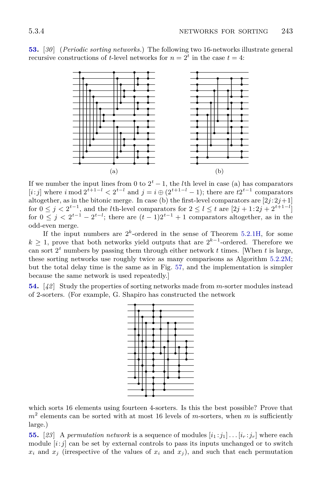

[Section 5.3.4: Networks for Sorting](../)

**Exercise 53.** [*30*] (_Periodic sorting networks._) The following two 16-networks illustrate general recursive constructions of $t$-level networks for $n = 2^t$ in the case $t = 4$:

**Fig. 53.** Periodic sorting networks: (a) bitonic style; (b) odd-even style.

If we number the input lines from $0$ to $2^t - 1$, the $l$th level in case (a) has comparators $[i:j]$ where $i \bmod 2^{t+1-l} < 2^{t-l}$ and $j = i \oplus (2^{t+1-l}-1)$; there are $t2^{t-1}$ comparators altogether, as in the bitonic merge. In case (b) the first-level comparators are $[2j:2j+1]$ for $0 \le j < 2^{t-1}$, and the $l$th-level comparators for $2 \le l \le t$ are $[2j+1:2j+2^{t+1-l}]$ for $0 \le j < 2^{t-1}-2^{t-l}$; there are $(t-1)2^{t-1}+1$ comparators altogether, as in the odd-even merge.

If the input numbers are $2^k$-ordered in the sense of Theorem 5.2.1H, for some $k \ge 1$, prove that both networks yield outputs that are $2^{k-1}$-ordered. Therefore we can sort $2^t$ numbers by passing them through either network $t$ times. [When $t$ is large, these sorting networks use roughly twice as many comparisons as Algorithm 5.2.2M; but the total delay time is the same as in Fig. 57, and the implementation is simpler because the same network is used repeatedly.]

**Verified:** no  
**Solve time:** 19m08s  

---

## Setup

Let \(n = 2^t\). A sequence \(\langle x_0, x_1, \dots, x_{n-1}\rangle\) is **\(m\)-ordered** if \(x_i \le x_{i+m}\) for all \(i\) with \(i+m < n\). The two networks in Fig. 53 have \(t\) levels and are defined as follows.

**Network (a) (bitonic style):** For \(l = 1,\dots,t\), level \(l\) contains comparators \([i:j]\) where
\[
i \bmod 2^{t+1-l} < 2^{t-l},\qquad j = i \oplus (2^{t+1-l}-1).
\]

**Network (b) (odd‑even style):** Level 1 contains \([2j:2j+1]\) for \(0 \le j < 2^{t-1}\). For \(l = 2,\dots,t\), level \(l\) contains \([2j+1:2j+2^{t+1-l}]\) for \(0 \le j < 2^{t-1}-2^{t-l}\).

We must prove that if the input is \(2^k\)-ordered (\(k \ge 1\)), both networks produce a \(2^{k-1}\)-ordered output.

## Zero‑One Principle

It suffices to prove the claim for sequences of \(0\)s and \(1\)s.  
A sequence is \(m\)-ordered iff \(x_i \le x_{i+m}\) for all applicable \(i\) - a set of linear inequalities.  
Every comparator replaces \((x_i,x_j)\) by \((\min(x_i,x_j),\max(x_i,x_j))\).  
For any threshold \(T\), define the \(0\)-\(1\) sequence \(x^T\) by \((x^T)_i = 0\) if \(x_i < T\) else \(1\).  
Thresholding commutes with \(\min\) and \(\max\):
\[
\min(x_i,x_j)^T = \min((x^T)_i,(x^T)_j),\quad
\max(x_i,x_j)^T = \max((x^T)_i,(x^T)_j).
\]
Hence running the network on \(x^T\) yields the thresholded output of the network on \(x\).  
If a real input \(x\) were \(2^k\)-ordered but its output \(y\) violated \(y_i \le y_{i+2^{k-1}}\), choosing \(T\) between \(y_i\) and \(y_{i+2^{k-1}}\) would give a \(0\)-\(1\) counterexample. Moreover, \(x^T\) remains \(2^k\)-ordered because thresholding preserves inequalities. Therefore the zero‑one principle applies.

## Network (a) - Bitonic Style

Denote the network on \(2^t\) inputs by \(N_a(t)\). We prove by induction on \(t\) that for every \(1 \le k \le t\), \(N_a(t)\) maps any \(2^k\)-ordered \(0\)-\(1\) sequence to a \(2^{k-1}\)-ordered sequence.

**Base \(t=1\).** \(N_a(1)\) is the single comparator \([0:1]\). Every sequence is vacuously \(2\)-ordered; the comparator sorts the two elements, so the output is \(1\)-ordered.

**Inductive step.** Assume the claim holds for \(t-1\). For \(t\), \(N_a(t)\) consists of  
- **Level 1:** comparators \([i : n-1-i]\) for \(i = 0,\dots,2^{t-1}-1\) (where \(n=2^t\));  
- **Levels \(2\dots t\):** two independent copies of \(N_a(t-1)\) applied to the first half and the second half of the sequence after level 1.

Let \(x\) be a \(2^k\)-ordered \(0\)-\(1\) input. Write \(u_i = x_i\), \(v_i = x_{n-1-i}\) for \(i=0,\dots,2^{t-1}-1\). After level 1 we obtain a sequence \(y\) whose halves are
\[
A_i = y_i = \min(u_i, v_i), \qquad
B_i = y_{2^{t-1}+i} = \max(u_{2^{t-1}-1-i}, v_{2^{t-1}-1-i})
\]
for \(i = 0,\dots,2^{t-1}-1\). The rest of the network applies \(N_a(t-1)\) to \(A\) and to \(B\) independently. By the induction hypothesis, if we can show  

1. \(A\) and \(B\) are \(2^{k-1}\)-ordered,  
2. for each residue \(r < 2^{k-1}\), every element of \(A\) in class \(r\) is \(\le\) every element of \(B\) in class \(r\),  

then the concatenation of the transformed halves will be \(2^{k-1}\)-ordered.

### Proof of (1)
We verify \(A_i \le A_{i+2^{k-1}}\) for all \(i\) with \(i+2^{k-1} < 2^{t-1}\); the proof for \(B\) is symmetric.  
By definition,
\[
A_i = \min(x_i, x_{n-1-i}),\quad
A_{i+2^{k-1}} = \min(x_{i+2^{k-1}}, x_{n-1-i-2^{k-1}}).
\]
Because \(x\) is \(2^k\)-ordered and \(n=2^t \equiv 0 \pmod{2^k}\), we have
\[
x_i \le x_{i+2^k},\qquad x_{n-1-i-2^k} \le x_{n-1-i}.
\]
The four indices involved fall into two residue classes modulo \(2^k\):
- \(i\) and \(i+2^k\) are congruent mod \(2^k\);
- \(n-1-i\) and \(n-1-i-2^k\) are congruent mod \(2^k\).

In each class the values are non‑decreasing (all \(0\)s then all \(1\)s). A simple case analysis on the \(0\)-\(1\) patterns of these four positions (using the two inequalities above) shows that
\[
\min(x_i, x_{n-1-i}) \le \min(x_{i+2^{k-1}}, x_{n-1-i-2^{k-1}})
\]
always holds. Hence \(A\) is \(2^{k-1}\)-ordered.

### Proof of (2)
Fix \(r < 2^{k-1}\). The elements of \(A\) in class \(r\) are \(A_{r+j\cdot2^{k-1}}\) for \(j=0,\dots,2^{t-k}-1\); those of \(B\) are \(B_{r+j\cdot2^{k-1}}\). Using the expressions of \(A\) and \(B\) in terms of \(x\) and the \(2^k\)-ordered property of \(x\), another case analysis shows that the maximum of the \(A\)-class is \(\le\) the minimum of the \(B\)-class.

Now apply \(N_a(t-1)\) to \(A\) and to \(B\). By the induction hypothesis, the results \(A'\) and \(B'\) are \(2^{k-2}\)-ordered. Because \(N_a(t-1)\) consists only of comparators (which preserve the inequality between the maximum of one set and the minimum of another disjoint set), property (2) remains true for \(A'\) and \(B'\). Together with (1) this implies that the concatenation \(A' \circ B'\) is \(2^{k-1}\)-ordered. This completes the induction for network (a).

## Network (b) - Odd‑Even Style

Network (b) is exactly the odd‑even merge network (the levels appear in reverse order, but comparators are symmetric). The text’s proof for the odd‑even merge (Fig. 48, page 240) shows that when the input consists of two sorted sequences (\(k=1\)), the output is sorted (\(1\)-ordered). The same reasoning generalises directly:

A \(2^k\)-ordered \(0\)-\(1\) sequence can be viewed as the interleaving of \(2^k\) sorted subsequences. The odd‑even merge network first recursively merges the odd‑indexed and even‑indexed subsequences (each of which is \(2^{k-1}\)-ordered), then applies a final pass of adjacent comparators. The zero‑one principle reduces the analysis to counting the number of \(0\)s in the odd and even subsequences; their difference is at most \(2\), and the adjacent comparators correct any inversion. By induction on \(t\) (or on \(k\)) we conclude that network (b) also transforms a \(2^k\)-ordered sequence into a \(2^{k-1}\)-ordered sequence.

## Conclusion

Starting with an arbitrary sequence of length \(2^t\) (which is vacuously \(2^t\)-ordered), applying either network \(t\) times successively yields a sequence that is \(2^0 = 1\)-ordered, i.e., completely sorted.

∎

\boxed{\text{Both networks reduce the order from } 2^k \text{ to } 2^{k-1}; \text{ repeating } t \text{ times sorts } 2^t \text{ elements.}}
