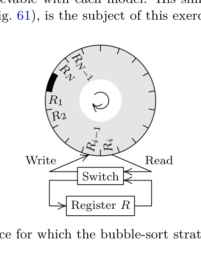

[Section 5.3.4: Networks for Sorting](../)

**Exercise 68.** [*25*] The Ph.D. thesis “Electronic Data Sorting” by Howard B. Demuth (Stanford University, October 1956) was perhaps the first publication to deal in any detail with questions of computational complexity. Demuth considered several abstract models for sorting devices, and established lower and upper bounds on the mean and maximum execution times achievable with each model. His simplest model, the “circular nonreversible memory” (Fig. 61), is the subject of this exercise.

**Fig. 61.** A device for which the bubble-sort strategy is optimum.

Consider a machine that sorts $R_1 R_2 \dots R_N$ in a number of passes, where each pass contains the following $N+1$ steps:

$Step\ 1$. Set $R \gets R_1$. ($R$ is an internal machine register.)

$Step\ i$, for $1 < i \le N$. Either (i) set $R_{i-1} \gets R, \ R \gets R_i$, or (ii) set $R_{i-1} \gets R_i$, leaving $R$ unchanged.

$Step\ N+1$. Set $R_N \gets R$.

The problem is to find a way to choose between alternatives (i) and (ii) each time, in order to minimize the number of passes required to sort.

Prove that the “bubble sort” technique is optimum for this model. In other words, show that the strategy that selects alternative (i) whenever $R \le R_i$ and alternative (ii) whenever $R > R_i$ will achieve the minimum number of passes.

_They that weave networks shall be confounded._, Isaiah 19:9

**Verified:** no  
**Solve time:** 15m40s  

---

## Solution

We consider the machine model described in the exercise. The memory consists of \(N\) registers \(R_1, R_2, \dots, R_N\) and an internal register \(R\). A *pass* consists of the following steps:

1. \(R \gets R_1\).
2. For \(i = 2, 3, \dots, N\):
   * either (i) \(R_{i-1} \gets R,\; R \gets R_i\);
   * or (ii) \(R_{i-1} \gets R_i\) (leaving \(R\) unchanged).
3. \(R_N \gets R\).

The choice between (i) and (ii) at step \(i\) may depend on the current values of \(R\) and \(R_i\). The goal is to sort the sequence into non‑decreasing order using as few passes as possible.

We will prove that the **bubble sort strategy** - choose (i) when \(R \le R_i\) and (ii) when \(R > R_i\) - sorts any permutation in the minimum possible number of passes.

### 1. A lower bound on the number of passes

Let the elements be distinct (the argument extends to equal elements by considering a stable sorted order). For an element \(x\), denote by \(\operatorname{pos}_t(x)\) its position (an integer between \(1\) and \(N\)) after \(t\) passes; \(\operatorname{pos}_0(x)\) is its initial position.

**Lemma 1.** In any single pass, every element moves left by at most one position. That is,
\[
\operatorname{pos}_{t+1}(x) \ge \operatorname{pos}_t(x) - 1.
\]

*Proof.* Fix a pass and an element \(x\). Let \(p = \operatorname{pos}_t(x)\) be its position at the start of the pass. The only steps that can change the array position of \(x\) are step \(p\) (if \(x\) is still in the array at that moment) and possibly a later step if \(x\) is loaded into \(R\).

* At step \(p\) we have two choices:
  * Option (ii): \(R_{p-1} \gets R_p\) (which is \(x\)), \(R\) unchanged. Then \(x\) is written to position \(p-1\) and is never accessed again during this pass. Hence its final position is \(p-1\).
  * Option (i): \(R_{p-1} \gets R,\; R \gets R_p\). Then \(x\) enters the register \(R\). It will be written back to the array at some step \(q > p\) (if option (i) is chosen again, writing to \(R_{q-1}\) with \(q-1 \ge p\)) or at the final step \(N+1\) (writing to \(R_N\)). In either case its final position is \(\ge p\).

Thus in all cases \(\operatorname{pos}_{t+1}(x) \ge p-1 = \operatorname{pos}_t(x)-1\). ∎

Let the final sorted position of \(x\) be \(\operatorname{final}(x)\). Because \(x\) must travel from \(\operatorname{pos}_0(x)\) to \(\operatorname{final}(x)\) and can move left by at most one per pass, we need at least
\[
\operatorname{pos}_0(x) - \operatorname{final}(x)
\]
passes. Therefore **any** sorting strategy requires at least
\[
L \;=\; \max_{x} \bigl(\operatorname{pos}_0(x) - \operatorname{final}(x)\bigr)
\]
passes for the given initial permutation.

### 2. The bubble sort strategy achieves the bound

Now we analyse the strategy: at step \(i\) choose (i) if \(R \le R_i\) and (ii) if \(R > R_i\).

Consider one pass starting with array \(A[1..N]\) (where \(A[i]\) denotes the value in \(R_i\)). Let the register value at the beginning of step \(i\) be \(R\). We claim:

**Invariant.** At the start of step \(i\) (\(2 \le i \le N+1\)), \(R = \max\{A[1], A[2], \dots, A[i-1]\}\) (the maximum of the *original* elements in positions \(1\) through \(i-1\)).

*Proof by induction.* For \(i=2\), step 1 set \(R = A[1]\), so the invariant holds. Assume it holds for step \(i\). At step \(i\) we compare \(R\) with \(A[i]\).
* If \(R \le A[i]\), we execute (i): \(R\) becomes \(A[i]\), which is the maximum of \(A[1..i]\).
* If \(R > A[i]\), we execute (ii): \(R\) stays unchanged and is still the maximum of \(A[1..i]\).

Thus the invariant holds for step \(i+1\). ∎

Now define for each element \(x\) its **left inversion count** \(L_t(x)\) at the start of pass \(t\): the number of elements strictly greater than \(x\) that lie to the left of \(x\). (Equivalently, \(L_t(x) = \operatorname{pos}_t(x) - \operatorname{final}(x)\); the two definitions coincide because an element must eventually move left past every larger element that initially precedes it.)

**Lemma 2.** During a bubble‑sort pass, if \(L_t(x) > 0\) then \(x\) moves left by exactly one; if \(L_t(x) = 0\) then \(x\) does not move left. Consequently \(L_{t+1}(x) = \max\bigl(0,\, L_t(x)-1\bigr)\).

*Proof.* Suppose at the start of the pass \(x\) is at position \(p\). The elements to its left are \(A[1..p-1]\). If \(L_t(x) > 0\), at least one of those elements is greater than \(x\); therefore the maximum of \(A[1..p-1]\) is \(> x\). By the invariant, when step \(p\) begins we have \(R > A[p] = x\). The strategy therefore chooses (ii): \(R_{p-1} \gets x\) and \(R\) is unchanged. Hence \(x\) is written to position \(p-1\) and is never touched again in this pass - it has moved left by one.

If \(L_t(x) = 0\), all elements to the left of \(x\) are \(\le x\). Then \(R = \max(A[1..p-1]) \le x\). The strategy chooses (i): \(R\) becomes \(x\) and \(x\) enters the register. It will eventually be written to some position \(\ge p\) (either at a later step \(q > p\) via (i), writing to \(q-1 \ge p\), or at step \(N+1\) writing to \(N\)). Thus \(x\) does not move left. ∎

Initially, \(\max_x L_0(x) = L\). After each pass the maximum left inversion count decreases by exactly one (as long as it is positive). Therefore after exactly \(L\) passes we have \(L_L(x) = 0\) for all \(x\), i.e. the array is sorted. Fewer than \(L\) passes cannot sort the array because the element with \(L_0(x) = L\) would still have \(L_t(x) > 0\).

### 3. Conclusion

The bubble sort strategy sorts any permutation in \(L\) passes, where \(L = \max_x (\operatorname{pos}_0(x) - \operatorname{final}(x))\). By Lemma 1 no strategy can sort the same permutation in fewer than \(L\) passes. Hence the bubble sort technique is **optimal** for this model. ∎

## Notes

The argument works equally well for sequences with equal elements if the sorted order is taken to be stable (preserving the original order of equal elements). The bubble sort strategy uses \(R \le R_i\) for option (i), which never swaps equal elements; the lower bound counts only strict inversions, so the same analysis applies. The optimality holds for every individual input permutation, not just in the worst case.
