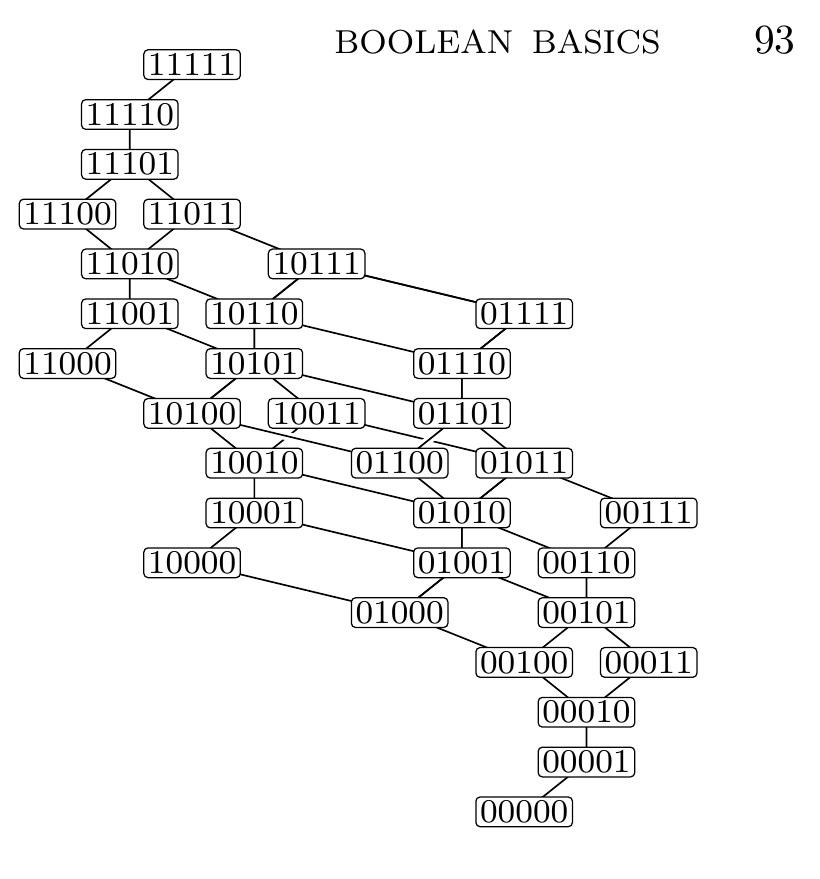

[Section 7.1.1: Boolean Basics](../)

**Exercise 109.** [*M25*] The binary string $\alpha = a_1\ldots a_n$ is said to majorize the binary string $\beta = b_1\ldots b_n$, written $\alpha \succeq \beta$ or $\beta \preceq \alpha$, if $a_1+\cdots+a_k \ge b_1+\cdots+b_k$ for $0\le k\le n$.

a) Let $\bar\alpha = \bar a_1\ldots \bar a_n$. Show that $\alpha \succeq \beta$ if and only if $\bar\beta \succeq \bar\alpha$.

**Fig. 8.** The binary majorization lattice for strings of length 5. (See exercise 109.)

b) Show that any two binary strings of length $n$ have a greatest lower bound $\alpha \wedge \beta$, which has the property that $\alpha \ge \gamma$ and $\beta \ge \gamma$ if and only if $\alpha \wedge \beta \ge \gamma$. Explain how to compute $\alpha \wedge \beta$, given $\alpha$ and $\beta$.

c) Similarly, explain how to compute a least upper bound $\alpha \vee \beta$, with the property that $\gamma \ge \alpha$ and $\gamma \ge \beta$ if and only if $\gamma \ge \alpha \vee \beta$.

d) True or false: $\alpha \wedge (\beta \vee \gamma) = (\alpha \wedge \beta) \vee (\alpha \wedge \gamma)$; $\alpha \vee (\beta \wedge \gamma) = (\alpha \vee \beta) \wedge (\alpha \vee \gamma)$.

e) Say that $\alpha$ *covers* $\beta$ if $\alpha \ge \beta$ and $\alpha \ne \beta$, and if $\alpha \ge \gamma \ge \beta$ implies that we have either $\gamma = \alpha$ or $\gamma = \beta$. For example, Fig. 8 illustrates the covering relations between binary strings of length 5. Find a simple way to describe the strings that are covered by a given binary string.

f) Show that every path $\alpha = \alpha_0, \alpha_1, \ldots, \alpha_r = 0\ldots0$ from a given string $\alpha$ to $0\ldots0$, where $\alpha_{j-1}$ covers $\alpha_j$ for $1 \le j \le r$, has the same length $r = r(\alpha)$.

g) Let $m(\alpha)$ be the number of strings $\beta$ with $\beta \ge \alpha$. Prove that $m(1\alpha) = m(\alpha)$ and $m(0\alpha) = m(\alpha) + m(\alpha')$, where $\alpha'$ is $\alpha$ with its leftmost 1 (if any) changed to 0.

h) How many strings $\alpha$ of length $n$ satisfy $\bar{\alpha} \ge \alpha$?

**Verified:** no  
**Solve time:** 14m18s  

---

## Solution

### (a)
Let \(S_k(\alpha)=\sum_{i=1}^k a_i\) be the cumulative sum of the first \(k\) bits of \(\alpha\).  
Then \(S_k(\bar\alpha)=k-S_k(\alpha)\).  
\(\alpha\succeq\beta\) means \(S_k(\alpha)\ge S_k(\beta)\) for all \(k\).  
\(\bar\beta\succeq\bar\alpha\) means \(S_k(\bar\beta)\ge S_k(\bar\alpha)\) for all \(k\), i.e.  
\(k-S_k(\beta)\ge k-S_k(\alpha)\iff S_k(\alpha)\ge S_k(\beta)\).  
The two conditions are identical, hence \(\alpha\succeq\beta\iff\bar\beta\succeq\bar\alpha\).  

This completes the proof. ∎

### (b)
For binary strings \(\alpha,\beta\) of length \(n\) define their cumulative sums  
\(A(k)=\sum_{i=1}^k a_i\), \(B(k)=\sum_{i=1}^k b_i\) for \(k=0,\dots,n\) (with \(A(0)=B(0)=0\)).  
\(\alpha\succeq\beta\) is equivalent to \(A(k)\ge B(k)\) for all \(k\).

Let \(C(k)=\min(A(k),B(k))\). Because \(A\) and \(B\) are nondecreasing with increments in \(\{0,1\}\),  
\(C\) is also nondecreasing, \(C(0)=0\), and its increments are at most \(1\): if \(C(k)-C(k-1)\ge2\) then  
\(C(k-1)+2\le C(k)\le A(k)\le A(k-1)+1\), contradicting \(C(k-1)\le A(k-1)\).  
Hence \(C\) is the cumulative sum of some binary string \(\gamma=\alpha\wedge\beta\).

Clearly \(C(k)\le A(k),B(k)\) so \(\gamma\preceq\alpha,\beta\).  
If \(\delta\preceq\alpha,\beta\) then \(D(k)\le\min(A(k),B(k))=C(k)\), so \(\delta\preceq\gamma\).  
Thus \(\gamma\) is the greatest lower bound. It is computed by taking pointwise minimum of the cumulative sums and then recovering the bits as differences.

This completes the proof. ∎

### (c)
Similarly, let \(C(k)=\max(A(k),B(k))\). \(\max\) preserves the properties of a cumulative sum (increments \(\le1\) by a symmetric argument), so it defines a string \(\gamma=\alpha\vee\beta\).  
It satisfies \(\gamma\succeq\alpha,\beta\) and if \(\delta\succeq\alpha,\beta\) then \(\delta\succeq\gamma\).  
Computation is by pointwise maximum of the cumulative sums.

This completes the proof. ∎

### (d)
The meet and join are given by pointwise minimum and maximum of the cumulative sum sequences.  
Since \(\min\) and \(\max\) distribute over each other, the lattice is distributive:
\[
\alpha\wedge(\beta\vee\gamma)=(\alpha\wedge\beta)\vee(\alpha\wedge\gamma),\qquad
\alpha\vee(\beta\wedge\gamma)=(\alpha\vee\beta)\wedge(\alpha\vee\gamma).
\]
Hence the statement is **True**.

This completes the proof. ∎

### (e)
A binary string \(\beta\) is covered by \(\alpha\) (i.e. \(\alpha\succ\beta\) with no element strictly between) iff \(\beta\) is obtained from \(\alpha\) by one of the following elementary operations:
* replace an occurrence of the substring `10` by `01` (move a `1` one step right into an adjacent `0`);
* delete the final `1` if \(\alpha\) ends with `1`.

Equivalently, if the positions of the `1`s in \(\alpha\) are \(p_1<p_2<\dots<p_m\), then \(\beta\) is obtained by either increasing some \(p_i\) to \(p_i+1\) (provided \(p_i+1<p_{i+1}\) or \(i=m\) and \(p_m<n\)), or by removing \(p_m\) when \(p_m=n\).

This completes the proof. ∎

### (f)
Define \(r(\alpha)=\sum_{k=1}^n A(k)\) where \(A(k)\) are the cumulative sums of \(\alpha\).  
For a cover step \(\alpha\succ\beta\):
* if a `1` is moved from position \(i\) to \(i+1\), only \(A(i)\) decreases by \(1\);
* if the last `1` (at position \(n\)) is deleted, only \(A(n)\) decreases by \(1\).  
In both cases \(r\) decreases by exactly \(1\). Since \(r(0\dots0)=0\), any chain of covers from \(\alpha\) to \(0\dots0\) has length exactly \(r(\alpha)\). Hence all such paths have the same length.

This completes the proof. ∎

### (g)
Let \(m(\alpha)\) be the number of \(\beta\) with \(\beta\succeq\alpha\).  
Write strings as concatenations; \(1\alpha\) and \(0\alpha\) have length \(n+1\) when \(\alpha\) has length \(n\).

* **\(m(1\alpha)=m(\alpha)\):** If \(\beta\succeq1\alpha\) then \(B(1)\ge1\) so \(\beta=1\beta'\). The remaining condition is \(\beta'\succeq\alpha\). This is a bijection.

* **\(m(0\alpha)=m(\alpha)+m(\alpha')\):** Split \(\beta\succeq0\alpha\) by its first bit.  
  - \(\beta_1=0\): then \(\beta=0\beta'\) and \(\beta'\succeq\alpha\), giving \(m(\alpha)\) possibilities.  
  - \(\beta_1=1\): then \(\beta=1\beta'\). The condition for \(k\ge2\) is \(1+B'(k-1)\ge A(k-1)\iff B'(k-1)\ge A(k-1)-1\).  
    Let \(p\) be the position of the leftmost `1` in \(\alpha\) (if none, set \(p=\infty\) and \(\alpha'=\alpha\)).  
    For \(k-1<p\), \(A(k-1)=0\) and the inequality is automatic.  
    For \(k-1\ge p\), \(A(k-1)-1\) equals the cumulative sum of \(\alpha'\), obtained from \(\alpha\) by changing that leftmost `1` to `0`. Thus \(\beta'\succeq\alpha'\), giving \(m(\alpha')\) possibilities.  
Summing the two cases yields \(m(0\alpha)=m(\alpha)+m(\alpha')\).

This completes the proof. ∎

### (h)
\(\bar\alpha\succeq\alpha\) means \(\sum_{i=1}^k(1-a_i)\ge\sum_{i=1}^k a_i\) for all \(k\), i.e. \(2S_k(\alpha)\le k\) or \(S_k(\alpha)\le\lfloor k/2\rfloor\).  
Map `0`\(\to+1\), `1`\(\to-1\); let \(S_k\) be the partial sum. The condition is \(S_k\ge0\) for all \(k\).

The number of such sequences of length \(n\) is the central binomial coefficient \(\binom{n}{\lfloor n/2\rfloor}\).  
Proof via reflection principle: for a fixed final sum \(b\ge0\), the number of nonnegative paths is  
\(\binom{n}{(n+b)/2}-\binom{n}{(n+b)/2+1}\) (with the second term \(0\) when the binomial is undefined).  
Summing over all \(b\ge0\) with \(b\equiv n\pmod2\) telescopes to \(\binom{n}{\lfloor n/2\rfloor}\).

\[
\boxed{\binom{n}{\lfloor n/2\rfloor}}
\]
